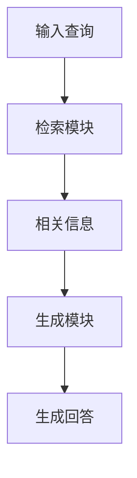

# 【LangChain编程：从入门到实践】LangChain中的RAG组件

## 1.背景介绍

在现代人工智能和自然语言处理领域，生成式预训练模型（如GPT-3）已经展示了其强大的语言生成能力。然而，这些模型在处理特定任务时，往往需要结合外部知识库来提高准确性和实用性。LangChain作为一个新兴的框架，提供了丰富的组件来实现这一目标，其中RAG（Retrieval-Augmented Generation）组件尤为重要。本文将深入探讨LangChain中的RAG组件，帮助读者理解其核心概念、算法原理、数学模型、实际应用以及未来发展趋势。

## 2.核心概念与联系

### 2.1 LangChain简介

LangChain是一个专注于自然语言处理和生成的框架，旨在简化复杂的语言任务。它提供了多种组件和工具，帮助开发者快速构建和部署高效的NLP应用。

### 2.2 RAG组件概述

RAG（Retrieval-Augmented Generation）是一种结合检索和生成的技术，通过从外部知识库中检索相关信息来增强生成模型的输出。RAG组件在LangChain中扮演着关键角色，能够显著提高生成结果的准确性和相关性。

### 2.3 RAG的核心联系

RAG的核心思想是将检索和生成两个过程紧密结合。首先，通过检索模块从知识库中获取相关信息，然后将这些信息输入到生成模型中，以生成更加准确和有用的回答。

## 3.核心算法原理具体操作步骤

### 3.1 检索模块

检索模块负责从知识库中获取与输入查询相关的信息。常用的检索方法包括TF-IDF、BM25以及基于深度学习的向量检索。

### 3.2 生成模块

生成模块使用预训练的生成模型（如GPT-3）来生成回答。生成模型会将检索到的信息作为上下文输入，从而生成更加准确和相关的回答。

### 3.3 RAG的工作流程

以下是RAG的工作流程的Mermaid流程图：



## 4.数学模型和公式详细讲解举例说明

### 4.1 检索模型

检索模型通常使用向量空间模型来表示文档和查询。假设有一个文档集合 $D = \{d_1, d_2, ..., d_n\}$，每个文档 $d_i$ 被表示为一个向量 $\mathbf{d_i}$。查询 $q$ 也被表示为一个向量 $\mathbf{q}$。检索的目标是找到与查询最相关的文档，这可以通过计算查询向量和文档向量之间的相似度来实现。

相似度计算公式：
$$
\text{sim}(\mathbf{q}, \mathbf{d_i}) = \frac{\mathbf{q} \cdot \mathbf{d_i}}{\|\mathbf{q}\| \|\mathbf{d_i}\|}
$$

### 4.2 生成模型

生成模型使用条件概率来生成回答。假设检索到的相关信息为 $R = \{r_1, r_2, ..., r_k\}$，生成模型的目标是生成回答 $A$，使得条件概率 $P(A|Q, R)$ 最大化。

生成模型的公式：
$$
P(A|Q, R) = \prod_{t=1}^{T} P(a_t | a_{<t}, Q, R)
$$
其中，$a_t$ 表示回答的第 $t$ 个词，$a_{<t}$ 表示回答的前 $t-1$ 个词。

## 5.项目实践：代码实例和详细解释说明

### 5.1 环境配置

首先，确保安装了LangChain和相关依赖：

```bash
pip install langchain
pip install transformers
pip install faiss-cpu
```

### 5.2 检索模块实现

以下是一个简单的检索模块实现示例：

```python
from langchain.retrievers import TFIDFRetriever

# 初始化检索器
retriever = TFIDFRetriever()

# 加载文档
documents = ["文档1内容", "文档2内容", "文档3内容"]
retriever.add_documents(documents)

# 输入查询
query = "查询内容"

# 检索相关信息
related_docs = retriever.retrieve(query)
print(related_docs)
```

### 5.3 生成模块实现

以下是一个生成模块实现示例：

```python
from transformers import GPT2LMHeadModel, GPT2Tokenizer

# 初始化生成模型
model_name = "gpt2"
model = GPT2LMHeadModel.from_pretrained(model_name)
tokenizer = GPT2Tokenizer.from_pretrained(model_name)

# 输入上下文
context = "相关信息内容"

# 生成回答
input_ids = tokenizer.encode(context, return_tensors='pt')
output = model.generate(input_ids, max_length=50)
answer = tokenizer.decode(output[0], skip_special_tokens=True)
print(answer)
```

### 5.4 RAG组件整合

将检索和生成模块整合在一起，实现RAG组件：

```python
class RAG:
    def __init__(self, retriever, generator):
        self.retriever = retriever
        self.generator = generator

    def generate_answer(self, query):
        related_docs = self.retriever.retrieve(query)
        context = " ".join(related_docs)
        input_ids = self.generator.tokenizer.encode(context, return_tensors='pt')
        output = self.generator.model.generate(input_ids, max_length=50)
        answer = self.generator.tokenizer.decode(output[0], skip_special_tokens=True)
        return answer

# 初始化RAG组件
rag = RAG(retriever, generator)
query = "查询内容"
answer = rag.generate_answer(query)
print(answer)
```

## 6.实际应用场景

### 6.1 客服系统

RAG组件可以用于构建智能客服系统，通过结合知识库中的信息，提供更加准确和详细的回答。

### 6.2 医疗问答

在医疗领域，RAG组件可以帮助医生和患者快速获取相关的医学知识和建议。

### 6.3 教育辅导

RAG组件可以用于在线教育平台，提供个性化的学习建议和解答学生的问题。

## 7.工具和资源推荐

### 7.1 LangChain官方文档

LangChain的官方文档提供了详细的使用指南和API参考，是学习和使用LangChain的最佳资源。

### 7.2 预训练模型

使用预训练的生成模型（如GPT-3）可以显著提高生成结果的质量。推荐使用Hugging Face的Transformers库来加载和使用这些模型。

### 7.3 向量检索工具

FAISS是一个高效的向量检索库，适用于大规模的向量检索任务。可以结合LangChain中的检索模块使用。

## 8.总结：未来发展趋势与挑战

### 8.1 发展趋势

随着自然语言处理技术的不断进步，RAG组件在各个领域的应用前景广阔。未来，RAG组件将更加智能化和高效，能够处理更加复杂的任务。

### 8.2 挑战

尽管RAG组件具有强大的功能，但在实际应用中仍然面临一些挑战。例如，如何处理大规模知识库中的噪声信息，如何提高生成结果的多样性和准确性等。

## 9.附录：常见问题与解答

### 9.1 RAG组件的性能如何评估？

RAG组件的性能可以通过评估检索模块和生成模块的效果来综合评估。常用的评估指标包括检索的准确率、召回率以及生成结果的BLEU分数等。

### 9.2 如何优化RAG组件的性能？

可以通过优化检索算法、使用更强大的生成模型以及结合多种信息源来提高RAG组件的性能。

### 9.3 RAG组件是否适用于所有NLP任务？

RAG组件适用于需要结合外部知识库的NLP任务，但对于一些不需要外部知识的任务，单独使用生成模型可能更加高效。

---

作者：禅与计算机程序设计艺术 / Zen and the Art of Computer Programming