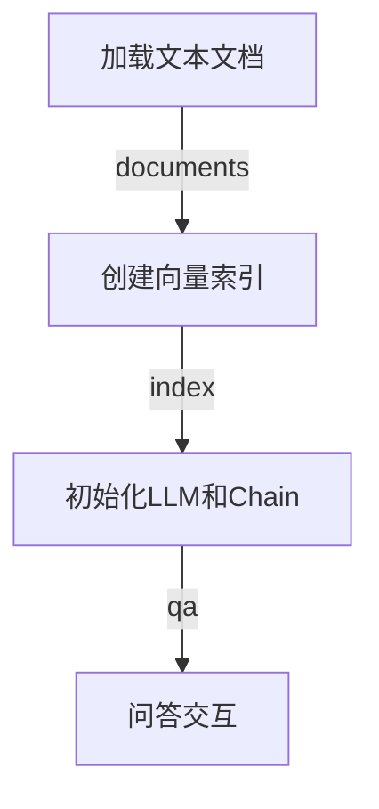

# 【LangChain编程：从入门到实践】快速开始

## 1. 背景介绍

### 1.1 人工智能的崛起

在过去几十年里，人工智能(Artificial Intelligence, AI)已经从一个遥远的概念发展成为一个无处不在的现实。从语音助手到自动驾驶汽车，AI 正在渗透到我们生活的方方面面。然而,AI 的真正力量并不仅限于此。它还可以帮助我们解决一些最棘手的问题,包括自然语言处理、知识图谱构建、决策优化等。

### 1.2 LangChain 的诞生

为了解决这些复杂的 AI 挑战,LangChain 应运而生。LangChain 是一个强大的 Python 库,旨在帮助开发人员构建可扩展的人工智能应用程序。它提供了一种统一的方式来组合大型语言模型(LLM)、数据源和其他AI组件,从而创建复杂的工作流程。

### 1.3 LangChain 的优势

LangChain 的优势在于它的模块化设计和可扩展性。它允许开发人员轻松地集成不同的 LLM、数据源和其他 AI 组件,而不必从头开始构建整个系统。这使得开发人员可以专注于解决特定的业务问题,而不必过多关注底层基础设施。

## 2. 核心概念与联系

### 2.1 LLM(大型语言模型)

LangChain 的核心是大型语言模型(LLM)。LLM 是一种基于深度学习的自然语言处理模型,能够生成人类可读的文本。LangChain 支持多种流行的 LLM,包括 GPT-3、BERT、RoBERTa 等。

### 2.2 Agents(智能代理)

Agents 是 LangChain 中的一个重要概念。它们是封装了 LLM 和其他组件的智能系统,能够执行复杂的任务。Agents 可以根据用户的输入自动规划和执行一系列操作,从而实现特定的目标。

### 2.3 Chains(链)

Chains 是 LangChain 中的另一个核心概念。它们是一系列预定义的步骤,用于处理特定类型的任务。Chains 可以包含 LLM、Agents 以及其他组件,并按照特定的顺序执行它们。

### 2.4 Prompts(提示)

Prompts 是向 LLM 提供的输入,用于指导它生成所需的输出。LangChain 提供了多种方式来构建和管理 Prompts,包括模板化、注入和优化等。

### 2.5 Memory(记忆)

Memory 是 LangChain 中用于存储和检索信息的组件。它允许 Agents 和 Chains 在执行任务时记住和利用之前的上下文信息,从而提高整体性能和一致性。

### 2.6 工具

工具是 LangChain 中用于执行特定任务的组件,例如网页抓取、数据库查询、文件操作等。Agents 可以利用这些工具来完成复杂的任务。

## 3. 核心算法原理具体操作步骤

### 3.1 LLM 选择和微调

LangChain 支持多种流行的 LLM,如 GPT-3、BERT、RoBERTa 等。选择合适的 LLM 对于构建高质量的 AI 应用程序至关重要。此外,LangChain 还提供了微调 LLM 的功能,以便更好地适应特定的任务和数据集。

### 3.2 Prompt 工程

Prompt 工程是 LangChain 中一个关键的步骤。良好的 Prompts 可以显著提高 LLM 的性能和输出质量。LangChain 提供了多种技术来构建和优化 Prompts,包括模板化、注入、搜索和反馈等。

### 3.3 Agent 构建

Agent 是 LangChain 中最强大的概念之一。它们可以根据用户的输入自动规划和执行一系列操作,从而实现复杂的目标。构建 Agent 通常涉及以下步骤:

1. 定义 Agent 的目标和能力
2. 选择合适的 LLM 和其他组件
3. 构建 Prompts 和工具
4. 实现 Agent 的决策逻辑
5. 训练和优化 Agent

### 3.4 Chain 构建

Chains 是 LangChain 中预定义的任务流程。它们可以包含 LLM、Agents 以及其他组件,并按照特定的顺序执行它们。构建 Chain 通常涉及以下步骤:

1. 确定任务的具体需求
2. 选择合适的 LLM、Agents 和其他组件
3. 定义 Chain 的执行流程
4. 实现 Chain 的逻辑
5. 测试和优化 Chain

### 3.5 Memory 管理

Memory 是 LangChain 中用于存储和检索信息的组件。它允许 Agents 和 Chains 在执行任务时记住和利用之前的上下文信息,从而提高整体性能和一致性。LangChain 提供了多种内存实现,如向量存储、关系数据库和键值存储等。

### 3.6 工具集成

工具是 LangChain 中用于执行特定任务的组件,例如网页抓取、数据库查询、文件操作等。Agents 可以利用这些工具来完成复杂的任务。LangChain 提供了一个灵活的框架,允许开发人员轻松地集成自定义工具。

## 4. 数学模型和公式详细讲解举例说明

在 LangChain 中,数学模型和公式主要用于 LLM 的训练和微调。LLM 通常基于transformer 架构,使用自注意力机制来捕捉输入序列中的长程依赖关系。

### 4.1 Transformer 架构

Transformer 架构是一种基于自注意力机制的序列到序列模型,广泛应用于自然语言处理任务。它由编码器和解码器两部分组成,可以表示为:

$$
\begin{aligned}
&\text{Encoder:} &&\boldsymbol{z} = \text{Encoder}(\boldsymbol{x}) \\
&\text{Decoder:} &&\boldsymbol{y} = \text{Decoder}(\boldsymbol{z}, \boldsymbol{y}_{<t})
\end{aligned}
$$

其中,编码器将输入序列 $\boldsymbol{x}$ 映射到一系列连续的表示 $\boldsymbol{z}$,解码器则根据 $\boldsymbol{z}$ 和先前的输出 $\boldsymbol{y}_{<t}$ 生成输出序列 $\boldsymbol{y}$。

### 4.2 自注意力机制

自注意力机制是 Transformer 架构的核心,它允许模型捕捉输入序列中任意两个位置之间的依赖关系。给定一个查询向量 $\boldsymbol{q}$、键向量 $\boldsymbol{k}$ 和值向量 $\boldsymbol{v}$,自注意力计算可以表示为:

$$
\text{Attention}(\boldsymbol{q}, \boldsymbol{k}, \boldsymbol{v}) = \text{softmax}\left(\frac{\boldsymbol{q}\boldsymbol{k}^\top}{\sqrt{d_k}}\right)\boldsymbol{v}
$$

其中 $d_k$ 是缩放因子,用于防止点积过大导致的梯度消失或爆炸问题。

### 4.3 语言模型微调

LLM 通常在大型语料库上进行预训练,以捕捉通用的语言规则和知识。然而,为了在特定任务上获得更好的性能,需要对 LLM 进行微调。微调过程可以表示为:

$$
\begin{aligned}
\mathcal{L}(\boldsymbol{\theta}) &= \sum_{i=1}^N \log P(y_i | x_i, \boldsymbol{\theta}) \\
\boldsymbol{\theta}^* &= \arg\min_{\boldsymbol{\theta}} \mathcal{L}(\boldsymbol{\theta})
\end{aligned}
$$

其中 $\boldsymbol{\theta}$ 是 LLM 的参数,目标是通过最小化损失函数 $\mathcal{L}$ 来找到最优参数 $\boldsymbol{\theta}^*$,从而使 LLM 在特定任务上表现更好。

## 5. 项目实践:代码实例和详细解释说明

在本节中,我们将通过一个实际项目来演示如何使用 LangChain 构建一个智能问答系统。

### 5.1 项目概述

我们的目标是构建一个智能问答系统,能够根据给定的文本文档回答相关的问题。该系统将利用 LangChain 的 LLM、Agents 和其他组件来实现这一功能。

### 5.2 导入必要的库

```python
from langchain.llms import OpenAI
from langchain.chains import RetrievalQA
from langchain.document_loaders import TextLoader
from langchain.indexes import VectorstoreIndexCreator
```

在这里,我们导入了 LangChain 中的一些核心库,包括:

- `OpenAI`: 用于加载 OpenAI 的 LLM
- `RetrievalQA`: 一种用于问答任务的 Chain
- `TextLoader`: 用于加载文本文件
- `VectorstoreIndexCreator`: 用于创建向量索引,以加速文档检索

### 5.3 加载文本文档

```python
loader = TextLoader('docs.txt')
documents = loader.load()
```

我们使用 `TextLoader` 从文件 `docs.txt` 中加载文本文档。`documents` 是一个包含文档内容的列表。

### 5.4 创建向量索引

```python
index = VectorstoreIndexCreator().from_loaders([loader])
```

我们使用 `VectorstoreIndexCreator` 从加载的文档中创建一个向量索引,以加速文档检索过程。

### 5.5 初始化 LLM 和 Chain

```python
llm = OpenAI(temperature=0)
qa = RetrievalQA.from_chain_type(llm=llm, chain_type="stuff", retriever=index.vectorstore.as_retriever())
```

在这里,我们初始化了一个 OpenAI LLM 实例,并使用它创建了一个 `RetrievalQA` Chain。`RetrievalQA` 是一种专门用于问答任务的 Chain,它将利用向量索引来检索相关文档,并使用 LLM 生成答案。

### 5.6 问答交互

```python
query = "What is the capital of France?"
result = qa.run(query)
print(result)
```

现在,我们可以向系统提出问题,并获取相应的答案。在这个例子中,我们询问"法国的首都是什么?",系统将根据索引的文档内容生成答案。

### 5.7 流程图

下面是该项目的核心流程图,使用 Mermaid 语法表示:



该流程图清晰地展示了项目的主要步骤:加载文本文档、创建向量索引、初始化 LLM 和 Chain,最后进行问答交互。

## 6. 实际应用场景

LangChain 的应用场景非常广泛,包括但不限于:

### 6.1 智能助手

利用 LangChain,我们可以构建智能助手系统,为用户提供个性化的服务和支持。这些助手可以回答问题、执行任务、提供建议等。

### 6.2 知识管理

LangChain 可以用于构建知识管理系统,帮助组织整理和利用内部和外部的知识资源。这些系统可以自动从各种数据源中提取、组织和检索相关信息。

### 6.3 决策支持系统

在复杂的决策过程中,LangChain 可以用于构建决策支持系统。这些系统可以分析大量数据,提供洞见和建议,帮助决策者做出明智的选择。

### 6.4 自动化工作流

LangChain 可以用于自动化各种工作流程,如数据处理、文档生成、客户服务等。通过将 LLM、Agents 和其他组件组合在一起,可以实现高效的自动化解决方案。

### 6.5 教育和学习

在教育和学习领域,LangChain 可以用于构建智能教学助手、个性化学习系统等。这些系统可以根据学生的需求和能力水平提供定制的学习资源和支持。

## 7. 工具和资源推荐

### 7.1 LangChain 官方资源

- [LangChain 官网](https://python.langchain.com/en/latest/index.