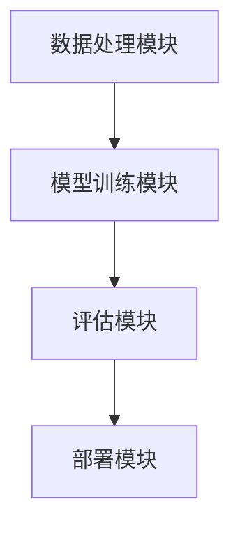

# 【LangChain编程：从入门到实践】框架介绍

## 1.背景介绍

在当今的人工智能和自然语言处理领域，语言模型的应用越来越广泛。LangChain作为一个新兴的编程框架，旨在简化和加速语言模型的开发和部署。本文将深入探讨LangChain的核心概念、算法原理、数学模型、项目实践以及实际应用场景，帮助读者全面了解这一强大的工具。

## 2.核心概念与联系

### 2.1 LangChain简介

LangChain是一个专为语言模型开发设计的编程框架，提供了一系列工具和库，帮助开发者快速构建、训练和部署语言模型。其核心理念是模块化和可扩展性，使得开发者可以轻松地集成不同的模型和算法。

### 2.2 主要组件

LangChain的主要组件包括数据处理模块、模型训练模块、评估模块和部署模块。每个模块都可以独立使用，也可以组合在一起形成完整的开发流程。

### 2.3 模块之间的联系

各个模块之间通过标准化的接口进行通信，确保数据和模型的无缝集成。以下是LangChain的模块化架构图：



## 3.核心算法原理具体操作步骤

### 3.1 数据处理

数据处理是语言模型开发的第一步，主要包括数据清洗、数据增强和特征提取。LangChain提供了一系列预处理工具，帮助开发者快速处理大规模文本数据。

### 3.2 模型训练

模型训练是LangChain的核心部分，支持多种深度学习框架（如TensorFlow、PyTorch）。开发者可以选择预训练模型进行微调，也可以从头开始训练自定义模型。

### 3.3 模型评估

模型评估模块提供了多种评估指标（如准确率、召回率、F1分数），帮助开发者全面了解模型的性能。LangChain还支持交叉验证和A/B测试，确保模型的泛化能力。

### 3.4 模型部署

模型部署模块支持多种部署方式（如本地部署、云端部署、边缘部署），并提供了自动化部署工具，简化了模型上线的流程。

## 4.数学模型和公式详细讲解举例说明

### 4.1 语言模型的数学基础

语言模型的核心是概率论和统计学。假设我们有一个词序列 $w_1, w_2, ..., w_n$，语言模型的目标是计算这个序列的概率 $P(w_1, w_2, ..., w_n)$。

### 4.2 马尔可夫假设

为了简化计算，常用的马尔可夫假设认为当前词只依赖于前面的若干个词。对于一个n-gram模型，我们有：

$$
P(w_1, w_2, ..., w_n) \approx \prod_{i=1}^{n} P(w_i | w_{i-(n-1)}, ..., w_{i-1})
$$

### 4.3 神经网络语言模型

神经网络语言模型通过嵌入层将词映射到高维向量空间，然后通过多层神经网络进行计算。其目标是最大化训练数据的似然函数：

$$
L(\theta) = \sum_{i=1}^{N} \log P(w_i | w_{i-(n-1)}, ..., w_{i-1}; \theta)
$$

其中，$\theta$表示模型参数。

## 5.项目实践：代码实例和详细解释说明

### 5.1 数据处理示例

```python
from langchain.data import DataProcessor

# 加载数据
data = DataProcessor.load_data('data/text_corpus.txt')

# 数据清洗
cleaned_data = DataProcessor.clean_data(data)

# 数据增强
augmented_data = DataProcessor.augment_data(cleaned_data)
```

### 5.2 模型训练示例

```python
from langchain.model import LanguageModel

# 初始化模型
model = LanguageModel('bert-base-uncased')

# 训练模型
model.train(augmented_data, epochs=10, batch_size=32)
```

### 5.3 模型评估示例

```python
from langchain.evaluation import Evaluator

# 初始化评估器
evaluator = Evaluator(model)

# 评估模型
results = evaluator.evaluate(test_data)
print(results)
```

### 5.4 模型部署示例

```python
from langchain.deployment import Deployer

# 初始化部署器
deployer = Deployer(model)

# 部署模型
deployer.deploy('local')
```

## 6.实际应用场景

### 6.1 聊天机器人

LangChain可以用于构建智能聊天机器人，通过训练对话模型，实现自然语言理解和生成。

### 6.2 机器翻译

通过训练双语语料库，LangChain可以用于开发高质量的机器翻译系统。

### 6.3 文本生成

LangChain支持多种文本生成任务，如新闻生成、故事生成等，帮助自动化内容创作。

## 7.工具和资源推荐

### 7.1 开发工具

- Jupyter Notebook：用于数据处理和模型训练的交互式开发环境。
- VSCode：强大的代码编辑器，支持多种编程语言和插件。

### 7.2 资源推荐

- [LangChain官方文档](https://langchain.io/docs)：详细的API文档和使用指南。
- [Kaggle](https://www.kaggle.com/)：丰富的数据集和竞赛资源。

## 8.总结：未来发展趋势与挑战

LangChain作为一个新兴的编程框架，具有广阔的发展前景。未来，随着语言模型的不断进步，LangChain将进一步优化其模块化设计，提升模型的训练效率和部署灵活性。然而，数据隐私和模型公平性仍然是需要解决的重要挑战。

## 9.附录：常见问题与解答

### 9.1 LangChain支持哪些深度学习框架？

LangChain目前支持TensorFlow和PyTorch，未来将扩展支持更多的深度学习框架。

### 9.2 如何处理大规模数据集？

LangChain提供了分布式数据处理工具，可以高效处理大规模数据集。

### 9.3 模型训练需要多长时间？

模型训练时间取决于数据集大小、模型复杂度和硬件配置。LangChain支持多种加速技术，如GPU加速和分布式训练。

---

作者：禅与计算机程序设计艺术 / Zen and the Art of Computer Programming