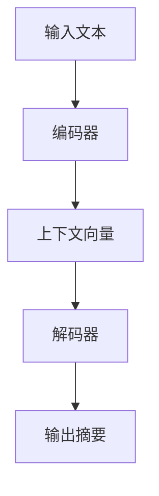
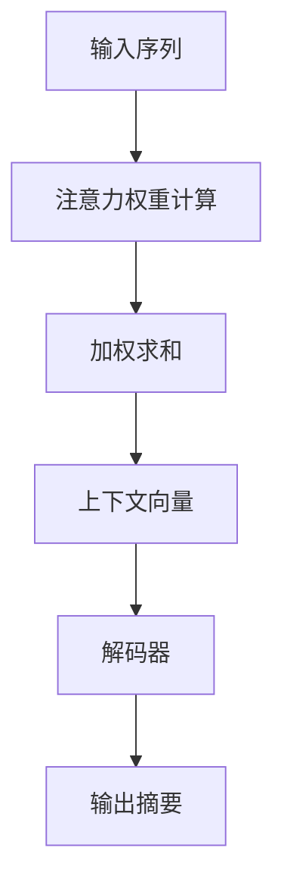
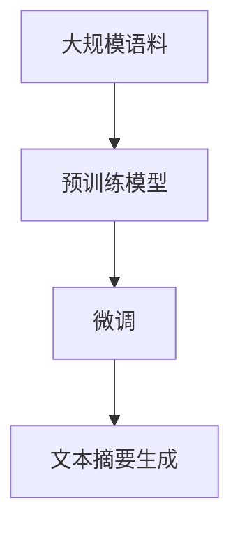

# 一切皆是映射：深度学习在文本摘要生成中的应用

## 1.背景介绍

在信息爆炸的时代，如何快速获取和理解大量信息成为了一个重要的挑战。文本摘要技术应运而生，旨在从大量文本中提取出关键信息，生成简洁明了的摘要。传统的文本摘要方法主要依赖于规则和统计模型，但这些方法在处理复杂语义和上下文关系时显得力不从心。随着深度学习技术的飞速发展，基于神经网络的文本摘要方法逐渐成为研究热点。

深度学习模型，尤其是基于序列到序列（Seq2Seq）架构的模型，展示了在自然语言处理（NLP）任务中的强大能力。通过训练大规模的神经网络模型，深度学习方法能够自动学习文本中的复杂模式和语义关系，从而生成高质量的文本摘要。

## 2.核心概念与联系

### 2.1 深度学习与文本摘要

深度学习是一种通过多层神经网络来学习数据表示和模式的机器学习方法。文本摘要是自然语言处理中的一个重要任务，旨在从长文本中提取出简洁的摘要。深度学习在文本摘要中的应用主要依赖于以下几个核心概念：

- **序列到序列模型（Seq2Seq）**：一种用于处理序列数据的神经网络架构，广泛应用于机器翻译、文本生成等任务。
- **注意力机制（Attention Mechanism）**：一种增强模型对输入数据中重要部分关注能力的技术，显著提升了文本摘要的效果。
- **预训练语言模型**：如BERT、GPT等，通过在大规模语料上进行预训练，模型能够捕捉丰富的语言知识和语义信息。

### 2.2 映射关系

在深度学习中，映射关系是指输入数据到输出结果之间的转换过程。对于文本摘要任务，映射关系可以理解为从原始文本到摘要文本的转换。通过训练神经网络模型，我们可以学习到这种映射关系，从而实现自动化的文本摘要生成。

## 3.核心算法原理具体操作步骤

### 3.1 序列到序列模型

序列到序列模型（Seq2Seq）是文本摘要生成的核心算法之一。其基本架构包括编码器（Encoder）和解码器（Decoder）两个部分。编码器将输入文本转换为固定长度的向量表示，解码器则根据该向量生成输出摘要。



### 3.2 注意力机制

注意力机制通过计算输入序列中每个位置的重要性权重，增强了模型对关键信息的关注能力。常见的注意力机制包括加性注意力和乘性注意力。



### 3.3 预训练语言模型

预训练语言模型通过在大规模语料上进行预训练，捕捉了丰富的语言知识和语义信息。常见的预训练模型包括BERT、GPT等。这些模型可以作为文本摘要生成的基础，通过微调（Fine-tuning）适应具体任务。



## 4.数学模型和公式详细讲解举例说明

### 4.1 序列到序列模型

序列到序列模型的核心在于编码器和解码器的设计。假设输入序列为 $X = (x_1, x_2, ..., x_T)$，输出序列为 $Y = (y_1, y_2, ..., y_T')$。编码器将输入序列映射为上下文向量 $C$：

$$
h_t = f(x_t, h_{t-1})
$$

其中，$h_t$ 是编码器在时间步 $t$ 的隐藏状态，$f$ 是编码器的非线性变换函数。上下文向量 $C$ 通常是编码器最后一个时间步的隐藏状态 $h_T$。

解码器根据上下文向量 $C$ 生成输出序列：

$$
s_t = g(y_{t-1}, s_{t-1}, C)
$$

其中，$s_t$ 是解码器在时间步 $t$ 的隐藏状态，$g$ 是解码器的非线性变换函数。输出序列的生成通过最大化条件概率 $P(Y|X)$ 实现：

$$
P(Y|X) = \prod_{t=1}^{T'} P(y_t | y_{1:t-1}, C)
$$

### 4.2 注意力机制

注意力机制通过计算输入序列中每个位置的重要性权重，增强了模型对关键信息的关注能力。假设编码器的隐藏状态为 $H = (h_1, h_2, ..., h_T)$，解码器的隐藏状态为 $s_t$。注意力权重 $\alpha_{t,i}$ 通过以下公式计算：

$$
\alpha_{t,i} = \frac{\exp(e_{t,i})}{\sum_{k=1}^{T} \exp(e_{t,k})}
$$

其中，$e_{t,i}$ 是解码器隐藏状态 $s_t$ 和编码器隐藏状态 $h_i$ 的相似度得分：

$$
e_{t,i} = \text{score}(s_t, h_i)
$$

常见的相似度得分函数包括点积（Dot-Product）和加性（Additive）得分。上下文向量 $c_t$ 通过加权求和得到：

$$
c_t = \sum_{i=1}^{T} \alpha_{t,i} h_i
$$

解码器在生成输出时结合上下文向量 $c_t$：

$$
s_t = g(y_{t-1}, s_{t-1}, c_t)
$$

### 4.3 预训练语言模型

预训练语言模型通过在大规模语料上进行无监督预训练，捕捉了丰富的语言知识和语义信息。以BERT为例，其预训练任务包括掩码语言模型（Masked Language Model, MLM）和下一句预测（Next Sentence Prediction, NSP）。

在微调阶段，预训练模型的参数通过有监督学习进行调整，以适应具体的文本摘要任务。假设预训练模型的参数为 $\theta$，微调后的模型参数为 $\theta'$，则微调过程通过最小化损失函数 $L(\theta')$ 实现：

$$
\theta' = \arg\min_{\theta'} L(\theta')
$$

## 5.项目实践：代码实例和详细解释说明

### 5.1 环境准备

首先，我们需要安装必要的Python库，包括TensorFlow和Transformers。

```bash
pip install tensorflow transformers
```

### 5.2 数据准备

我们使用CNN/Daily Mail数据集进行文本摘要任务。可以从Hugging Face的Datasets库中加载该数据集。

```python
from datasets import load_dataset

dataset = load_dataset("cnn_dailymail", "3.0.0")
train_dataset = dataset["train"]
val_dataset = dataset["validation"]
test_dataset = dataset["test"]
```

### 5.3 模型定义

我们使用Hugging Face的Transformers库中的BART模型进行文本摘要任务。

```python
from transformers import BartForConditionalGeneration, BartTokenizer

model_name = "facebook/bart-large-cnn"
model = BartForConditionalGeneration.from_pretrained(model_name)
tokenizer = BartTokenizer.from_pretrained(model_name)
```

### 5.4 数据预处理

将输入文本和目标摘要进行编码，并创建数据加载器。

```python
def preprocess_function(examples):
    inputs = examples["article"]
    targets = examples["highlights"]
    model_inputs = tokenizer(inputs, max_length=1024, truncation=True)
    with tokenizer.as_target_tokenizer():
        labels = tokenizer(targets, max_length=128, truncation=True)
    model_inputs["labels"] = labels["input_ids"]
    return model_inputs

train_dataset = train_dataset.map(preprocess_function, batched=True)
val_dataset = val_dataset.map(preprocess_function, batched=True)
```

### 5.5 模型训练

使用Trainer API进行模型训练。

```python
from transformers import Trainer, TrainingArguments

training_args = TrainingArguments(
    output_dir="./results",
    evaluation_strategy="epoch",
    learning_rate=2e-5,
    per_device_train_batch_size=4,
    per_device_eval_batch_size=4,
    num_train_epochs=3,
    weight_decay=0.01,
)

trainer = Trainer(
    model=model,
    args=training_args,
    train_dataset=train_dataset,
    eval_dataset=val_dataset,
)

trainer.train()
```

### 5.6 模型评估

在测试集上评估模型性能。

```python
results = trainer.evaluate(test_dataset)
print(results)
```

### 5.7 模型推理

使用训练好的模型生成文本摘要。

```python
def generate_summary(text):
    inputs = tokenizer([text], max_length=1024, return_tensors="pt", truncation=True)
    summary_ids = model.generate(inputs["input_ids"], max_length=128, num_beams=4, early_stopping=True)
    return tokenizer.decode(summary_ids[0], skip_special_tokens=True)

sample_text = "Your input text here."
summary = generate_summary(sample_text)
print(summary)
```

## 6.实际应用场景

### 6.1 新闻摘要

新闻摘要是文本摘要技术的一个重要应用场景。通过自动生成新闻摘要，读者可以快速了解新闻的核心内容，提高信息获取的效率。

### 6.2 科研文献摘要

科研文献通常篇幅较长，自动生成摘要可以帮助研究人员快速了解文献的主要内容，从而节省时间和精力。

### 6.3 社交媒体内容摘要

社交媒体平台上的内容繁多且更新频繁，自动生成摘要可以帮助用户快速获取关键信息，提升用户体验。

### 6.4 法律文档摘要

法律文档通常内容复杂且篇幅较长，自动生成摘要可以帮助法律从业者快速了解文档的主要内容，提高工作效率。

## 7.工具和资源推荐

### 7.1 Hugging Face Transformers

Hugging Face的Transformers库提供了丰富的预训练模型和工具，支持多种NLP任务，包括文本摘要。

### 7.2 TensorFlow和PyTorch

TensorFlow和PyTorch是两大主流的深度学习框架，提供了强大的模型训练和推理能力。

### 7.3 Datasets库

Hugging Face的Datasets库提供了丰富的数据集，支持多种NLP任务的数据加载和预处理。

### 7.4 Google Colab

Google Colab是一个免费的在线Jupyter笔记本环境，支持GPU加速，适合进行深度学习模型的开发和实验。

## 8.总结：未来发展趋势与挑战

### 8.1 发展趋势

随着深度学习技术的不断进步，文本摘要生成的效果将会越来越好。未来的发展趋势包括：

- **更强大的预训练模型**：如GPT-4、T5等，将进一步提升文本摘要的质量。
- **多模态摘要**：结合图像、视频等多种模态的信息，生成更加丰富和全面的摘要。
- **个性化摘要**：根据用户的兴趣和需求，生成个性化的摘要内容。

### 8.2 挑战

尽管深度学习在文本摘要生成中取得了显著进展，但仍面临一些挑战：

- **数据依赖**：深度学习模型的性能高度依赖于大规模高质量的数据集。
- **计算资源**：训练大规模深度学习模型需要大量的计算资源，普通用户难以承受。
- **语义理解**：尽管深度学习模型在语义理解上有了很大进步，但在处理复杂语义和上下文关系时仍存在不足。

## 9.附录：常见问题与解答

### 9.1 如何选择合适的预训练模型？

选择预训练模型时，可以根据任务的具体需求和数据集的特点进行选择。一般来说，BERT适合处理句子级别的任务，GPT适合生成类任务，BART和T5则适合文本摘要等生成任务。

### 9.2 如何处理长文本？

处理长文本时，可以采用分段处理的方法，将长文本分成多个段落，分别生成摘要，然后将各段摘要合并。此外，可以使用长文本处理能力更强的模型，如Longformer等。

### 9.3 如何提升模型的生成质量？

提升模型生成质量的方法包括：使用更强大的预训练模型、进行数据增强、调整模型超参数、增加训练数据量等。

### 9.4 如何评估文本摘要的质量？

评估文本摘要的质量可以使用ROUGE等自动评估指标，同时结合人工评估，综合考虑摘要的准确性、简洁性和可读性。

---

作者：禅与计算机程序设计艺术 / Zen and the Art of Computer Programming