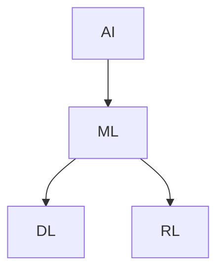

# 人工智能(Artificial Intelligence) - 原理与代码实例讲解

## 1.背景介绍

人工智能（Artificial Intelligence，简称AI）是计算机科学的一个分支，旨在创建能够执行通常需要人类智能的任务的系统。这些任务包括但不限于图像识别、自然语言处理、决策制定和游戏对战。随着计算能力的提升和大数据的普及，AI技术在过去几十年中取得了显著进展，逐渐从实验室走向实际应用。

AI的核心在于模拟人类的认知过程，通过算法和模型来处理和分析数据，从而做出智能决策。AI的应用范围广泛，从自动驾驶汽车到智能助手，从医疗诊断到金融分析，几乎涵盖了所有行业。

## 2.核心概念与联系

### 2.1 人工智能的定义

人工智能是指通过计算机系统模拟人类智能的能力。AI系统通常具备以下几个特征：

- **学习能力**：通过数据和经验不断改进自身性能。
- **推理能力**：根据已有知识和数据进行推理和决策。
- **感知能力**：通过传感器（如摄像头、麦克风）获取外部信息。
- **交互能力**：与人类或其他系统进行交互。

### 2.2 机器学习与深度学习

机器学习（Machine Learning，简称ML）是AI的一个子领域，专注于通过数据训练模型，使其能够自动改进。深度学习（Deep Learning，简称DL）是机器学习的一个分支，利用多层神经网络来处理复杂的数据和任务。

### 2.3 监督学习与无监督学习

- **监督学习**：通过带标签的数据进行训练，模型学习输入和输出之间的映射关系。
- **无监督学习**：通过无标签的数据进行训练，模型需要自己发现数据中的模式和结构。

### 2.4 强化学习

强化学习（Reinforcement Learning，简称RL）是一种通过与环境交互来学习策略的机器学习方法。RL系统通过试错法不断改进策略，以最大化累积奖励。

### 2.5 核心联系

AI、ML、DL和RL之间的关系可以用以下Mermaid图表示：



## 3.核心算法原理具体操作步骤

### 3.1 线性回归

线性回归是一种基本的监督学习算法，用于预测连续值。其核心思想是找到一条直线，使得数据点到直线的距离之和最小。

#### 操作步骤

1. **数据准备**：收集并整理数据。
2. **特征选择**：选择用于预测的特征。
3. **模型训练**：使用最小二乘法拟合直线。
4. **模型评估**：使用均方误差（MSE）评估模型性能。

### 3.2 支持向量机

支持向量机（Support Vector Machine，简称SVM）是一种用于分类和回归的监督学习算法。其核心思想是找到一个超平面，使得不同类别的数据点之间的间隔最大。

#### 操作步骤

1. **数据准备**：收集并整理数据。
2. **特征选择**：选择用于分类的特征。
3. **模型训练**：使用SVM算法找到最优超平面。
4. **模型评估**：使用准确率、召回率等指标评估模型性能。

### 3.3 神经网络

神经网络是深度学习的基础，其灵感来源于生物神经系统。神经网络由多个层组成，每层包含多个神经元，通过权重和激活函数进行连接和计算。

#### 操作步骤

1. **数据准备**：收集并整理数据。
2. **特征选择**：选择用于训练的特征。
3. **模型设计**：设计神经网络的结构，包括层数和每层的神经元数量。
4. **模型训练**：使用反向传播算法调整权重。
5. **模型评估**：使用损失函数和准确率评估模型性能。

## 4.数学模型和公式详细讲解举例说明

### 4.1 线性回归

线性回归的数学模型可以表示为：

$$
y = \beta_0 + \beta_1 x + \epsilon
$$

其中，$y$ 是预测值，$x$ 是输入特征，$\beta_0$ 和 $\beta_1$ 是模型参数，$\epsilon$ 是误差项。

#### 最小二乘法

最小二乘法的目标是最小化以下损失函数：

$$
L(\beta_0, \beta_1) = \sum_{i=1}^{n} (y_i - (\beta_0 + \beta_1 x_i))^2
$$

通过求解偏导数并设为零，可以得到参数的最优解：

$$
\beta_1 = \frac{\sum_{i=1}^{n} (x_i - \bar{x})(y_i - \bar{y})}{\sum_{i=1}^{n} (x_i - \bar{x})^2}
$$

$$
\beta_0 = \bar{y} - \beta_1 \bar{x}
$$

### 4.2 支持向量机

支持向量机的目标是找到一个超平面，使得不同类别的数据点之间的间隔最大。其数学模型可以表示为：

$$
w \cdot x + b = 0
$$

其中，$w$ 是权重向量，$x$ 是输入特征，$b$ 是偏置。

#### 优化目标

SVM的优化目标是最小化以下损失函数：

$$
L(w, b) = \frac{1}{2} \|w\|^2 + C \sum_{i=1}^{n} \max(0, 1 - y_i (w \cdot x_i + b))
$$

通过求解该优化问题，可以得到最优的权重和偏置。

### 4.3 神经网络

神经网络的数学模型可以表示为：

$$
a^{(l)} = f(W^{(l)} a^{(l-1)} + b^{(l)})
$$

其中，$a^{(l)}$ 是第 $l$ 层的激活值，$W^{(l)}$ 是第 $l$ 层的权重矩阵，$b^{(l)}$ 是第 $l$ 层的偏置向量，$f$ 是激活函数。

#### 反向传播

反向传播算法用于调整神经网络的权重和偏置，其核心思想是通过链式法则计算损失函数对每个参数的梯度，并使用梯度下降法进行更新。

$$
\frac{\partial L}{\partial W^{(l)}} = \delta^{(l)} a^{(l-1)^T}
$$

$$
\frac{\partial L}{\partial b^{(l)}} = \delta^{(l)}
$$

其中，$\delta^{(l)}$ 是第 $l$ 层的误差项。

## 5.项目实践：代码实例和详细解释说明

### 5.1 线性回归代码实例

以下是一个使用Python和Scikit-Learn库实现线性回归的示例：

```python
import numpy as np
import matplotlib.pyplot as plt
from sklearn.linear_model import LinearRegression

# 生成数据
np.random.seed(0)
X = 2 * np.random.rand(100, 1)
y = 4 + 3 * X + np.random.randn(100, 1)

# 创建线性回归模型
model = LinearRegression()
model.fit(X, y)

# 预测
X_new = np.array([[0], [2]])
y_predict = model.predict(X_new)

# 可视化
plt.scatter(X, y)
plt.plot(X_new, y_predict, "r-")
plt.xlabel("X")
plt.ylabel("y")
plt.show()
```

### 5.2 支持向量机代码实例

以下是一个使用Python和Scikit-Learn库实现支持向量机的示例：

```python
import numpy as np
import matplotlib.pyplot as plt
from sklearn import datasets
from sklearn.model_selection import train_test_split
from sklearn.svm import SVC

# 加载数据
iris = datasets.load_iris()
X = iris.data[:, :2]
y = iris.target

# 划分训练集和测试集
X_train, X_test, y_train, y_test = train_test_split(X, y, test_size=0.3, random_state=0)

# 创建SVM模型
model = SVC(kernel='linear')
model.fit(X_train, y_train)

# 预测
y_pred = model.predict(X_test)

# 可视化
plt.scatter(X[:, 0], X[:, 1], c=y, cmap=plt.cm.Set1, edgecolor='k')
plt.xlabel('Sepal length')
plt.ylabel('Sepal width')
plt.show()
```

### 5.3 神经网络代码实例

以下是一个使用Python和TensorFlow库实现神经网络的示例：

```python
import tensorflow as tf
from tensorflow.keras import layers, models
import numpy as np

# 生成数据
np.random.seed(0)
X = np.random.rand(1000, 20)
y = np.random.randint(2, size=(1000, 1))

# 创建神经网络模型
model = models.Sequential()
model.add(layers.Dense(64, activation='relu', input_dim=20))
model.add(layers.Dense(64, activation='relu'))
model.add(layers.Dense(1, activation='sigmoid'))

# 编译模型
model.compile(optimizer='adam', loss='binary_crossentropy', metrics=['accuracy'])

# 训练模型
model.fit(X, y, epochs=10, batch_size=32)

# 评估模型
loss, accuracy = model.evaluate(X, y)
print(f'Loss: {loss}, Accuracy: {accuracy}')
```

## 6.实际应用场景

### 6.1 自动驾驶

自动驾驶汽车利用AI技术进行环境感知、路径规划和决策制定。通过摄像头、雷达和激光雷达等传感器获取环境信息，使用深度学习算法进行图像识别和物体检测，从而实现自动驾驶。

### 6.2 医疗诊断

AI在医疗领域的应用包括疾病预测、医学影像分析和个性化治疗方案。通过训练深度学习模型，AI可以从大量的医学数据中提取有价值的信息，辅助医生进行诊断和治疗。

### 6.3 金融分析

AI在金融领域的应用包括股票预测、风险管理和欺诈检测。通过分析历史数据和市场趋势，AI可以提供投资建议和风险评估，帮助金融机构做出更明智的决策。

### 6.4 智能助手

智能助手如Siri、Alexa和Google Assistant利用自然语言处理和语音识别技术，与用户进行交互，提供信息查询、日程管理和智能家居控制等服务。

## 7.工具和资源推荐

### 7.1 编程语言

- **Python**：Python是AI和机器学习领域最常用的编程语言，拥有丰富的库和工具支持。
- **R**：R语言在统计分析和数据可视化方面具有优势，适合用于数据科学和机器学习。

### 7.2 开源库

- **TensorFlow**：由Google开发的开源深度学习框架，支持多种平台和设备。
- **PyTorch**：由Facebook开发的开源深度学习框架，具有动态计算图和易用性。
- **Scikit-Learn**：Python的机器学习库，提供了丰富的算法和工具。

### 7.3 数据集

- **MNIST**：手写数字识别数据集，常用于图像分类任务。
- **CIFAR-10**：包含10类物体的图像数据集，常用于图像分类和目标检测任务。
- **ImageNet**：大规模图像数据集，常用于图像分类和物体检测任务。

### 7.4 在线课程

- **Coursera**：提供多种AI和机器学习相关的在线课程，如Andrew Ng的机器学习课程。
- **edX**：提供多种AI和机器学习相关的在线课程，如MIT的深度学习课程。
- **Udacity**：提供AI和机器学习相关的纳米学位课程，如深度学习纳米学位。

## 8.总结：未来发展趋势与挑战

### 8.1 未来发展趋势

- **自监督学习**：自监督学习是一种无需大量标注数据的学习方法，未来有望在多个领域取得突破。
- **联邦学习**：联邦学习是一种分布式学习方法，能够在保护数据隐私的前提下进行模型训练。
- **AI伦理与安全**：随着AI技术的广泛应用，AI伦理和安全问题将成为重要的研究方向。

### 8.2 挑战

- **数据隐私**：如何在保护用户隐私的前提下进行数据收集和模型训练是一个重要挑战。
- **模型解释性**：复杂的深度学习模型往往难以解释，如何提高模型的可解释性是一个重要研究方向。
- **计算资源**：训练大规模深度学习模型需要大量的计算资源，如何提高计算效率和降低成本是一个重要挑战。

## 9.附录：常见问题与解答

### 9.1 什么是过拟合和欠拟合？

- **过拟合**：模型在训练数据上表现良好，但在测试数据上表现较差，说明模型过于复杂，捕捉到了数据中的噪声。
- **欠拟合**：模型在训练数据和测试数据上都表现较差，说明模型过于简单，无法捕捉数据中的模式。

### 9.2 如何选择合适的激活函数？

- **ReLU**：适用于大多数隐藏层，具有计算简单和梯度消失问题少的优点。
- **Sigmoid**：适用于输出层，特别是二分类问题，但容易出现梯度消失问题。
- **Tanh**：适用于输出层，特别是多分类问题，但容易出现梯度消失问题。

### 9.3 如何处理不平衡数据？

- **重采样**：通过过采样少数类或欠采样多数类来平衡数据。
- **数据增强**：通过数据增强技术生成更多的少数类样本。
- **调整损失函数**：在损失函数中对少数类样本赋予更高的权重。

### 9.4 什么是梯度消失和梯度爆炸？

- **梯度消失**：在深层神经网络中，梯度在反向传播过程中逐渐变小，导致前层权重无法更新。
- **梯度爆炸**：在深层神经网络中，梯度在反向传播过程中逐渐变大，导致前层权重更新过大。

### 9.5 如何选择合适的学习率？

- **学习率过大**：模型可能无法收敛，甚至发散。
- **学习率过小**：模型收敛速度慢，训练时间长。
- **学习率调度**：通过学习率调度策略（如学习率衰减）动态调整学习率。

---

作者：禅与计算机程序设计艺术 / Zen and the Art of Computer Programming