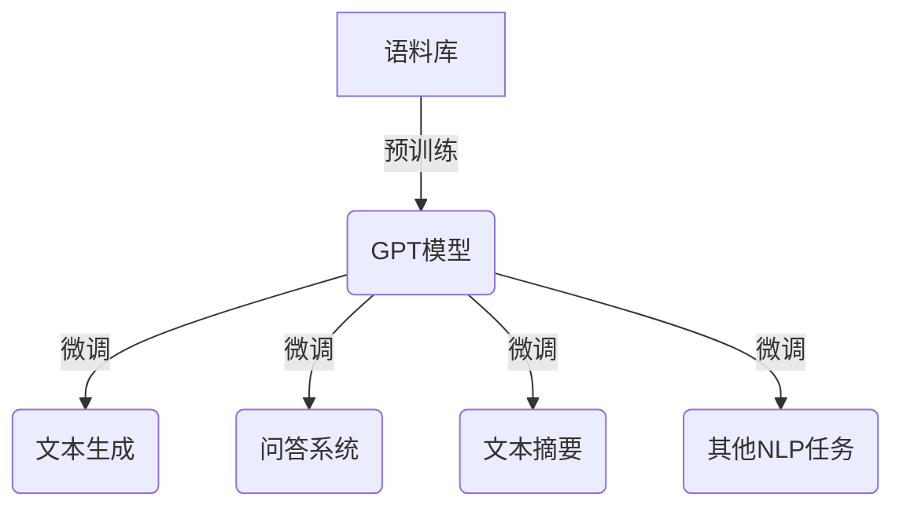

# 从初代GPT到ChatGPT，再到GPT-4的进化史

## 1.背景介绍

自20世纪60年代以来,人工智能(AI)一直是科技领域的热门话题。在过去的几十年里,AI技术取得了长足的进步,尤其是在自然语言处理(NLP)领域。NLP是AI的一个重要分支,旨在使计算机能够理解和生成人类语言。

2018年,OpenAI发布了第一代生成式预训练转换器(GPT),这是一种基于transformer的语言模型,能够生成看似人类写作的文本。GPT的出现标志着NLP领域的一个重大突破,为后续的GPT模型奠定了基础。

## 2.核心概念与联系

GPT系列模型的核心概念是自回归语言模型(Autoregressive Language Model),它基于给定的文本序列,预测下一个词的概率分布。这种方法允许模型生成连贯、流畅的文本输出。

GPT模型采用transformer架构,利用自注意力(Self-Attention)机制来捕捉输入序列中的长程依赖关系。这种架构使得模型能够更好地理解和生成长篇文本。

GPT模型通过在大型语料库上进行预训练,学习到丰富的语言知识和上下文信息。预训练后,模型可以针对特定任务进行微调(Fine-tuning),以适应不同的应用场景。



## 3.核心算法原理具体操作步骤

GPT模型的核心算法是基于transformer的自回归语言模型。其具体操作步骤如下:

1. **输入编码**:将输入文本序列编码为一系列token embeddings。

2. **位置编码**:为每个token添加位置信息,以保留序列的顺序信息。

3. **多头自注意力**:计算每个token与其他token之间的注意力权重,捕捉长程依赖关系。

4. **前馈神经网络**:对注意力输出进行非线性变换,提取更高层次的特征表示。

5. **掩码自回归**:在训练时,对一部分token进行掩码,模型需要预测这些被掩码的token。

6. **损失计算**:计算预测值与真实值之间的损失,并通过反向传播更新模型参数。

以上步骤在训练和推理阶段会有一些细微差异,但整体流程是一致的。

## 4.数学模型和公式详细讲解举例说明

### 4.1 自注意力机制

自注意力机制是transformer模型的核心,它允许模型捕捉输入序列中任意两个位置之间的依赖关系。给定一个查询向量 $\boldsymbol{q}$、键向量 $\boldsymbol{K}$ 和值向量 $\boldsymbol{V}$,自注意力的计算过程如下:

$$\operatorname{Attention}(\boldsymbol{Q}, \boldsymbol{K}, \boldsymbol{V})=\operatorname{softmax}\left(\frac{\boldsymbol{Q} \boldsymbol{K}^{\top}}{\sqrt{d_{k}}}\right) \boldsymbol{V}$$

其中, $d_{k}$ 是缩放因子,用于防止内积过大导致梯度饱和。

在多头自注意力中,查询、键和值向量被线性投影为多个子空间,每个子空间单独计算注意力,最后将所有头的注意力输出拼接起来:

$$\begin{aligned}
\operatorname{MultiHead}(\boldsymbol{Q}, \boldsymbol{K}, \boldsymbol{V}) &=\operatorname{Concat}\left(\operatorname{head}_{1}, \ldots, \operatorname{head}_{h}\right) \boldsymbol{W}^{O} \\
\operatorname{where} \operatorname{head}_{i} &=\operatorname{Attention}\left(\boldsymbol{Q} \boldsymbol{W}_{i}^{Q}, \boldsymbol{K} \boldsymbol{W}_{i}^{K}, \boldsymbol{V} \boldsymbol{W}_{i}^{V}\right)
\end{aligned}$$

其中, $\boldsymbol{W}_{i}^{Q}$、$\boldsymbol{W}_{i}^{K}$、$\boldsymbol{W}_{i}^{V}$ 和 $\boldsymbol{W}^{O}$ 是可学习的线性变换矩阵。

### 4.2 掩码自回归语言模型

在训练GPT模型时,采用了掩码自回归(Masked Autoregressive)的策略。给定一个长度为 $n$ 的token序列 $\boldsymbol{x}=\left(x_{1}, x_{2}, \ldots, x_{n}\right)$,模型的目标是最大化该序列的条件概率:

$$\begin{aligned}
\mathcal{L}_{\theta} &=-\log P_{\theta}\left(x_{1}, \ldots, x_{n}\right) \\
&=-\sum_{t=1}^{n} \log P_{\theta}\left(x_{t} | x_{1}, \ldots, x_{t-1}\right)
\end{aligned}$$

其中, $\theta$ 表示模型参数。在实际训练中,会随机选择一些token进行掩码,模型需要预测这些被掩码的token。这种训练策略使得模型能够更好地捕捉上下文信息,并生成连贯的文本输出。

## 5.项目实践:代码实例和详细解释说明

以下是使用Hugging Face的Transformers库对GPT-2模型进行文本生成的Python代码示例:

```python
from transformers import GPT2LMHeadModel, GPT2Tokenizer

# 加载预训练模型和tokenizer
model = GPT2LMHeadModel.from_pretrained('gpt2')
tokenizer = GPT2Tokenizer.from_pretrained('gpt2')

# 输入文本
input_text = "Write a short story about"
input_ids = tokenizer.encode(input_text, return_tensors='pt')

# 生成文本
output = model.generate(input_ids, max_length=200, num_return_sequences=1, do_sample=True, top_k=50, top_p=0.95, num_beams=5)
generated_text = tokenizer.decode(output[0], skip_special_tokens=True)

print(generated_text)
```

代码解释:

1. 导入必要的模块和类。
2. 加载预训练的GPT-2模型和对应的tokenizer。
3. 定义输入文本,并使用tokenizer将其编码为token ID序列。
4. 调用`model.generate()`方法生成文本输出。这里设置了一些生成参数,如最大长度、随机采样策略等。
5. 使用tokenizer将生成的token ID序列解码为文本,并打印输出。

上述代码展示了如何使用Hugging Face的Transformers库对GPT-2模型进行简单的文本生成。在实际应用中,您可以根据需求调整生成参数,或对模型进行微调以适应特定任务。

## 6.实际应用场景

GPT系列模型在自然语言处理领域有着广泛的应用,包括但不限于:

1. **文本生成**: 生成新闻报道、小说、诗歌、对话等各种形式的文本内容。
2. **问答系统**: 基于上下文理解用户的问题,并生成相应的回答。
3. **文本摘要**: 对长篇文本进行自动摘要,提取关键信息。
4. **机器翻译**: 将一种语言的文本翻译成另一种语言。
5. **代码生成**: 根据自然语言描述生成相应的计算机程序代码。
6. **智能写作助手**: 协助人类进行创作、修改和优化文本内容。

除了上述应用场景,GPT模型还可以用于文本分类、情感分析、关系抽取等多种NLP任务。随着模型性能的不断提高,其应用领域也在不断扩展。

## 7.工具和资源推荐

以下是一些与GPT模型相关的有用工具和资源:

1. **Hugging Face Transformers**: 一个流行的NLP库,提供了预训练模型(包括GPT系列)和相关工具。
2. **OpenAI GPT-3 Playground**: OpenAI提供的在线GPT-3模型体验平台。
3. **Anthropic**: 一家专注于构建安全和有益的人工智能系统的公司,开发了Claude等大型语言模型。
4. **GPT-3 Demo**: 一个展示GPT-3模型能力的在线演示网站。
5. **GPT-3 Examples**: 一个收集GPT-3模型应用示例的网站。
6. **GPT-3 Papers**: 一个关于GPT-3模型的研究论文集合。

## 8.总结:未来发展趋势与挑战

GPT系列模型在自然语言处理领域取得了巨大的成功,但仍然面临一些挑战和发展趋势:

1. **模型规模持续增长**: 为了提高模型性能,未来的模型规模可能会继续增长,这将带来更高的计算和存储需求。
2. **提高模型效率**: 如何在保持性能的同时,降低模型的计算和存储开销,是一个重要的研究方向。
3. **增强模型的鲁棒性和可解释性**: 当前的模型存在一些缺陷,如生成不当内容、缺乏逻辑一致性等。增强模型的鲁棒性和可解释性将有助于提高其可靠性和透明度。
4. **探索新的模型架构**: 除了transformer架构,未来可能会出现新的模型架构,以进一步提高性能和效率。
5. **多模态模型**: 将语言模型与视觉、音频等其他模态相结合,构建多模态模型,是一个有前景的研究方向。
6. **人工智能安全和伦理**: 随着大型语言模型的广泛应用,确保其安全性和符合伦理准则将变得越来越重要。

总的来说,GPT系列模型为自然语言处理领域带来了革命性的进步,但仍有许多值得探索和改进的空间。未来,我们可以期待看到更强大、更智能、更安全的语言模型问世。

## 9.附录:常见问题与解答

1. **GPT模型是如何生成文本的?**

GPT模型采用自回归语言模型的方式,基于给定的文本序列,预测下一个词的概率分布。通过不断地采样和预测,模型可以生成连贯的文本输出。

2. **GPT模型与传统的语言模型有何不同?**

传统的语言模型通常是基于n-gram或RNN等架构,而GPT模型则采用了transformer架构和自注意力机制。这使得GPT模型能够更好地捕捉长程依赖关系,生成更加连贯和上下文相关的文本。

3. **GPT模型是否能够完全替代人类写作?**

尽管GPT模型在文本生成方面表现出色,但它仍然无法完全替代人类写作。人类写作需要创造力、情感表达和深层次的思考,而GPT模型只是基于训练数据进行生成,缺乏真正的理解和创造力。因此,GPT模型更适合作为辅助工具,而非完全替代人类写作。

4. **GPT模型在生成文本时是否会产生有害或不当内容?**

是的,GPT模型在生成文本时存在产生有害或不当内容的风险。这是因为模型是基于训练数据进行学习的,如果训练数据中存在有害内容,模型就可能学习到这些不当的模式。因此,在实际应用中需要采取适当的过滤和审核措施,以确保生成的内容是安全和适当的。

5. **GPT模型的未来发展方向是什么?**

GPT模型的未来发展方向包括:模型规模持续增长、提高模型效率、增强模型的鲁棒性和可解释性、探索新的模型架构、构建多模态模型,以及确保人工智能的安全性和伦理性等。随着技术的不断进步,我们可以期待看到更加强大和智能的语言模型问世。

作者: 禅与计算机程序设计艺术 / Zen and the Art of Computer Programming