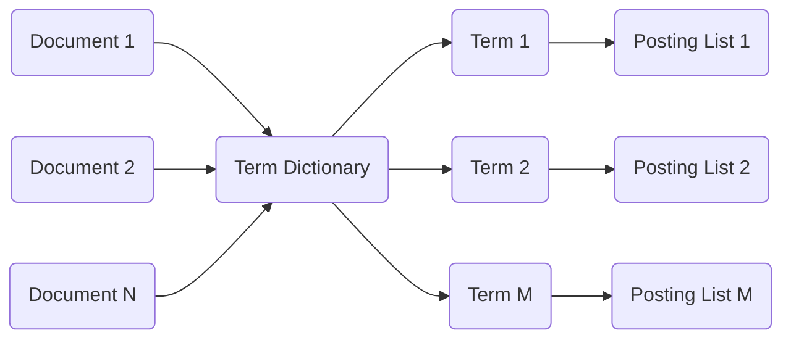

# 倒排索引 原理与代码实例讲解

## 1. 背景介绍
### 1.1 什么是倒排索引
倒排索引(Inverted Index)是一种常用于全文搜索引擎的索引结构。它存储了单词到文档的映射关系,可以根据单词快速找到包含该单词的文档。

### 1.2 倒排索引的应用场景
倒排索引广泛应用于搜索引擎、文档检索系统等需要进行全文搜索的场景。一些常见的应用有:
- 网页搜索引擎,如Google、百度等
- 文档管理系统,如Confluence、SharePoint等  
- 电商网站商品搜索
- 论坛、博客等UGC网站的内容搜索

### 1.3 倒排索引的优势
相比顺序扫描,倒排索引可以大幅提高全文搜索的效率。它的主要优势有:
- 快速查找包含某个单词的文档
- 支持多关键词组合查询
- 便于计算文档的相关度得分
- 容易实现搜索结果排序、高亮等功能

## 2. 核心概念与联系
### 2.1 文档(Document)
文档是被索引的基本单位,可以是网页、文本文件、数据库记录等。每个文档都有一个唯一的编号(DocID)。

### 2.2 单词(Term) 
单词是构成文档的基本单位,是索引系统处理的对象。通常会经过分词、大小写转换、词根化、去除停用词等预处理步骤。

### 2.3 词典(Term Dictionary)
词典存储了所有出现过的单词,每个单词对应一个唯一的编号(TermID)。它可以用哈希表或有序数组实现。

### 2.4 倒排列表(Posting List)  
倒排列表记录了每个单词对应的文档,通常包含(DocID, TF)这样的元组,其中TF表示单词在该文档中的词频。

### 2.5 概念联系
下图展示了这些概念之间的联系:



## 3. 核心算法原理具体操作步骤
倒排索引的核心算法可以分为两个阶段:索引构建和查询处理。

### 3.1 索引构建
1. 遍历每个文档,对文档内容进行分词、归一化等预处理
2. 对于每个文档里的单词,查询词典获取TermID,如果词典没有则插入新单词
3. 将(DocID, TermID, TF)元组写入对应的倒排列表
4. 所有文档处理完成后,按DocID对倒排列表排序
5. 将词典和倒排列表写入磁盘

### 3.2 查询处理
1. 对查询语句进行分词、归一化等预处理  
2. 查询词典获取每个单词的TermID
3. 从磁盘读取对应的倒排列表
4. 合并多个倒排列表,得到包含所有查询单词的文档
5. 根据相关度算分公式(如TF-IDF、BM25等)对候选文档打分
6. 按相关度得分排序,返回查询结果

## 4. 数学模型和公式详细讲解举例说明
### 4.1 布尔模型(Boolean Model)
布尔模型是最简单的文档相关度模型,只考虑单词是否出现在文档中。

查询语句为单词的逻辑组合,如"(Apple AND iPhone) OR Mac",文档与查询的相关度要么为0要么为1。

### 4.2 向量空间模型(Vector Space Model) 
向量空间模型将文档和查询都表示成向量,两者的相关度由向量夹角余弦计算:

$$
\cos \theta=\frac{\vec{d} \cdot \vec{q}}{\|\vec{d}\|\|\vec{q}\|}=\frac{\sum_{i=1}^{n} w_{i, d} w_{i, q}}{\sqrt{\sum_{i=1}^{n} w_{i, d}^{2}} \sqrt{\sum_{i=1}^{n} w_{i, q}^{2}}}
$$

其中$w_{i,d}$和$w_{i,q}$分别表示单词$i$在文档和查询中的权重,通常用TF-IDF计算:

$$
\mathrm{TF-IDF}=\mathrm{TF} \times \mathrm{IDF}=f_{i,d} \times \log \frac{N}{n_i}
$$

其中$f_{i,d}$为单词$i$在文档$d$中的词频,$N$为总文档数,$n_i$为包含单词$i$的文档数。

### 4.3 概率模型(Probabilistic Model)
概率模型计算文档与查询的相关度概率,代表性的算法有BM25:

$$
\operatorname{score}(D, Q)=\sum_{i=1}^{n} \operatorname{IDF}\left(q_{i}\right) \cdot \frac{f\left(q_{i}, D\right) \cdot\left(k_{1}+1\right)}{f\left(q_{i}, D\right)+k_{1} \cdot\left(1-b+b \cdot \frac{|D|}{\operatorname{avgdl}}\right)}
$$

其中$\operatorname{IDF}(q_i)$为单词$q_i$的逆文档频率,$f(q_i,D)$为$q_i$在文档$D$中的词频,$|D|$为文档长度,$\operatorname{avgdl}$为平均文档长度,$k_1$和$b$为调节因子。

## 5. 项目实践:代码实例和详细解释说明
下面用Python实现一个简单的倒排索引。

### 5.1 索引构建
```python
import re
import collections

def tokenize(text):
    return re.findall(r'\w+', text.lower())

def build_index(docs):
    term_dict = {}  # 词典
    posting_lists = collections.defaultdict(list)  # 倒排列表
    
    for doc_id, doc in enumerate(docs):
        terms = tokenize(doc)
        for term in terms:
            if term not in term_dict:
                term_dict[term] = len(term_dict)
            term_id = term_dict[term]    
            posting_lists[term_id].append((doc_id, terms.count(term)))
            
    return term_dict, posting_lists
```

主要步骤:
1. 定义分词函数`tokenize`,使用正则表达式提取单词并转为小写
2. 遍历每个文档,提取单词并记录词频
3. 在词典`term_dict`中查询单词,如果不存在则插入
4. 将(doc_id, tf)元组追加到对应的倒排列表`posting_lists`中

### 5.2 查询处理
```python
from collections import Counter

def search(query, term_dict, posting_lists):
    query_terms = tokenize(query)
    query_term_ids = [term_dict[term] for term in query_terms if term in term_dict]
    
    # 加载倒排列表
    doc_lists = [posting_lists[term_id] for term_id in query_term_ids]
    
    # 取交集获取候选文档
    candidates = set(doc_lists[0])
    for doc_list in doc_lists[1:]:
        candidates &= set(doc_list)
        
    # 计算文档得分(简化的TF计算)
    scores = Counter()
    for candidate in candidates:
        for doc_list in doc_lists:
            for doc_id, tf in doc_list:
                if doc_id == candidate:
                    scores[candidate] += tf
                    
    # 按得分排序
    ranked_docs = sorted(scores.items(), key=lambda x: x[1], reverse=True)
    return [doc_id for doc_id, _ in ranked_docs]
```

主要步骤:
1. 对查询进行分词,过滤掉词典里没有的单词
2. 加载对应的倒排列表
3. 取所有倒排列表的交集,得到包含所有查询单词的候选文档
4. 遍历候选文档,累加所有单词的词频作为文档得分
5. 按得分排序,返回文档ID列表

### 5.3 测试
```python
docs = [
    'Python is an interpreted high-level programming language',
    'Python is dynamically-typed and garbage-collected', 
    'It supports multiple programming paradigms including structured and object-oriented programming',
]

term_dict, posting_lists = build_index(docs)
print(term_dict)
print(posting_lists)

query = 'python programming'
results = search(query, term_dict, posting_lists)
print(results)  # 输出:[0, 2]
```

## 6. 实际应用场景
倒排索引在很多实际场景中得到应用,下面列举几个典型案例。

### 6.1 Elasticsearch
Elasticsearch是一个基于Lucene的开源分布式搜索引擎。它使用倒排索引实现全文搜索,并提供近实时的索引更新和查询响应。

Elasticsearch将索引分片存储在多个节点上,可以横向扩展吞吐量和存储容量。同时它还支持索引副本,提高了可用性。

### 6.2 Lucene
Lucene是一个用Java实现的开源全文搜索引擎库。它是Elasticsearch、Solr等搜索引擎的基础。

Lucene使用倒排索引的变体实现,将词典和倒排列表按段(Segment)组织,以支持增量索引更新。

### 6.3 Google
Google搜索引擎使用倒排索引处理海量网页。早期使用MapReduce框架在大规模集群上构建索引,随着数据量的增长又开发了Caffeine、Percolator等增量索引系统。

Google还有很多针对倒排索引的改进,如将链接关系、文档结构等因素引入相关度计算,优化了查询性能。

## 7. 工具和资源推荐
- Lucene: 成熟的Java全文搜索引擎库 (https://lucene.apache.org/)
- Elasticsearch: 基于Lucene的分布式搜索引擎 (https://www.elastic.co/elasticsearch/) 
- Whoosh: 纯Python实现的全文搜索引擎库 (https://whoosh.readthedocs.io/)
- Terrier: 用于研究的Java信息检索平台 (http://terrier.org/)
- Indri: 基于语言模型的搜索引擎 (https://www.lemurproject.org/indri.php)
- Introduction to Information Retrieval: 信息检索领域经典教材 (https://nlp.stanford.edu/IR-book/)
- Lucene in Action: 介绍Lucene原理和应用的图书

## 8. 总结:未来发展趋势与挑战
倒排索引经过几十年的发展已经相当成熟,但仍然面临不少挑战和创新的方向。

### 8.1 海量数据
互联网数据的爆炸式增长对索引系统提出了更高的要求。需要进一步优化索引压缩、存储、更新的效率,探索新的系统架构以支持更大规模。

### 8.2 查询意图理解
用户的查询通常比较简短和模糊,理解查询背后的真正意图有助于改进搜索结果。未来需要更好地利用知识图谱、查询日志等资源,建立查询意图的表示模型。

### 8.3 个性化搜索
不同用户对同一个查询的需求可能不同。为用户提供个性化的搜索结果,需要从用户画像、行为序列等方面挖掘用户兴趣,对排序模型进行个性化调整。

### 8.4 语义搜索
传统的搜索以关键词匹配为主,无法理解词语和文档的语义。语义搜索尝试理解查询和文档的含义,提供更准确和全面的结果。它需要融合自然语言处理、知识表示等技术。

### 8.5 多媒体搜索 
图片、视频、音频等非文本数据的搜索是一个新的挑战。如何对多媒体内容进行语义表示、索引和检索,如何实现多模态的相关性计算,都有待进一步研究。

### 8.6 机器学习
机器学习正在重塑信息检索领域。从学习排序算法(LTR)到基于表示学习的语义匹配,再到端到端的问答系统,机器学习让搜索变得更加智能。如何进一步利用好深度学习等新技术,是业界和学界共同关注的焦点。

## 9. 附录:常见问题与解答
### 9.1 倒排索引需要存储哪些内容?
倒排索引通常包含词典和倒排列表两部分。词典记录了所有的单词及其ID,倒排列表则记录