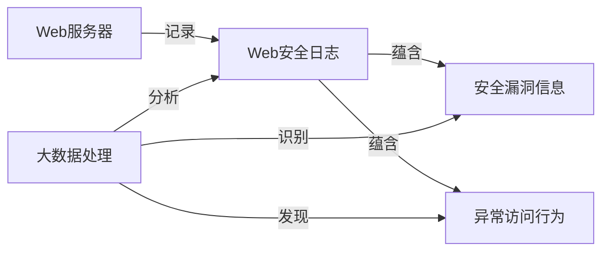
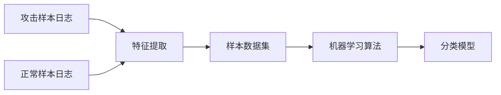

# 大数据背景下的Web站点安全检测研究

## 1.背景介绍

随着互联网技术的飞速发展,越来越多的企业和组织将业务迁移到了网络平台。Web站点已经成为人们获取信息、开展业务的重要渠道。然而,伴随着Web应用的广泛普及,网站安全问题也日益突出。黑客利用网站漏洞实施攻击,窃取用户隐私数据,给企业和个人造成了巨大的经济损失。

在大数据时代,海量的Web安全日志数据为我们分析和检测网站安全问题提供了新的思路。传统的Web安全检测主要依赖于规则匹配和特征识别,很难应对不断变化的攻击手段。而大数据分析技术可以从海量的安全日志中挖掘有价值的信息,及时发现潜在的安全威胁。

本文将探讨如何利用大数据技术来增强Web站点的安全性,重点研究Web安全日志的采集、存储、处理和分析,并给出一些行之有效的安全检测方法。

## 2.核心概念与联系

要理解大数据背景下的Web站点安全检测,需要先了解一些核心概念:

### 2.1 Web安全日志

Web服务器会记录用户的每一次HTTP请求,包括请求时间、请求URL、请求参数、响应状态码等信息。这些日志数据蕴含了大量的安全信息,是检测网站安全问题的重要数据来源。

### 2.2 安全漏洞

网站存在的安全漏洞是黑客发起攻击的主要突破口。常见的Web安全漏洞包括:SQL注入、跨站脚本攻击(XSS)、跨站请求伪造(CSRF)、文件上传漏洞、弱口令等。及时发现和修复这些漏洞是保障网站安全的关键。

### 2.3 异常访问行为

除了直接利用安全漏洞,黑客还会采取一些异常的访问行为来实施攻击,比如暴力破解、目录遍历、Web扫描等。通过分析用户的访问日志,可以识别出这些异常行为模式。

### 2.4 大数据处理

Web站点每天会产生海量的访问日志,动辄几十GB甚至上百GB。要从中发现有价值的安全信息,必须借助大数据处理技术,比如分布式存储、并行计算、机器学习等。

下图展示了这些核心概念之间的联系:



## 3.核心算法原理具体操作步骤

Web安全日志分析的核心是从海量数据中发现异常模式。常用的算法包括:

### 3.1 基于规则的匹配

制定一系列描述攻击特征的规则,然后用这些规则去匹配日志数据。比如识别SQL注入可以匹配日志中的特殊字符串`' or 1=1--`。

### 3.2 统计分析

对日志数据进行统计分析,找出一些反常的访问指标,比如:

- 单个IP的访问频率远高于其他IP
- 请求的URL路径深度异常
- 服务器响应状态码的分布异常
- 请求耗时的分布异常

### 3.3 机器学习

使用机器学习算法从已知的攻击样本中提取特征,训练分类模型,然后用模型去识别未知的攻击行为。常用的机器学习算法有:

- 逻辑回归
- 支持向量机
- 随机森林
- 神经网络

一个典型的机器学习模型训练流程如下:



## 4.数学模型和公式详细讲解举例说明

在异常检测中,常用统计指标如下:

设某个时间窗口内的请求次数为n,第i个请求的响应耗时为$t_i$,则平均响应耗时为:

$$\bar{t} = \frac{\sum_{i=1}^n t_i}{n}$$

响应耗时的标准差为:

$$\sigma = \sqrt{\frac{\sum_{i=1}^n (t_i - \bar{t})^2}{n}}$$

如果一个请求的响应耗时$t_0$满足:

$$\frac{|t_0 - \bar{t}|}{\sigma} > 3$$

则可以判定为异常请求。这里用到了3σ原则,即超出平均值3个标准差的概率小于0.003,可以认为是小概率事件。

## 5.项目实践:代码实例和详细解释说明

下面用Python实现一个简单的SQL注入攻击检测:

```python
import re

# SQL注入攻击特征
sql_injection_pattern = re.compile(r"('|--)", re.IGNORECASE)

def is_sql_injection(url, param):
    """
    检测SQL注入攻击
    :param url: 请求URL
    :param param: 请求参数
    :return: True-存在注入攻击 False-不存在注入攻击
    """
    # 检查URL中是否包含注入特征
    if sql_injection_pattern.search(url):
        return True
        
    # 检查参数中是否包含注入特征  
    for value in param.values():
        if sql_injection_pattern.search(value):
            return True
        
    return False

# 测试
url1 = "/user?id=123"
param1 = {"name": "admin' --"}
print(is_sql_injection(url1, param1))  # True

url2 = "/user?id=123"  
param2 = {"name": "admin"}
print(is_sql_injection(url2, param2))  # False
```

这个例子中,我们首先定义了一个正则表达式`sql_injection_pattern`来描述SQL注入攻击的特征,即包含单引号`'`或`--`注释符。

然后实现了`is_sql_injection`函数,它分别检查请求URL和请求参数中是否包含注入特征,如果存在则返回True表示存在注入攻击,否则返回False。

最后用两组数据进行测试,第一组URL参数包含注入特征,函数返回True;第二组不包含注入特征,函数返回False。

这只是一个简单的例子,实际的SQL注入检测要复杂得多。我们还可以检测更多的注入特征,如`union`、`select`等关键字,还要考虑各种变形和绕过方式。

## 6.实际应用场景

Web安全日志分析在多个场景中有重要应用:

### 6.1 安全运营

安全运营人员可以实时监控Web站点的安全日志,及时发现可疑的攻击行为并采取防范措施。当发现高危漏洞时还可以及时通知研发人员进行修复。

### 6.2 安全测试

渗透测试人员在对Web站点进行安全测试时,可以分析Web日志,验证测试过程中是否触发了某些异常行为,评估测试的有效性。

### 6.3 威胁情报

通过分析多个Web站点的安全日志,可以发现一些常见的攻击手法和攻击源,积累威胁情报。这些情报可以用来优化检测算法,也可以共享给其他组织,帮助他们提升安全防护能力。

### 6.4 合规审计

在等保测评、PCI DSS合规等安全审计过程中,Web日志是重要的审计对象,可以帮助审计人员评估Web站点的安全状况,是否存在违反合规要求的行为。

## 7.工具和资源推荐

进行Web安全日志分析离不开专业的工具和资源,下面推荐一些常用的:

- ELK Stack:由ElasticSearch、Logstash、Kibana组成,提供日志收集、存储、检索、可视化等功能
- Splunk:提供日志管理和实时监控告警功能,内置多种安全检测规则
- Apache Spark:大数据分布式计算平台,可以用于海量日志数据的并行处理
- Scikit-learn:Python机器学习库,提供多种常用的机器学习算法
- OWASP Top 10:总结了10大最常见的Web安全漏洞,可以作为安全检测的重点参考

## 8.总结:未来发展趋势与挑战

随着Web技术的不断发展,网站架构日益复杂,攻防对抗也在不断升级。未来Web安全日志分析将呈现以下发展趋势:

- 多源异构日志融合分析。除了Web服务器日志,还要综合分析防火墙、入侵检测、数据库审计等多种日志,才能全面反映Web站点的安全状态。

- 机器学习和智能安全。利用机器学习从海量日志中自动挖掘攻击特征,结合专家知识构建智能安全检测模型,提高检测的效率和准确率。

- 实时分析和告警。利用流式计算技术对日志进行实时分析,一旦发现高危安全事件立即触发告警,帮助安全运营人员及时响应。

- 安全可视化。综合运用各种可视化图表,直观地展示Web站点的安全状态、攻击趋势、脆弱性分布等,帮助安全管理者快速全面地掌控安全风险。

同时,Web安全日志分析也面临着一些挑战:

- 日志的标准化和质量问题。不同Web组件生成的日志格式各不相同,字段含义不统一,给日志分析带来不便。

- 日志存储和计算成本。海量日志的存储和处理需要消耗大量的硬件资源,费用高昂。需要采用一些降本增效的技术手段。

- 数据隐私保护。日志中可能包含用户的敏感信息,在采集、传输、存储、处理等各个环节都要考虑如何保护用户隐私,避免数据泄露。

- 安全分析人才缺乏。Web安全日志分析需要安全、大数据、机器学习等多方面的知识,复合型人才十分稀缺。

总之,大数据背景下的Web站点安全检测是一个富有挑战也充满机遇的研究领域。只有紧跟技术发展潮流,与时俱进地创新安全理念和方法,才能构筑起Web站点的坚实防线,保障网络空间的安全。

## 9.附录:常见问题与解答

### Q1:Web安全日志应该收集哪些字段?

A1:一般应该收集以下字段:

- 请求时间
- 客户端IP
- 请求方法(GET/POST)
- 请求URL
- 请求参数
- 响应状态码
- 响应内容大小
- 服务器处理耗时
- User Agent
- Referer

### Q2:如何存储海量的Web安全日志?

A2:可以采用分布式存储系统,如HDFS、HBase等。为了便于分析,通常还会对原始日志进行预处理,提取关键字段存入ElasticSearch等搜索引擎中。

### Q3:如何识别Web攻击流量?

A3:可以从以下几个方面入手:

- 请求URL路径中包含攻击特征,如SQL注入、XSS、文件包含等
- 请求参数中包含攻击payload
- 单个IP在短时间内请求次数异常
- 请求的资源分布异常,如集中访问敏感目录或文件
- User Agent异常,使用自动化工具的特征
- 服务器错误响应增多,如500、404等

### Q4:机器学习算法在安全日志分析中有哪些应用?

A4:常见的应用有:

- 使用无监督学习进行异常检测,如聚类、孤点分析
- 使用有监督学习进行分类,识别恶意请求,如逻辑回归、决策树
- 使用序列模型检测攻击会话,如RNN、LSTM
- 使用关联规则、序列模式挖掘攻击行为之间的关联

### Q5:Web安全日志分析平台应该具备哪些功能?

A5:一个完善的Web安全日志分析平台通常包括:

- 日志收集:能够采集各种Web组件的日志
- 日志解析:能够对不同格式的日志进行解析、提取
- 日志存储:能够存储海量的结构化、非结构化日志数据
- 安全检测:内置常见攻击类型的检测规则