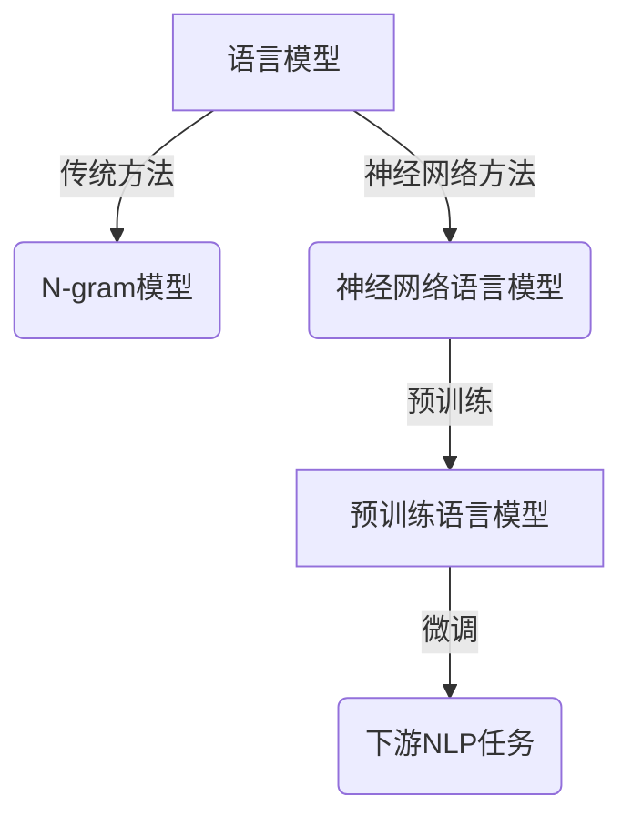
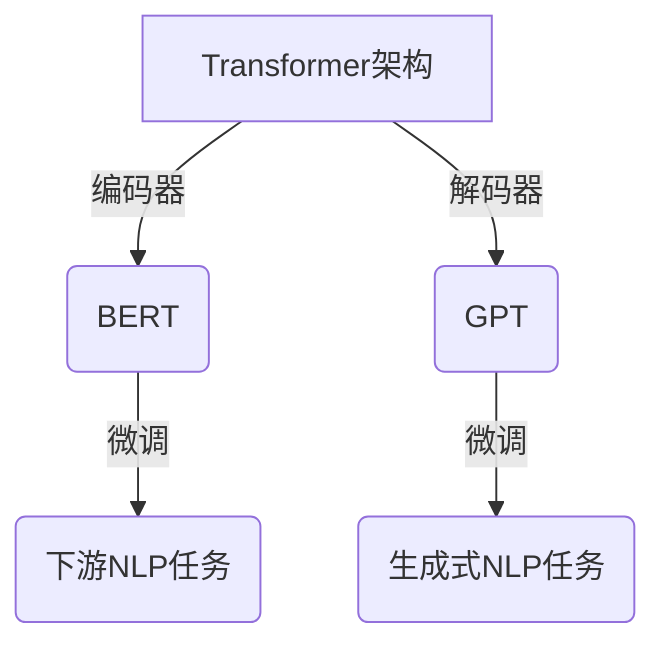

# 大规模语言模型从理论到实践 基础概念

## 1.背景介绍

近年来,大规模语言模型在自然语言处理(NLP)领域取得了令人瞩目的成就。它们展现出惊人的语言理解和生成能力,在机器翻译、问答系统、文本摘要、内容创作等多个领域发挥着重要作用。大规模语言模型的出现,标志着NLP从传统的基于规则或统计方法,迈向了基于大数据和深度学习的新范式。

本文将探讨大规模语言模型的基础理论和实践应用,为读者提供全面的认识。我们将从语言模型的基本概念出发,阐述预训练语言模型的工作原理,介绍主流的模型架构,分析其优缺点,并展望未来的发展趋势和挑战。

## 2.核心概念与联系

### 2.1 语言模型

语言模型(Language Model)是自然语言处理的基础,其目标是量化一个语句或词序列的概率。形式化地,给定一个词序列$w_1, w_2, ..., w_n$,语言模型需要计算该序列的概率:

$$P(w_1, w_2, ..., w_n)$$

根据链式法则,上式可以分解为:

$$P(w_1, w_2, ..., w_n) = \prod_{i=1}^{n}P(w_i|w_1, ..., w_{i-1})$$

传统的语言模型通常基于n-gram统计,即根据前n-1个词来预测第n个词的概率。这种方法简单高效,但受限于数据稀疏问题和背景长期依赖的缺陷。

### 2.2 神经网络语言模型

神经网络语言模型(Neural Network Language Model)则通过神经网络来建模条件概率分布,克服了传统方法的缺陷。它将词序列映射到低维的连续空间,能够更好地捕捉语义和句法信息。

### 2.3 预训练语言模型

预训练语言模型(Pre-trained Language Model)是一种基于大规模无标注语料进行预训练,再通过有监督的微调来完成下游任务的范式。代表性模型包括BERT、GPT、XLNet等。它们在海量语料上学习通用的语言表示,再将这些知识迁移到具体的NLP任务中,大幅提升了性能。



## 3.核心算法原理具体操作步骤

### 3.1 Transformer架构

Transformer是预训练语言模型的核心架构,它完全基于注意力机制,摒弃了RNN和CNN等传统结构。Transformer的主要组成部分包括:

1. **嵌入层(Embedding Layer)**: 将输入的词映射到连续的向量空间。
2. **多头注意力机制(Multi-Head Attention)**: 捕捉输入序列中不同位置词元之间的依赖关系。
3. **前馈神经网络(Feed-Forward Network)**: 对每个位置的表示进行非线性变换,增强模型的表达能力。
4. **规范化层(Normalization Layer)**: 加速收敛并提高模型的稳定性。

Transformer的自注意力机制使其能够有效地建模长期依赖,并行化计算提高了训练效率。

### 3.2 BERT模型

BERT(Bidirectional Encoder Representations from Transformers)是一种基于Transformer的预训练语言模型,它通过Masked Language Model(掩蔽语言模型)和Next Sentence Prediction(下一句预测)两个预训练任务,学习双向的上下文表示。

BERT的预训练过程包括:

1. **TokenEmbedding**: 将输入的词元映射到向量空间。
2. **SegmentEmbedding**: 区分输入序列属于哪个句子。
3. **PositionEmbedding**: 编码词元在序列中的位置信息。
4. **Transformer Encoder**: 通过多层Transformer结构捕捉上下文信息。
5. **Masked LM和NSP Loss**: 计算掩蔽语言模型和下一句预测的损失函数。

在下游任务中,BERT通过简单的微调(fine-tuning)就可以取得出色的性能表现。

### 3.3 GPT模型

GPT(Generative Pre-trained Transformer)是一种基于Transformer decoder的自回归语言模型,专注于生成式任务。与BERT不同,GPT采用了标准的语言模型预训练目标,即最大化下一个词元的条件概率。

GPT的预训练过程包括:

1. **TokenEmbedding和PositionEmbedding**: 将输入映射到向量空间并编码位置信息。
2. **Transformer Decoder**: 通过多层Transformer decoder结构捕捉上下文信息。
3. **Language Modeling Loss**: 最大化下一个词元的条件概率。

GPT在生成式任务如机器翻译、文本摘要、对话系统等领域表现出色。后续的GPT-2和GPT-3进一步扩大了模型规模,展现了更强大的生成能力。



## 4.数学模型和公式详细讲解举例说明

### 4.1 自注意力机制

自注意力机制是Transformer的核心,它通过计算查询(Query)与键(Key)的相似性来获取与之相关的值(Value)。对于序列$X = (x_1, x_2, ..., x_n)$,自注意力的计算过程为:

$$\text{Attention}(Q, K, V) = \text{softmax}(\frac{QK^T}{\sqrt{d_k}})V$$

其中$Q$、$K$、$V$分别是查询、键和值,通过线性变换得自$X$:

$$\begin{aligned}
Q &= XW^Q\\
K &= XW^K\\
V &= XW^V
\end{aligned}$$

$d_k$是缩放因子,用于防止点积过大导致的梯度饱和。多头注意力机制(Multi-Head Attention)则是将注意力分成多个子空间,分别计算后再合并:

$$\text{MultiHead}(Q, K, V) = \text{Concat}(head_1, ..., head_h)W^O$$
$$\text{where } head_i = \text{Attention}(QW_i^Q, KW_i^K, VW_i^V)$$

自注意力机制能够有效地捕捉序列中任意两个位置之间的依赖关系,是Transformer取得巨大成功的关键所在。

### 4.2 掩蔽语言模型

BERT采用了掩蔽语言模型(Masked Language Model, MLM)作为预训练任务之一。MLM的目标是基于上下文预测被掩蔽的词元,形式化地:

$$\max_{\theta} \sum_{i=1}^{n}\log P(x_i|x_{\backslash i};\theta)$$

其中$x_i$是被掩蔽的词元,$x_{\backslash i}$是其余的上下文词元,目标是最大化被掩蔽词元的条件概率。

在实现中,BERT会随机选择一些词元进行掩蔽(用特殊的[MASK]标记替换),然后通过模型预测这些被掩蔽的词元。这种方式迫使模型充分利用上下文信息,学习到更加丰富的语义和句法知识。

### 4.3 生成式语言模型

GPT采用了标准的生成式语言模型目标,即最大化下一个词元的条件概率:

$$\max_{\theta} \sum_{i=1}^{n}\log P(x_i|x_{<i};\theta)$$

其中$x_{<i}$表示前$i-1$个词元。这种自回归(auto-regressive)的方式使得GPT在生成任务上表现出色,但也限制了它的并行计算能力。

GPT-2和GPT-3通过扩大模型规模和增加训练数据,进一步提升了生成质量。然而,大规模语言模型也存在潜在的安全和伦理风险,如产生有害或不当的内容,需要格外谨慎对待。

## 5.项目实践:代码实例和详细解释说明

以下是使用Python和Hugging Face Transformers库实现BERT的掩蔽语言模型的示例代码:

```python
from transformers import BertForMaskedLM, BertTokenizer

# 加载预训练模型和分词器
model = BertForMaskedLM.from_pretrained('bert-base-uncased')
tokenizer = BertTokenizer.from_pretrained('bert-base-uncased')

# 输入序列
text = "The capital of France is [MASK]."

# 对输入进行编码
inputs = tokenizer(text, return_tensors="pt")

# 获取掩蔽位置的索引
mask_token_index = torch.where(inputs["input_ids"] == tokenizer.mask_token_id)[1]

# 前向传播
outputs = model(**inputs)
logits = outputs.logits

# 获取掩蔽位置的预测分数
mask_token_logits = logits[0, mask_token_index, :]

# 预测最可能的词元
mask_token_predicted_id = torch.argmax(mask_token_logits)
predicted_token = tokenizer.decode([mask_token_predicted_id])

print(f"Predicted token: {predicted_token}")
```

上述代码首先加载预训练的BERT模型和分词器。然后将输入序列"The capital of France is [MASK]."进行编码,并获取掩蔽位置的索引。接着,将编码后的输入传递给BERT模型进行前向传播,获取掩蔽位置的预测分数。最后,选择分数最高的词元作为预测结果。

在实际应用中,我们还需要对输入进行适当的预处理,如句子分割、大小写转换等。此外,还可以通过微调来进一步提高模型在特定任务上的性能。

## 6.实际应用场景

大规模语言模型在自然语言处理的各个领域都有广泛的应用,包括但不限于:

1. **机器翻译**: 通过预训练模型捕捉语言之间的对应关系,提高翻译质量。
2. **文本摘要**: 对长文本进行摘要,提取关键信息。
3. **问答系统**: 基于语义理解回答自然语言问题。
4. **文本生成**: 创作新闻、小说、诗歌等内容。
5. **对话系统**: 模拟人类交互,应用于客服、教育等场景。
6. **情感分析**: 分析文本中的情感倾向,用于舆情监测等。
7. **实体识别**: 识别文本中的人名、地名、组织机构等实体。
8. **关系抽取**: 从文本中抽取实体之间的语义关系。

总的来说,大规模语言模型为自然语言处理领域带来了革命性的进展,展现出广阔的应用前景。

## 7.工具和资源推荐

### 7.1 开源模型库

- **Hugging Face Transformers**: 囊括了BERT、GPT、XLNet等主流预训练模型,提供了统一的API接口,支持PyTorch和TensorFlow两种框架。
- **AllenNLP**: 由Allen研究所开发的开源NLP库,包含了一系列预训练模型和任务构建模块。
- **fairseq**: Facebook AI Research开源的序列建模工具包,支持多种语言模型架构。

### 7.2 在线演示系统

- **GPT-3 Playground**: 允许用户与OpenAI的GPT-3大模型进行交互,体验其强大的文本生成能力。
- **Bing Swag**: 基于GPT-3的对话式问答系统,可以回答各种问题。
- **ChatGPT**: OpenAI推出的基于GPT-3.5的对话式AI助手,在多个领域展现出惊人的语言理解和生成能力。

### 7.3 数据集和基准测试

- **GLUE基准测试**: 通用语言理解评估基准,包含9项不同的NLP任务。
- **SQuAD数据集**: 阅读理解型问答数据集,用于评估模型的问答能力。
- **WMT机器翻译数据集**: 广泛应用于机器翻译系统的训练和评估。

## 8.总结:未来发展趋势与挑战

大规模语言模型正在推动着自然语言处理领域的快速发展。未来,我们可以预期以下几个趋势和挑战:

1. **模型规模持续扩大**: 随着计算能力的提升和数据量的增长,语言模型的规模将进一步扩大,以捕捉