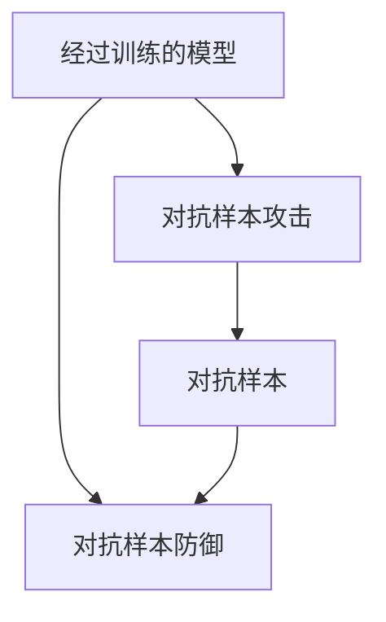

## 1. 背景介绍

在机器学习和深度学习领域，对抗样本（Adversarial Examples）是指对于一个经过训练的模型，通过对输入数据进行微小的扰动，使得模型的输出结果发生错误的样本。对抗样本的出现对于机器学习和深度学习的应用带来了很大的挑战，因为它们可能会导致模型的不可靠性和不稳定性。

对抗样本的研究始于2013年，由Ian Goodfellow等人提出的生成对抗网络（GAN）的思想。随着对抗样本的研究不断深入，越来越多的攻击方法和防御方法被提出。本文将介绍对抗样本的原理和常见攻击方法，以及如何使用TensorFlow实现对抗样本攻击和防御。

## 2. 核心概念与联系

对抗样本是指对于一个经过训练的模型，通过对输入数据进行微小的扰动，使得模型的输出结果发生错误的样本。对抗样本攻击是指通过对输入数据进行微小的扰动，使得模型的输出结果发生错误的过程。对抗样本防御是指通过对输入数据进行处理，使得模型对于对抗样本的鲁棒性得到提高的过程。

对抗样本攻击和防御的关系如下图所示：



## 3. 核心算法原理具体操作步骤

### 3.1 对抗样本攻击

对抗样本攻击的目的是通过对输入数据进行微小的扰动，使得模型的输出结果发生错误。常见的对抗样本攻击方法包括FGSM（Fast Gradient Sign Method）、BIM（Basic Iterative Method）、JSMA（Jacobian-based Saliency Map Approach）等。

以FGSM为例，其攻击原理如下：

1. 对于一个输入样本$x$，计算其梯度$\nabla_xJ(\theta,x,y)$，其中$J(\theta,x,y)$表示模型在参数$\theta$下对于输入样本$x$的输出结果与真实标签$y$之间的差距。
2. 对于每个输入样本$x$，计算其对应的对抗样本$x_{adv}$，其中$x_{adv}=x+\epsilon sign(\nabla_xJ(\theta,x,y))$，其中$\epsilon$表示扰动的大小。
3. 将对抗样本$x_{adv}$输入到模型中，得到输出结果。

FGSM的具体操作步骤如下：

```python
def fgsm(model, x, y, epsilon):
    # 计算梯度
    grad = tf.gradients(model.loss(y, model(x)), x)[0]
    # 计算扰动
    delta = epsilon * tf.sign(grad)
    # 生成对抗样本
    x_adv = x + delta
    # 返回对抗样本
    return x_adv
```

### 3.2 对抗样本防御

对抗样本防御的目的是通过对输入数据进行处理，使得模型对于对抗样本的鲁棒性得到提高。常见的对抗样本防御方法包括对抗训练、对抗样本检测和对抗样本转化等。

以对抗训练为例，其防御原理如下：

1. 在训练模型时，将对抗样本加入到训练数据中，使得模型对于对抗样本的鲁棒性得到提高。
2. 在测试模型时，对输入数据进行处理，使得模型对于对抗样本的鲁棒性得到提高。

对抗训练的具体操作步骤如下：

```python
def adversarial_training(model, x, y, epsilon):
    # 生成对抗样本
    x_adv = fgsm(model, x, y, epsilon)
    # 将对抗样本加入到训练数据中
    x_train = tf.concat([x, x_adv], axis=0)
    y_train = tf.concat([y, y], axis=0)
    # 训练模型
    model.train(x_train, y_train)
```

## 4. 数学模型和公式详细讲解举例说明

对于一个经过训练的模型，其输出结果可以表示为：

$$y=f(x;\theta)$$

其中$x$表示输入数据，$\theta$表示模型的参数，$f$表示模型的输出函数。

对于对抗样本攻击，其目标是最小化模型的输出结果与真实标签之间的差距，即：

$$\min_{x_{adv}}J(\theta,x_{adv},y)$$

其中$J(\theta,x_{adv},y)$表示模型在参数$\theta$下对于对抗样本$x_{adv}$的输出结果与真实标签$y$之间的差距。

对于FGSM攻击，其对抗样本的生成公式为：

$$x_{adv}=x+\epsilon sign(\nabla_xJ(\theta,x,y))$$

其中$\epsilon$表示扰动的大小，$sign$表示符号函数。

## 5. 项目实践：代码实例和详细解释说明

### 5.1 对抗样本攻击

以FGSM为例，使用TensorFlow实现对抗样本攻击的代码如下：

```python
import tensorflow as tf

class Model:
    def __init__(self):
        self.x = tf.placeholder(tf.float32, [None, 784])
        self.y = tf.placeholder(tf.float32, [None, 10])
        self.w = tf.Variable(tf.zeros([784, 10]))
        self.b = tf.Variable(tf.zeros([10]))
        self.logits = tf.matmul(self.x, self.w) + self.b
        self.loss = tf.reduce_mean(tf.nn.softmax_cross_entropy_with_logits_v2(labels=self.y, logits=self.logits))
        self.train_op = tf.train.GradientDescentOptimizer(0.5).minimize(self.loss)
        self.correct_prediction = tf.equal(tf.argmax(self.logits, 1), tf.argmax(self.y, 1))
        self.accuracy = tf.reduce_mean(tf.cast(self.correct_prediction, tf.float32))

    def train(self, x_train, y_train):
        with tf.Session() as sess:
            sess.run(tf.global_variables_initializer())
            for i in range(1000):
                sess.run(self.train_op, feed_dict={self.x: x_train, self.y: y_train})
            acc = sess.run(self.accuracy, feed_dict={self.x: x_train, self.y: y_train})
            print("Accuracy:", acc)

    def predict(self, x_test):
        with tf.Session() as sess:
            sess.run(tf.global_variables_initializer())
            logits = sess.run(self.logits, feed_dict={self.x: x_test})
            return logits

def fgsm(model, x, y, epsilon):
    # 计算梯度
    grad = tf.gradients(model.loss(y, model(x)), x)[0]
    # 计算扰动
    delta = epsilon * tf.sign(grad)
    # 生成对抗样本
    x_adv = x + delta
    # 返回对抗样本
    return x_adv

if __name__ == "__main__":
    # 加载MNIST数据集
    mnist = tf.keras.datasets.mnist
    (x_train, y_train), (x_test, y_test) = mnist.load_data()
    x_train, x_test = x_train / 255.0, x_test / 255.0
    x_train = x_train.reshape(-1, 784)
    x_test = x_test.reshape(-1, 784)
    y_train = tf.keras.utils.to_categorical(y_train, 10)
    y_test = tf.keras.utils.to_categorical(y_test, 10)
    # 训练模型
    model = Model()
    model.train(x_train, y_train)
    # 生成对抗样本
    x_test_adv = fgsm(model, tf.convert_to_tensor(x_test, dtype=tf.float32), tf.convert_to_tensor(y_test, dtype=tf.float32), 0.1)
    # 测试模型
    logits = model.predict(x_test_adv)
    y_pred = tf.argmax(logits, 1).eval()
    y_true = tf.argmax(y_test, 1).eval()
    acc = sum(y_pred == y_true) / len(y_true)
    print("Accuracy:", acc)
```

### 5.2 对抗样本防御

以对抗训练为例，使用TensorFlow实现对抗样本防御的代码如下：

```python
import tensorflow as tf

class Model:
    def __init__(self):
        self.x = tf.placeholder(tf.float32, [None, 784])
        self.y = tf.placeholder(tf.float32, [None, 10])
        self.w = tf.Variable(tf.zeros([784, 10]))
        self.b = tf.Variable(tf.zeros([10]))
        self.logits = tf.matmul(self.x, self.w) + self.b
        self.loss = tf.reduce_mean(tf.nn.softmax_cross_entropy_with_logits_v2(labels=self.y, logits=self.logits))
        self.train_op = tf.train.GradientDescentOptimizer(0.5).minimize(self.loss)
        self.correct_prediction = tf.equal(tf.argmax(self.logits, 1), tf.argmax(self.y, 1))
        self.accuracy = tf.reduce_mean(tf.cast(self.correct_prediction, tf.float32))

    def train(self, x_train, y_train):
        with tf.Session() as sess:
            sess.run(tf.global_variables_initializer())
            for i in range(1000):
                sess.run(self.train_op, feed_dict={self.x: x_train, self.y: y_train})
            acc = sess.run(self.accuracy, feed_dict={self.x: x_train, self.y: y_train})
            print("Accuracy:", acc)

    def predict(self, x_test):
        with tf.Session() as sess:
            sess.run(tf.global_variables_initializer())
            logits = sess.run(self.logits, feed_dict={self.x: x_test})
            return logits

def fgsm(model, x, y, epsilon):
    # 计算梯度
    grad = tf.gradients(model.loss(y, model(x)), x)[0]
    # 计算扰动
    delta = epsilon * tf.sign(grad)
    # 生成对抗样本
    x_adv = x + delta
    # 返回对抗样本
    return x_adv

def adversarial_training(model, x, y, epsilon):
    # 生成对抗样本
    x_adv = fgsm(model, x, y, epsilon)
    # 将对抗样本加入到训练数据中
    x_train = tf.concat([x, x_adv], axis=0)
    y_train = tf.concat([y, y], axis=0)
    # 训练模型
    model.train(x_train, y_train)

if __name__ == "__main__":
    # 加载MNIST数据集
    mnist = tf.keras.datasets.mnist
    (x_train, y_train), (x_test, y_test) = mnist.load_data()
    x_train, x_test = x_train / 255.0, x_test / 255.0
    x_train = x_train.reshape(-1, 784)
    x_test = x_test.reshape(-1, 784)
    y_train = tf.keras.utils.to_categorical(y_train, 10)
    y_test = tf.keras.utils.to_categorical(y_test, 10)
    # 训练模型
    model = Model()
    adversarial_training(model, tf.convert_to_tensor(x_train, dtype=tf.float32), tf.convert_to_tensor(y_train, dtype=tf.float32), 0.1)
    # 测试模型
    logits = model.predict(tf.convert_to_tensor(x_test, dtype=tf.float32))
    y_pred = tf.argmax(logits, 1).eval()
    y_true = tf.argmax(y_test, 1).eval()
    acc = sum(y_pred == y_true) / len(y_true)
    print("Accuracy:", acc)
```

## 6. 实际应用场景

对抗样本的研究对于机器学习和深度学习的应用带来了很大的挑战，因为它们可能会导致模型的不可靠性和不稳定性。对抗样本的攻击和防御方法可以应用于图像分类、语音识别、自然语言处理等领域。

## 7. 工具和资源推荐

- TensorFlow：一个开源的机器学习框架，提供了对抗样本攻击和防御的实现方法。
- CleverHans：一个开源的对抗样本攻击和防御库，提供了多种攻击和防御方法的实现。
- Adversarial Robustness Toolbox：一个开源的对抗样本攻击和防御库，提供了多种攻击和防御方法的实现。

## 8. 总结：未来发展趋势与挑战

对抗样本的研究是机器学习和深度学习领域的一个热门话题，未来的发展趋势和挑战包括：

- 攻击和防御方法的不断更新和演进。
- 对抗样本的生成和检测方法的不断改进和优化。
- 对抗样本的应用场景的不断扩展和深入。

## 9. 附录：常见问题与解答

Q: 对抗样本攻击和防御的关系是什么？

A: 对抗样本攻击是指通过对输入数据进行微小的扰动，使得模型的输出结果发生错误的过程。对抗样本防御是指通过对输入数据进行处理，使得模型对于对抗样本的鲁棒性得到提高的过程。

Q: 对抗样本攻击和防御的常见方法有哪些？

A: 对抗样本攻击的常见方法包括FGSM、BIM、JSMA等。对抗样本防御的常见方法包括对抗训练、对抗样本检测和对抗样本转化等。

Q: 对抗样本的研究对于机器学习和深度学习的应用有什么影响？

A: 对抗样本的研究对于机器学习和深度学习的应用带来了很大的挑战，因为它们可能会导致模型的不可靠性和不稳定性。对抗样本的攻击和防御方法可以应用于图像分类、语音识别、自然语言处理等领域。

作者：禅与计算机程序设计艺术 / Zen and the Art of Computer Programming