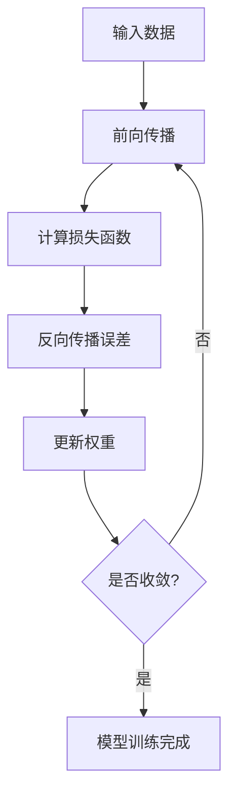

# 神经网络 (Neural Network)

## 1.背景介绍

神经网络是一种受生物神经系统启发而设计的计算模型,旨在模拟人脑的信息处理方式。它由大量互相连接的节点(神经元)组成,每个节点接收来自其他节点的输入信号,经过加权求和和非线性激活函数的处理后,产生输出信号传递给下一层节点。

神经网络具有自适应性强、容错性高、并行处理能力强等优点,可以用于模式识别、数据预测、系统控制等广泛领域。随着计算能力的提高和大数据时代的到来,神经网络在语音识别、图像识别、自然语言处理等人工智能领域取得了突破性进展。

## 2.核心概念与联系

神经网络的核心概念包括:

### 2.1 神经元(Neuron)

神经元是神经网络的基本计算单元,模拟生物神经元的工作原理。每个神经元接收来自其他神经元或外部输入的加权信号,将它们相加并应用激活函数,产生输出信号传递给下一层神经元。

### 2.2 连接权重(Weight)

连接权重决定了输入信号对神经元输出的影响程度。在训练过程中,权重会不断调整,以最小化预测误差。

### 2.3 激活函数(Activation Function)

激活函数引入非线性,使神经网络能够学习复杂的映射关系。常用的激活函数包括Sigmoid、ReLU、Tanh等。

### 2.4 网络结构

神经网络按层次结构可分为输入层、隐藏层和输出层。输入层接收外部数据,隐藏层对数据进行特征提取和转换,输出层产生最终结果。

### 2.5 学习算法

神经网络通过学习算法(如反向传播算法)对连接权重进行调整,使网络输出逐渐接近期望值。常用的优化算法包括梯度下降、随机梯度下降等。

上述概念相互关联、相辅相成,共同构建了神经网络的基本框架。

## 3.核心算法原理具体操作步骤

神经网络的核心算法是反向传播算法(Back Propagation),用于训练多层神经网络。算法步骤如下:

1. **前向传播**:输入数据从输入层开始,经过隐藏层的加权求和和激活函数处理,最终到达输出层,得到网络的输出结果。

2. **计算损失函数**:将网络输出与期望输出进行比较,计算损失函数(如均方误差)。

3. **反向传播误差**:从输出层开始,将误差沿着网络连接的反方向传播,计算每个权重对最终误差的敏感度(梯度)。

4. **更新权重**:根据梯度下降法则,沿梯度的反方向调整每个连接权重,使损失函数值下降。

5. **重复迭代**:重复上述步骤,直到损失函数收敛或达到设定的迭代次数。

该算法的关键在于链式法则,通过反向传播计算每个权重对误差的梯度,从而更新权重。算法流程图如下:



## 4.数学模型和公式详细讲解举例说明

### 4.1 神经元模型

神经元的数学模型可表示为:

$$
y = \phi\left(\sum_{i=1}^{n}w_ix_i + b\right)
$$

其中:
- $x_i$是第$i$个输入
- $w_i$是与第$i$个输入相关的权重
- $b$是偏置项(bias)
- $\phi$是激活函数
- $y$是神经元的输出

例如,对于一个具有两个输入的神经元,其输出可计算为:

$$
y = \phi\left(w_1x_1 + w_2x_2 + b\right)
$$

### 4.2 损失函数

损失函数用于衡量网络输出与期望输出之间的差距。常用的损失函数包括:

1. **均方误差(Mean Squared Error, MSE)**:

$$
\text{MSE} = \frac{1}{n}\sum_{i=1}^{n}(y_i - \hat{y}_i)^2
$$

其中$y_i$是期望输出,$\hat{y}_i$是网络输出,n是样本数量。

2. **交叉熵损失(Cross-Entropy Loss)**:

对于二分类问题:
$$
\text{CrossEntropy} = -\frac{1}{n}\sum_{i=1}^{n}[y_i\log(\hat{y}_i) + (1-y_i)\log(1-\hat{y}_i)]
$$

对于多分类问题:
$$
\text{CrossEntropy} = -\frac{1}{n}\sum_{i=1}^{n}\sum_{j=1}^{C}y_{ij}\log(\hat{y}_{ij})
$$

其中$C$是类别数量。

### 4.3 权重更新

在反向传播过程中,权重根据梯度下降法则进行更新:

$$
w_{ij}^{(t+1)} = w_{ij}^{(t)} - \eta\frac{\partial E}{\partial w_{ij}}
$$

其中:
- $w_{ij}^{(t)}$是当前权重
- $\eta$是学习率(控制更新幅度)
- $\frac{\partial E}{\partial w_{ij}}$是权重对损失函数的梯度

通过迭代优化,权重逐渐调整,使损失函数值下降,网络输出逐渐接近期望输出。

## 5.项目实践:代码实例和详细解释说明

以下是使用Python和TensorFlow构建一个简单的前馈神经网络的代码示例:

```python
import tensorflow as tf

# 定义输入和输出
X = tf.placeholder(tf.float32, [None, 3])
y = tf.placeholder(tf.float32, [None, 1])

# 定义神经网络结构
W1 = tf.Variable(tf.random_normal([3, 5]))
b1 = tf.Variable(tf.zeros([5]))
h1 = tf.nn.relu(tf.matmul(X, W1) + b1)

W2 = tf.Variable(tf.random_normal([5, 1]))
b2 = tf.Variable(tf.zeros([1]))
y_pred = tf.matmul(h1, W2) + b2

# 定义损失函数和优化器
loss = tf.reduce_mean(tf.square(y_pred - y))
optimizer = tf.train.GradientDescentOptimizer(0.01).minimize(loss)

# 训练模型
with tf.Session() as sess:
    sess.run(tf.global_variables_initializer())
    for epoch in range(1000):
        # 输入训练数据
        _, current_loss = sess.run([optimizer, loss], feed_dict={X: X_train, y: y_train})
        if epoch % 100 == 0:
            print(f"Epoch {epoch}, Loss: {current_loss}")

    # 评估模型
    y_test_pred = sess.run(y_pred, feed_dict={X: X_test})
    print(f"Test MSE: {tf.reduce_mean(tf.square(y_test_pred - y_test)).eval()}")
```

代码解释:

1. 首先定义输入`X`和输出`y`的占位符,用于在训练时提供数据。

2. 定义神经网络结构,包括一个隐藏层和一个输出层。隐藏层使用ReLU激活函数,输出层为线性层。

3. 定义损失函数(均方误差)和优化器(梯度下降)。

4. 在会话中,初始化变量,然后进行1000次迭代训练。每100次迭代打印当前损失值。

5. 在测试集上评估模型性能,计算均方误差。

上述代码展示了如何使用TensorFlow构建一个简单的前馈神经网络,包括定义网络结构、损失函数、优化器,以及训练和评估模型的过程。在实际应用中,可以根据具体问题调整网络结构、超参数等,以获得更好的性能。

## 6.实际应用场景

神经网络在各个领域都有广泛的应用,下面列举一些典型场景:

1. **计算机视觉**:图像分类、目标检测、语义分割等,如识别交通标志、人脸等。

2. **自然语言处理**:机器翻译、文本生成、情感分析、问答系统等。

3. **语音识别**:将语音信号转换为文本,应用于智能助手、语音输入等。

4. **推荐系统**:根据用户历史行为预测用户偏好,为用户推荐感兴趣的内容。

5. **金融**:股票预测、贷款风险评估、欺诈检测等。

6. **医疗**:医学图像分析、疾病诊断、药物发现等。

7. **游戏AI**:训练智能体与人类对抗,如AlphaGo等。

8. **机器人控制**:通过神经网络控制机器人的运动和行为。

神经网络在上述场景中发挥着不可替代的作用,极大推动了人工智能的发展。

## 7.工具和资源推荐

学习和使用神经网络时,有许多优秀的工具和资源可供参考:

1. **深度学习框架**:TensorFlow、PyTorch、Keras等,提供了构建、训练和部署神经网络的API。

2. **在线课程**:Coursera、edX、Udacity等平台提供了大量优质的深度学习课程。

3. **书籍**:《深度学习》(Goodfellow等著)、《神经网络与深度学习》(Michael Nielsen著)等经典著作。

4. **论文**:阅读顶级会议(如NeurIPS、ICML、ICLR等)和期刊(如JMLR、TPAMI等)上的最新论文,了解前沿研究进展。

5. **开源项目**:GitHub上有大量优秀的开源深度学习项目,可以学习和贡献代码。

6. **在线社区**:如StackOverflow、Reddit等,可以与其他从业者交流讨论。

7. **云计算平台**:Google Colab、AWS、Azure等提供GPU加速的计算资源。

利用这些丰富的资源,可以更高效地学习和应用神经网络技术。

## 8.总结:未来发展趋势与挑战

神经网络在过去几年取得了长足的进步,但仍面临一些挑战和发展方向:

1. **可解释性**:神经网络常被视为"黑箱",决策过程缺乏透明度,需要提高可解释性。

2. **鲁棒性**:神经网络容易受到对抗性攻击,对噪声和微小扰动敏感,需要提高鲁棒性。

3. **少样本学习**:现有神经网络需要大量标注数据进行训练,而在某些领域获取大量标注数据困难,需要发展少样本学习技术。

4. **迁移学习**:如何将在某一领域学习到的知识有效迁移到另一领域,提高学习效率。

5. **注意力机制**:注意力机制有助于神经网络更好地关注输入的重要部分,在自然语言处理等领域表现出色。

6. **生成对抗网络(GAN)**:GAN在图像生成、语音合成等领域展现出巨大潜力,但训练过程不稳定,需要进一步改进。

7. **模型压缩**:大型神经网络模型需要大量计算资源,模型压缩技术可以减小模型尺寸,降低部署成本。

8. **联邦学习**:保护用户隐私的同时利用分散的数据进行协同训练,是一个值得关注的研究方向。

总的来说,神经网络技术仍在快速发展,未来将在更多领域发挥重要作用,同时也面临诸多挑战亟待解决。

## 9.附录:常见问题与解答

1. **什么是过拟合?如何避免过拟合?**

过拟合是指神经网络在训练数据上表现良好,但在新数据上泛化能力差的情况。避免过拟合的方法包括:
- 增加训练数据量
- 使用正则化技术(如L1/L2正则化、Dropout等)
- 进行数据增强(如翻转、旋转等)
- 提前停止训练
- 减小网络容量(减少层数或神经元数量)

2. **为什么需要非线性激活函数?**

如果没有非线性激活函数,即使是深层网络,也等价于一个单层的线性变换,无法学习复杂的非线性映射关系。引入非线性激活