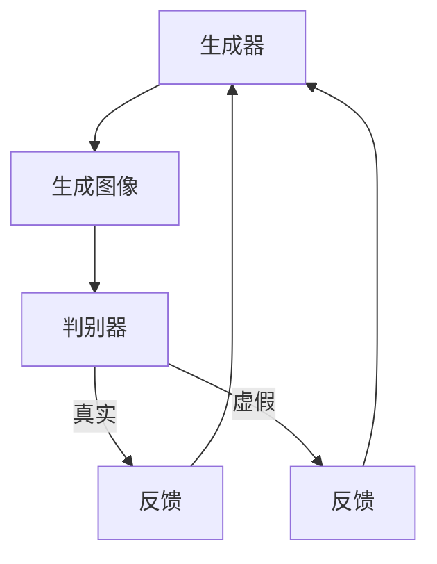

# AIGC从入门到实战：绘制美丽小姐姐的提示词写作技巧

## 1.背景介绍

在人工智能生成内容（AIGC）领域，生成图像的技术已经取得了显著的进展。特别是通过提示词（Prompt）来生成特定风格和内容的图像，已经成为一种流行的技术手段。本文将深入探讨如何通过提示词生成美丽小姐姐的图像，并提供详细的技术指导和实战技巧。

## 2.核心概念与联系

### 2.1 AIGC简介

AIGC，即人工智能生成内容，指的是利用人工智能技术生成文本、图像、音频等多种形式的内容。近年来，随着深度学习和生成对抗网络（GANs）的发展，AIGC在图像生成领域取得了突破性进展。

### 2.2 提示词的作用

提示词是指在生成内容时，提供给模型的文本描述。这些描述可以是具体的形容词、名词或短语，用来指导模型生成符合预期的内容。提示词的选择和组合直接影响生成图像的质量和风格。

### 2.3 生成对抗网络（GANs）

生成对抗网络（GANs）是AIGC的核心技术之一。GANs由生成器和判别器两个部分组成，生成器负责生成图像，判别器负责判断图像的真实性。通过不断的对抗训练，生成器能够生成越来越逼真的图像。



## 3.核心算法原理具体操作步骤

### 3.1 数据准备

首先，需要准备大量的图像数据集，这些数据集可以是公开的图像库，也可以是自己拍摄的照片。数据集的质量和多样性直接影响生成模型的效果。

### 3.2 模型选择

选择合适的生成模型是关键。目前，常用的生成模型包括StyleGAN、BigGAN等。这些模型在生成高质量图像方面表现出色。

### 3.3 模型训练

模型训练是一个复杂的过程，需要大量的计算资源和时间。训练过程中，需要不断调整模型参数，优化生成效果。

### 3.4 提示词设计

提示词的设计需要结合具体的生成目标。对于生成美丽小姐姐的图像，可以使用一些描述外貌、服饰、背景等方面的词汇。例如：“美丽的小姐姐，穿着红色连衣裙，背景是樱花树”。

### 3.5 图像生成

通过输入设计好的提示词，使用训练好的生成模型，即可生成符合预期的图像。生成过程中，可以不断调整提示词，优化生成效果。

## 4.数学模型和公式详细讲解举例说明

### 4.1 生成对抗网络（GANs）数学模型

生成对抗网络的核心思想是通过生成器和判别器的对抗训练，使生成器能够生成逼真的图像。其数学模型可以表示为：

$$
\min_G \max_D V(D, G) = \mathbb{E}_{x \sim p_{data}(x)}[\log D(x)] + \mathbb{E}_{z \sim p_z(z)}[\log(1 - D(G(z)))]
$$

其中，$G$ 是生成器，$D$ 是判别器，$p_{data}(x)$ 是真实数据的分布，$p_z(z)$ 是噪声的分布。

### 4.2 提示词嵌入

提示词嵌入是将文本提示词转换为模型可以理解的向量表示。常用的方法是使用预训练的词向量模型，如Word2Vec、GloVe等。假设提示词为 $T$，其嵌入向量为 $E(T)$，则生成模型的输入可以表示为：

$$
G(E(T), z)
$$

其中，$z$ 是随机噪声向量。

### 4.3 实例讲解

假设我们有一个提示词：“美丽的小姐姐，穿着红色连衣裙，背景是樱花树”。首先，将提示词转换为嵌入向量 $E(T)$，然后输入到生成模型中：

$$
G(E(T), z) \rightarrow \text{生成图像}
$$

通过不断调整提示词和噪声向量 $z$，可以生成不同风格和内容的图像。

## 5.项目实践：代码实例和详细解释说明

### 5.1 环境配置

首先，需要配置好深度学习环境。推荐使用Python和TensorFlow或PyTorch框架。以下是环境配置的基本步骤：

```bash
# 安装Python
sudo apt-get install python3

# 安装pip
sudo apt-get install python3-pip

# 安装TensorFlow
pip3 install tensorflow

# 安装PyTorch
pip3 install torch torchvision
```

### 5.2 数据集准备

下载并准备好图像数据集，可以使用公开的CelebA数据集：

```bash
# 下载CelebA数据集
wget http://mmlab.ie.cuhk.edu.hk/projects/CelebA.html
```

### 5.3 模型训练

以下是使用TensorFlow训练GAN模型的示例代码：

```python
import tensorflow as tf
from tensorflow.keras import layers

# 生成器模型
def make_generator_model():
    model = tf.keras.Sequential()
    model.add(layers.Dense(7*7*256, use_bias=False, input_shape=(100,)))
    model.add(layers.BatchNormalization())
    model.add(layers.LeakyReLU())
    model.add(layers.Reshape((7, 7, 256)))
    model.add(layers.Conv2DTranspose(128, (5, 5), strides=(1, 1), padding='same', use_bias=False))
    model.add(layers.BatchNormalization())
    model.add(layers.LeakyReLU())
    model.add(layers.Conv2DTranspose(64, (5, 5), strides=(2, 2), padding='same', use_bias=False))
    model.add(layers.BatchNormalization())
    model.add(layers.LeakyReLU())
    model.add(layers.Conv2DTranspose(1, (5, 5), strides=(2, 2), padding='same', use_bias=False, activation='tanh'))
    return model

# 判别器模型
def make_discriminator_model():
    model = tf.keras.Sequential()
    model.add(layers.Conv2D(64, (5, 5), strides=(2, 2), padding='same', input_shape=[28, 28, 1]))
    model.add(layers.LeakyReLU())
    model.add(layers.Dropout(0.3))
    model.add(layers.Conv2D(128, (5, 5), strides=(2, 2), padding='same'))
    model.add(layers.LeakyReLU())
    model.add(layers.Dropout(0.3))
    model.add(layers.Flatten())
    model.add(layers.Dense(1))
    return model

# 训练过程
def train(dataset, epochs):
    for epoch in range(epochs):
        for image_batch in dataset:
            train_step(image_batch)

# 训练步骤
@tf.function
def train_step(images):
    noise = tf.random.normal([BATCH_SIZE, noise_dim])
    with tf.GradientTape() as gen_tape, tf.GradientTape() as disc_tape:
        generated_images = generator(noise, training=True)
        real_output = discriminator(images, training=True)
        fake_output = discriminator(generated_images, training=True)
        gen_loss = generator_loss(fake_output)
        disc_loss = discriminator_loss(real_output, fake_output)
    gradients_of_generator = gen_tape.gradient(gen_loss, generator.trainable_variables)
    gradients_of_discriminator = disc_tape.gradient(disc_loss, discriminator.trainable_variables)
    generator_optimizer.apply_gradients(zip(gradients_of_generator, generator.trainable_variables))
    discriminator_optimizer.apply_gradients(zip(gradients_of_discriminator, discriminator.trainable_variables))
```

### 5.4 提示词生成

使用预训练的词向量模型将提示词转换为嵌入向量：

```python
from gensim.models import Word2Vec

# 加载预训练的Word2Vec模型
model = Word2Vec.load("path/to/word2vec/model")

# 提示词
prompt = "美丽的小姐姐，穿着红色连衣裙，背景是樱花树"

# 转换为嵌入向量
embedding = model.wv[prompt.split()]
```

### 5.5 图像生成

将嵌入向量输入到生成模型中，生成图像：

```python
# 噪声向量
noise = tf.random.normal([1, 100])

# 生成图像
generated_image = generator(embedding, noise)
```

## 6.实际应用场景

### 6.1 艺术创作

通过提示词生成图像，可以用于艺术创作，生成独特的艺术作品。

### 6.2 游戏开发

在游戏开发中，可以使用提示词生成角色形象，提升游戏的多样性和趣味性。

### 6.3 广告设计

在广告设计中，可以通过提示词生成符合广告主题的图像，提高广告的视觉效果。

## 7.工具和资源推荐

### 7.1 开源框架

- TensorFlow: https://www.tensorflow.org/
- PyTorch: https://pytorch.org/

### 7.2 数据集

- CelebA: http://mmlab.ie.cuhk.edu.hk/projects/CelebA.html
- ImageNet: http://www.image-net.org/

### 7.3 预训练模型

- Word2Vec: https://code.google.com/archive/p/word2vec/
- GloVe: https://nlp.stanford.edu/projects/glove/

## 8.总结：未来发展趋势与挑战

AIGC技术在图像生成领域展现了巨大的潜力，但也面临一些挑战。未来的发展趋势包括：

### 8.1 模型优化

进一步优化生成模型，提高生成图像的质量和多样性。

### 8.2 提示词理解

提升模型对提示词的理解能力，使生成图像更加符合预期。

### 8.3 伦理和法律问题

随着AIGC技术的发展，伦理和法律问题也需要引起重视，确保技术的合理使用。

## 9.附录：常见问题与解答

### 9.1 如何选择合适的生成模型？

选择生成模型时，可以根据具体需求和数据集的特点进行选择。常用的生成模型包括StyleGAN、BigGAN等。

### 9.2 提示词如何设计？

提示词的设计需要结合具体的生成目标，使用描述外貌、服饰、背景等方面的词汇。

### 9.3 如何优化生成效果？

可以通过调整提示词、优化模型参数、增加数据集多样性等方法，优化生成效果。

---

作者：禅与计算机程序设计艺术 / Zen and the Art of Computer Programming