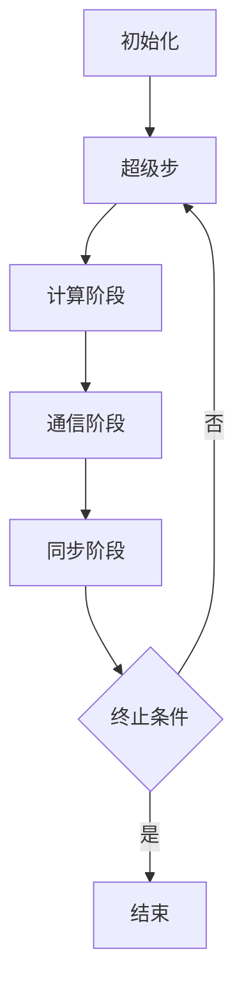

# Pregel原理与代码实例讲解

## 1.背景介绍

在大数据时代，图计算成为了处理复杂关系和结构化数据的关键技术。图计算广泛应用于社交网络分析、推荐系统、网络安全等领域。Google在2009年提出的Pregel框架，为大规模图计算提供了一种高效、可扩展的解决方案。Pregel基于BSP（Bulk Synchronous Parallel）模型，能够在分布式环境中高效处理大规模图数据。

## 2.核心概念与联系

### 2.1 Pregel框架概述

Pregel是一个分布式图计算框架，旨在处理大规模图数据。其核心思想是将图计算分解为一系列超级步（superstep），每个超级步由并行执行的计算、通信和同步阶段组成。

### 2.2 BSP模型

BSP模型是Pregel的基础。BSP模型将计算过程分为计算阶段、通信阶段和同步阶段。每个计算节点在计算阶段执行本地计算，在通信阶段与其他节点交换数据，在同步阶段等待所有节点完成当前超级步。

### 2.3 顶点和边

在Pregel中，图由顶点（vertex）和边（edge）组成。每个顶点包含一个唯一标识符、顶点值和边列表。边连接两个顶点，并包含边的权重。

### 2.4 消息传递机制

Pregel采用消息传递机制，顶点通过发送和接收消息与其他顶点通信。每个顶点在超级步中可以发送消息给其他顶点，消息将在下一个超级步中被接收。

## 3.核心算法原理具体操作步骤

### 3.1 初始化

在初始化阶段，图数据被分割并分配到各个计算节点。每个顶点被初始化为活跃状态，并准备开始计算。

### 3.2 超级步

每个超级步由以下三个阶段组成：

1. **计算阶段**：每个活跃顶点执行用户定义的计算逻辑，处理接收到的消息，并决定是否发送消息给其他顶点。
2. **通信阶段**：顶点之间交换消息，消息在网络上传输。
3. **同步阶段**：所有顶点等待当前超级步完成，并进入下一个超级步。

### 3.3 终止条件

计算过程在满足终止条件时结束。终止条件可以是所有顶点都处于非活跃状态，或达到预定的超级步数。

以下是Pregel算法的Mermaid流程图：



## 4.数学模型和公式详细讲解举例说明

### 4.1 图的表示

图 $G$ 由顶点集合 $V$ 和边集合 $E$ 组成：

$$
G = (V, E)
$$

### 4.2 顶点和边的属性

每个顶点 $v \in V$ 具有一个唯一标识符 $id(v)$ 和顶点值 $value(v)$。每条边 $e \in E$ 连接两个顶点 $u$ 和 $v$，并具有边权重 $weight(e)$。

### 4.3 消息传递

在超级步 $s$ 中，顶点 $v$ 接收到的消息集合为 $M_s(v)$。顶点 $v$ 在超级步 $s+1$ 中发送的消息集合为 $M_{s+1}(v)$。

### 4.4 计算逻辑

顶点 $v$ 在超级步 $s$ 中的计算逻辑可以表示为：

$$
value(v) = f(value(v), M_s(v))
$$

其中，$f$ 是用户定义的计算函数。

### 4.5 终止条件

计算过程在满足以下条件之一时终止：

1. 所有顶点都处于非活跃状态。
2. 达到预定的超级步数 $S$。

## 5.项目实践：代码实例和详细解释说明

### 5.1 环境准备

首先，确保安装了Java开发环境和Apache Hadoop。Pregel的实现可以基于Apache Giraph，这是一个开源的Pregel实现。

### 5.2 示例代码

以下是一个使用Apache Giraph实现的PageRank算法示例：

```java
import org.apache.giraph.graph.BasicComputation;
import org.apache.giraph.graph.Vertex;
import org.apache.hadoop.io.DoubleWritable;
import org.apache.hadoop.io.LongWritable;
import org.apache.hadoop.io.NullWritable;

public class PageRankComputation extends BasicComputation<
    LongWritable, DoubleWritable, NullWritable, DoubleWritable> {

    private static final double DAMPING_FACTOR = 0.85;
    private static final int MAX_SUPERSTEPS = 30;

    @Override
    public void compute(Vertex<LongWritable, DoubleWritable, NullWritable> vertex,
                        Iterable<DoubleWritable> messages) {
        if (getSuperstep() == 0) {
            vertex.setValue(new DoubleWritable(1.0));
        } else {
            double sum = 0;
            for (DoubleWritable message : messages) {
                sum += message.get();
            }
            double newValue = (1 - DAMPING_FACTOR) / getTotalNumVertices() + DAMPING_FACTOR * sum;
            vertex.setValue(new DoubleWritable(newValue));
        }

        if (getSuperstep() < MAX_SUPERSTEPS) {
            sendMessageToAllEdges(vertex, new DoubleWritable(vertex.getValue().get() / vertex.getNumEdges()));
        } else {
            vertex.voteToHalt();
        }
    }
}
```

### 5.3 代码解释

1. **初始化**：在第一个超级步中，所有顶点的初始PageRank值设为1.0。
2. **计算阶段**：在每个超级步中，顶点接收来自其他顶点的消息，计算新的PageRank值。
3. **消息传递**：顶点将新的PageRank值除以出边数，并发送给所有相邻顶点。
4. **终止条件**：在达到最大超级步数后，顶点停止计算。

## 6.实际应用场景

### 6.1 社交网络分析

Pregel可以用于分析社交网络中的用户关系，例如计算用户的影响力、发现社区结构等。

### 6.2 推荐系统

在推荐系统中，Pregel可以用于计算用户和物品之间的相似度，生成个性化推荐。

### 6.3 网络安全

Pregel可以用于检测网络中的异常行为，例如识别恶意节点、分析网络攻击路径等。

## 7.工具和资源推荐

### 7.1 Apache Giraph

Apache Giraph是一个开源的Pregel实现，适用于大规模图计算。官方网站：[http://giraph.apache.org/](http://giraph.apache.org/)

### 7.2 GraphX

GraphX是Apache Spark的图计算库，支持Pregel API。官方网站：[https://spark.apache.org/graphx/](https://spark.apache.org/graphx/)

### 7.3 Neo4j

Neo4j是一个高性能的图数据库，支持图计算和分析。官方网站：[https://neo4j.com/](https://neo4j.com/)

## 8.总结：未来发展趋势与挑战

### 8.1 发展趋势

随着大数据和人工智能的发展，图计算将变得越来越重要。未来，图计算框架将更加高效、易用，并支持更多的应用场景。

### 8.2 挑战

1. **数据规模**：处理大规模图数据仍然是一个挑战，需要更高效的存储和计算技术。
2. **算法优化**：图计算算法需要不断优化，以提高计算效率和准确性。
3. **分布式计算**：在分布式环境中，如何高效地进行图计算和数据通信是一个重要问题。

## 9.附录：常见问题与解答

### 9.1 Pregel与MapReduce的区别是什么？

Pregel专注于图计算，采用BSP模型，而MapReduce是一种通用的分布式计算模型，适用于各种数据处理任务。

### 9.2 Pregel适用于哪些类型的图计算？

Pregel适用于各种图计算任务，包括PageRank、最短路径、连通分量等。

### 9.3 如何优化Pregel的性能？

可以通过优化计算逻辑、减少消息传递、使用高效的存储和通信技术来提高Pregel的性能。

### 9.4 Pregel是否支持动态图？

Pregel主要设计用于静态图计算，但可以通过扩展和修改来支持动态图。

### 9.5 Pregel的实现有哪些？

除了Apache Giraph，还有Google的原始实现和其他开源项目如GraphX等。

---

作者：禅与计算机程序设计艺术 / Zen and the Art of Computer Programming