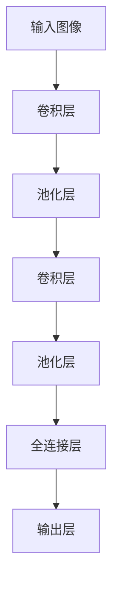

# Python深度学习实践：深度学习在医学图像分析中的运用

## 1.背景介绍

医学图像分析是现代医学中不可或缺的一部分。随着医疗技术的进步，医学图像的种类和数量不断增加，如X射线、CT、MRI等。这些图像包含了大量的医学信息，如何高效、准确地分析这些图像成为了一个重要的研究课题。深度学习，尤其是卷积神经网络（CNN），在图像处理领域表现出色，成为医学图像分析的有力工具。

## 2.核心概念与联系

### 2.1 深度学习与卷积神经网络

深度学习是一种基于人工神经网络的机器学习方法，能够自动从数据中提取特征。卷积神经网络（CNN）是深度学习的一种，特别适用于图像处理。CNN通过卷积层、池化层和全连接层的组合，能够有效地捕捉图像中的空间特征。

### 2.2 医学图像分析的挑战

医学图像分析面临许多挑战，包括图像质量不均、噪声干扰、病变区域的多样性等。深度学习通过其强大的特征提取能力，能够在一定程度上克服这些挑战，提高分析的准确性和效率。

### 2.3 Python在深度学习中的应用

Python因其简洁的语法和丰富的库，成为深度学习领域的首选编程语言。TensorFlow、Keras、PyTorch等深度学习框架提供了强大的工具，使得研究人员和工程师能够快速构建和训练深度学习模型。

## 3.核心算法原理具体操作步骤

### 3.1 数据预处理

数据预处理是深度学习的第一步，包括图像的归一化、数据增强等。归一化可以将图像像素值缩放到0到1之间，数据增强则通过旋转、翻转、裁剪等操作增加数据的多样性。

### 3.2 模型构建

模型构建是深度学习的核心步骤。以CNN为例，通常包括以下几个层次：

- **卷积层**：提取图像的局部特征。
- **池化层**：降低特征图的维度，减少计算量。
- **全连接层**：将提取的特征映射到分类空间。



### 3.3 模型训练

模型训练是通过反向传播算法调整模型参数，使得模型在训练数据上的表现不断优化。常用的优化算法包括随机梯度下降（SGD）、Adam等。

### 3.4 模型评估

模型评估是通过验证集或测试集评估模型的性能。常用的评估指标包括准确率、召回率、F1分数等。

## 4.数学模型和公式详细讲解举例说明

### 4.1 卷积运算

卷积运算是CNN的核心操作。假设输入图像为 $I$，卷积核为 $K$，则卷积操作可以表示为：

$$
(I * K)(i, j) = \sum_m \sum_n I(i+m, j+n) \cdot K(m, n)
$$

### 4.2 激活函数

激活函数引入非线性，使得神经网络能够拟合复杂的函数。常用的激活函数包括ReLU、Sigmoid、Tanh等。ReLU函数定义为：

$$
f(x) = \max(0, x)
$$

### 4.3 损失函数

损失函数用于衡量模型预测值与真实值之间的差异。常用的损失函数包括均方误差（MSE）、交叉熵损失等。交叉熵损失定义为：

$$
L = -\sum_i y_i \log(p_i)
$$

其中，$y_i$ 是真实标签，$p_i$ 是预测概率。

## 5.项目实践：代码实例和详细解释说明

### 5.1 数据预处理

```python
import numpy as np
from tensorflow.keras.preprocessing.image import ImageDataGenerator

# 数据增强
datagen = ImageDataGenerator(
    rescale=1./255,
    rotation_range=20,
    width_shift_range=0.2,
    height_shift_range=0.2,
    horizontal_flip=True
)

# 加载数据
train_data = datagen.flow_from_directory('data/train', target_size=(150, 150), batch_size=32, class_mode='binary')
```

### 5.2 模型构建

```python
from tensorflow.keras.models import Sequential
from tensorflow.keras.layers import Conv2D, MaxPooling2D, Flatten, Dense

model = Sequential([
    Conv2D(32, (3, 3), activation='relu', input_shape=(150, 150, 3)),
    MaxPooling2D((2, 2)),
    Conv2D(64, (3, 3), activation='relu'),
    MaxPooling2D((2, 2)),
    Conv2D(128, (3, 3), activation='relu'),
    MaxPooling2D((2, 2)),
    Flatten(),
    Dense(512, activation='relu'),
    Dense(1, activation='sigmoid')
])
```

### 5.3 模型训练

```python
model.compile(optimizer='adam', loss='binary_crossentropy', metrics=['accuracy'])

history = model.fit(train_data, epochs=10, validation_data=val_data)
```

### 5.4 模型评估

```python
loss, accuracy = model.evaluate(test_data)
print(f'Test Accuracy: {accuracy * 100:.2f}%')
```

## 6.实际应用场景

### 6.1 肿瘤检测

深度学习在肿瘤检测中表现出色，能够自动识别CT、MRI图像中的肿瘤区域，提高诊断的准确性和效率。

### 6.2 器官分割

器官分割是将医学图像中的不同器官区域分割出来，便于医生进行进一步的分析和诊断。深度学习通过其强大的特征提取能力，能够实现高精度的器官分割。

### 6.3 疾病分类

深度学习能够根据医学图像自动分类疾病，如肺炎、糖尿病视网膜病变等，辅助医生进行快速诊断。

## 7.工具和资源推荐

### 7.1 深度学习框架

- **TensorFlow**：谷歌开发的开源深度学习框架，支持多种平台和设备。
- **Keras**：基于TensorFlow的高级神经网络API，简化了深度学习模型的构建和训练。
- **PyTorch**：Facebook开发的开源深度学习框架，支持动态计算图，适合研究和开发。

### 7.2 数据集

- **ImageNet**：包含超过1400万张图像的大规模数据集，广泛用于图像分类和物体检测任务。
- **LUNA16**：肺结节检测数据集，包含大量的CT图像和标注信息。
- **ISIC**：皮肤病变分类数据集，包含大量的皮肤病变图像和标注信息。

### 7.3 在线资源

- **Coursera**：提供多门深度学习和医学图像分析相关的在线课程。
- **Kaggle**：数据科学竞赛平台，提供丰富的数据集和代码示例。

## 8.总结：未来发展趋势与挑战

### 8.1 未来发展趋势

深度学习在医学图像分析中的应用前景广阔。随着计算能力的提升和数据量的增加，深度学习模型将变得更加精确和高效。未来，深度学习有望在个性化医疗、远程医疗等领域发挥更大的作用。

### 8.2 挑战

尽管深度学习在医学图像分析中取得了显著进展，但仍面临一些挑战。首先，医学图像数据的获取和标注成本高昂，数据量不足可能影响模型的性能。其次，深度学习模型的可解释性较差，难以获得医生的信任。最后，模型的泛化能力和鲁棒性仍需进一步提高，以应对不同医院和设备的差异。

## 9.附录：常见问题与解答

### 9.1 深度学习模型为什么需要大量数据？

深度学习模型通过大量数据进行训练，能够自动提取特征并进行分类。数据量越大，模型的泛化能力越强，性能越好。

### 9.2 如何提高深度学习模型的性能？

可以通过数据增强、调整模型结构、优化超参数等方法提高模型的性能。此外，使用预训练模型进行迁移学习也是一种有效的方法。

### 9.3 深度学习在医学图像分析中的应用有哪些伦理问题？

深度学习在医学图像分析中的应用涉及患者隐私和数据安全等伦理问题。需要制定严格的数据保护措施，确保患者隐私不被泄露。

---

作者：禅与计算机程序设计艺术 / Zen and the Art of Computer Programming