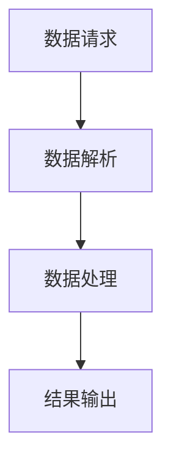

# 【LangChain编程：从入门到实践】API 查询场景

## 1.背景介绍

在现代软件开发中，API（应用程序接口）已经成为连接不同系统和服务的桥梁。随着人工智能和机器学习技术的迅猛发展，如何高效地利用API进行数据查询和处理成为了一个重要课题。LangChain作为一种新兴的编程范式，提供了一种简洁而强大的方式来处理API查询场景。本篇文章将深入探讨LangChain编程在API查询中的应用，从核心概念到实际操作，再到项目实践，全面覆盖这一领域的关键知识点。

## 2.核心概念与联系

### 2.1 LangChain简介

LangChain是一种基于链式结构的编程范式，旨在简化复杂的数据处理流程。通过将多个操作链接在一起，LangChain可以实现高效的数据流处理，特别适用于API查询场景。

### 2.2 API查询的基本概念

API查询是指通过API接口向服务器请求数据的过程。API通常采用RESTful或GraphQL等协议，允许客户端以结构化的方式获取所需数据。

### 2.3 LangChain与API查询的联系

LangChain的链式结构非常适合处理API查询中的多个步骤，例如数据请求、数据解析和数据处理。通过将这些步骤链接在一起，LangChain可以显著简化API查询的实现过程。

## 3.核心算法原理具体操作步骤

### 3.1 链式结构的基本原理

LangChain的核心在于其链式结构。每个操作都是一个链节点，节点之间通过链条连接。数据从一个节点流向下一个节点，直到完成整个处理流程。



### 3.2 API查询的具体操作步骤

1. **数据请求**：通过API接口向服务器发送请求，获取原始数据。
2. **数据解析**：将原始数据解析为结构化格式，例如JSON或XML。
3. **数据处理**：对解析后的数据进行处理，例如过滤、排序和聚合。
4. **结果输出**：将处理后的数据输出到指定位置，例如文件或数据库。

## 4.数学模型和公式详细讲解举例说明

### 4.1 数据请求的数学模型

数据请求可以看作是一个函数 $f$，其输入是请求参数 $x$，输出是服务器返回的数据 $y$：

$$
y = f(x)
$$

### 4.2 数据解析的数学模型

数据解析可以看作是一个函数 $g$，其输入是原始数据 $y$，输出是结构化数据 $z$：

$$
z = g(y)
$$

### 4.3 数据处理的数学模型

数据处理可以看作是一个函数 $h$，其输入是结构化数据 $z$，输出是处理后的数据 $w$：

$$
w = h(z)
$$

### 4.4 结果输出的数学模型

结果输出可以看作是一个函数 $k$，其输入是处理后的数据 $w$，输出是最终结果 $r$：

$$
r = k(w)
$$

## 5.项目实践：代码实例和详细解释说明

### 5.1 环境配置

首先，确保你的开发环境中安装了必要的依赖库，例如requests和json。

```bash
pip install requests
pip install json
```

### 5.2 数据请求

使用requests库发送API请求，获取原始数据。

```python
import requests

def fetch_data(api_url, params):
    response = requests.get(api_url, params=params)
    return response.json()
```

### 5.3 数据解析

将原始数据解析为结构化格式。

```python
def parse_data(raw_data):
    return raw_data['data']
```

### 5.4 数据处理

对解析后的数据进行处理，例如过滤和排序。

```python
def process_data(parsed_data):
    filtered_data = [item for item in parsed_data if item['value'] > 10]
    sorted_data = sorted(filtered_data, key=lambda x: x['value'], reverse=True)
    return sorted_data
```

### 5.5 结果输出

将处理后的数据输出到文件。

```python
def output_data(processed_data, output_file):
    with open(output_file, 'w') as f:
        json.dump(processed_data, f)
```

### 5.6 完整示例

将上述步骤链接在一起，形成一个完整的LangChain。

```python
def main(api_url, params, output_file):
    raw_data = fetch_data(api_url, params)
    parsed_data = parse_data(raw_data)
    processed_data = process_data(parsed_data)
    output_data(processed_data, output_file)

if __name__ == "__main__":
    api_url = "https://api.example.com/data"
    params = {"key": "value"}
    output_file = "output.json"
    main(api_url, params, output_file)
```

## 6.实际应用场景

### 6.1 数据分析

LangChain可以用于数据分析场景，通过API获取数据并进行复杂的数据处理和分析。

### 6.2 自动化任务

通过LangChain编程，可以实现自动化任务，例如定时获取API数据并进行处理。

### 6.3 实时数据处理

LangChain还可以用于实时数据处理场景，通过链式结构实现高效的数据流处理。

## 7.工具和资源推荐

### 7.1 开发工具

- **PyCharm**：一款强大的Python集成开发环境，支持LangChain编程。
- **Postman**：用于测试API请求的工具，方便调试API查询。

### 7.2 在线资源

- **LangChain官方文档**：提供详细的LangChain编程指南和示例代码。
- **API文档**：各类API的官方文档，提供API使用方法和示例。

## 8.总结：未来发展趋势与挑战

LangChain编程在API查询场景中展现了强大的优势，但也面临一些挑战。未来，随着API技术的发展和数据处理需求的增加，LangChain编程将会有更广泛的应用前景。然而，如何优化链式结构的性能和处理复杂的数据流仍然是一个需要深入研究的问题。

## 9.附录：常见问题与解答

### 9.1 如何处理API请求失败？

可以在数据请求步骤中添加错误处理机制，例如重试和超时设置。

```python
def fetch_data(api_url, params):
    try:
        response = requests.get(api_url, params=params, timeout=10)
        response.raise_for_status()
        return response.json()
    except requests.exceptions.RequestException as e:
        print(f"Error fetching data: {e}")
        return None
```

### 9.2 如何处理大规模数据？

对于大规模数据，可以采用分批处理的方式，将数据分成小块逐步处理。

```python
def process_data_in_batches(parsed_data, batch_size):
    for i in range(0, len(parsed_data), batch_size):
        batch = parsed_data[i:i+batch_size]
        # 处理每个批次的数据
```

### 9.3 如何优化链式结构的性能？

可以通过并行处理和异步编程来优化链式结构的性能。

```python
import asyncio

async def fetch_data_async(api_url, params):
    async with aiohttp.ClientSession() as session:
        async with session.get(api_url, params=params) as response:
            return await response.json()
```

作者：禅与计算机程序设计艺术 / Zen and the Art of Computer Programming