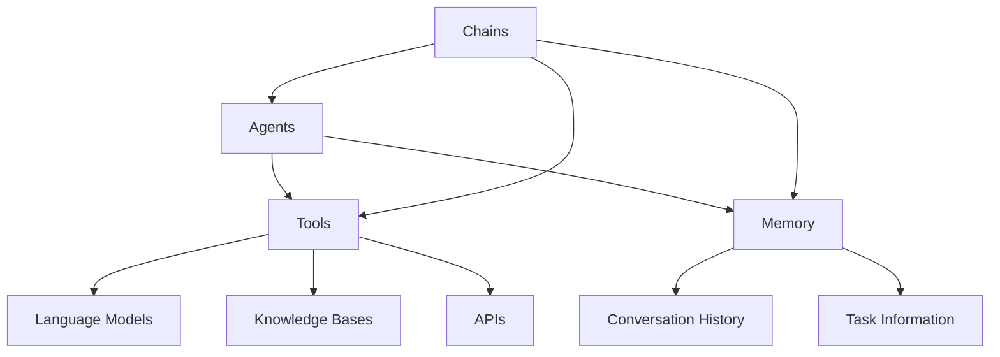

# 【LangChain编程：从入门到实践】LangChain初体验

## 1.背景介绍

### 1.1 人工智能的崛起

随着人工智能(AI)技术的不断发展,它正在渗透到我们生活和工作的方方面面。从语音助手到自动驾驶汽车,从医疗诊断到金融分析,AI已经成为推动科技创新和提高生产效率的关键力量。在这个过程中,自然语言处理(NLP)扮演着至关重要的角色。

### 1.2 自然语言处理的重要性

自然语言处理旨在使计算机能够理解和生成人类语言。它涉及多个复杂的任务,如文本分类、命名实体识别、关系抽取、文本摘要、机器翻译等。通过NLP,我们可以更自然地与机器交互,提高人机协作的效率。

### 1.3 LangChain的崛起

尽管NLP领域取得了长足的进步,但将这些技术应用到实际场景中仍然存在挑战。LangChain应运而生,旨在简化NLP应用程序的开发过程。它提供了一个统一的接口,将多种NLP模型和工具集成在一起,使开发人员能够更轻松地构建复杂的NLP应用程序。

## 2.核心概念与联系

### 2.1 LangChain概述

LangChain是一个用于构建应用程序的框架,这些应用程序可以通过自然语言与数据、其他应用程序和人类进行交互。它提供了一组模块化的构建块,可以组合在一起以创建复杂的工作流程。

### 2.2 核心概念

LangChain的核心概念包括:

#### 2.2.1 Agents

Agents是LangChain中最重要的概念之一。它们是自主实体,可以执行各种任务,如问答、分析、总结等。Agents可以通过各种工具(如模型、数据源等)来完成任务。

#### 2.2.2 Tools

Tools是Agents可以利用的各种资源,如语言模型、知识库、API等。Agents可以根据需要选择和组合不同的工具来完成任务。

#### 2.2.3 Memory

Memory是Agents用于存储和检索信息的组件。它允许Agents记住过去的对话和操作,从而更好地理解上下文并做出明智的决策。

#### 2.2.4 Chains

Chains是一系列预定义的步骤,用于完成特定的任务。它们可以组合Agents、Tools和Memory,形成复杂的工作流程。

### 2.3 LangChain架构

LangChain的架构如下所示:



在这个架构中,Agents可以访问各种Tools(如语言模型、知识库和API)和Memory(如对话历史记录和任务信息)。Chains则将Agents、Tools和Memory组合在一起,形成复杂的工作流程。

## 3.核心算法原理具体操作步骤

LangChain的核心算法原理基于代理-工具-内存的交互模式。下面是它的具体操作步骤:

### 3.1 初始化Agent

首先,我们需要初始化一个Agent。Agent可以是预定义的,也可以是自定义的。LangChain提供了多种预定义的Agent,如`ZeroShotAgent`、`ConversationAgent`等。

```python
from langchain.agents import initialize_agent, Tool
from langchain.llms import OpenAI

# 初始化语言模型
llm = OpenAI(temperature=0)

# 定义工具
tools = [
    Tool(
        name="Wikipedia",
        func=lambda q: f"Wikipedia result for query: {q}",
        description="A wrapper around Wikipedia to answer queries"
    )
]

# 初始化Agent
agent = initialize_agent(tools, llm, agent="zero-shot-react-description", verbose=True)
```

在这个例子中,我们初始化了一个`ZeroShotAgent`,它可以根据工具的描述自动决定使用哪个工具。我们还定义了一个简单的Wikipedia工具,用于查询Wikipedia。

### 3.2 提供输入

接下来,我们需要向Agent提供输入,即我们想要它完成的任务。

```python
query = "What is the capital of France?"
```

### 3.3 Agent与工具交互

Agent会根据输入的查询,决定使用哪个工具。在本例中,它会使用我们定义的Wikipedia工具。

```python
result = agent.run(query)
print(result)
```

Agent会与工具交互,获取所需的信息。在这个例子中,它会从Wikipedia获取关于法国首都的信息。

### 3.4 输出结果

最后,Agent会将获取到的信息整理成最终的结果,并输出。

```
Wikipedia result for query: What is the capital of France?

The capital of France is Paris.
```

## 4.数学模型和公式详细讲解举例说明

虽然LangChain主要是一个应用框架,但它也涉及一些数学模型和公式。例如,在使用语言模型时,常见的模型包括GPT、BERT等。这些模型通常基于transformer架构,使用自注意力机制来捕获输入序列中的长程依赖关系。

以GPT(Generative Pre-trained Transformer)模型为例,它的核心公式是transformer的自注意力机制,可以表示为:

$$\mathrm{Attention}(Q, K, V) = \mathrm{softmax}\left(\frac{QK^T}{\sqrt{d_k}}\right)V$$

其中:

- $Q$ 是查询矩阵(Query Matrix)
- $K$ 是键矩阵(Key Matrix)
- $V$ 是值矩阵(Value Matrix)
- $d_k$ 是缩放因子,用于防止内积过大导致梯度消失

自注意力机制允许模型在生成每个单词时,关注输入序列中的所有其他单词,从而捕获长程依赖关系。

此外,在进行文本生成时,GPT模型通常采用以下公式来计算下一个单词的概率:

$$P(w_t | w_1, w_2, \dots, w_{t-1}) = \mathrm{softmax}(h_t^T W_e)$$

其中:

- $w_t$ 是时间步 $t$ 的单词
- $w_1, w_2, \dots, w_{t-1}$ 是之前的单词序列
- $h_t$ 是时间步 $t$ 的隐藏状态向量
- $W_e$ 是嵌入矩阵

通过这种方式,GPT模型可以基于之前的单词序列,生成下一个最可能的单词。

虽然LangChain本身不直接涉及这些数学模型和公式,但它提供了与各种语言模型(包括GPT和BERT)集成的接口,使开发人员可以更轻松地利用这些模型的强大功能。

## 5.项目实践:代码实例和详细解释说明

为了更好地理解LangChain的使用,让我们通过一个实际项目来演示它的强大功能。在这个项目中,我们将构建一个简单的问答系统,它可以从维基百科中查找答案。

### 5.1 安装依赖项

首先,我们需要安装LangChain及其依赖项:

```bash
pip install langchain openai wikipedia
```

### 5.2 导入必要模块

接下来,我们需要导入必要的模块:

```python
from langchain.agents import initialize_agent, Tool
from langchain.llms import OpenAI
import wikipedia
```

### 5.3 定义工具

我们将定义一个Wikipedia工具,用于从维基百科中查找信息:

```python
def wikipedia_search(query):
    try:
        result = wikipedia.summary(query, auto_suggest=False)
        return result
    except wikipedia.exceptions.PageError:
        return "No Wikipedia page found for the query."
    except wikipedia.exceptions.DisambiguationError as e:
        return f"Disambiguation error: {e.options}"

tools = [
    Tool(
        name="Wikipedia Search",
        func=wikipedia_search,
        description="A tool to search for information on Wikipedia"
    )
]
```

在这个例子中,我们定义了一个名为`wikipedia_search`的函数,它使用`wikipedia`模块从维基百科中查找相关信息。如果找不到相关页面或发生歧义错误,它会返回相应的错误消息。

### 5.4 初始化Agent

接下来,我们需要初始化一个Agent,并将工具传递给它:

```python
llm = OpenAI(temperature=0)
agent = initialize_agent(tools, llm, agent="zero-shot-react-description", verbose=True)
```

在这个例子中,我们使用`OpenAI`语言模型,并初始化一个`ZeroShotAgent`。`ZeroShotAgent`可以根据工具的描述自动决定使用哪个工具。

### 5.5 运行Agent

现在,我们可以向Agent提出查询,并让它从维基百科中查找答案:

```python
query = "What is the capital of France?"
result = agent.run(query)
print(result)
```

Agent会根据查询决定使用哪个工具,在本例中它会使用我们定义的Wikipedia Search工具。然后,它会从维基百科中查找相关信息,并将结果输出。

```
> Entering new AgentExecutor chain...
Thought: I should use the Wikipedia Search tool to find the capital of France.
Action: Wikipedia Search
Query: capital of France
<wikipedia.Wikipedia at 0x7f9c5c0b3d90>
Result: Paris is the capital and most populous city of France. It has an area of 105 square kilometres (41 square miles) and a population of 2,161,000 residents in 2020. Since the 17th century, Paris has been one of Europe's major centres of finance, diplomacy, commerce, fashion, science and arts. The City of Paris is the centre and seat of government of the Île-de-France, or Paris Region, which has an estimated official 2020 population of 12,278,210, or about 18 percent of the population of France. The Paris Region had a GDP of €709 billion ($808 billion) in 2017. According to the Economist Intelligence Unit Worldwide Cost of Living Survey in 2018, Paris was the second most expensive city in the world, after Singapore, and ahead of Zürich, Hong Kong, Oslo and Geneva.
Thought: The Wikipedia Search result provides the answer that the capital of France is Paris.
Final Answer: The capital of France is Paris.

> Finished chain.
The capital of France is Paris.
```

正如我们所看到的,Agent成功地从维基百科中找到了法国首都是巴黎的信息,并将其作为最终答案输出。

这个简单的示例展示了如何使用LangChain构建一个基本的问答系统。通过定义不同的工具和Agent,我们可以构建更复杂的应用程序,如文本摘要、关系抽取等。

## 6.实际应用场景

LangChain的应用场景非常广泛,它可以用于各种自然语言处理任务。以下是一些常见的应用场景:

### 6.1 问答系统

问答系统是LangChain最常见的应用场景之一。它可以从各种数据源(如知识库、文档、网页等)中查找答案,并以自然语言的形式提供响应。这种系统可以应用于客户服务、教育、医疗等领域。

### 6.2 文本摘要

LangChain可以用于自动生成文本摘要。它可以分析长篇文本,提取关键信息,并生成简洁的摘要。这种功能对于处理大量文本数据非常有用,如新闻报道、研究论文、法律文件等。

### 6.3 关系抽取

关系抽取是指从文本中识别实体之间的关系,如人名和职位、公司和产品等。LangChain可以与关系抽取模型集成,从而自动发现文本中的重要关系。这在构建知识图谱、情报分析等领域非常有用。

### 6.4 内容生成

LangChain还可以用于生成各种形式的内容,如新闻文章、营销文案、故事情节等。它可以与大型语言模型(如GPT-3)集成,根据提供的提示和上下文生成高质量的内容。

### 6.5 个人助理

通过将多种功能集成到一个系统中,LangChain可以构建智能的个人助理。这种助理可以回答各种问题、执行任务、提供建议等,为用户提供全方位的支持。

### 6.6 其他应用场景

除了上述场景外,LangChain还可以应用于机器翻译、情感分析、语音识别等多个领域。它的模块化设计使得开发人员可以灵活地组合不同的组件,满足各种需求。

## 7.工具和资源推荐

在使用LangChain进行开发时,以下工具和资源可能会非常有用:

### 7.1 LangChain官方文档

LangChain的官方文档(https://python.langchain.com/en/latest/index.html)提供了详细的API参考、教程和示例代码。它是学习和使用LangChain的绝佳资源。

### 7.