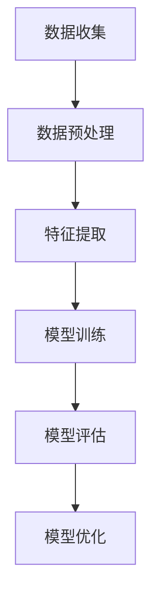

# 一切皆是映射：AI的伦理问题与未来挑战

## 1.背景介绍

人工智能（AI）技术在过去几十年中取得了飞速的发展，从简单的规则系统到复杂的深度学习模型，AI已经渗透到我们生活的方方面面。然而，随着AI技术的广泛应用，随之而来的伦理问题和未来挑战也日益凸显。本文将深入探讨AI的核心概念、算法原理、数学模型、实际应用场景以及未来的发展趋势和挑战。

## 2.核心概念与联系

### 2.1 人工智能的定义

人工智能是指通过计算机系统模拟人类智能的技术。它包括机器学习、自然语言处理、计算机视觉等多个子领域。AI的核心在于数据的处理和映射，通过算法将输入数据映射到输出结果。

### 2.2 映射的概念

映射是数学中的一个基本概念，指的是将一个集合中的元素关联到另一个集合中的元素。在AI中，映射通常指的是将输入数据（如图像、文本）通过算法转换为输出结果（如分类标签、预测值）。

### 2.3 AI与映射的关系

AI的本质是通过算法实现数据的映射。无论是图像识别、语音识别还是自然语言处理，都是通过训练模型来找到输入数据与输出结果之间的映射关系。

## 3.核心算法原理具体操作步骤

### 3.1 机器学习算法

机器学习是AI的核心技术之一，常见的机器学习算法包括线性回归、决策树、支持向量机等。以下是一个简单的机器学习算法操作步骤：

1. 数据收集：收集训练数据集。
2. 数据预处理：对数据进行清洗、归一化等预处理操作。
3. 特征提取：从数据中提取有用的特征。
4. 模型训练：使用训练数据集训练模型。
5. 模型评估：使用测试数据集评估模型性能。
6. 模型优化：根据评估结果优化模型。

### 3.2 深度学习算法

深度学习是机器学习的一个子领域，主要使用神经网络进行数据映射。以下是一个简单的深度学习算法操作步骤：

1. 数据收集：收集训练数据集。
2. 数据预处理：对数据进行清洗、归一化等预处理操作。
3. 构建神经网络：设计神经网络的结构，包括输入层、隐藏层和输出层。
4. 模型训练：使用训练数据集训练神经网络。
5. 模型评估：使用测试数据集评估神经网络性能。
6. 模型优化：根据评估结果优化神经网络。

### 3.3 算法流程图



## 4.数学模型和公式详细讲解举例说明

### 4.1 线性回归

线性回归是一种简单的机器学习算法，用于预测连续值。其数学模型如下：

$$
y = \beta_0 + \beta_1 x + \epsilon
$$

其中，$y$ 是预测值，$x$ 是输入特征，$\beta_0$ 和 $\beta_1$ 是模型参数，$\epsilon$ 是误差项。

### 4.2 神经网络

神经网络是深度学习的基础，其基本单元是神经元。一个简单的神经元模型如下：

$$
y = f(\sum_{i=1}^{n} w_i x_i + b)
$$

其中，$y$ 是输出，$x_i$ 是输入特征，$w_i$ 是权重，$b$ 是偏置，$f$ 是激活函数。

### 4.3 反向传播算法

反向传播算法用于训练神经网络，通过最小化损失函数来更新权重。其数学公式如下：

$$
\Delta w = -\eta \frac{\partial L}{\partial w}
$$

其中，$\Delta w$ 是权重的更新量，$\eta$ 是学习率，$L$ 是损失函数。

## 5.项目实践：代码实例和详细解释说明

### 5.1 线性回归代码实例

以下是一个使用Python实现线性回归的代码实例：

```python
import numpy as np
from sklearn.linear_model import LinearRegression

# 数据集
X = np.array([[1], [2], [3], [4], [5]])
y = np.array([1, 3, 3, 2, 5])

# 创建线性回归模型
model = LinearRegression()

# 训练模型
model.fit(X, y)

# 预测
predictions = model.predict(X)

print("预测值:", predictions)
```

### 5.2 神经网络代码实例

以下是一个使用TensorFlow实现简单神经网络的代码实例：

```python
import tensorflow as tf
from tensorflow.keras.models import Sequential
from tensorflow.keras.layers import Dense

# 数据集
X = np.array([[1], [2], [3], [4], [5]])
y = np.array([1, 3, 3, 2, 5])

# 创建神经网络模型
model = Sequential()
model.add(Dense(10, input_dim=1, activation='relu'))
model.add(Dense(1))

# 编译模型
model.compile(optimizer='adam', loss='mean_squared_error')

# 训练模型
model.fit(X, y, epochs=100)

# 预测
predictions = model.predict(X)

print("预测值:", predictions)
```

## 6.实际应用场景

### 6.1 医疗诊断

AI在医疗诊断中有广泛的应用，如图像识别技术可以用于癌症的早期检测，机器学习算法可以用于预测疾病的发生。

### 6.2 自动驾驶

自动驾驶汽车依赖于AI技术来处理传感器数据，进行环境感知和决策。深度学习算法在自动驾驶中的应用尤为重要。

### 6.3 自然语言处理

自然语言处理技术可以用于语音识别、机器翻译、情感分析等应用场景。AI通过处理和理解自然语言，实现人机交互。

## 7.工具和资源推荐

### 7.1 编程语言

- Python：广泛用于AI和机器学习的编程语言。
- R：适用于统计分析和数据挖掘。

### 7.2 开发框架

- TensorFlow：谷歌开发的开源深度学习框架。
- PyTorch：Facebook开发的开源深度学习框架。

### 7.3 数据集

- MNIST：手写数字识别数据集。
- ImageNet：大规模图像识别数据集。

## 8.总结：未来发展趋势与挑战

### 8.1 未来发展趋势

AI技术将继续快速发展，未来可能会在以下几个方面取得突破：

- 更加智能的自动驾驶技术。
- 更加精准的医疗诊断。
- 更加自然的人机交互。

### 8.2 未来挑战

随着AI技术的发展，伦理问题和社会挑战也日益凸显：

- 隐私问题：AI技术需要大量数据，如何保护用户隐私是一个重要问题。
- 偏见问题：AI算法可能会存在偏见，如何消除算法偏见是一个重要挑战。
- 就业问题：AI技术可能会取代部分工作岗位，如何应对就业问题是一个社会挑战。

## 9.附录：常见问题与解答

### 9.1 什么是人工智能？

人工智能是指通过计算机系统模拟人类智能的技术，包括机器学习、自然语言处理、计算机视觉等多个子领域。

### 9.2 什么是机器学习？

机器学习是AI的核心技术之一，通过算法从数据中学习规律，并进行预测和决策。

### 9.3 什么是深度学习？

深度学习是机器学习的一个子领域，主要使用神经网络进行数据映射，适用于处理复杂的非线性问题。

### 9.4 AI的伦理问题有哪些？

AI的伦理问题包括隐私问题、算法偏见问题、就业问题等。

### 9.5 如何保护AI中的用户隐私？

可以通过数据加密、匿名化处理等技术手段保护用户隐私。

### 9.6 如何消除AI算法中的偏见？

可以通过多样化的数据集、算法优化等手段消除AI算法中的偏见。

### 9.7 AI技术会取代哪些工作岗位？

AI技术可能会取代一些重复性高、规则明确的工作岗位，如制造业中的流水线工人、客服等。

### 9.8 如何应对AI带来的就业问题？

可以通过提升劳动者的技能、发展新兴产业等手段应对AI带来的就业问题。

---

作者：禅与计算机程序设计艺术 / Zen and the Art of Computer Programming