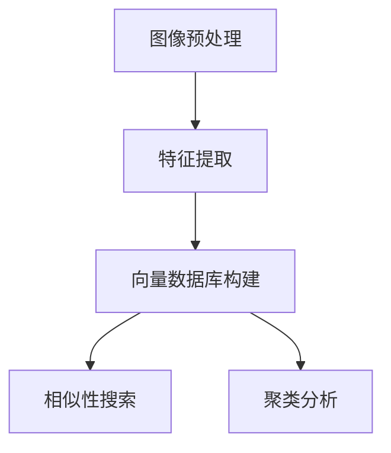

# 利用向量数据库进行高效的遥感图像处理

## 1.背景介绍

遥感技术在地球科学、环境监测、农业、城市规划等领域具有广泛的应用。随着遥感技术的发展，遥感图像的分辨率和数据量也在不断增加。传统的图像处理方法在处理大规模遥感数据时，面临着计算复杂度高、存储需求大、处理速度慢等问题。向量数据库作为一种新兴的数据存储和处理技术，能够高效地处理大规模、高维度的数据，为遥感图像处理提供了一种新的解决方案。

## 2.核心概念与联系

### 2.1 遥感图像处理

遥感图像处理是指对从遥感设备（如卫星、无人机等）获取的图像数据进行处理和分析，以提取有用信息的过程。主要包括图像预处理、特征提取、分类、目标检测等步骤。

### 2.2 向量数据库

向量数据库是一种专门用于存储和查询高维向量数据的数据库。与传统的关系型数据库不同，向量数据库能够高效地处理大规模、高维度的数据，支持快速的相似性搜索和聚类分析。

### 2.3 遥感图像处理与向量数据库的联系

遥感图像处理中的特征提取步骤通常会将图像数据转换为高维向量表示。利用向量数据库，可以高效地存储和查询这些高维向量，从而加速遥感图像的处理过程。

## 3.核心算法原理具体操作步骤

### 3.1 图像预处理

图像预处理是遥感图像处理的第一步，主要包括去噪、辐射校正、几何校正等步骤。通过预处理，可以提高图像的质量，为后续的特征提取和分析打下基础。

### 3.2 特征提取

特征提取是将图像数据转换为高维向量表示的过程。常用的特征提取方法包括SIFT、SURF、HOG等。特征提取的结果是一个高维向量，表示图像的特征信息。

### 3.3 向量数据库的构建

将提取的高维向量存储到向量数据库中。向量数据库支持高效的相似性搜索和聚类分析，可以加速遥感图像的处理过程。

### 3.4 相似性搜索

相似性搜索是指在向量数据库中查找与给定向量相似的向量。常用的相似性度量方法包括欧氏距离、余弦相似度等。相似性搜索可以用于图像检索、目标检测等任务。

### 3.5 聚类分析

聚类分析是将相似的向量分组的过程。常用的聚类算法包括K-means、DBSCAN等。聚类分析可以用于图像分类、变化检测等任务。



## 4.数学模型和公式详细讲解举例说明

### 4.1 特征提取的数学模型

以SIFT（Scale-Invariant Feature Transform）为例，SIFT特征提取的主要步骤包括：

1. 关键点检测：在不同尺度空间检测图像的关键点。
2. 关键点描述：计算每个关键点的方向和梯度直方图，生成特征向量。

关键点检测的数学模型可以表示为：

$$
D(x, y, \sigma) = (G(x, y, k\sigma) - G(x, y, \sigma)) * I(x, y)
$$

其中，$D(x, y, \sigma)$ 表示尺度空间的差分，$G(x, y, \sigma)$ 表示高斯模糊函数，$I(x, y)$ 表示图像。

### 4.2 相似性搜索的数学模型

以欧氏距离为例，给定两个向量 $a$ 和 $b$，它们之间的欧氏距离可以表示为：

$$
d(a, b) = \sqrt{\sum_{i=1}^{n} (a_i - b_i)^2}
$$

其中，$a_i$ 和 $b_i$ 分别表示向量 $a$ 和 $b$ 的第 $i$ 个分量。

### 4.3 聚类分析的数学模型

以K-means聚类为例，K-means聚类的目标是将数据点分成 $k$ 个簇，使得每个簇内的数据点到簇中心的距离之和最小。其数学模型可以表示为：

$$
J = \sum_{i=1}^{k} \sum_{x \in C_i} \|x - \mu_i\|^2
$$

其中，$J$ 表示目标函数，$C_i$ 表示第 $i$ 个簇，$\mu_i$ 表示第 $i$ 个簇的中心。

## 5.项目实践：代码实例和详细解释说明

### 5.1 图像预处理

```python
import cv2

# 读取图像
image = cv2.imread('image.jpg')

# 去噪
denoised_image = cv2.fastNlMeansDenoisingColored(image, None, 10, 10, 7, 21)

# 辐射校正
corrected_image = cv2.equalizeHist(cv2.cvtColor(denoised_image, cv2.COLOR_BGR2GRAY))

# 几何校正
rows, cols = corrected_image.shape
M = cv2.getRotationMatrix2D((cols/2, rows/2), 45, 1)
geometrically_corrected_image = cv2.warpAffine(corrected_image, M, (cols, rows))
```

### 5.2 特征提取

```python
import cv2

# 读取图像
image = cv2.imread('image.jpg', cv2.IMREAD_GRAYSCALE)

# SIFT特征提取
sift = cv2.SIFT_create()
keypoints, descriptors = sift.detectAndCompute(image, None)
```

### 5.3 向量数据库的构建

```python
from milvus import Milvus, DataType

# 连接向量数据库
milvus = Milvus(host='localhost', port='19530')

# 创建集合
collection_name = 'remote_sensing_images'
param = {
    'collection_name': collection_name,
    'fields': [
        {'name': 'embedding', 'type': DataType.FLOAT_VECTOR, 'params': {'dim': 128}},
        {'name': 'id', 'type': DataType.INT64}
    ]
}
milvus.create_collection(param)

# 插入数据
entities = [
    {'name': 'embedding', 'values': descriptors.tolist(), 'type': DataType.FLOAT_VECTOR},
    {'name': 'id', 'values': list(range(len(descriptors))), 'type': DataType.INT64}
]
milvus.insert(collection_name, entities)
```

### 5.4 相似性搜索

```python
# 查询相似向量
query_embedding = descriptors[0].tolist()
search_param = {
    'collection_name': collection_name,
    'query_records': [query_embedding],
    'top_k': 5,
    'params': {'nprobe': 10}
}
results = milvus.search(search_param)
```

### 5.5 聚类分析

```python
from sklearn.cluster import KMeans

# K-means聚类
kmeans = KMeans(n_clusters=5, random_state=0).fit(descriptors)
labels = kmeans.labels_
```

## 6.实际应用场景

### 6.1 农业监测

利用遥感图像可以监测农作物的生长情况、病虫害情况等。通过向量数据库，可以高效地存储和查询农作物的特征向量，实现快速的病虫害检测和生长情况分析。

### 6.2 城市规划

遥感图像在城市规划中具有重要作用，可以用于监测城市扩展、土地利用变化等。利用向量数据库，可以快速检索和分析城市区域的遥感图像，提供决策支持。

### 6.3 环境监测

遥感图像可以用于监测环境变化，如森林火灾、洪水等。通过向量数据库，可以高效地存储和查询环境变化的特征向量，实现快速的灾害监测和预警。

## 7.工具和资源推荐

### 7.1 向量数据库

- Milvus：一款开源的向量数据库，支持高效的相似性搜索和聚类分析。
- Faiss：Facebook AI Research开发的向量相似性搜索库，支持大规模、高维度数据的处理。

### 7.2 遥感图像处理工具

- GDAL：地理空间数据抽象库，支持多种遥感图像格式的读写和处理。
- OpenCV：开源计算机视觉库，提供丰富的图像处理和特征提取功能。

### 7.3 机器学习和深度学习框架

- TensorFlow：谷歌开发的开源机器学习框架，支持大规模机器学习模型的训练和部署。
- PyTorch：Facebook开发的开源深度学习框架，支持动态计算图和灵活的模型定义。

## 8.总结：未来发展趋势与挑战

### 8.1 未来发展趋势

随着遥感技术和向量数据库技术的不断发展，遥感图像处理将变得更加高效和智能。未来，遥感图像处理将更多地依赖于深度学习和人工智能技术，实现自动化和智能化的图像分析。同时，向量数据库将进一步优化存储和查询性能，支持更大规模和更高维度的数据处理。

### 8.2 挑战

尽管向量数据库在遥感图像处理中具有广泛的应用前景，但仍面临一些挑战。首先，高维向量数据的存储和查询仍然是一个难题，需要进一步优化算法和数据结构。其次，遥感图像数据的多样性和复杂性增加了处理的难度，需要开发更加智能和鲁棒的算法。最后，数据隐私和安全问题也是一个重要的挑战，需要在数据处理和存储过程中保护用户隐私和数据安全。

## 9.附录：常见问题与解答

### 9.1 向量数据库与传统数据库的区别是什么？

向量数据库专门用于存储和查询高维向量数据，支持高效的相似性搜索和聚类分析。传统数据库主要用于存储和查询结构化数据，不适合处理高维向量数据。

### 9.2 如何选择合适的特征提取方法？

选择特征提取方法时，需要考虑图像的类型和应用场景。对于纹理丰富的图像，可以选择SIFT或SURF等方法；对于形状特征明显的图像，可以选择HOG等方法。

### 9.3 向量数据库的性能如何优化？

可以通过优化索引结构、调整查询参数、使用并行计算等方法来优化向量数据库的性能。例如，Milvus支持多种索引结构（如IVF、HNSW等），可以根据数据特点选择合适的索引结构。

### 9.4 遥感图像处理中的数据预处理有哪些常见方法？

常见的数据预处理方法包括去噪、辐射校正、几何校正等。去噪可以使用中值滤波、均值滤波等方法；辐射校正可以使用直方图均衡化等方法；几何校正可以使用仿射变换等方法。

### 9.5 如何评估遥感图像处理的效果？

可以通过定量和定性两种方法评估遥感图像处理的效果。定量方法包括计算分类准确率、检测精度等指标；定性方法包括人工目视检查处理结果等。

---

作者：禅与计算机程序设计艺术 / Zen and the Art of Computer Programming