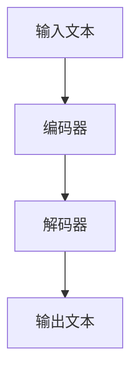

# 大语言模型原理基础与前沿 基于风格转换的方法

## 1.背景介绍

大语言模型（Large Language Models, LLMs）是近年来人工智能领域的一个重要突破。它们通过大量的文本数据进行训练，能够生成高质量的自然语言文本，完成翻译、对话、文本生成等任务。大语言模型的成功不仅依赖于深度学习技术的进步，还得益于大规模数据集和计算资源的支持。

在这篇文章中，我们将深入探讨大语言模型的原理基础与前沿技术，特别是基于风格转换的方法。我们将从核心概念、算法原理、数学模型、项目实践、实际应用场景、工具和资源推荐等多个方面进行详细讲解。

## 2.核心概念与联系

### 2.1 大语言模型的定义

大语言模型是一种通过大量文本数据进行训练的深度学习模型，能够理解和生成自然语言。它们通常基于Transformer架构，具有数十亿甚至上千亿的参数。

### 2.2 风格转换的定义

风格转换是指在保持文本语义不变的情况下，改变文本的表达风格。例如，将正式的文本转换为口语化的文本，或将现代英语转换为古英语。

### 2.3 大语言模型与风格转换的联系

大语言模型可以通过学习不同风格的文本数据，掌握风格转换的能力。这种能力不仅可以用于文本生成，还可以用于文本翻译、对话系统等多个领域。

## 3.核心算法原理具体操作步骤

### 3.1 数据预处理

数据预处理是大语言模型训练的第一步。包括文本清洗、分词、去除停用词等步骤。

### 3.2 模型架构设计

大语言模型通常基于Transformer架构。Transformer由编码器和解码器组成，能够高效地处理长文本。



### 3.3 模型训练

模型训练是指通过大量的文本数据，调整模型参数，使其能够生成高质量的文本。常用的优化算法包括Adam、SGD等。

### 3.4 风格转换训练

在风格转换训练中，我们需要准备不同风格的文本对，并通过监督学习的方法，让模型学习如何在不同风格之间进行转换。

## 4.数学模型和公式详细讲解举例说明

### 4.1 Transformer模型

Transformer模型的核心是自注意力机制（Self-Attention Mechanism）。自注意力机制通过计算输入序列中每个位置的注意力权重，捕捉序列中的长距离依赖关系。

$$
Attention(Q, K, V) = softmax\left(\frac{QK^T}{\sqrt{d_k}}\right)V
$$

其中，$Q$、$K$、$V$分别表示查询向量、键向量和值向量，$d_k$表示键向量的维度。

### 4.2 损失函数

在风格转换任务中，常用的损失函数是交叉熵损失函数（Cross-Entropy Loss），用于衡量生成文本与目标文本之间的差异。

$$
L = -\sum_{i=1}^{N} y_i \log(\hat{y}_i)
$$

其中，$y_i$表示目标文本的第$i$个词，$\hat{y}_i$表示生成文本的第$i$个词的概率。

## 5.项目实践：代码实例和详细解释说明

### 5.1 数据准备

首先，我们需要准备风格转换的数据集。假设我们有一个正式文本和口语化文本的对照数据集。

```python
formal_texts = ["您好，今天的天气很好。", "请问您需要什么帮助？"]
informal_texts = ["嗨，今天天气不错。", "你需要啥帮助？"]
```

### 5.2 模型定义

接下来，我们定义一个基于Transformer的风格转换模型。

```python
import torch
import torch.nn as nn
from transformers import BertTokenizer, BertModel

class StyleTransferModel(nn.Module):
    def __init__(self):
        super(StyleTransferModel, self).__init__()
        self.tokenizer = BertTokenizer.from_pretrained('bert-base-uncased')
        self.encoder = BertModel.from_pretrained('bert-base-uncased')
        self.decoder = nn.Transformer(d_model=768, nhead=8, num_encoder_layers=6, num_decoder_layers=6)

    def forward(self, input_text):
        input_ids = self.tokenizer(input_text, return_tensors='pt')['input_ids']
        encoder_output = self.encoder(input_ids)['last_hidden_state']
        decoder_output = self.decoder(encoder_output, encoder_output)
        return decoder_output
```

### 5.3 模型训练

然后，我们定义训练函数，并使用交叉熵损失函数进行训练。

```python
def train(model, formal_texts, informal_texts, epochs=10):
    optimizer = torch.optim.Adam(model.parameters(), lr=1e-4)
    criterion = nn.CrossEntropyLoss()

    for epoch in range(epochs):
        for formal_text, informal_text in zip(formal_texts, informal_texts):
            optimizer.zero_grad()
            output = model(formal_text)
            target = model.tokenizer(informal_text, return_tensors='pt')['input_ids']
            loss = criterion(output.view(-1, output.size(-1)), target.view(-1))
            loss.backward()
            optimizer.step()
            print(f'Epoch {epoch+1}, Loss: {loss.item()}')

model = StyleTransferModel()
train(model, formal_texts, informal_texts)
```

## 6.实际应用场景

### 6.1 文本生成

大语言模型可以用于生成高质量的自然语言文本。例如，自动写作、新闻生成等。

### 6.2 机器翻译

通过学习不同语言的文本对，大语言模型可以实现高质量的机器翻译。

### 6.3 对话系统

大语言模型可以用于构建智能对话系统，提供更加自然和流畅的对话体验。

### 6.4 文本风格转换

大语言模型可以用于将文本从一种风格转换为另一种风格，例如将正式文本转换为口语化文本。

## 7.工具和资源推荐

### 7.1 工具

- **Transformers库**：由Hugging Face提供的开源库，支持多种预训练语言模型。
- **TensorFlow**：谷歌开发的开源深度学习框架，支持大规模模型训练。
- **PyTorch**：Facebook开发的开源深度学习框架，易于使用和扩展。

### 7.2 资源

- **OpenAI GPT-3**：目前最先进的大语言模型之一，提供API接口。
- **BERT**：谷歌开发的预训练语言模型，广泛应用于自然语言处理任务。
- **大型文本数据集**：如Wikipedia、Common Crawl等，用于训练大语言模型。

## 8.总结：未来发展趋势与挑战

大语言模型在自然语言处理领域展现了巨大的潜力，但也面临一些挑战。未来的发展趋势包括：

### 8.1 模型规模和性能的提升

随着计算资源的增加和算法的改进，大语言模型的规模和性能将继续提升。

### 8.2 多模态学习

未来的大语言模型将不仅限于文本数据，还将结合图像、音频等多模态数据，提升模型的理解和生成能力。

### 8.3 可解释性和公平性

大语言模型的可解释性和公平性问题将成为研究的重点，确保模型的决策过程透明、公平。

## 9.附录：常见问题与解答

### 9.1 大语言模型需要多少数据进行训练？

大语言模型通常需要数十亿甚至上千亿的文本数据进行训练，以保证模型的性能。

### 9.2 如何选择合适的模型架构？

选择模型架构时，需要考虑任务的具体需求、计算资源和数据规模。Transformer架构是目前最常用的大语言模型架构。

### 9.3 如何评估大语言模型的性能？

大语言模型的性能评估通常使用BLEU、ROUGE等指标，衡量生成文本与目标文本的相似度。

### 9.4 大语言模型的训练时间有多长？

大语言模型的训练时间取决于模型的规模和计算资源。通常需要数周甚至数月的时间进行训练。

### 9.5 如何解决大语言模型的过拟合问题？

可以通过增加数据量、使用正则化技术、早停等方法，防止大语言模型的过拟合。

---

作者：禅与计算机程序设计艺术 / Zen and the Art of Computer Programming