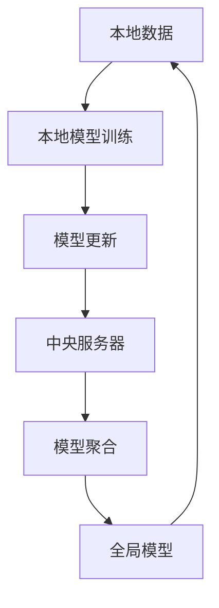

# 差分隐私与联邦学习安全原理与代码实战案例讲解

## 1.背景介绍

在大数据和人工智能的时代，数据隐私和安全性成为了至关重要的问题。传统的数据处理方法往往需要集中化的数据存储和处理，这带来了数据泄露和隐私侵犯的风险。为了应对这些挑战，差分隐私和联邦学习作为两种新兴的技术，提供了有效的解决方案。

差分隐私是一种保护数据隐私的技术，通过在数据分析过程中引入噪声，确保个体数据的隐私不被泄露。联邦学习则是一种分布式机器学习方法，允许多个参与方在不共享原始数据的情况下，共同训练模型。这两种技术的结合，可以在保护数据隐私的同时，实现高效的数据分析和模型训练。

## 2.核心概念与联系

### 2.1 差分隐私

差分隐私（Differential Privacy）是一种数学框架，用于量化数据隐私。其核心思想是通过在数据查询结果中引入随机噪声，使得任何单个数据点的存在或不存在对查询结果的影响微乎其微。差分隐私的定义如下：

$$
\text{Pr}[M(D) \in S] \leq e^\epsilon \cdot \text{Pr}[M(D') \in S]
$$

其中，$M$ 是一个随机化算法，$D$ 和 $D'$ 是两个相邻的数据集（即 $D$ 和 $D'$ 只有一个数据点不同），$S$ 是一个可能的输出集合，$\epsilon$ 是隐私预算，表示隐私保护的强度。

### 2.2 联邦学习

联邦学习（Federated Learning）是一种分布式机器学习方法，允许多个参与方在不共享原始数据的情况下，共同训练模型。联邦学习的核心思想是将模型训练过程分布到各个参与方，每个参与方在本地数据上训练模型，并将模型更新发送到中央服务器进行聚合。联邦学习的典型流程如下：



### 2.3 差分隐私与联邦学习的联系

差分隐私和联邦学习可以结合使用，以实现更高的隐私保护。在联邦学习中，可以在本地模型更新时引入差分隐私噪声，从而保护参与方的数据隐私。这种结合方法被称为差分隐私联邦学习（Differentially Private Federated Learning）。

## 3.核心算法原理具体操作步骤

### 3.1 差分隐私算法

差分隐私的实现通常依赖于两种主要的噪声机制：拉普拉斯机制（Laplace Mechanism）和高斯机制（Gaussian Mechanism）。

#### 3.1.1 拉普拉斯机制

拉普拉斯机制通过在查询结果中添加拉普拉斯噪声来实现差分隐私。拉普拉斯噪声的生成公式如下：

$$
\text{Lap}(b) = \frac{1}{2b} \exp\left(-\frac{|x|}{b}\right)
$$

其中，$b = \frac{\Delta f}{\epsilon}$，$\Delta f$ 是查询的灵敏度，$\epsilon$ 是隐私预算。

#### 3.1.2 高斯机制

高斯机制通过在查询结果中添加高斯噪声来实现差分隐私。高斯噪声的生成公式如下：

$$
\text{Gaussian}(\sigma) = \frac{1}{\sqrt{2\pi}\sigma} \exp\left(-\frac{x^2}{2\sigma^2}\right)
$$

其中，$\sigma = \frac{\Delta f \sqrt{2 \ln(1.25/\delta)}}{\epsilon}$，$\Delta f$ 是查询的灵敏度，$\epsilon$ 是隐私预算，$\delta$ 是隐私参数。

### 3.2 联邦学习算法

联邦学习的实现通常包括以下几个步骤：

#### 3.2.1 初始化全局模型

中央服务器初始化一个全局模型，并将其分发给所有参与方。

#### 3.2.2 本地模型训练

每个参与方在本地数据上训练全局模型，并计算模型更新。

#### 3.2.3 模型更新上传

每个参与方将本地模型更新上传到中央服务器。

#### 3.2.4 模型聚合

中央服务器对所有参与方的模型更新进行聚合，生成新的全局模型。

#### 3.2.5 模型分发

中央服务器将新的全局模型分发给所有参与方，进入下一轮训练。

### 3.3 差分隐私联邦学习算法

差分隐私联邦学习结合了差分隐私和联邦学习的优点，其实现步骤如下：

#### 3.3.1 初始化全局模型

中央服务器初始化一个全局模型，并将其分发给所有参与方。

#### 3.3.2 本地模型训练

每个参与方在本地数据上训练全局模型，并计算模型更新。

#### 3.3.3 差分隐私噪声添加

每个参与方在本地模型更新中添加差分隐私噪声。

#### 3.3.4 模型更新上传

每个参与方将添加噪声后的本地模型更新上传到中央服务器。

#### 3.3.5 模型聚合

中央服务器对所有参与方的模型更新进行聚合，生成新的全局模型。

#### 3.3.6 模型分发

中央服务器将新的全局模型分发给所有参与方，进入下一轮训练。

## 4.数学模型和公式详细讲解举例说明

### 4.1 差分隐私数学模型

差分隐私的数学模型基于概率论和统计学，其核心公式如下：

$$
\text{Pr}[M(D) \in S] \leq e^\epsilon \cdot \text{Pr}[M(D') \in S]
$$

其中，$M$ 是一个随机化算法，$D$ 和 $D'$ 是两个相邻的数据集，$S$ 是一个可能的输出集合，$\epsilon$ 是隐私预算。

#### 4.1.1 拉普拉斯机制示例

假设我们有一个查询函数 $f$，其灵敏度 $\Delta f = 1$，隐私预算 $\epsilon = 0.1$。我们可以使用拉普拉斯机制生成噪声：

$$
b = \frac{\Delta f}{\epsilon} = \frac{1}{0.1} = 10
$$

生成的拉普拉斯噪声为：

$$
\text{Lap}(10) = \frac{1}{20} \exp\left(-\frac{|x|}{10}\right)
$$

#### 4.1.2 高斯机制示例

假设我们有一个查询函数 $f$，其灵敏度 $\Delta f = 1$，隐私预算 $\epsilon = 0.1$，隐私参数 $\delta = 0.01$。我们可以使用高斯机制生成噪声：

$$
\sigma = \frac{\Delta f \sqrt{2 \ln(1.25/0.01)}}{0.1} = \frac{1 \sqrt{2 \ln(125)}}{0.1} \approx 14.14
$$

生成的高斯噪声为：

$$
\text{Gaussian}(14.14) = \frac{1}{\sqrt{2\pi} \cdot 14.14} \exp\left(-\frac{x^2}{2 \cdot 14.14^2}\right)
$$

### 4.2 联邦学习数学模型

联邦学习的数学模型基于分布式优化，其核心公式如下：

$$
\theta_{t+1} = \theta_t - \eta \nabla F(\theta_t)
$$

其中，$\theta_t$ 是全局模型参数，$\eta$ 是学习率，$\nabla F(\theta_t)$ 是全局损失函数的梯度。

#### 4.2.1 本地模型更新

每个参与方在本地数据上计算模型更新：

$$
\Delta \theta_i = \theta_i - \eta \nabla F_i(\theta_i)
$$

其中，$\theta_i$ 是本地模型参数，$\nabla F_i(\theta_i)$ 是本地损失函数的梯度。

#### 4.2.2 模型聚合

中央服务器对所有参与方的模型更新进行聚合：

$$
\theta_{t+1} = \theta_t + \frac{1}{N} \sum_{i=1}^N \Delta \theta_i
$$

其中，$N$ 是参与方的数量。

### 4.3 差分隐私联邦学习数学模型

差分隐私联邦学习结合了差分隐私和联邦学习的数学模型，其核心公式如下：

#### 4.3.1 本地模型更新

每个参与方在本地数据上计算模型更新：

$$
\Delta \theta_i = \theta_i - \eta \nabla F_i(\theta_i)
$$

#### 4.3.2 差分隐私噪声添加

每个参与方在本地模型更新中添加差分隐私噪声：

$$
\Delta \theta_i' = \Delta \theta_i + \text{Noise}
$$

其中，$\text{Noise}$ 是根据差分隐私机制生成的噪声。

#### 4.3.3 模型聚合

中央服务器对所有参与方的模型更新进行聚合：

$$
\theta_{t+1} = \theta_t + \frac{1}{N} \sum_{i=1}^N \Delta \theta_i'
$$

## 5.项目实践：代码实例和详细解释说明

### 5.1 差分隐私实现

以下是一个使用拉普拉斯机制实现差分隐私的示例代码：

```python
import numpy as np

def laplace_mechanism(value, sensitivity, epsilon):
    b = sensitivity / epsilon
    noise = np.random.laplace(0, b)
    return value + noise

# 示例
true_value = 100
sensitivity = 1
epsilon = 0.1
private_value = laplace_mechanism(true_value, sensitivity, epsilon)
print(f"Private value: {private_value}")
```

### 5.2 联邦学习实现

以下是一个简单的联邦学习实现示例代码：

```python
import numpy as np

# 初始化全局模型
global_model = np.zeros(10)

# 模拟本地数据
local_data = [np.random.randn(100, 10) for _ in range(5)]

# 本地模型训练
def local_training(data, model, epochs=1, lr=0.01):
    for epoch in range(epochs):
        gradient = np.mean(data, axis=0)
        model -= lr * gradient
    return model

# 模型聚合
def aggregate_models(models):
    return np.mean(models, axis=0)

# 联邦学习过程
for round in range(10):
    local_models = [local_training(data, global_model.copy()) for data in local_data]
    global_model = aggregate_models(local_models)
    print(f"Round {round + 1}, Global Model: {global_model}")
```

### 5.3 差分隐私联邦学习实现

以下是一个结合差分隐私和联邦学习的实现示例代码：

```python
import numpy as np

# 初始化全局模型
global_model = np.zeros(10)

# 模拟本地数据
local_data = [np.random.randn(100, 10) for _ in range(5)]

# 本地模型训练
def local_training(data, model, epochs=1, lr=0.01):
    for epoch in range(epochs):
        gradient = np.mean(data, axis=0)
        model -= lr * gradient
    return model

# 差分隐私噪声添加
def add_noise(model_update, sensitivity, epsilon):
    b = sensitivity / epsilon
    noise = np.random.laplace(0, b, model_update.shape)
    return model_update + noise

# 模型聚合
def aggregate_models(models):
    return np.mean(models, axis=0)

# 联邦学习过程
for round in range(10):
    local_models = [local_training(data, global_model.copy()) for data in local_data]
    noisy_models = [add_noise(model, sensitivity=1, epsilon=0.1) for model in local_models]
    global_model = aggregate_models(noisy_models)
    print(f"Round {round + 1}, Global Model: {global_model}")
```

## 6.实际应用场景

### 6.1 医疗数据分析

在医疗数据分析中，患者的隐私保护至关重要。差分隐私和联邦学习可以用于保护患者数据隐私，同时实现高效的数据分析。例如，多个医院可以使用联邦学习共同训练疾病预测模型，而不需要共享患者的原始数据。

### 6.2 金融数据分析

在金融数据分析中，客户的隐私保护同样重要。差分隐私和联邦学习可以用于保护客户数据隐私，同时实现高效的风险评估和欺诈检测。例如，多个银行可以使用联邦学习共同训练风险评估模型，而不需要共享客户的原始数据。

### 6.3 智能设备数据分析

在智能设备数据分析中，用户的隐私保护也是一个重要问题。差分隐私和联邦学习可以用于保护用户数据隐私，同时实现高效的设备性能优化和用户行为分析。例如，多个智能设备可以使用联邦学习共同训练用户行为预测模型，而不需要共享用户的原始数据。

## 7.工具和资源推荐

### 7.1 差分隐私工具

- **Google Differential Privacy Library**: Google 提供的差分隐私库，支持多种差分隐私算法。
- **PySyft**: OpenMined 提供的差分隐私和联邦学习库，支持多种差分隐私机制。

### 7.2 联邦学习工具

- **TensorFlow Federated**: Google 提供的联邦学习框架，支持多种联邦学习算法。
- **PySyft**: OpenMined 提供的联邦学习库，支持多种联邦学习机制。

### 7.3 资源推荐

- **《The Algorithmic Foundations of Differential Privacy》**: 差分隐私的经典教材，详细介绍了差分隐私的数学基础和算法实现。
- **《Federated Learning: Collaborative Machine Learning without Centralized Training Data》**: 联邦学习的经典教材，详细介绍了联邦学习的基本原理和应用场景。

## 8.总结：未来发展趋势与挑战

差分隐私和联邦学习作为保护数据隐私的两种重要技术，已经在多个领域得到了广泛应用。然而，这两种技术在实际应用中仍然面临一些挑战。

### 8.1 差分隐私的挑战

- **隐私预算的选择**: 隐私预算 $\epsilon$ 的选择直接影响隐私保护的强度和数据分析的准确性。如何在隐私保护和数据分析之间找到平衡，是一个重要的研究问题。
- **噪声机制的优化**: 不同的噪声机制对数据分析的影响不同。如何选择和优化噪声机制，以实现更好的隐私保护和数据分析效果，是一个重要的研究方向。

### 8.2 联邦学习的挑战

- **通信开销**: 联邦学习需要频繁地在参与方和中央服务器之间传输模型更新，通信开销较大。如何减少通信开销，提高联邦学习的效率，是一个重要的研究问题。
- **模型聚合的安全性**: 联邦学习的模型聚合过程可能受到恶意参与方的攻击。如何提高模型聚合的安全性，防止恶意攻击，是一个重要的研究方向。

### 8.3 差分隐私联邦学习的未来发展

差分隐私和联邦学习的结合，可以在保护数据隐私的同时，实现高效的数据分析和模型训练。未来，差分隐私联邦学习有望在更多领域得到应用，并进一步推动数据隐私保护技术的发展。

## 9.附录：常见问题与解答

### 9.1 什么是差分隐私？

差分隐私是一种保护数据隐私的技术，通过在数据分析过程中引入噪声，确保个体数据的隐私不被泄露。

### 9.2 什么是联邦学习？

联邦学习是一种分布式机器学习方法，允许多个参与方在不共享原始数据的情况下，共同训练模型。

### 9.3 差分隐私和联邦学习有什么联系？

差分隐私和联邦学习可以结合使用，以实现更高的隐私保护。在联邦学习中，可以在本地模型更新时引入差分隐私噪声，从而保护参与方的数据隐私。

### 9.4 如何选择差分隐私的隐私预算？

隐私预算 $\epsilon$ 的选择需要在隐私保护和数据分析之间找到平衡。较小的 $\epsilon$ 提供更强的隐私保护，但可能影响数据分析的准确性。

### 9.5 联邦学习的通信开销如何优化？

联邦学习的通信开销可以通过减少模型更新的频率、压缩模型更新数据等方法进行优化。

### 9.6 差分隐私联邦学习的应用场景有哪些？

差分隐私联邦学习可以应用于医疗数据分析、金融数据分析、智能设备数据分析等多个领域。

---

作者：禅与计算机程序设计艺术 / Zen and the Art of Computer Programming