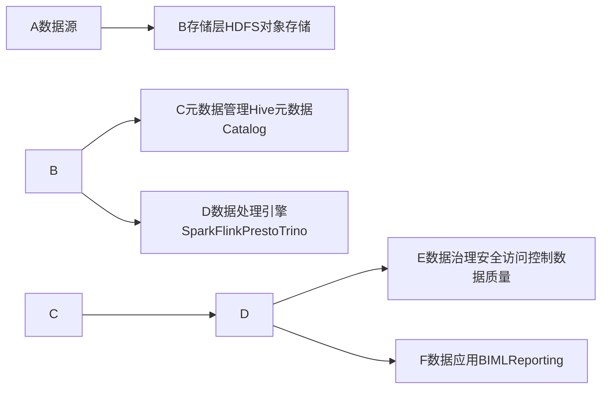

# 数据湖 原理与代码实例讲解

## 1. 背景介绍
### 1.1 数据湖的起源与发展
### 1.2 数据湖解决的核心问题
### 1.3 数据湖与数据仓库的区别

## 2. 核心概念与联系  
### 2.1 数据湖的定义
数据湖（Data Lake）是一种企业级的大规模数据存储和处理架构。它能够存储和处理各种格式的原始数据，包括结构化、半结构化和非结构化数据。数据湖的目标是打破数据孤岛，实现数据的集中管理和共享，从而支持数据分析、机器学习等高级应用。

### 2.2 数据湖的核心特征
- 存储原始数据：数据湖存储原始格式的数据，保留了数据的原貌。
- 支持多种数据类型：数据湖可以存储结构化、半结构化和非结构化数据。
- 数据量大：数据湖通常存储PB级别的海量数据。  
- 高度扩展性：数据湖具有很强的横向扩展能力，可以轻松扩展存储和计算能力。
- Schema-on-read：数据湖采用"读时模式"，在使用数据时才定义Schema。

### 2.3 数据湖的核心组件
- 存储层：负责存储原始数据，通常使用HDFS、对象存储等。
- 元数据管理：负责管理数据的元数据信息，如数据的来源、格式、Schema等。
- 数据处理引擎：提供多种数据处理模型，如批处理、交互式查询、流处理等。
- 数据治理：对数据进行管理和控制，确保数据的安全性、可靠性和合规性。

### 2.4 数据湖架构示意图


## 3. 核心算法原理具体操作步骤
### 3.1 数据接入
1. 识别和采集各种来源的原始数据
2. 将原始数据导入到数据湖的存储层
3. 提取数据的元数据信息并注册到元数据管理系统

### 3.2 数据存储  
1. 将原始数据以源格式存储在HDFS或对象存储上
2. 根据数据的特征组织目录结构
3. 设置合理的数据分区和压缩策略

### 3.3 元数据管理
1. 提取数据的Schema、数据字典等元数据 
2. 将元数据信息注册到统一的元数据管理系统
3. 为数据创建统一的视图，方便数据检索和使用

### 3.4 数据处理
1. 根据应用需求选择合适的数据处理引擎
2. 使用SQL、DataFrame等API进行数据转换和计算
3. 将处理后的数据存储回数据湖或导出到外部系统

### 3.5 数据治理
1. 定义数据的访问权限和安全策略
2. 对数据进行质量检测和监控
3. 建立数据的血缘关系，方便数据溯源

## 4. 数学模型和公式详细讲解举例说明
数据湖涉及的数学模型主要体现在数据处理和分析阶段，常见的模型包括：

### 4.1 协同过滤推荐
协同过滤是一种常用的推荐算法，其核心思想是利用用户或物品之间的相似性进行推荐。以基于用户的协同过滤为例，其数学模型可以表示为：

$$
r_{ui} = \frac{\sum_{v \in N(u)} s_{uv} r_{vi}}{\sum_{v \in N(u)} s_{uv}}
$$

其中，$r_{ui}$ 表示预测用户 $u$ 对物品 $i$ 的评分，$N(u)$ 表示与用户 $u$ 最相似的 $k$ 个用户，$s_{uv}$ 表示用户 $u$ 和用户 $v$ 的相似度，$r_{vi}$ 表示用户 $v$ 对物品 $i$ 的实际评分。

### 4.2 TF-IDF文本挖掘
TF-IDF是一种常用的文本挖掘算法，用于评估词语在文档中的重要性。其数学模型可以表示为：

$$
tfidf_{ij} = tf_{ij} \times idf_i
$$

其中，$tfidf_{ij}$ 表示词语 $i$ 在文档 $j$ 中的TF-IDF值，$tf_{ij}$ 表示词语 $i$ 在文档 $j$ 中的词频，$idf_i$ 表示词语 $i$ 的逆文档频率，计算公式为：

$$
idf_i = \log \frac{N}{n_i}
$$

其中，$N$ 表示语料库中文档的总数，$n_i$ 表示包含词语 $i$ 的文档数。

### 4.3 K-Means聚类
K-Means是一种常用的聚类算法，将数据划分为 $k$ 个簇。其数学模型可以表示为：

$$
J = \sum_{j=1}^k \sum_{i=1}^n ||x_i^{(j)} - c_j||^2
$$

其中，$J$ 表示所有样本到其所属簇中心的距离平方和，$k$ 表示簇的数量，$n$ 表示样本数量，$x_i^{(j)}$ 表示第 $j$ 个簇中的第 $i$ 个样本，$c_j$ 表示第 $j$ 个簇的中心点。K-Means的目标是最小化 $J$ 值。

## 5. 项目实践：代码实例和详细解释说明
下面以使用Spark对数据湖中的数据进行处理为例，给出详细的代码实例和解释说明。

### 5.1 读取数据
```scala
// 从HDFS读取JSON格式的原始数据
val rawData = spark.read.json("hdfs://path/to/raw/data")

// 从Hive表读取结构化数据  
val structuredData = spark.table("hive_db.table_name")
```

上面的代码演示了如何从HDFS和Hive表中读取数据。Spark提供了统一的DataFrame API，可以方便地读取各种格式和来源的数据。

### 5.2 数据转换
```scala
// 对JSON数据进行Schema推断和数据清洗
val cleanedData = rawData
  .withColumn("ts", unix_timestamp($"timestamp", "yyyy-MM-dd'T'HH:mm:ss.SSSXXX"))  
  .filter($"id".isNotNull)
  .select($"id", $"name", $"age", $"ts")
  
// 与结构化数据进行Join
val joinedData = cleanedData.join(structuredData, Seq("id"), "left")  
```

上面的代码演示了如何对JSON数据进行Schema推断、数据清洗和转换。通过WithColumn可以添加新的列，通过Filter可以过滤掉不符合条件的数据，通过Select可以选择需要的列。最后，还可以与结构化数据进行Join操作。

### 5.3 数据分析
```scala
// 按照id进行分组，计算每个id的数据条数和年龄总和
val aggregatedData = joinedData
  .groupBy($"id") 
  .agg(
    count($"id").as("count"),
    sum($"age").as("total_age")
  )
  
// 使用SQL进行分析
joinedData.createOrReplaceTempView("joined_data")
val result = spark.sql("""
  SELECT 
    id,
    name,
    age,
    CASE 
      WHEN age < 20 THEN 'Youth'
      WHEN age BETWEEN 20 AND 50 THEN 'Middle-aged'
      ELSE 'Elderly'
    END AS age_group
  FROM joined_data
""")
```

上面的代码演示了如何使用DataFrame API和SQL对数据进行分组、聚合和分析。通过GroupBy和Agg可以进行分组聚合操作，通过SQL可以进行更加灵活的分析和数据转换。

### 5.4 数据存储
```scala
// 将结果数据写回HDFS
result.write.format("parquet").mode("overwrite").save("hdfs://path/to/result/data")

// 将结果数据写入Hive表
result.write.mode("overwrite").saveAsTable("hive_db.result_table")
```

上面的代码演示了如何将处理后的结果数据写回HDFS或Hive表。Spark支持多种数据格式和存储系统，可以根据需要选择合适的方式。

## 6. 实际应用场景
数据湖在实际中有非常广泛的应用，下面列举几个典型的应用场景：

### 6.1 用户行为分析
企业可以将用户的各种行为日志数据，如点击、浏览、购买等，接入到数据湖中进行统一存储和分析。通过对用户行为数据的挖掘，可以洞察用户的偏好和需求，进而优化产品设计和提供个性化服务。

### 6.2 风险控制
金融机构可以将各种结构化和非结构化的风控数据接入数据湖，如用户的信贷记录、行为数据、舆情数据等。通过机器学习算法对这些异构数据进行综合建模，可以有效识别和防范各类金融风险。

### 6.3 设备监控
工业企业可以将设备的传感器采集数据接入数据湖，对设备的运行状态进行实时监控和分析。通过机器学习算法可以提前预警设备故障，进而实现预测性维护，降低运维成本。

### 6.4 医疗研究
医疗机构可以将医疗影像、基因测序、电子病历等多源异构医疗数据汇聚到数据湖中。通过大数据分析和机器学习，可以挖掘疾病的发病机理、辅助诊断和预测疾病风险，推动精准医疗的发展。

## 7. 工具和资源推荐
### 7.1 开源数据湖平台
- Apache Hadoop：提供HDFS分布式存储和MapReduce计算框架。
- Apache Spark：提供批处理、交互式查询、流处理、图计算等多种数据处理模型。
- Apache Hudi：提供数据湖表管理和事务写入能力。
- Delta Lake：基于Spark的开源数据湖方案，提供ACID事务、Schema演进等特性。
- Apache Iceberg：一种开放的表格式规范，支持元数据管理、ACID事务等。

### 7.2 数据湖管理工具
- Apache Atlas：提供元数据管理和数据血缘追踪能力。
- Apache Ranger：提供细粒度的数据访问控制和安全管理。
- Amundsen：由Lyft开源的数据发现和元数据管理平台。
- Marquez：提供数据血缘追踪和数据流向可视化。

### 7.3 学习资源
- 《Spark: The Definitive Guide》：Spark权威指南，系统讲解Spark各组件的原理和使用。
- 《Learning Spark, 2nd Edition》：Spark学习指南，使用最新的Spark 3.0讲解Spark编程。
- 《Data Lake for Enterprises》：介绍企业级数据湖的建设和最佳实践。
- Coursera课程《Big Data Analysis with Scala and Spark》：使用Scala和Spark进行大数据分析。

## 8. 总结：未来发展趋势与挑战
数据湖经过十多年的发展，已经成为大数据时代不可或缺的数据架构。未来数据湖将呈现以下发展趋势：

### 8.1 智能数据湖
传统的数据湖缺乏数据管理和质量保障，容易成为"数据沼泽"。未来的智能数据湖将引入AI技术，通过机器学习实现自动化的数据管理、数据发现和数据治理，提高数据湖的使用效率和价值挖掘能力。

### 8.2 数据湖与数据仓库融合
数据仓库擅长处理结构化数据，而数据湖擅长处理非结构化数据。未来两者将加速融合，形成统一的数据架构。数据湖将作为数据仓库的数据源，为数据仓库提供多源异构的数据支撑。

### 8.3 云原生数据湖
随着云计算的普及，数据湖将从本地部署走向云端。各大云厂商纷纷推出云原生的数据湖方案，如AWS的S3、Azure的Data Lake Storage等。云上的数据湖将具备更强的弹性、扩展性和经济性。

数据湖也面临着一些挑战：

- 数据治理：如何对数据湖中的海量异构数据进行有