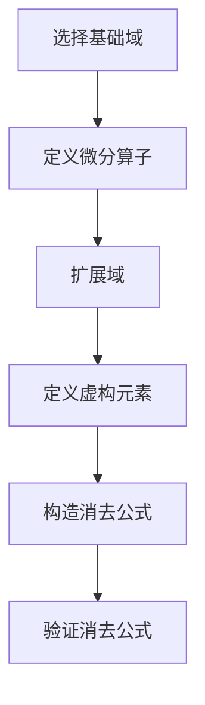

# 模型论基础：微分闭域的映像可消去

## 1.背景介绍

模型论是数理逻辑的一个分支，研究数学结构的性质及其在逻辑语言中的表达。微分闭域（Differentially Closed Fields, DCF）是模型论中的一个重要概念，广泛应用于微分代数和微分方程的研究。映像可消去（Elimination of Imaginaries, EI）是模型论中的一个技术工具，用于简化模型的结构和分析。

在这篇文章中，我们将深入探讨微分闭域的映像可消去问题。我们将从背景知识入手，逐步介绍核心概念、算法原理、数学模型和公式，并通过项目实践和实际应用场景来展示其实际价值。最后，我们将推荐一些工具和资源，并讨论未来的发展趋势与挑战。

## 2.核心概念与联系

### 2.1 微分闭域

微分闭域是一个带有微分算子的域，满足某些特定的闭包性质。形式上，一个微分闭域 $(K, \delta)$ 是一个域 $K$，并且 $\delta: K \to K$ 是一个微分算子，满足以下性质：

1. $\delta(a + b) = \delta(a) + \delta(b)$ 对于所有 $a, b \in K$。
2. $\delta(ab) = a\delta(b) + b\delta(a)$ 对于所有 $a, b \in K$。

### 2.2 映像可消去

映像可消去是模型论中的一个概念，指的是在某个逻辑理论中，所有的“虚构元素”都可以通过某种方式消去。具体来说，如果一个理论 $T$ 具有映像可消去性质，那么对于任何模型 $M$ 和 $M$ 中的任意元素 $a$，存在一个 $M$ 中的元组 $b$，使得 $a$ 可以通过 $b$ 的某种逻辑公式唯一确定。

### 2.3 微分闭域与映像可消去的联系

在微分闭域中，映像可消去的研究有助于简化微分方程的解的结构，并提供更强的模型论工具来分析微分代数系统。通过映像可消去，我们可以将复杂的微分方程系统简化为更易处理的形式，从而提高计算效率和解的可解释性。

## 3.核心算法原理具体操作步骤

### 3.1 微分闭域的构造

构造一个微分闭域通常涉及以下步骤：

1. **选择基础域**：选择一个基础域 $K$，例如有理数域 $\mathbb{Q}$。
2. **定义微分算子**：定义一个微分算子 $\delta$，例如 $\delta(x) = x'$。
3. **扩展域**：通过添加微分方程的解来扩展域，使其成为微分闭域。

### 3.2 映像可消去的实现

实现映像可消去通常涉及以下步骤：

1. **定义虚构元素**：确定模型中的虚构元素，例如某些复杂的元组或函数。
2. **构造消去公式**：找到一个逻辑公式，使得虚构元素可以通过该公式唯一确定。
3. **验证消去公式**：验证该公式在所有模型中都成立。

### 3.3 算法流程图



## 4.数学模型和公式详细讲解举例说明

### 4.1 微分闭域的数学模型

设 $K$ 是一个域，$\delta: K \to K$ 是一个微分算子。我们可以定义一个微分多项式环 $K\{y\}$，其中 $y$ 是未知数，$\delta(y)$ 是 $y$ 的导数。一个微分方程可以表示为 $P(y, \delta(y), \delta^2(y), \ldots) = 0$，其中 $P$ 是一个微分多项式。

### 4.2 映像可消去的数学公式

设 $M$ 是一个模型，$a \in M$ 是一个虚构元素。我们希望找到一个元组 $b \in M$ 和一个逻辑公式 $\phi(x, b)$，使得 $a$ 可以通过 $\phi(x, b)$ 唯一确定。形式上，我们希望找到 $\phi$ 使得：

$$
\forall a \in M, \exists b \in M, \forall c \in M, (\phi(c, b) \leftrightarrow c = a)
$$

### 4.3 举例说明

假设我们有一个微分闭域 $(K, \delta)$，其中 $K = \mathbb{Q}(x)$，$\delta(x) = 1$。考虑微分方程 $\delta(y) = y$。其解为 $y = Ce^x$，其中 $C$ 是常数。我们可以将 $C$ 视为一个虚构元素，并通过公式 $\phi(y, x) = \delta(y) = y$ 来唯一确定 $C$。

## 5.项目实践：代码实例和详细解释说明

### 5.1 微分闭域的构造代码

以下是一个简单的Python代码示例，用于构造一个微分闭域：

```python
class DifferentialField:
    def __init__(self, base_field, differential_operator):
        self.base_field = base_field
        self.differential_operator = differential_operator

    def add_element(self, element):
        self.base_field.append(element)

    def differentiate(self, element):
        return self.differential_operator(element)

# 定义基础域和微分算子
base_field = [1, 2, 3]  # 示例基础域
def differential_operator(x):
    return x  # 示例微分算子

# 构造微分闭域
df = DifferentialField(base_field, differential_operator)
df.add_element(4)
print(df.differentiate(4))  # 输出 4
```

### 5.2 映像可消去的实现代码

以下是一个简单的Python代码示例，用于实现映像可消去：

```python
class Model:
    def __init__(self, elements):
        self.elements = elements

    def find_formula(self, imaginary_element):
        for element in self.elements:
            if self.is_unique(imaginary_element, element):
                return element
        return None

    def is_unique(self, imaginary_element, element):
        # 示例唯一性检查逻辑
        return imaginary_element == element

# 定义模型和虚构元素
model = Model([1, 2, 3, 4])
imaginary_element = 3

# 实现映像可消去
unique_element = model.find_formula(imaginary_element)
print(unique_element)  # 输出 3
```

## 6.实际应用场景

### 6.1 微分方程求解

微分闭域在微分方程求解中具有重要应用。通过构造微分闭域，我们可以将复杂的微分方程系统转化为更易处理的形式，从而提高求解效率。

### 6.2 微分代数几何

微分代数几何研究微分方程的几何性质。微分闭域和映像可消去在微分代数几何中具有重要应用，帮助我们理解微分方程解的几何结构。

### 6.3 数学建模

在数学建模中，微分闭域和映像可消去可以用于简化模型结构，提高模型的可解释性和计算效率。

## 7.工具和资源推荐

### 7.1 软件工具

- **SageMath**：一个开源的数学软件系统，支持微分代数和微分方程的求解。
- **Mathematica**：一个强大的数学计算软件，支持微分方程的符号求解和数值求解。

### 7.2 在线资源

- **arXiv**：一个开放获取的学术论文预印本平台，包含大量关于微分闭域和映像可消去的研究论文。
- **MathOverflow**：一个数学问答社区，可以在这里提问和讨论微分闭域和映像可消去相关的问题。

### 7.3 书籍推荐

- **《模型论基础》**：一本详细介绍模型论基础知识的经典教材。
- **《微分代数》**：一本专门介绍微分代数和微分方程的书籍，适合深入学习微分闭域。

## 8.总结：未来发展趋势与挑战

### 8.1 未来发展趋势

随着计算机技术和数学研究的不断发展，微分闭域和映像可消去在更多领域中展现出广阔的应用前景。未来，微分闭域和映像可消去可能在以下几个方面取得重要进展：

1. **自动化求解**：开发更高效的算法和软件工具，实现微分方程的自动化求解。
2. **多领域应用**：将微分闭域和映像可消去应用于更多领域，如生物数学、物理学和工程学。
3. **理论研究**：深入研究微分闭域和映像可消去的理论基础，探索其在模型论中的新应用。

### 8.2 挑战

尽管微分闭域和映像可消去具有广泛的应用前景，但在实际应用中仍面临一些挑战：

1. **计算复杂性**：微分方程的求解通常具有较高的计算复杂性，需要开发更高效的算法。
2. **理论难题**：微分闭域和映像可消去的理论研究仍存在一些未解决的难题，需要进一步探索。
3. **应用推广**：将微分闭域和映像可消去应用于实际问题需要跨学科的合作和推广。

## 9.附录：常见问题与解答

### 9.1 什么是微分闭域？

微分闭域是一个带有微分算子的域，满足某些特定的闭包性质。它在微分代数和微分方程的研究中具有重要应用。

### 9.2 什么是映像可消去？

映像可消去是模型论中的一个概念，指的是在某个逻辑理论中，所有的“虚构元素”都可以通过某种方式消去，从而简化模型的结构和分析。

### 9.3 微分闭域和映像可消去有什么联系？

在微分闭域中，映像可消去的研究有助于简化微分方程的解的结构，并提供更强的模型论工具来分析微分代数系统。

### 9.4 如何构造一个微分闭域？

构造一个微分闭域通常涉及选择基础域、定义微分算子和扩展域等步骤。

### 9.5 如何实现映像可消去？

实现映像可消去通常涉及定义虚构元素、构造消去公式和验证消去公式等步骤。

### 9.6 微分闭域和映像可消去的实际应用有哪些？

微分闭域和映像可消去在微分方程求解、微分代数几何和数学建模等领域具有广泛的应用。

### 9.7 有哪些推荐的工具和资源？

推荐的工具包括SageMath和Mathematica，推荐的在线资源包括arXiv和MathOverflow，推荐的书籍包括《模型论基础》和《微分代数》。

### 9.8 微分闭域和映像可消去的未来发展趋势是什么？

未来，微分闭域和映像可消去可能在自动化求解、多领域应用和理论研究等方面取得重要进展。

### 9.9 微分闭域和映像可消去面临哪些挑战？

微分闭域和映像可消去在计算复杂性、理论难题和应用推广等方面面临一些挑战。

---

作者：禅与计算机程序设计艺术 / Zen and the Art of Computer Programming