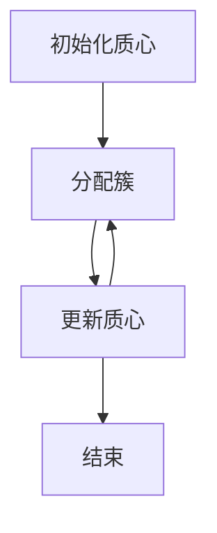
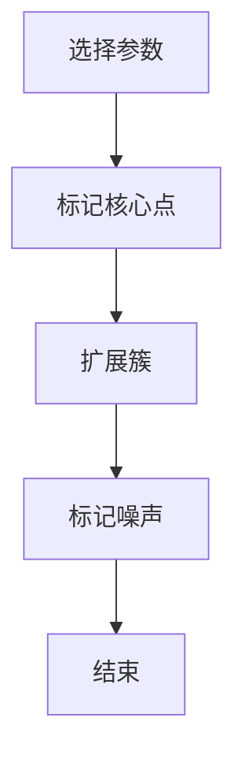

# 聚类算法 原理与代码实例讲解

## 1.背景介绍

聚类算法是机器学习和数据挖掘中的一种重要技术，广泛应用于图像处理、市场分析、生物信息学等领域。聚类的目标是将数据集中的对象分成若干个簇，使得同一簇内的对象相似度较高，而不同簇之间的对象相似度较低。本文将深入探讨聚类算法的核心概念、原理、数学模型，并通过代码实例进行详细讲解。

## 2.核心概念与联系

### 2.1 聚类的定义

聚类是一种无监督学习方法，其目标是将数据集划分为若干个簇，使得同一簇内的数据点具有较高的相似性，而不同簇之间的数据点具有较大的差异性。

### 2.2 聚类与分类的区别

- **聚类**：无监督学习，不需要预先标注的数据，自动发现数据的内在结构。
- **分类**：有监督学习，需要预先标注的数据，训练模型进行预测。

### 2.3 聚类算法的分类

聚类算法可以分为以下几类：

- **划分方法**：如K-means、K-medoids。
- **层次方法**：如凝聚层次聚类、分裂层次聚类。
- **基于密度的方法**：如DBSCAN、OPTICS。
- **基于网格的方法**：如STING、CLIQUE。
- **基于模型的方法**：如高斯混合模型（GMM）。

## 3.核心算法原理具体操作步骤

### 3.1 K-means算法

K-means算法是一种经典的划分方法，操作步骤如下：

1. **初始化**：随机选择K个初始质心。
2. **分配簇**：将每个数据点分配到最近的质心。
3. **更新质心**：计算每个簇的质心。
4. **重复**：重复步骤2和3，直到质心不再变化或达到最大迭代次数。



### 3.2 DBSCAN算法

DBSCAN是一种基于密度的聚类算法，操作步骤如下：

1. **选择参数**：选择半径参数 $\epsilon$ 和最小点数参数 MinPts。
2. **核心点**：标记所有核心点（邻域内点数大于MinPts）。
3. **扩展簇**：从核心点开始，扩展簇，包含所有密度可达的点。
4. **标记噪声**：未被标记的点为噪声点。



## 4.数学模型和公式详细讲解举例说明

### 4.1 K-means算法的数学模型

K-means算法的目标是最小化簇内平方误差和（SSE）：

$$
SSE = \sum_{i=1}^{K} \sum_{x \in C_i} \| x - \mu_i \|^2
$$

其中，$K$ 是簇的数量，$C_i$ 是第 $i$ 个簇，$\mu_i$ 是第 $i$ 个簇的质心，$x$ 是数据点。

### 4.2 DBSCAN算法的数学模型

DBSCAN算法基于密度的概念，定义如下：

- **$\epsilon$-邻域**：点 $p$ 的 $\epsilon$-邻域是指距离 $p$ 小于 $\epsilon$ 的所有点的集合。
- **核心点**：如果点 $p$ 的 $\epsilon$-邻域内的点数大于 MinPts，则 $p$ 是核心点。
- **密度可达**：如果点 $p$ 可以通过一系列核心点到达点 $q$，则 $q$ 是密度可达的。

## 5.项目实践：代码实例和详细解释说明

### 5.1 K-means算法的代码实例

以下是使用Python实现K-means算法的代码示例：

```python
import numpy as np
from sklearn.datasets import make_blobs
import matplotlib.pyplot as plt

# 生成数据
X, y = make_blobs(n_samples=300, centers=4, cluster_std=0.60, random_state=0)

# 初始化质心
def initialize_centroids(X, k):
    return X[np.random.choice(X.shape[0], k, replace=False)]

# 分配簇
def assign_clusters(X, centroids):
    distances = np.sqrt(((X - centroids[:, np.newaxis])**2).sum(axis=2))
    return np.argmin(distances, axis=0)

# 更新质心
def update_centroids(X, labels, k):
    return np.array([X[labels == i].mean(axis=0) for i in range(k)])

# K-means算法
def kmeans(X, k, max_iters=100):
    centroids = initialize_centroids(X, k)
    for _ in range(max_iters):
        labels = assign_clusters(X, centroids)
        new_centroids = update_centroids(X, labels, k)
        if np.all(centroids == new_centroids):
            break
        centroids = new_centroids
    return centroids, labels

# 运行K-means算法
k = 4
centroids, labels = kmeans(X, k)

# 可视化结果
plt.scatter(X[:, 0], X[:, 1], c=labels, s=50, cmap='viridis')
plt.scatter(centroids[:, 0], centroids[:, 1], s=200, c='red', marker='X')
plt.show()
```

### 5.2 DBSCAN算法的代码实例

以下是使用Python实现DBSCAN算法的代码示例：

```python
import numpy as np
from sklearn.datasets import make_blobs
from sklearn.cluster import DBSCAN
import matplotlib.pyplot as plt

# 生成数据
X, y = make_blobs(n_samples=300, centers=4, cluster_std=0.60, random_state=0)

# 运行DBSCAN算法
db = DBSCAN(eps=0.3, min_samples=10).fit(X)
labels = db.labels_

# 可视化结果
plt.scatter(X[:, 0], X[:, 1], c=labels, s=50, cmap='viridis')
plt.show()
```

## 6.实际应用场景

### 6.1 图像分割

聚类算法可以用于图像分割，将图像中的像素点分成若干个簇，从而实现图像的区域分割。例如，K-means算法可以用于将图像分割成不同的颜色区域。

### 6.2 市场分析

在市场分析中，聚类算法可以用于客户细分，将客户分成不同的群体，从而进行有针对性的营销策略。例如，DBSCAN算法可以用于发现客户群体中的异常点。

### 6.3 生物信息学

在生物信息学中，聚类算法可以用于基因表达数据分析，将基因分成不同的簇，从而发现基因的功能关系。例如，层次聚类算法可以用于构建基因的层次结构。

## 7.工具和资源推荐

### 7.1 工具推荐

- **Scikit-learn**：一个强大的Python机器学习库，提供了多种聚类算法的实现。
- **Matplotlib**：一个Python绘图库，可以用于可视化聚类结果。
- **NumPy**：一个Python科学计算库，可以用于高效的数值计算。

### 7.2 资源推荐

- **《Pattern Recognition and Machine Learning》**：Christopher M. Bishop所著，详细介绍了各种聚类算法及其应用。
- **Scikit-learn官方文档**：提供了详细的聚类算法实现和使用示例。
- **Kaggle**：一个数据科学竞赛平台，提供了丰富的数据集和聚类算法的实际应用案例。

## 8.总结：未来发展趋势与挑战

聚类算法在数据分析和机器学习中具有重要地位，未来的发展趋势和挑战包括：

- **大数据处理**：随着数据量的增加，如何高效地处理大规模数据是一个重要挑战。
- **高维数据聚类**：高维数据的聚类面临维度灾难问题，需要开发新的算法和技术。
- **在线聚类**：实时数据的聚类需要在线算法的支持，以应对动态变化的数据。
- **多模态数据聚类**：多模态数据（如图像、文本、音频）的聚类需要融合多种数据类型的信息。

## 9.附录：常见问题与解答

### 9.1 如何选择合适的聚类算法？

选择合适的聚类算法需要考虑数据的特点和应用场景。例如，K-means适用于簇形状为球形的数据，而DBSCAN适用于具有噪声和不规则形状的簇。

### 9.2 如何确定聚类算法的参数？

聚类算法的参数可以通过交叉验证、轮廓系数等方法进行选择。例如，K-means的簇数可以通过肘部法则确定，DBSCAN的 $\epsilon$ 和 MinPts 可以通过网格搜索确定。

### 9.3 聚类结果如何评估？

聚类结果的评估可以通过内部指标（如簇内平方误差、轮廓系数）和外部指标（如Rand指数、互信息）进行评估。

### 9.4 聚类算法的计算复杂度如何？

聚类算法的计算复杂度取决于算法的具体实现和数据的规模。例如，K-means算法的计算复杂度为 $O(nkt)$，其中 $n$ 是数据点数，$k$ 是簇数，$t$ 是迭代次数。

### 9.5 聚类算法如何处理缺失数据？

聚类算法处理缺失数据的方法包括删除缺失数据、插值法、填补法等。例如，可以使用均值填补法将缺失数据填补为均值。

---

作者：禅与计算机程序设计艺术 / Zen and the Art of Computer Programming