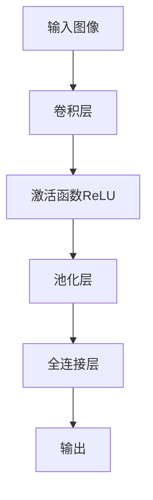
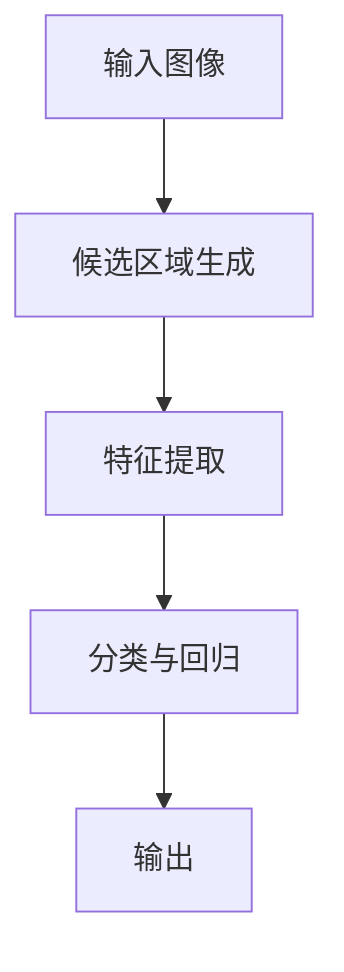
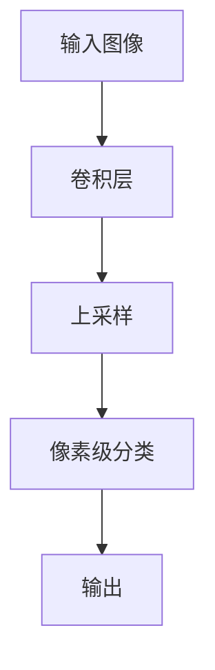

# 计算机视觉CV原理与代码实例讲解

## 1.背景介绍

计算机视觉（Computer Vision，简称CV）是人工智能领域的一个重要分支，旨在让计算机能够像人类一样理解和解释视觉信息。随着深度学习和大数据技术的快速发展，计算机视觉在图像识别、目标检测、图像分割等方面取得了显著的进展，并在自动驾驶、医疗影像分析、安防监控等领域得到了广泛应用。

计算机视觉的核心任务是从图像或视频中提取有用的信息，并进行分析和处理。为了实现这一目标，计算机视觉结合了图像处理、模式识别、机器学习等多种技术手段。本文将深入探讨计算机视觉的核心概念、算法原理、数学模型，并通过代码实例展示其实际应用。

## 2.核心概念与联系

### 2.1 图像处理与计算机视觉

图像处理（Image Processing）是计算机视觉的基础，主要关注图像的预处理和增强，如去噪、滤波、边缘检测等。计算机视觉则进一步在图像处理的基础上，进行高层次的理解和分析，如物体识别、场景理解等。

### 2.2 机器学习与深度学习

机器学习（Machine Learning）是计算机视觉的重要工具，通过学习数据中的模式来进行预测和分类。深度学习（Deep Learning）是机器学习的一个子领域，利用多层神经网络（如卷积神经网络CNN）来处理复杂的视觉任务。

### 2.3 关键任务与技术

计算机视觉的关键任务包括图像分类、目标检测、图像分割、姿态估计等。每个任务都有其特定的算法和技术，如卷积神经网络（CNN）、区域卷积神经网络（R-CNN）、全卷积网络（FCN）等。

## 3.核心算法原理具体操作步骤

### 3.1 卷积神经网络（CNN）

卷积神经网络是计算机视觉中最常用的深度学习模型，主要由卷积层、池化层和全连接层组成。其核心操作步骤如下：

1. **卷积操作**：通过卷积核对输入图像进行局部感知，提取特征。
2. **激活函数**：通常使用ReLU函数，增加模型的非线性。
3. **池化操作**：通过最大池化或平均池化，减少特征图的尺寸，保留重要特征。
4. **全连接层**：将提取的特征进行分类或回归。



### 3.2 区域卷积神经网络（R-CNN）

R-CNN用于目标检测，通过以下步骤实现：

1. **候选区域生成**：使用选择性搜索算法生成候选区域。
2. **特征提取**：对每个候选区域使用CNN提取特征。
3. **分类与回归**：使用SVM进行分类，线性回归进行边界框回归。



### 3.3 全卷积网络（FCN）

FCN用于图像分割，通过以下步骤实现：

1. **卷积操作**：使用卷积层提取特征。
2. **上采样**：通过反卷积层将特征图恢复到原始图像尺寸。
3. **像素级分类**：对每个像素进行分类，生成分割图。



## 4.数学模型和公式详细讲解举例说明

### 4.1 卷积操作

卷积操作是卷积神经网络的核心，其数学表达式为：

$$
Y(i, j) = \sum_{m=0}^{M-1} \sum_{n=0}^{N-1} X(i+m, j+n) \cdot K(m, n)
$$

其中，$Y(i, j)$ 是输出特征图，$X(i, j)$ 是输入图像，$K(m, n)$ 是卷积核，$M$ 和 $N$ 分别是卷积核的高度和宽度。

### 4.2 激活函数ReLU

ReLU（Rectified Linear Unit）激活函数的数学表达式为：

$$
f(x) = \max(0, x)
$$

ReLU函数将输入中的负值置为0，保留正值，增加模型的非线性。

### 4.3 池化操作

最大池化（Max Pooling）操作的数学表达式为：

$$
Y(i, j) = \max_{0 \leq m < M, 0 \leq n < N} X(i+m, j+n)
$$

其中，$Y(i, j)$ 是池化后的输出，$X(i, j)$ 是输入特征图，$M$ 和 $N$ 分别是池化窗口的高度和宽度。

### 4.4 全连接层

全连接层的数学表达式为：

$$
Y = W \cdot X + b
$$

其中，$Y$ 是输出，$W$ 是权重矩阵，$X$ 是输入，$b$ 是偏置向量。

## 5.项目实践：代码实例和详细解释说明

### 5.1 图像分类示例

以下是一个使用TensorFlow和Keras实现图像分类的示例代码：

```python
import tensorflow as tf
from tensorflow.keras import layers, models
from tensorflow.keras.datasets import cifar10

# 加载数据集
(x_train, y_train), (x_test, y_test) = cifar10.load_data()

# 数据预处理
x_train, x_test = x_train / 255.0, x_test / 255.0

# 构建模型
model = models.Sequential([
    layers.Conv2D(32, (3, 3), activation='relu', input_shape=(32, 32, 3)),
    layers.MaxPooling2D((2, 2)),
    layers.Conv2D(64, (3, 3), activation='relu'),
    layers.MaxPooling2D((2, 2)),
    layers.Conv2D(64, (3, 3), activation='relu'),
    layers.Flatten(),
    layers.Dense(64, activation='relu'),
    layers.Dense(10)
])

# 编译模型
model.compile(optimizer='adam',
              loss=tf.keras.losses.SparseCategoricalCrossentropy(from_logits=True),
              metrics=['accuracy'])

# 训练模型
model.fit(x_train, y_train, epochs=10, 
          validation_data=(x_test, y_test))

# 评估模型
test_loss, test_acc = model.evaluate(x_test, y_test, verbose=2)
print(f"Test accuracy: {test_acc}")
```

### 5.2 目标检测示例

以下是一个使用PyTorch实现目标检测的示例代码：

```python
import torch
import torchvision
from torchvision.models.detection import fasterrcnn_resnet50_fpn
from torchvision.transforms import functional as F
from PIL import Image

# 加载预训练模型
model = fasterrcnn_resnet50_fpn(pretrained=True)
model.eval()

# 加载图像
image = Image.open("test.jpg")
image_tensor = F.to_tensor(image).unsqueeze(0)

# 进行预测
with torch.no_grad():
    predictions = model(image_tensor)

# 输出预测结果
for element in predictions[0]['boxes']:
    print(element)
```

## 6.实际应用场景

### 6.1 自动驾驶

计算机视觉在自动驾驶中扮演着至关重要的角色，通过摄像头和传感器获取道路信息，进行车道检测、障碍物识别、交通标志识别等任务，确保车辆的安全行驶。

### 6.2 医疗影像分析

在医疗领域，计算机视觉用于分析医学影像，如X光片、CT扫描、MRI等，辅助医生进行疾病诊断、病灶定位、手术规划等，提高诊断的准确性和效率。

### 6.3 安防监控

计算机视觉在安防监控中广泛应用，通过视频监控系统进行人脸识别、行为分析、异常检测等，提升公共安全和防范能力。

### 6.4 工业检测

在工业生产中，计算机视觉用于产品质量检测、缺陷识别、自动化分拣等，提高生产效率和产品质量。

## 7.工具和资源推荐

### 7.1 开源框架

- **TensorFlow**：谷歌开发的开源深度学习框架，支持多种计算设备，广泛应用于计算机视觉任务。
- **PyTorch**：Facebook开发的开源深度学习框架，具有灵活的动态计算图，适合研究和开发。
- **OpenCV**：开源计算机视觉库，提供丰富的图像处理和计算机视觉算法。

### 7.2 数据集

- **ImageNet**：大规模图像数据集，包含超过1400万张标注图像，广泛用于图像分类和目标检测任务。
- **COCO**：通用物体检测、分割和关键点检测数据集，包含超过20万张图像和80类物体。
- **Pascal VOC**：目标检测和图像分割数据集，包含20类物体，常用于计算机视觉算法评估。

### 7.3 在线资源

- **Coursera**：提供计算机视觉和深度学习相关的在线课程，如斯坦福大学的《Convolutional Neural Networks》课程。
- **arXiv**：预印本论文平台，包含大量最新的计算机视觉研究论文。
- **GitHub**：开源代码托管平台，包含丰富的计算机视觉项目和代码示例。

## 8.总结：未来发展趋势与挑战

计算机视觉作为人工智能的重要分支，未来将继续在多个领域发挥重要作用。以下是一些未来的发展趋势和挑战：

### 8.1 发展趋势

- **多模态融合**：结合视觉、听觉、触觉等多种感知信息，实现更全面的环境理解和智能决策。
- **自监督学习**：减少对大规模标注数据的依赖，通过自监督学习方法提升模型的泛化能力。
- **实时处理**：提高计算效率，实现实时的图像和视频处理，满足自动驾驶、安防监控等应用需求。

### 8.2 挑战

- **数据隐私**：在数据收集和使用过程中，保护用户隐私和数据安全是一个重要挑战。
- **模型解释性**：提高深度学习模型的可解释性，增强用户对模型决策的信任。
- **跨域适应**：提升模型在不同场景和环境下的适应能力，解决跨域迁移问题。

## 9.附录：常见问题与解答

### 9.1 什么是计算机视觉？

计算机视觉是人工智能的一个分支，旨在让计算机能够理解和解释视觉信息，如图像和视频。

### 9.2 计算机视觉的主要任务有哪些？

计算机视觉的主要任务包括图像分类、目标检测、图像分割、姿态估计等。

### 9.3 卷积神经网络的核心操作是什么？

卷积神经网络的核心操作包括卷积操作、激活函数、池化操作和全连接层。

### 9.4 计算机视觉的实际应用有哪些？

计算机视觉的实际应用包括自动驾驶、医疗影像分析、安防监控、工业检测等。

### 9.5 如何选择计算机视觉的开源框架？

选择计算机视觉的开源框架可以根据项目需求和个人偏好，如TensorFlow适合大规模部署，PyTorch适合研究和开发，OpenCV适合图像处理和传统计算机视觉任务。

---

作者：禅与计算机程序设计艺术 / Zen and the Art of Computer Programming