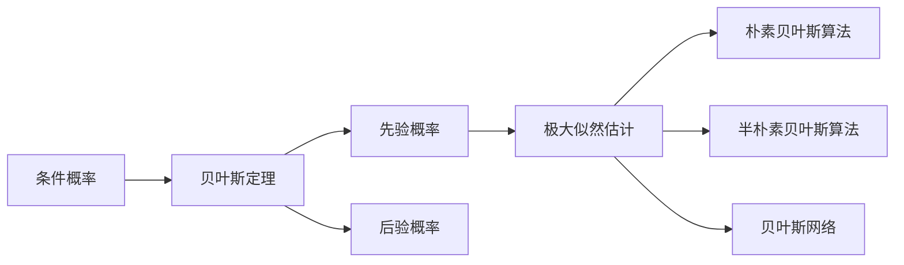

# 贝叶斯算法(Bayesian Algorithms) - 原理与代码实例讲解

## 1.背景介绍
### 1.1 贝叶斯算法的起源与发展
贝叶斯算法是以英国数学家托马斯·贝叶斯的名字命名的一类算法的总称。早在18世纪,贝叶斯就提出了条件概率的概念,并给出了贝叶斯公式。但直到20世纪50年代,贝叶斯算法才真正开始在统计学和计算机科学领域得到广泛应用。

### 1.2 贝叶斯算法的定义
贝叶斯算法是一种基于贝叶斯定理与贝叶斯统计的机器学习算法。其核心思想是,通过先验概率分布和数据的似然性,利用贝叶斯公式计算后验概率分布,并基于后验概率分布做出决策。

### 1.3 贝叶斯算法的应用领域
贝叶斯算法在机器学习、数据挖掘、自然语言处理等领域有着广泛的应用。例如:
- 垃圾邮件过滤:通过学习大量垃圾邮件和正常邮件的特征,构建贝叶斯分类器,对新邮件进行分类。  
- 文本分类:利用不同类别文本的词频分布作为先验概率,对新文本的词频分布进行计算,得到属于各个类别的后验概率,从而实现文本分类。
- 协同过滤推荐:通过用户或物品之间的相似度作为先验概率,利用用户的历史行为数据更新后验概率,实现个性化推荐。

## 2.核心概念与联系
### 2.1 条件概率
条件概率是指在事件B发生的条件下,事件A发生的概率,记作P(A|B)。条件概率是贝叶斯理论的基础。

### 2.2 贝叶斯定理
贝叶斯定理描述了两个条件概率之间的关系:
$$P(A|B) = \frac{P(B|A)P(A)}{P(B)}$$
其中,P(A)是A的先验概率,P(B|A)是给定A时B的条件概率,也称为似然度,P(B)是B的边缘概率,P(A|B)是给定B时A的后验概率。

### 2.3 先验概率与后验概率
先验概率是指根据以往经验和分析得到的概率分布,后验概率是指在得到新的数据信息后,对先验概率进行修正得到的概率分布。贝叶斯算法的目标就是求解后验概率分布。

### 2.4 极大似然估计
极大似然估计是一种基于似然函数的参数估计方法。似然函数衡量了模型参数与观测数据之间的匹配程度,极大似然估计就是找出使似然函数最大的参数值。在贝叶斯算法中,极大似然估计常用于估计先验概率分布的参数。

### 2.5 贝叶斯算法的分类
贝叶斯算法主要分为三类:
- 朴素贝叶斯算法:假设各特征之间相互独立,直接利用贝叶斯公式计算后验概率。
- 半朴素贝叶斯算法:适当考虑部分特征之间的依赖关系,在朴素贝叶斯的基础上进行改进。
- 贝叶斯网络:用有向无环图表示特征之间的依赖关系,结合贝叶斯定理进行推理预测。

以下是这些核心概念之间的联系:



## 3.核心算法原理具体操作步骤
以朴素贝叶斯算法为例,其基本步骤如下:

### 3.1 数据准备
收集训练数据集,对数据进行预处理,提取特征。假设有m个训练样本,n个特征维度。

### 3.2 计算先验概率
对于每个类别$c_k$,统计其在训练集中出现的频率,作为先验概率$P(c_k)$。

### 3.3 计算条件概率
对于每个特征$x_i$,利用极大似然估计,计算其在每个类别$c_k$下的条件概率$P(x_i|c_k)$。
- 对于离散型特征,可直接统计频率得到条件概率。
- 对于连续型特征,常假设其服从正态分布,估计均值和方差。

### 3.4 应用贝叶斯公式
对于待分类样本$x=(x_1,x_2,...,x_n)$,利用贝叶斯公式计算其属于每个类别的后验概率:
$$P(c_k|x) = \frac{P(c_k)\prod_{i=1}^nP(x_i|c_k)}{\sum_jP(c_j)\prod_{i=1}^nP(x_i|c_j)}$$

### 3.5 做出分类决策
选择后验概率最大的类别作为样本的预测类别:
$$y=\arg\max_{c_k}P(c_k|x)$$

## 4.数学模型和公式详细讲解举例说明
### 4.1 二分类问题
考虑一个简单的二分类问题,类别只有$c_1$和$c_2$两种,每个样本有$n$个特征$x=(x_1,x_2,...,x_n)$。

根据贝叶斯公式,样本$x$属于类别$c_1$的后验概率为:
$$P(c_1|x)=\frac{P(c_1)P(x|c_1)}{P(c_1)P(x|c_1)+P(c_2)P(x|c_2)}$$

假设各特征相互独立,则有:
$$P(x|c_1)=\prod_{i=1}^nP(x_i|c_1)$$

同理可得$P(x|c_2)$。

若$P(c_1|x)>P(c_2|x)$,则预测$x$属于类别$c_1$,否则属于$c_2$。

### 4.2 数值示例
假设有如下训练数据:

| 特征1 | 特征2 | 类别 |
|-------|-------|------|
| 1     | 1     | $c_1$ |
| 1     | 0     | $c_1$ |
| 0     | 1     | $c_2$ |
| 0     | 0     | $c_2$ |

先验概率:$P(c_1)=P(c_2)=0.5$

条件概率:
$$P(x_1=1|c_1)=1, P(x_1=0|c_1)=0$$
$$P(x_2=1|c_1)=0.5, P(x_2=0|c_1)=0.5$$
$$P(x_1=1|c_2)=0, P(x_1=0|c_2)=1$$
$$P(x_2=1|c_2)=0.5, P(x_2=0|c_2)=0.5$$

现有一个新样本$x=(1,1)$,求其分类结果。

$P(c_1|x)=\frac{0.5\times1\times0.5}{0.5\times1\times0.5+0.5\times0\times0.5}=1$

$P(c_2|x)=\frac{0.5\times0\times0.5}{0.5\times1\times0.5+0.5\times0\times0.5}=0$

因此,预测该样本属于类别$c_1$。

## 5.项目实践:代码实例和详细解释说明
下面给出基于Python和scikit-learn库实现朴素贝叶斯分类器的示例代码:

```python
from sklearn.naive_bayes import GaussianNB
from sklearn.datasets import load_iris
from sklearn.model_selection import train_test_split
from sklearn.metrics import accuracy_score

# 加载鸢尾花数据集
iris = load_iris()
X = iris.data
y = iris.target

# 划分训练集和测试集
X_train, X_test, y_train, y_test = train_test_split(X, y, test_size=0.3, random_state=42)

# 创建高斯朴素贝叶斯分类器
gnb = GaussianNB()

# 训练分类器
gnb.fit(X_train, y_train)

# 在测试集上预测
y_pred = gnb.predict(X_test)

# 计算分类准确率
accuracy = accuracy_score(y_test, y_pred)
print("Accuracy: %.2f%%" % (accuracy * 100.0))
```

代码解释:
1. 导入需要的库,包括`GaussianNB`(高斯朴素贝叶斯分类器)、`load_iris`(加载鸢尾花数据集)、`train_test_split`(划分训练集和测试集)、`accuracy_score`(计算准确率)。

2. 加载鸢尾花数据集,其中`X`为特征数据,`y`为类别标签。

3. 使用`train_test_split`将数据划分为训练集和测试集,测试集比例为30%,随机种子为42。

4. 创建高斯朴素贝叶斯分类器对象`gnb`。

5. 调用`fit`方法在训练集上训练分类器。该方法会估计每个特征在每个类别下的均值和方差。

6. 调用`predict`方法在测试集上进行预测,得到预测结果`y_pred`。

7. 利用`accuracy_score`计算分类准确率,即预测正确的样本数占总样本数的比例。

8. 打印分类准确率。

以上代码展示了如何使用scikit-learn库快速构建并评估一个朴素贝叶斯分类器。实际应用中,我们还需要对数据进行更细致的预处理,并调整模型的超参数以获得更好的性能。

## 6.实际应用场景
贝叶斯算法在许多实际场景中都有应用,下面列举几个典型的例子:

### 6.1 垃圾邮件过滤
垃圾邮件过滤是朴素贝叶斯算法的经典应用之一。通过分析大量垃圾邮件和正常邮件的特征(如词频),可以训练出一个朴素贝叶斯分类器。当收到新邮件时,提取其特征,利用分类器预测其是否为垃圾邮件,从而实现自动过滤。

### 6.2 新闻分类
对新闻文章进行自动分类也是贝叶斯算法的常见应用场景。不同类别的新闻(如体育、娱乐、财经等)在用词上通常有一定的区分度。通过分析已有的分类新闻语料库,可以训练出一个贝叶斯分类器。当有新的新闻文章到来时,可以利用该分类器自动判断其所属类别。

### 6.3 用户画像与推荐
贝叶斯算法还可用于用户画像和个性化推荐。通过收集用户的各种属性特征(如人口统计学特征、行为特征、偏好特征等),可以建立用户画像模型。当需要对用户进行个性化推荐时,可以利用该模型预测用户对不同物品的喜好程度,从而实现精准推荐。

### 6.4 医疗诊断辅助
在医疗领域,贝叶斯算法可用于辅助诊断。通过收集大量病例数据,可以建立一个基于贝叶斯网络的诊断模型。输入患者的各项症状和体征,该模型可以推断患者患有某种疾病的概率,从而为医生的诊断决策提供参考。

### 6.5 设备故障预测
在工业领域,贝叶斯算法可用于设备故障预测。通过收集设备各种传感器数据以及历史故障数据,可以训练一个贝叶斯分类器。当采集到新的传感器数据时,该分类器可以预测设备是否可能发生故障,从而实现预防性维护。

## 7.工具和资源推荐
为了方便实践和研究贝叶斯算法,这里推荐一些常用的工具和资源:

### 7.1 scikit-learn
scikit-learn是一个用于机器学习的Python库,其中实现了多种贝叶斯分类器,包括高斯朴素贝叶斯、多项式朴素贝叶斯、补偿朴素贝叶斯等。此外,它还提供了贝叶斯网络的结构学习和参数学习功能。

官网:https://scikit-learn.org/

### 7.2 WEKA
WEKA是一个用Java