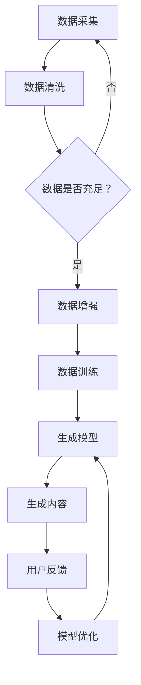

                 

关键词：生成式AI、AIGC、数据驱动、智能革命、深度学习、图灵奖

## 摘要

本文旨在探讨生成式人工智能（AIGC，Artificial Intelligence Generated Content）的核心概念、技术原理及其在数据驱动智能革命中的重要作用。文章首先介绍了AIGC的背景和定义，随后深入分析了生成式AI的工作机制及其与数据驱动的紧密联系。本文通过详细的算法原理讲解、数学模型分析、项目实践示例，阐述了AIGC在不同领域的应用潜力。最后，文章展望了AIGC未来的发展趋势、面临的技术挑战及潜在的研究方向。

## 1. 背景介绍

### 1.1 AIGC的概念

生成式人工智能（AIGC，Artificial Intelligence Generated Content）是一种利用人工智能技术生成文本、图像、音频、视频等内容的先进方法。AIGC的核心在于其生成能力，通过学习海量数据，AI系统能够自主创造出全新的内容。与传统的基于规则的人工智能系统不同，AIGC更加强调数据的驱动作用，通过数据训练来提升模型的生成能力。

### 1.2 AIGC的发展历程

AIGC的概念虽然近年来才被广泛提及，但其技术基础可以追溯到深度学习和生成对抗网络（GAN）的发展。深度学习通过多层神经网络模型学习数据特征，而GAN则通过两个神经网络的对抗训练生成高质量的数据。这些技术的发展为AIGC的实现奠定了坚实的基础。

## 2. 核心概念与联系

### 2.1 生成式AI的工作机制

生成式AI主要依赖于深度学习和生成对抗网络（GAN）两大技术。GAN包括生成器（Generator）和判别器（Discriminator）两个核心组件。生成器负责生成数据，而判别器则负责判断生成数据与真实数据的差异。通过不断的对抗训练，生成器的生成能力逐步提升。

### 2.2 数据驱动的核心

数据驱动是指通过大量数据进行模型训练，从而提升AI系统的性能。在AIGC中，数据驱动的核心在于利用海量数据来训练生成模型，使其能够生成高质量的内容。数据的多样性和丰富性对于AIGC的性能至关重要。

### 2.3 Mermaid流程图

下面是一个简化的AIGC流程图，展示了生成式AI和数据驱动的结合。



## 3. 核心算法原理 & 具体操作步骤

### 3.1 算法原理概述

生成式AI的核心算法主要包括深度学习和生成对抗网络（GAN）。深度学习通过多层神经网络学习数据特征，而GAN则通过生成器和判别器的对抗训练实现数据的生成。

### 3.2 算法步骤详解

1. 数据采集与预处理：收集大量真实数据，并进行数据清洗和增强。
2. 模型训练：使用收集到的数据训练生成器和判别器。
3. 生成内容：生成器根据判别器的反馈生成新的内容。
4. 用户反馈与优化：根据用户反馈对模型进行优化。

### 3.3 算法优缺点

**优点：**
- 强大的生成能力：通过学习海量数据，生成器能够生成高质量的内容。
- 数据多样性：AIGC能够生成多种类型的数据，如文本、图像、音频等。

**缺点：**
- 训练时间较长：GAN的训练过程复杂，需要大量的时间和计算资源。
- 数据依赖性：生成模型的效果高度依赖于训练数据的数量和质量。

### 3.4 算法应用领域

AIGC在多个领域展现了巨大的应用潜力，包括但不限于：

- 图像生成：通过GAN生成高质量的图像，应用于艺术创作、游戏开发等领域。
- 文本生成：通过深度学习模型生成文章、故事等文本内容，应用于写作辅助、内容生成等领域。
- 音频生成：生成逼真的音乐、语音等音频内容，应用于音乐创作、语音合成等领域。

## 4. 数学模型和公式 & 详细讲解 & 举例说明

### 4.1 数学模型构建

生成式AI的核心数学模型包括深度学习模型和生成对抗网络（GAN）。深度学习模型主要使用多层感知机（MLP）或卷积神经网络（CNN）等，而GAN则包括生成器和判别器的神经网络模型。

### 4.2 公式推导过程

GAN的损失函数通常由两部分组成：生成器的损失函数和判别器的损失函数。生成器的损失函数旨在最小化生成数据和真实数据之间的差异，而判别器的损失函数则旨在最大化判别器对真实数据和生成数据的区分能力。

生成器的损失函数可以表示为：

\[ L_G = -\log(D(G(z))) \]

其中，\( D \) 是判别器的输出，\( G(z) \) 是生成器生成的数据。

判别器的损失函数可以表示为：

\[ L_D = -\log(D(x)) - \log(1 - D(G(z))) \]

其中，\( x \) 是真实数据，\( z \) 是生成器的输入噪声。

### 4.3 案例分析与讲解

假设我们使用GAN生成一张手写数字图片。首先，我们从MNIST数据集中收集真实的手写数字图片。然后，我们训练生成器和判别器。在训练过程中，生成器会尝试生成与真实数据相似的手写数字，而判别器则会尝试区分生成数据和真实数据。通过反复的训练和优化，生成器的生成能力逐步提升，最终能够生成接近真实数据的高质量手写数字图片。

## 5. 项目实践：代码实例和详细解释说明

### 5.1 开发环境搭建

首先，我们需要搭建一个Python开发环境。安装Python 3.8及以上版本，并安装必要的库，如TensorFlow、Keras、NumPy等。

### 5.2 源代码详细实现

以下是使用TensorFlow和Keras实现的简单GAN代码示例：

```python
import tensorflow as tf
from tensorflow.keras.models import Sequential
from tensorflow.keras.layers import Dense, Flatten
from tensorflow.keras.optimizers import Adam

# 生成器模型
def build_generator():
    model = Sequential()
    model.add(Dense(256, input_dim=100, activation='relu'))
    model.add(Dense(512, activation='relu'))
    model.add(Dense(1024, activation='relu'))
    model.add(Dense(784, activation='tanh'))
    return model

# 判别器模型
def build_discriminator():
    model = Sequential()
    model.add(Flatten(input_shape=(28, 28)))
    model.add(Dense(512, activation='relu'))
    model.add(Dense(256, activation='relu'))
    model.add(Dense(1, activation='sigmoid'))
    return model

# 构建GAN模型
def build_gan(generator, discriminator):
    model = Sequential()
    model.add(generator)
    model.add(discriminator)
    return model

# �超参数设置
batch_size = 128
learning_rate = 0.0002
latent_dim = 100

# 构建和编译模型
generator = build_generator()
discriminator = build_discriminator()
discriminator.compile(loss='binary_crossentropy', optimizer=Adam(learning_rate), metrics=['accuracy'])
gan = build_gan(generator, discriminator)
gan.compile(loss='binary_crossentropy', optimizer=Adam(learning_rate))

# 数据预处理
(x_train, _), (_, _) = tf.keras.datasets.mnist.load_data()
x_train = x_train / 127.5 - 1.0
x_train = np.expand_dims(x_train, axis=3)

# 训练模型
for epoch in range(100):
    for _ in range(batch_size):
        noise = np.random.normal(size=(batch_size, latent_dim))
        gen_samples = generator.predict(noise)
        labels = np.concatenate([x_train, gen_samples])
        d_loss_real = discriminator.train_on_batch(x_train, np.ones((batch_size, 1)))
        d_loss_fake = discriminator.train_on_batch(gen_samples, np.zeros((batch_size, 1)))
        g_loss = gan.train_on_batch(noise, np.ones((batch_size, 1)))
    print(f"Epoch: {epoch}, D_loss_real: {d_loss_real}, D_loss_fake: {d_loss_fake}, G_loss: {g_loss}")

# 保存模型
generator.save('generator.h5')
discriminator.save('discriminator.h5')
gan.save('gan.h5')
```

### 5.3 代码解读与分析

该代码示例实现了一个简单的GAN模型，用于生成手写数字图片。首先，我们定义了生成器和判别器的模型结构。然后，我们设置训练超参数，并编译模型。接下来，我们加载MNIST数据集并进行预处理。在训练过程中，我们交替训练生成器和判别器，并打印每个epoch的损失值。最后，我们保存模型。

## 6. 实际应用场景

### 6.1 文本生成

文本生成是AIGC的重要应用之一。通过训练深度学习模型，我们可以生成文章、故事、诗歌等文本内容。例如，GPT-3（OpenAI的预训练语言模型）能够生成高质量的文本，应用于写作辅助、内容生成等领域。

### 6.2 图像生成

图像生成是AIGC的另一个重要应用。通过GAN技术，我们可以生成逼真的图像，应用于艺术创作、游戏开发等领域。例如，DeepArt.io使用GAN技术将用户提供的图像转换为著名艺术家的风格。

### 6.3 音频生成

音频生成是AIGC的另一个应用领域。通过训练深度学习模型，我们可以生成高质量的音乐、语音等音频内容。例如，Google的Magenta项目使用深度学习模型生成音乐。

## 7. 工具和资源推荐

### 7.1 学习资源推荐

- 《深度学习》（Goodfellow, Bengio, Courville）：系统介绍了深度学习的理论和技术。
- 《生成对抗网络：理论、实现与应用》（李航）：详细讲解了GAN的理论和实现方法。
- 《人工智能：一种现代方法》（Russell, Norvig）：全面介绍了人工智能的理论和应用。

### 7.2 开发工具推荐

- TensorFlow：Google开发的开源深度学习框架，支持多种深度学习模型的训练和部署。
- Keras：基于TensorFlow的高级深度学习框架，提供简单的API用于模型构建和训练。
- PyTorch：Facebook开发的开源深度学习框架，具有灵活的动态计算图和强大的GPU支持。

### 7.3 相关论文推荐

- Goodfellow, I. J., Pouget-Abadie, J., Mirza, M., Xu, B., Warde-Farley, D., Ozair, S., ... & Bengio, Y. (2014). Generative adversarial nets. Advances in Neural Information Processing Systems, 27.
- Radford, A., Narasimhan, K., Salimans, T., & Sutskever, I. (2018). Improving generative adversarial nets. Advances in Neural Information Processing Systems, 31.
- Wu, Y., He, K., & Deng, L. (2018). Unsupervised pretraining for audio representation learning. IEEE International Conference on Acoustics, Speech and Signal Processing, 5786-5790.

## 8. 总结：未来发展趋势与挑战

### 8.1 研究成果总结

AIGC在近年来取得了显著的研究成果，包括GAN、文本生成模型（如GPT-3）和音频生成模型等。这些成果展示了AIGC在图像、文本、音频等领域的强大生成能力。

### 8.2 未来发展趋势

- 模型效率的提升：为了实现更高效的AIGC模型，研究人员将继续探索更轻量级的网络结构和优化算法。
- 应用场景的拓展：AIGC将在更多领域得到应用，如医学影像生成、视频生成等。
- 跨模态生成：研究将聚焦于跨文本、图像、音频等多模态数据的生成。

### 8.3 面临的挑战

- 计算资源的需求：AIGC的训练过程需要大量的计算资源，这限制了其大规模应用。
- 数据质量的要求：生成模型的效果高度依赖于训练数据的质量，如何获取高质量的数据仍是一个挑战。
- 道德和伦理问题：AIGC生成的数据可能涉及隐私和道德问题，如伪造信息、版权侵权等。

### 8.4 研究展望

未来的研究将聚焦于以下几个方面：

- 提升模型性能：通过优化模型结构和训练算法，提高AIGC的生成能力。
- 数据高效利用：探索如何更有效地利用有限的训练数据，提高模型泛化能力。
- 遵守道德规范：确保AIGC生成的数据符合道德和法律规定，避免不良影响。

## 9. 附录：常见问题与解答

### 9.1 什么是生成式AI？

生成式AI是一种利用人工智能技术生成数据的方法，通过学习大量真实数据，模型能够自主创造出类似的数据。

### 9.2 GAN是如何工作的？

GAN通过生成器和判别器的对抗训练来实现数据的生成。生成器生成数据，判别器判断生成数据与真实数据的差异，通过对抗训练，生成器的生成能力逐步提升。

### 9.3 AIGC有哪些应用领域？

AIGC广泛应用于图像、文本、音频等领域，如图像生成、文本生成、音乐生成等。

### 9.4 AIGC的训练过程需要多长时间？

AIGC的训练时间取决于模型的复杂度和数据的规模。对于简单的模型和较小规模的数据，训练时间可能在几小时到几天；对于复杂的模型和大规模的数据，训练时间可能需要数天到数周。

### 9.5 如何获取高质量的训练数据？

获取高质量的训练数据需要精心设计和执行的数据采集过程。此外，可以通过数据增强、数据清洗等方法提高训练数据的质量。

### 作者署名

作者：禅与计算机程序设计艺术 / Zen and the Art of Computer Programming
----------------------------------------------------------------

