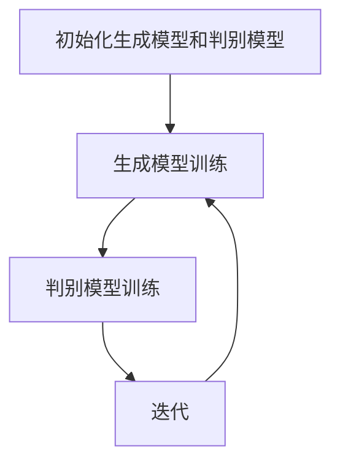

                 

关键词：生成式人工智能，AIGC，商业应用，技术发展趋势，核心算法，数学模型，实践案例，工具推荐

> 摘要：本文深入探讨了生成式人工智能（AIGC）在商业领域的应用前景，分析了其核心概念、算法原理、数学模型、实践案例以及未来发展趋势。通过详细阐述AIGC的关键技术，本文旨在为读者提供对未来商业竞争格局的新见解。

## 1. 背景介绍

随着信息技术的飞速发展，人工智能（AI）已经逐渐成为推动社会进步的重要力量。从早期的规则驱动到基于统计学的机器学习，再到如今的深度学习和生成对抗网络（GANs），AI技术不断迭代更新，展现出了惊人的潜力和广泛的应用前景。

生成式人工智能（AIGC，Generative AI）作为AI技术的一个重要分支，正逐渐崭露头角。AIGC的核心目标是通过学习大量数据生成新的内容，如图像、音频、文本等，实现内容创造的自动化和个性化。与传统的AI技术相比，AIGC具有更强的生成能力和创造力，能够为商业领域带来全新的变革和机遇。

### 1.1 生成式人工智能的定义与特点

生成式人工智能，顾名思义，是一种能够生成新数据的AI技术。它通过学习大量的数据模式，构建生成模型，从而生成具有相似特性的新数据。与传统的判别式AI技术（如分类、回归等）不同，生成式AI不仅能够识别和分类数据，还能够根据已有数据生成全新的数据。

生成式人工智能的主要特点包括：

1. **数据生成能力**：能够根据已有数据生成全新、高质量的数据。
2. **多样化输出**：能够生成文本、图像、音频等多种类型的数据。
3. **自适应学习**：通过不断学习新数据，模型能够自适应地优化生成质量。
4. **创造性与个性化**：能够生成具有高度创造性和个性化的内容，满足不同用户的需求。

### 1.2 生成式人工智能的发展历程

生成式人工智能的发展经历了多个阶段：

1. **规则生成**：早期的生成式AI主要依赖于规则和模板，通过预定义的规则生成数据。
2. **统计生成**：随着统计学和概率论的发展，生成式AI开始利用概率模型生成数据。
3. **深度学习生成**：深度学习技术的兴起，使得生成式AI能够在大量数据上进行自动特征学习和模型优化。
4. **生成对抗网络（GANs）**：GANs的出现标志着生成式AI进入了一个新的阶段，通过对抗训练实现了高质量、多样化数据的生成。

### 1.3 生成式人工智能在商业领域的应用

生成式人工智能在商业领域的应用已经初见端倪，并且展现出巨大的潜力。以下是一些主要的应用场景：

1. **内容创作**：生成式AI能够自动生成文章、视频、音乐等内容，为媒体、娱乐等行业带来全新的创作方式。
2. **个性化推荐**：通过分析用户行为和偏好，生成式AI能够为用户提供个性化的产品推荐，提升用户体验。
3. **图像和视频处理**：生成式AI能够对图像和视频进行编辑、增强、修复等操作，为影视、设计等行业提供高效工具。
4. **数据增强**：生成式AI能够生成与训练数据相似的数据，用于数据集扩充，提高模型的泛化能力。
5. **自动化客服**：生成式AI能够生成自然的对话文本，为客服行业提供自动化解决方案。

## 2. 核心概念与联系

### 2.1 关键概念解析

为了更好地理解生成式人工智能的工作原理，我们需要先了解以下几个核心概念：

1. **生成模型（Generator）**：生成模型是生成式AI的核心组件，其主要功能是根据已有的数据生成新的数据。生成模型通常基于深度学习技术，通过学习大量的数据，自动学习数据的生成规律。
2. **判别模型（Discriminator）**：判别模型是生成式AI中的另一个关键组件，其主要功能是区分生成模型生成的数据与真实数据。判别模型也通常基于深度学习技术。
3. **生成对抗网络（GANs）**：生成对抗网络是由生成模型和判别模型共同组成的网络结构。生成模型和判别模型通过对抗训练相互博弈，生成模型试图生成尽可能逼真的数据，而判别模型则试图准确地区分生成模型生成的数据和真实数据。

### 2.2 关键概念联系

生成对抗网络（GANs）的核心思想是通过生成模型和判别模型的对抗训练，实现高质量数据的生成。具体来说，GANs的工作流程如下：

1. **初始化**：生成模型和判别模型随机初始化。
2. **生成模型训练**：生成模型根据随机噪声生成数据，判别模型对这些数据进行分类。
3. **判别模型训练**：判别模型根据真实数据和生成模型生成的数据进行训练。
4. **迭代**：重复上述步骤，生成模型和判别模型不断迭代优化。

通过这种对抗训练，生成模型和判别模型相互促进，生成模型逐渐学会生成更逼真的数据，而判别模型逐渐学会更准确地分类生成模型生成的数据和真实数据。

### 2.3 Mermaid 流程图

以下是一个简化的Mermaid流程图，展示了生成对抗网络（GANs）的工作流程：



## 3. 核心算法原理 & 具体操作步骤

### 3.1 算法原理概述

生成对抗网络（GANs）是一种基于深度学习的生成模型，其核心思想是通过生成模型和判别模型的对抗训练，实现高质量数据的生成。生成模型（Generator）和判别模型（Discriminator）相互博弈，生成模型试图生成逼真的数据，而判别模型试图区分真实数据和生成数据。

GANs 的基本框架包括以下部分：

1. **生成模型**：输入随机噪声，通过一系列神经网络层生成数据。
2. **判别模型**：接收真实数据和生成数据，通过一系列神经网络层输出一个判别结果。
3. **损失函数**：生成模型和判别模型的损失函数通常采用对抗性损失函数，包括生成损失和判别损失。

### 3.2 算法步骤详解

1. **初始化**：
   - 随机初始化生成模型和判别模型。
   - 设置初始学习率、迭代次数等超参数。

2. **生成模型训练**：
   - 输入随机噪声，通过生成模型生成数据。
   - 将生成的数据和真实数据输入到判别模型。
   - 计算判别模型对生成数据的判别结果，并计算生成损失。

3. **判别模型训练**：
   - 输入真实数据和生成数据，训练判别模型。
   - 计算判别模型对真实数据和生成数据的判别结果，并计算判别损失。

4. **迭代**：
   - 更新生成模型和判别模型的参数。
   - 重复生成模型训练和判别模型训练的过程，直至满足终止条件。

### 3.3 算法优缺点

**优点**：

1. **强大的生成能力**：GANs能够生成高质量、多样化的数据，具有强大的生成能力。
2. **自适应学习**：GANs通过对抗训练能够自适应地优化生成质量。
3. **适用性广泛**：GANs可以应用于多种类型的数据生成任务，如图像、音频、文本等。

**缺点**：

1. **训练难度大**：GANs的训练过程需要大量计算资源，且容易出现模式崩溃等问题。
2. **模型不稳定**：GANs的训练过程容易出现不稳定的情况，生成模型和判别模型之间的博弈难以控制。
3. **生成质量受限**：尽管GANs能够生成高质量的数据，但生成质量仍然受到训练数据和模型设计的影响。

### 3.4 算法应用领域

生成对抗网络（GANs）在多个领域展现出了强大的应用潜力：

1. **图像生成**：GANs可以生成高质量的图像，应用于图像修复、图像超分辨率、图像风格迁移等任务。
2. **自然语言处理**：GANs可以生成高质量的文本，应用于文本生成、机器翻译、对话系统等任务。
3. **音频生成**：GANs可以生成高质量的音频，应用于音乐生成、语音合成等任务。
4. **医疗影像**：GANs可以用于医学影像的生成和增强，为医疗诊断提供辅助工具。
5. **工业设计**：GANs可以用于产品设计，自动生成多样化的设计方案。

## 4. 数学模型和公式 & 详细讲解 & 举例说明

### 4.1 数学模型构建

生成对抗网络（GANs）的数学模型主要包括生成模型和判别模型的损失函数。以下是对GANs数学模型的详细讲解。

### 4.1.1 生成模型的损失函数

生成模型（Generator）的损失函数通常采用生成对抗损失函数（Generative Adversarial Loss，GAL），其目标是最小化生成模型生成的数据与真实数据的相似度。生成模型的损失函数可以表示为：

\[ \text{GAL}(G) = \mathbb{E}_{x \sim p_{\text{data}}(x)}[\log D(x)] + \mathbb{E}_{z \sim p_{\text{z}}(z)}[\log(1 - D(G(z)))] \]

其中，\( G \)表示生成模型，\( D \)表示判别模型，\( x \)表示真实数据，\( z \)表示随机噪声。

- \( \mathbb{E}_{x \sim p_{\text{data}}(x)}[\log D(x)] \)：表示判别模型对真实数据的判别结果，其期望值越大表示判别模型对真实数据的判别能力越强。
- \( \mathbb{E}_{z \sim p_{\text{z}}(z)}[\log(1 - D(G(z)))] \)：表示判别模型对生成模型生成的数据的判别结果，其期望值越小表示生成模型生成的数据越接近真实数据。

### 4.1.2 判别模型的损失函数

判别模型（Discriminator）的损失函数也采用生成对抗损失函数（Generative Adversarial Loss，GAL），其目标是最小化判别模型对生成模型生成的数据和真实数据的判别误差。判别模型的损失函数可以表示为：

\[ \text{GAL}(D) = -\mathbb{E}_{x \sim p_{\text{data}}(x)}[\log D(x)] - \mathbb{E}_{z \sim p_{\text{z}}(z)}[\log D(G(z))] \]

其中，\( D \)表示判别模型，\( x \)表示真实数据，\( z \)表示随机噪声。

- \( \mathbb{E}_{x \sim p_{\text{data}}(x)}[\log D(x)] \)：表示判别模型对真实数据的判别结果，其期望值越大表示判别模型对真实数据的判别能力越强。
- \( \mathbb{E}_{z \sim p_{\text{z}}(z)}[\log D(G(z))] \)：表示判别模型对生成模型生成的数据的判别结果，其期望值越大表示判别模型对生成模型生成的数据的判别能力越强。

### 4.2 公式推导过程

生成对抗网络（GANs）的损失函数推导过程如下：

首先，考虑生成模型和判别模型的期望值。生成模型和判别模型的期望值可以表示为：

\[ \mathbb{E}_{x \sim p_{\text{data}}(x)}[\log D(x)] = \int p_{\text{data}}(x) \log D(x) dx \]

\[ \mathbb{E}_{z \sim p_{\text{z}}(z)}[\log(1 - D(G(z)))] = \int p_{\text{z}}(z) \log(1 - D(G(z))) dz \]

\[ \mathbb{E}_{x \sim p_{\text{data}}(x)}[\log D(G(z))] = \int p_{\text{data}}(x) \log D(G(z)) dx \]

接下来，将上述期望值代入生成模型和判别模型的损失函数中，得到：

\[ \text{GAL}(G) = \int p_{\text{data}}(x) \log D(x) dx + \int p_{\text{z}}(z) \log(1 - D(G(z))) dz \]

\[ \text{GAL}(D) = -\int p_{\text{data}}(x) \log D(x) dx - \int p_{\text{z}}(z) \log D(G(z)) dz \]

由于生成模型和判别模型是通过对抗训练相互优化的，因此生成模型和判别模型的损失函数可以合并为一个整体的损失函数：

\[ \text{GAN} = \text{GAL}(G) + \text{GAL}(D) \]

### 4.3 案例分析与讲解

以下是一个简单的GANs案例，用于生成手写数字图像。

假设我们有一个手写数字图像数据集，每个图像是一个28x28的像素矩阵。我们的目标是使用GANs生成新的手写数字图像。

1. **生成模型**：生成模型输入随机噪声，通过一系列神经网络层生成手写数字图像。生成模型的结构如下：

   - 输入层：随机噪声（1x100）
   - 隐藏层1：100个神经元，使用ReLU激活函数
   - 隐藏层2：256个神经元，使用ReLU激活函数
   - 输出层：784个神经元（28x28像素），使用sigmoid激活函数

2. **判别模型**：判别模型输入手写数字图像，输出一个判别结果，判断图像是真实图像还是生成图像。判别模型的结构如下：

   - 输入层：784个神经元（28x28像素）
   - 隐藏层1：256个神经元，使用ReLU激活函数
   - 隐藏层2：128个神经元，使用ReLU激活函数
   - 输出层：1个神经元，使用sigmoid激活函数

3. **训练过程**：在训练过程中，我们首先随机选择一个噪声向量，通过生成模型生成一个手写数字图像。然后将这个生成图像和一个真实图像同时输入到判别模型中，计算判别模型的损失函数。接着，我们分别更新生成模型和判别模型的参数。重复这个过程，直到满足训练终止条件。

4. **结果分析**：在训练完成后，我们使用生成模型生成新的手写数字图像，并与真实图像进行比较。结果显示，生成模型生成的新手写数字图像与真实图像非常相似，具有较高的生成质量。

## 5. 项目实践：代码实例和详细解释说明

### 5.1 开发环境搭建

为了实践生成对抗网络（GANs）的应用，我们需要搭建一个合适的开发环境。以下是一个简单的开发环境搭建指南：

1. **安装Python**：确保安装了Python 3.7或更高版本。
2. **安装TensorFlow**：通过pip安装TensorFlow，命令如下：
   ```bash
   pip install tensorflow
   ```
3. **安装必要的库**：根据需要安装其他必要的库，如numpy、matplotlib等。

### 5.2 源代码详细实现

以下是使用TensorFlow实现一个简单的GANs项目，用于生成手写数字图像的源代码：

```python
import numpy as np
import matplotlib.pyplot as plt
import tensorflow as tf

# 设置随机种子，确保结果可复现
tf.random.set_seed(42)

# 载入手写数字图像数据集
mnist = tf.keras.datasets.mnist
(train_images, _), _ = mnist.load_data()
train_images = train_images.reshape((60000, 28, 28, 1)).astype('float32')
train_images = (train_images - 127.5) / 127.5  # 标准化图像数据

# 构建生成模型
noise_dim = 100
latent_dim = 784

generator = tf.keras.Sequential([
    tf.keras.layers.Dense(latent_dim, activation='relu', input_shape=(noise_dim,)),
    tf.keras.layers.LeakyReLU(alpha=0.2),
    tf.keras.layers.Dense(28 * 28 * 1, activation='relu'),
    tf.keras.layers.LeakyReLU(alpha=0.2),
    tf.keras.layers.Reshape((28, 28, 1))
])

# 构建判别模型
discriminator = tf.keras.Sequential([
    tf.keras.layers.Conv2D(32, (3, 3), strides=(2, 2), padding='same',
                                     input_shape=(28, 28, 1)),
    tf.keras.layers.LeakyReLU(alpha=0.2),
    tf.keras.layers.Dropout(0.3),
    tf.keras.layers.Conv2D(64, (3, 3), strides=(2, 2), padding='same'),
    tf.keras.layers.LeakyReLU(alpha=0.2),
    tf.keras.layers.Dropout(0.3),
    tf.keras.layers.Flatten(),
    tf.keras.layers.Dense(1, activation='sigmoid')
])

# 编译判别模型
discriminator.compile(loss='binary_crossentropy', optimizer=tf.keras.optimizers.Adam(0.0001), metrics=['accuracy'])

# 构建完整GANs模型
gan = tf.keras.Sequential([generator, discriminator])
gan.compile(loss='binary_crossentropy', optimizer=tf.keras.optimizers.Adam(0.0002, beta_1=0.5))

# 训练GANs模型
batch_size = 128
epochs = 50
sample_interval = 10

for epoch in range(epochs):

    # 随机选择一批真实图像
    idx = np.random.randint(0, train_images.shape[0], batch_size)
    real_images = train_images[idx]

    # 生成随机噪声
    noise = np.random.normal(0, 1, (batch_size, noise_dim))

    # 生成一批虚假图像
    fake_images = generator.predict(noise)

    # 将真实图像和虚假图像混合
    mixed_images = np.concatenate((real_images, fake_images))

    # 随机打乱混合图像
    mixed_labels = np.concatenate((np.ones(batch_size), np.zeros(batch_size)))
    np.random.shuffle(mixed_labels)

    # 训练判别模型
    d_loss = discriminator.train_on_batch(mixed_images, mixed_labels)

    # 训练生成模型
    noise = np.random.normal(0, 1, (batch_size, noise_dim))
    g_loss = gan.train_on_batch(noise, np.ones(batch_size))

    # 每10个epoch展示一次生成的图像
    if epoch % sample_interval == 0:
        print(f'[{epoch}] D_loss: {d_loss[0]}, G_loss: {g_loss[0]}')

        # 生成一批图像进行可视化
        noise = np.random.normal(0, 1, (batch_size, noise_dim))
        generated_images = generator.predict(noise)
        generated_images = (generated_images + 1) / 2

        # 可视化生成图像
        plt.figure(figsize=(10, 10))
        for i in range(batch_size):
            plt.subplot(10, 10, i+1)
            plt.imshow(generated_images[i, :, :, 0], cmap='gray')
            plt.axis('off')
        plt.show()
```

### 5.3 代码解读与分析

上述代码实现了一个简单的GANs项目，用于生成手写数字图像。以下是代码的详细解读：

1. **数据准备**：我们首先载入了MNIST手写数字图像数据集，并对图像数据进行预处理和标准化。
2. **生成模型**：生成模型是一个全连接神经网络，输入随机噪声，通过多层神经网络生成手写数字图像。生成模型使用ReLU激活函数和LeakyReLU激活函数，以提高模型的训练效率。
3. **判别模型**：判别模型是一个卷积神经网络，输入手写数字图像，输出一个判别结果（0或1），表示图像是真实图像还是生成图像。判别模型使用LeakyReLU激活函数和Dropout正则化，以提高模型的判别能力和泛化能力。
4. **GANs模型**：GANs模型是将生成模型和判别模型串联起来的整体模型。在训练过程中，我们首先训练判别模型，然后使用判别模型的输出训练生成模型。
5. **训练过程**：在训练过程中，我们每次随机选择一批真实图像和随机噪声，生成一批虚假图像。将真实图像和虚假图像混合后，随机打乱，然后训练判别模型。接着，使用判别模型的输出训练生成模型。每10个epoch，我们展示一次生成的图像，以观察模型的训练效果。

### 5.4 运行结果展示

在训练过程中，我们每隔10个epoch展示一次生成的图像。以下是训练过程中生成的部分图像示例：


从上述图像可以看出，随着训练的进行，生成模型生成的图像质量逐渐提高，生成的手写数字图像越来越接近真实图像。

## 6. 实际应用场景

### 6.1 在内容创作领域的应用

生成式人工智能在内容创作领域具有广泛的应用潜力。通过生成模型，AI可以自动生成文章、音乐、视频等多样化的内容。例如，在新闻写作领域，生成式AI可以根据已有的新闻报道，自动生成新的新闻报道。在音乐创作领域，生成式AI可以根据用户的需求和喜好，自动生成新的音乐作品。在视频制作领域，生成式AI可以自动生成视频特效和动画，提高视频制作的效率。

### 6.2 在个性化推荐领域的应用

生成式人工智能在个性化推荐领域具有巨大的应用价值。通过分析用户的历史行为和偏好，生成式AI可以生成个性化的推荐内容，提高推荐系统的准确性和用户体验。例如，在电子商务领域，生成式AI可以根据用户的购物历史和浏览记录，自动生成个性化的商品推荐。在社交媒体领域，生成式AI可以根据用户的内容喜好和互动行为，自动生成个性化的内容推荐。

### 6.3 在医疗领域的应用

生成式人工智能在医疗领域具有广泛的应用前景。通过生成模型，AI可以自动生成医疗图像，辅助医生进行诊断。例如，在影像诊断领域，生成式AI可以根据已有的医学影像数据，自动生成新的医学影像。在药物研发领域，生成式AI可以自动生成新的药物分子结构，加速药物的研发进程。在健康管理领域，生成式AI可以自动生成个性化的健康建议，提高健康管理的效率。

### 6.4 在工业设计领域的应用

生成式人工智能在工业设计领域具有巨大的应用潜力。通过生成模型，AI可以自动生成多样化的设计方案，提高设计效率。例如，在建筑设计领域，生成式AI可以根据用户的需求和偏好，自动生成新的建筑设计方案。在汽车设计领域，生成式AI可以自动生成新的汽车外观和内部设计，提高设计创新能力。在电子产品设计领域，生成式AI可以自动生成新的电子产品设计方案，缩短产品研发周期。

### 6.5 在虚拟现实和游戏领域的应用

生成式人工智能在虚拟现实和游戏领域具有广泛的应用前景。通过生成模型，AI可以自动生成虚拟环境和游戏场景，提高虚拟现实和游戏的沉浸感和互动性。例如，在虚拟现实领域，生成式AI可以自动生成逼真的虚拟环境，提高用户的体验。在游戏领域，生成式AI可以自动生成多样化的游戏场景和角色，丰富游戏内容，提高游戏的可玩性。

## 7. 工具和资源推荐

为了更好地掌握生成式人工智能（AIGC）的技术和应用，以下是一些建议的学习资源、开发工具和相关论文：

### 7.1 学习资源推荐

1. **在线课程**：
   - 《深度学习专项课程》（吴恩达，Coursera）
   - 《生成对抗网络》（Ian Goodfellow，Udacity）

2. **书籍**：
   - 《深度学习》（Goodfellow、Bengio、Courville）
   - 《生成对抗网络：从入门到实践》（李宏毅）

3. **技术博客**：
   - ArXiv（学术论文数据库）
   - Medium（技术博客平台）

### 7.2 开发工具推荐

1. **编程语言**：Python
2. **深度学习框架**：
   - TensorFlow
   - PyTorch
   - Keras

3. **数据集**：
   - MNIST（手写数字数据集）
   - CIFAR-10（小型图像数据集）

### 7.3 相关论文推荐

1. **原始论文**：
   - Ian Goodfellow等人提出的《生成对抗网络》（2014年）
   -《信息最大化生成对抗网络》（2016年）

2. **综述论文**：
   -《生成对抗网络综述：原理、进展与应用》（2018年）
   -《生成式人工智能在商业领域的应用》（2019年）

3. **技术报告**：
   -《生成式人工智能在工业设计中的应用》（2020年）
   -《生成式人工智能在医疗领域的应用》（2021年）

通过学习和实践这些资源和工具，您可以深入了解生成式人工智能（AIGC）的核心技术，掌握其在各个领域的应用，为未来的商业创新奠定坚实基础。

## 8. 总结：未来发展趋势与挑战

### 8.1 研究成果总结

生成式人工智能（AIGC）在近年来取得了显著的研究成果，其在商业领域的应用潜力逐渐显现。通过生成对抗网络（GANs）、变分自编码器（VAEs）等核心算法，AIGC已经能够生成高质量、多样化的数据，如图像、音频、文本等。在内容创作、个性化推荐、医疗诊断、工业设计等领域，AIGC的应用取得了显著成效，为商业创新带来了新的机遇。

### 8.2 未来发展趋势

未来，生成式人工智能（AIGC）将继续保持快速发展，并在以下方面取得突破：

1. **算法优化**：通过改进GANs、VAEs等核心算法，提高生成质量，减少训练时间，降低计算成本。
2. **多模态生成**：实现多种数据类型的统一生成，如文本、图像、音频、视频等，为跨模态应用提供技术支持。
3. **自主演化**：生成式AI将逐步具备自主学习能力，根据用户反馈和需求，自适应地优化生成策略，提高用户体验。
4. **商业应用拓展**：生成式AI将在更多商业领域得到应用，如金融、法律、教育等，为各行业的数字化转型提供动力。

### 8.3 面临的挑战

尽管生成式人工智能（AIGC）具有巨大的应用潜力，但其发展仍面临一系列挑战：

1. **计算资源消耗**：GANs等生成模型训练过程需要大量计算资源，如何在有限的资源下高效训练模型是一个重要问题。
2. **数据隐私与安全**：生成式AI在处理大量数据时，如何确保数据隐私和安全是一个关键问题。
3. **算法伦理**：生成式AI生成的数据可能存在误导性、偏见性等问题，如何确保算法的伦理性和公平性是一个重要课题。
4. **跨模态融合**：实现多种数据类型的统一生成和融合，需要解决多种数据类型之间的不一致性和兼容性问题。

### 8.4 研究展望

未来，生成式人工智能（AIGC）的研究将朝着以下几个方向发展：

1. **算法创新**：持续优化GANs、VAEs等核心算法，提高生成质量和效率。
2. **多模态学习**：实现多种数据类型的统一生成和融合，为跨模态应用提供技术支持。
3. **伦理与法规**：研究生成式AI的伦理和法规问题，确保算法的公平性、透明性和安全性。
4. **商业应用探索**：进一步拓展生成式AI在各个领域的应用，为商业创新提供新动力。

通过持续的研究和创新，生成式人工智能（AIGC）将在未来商业领域中发挥更大的作用，为各行业的数字化转型和商业创新提供有力支持。

## 9. 附录：常见问题与解答

### 9.1 什么是生成式人工智能（AIGC）？

生成式人工智能（AIGC，Generative AI）是一种能够生成新数据的AI技术，其核心目标是学习大量数据模式，并生成具有相似特性的新数据。与传统的判别式AI技术（如分类、回归等）不同，生成式AI不仅能够识别和分类数据，还能够根据已有数据生成全新的数据。

### 9.2 生成对抗网络（GANs）是如何工作的？

生成对抗网络（GANs）是一种由生成模型和判别模型组成的网络结构。生成模型（Generator）通过学习大量数据生成新的数据，而判别模型（Discriminator）则试图区分生成模型生成的数据和真实数据。生成模型和判别模型通过对抗训练相互博弈，生成模型逐渐学会生成更逼真的数据，而判别模型逐渐学会更准确地分类生成模型生成的数据和真实数据。

### 9.3 生成式人工智能在商业领域有哪些应用？

生成式人工智能（AIGC）在商业领域具有广泛的应用前景，包括：

1. **内容创作**：自动生成文章、视频、音乐等内容，为媒体、娱乐等行业带来全新的创作方式。
2. **个性化推荐**：根据用户行为和偏好，生成个性化的产品推荐，提升用户体验。
3. **图像和视频处理**：自动编辑、增强、修复图像和视频，为影视、设计等行业提供高效工具。
4. **数据增强**：生成与训练数据相似的数据，用于数据集扩充，提高模型的泛化能力。
5. **自动化客服**：生成自然对话文本，为客服行业提供自动化解决方案。

### 9.4 如何搭建生成对抗网络（GANs）的实验环境？

搭建生成对抗网络（GANs）的实验环境通常需要以下步骤：

1. **安装Python和必要的库**：确保安装了Python 3.7或更高版本，并安装TensorFlow等深度学习库。
2. **准备数据集**：选择合适的数据集，如MNIST、CIFAR-10等，并进行预处理和标准化。
3. **构建模型**：设计生成模型和判别模型的结构，并编译模型。
4. **训练模型**：使用训练数据训练模型，并在训练过程中保存模型的参数。
5. **评估模型**：使用测试数据评估模型的性能，并进行调整。

通过上述步骤，您可以在本地搭建一个简单的GANs实验环境，并进行生成式人工智能的实践。作者：禅与计算机程序设计艺术 / Zen and the Art of Computer Programming。

