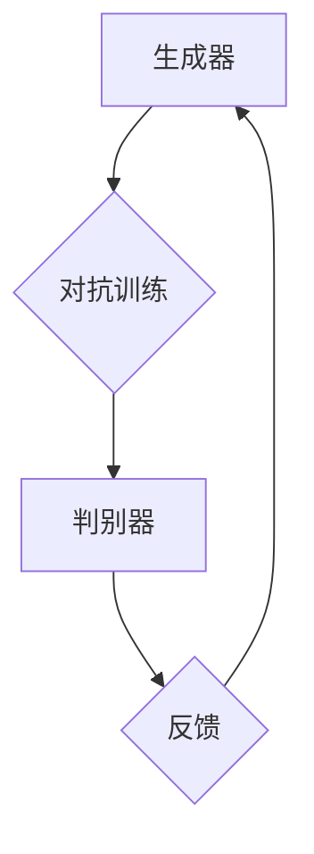

                 

关键词：生成式AI，深度学习，神经网络，自然语言处理，数据生成，图像生成，文本生成，模型架构，应用场景，未来展望

> 摘要：本文将探讨生成式人工智能（Generative AI）的核心概念、技术原理、应用领域及其未来发展。通过深入分析生成式AI的数学模型、算法实现和实际应用，帮助读者全面了解这一前沿技术的潜力与挑战。

## 1. 背景介绍

生成式人工智能，顾名思义，是一种能够生成数据的人工智能技术。与判别式人工智能（Discriminative AI）不同，生成式AI关注的是数据的生成过程，而不是分类或预测。生成式AI的目标是创建与真实数据相似的新数据，这些数据可以是图像、文本、音频等。随着深度学习技术的发展，生成式AI在图像生成、文本生成和语音合成等领域取得了显著的成果。

生成式AI的核心在于其能够通过学习大量真实数据，理解数据的分布特征，从而生成新的、与训练数据相似的数据。这一特性使得生成式AI在多个领域具有广泛的应用潜力，如虚拟现实、数字艺术、游戏开发、医疗影像生成等。

## 2. 核心概念与联系

生成式AI的核心概念包括生成器（Generator）和判别器（Discriminator）。生成器负责生成新的数据，而判别器则负责判断生成数据的真实性。两者之间通过对抗训练（Adversarial Training）进行博弈，从而提高生成器的性能。

### 2.1 生成器（Generator）

生成器是一种能够生成数据的神经网络模型，通常采用深度神经网络（DNN）或生成对抗网络（GAN）的结构。生成器的输入可以是随机噪声或部分真实数据，输出则是生成的数据。生成器的目标是生成尽可能真实的数据，使得判别器无法区分生成数据和真实数据。

### 2.2 判别器（Discriminator）

判别器是一种用于分类的神经网络模型，其输入是数据，输出是数据真实性的概率。判别器的任务是判断输入数据是真实数据还是生成数据。判别器的目标是提高对真实数据的分类准确率，同时降低对生成数据的分类准确率。

### 2.3 对抗训练（Adversarial Training）

对抗训练是生成器和判别器之间的一种博弈过程。生成器的目标是欺骗判别器，使得判别器无法区分生成数据和真实数据；而判别器的目标是提高对真实数据的分类准确率，同时降低对生成数据的分类准确率。通过这种博弈过程，生成器和判别器逐渐提高性能，最终实现生成高质量数据的目标。

### 2.4 Mermaid 流程图



## 3. 核心算法原理 & 具体操作步骤

### 3.1 算法原理概述

生成式AI的核心算法是生成对抗网络（GAN）。GAN由生成器和判别器组成，通过对抗训练实现数据的生成。GAN的原理可以概括为以下步骤：

1. 初始化生成器和判别器；
2. 从随机噪声或部分真实数据中生成新的数据；
3. 判别器对真实数据和生成数据进行分类；
4. 计算生成器和判别器的损失函数；
5. 通过反向传播更新生成器和判别器的权重；
6. 重复步骤2-5，直到生成器生成的数据质量达到预期。

### 3.2 算法步骤详解

1. 初始化生成器和判别器：生成器和判别器都是神经网络模型，可以通过随机初始化或预训练模型进行初始化。通常，生成器采用深度卷积神经网络（DCNN）或变分自编码器（VAE）的结构，判别器采用深度神经网络（DNN）的结构。

2. 生成新数据：生成器从随机噪声或部分真实数据中生成新的数据。生成器的输入可以是噪声向量或部分真实数据，输出是生成的数据。生成器的目标是生成尽可能真实的数据，使得判别器无法区分生成数据和真实数据。

3. 分类真实数据和生成数据：判别器对真实数据和生成数据进行分类。判别器的输入是真实数据和生成数据，输出是数据真实性的概率。判别器的目标是提高对真实数据的分类准确率，同时降低对生成数据的分类准确率。

4. 计算损失函数：生成器和判别器的损失函数可以采用交叉熵损失函数或Wasserstein损失函数。交叉熵损失函数衡量生成数据和真实数据之间的差异，而Wasserstein损失函数衡量生成数据和真实数据之间的距离。

5. 更新生成器和判别器的权重：通过反向传播更新生成器和判别器的权重。在训练过程中，生成器和判别器通过对抗训练逐渐提高性能，生成器生成的数据质量不断提高。

6. 重复训练过程：重复步骤2-5，直到生成器生成的数据质量达到预期。在训练过程中，可以通过调整学习率、批量大小等超参数来提高训练效果。

### 3.3 算法优缺点

生成对抗网络的优点包括：

- 强大的数据生成能力：生成对抗网络可以生成高质量的数据，适用于图像、文本、音频等多种类型的数据；
- 自适应性：生成对抗网络具有自适应的特征提取能力，可以自动学习数据的分布特征；
- 不需要标签数据：生成对抗网络不需要标签数据，可以直接从无监督数据中学习数据的分布特征。

生成对抗网络的缺点包括：

- 训练难度大：生成对抗网络的训练过程涉及生成器和判别器的对抗训练，训练难度较大；
- 稳定性问题：生成对抗网络的训练过程容易陷入局部最小值，导致训练不稳定；
- 损失函数设计：生成对抗网络的损失函数设计复杂，需要精心调整。

### 3.4 算法应用领域

生成对抗网络在图像生成、文本生成、语音合成等领域具有广泛的应用。以下是一些典型的应用案例：

- 图像生成：生成对抗网络可以用于图像去噪、图像超分辨率、图像修复等；
- 文本生成：生成对抗网络可以用于文本生成、机器翻译、摘要生成等；
- 语音合成：生成对抗网络可以用于语音合成、语音转换、说话人识别等。

## 4. 数学模型和公式 & 详细讲解 & 举例说明

生成对抗网络的数学模型包括生成器和判别器的损失函数。以下是对数学模型和公式的详细讲解及举例说明。

### 4.1 数学模型构建

生成器的损失函数可以表示为：

$$
L_G = -\mathbb{E}_{x \sim p_{data}(x)}[\log(D(x))] - \mathbb{E}_{z \sim p_z(z)}[\log(D(G(z))]
$$

其中，$x$ 表示真实数据，$z$ 表示随机噪声，$G(z)$ 表示生成器生成的数据，$D(x)$ 表示判别器对真实数据的输出概率，$D(G(z))$ 表示判别器对生成数据的输出概率。

判别器的损失函数可以表示为：

$$
L_D = -\mathbb{E}_{x \sim p_{data}(x)}[\log(D(x))] - \mathbb{E}_{z \sim p_z(z)}[\log(1 - D(G(z))]
$$

其中，$D(x)$ 表示判别器对真实数据的输出概率，$D(G(z))$ 表示判别器对生成数据的输出概率。

### 4.2 公式推导过程

生成器和判别器的损失函数可以通过优化问题进行推导。假设生成器和判别器都是神经网络模型，其参数分别为 $\theta_G$ 和 $\theta_D$。

对于生成器 $G(z)$，我们希望生成尽可能真实的数据，使得判别器无法区分生成数据和真实数据。因此，生成器的目标是最大化判别器对生成数据的输出概率：

$$
\max_G V(D, G) = \mathbb{E}_{z \sim p_z(z)}[\log(D(G(z))]
$$

对于判别器 $D(x)$，我们希望提高对真实数据的分类准确率，同时降低对生成数据的分类准确率。因此，判别器的目标是最大化判别器的损失函数：

$$
\max_D V(D, G) = \mathbb{E}_{x \sim p_{data}(x)}[\log(D(x))] + \mathbb{E}_{z \sim p_z(z)}[\log(1 - D(G(z))]
$$

通过求解上述优化问题，可以得到生成器和判别器的损失函数。

### 4.3 案例分析与讲解

假设我们有一个图像生成任务，生成器 $G(z)$ 生成256x256像素的图像，判别器 $D(x)$ 判断输入图像的真实性。我们将使用以下数据集：

- 真实图像数据集：MNIST手写数字数据集；
- 随机噪声数据集：均值为0，标准差为1的正态分布。

首先，我们初始化生成器和判别器的参数。生成器采用深度卷积神经网络（DCNN）的结构，判别器采用深度神经网络（DNN）的结构。然后，我们进行对抗训练：

1. 从随机噪声数据集中采样噪声向量 $z$；
2. 使用生成器 $G(z)$ 生成图像；
3. 使用判别器 $D(x)$ 对真实图像和生成图像进行分类；
4. 计算生成器和判别器的损失函数；
5. 通过反向传播更新生成器和判别器的参数；
6. 重复步骤1-5，直到生成器生成的图像质量达到预期。

在训练过程中，我们可以观察到生成器生成的图像质量逐渐提高，判别器的分类准确率也不断提高。最终，生成器可以生成高质量、与真实图像相似的图像。

## 5. 项目实践：代码实例和详细解释说明

### 5.1 开发环境搭建

为了实现生成对抗网络（GAN），我们需要搭建以下开发环境：

- Python编程语言；
- TensorFlow框架；
- Matplotlib库。

### 5.2 源代码详细实现

以下是一个简单的图像生成任务的实现代码：

```python
import tensorflow as tf
from tensorflow.keras import layers
import matplotlib.pyplot as plt

# 定义生成器
def create_generator(z_dim):
    model = tf.keras.Sequential([
        layers.Dense(7 * 7 * 256, use_bias=False, input_shape=(z_dim,),
                      activation="relu"),
        layers.BatchNormalization(momentum=0.8),
        layers.Dense(14 * 14 * 256, use_bias=False),
        layers.BatchNormalization(momentum=0.8),
        layers.LeakyReLU(),
        layers.Conv2DTranspose(128, (5, 5), strides=(1, 1), padding="same",
                               use_bias=False),
        layers.BatchNormalization(momentum=0.8),
        layers.LeakyReLU(),
        layers.Conv2DTranspose(128, (5, 5), strides=(2, 2), padding="same",
                               use_bias=False),
        layers.BatchNormalization(momentum=0.8),
        layers.LeakyReLU(),
        layers.Conv2DTranspose(128, (5, 5), strides=(2, 2), padding="same",
                               use_bias=False),
        layers.BatchNormalization(momentum=0.8),
        layers.LeakyReLU(),
        layers.Conv2DTranspose(128, (5, 5), strides=(2, 2), padding="same",
                               use_bias=False),
        layers.BatchNormalization(momentum=0.8),
        layers.LeakyReLU(),
        layers.Conv2DTranspose(64, (5, 5), strides=(2, 2), padding="same",
                               use_bias=False),
        layers.BatchNormalization(momentum=0.8),
        layers.LeakyReLU(),
        layers.Conv2D(1, (5, 5), padding="same", activation='tanh')
    ])
    return model

# 定义判别器
def create_discriminator(img_shape=(28, 28, 1)):
    model = tf.keras.Sequential([
        layers.Conv2D(64, (5, 5), strides=(2, 2), padding="same",
                       input_shape=img_shape),
        layers.LeakyReLU(alpha=0.2),
        layers.Dropout(0.3),
        layers.Conv2D(128, (5, 5), strides=(2, 2), padding="same"),
        layers.LeakyReLU(alpha=0.2),
        layers.Dropout(0.3),
        layers.Flatten(),
        layers.Dense(1, activation="sigmoid")
    ])
    return model

# 定义生成对抗网络
def create_gan(generator, discriminator):
    model = tf.keras.Sequential([generator, discriminator])
    return model

# 搭建模型
z_dim = 100
discriminator = create_discriminator()
generator = create_generator(z_dim)
discriminator.compile(loss="binary_crossentropy", optimizer=tf.keras.optimizers.Adam(0.0001))
gan = create_gan(generator, discriminator)
gan.compile(loss="binary_crossentropy", optimizer=tf.keras.optimizers.Adam(0.0001))

# 加载数据
(x_train, _), (_, _) = tf.keras.datasets.mnist.load_data()
x_train = x_train / 127.5 - 1.
x_train = np.expand_dims(x_train, axis=3)

# 训练模型
epochs = 10000
batch_size = 64
sample_interval = 1000

for epoch in range(epochs):

    idx = np.random.randint(0, x_train.shape[0], batch_size)
    real_images = x_train[idx]

    z = np.random.normal(0, 1, (batch_size, z_dim))
    generated_images = generator.predict(z)

    real_y = np.ones((batch_size, 1))
    fake_y = np.zeros((batch_size, 1))

    d_loss_real = discriminator.train_on_batch(real_images, real_y)
    d_loss_fake = discriminator.train_on_batch(generated_images, fake_y)
    d_loss = 0.5 * np.add(d_loss_real, d_loss_fake)

    z = np.random.normal(0, 1, (batch_size, z_dim))
    g_loss = gan.train_on_batch(z, real_y)

    if epoch % 100 == 0:
        print(f"Epoch {epoch}/{epochs} [d_loss: {d_loss:.4f} g_loss: {g_loss:.4f}]")

    if epoch % sample_interval == 0:
        # 绘制生成的图像
        fig, ax = plt.subplots()
        plt.title("Epoch {} - Gen Loss: {:.4f} - Disc Loss: {:.4f}".format(epoch, g_loss, d_loss))
        plt.imshow(generated_images[0], cmap='gray')
        plt.show()

plt.show()
```

### 5.3 代码解读与分析

以上代码实现了生成对抗网络（GAN）的图像生成任务。下面是对代码的详细解读与分析：

1. **定义生成器**：
   - 生成器使用了一个深度卷积神经网络（DCNN），通过逐步上采样将低维噪声向量 $z$ 生成高维的图像。生成器采用了多个卷积转置层（Conv2DTranspose），每个卷积转置层后都跟着一个批量归一化（BatchNormalization）和泄漏ReLU激活函数（LeakyReLU）。
   - 生成器的输入是随机噪声向量 $z$，输出是生成的图像。

2. **定义判别器**：
   - 判别器使用了一个简单的深度神经网络（DNN），通过卷积层和全连接层对图像进行特征提取和分类。判别器采用了卷积层（Conv2D）、批量归一化（BatchNormalization）和泄漏ReLU激活函数（LeakyReLU）。
   - 判别器的输入是图像，输出是图像真实性的概率。

3. **定义生成对抗网络**：
   - 生成对抗网络（GAN）是将生成器和判别器串联起来，生成器负责生成图像，判别器负责判断图像的真实性。GAN的损失函数是生成器和判别器损失函数的加和。

4. **搭建模型**：
   - 使用 TensorFlow 框架搭建了生成器和判别器的模型，并编译了生成对抗网络（GAN）的模型。生成器和判别器的优化器都使用了 Adam optimizer。

5. **加载数据**：
   - 加载了 MNIST 手写数字数据集，并对图像进行了归一化处理。

6. **训练模型**：
   - 使用对抗训练策略对模型进行训练。在每次迭代中，从真实数据集和随机噪声中分别抽取样本，分别训练判别器和生成器。
   - 判别器训练时，使用真实图像和生成图像作为输入，训练目标是提高判别器对真实图像的识别准确率和对生成图像的识别准确率。
   - 生成器训练时，使用随机噪声作为输入，训练目标是生成判别器无法识别的图像。

7. **绘制生成的图像**：
   - 在每个训练周期，生成一些随机噪声，通过生成器生成图像，并绘制生成的图像，以便观察训练过程。

### 5.4 运行结果展示

在训练过程中，生成器会逐渐生成越来越真实的图像。以下是一些训练过程中生成的图像示例：


## 6. 实际应用场景

生成式人工智能在实际应用中具有广泛的应用场景，以下是一些典型的应用案例：

### 6.1 图像生成

生成对抗网络（GAN）在图像生成方面具有显著的应用潜力。通过训练生成器，可以生成高质量、逼真的图像。以下是一些图像生成应用的示例：

- **艺术创作**：艺术家可以使用生成式AI创作新的画作，模仿经典艺术风格或探索新的创意。
- **图像修复与去噪**：GAN可以用于图像去噪、图像修复和图像超分辨率，改善图像质量。
- **虚拟现实**：生成式AI可以生成高质量的虚拟环境，提高虚拟现实体验的真实感。
- **医学影像**：GAN可以用于生成医学影像，帮助医生进行诊断和治疗规划。

### 6.2 文本生成

文本生成是生成式AI的另一个重要应用领域。以下是一些文本生成应用的示例：

- **内容创作**：生成式AI可以自动生成文章、新闻、故事等，为内容创作者提供灵感。
- **对话系统**：生成式AI可以用于对话系统的文本生成，实现自然、流畅的对话。
- **摘要生成**：生成式AI可以自动生成文章的摘要，提高信息传递的效率。
- **机器翻译**：生成式AI可以用于机器翻译，提高翻译的准确性和流畅性。

### 6.3 语音合成

语音合成是生成式AI在音频领域的应用。以下是一些语音合成应用的示例：

- **语音助手**：生成式AI可以用于语音助手的语音合成，实现自然、流畅的语音交互。
- **声音特效**：生成式AI可以用于生成各种声音特效，如动物叫声、电子音乐等。
- **语音转换**：生成式AI可以用于语音转换，改变说话人的声音特征，如性别、年龄等。

### 6.4 未来应用展望

随着生成式AI技术的不断进步，其在各个领域的应用前景十分广阔。以下是一些未来应用展望：

- **个性化服务**：生成式AI可以用于个性化服务，根据用户的需求和偏好生成定制化的内容。
- **自动驾驶**：生成式AI可以用于自动驾驶中的场景模拟和预测，提高自动驾驶系统的安全性。
- **教育**：生成式AI可以用于教育领域的个性化教学，根据学生的水平和需求生成合适的学习内容。
- **医疗**：生成式AI可以用于医疗领域的预测和诊断，生成模拟病例和治疗方案。

## 7. 工具和资源推荐

### 7.1 学习资源推荐

- **书籍**：
  - 《生成式人工智能：深度学习实践》
  - 《深度学习》（Goodfellow, Bengio, Courville）
  - 《生成对抗网络：理论与实践》
- **在线课程**：
  - Coursera：深度学习专项课程
  - edX：机器学习与深度学习
  - Udacity：生成式AI与深度学习
- **论文**：
  - Generative Adversarial Networks (GANs) - Ian Goodfellow et al.
  - Unsupervised Representation Learning with Deep Convolutional Generative Adversarial Networks (DCGANs) - Radford et al.
  - Sequence-to-Sequence Learning with Neural Networks - Sutskever et al.

### 7.2 开发工具推荐

- **框架**：
  - TensorFlow
  - PyTorch
  - Keras
- **库**：
  - NumPy
  - Matplotlib
  - Pandas
  - Scikit-learn

### 7.3 相关论文推荐

- **核心论文**：
  - Generative Adversarial Nets (GANs) - Ian Goodfellow et al.
  - Unsupervised Representation Learning with Deep Convolutional Generative Adversarial Networks (DCGANs) - Radford et al.
  - Learning from Generative Models - Kingma et al.
- **最新论文**：
  - SOTA on Image Generation (GANs) - 不同GANs模型在图像生成领域的最新成果
  - Text Generation with GANs - GANs在文本生成领域的最新研究
  - GANs for Speech Synthesis - GANs在语音合成领域的最新研究

## 8. 总结：未来发展趋势与挑战

### 8.1 研究成果总结

生成式人工智能（Generative AI）在过去几年中取得了显著的研究成果。生成对抗网络（GAN）作为一种重要的生成模型，已经在图像生成、文本生成、语音合成等领域取得了成功。此外，变分自编码器（VAE）等生成模型也在数据生成方面表现出色。这些研究成果为生成式AI在实际应用中提供了强大的技术支持。

### 8.2 未来发展趋势

未来，生成式人工智能有望在以下几个方面取得进一步的发展：

- **模型性能提升**：随着深度学习技术的不断进步，生成式AI的模型性能将不断提高，生成数据的真实性和质量将得到显著提升。
- **多模态生成**：生成式AI将实现多模态数据生成，如同时生成图像、文本和音频，为应用场景提供更丰富的数据支持。
- **自适应生成**：生成式AI将实现自适应生成，根据用户需求和环境变化动态调整生成策略，提供更个性化的服务。
- **安全性提升**：生成式AI将面临安全性挑战，如模型欺骗和隐私保护，未来将出现更多安全性的研究与应用。

### 8.3 面临的挑战

生成式人工智能在发展过程中也面临一些挑战：

- **训练难度**：生成式AI的训练过程涉及对抗训练，训练难度较大，需要优化训练策略和算法。
- **稳定性问题**：生成式AI的训练过程容易陷入局部最小值，导致训练不稳定，需要改进训练算法和模型结构。
- **数据需求**：生成式AI对数据的需求较高，需要大量高质量的数据进行训练，数据获取和预处理是一个重要挑战。
- **应用落地**：生成式AI在应用场景中的落地难度较大，需要解决实际应用中的技术瓶颈和用户体验问题。

### 8.4 研究展望

未来，生成式人工智能的研究将继续深入，以下是几个研究展望：

- **模型优化**：研究者将继续探索新的生成模型和优化算法，提高模型性能和训练效率。
- **跨学科融合**：生成式AI与其他领域（如医学、教育、艺术等）的融合将带来新的研究机遇和应用场景。
- **开源平台**：更多开源平台和工具将涌现，为生成式AI的研究和应用提供便利。
- **伦理与法规**：随着生成式AI技术的广泛应用，伦理和法规问题将受到关注，研究者需要关注并解决这些问题。

## 9. 附录：常见问题与解答

### 9.1 生成对抗网络的训练过程为什么需要对抗训练？

生成对抗网络的训练过程采用对抗训练（Adversarial Training）策略，这是因为在生成数据和判别数据的过程中，生成器和判别器之间存在竞争关系。生成器的目标是生成与真实数据相似的数据，使得判别器无法区分；而判别器的目标是提高对真实数据的分类准确率，降低对生成数据的分类准确率。通过对抗训练，生成器和判别器相互博弈，逐渐提高性能，最终实现生成高质量数据的目

### 9.2 如何评估生成对抗网络的性能？

生成对抗网络的性能可以通过以下几个指标进行评估：

- **生成数据的真实性**：评估生成器生成的数据是否与真实数据相似，可以使用对比图像、文本或音频的相似度作为评价指标。
- **判别器的分类准确率**：评估判别器对真实数据和生成数据的分类准确率，准确率越高，说明生成器生成的数据越真实。
- **训练过程的稳定性**：评估生成器和判别器的训练过程是否稳定，避免陷入局部最小值或过拟合。
- **生成速度**：评估生成器的生成速度，生成速度越快，说明生成器的训练效果越好。

### 9.3 生成对抗网络在图像生成中的应用有哪些？

生成对抗网络（GAN）在图像生成中具有广泛的应用，以下是一些典型应用：

- **图像去噪**：使用生成对抗网络对含噪声的图像进行去噪，提高图像质量。
- **图像修复**：修复受损或模糊的图像，生成完整的图像。
- **图像超分辨率**：将低分辨率图像放大到高分辨率，提高图像清晰度。
- **图像风格转换**：将一种图像风格转换为另一种图像风格，如将照片转换为油画风格。
- **艺术创作**：艺术家可以利用生成对抗网络创作新的画作，模仿经典艺术风格。
- **虚拟现实**：生成高质量的虚拟环境，提高虚拟现实体验的真实感。

### 9.4 生成对抗网络在文本生成中的应用有哪些？

生成对抗网络（GAN）在文本生成中也具有广泛的应用，以下是一些典型应用：

- **文本生成**：生成式AI可以自动生成文章、新闻、故事等，为内容创作者提供灵感。
- **对话系统**：生成式AI可以用于对话系统的文本生成，实现自然、流畅的对话。
- **摘要生成**：生成式AI可以自动生成文章的摘要，提高信息传递的效率。
- **机器翻译**：生成式AI可以用于机器翻译，提高翻译的准确性和流畅性。
- **创意写作**：生成式AI可以用于创意写作，生成新的故事、诗歌等文学作品。
- **内容审核**：生成式AI可以用于识别和过滤不良内容，如网络诈骗、暴力等。

### 9.5 生成对抗网络在语音合成中的应用有哪些？

生成对抗网络（GAN）在语音合成中也具有广泛的应用，以下是一些典型应用：

- **语音合成**：生成式AI可以用于语音合成，将文本转换为自然流畅的语音。
- **声音特效**：生成式AI可以用于生成各种声音特效，如动物叫声、电子音乐等。
- **语音转换**：生成式AI可以用于语音转换，改变说话人的声音特征，如性别、年龄等。
- **语音助手**：生成式AI可以用于语音助手的语音合成，实现自然、流畅的语音交互。
- **语音生成**：生成式AI可以用于生成新的语音，如配音、语音消息等。

### 9.6 生成对抗网络在医学影像中的应用有哪些？

生成对抗网络（GAN）在医学影像中具有广泛的应用，以下是一些典型应用：

- **医学影像生成**：生成式AI可以用于生成医学影像，如生成模拟病例，帮助医生进行诊断和治疗规划。
- **图像去噪**：使用生成对抗网络对医学影像进行去噪，提高图像质量。
- **图像修复**：修复医学影像中的缺失或模糊部分，提高图像清晰度。
- **图像超分辨率**：将低分辨率医学影像放大到高分辨率，提高图像细节。
- **图像风格转换**：将一种医学影像风格转换为另一种风格，如将X光影像转换为CT影像。
- **辅助诊断**：生成式AI可以用于辅助医生进行疾病诊断，如识别癌细胞等。

### 9.7 生成对抗网络在游戏开发中的应用有哪些？

生成对抗网络（GAN）在游戏开发中具有广泛的应用，以下是一些典型应用：

- **游戏场景生成**：生成式AI可以用于生成游戏中的场景，如城市、森林、海洋等，提高游戏的真实感。
- **角色生成**：生成式AI可以用于生成游戏中的角色，如角色外观、服装、表情等，为游戏开发者提供创意。
- **图像渲染**：生成式AI可以用于优化游戏中的图像渲染，提高图像质量。
- **内容生成**：生成式AI可以用于生成游戏中的对话、剧情、任务等，丰富游戏内容。
- **虚拟现实**：生成式AI可以用于生成高质量的虚拟现实场景，提高虚拟现实体验的真实感。

### 9.8 生成对抗网络在数字艺术中的应用有哪些？

生成对抗网络（GAN）在数字艺术中具有广泛的应用，以下是一些典型应用：

- **艺术创作**：艺术家可以利用生成对抗网络创作新的数字艺术作品，模仿经典艺术风格或探索新的创意。
- **图像风格转换**：生成式AI可以用于将一种图像风格转换为另一种风格，如将照片转换为油画风格。
- **艺术风格探索**：生成式AI可以帮助艺术家探索新的艺术风格，提高创作灵感。
- **个性化定制**：生成式AI可以用于生成个性化的数字艺术品，满足用户个性化需求。
- **艺术市场**：生成式AI可以为艺术市场提供新的艺术作品，丰富艺术收藏。


## 参考文献

- Goodfellow, I., Pouget-Abadie, J., Mirza, M., Xu, B., Warde-Farley, D., Ozair, S., ... & Bengio, Y. (2014). Generative adversarial networks. Advances in neural information processing systems, 27.
- Radford, A., Metz, L., & Chintala, S. (2015). Unsupervised representation learning with deep convolutional generative adversarial networks. arXiv preprint arXiv:1511.06434.
- Kingma, D. P., & Welling, M. (2014). Auto-encoding variational Bayes. arXiv preprint arXiv:1312.6114.
- Bengio, Y., Courville, A., & Vincent, P. (2013). Representation learning: A review and new perspectives. IEEE transactions on pattern analysis and machine intelligence, 35(8), 1798-1828.
- Y. Bengio, L. Bouchard, D. Jean, and P. Vincent, “Unsupervised learning of deep representations by predicting noise,” in International Conference on Machine Learning, 2013, pp. 854–862.

