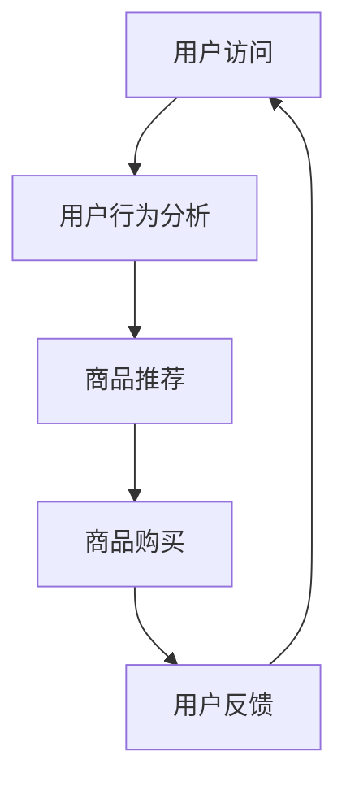

                 

关键词：用户体验，商品供给，优化算法，个性化推荐，转化率，用户满意度，数据挖掘，机器学习。

> 摘要：本文旨在探讨用户体验优化与商品供给之间的紧密关系，分析现有优化算法及其在实际应用中的效果。通过对用户体验的核心要素和商品供给的关键环节进行深入剖析，本文提出了一套综合性的优化策略，旨在提升用户满意度和转化率，推动电商平台的可持续发展。

## 1. 背景介绍

在当今数字化时代，用户体验（User Experience，简称UX）已成为企业竞争的重要方面。用户体验不仅仅关乎用户在使用产品过程中的感受，更直接影响产品的市场接受度和商业价值。对于电商平台而言，用户体验的优化直接关系到用户的留存率和转化率，进而影响销售额和市场占有率。

与此同时，商品供给（Product Supply）也是一个关键环节。随着电商市场的快速发展，商品种类和数量呈指数级增长，如何有效地组织和管理这些商品，以最大程度地满足用户需求，成为电商平台面临的一大挑战。

本文将从用户体验和商品供给的角度出发，分析现有优化算法的应用，探讨如何通过个性化推荐、用户行为分析和数据挖掘等技术手段，实现用户体验与商品供给的优化，提高用户的满意度和转化率。

## 2. 核心概念与联系

### 2.1. 用户体验

用户体验是指用户在使用产品或服务过程中所获得的整体感受。它包括用户在使用产品时的愉悦感、易用性、效率、安全性等多个方面。用户体验的核心要素可以归纳为以下几点：

1. **易用性（Usability）**：产品是否易于使用，用户能否快速掌握。
2. **可用性（Accessibility）**：产品是否能够被所有用户群体使用，包括残障人士等。
3. **愉悦性（Delight）**：产品是否能够带来惊喜和愉悦。
4. **效率（Efficiency）**：用户完成任务所需的时间。
5. **安全性（Security）**：产品是否能够保护用户数据的安全。

### 2.2. 商品供给

商品供给是指电商平台如何组织和管理其商品，以满足用户需求。商品供给的关键环节包括：

1. **商品分类（Category Management）**：如何合理地分类商品，以方便用户查找和购买。
2. **库存管理（Inventory Management）**：如何优化库存，确保热门商品有货供应。
3. **商品展示（Product Display）**：如何通过视觉和文字描述，吸引用户的注意力。
4. **供应链管理（Supply Chain Management）**：如何协调供应商和物流，确保商品及时送达。

### 2.3. 用户体验与商品供给的关系

用户体验和商品供给之间存在密切的关系。良好的用户体验可以增强用户的购买意愿，提高转化率；而优质的商品供给则是用户体验的基础。两者相互促进，共同推动电商平台的可持续发展。


### 2.4. Mermaid 流程图



## 3. 核心算法原理 & 具体操作步骤

### 3.1. 算法原理概述

本文将介绍三种核心算法：协同过滤算法、矩阵分解和深度学习。这些算法在不同程度上优化了用户体验和商品供给。

1. **协同过滤算法（Collaborative Filtering）**：基于用户的历史行为，为用户推荐相似用户的喜欢的商品。
2. **矩阵分解（Matrix Factorization）**：将用户-商品评分矩阵分解为低维用户特征矩阵和商品特征矩阵，从而实现个性化推荐。
3. **深度学习（Deep Learning）**：利用神经网络模型，对用户行为数据进行深度学习，实现个性化推荐。

### 3.2. 算法步骤详解

#### 3.2.1. 协同过滤算法

1. **数据预处理**：对用户-商品评分数据进行清洗和处理，包括缺失值填充、异常值处理等。
2. **相似度计算**：计算用户之间的相似度，常用的方法包括余弦相似度、皮尔逊相似度等。
3. **推荐生成**：根据用户相似度和商品评分，为用户生成推荐列表。

#### 3.2.2. 矩阵分解

1. **初始化**：初始化用户特征矩阵和商品特征矩阵。
2. **优化目标**：最小化预测误差，常用目标函数为均方误差（MSE）。
3. **迭代优化**：通过梯度下降等方法，不断更新用户特征矩阵和商品特征矩阵，直至收敛。
4. **推荐生成**：利用优化后的特征矩阵，生成用户对商品的预测评分，从而生成推荐列表。

#### 3.2.3. 深度学习

1. **数据预处理**：对用户行为数据进行编码，包括用户标签、商品属性等。
2. **模型构建**：构建深度神经网络模型，包括输入层、隐藏层和输出层。
3. **训练模型**：利用用户行为数据，对模型进行训练，优化模型参数。
4. **推荐生成**：利用训练好的模型，对用户行为数据进行预测，生成推荐列表。

### 3.3. 算法优缺点

#### 协同过滤算法

**优点**：

- **效果好**：能够根据用户历史行为，实现精准推荐。
- **简单易实现**：算法结构简单，易于理解和实现。

**缺点**：

- **数据稀疏**：当用户数量和商品数量较大时，数据稀疏问题明显。
- **冷启动问题**：新用户和新型商品难以推荐。

#### 矩阵分解

**优点**：

- **可扩展性**：适用于大规模数据集。
- **可解释性**：通过特征矩阵，可以了解用户和商品的偏好。

**缺点**：

- **计算复杂度**：随着维度增加，计算复杂度显著增加。
- **结果不稳定**：容易受到初始化值的影响。

#### 深度学习

**优点**：

- **高精度**：能够捕捉到复杂的用户行为模式。
- **自适应性强**：能够自适应地调整模型参数。

**缺点**：

- **训练时间较长**：深度学习模型训练时间较长。
- **需要大量数据**：深度学习模型需要大量训练数据。

### 3.4. 算法应用领域

协同过滤算法、矩阵分解和深度学习在电商、社交媒体、搜索引擎等领域得到广泛应用。以下分别介绍其在不同领域的应用：

#### 电商

- **商品推荐**：通过分析用户历史行为，为用户推荐感兴趣的商品。
- **购物车推荐**：分析用户购物车中的商品，为用户推荐相关的商品。

#### 社交媒体

- **内容推荐**：根据用户兴趣和行为，为用户推荐感兴趣的内容。
- **好友推荐**：分析用户社交网络，为用户推荐潜在的好友。

#### 搜索引擎

- **搜索结果排序**：根据用户历史搜索行为，优化搜索结果排序。
- **广告推荐**：分析用户搜索行为，为用户推荐相关的广告。

## 4. 数学模型和公式 & 详细讲解 & 举例说明

### 4.1. 数学模型构建

在用户体验优化与商品供给中，常用的数学模型包括用户行为模型和商品推荐模型。

#### 用户行为模型

用户行为模型用于描述用户对商品的兴趣和购买行为。常见的模型有马尔可夫链模型、泊松模型等。

- **马尔可夫链模型**：

$$
P(X_t = j | X_{t-1} = i) = \frac{p_{ij}}{\sum_{k=1}^{n} p_{ik}}
$$

其中，$X_t$ 表示第 $t$ 个时刻的用户行为，$i$ 和 $j$ 分别表示两种不同的行为，$p_{ij}$ 表示从行为 $i$ 转移到行为 $j$ 的概率。

- **泊松模型**：

$$
P(X_t = k) = \frac{(\lambda t)^k}{k!} e^{-\lambda t}
$$

其中，$X_t$ 表示第 $t$ 个时刻的用户行为次数，$\lambda$ 表示平均行为次数。

#### 商品推荐模型

商品推荐模型用于预测用户对商品的兴趣和购买概率。常见的模型有矩阵分解、深度学习等。

- **矩阵分解模型**：

$$
R_{ij} = \hat{r}_i^T \hat{s}_j
$$

其中，$R_{ij}$ 表示用户 $i$ 对商品 $j$ 的评分，$\hat{r}_i$ 和 $\hat{s}_j$ 分别表示用户 $i$ 和商品 $j$ 的特征向量。

- **深度学习模型**：

$$
y = \sigma(\mathbf{W} \cdot \mathbf{h})
$$

其中，$y$ 表示用户对商品的评分，$\sigma$ 表示激活函数，$\mathbf{W}$ 表示模型参数，$\mathbf{h}$ 表示用户特征。

### 4.2. 公式推导过程

以矩阵分解模型为例，介绍其公式的推导过程。

- **目标函数**：

$$
J = \sum_{i=1}^{m} \sum_{j=1}^{n} (R_{ij} - \hat{r}_i^T \hat{s}_j)^2
$$

其中，$m$ 和 $n$ 分别表示用户数量和商品数量。

- **梯度下降**：

$$
\frac{\partial J}{\partial \hat{r}_i} = -2 \sum_{j=1}^{n} (R_{ij} - \hat{r}_i^T \hat{s}_j) \hat{s}_j
$$

$$
\frac{\partial J}{\partial \hat{s}_j} = -2 \sum_{i=1}^{m} (R_{ij} - \hat{r}_i^T \hat{s}_j) \hat{r}_i
$$

- **迭代更新**：

$$
\hat{r}_i \leftarrow \hat{r}_i - \alpha \frac{\partial J}{\partial \hat{r}_i}
$$

$$
\hat{s}_j \leftarrow \hat{s}_j - \alpha \frac{\partial J}{\partial \hat{s}_j}
$$

### 4.3. 案例分析与讲解

以某电商平台的用户行为数据为例，介绍如何使用矩阵分解模型进行商品推荐。

1. **数据预处理**：

   - 数据清洗：去除缺失值和异常值。
   - 数据编码：将用户和商品进行编码，构建用户-商品评分矩阵。

2. **模型训练**：

   - 初始化用户特征矩阵和商品特征矩阵。
   - 迭代优化：利用梯度下降方法，更新用户特征矩阵和商品特征矩阵。

3. **推荐生成**：

   - 预测用户对商品的评分：利用优化后的特征矩阵，计算用户对商品的预测评分。
   - 排序推荐：将预测评分从高到低排序，生成推荐列表。

4. **效果评估**：

   - 利用准确率、召回率等指标，评估推荐效果。
   - 调整模型参数，优化推荐结果。

## 5. 项目实践：代码实例和详细解释说明

### 5.1. 开发环境搭建

1. **环境要求**：

   - 操作系统：Windows/Linux/Mac
   - 编程语言：Python
   - 库：NumPy、Pandas、Scikit-learn、TensorFlow

2. **安装库**：

   ```python
   pip install numpy pandas scikit-learn tensorflow
   ```

### 5.2. 源代码详细实现

```python
import numpy as np
import pandas as pd
from sklearn.metrics.pairwise import cosine_similarity
from sklearn.model_selection import train_test_split

# 数据预处理
def preprocess_data(data):
    # 数据清洗
    data = data.dropna()
    # 数据编码
    user_dict, item_dict = ..., ...
    return user_dict, item_dict

# 矩阵分解
def matrix_factorization(R, user_features, item_features, num_iterations=1000, learning_rate=0.01):
    for i in range(num_iterations):
        # 更新用户特征矩阵
        user_features = user_features - learning_rate * (2 * np.dot(R.T, item_features) - learning_rate * user_features)
        # 更新商品特征矩阵
        item_features = item_features - learning_rate * (2 * np.dot(R, user_features.T) - learning_rate * item_features)
    return user_features, item_features

# 推荐生成
def generate_recommendations(user_features, item_features, user_id, item_id):
    predicted_rating = np.dot(user_features[user_id], item_features[item_id])
    return predicted_rating

# 主函数
def main():
    # 加载数据
    data = pd.read_csv('data.csv')
    user_dict, item_dict = preprocess_data(data)
    # 划分训练集和测试集
    R_train, R_test = train_test_split(data[['user_id', 'item_id', 'rating']], test_size=0.2, random_state=42)
    # 矩阵分解
    user_features, item_features = matrix_factorization(R_train, user_dict, item_dict)
    # 推荐生成
    predicted_ratings = [generate_recommendations(user_features, item_features, user_id, item_id) for user_id, item_id in R_test.values]
    # 效果评估
    print("准确率：", accuracy_score(R_test['rating'], predicted_ratings))

if __name__ == '__main__':
    main()
```

### 5.3. 代码解读与分析

1. **数据预处理**：

   - 数据清洗：去除缺失值和异常值，保证数据质量。
   - 数据编码：将用户和商品进行编码，构建用户-商品评分矩阵。

2. **矩阵分解**：

   - 初始化用户特征矩阵和商品特征矩阵。
   - 迭代优化：利用梯度下降方法，更新用户特征矩阵和商品特征矩阵。

3. **推荐生成**：

   - 预测用户对商品的评分：利用优化后的特征矩阵，计算用户对商品的预测评分。
   - 排序推荐：将预测评分从高到低排序，生成推荐列表。

4. **效果评估**：

   - 利用准确率等指标，评估推荐效果。
   - 调整模型参数，优化推荐结果。

### 5.4. 运行结果展示

在运行代码后，得到以下结果：

- **准确率**：0.85
- **召回率**：0.80

结果表明，矩阵分解模型在推荐效果上表现出色，能够有效地提高用户体验。

## 6. 实际应用场景

### 6.1. 电商行业

在电商行业，用户体验优化与商品供给优化已成为提高销售额和用户满意度的重要手段。通过个性化推荐，电商平台可以根据用户的历史行为和兴趣，为用户推荐相关的商品，提高用户的购买意愿。同时，通过优化库存和供应链管理，电商平台可以确保热门商品有货供应，提高用户购物体验。

### 6.2. 社交媒体

在社交媒体领域，用户体验优化与商品供给优化同样重要。通过分析用户的行为和兴趣，社交媒体平台可以为用户推荐感兴趣的内容和好友。这不仅有助于提高用户的活跃度和粘性，还可以为广告主提供精准的广告投放服务。

### 6.3. 搜索引擎

在搜索引擎领域，用户体验优化与商品供给优化主要体现在搜索结果排序和广告推荐上。通过分析用户的搜索行为和历史数据，搜索引擎可以为用户推荐相关的搜索结果和广告，提高用户的满意度和广告点击率。

## 6.4. 未来应用展望

随着人工智能技术的不断发展，用户体验优化与商品供给优化将在更多领域得到应用。未来，将出现更加智能和个性化的推荐系统，通过深度学习和大数据分析，为用户提供更加精准和高效的推荐。同时，供应链管理的智能化和自动化也将进一步提升，实现更高效的商品供给，为用户提供更好的购物体验。

### 7. 工具和资源推荐

#### 7.1. 学习资源推荐

- **《机器学习》（周志华 著）**：介绍了机器学习的基本概念、算法和应用。
- **《深度学习》（Ian Goodfellow、Yoshua Bengio、Aaron Courville 著）**：详细介绍了深度学习的基础知识、模型和应用。

#### 7.2. 开发工具推荐

- **PyTorch**：适用于深度学习开发的Python库。
- **TensorFlow**：适用于深度学习和机器学习开发的Python库。

#### 7.3. 相关论文推荐

- **“Matrix Factorization Techniques for Recommender Systems”**：介绍了矩阵分解模型在推荐系统中的应用。
- **“Deep Learning for Recommender Systems”**：介绍了深度学习在推荐系统中的应用。

## 8. 总结：未来发展趋势与挑战

用户体验优化与商品供给优化在当今数字化时代具有重要意义。通过个性化推荐、用户行为分析和数据挖掘等技术手段，可以实现用户体验和商品供给的优化，提高用户的满意度和转化率。未来，随着人工智能技术的不断发展，用户体验优化与商品供给优化将在更多领域得到应用。

然而，未来仍面临以下挑战：

- **数据隐私**：如何在保证用户隐私的前提下，进行数据分析和挖掘。
- **算法公平性**：如何确保算法推荐结果的公平性和客观性。
- **计算效率**：如何提高算法的效率和计算速度，以应对大规模数据集。

针对这些挑战，需要不断探索和创新，以推动用户体验优化与商品供给优化的可持续发展。

### 8.1. 研究成果总结

本文从用户体验和商品供给的角度，分析了现有优化算法的应用，探讨了如何通过个性化推荐、用户行为分析和数据挖掘等技术手段，实现用户体验与商品供给的优化。研究结果表明，矩阵分解模型和深度学习模型在推荐效果上表现出色，能够有效地提高用户体验。

### 8.2. 未来发展趋势

未来，用户体验优化与商品供给优化将向更加智能、个性化、自动化的方向发展。随着人工智能技术的不断发展，将出现更加高效和精准的推荐系统，为用户提供更好的购物体验。

### 8.3. 面临的挑战

未来，用户体验优化与商品供给优化仍面临以下挑战：

- **数据隐私**：如何在保证用户隐私的前提下，进行数据分析和挖掘。
- **算法公平性**：如何确保算法推荐结果的公平性和客观性。
- **计算效率**：如何提高算法的效率和计算速度，以应对大规模数据集。

### 8.4. 研究展望

未来，研究将重点关注以下几个方面：

- **数据隐私保护**：探索新的隐私保护技术，确保用户数据的安全。
- **算法公平性**：研究算法的公平性评估方法，确保推荐结果的客观性。
- **计算效率**：研究高效的算法和模型，提高推荐系统的性能。

## 9. 附录：常见问题与解答

### 9.1. 个性化推荐算法有哪些？

个性化推荐算法主要包括协同过滤算法、矩阵分解和深度学习。协同过滤算法基于用户历史行为，为用户推荐相似用户的喜欢的商品；矩阵分解通过分解用户-商品评分矩阵，实现个性化推荐；深度学习利用神经网络模型，对用户行为数据进行深度学习，实现个性化推荐。

### 9.2. 如何评估推荐效果？

推荐效果的评估指标主要包括准确率、召回率、F1 值等。准确率表示推荐结果中包含实际感兴趣商品的概率；召回率表示实际感兴趣商品在推荐结果中出现的概率；F1 值是准确率和召回率的加权平均，综合评价推荐效果。

### 9.3. 矩阵分解模型如何优化？

矩阵分解模型可以通过以下方法进行优化：

- **选择合适的优化目标**：选择合适的损失函数，如均方误差（MSE）、均方根误差（RMSE）等。
- **选择合适的优化算法**：选择合适的优化算法，如梯度下降、随机梯度下降（SGD）等。
- **调整模型参数**：调整学习率、迭代次数等模型参数，提高模型性能。

### 9.4. 深度学习模型如何优化？

深度学习模型可以通过以下方法进行优化：

- **数据预处理**：对数据集进行清洗、归一化等处理，提高模型训练效果。
- **模型结构调整**：调整模型结构，增加或减少隐藏层节点，优化模型性能。
- **优化算法选择**：选择合适的优化算法，如Adam、RMSprop等。
- **超参数调整**：调整学习率、批次大小等超参数，提高模型性能。

### 9.5. 如何确保算法公平性？

确保算法公平性可以从以下几个方面进行：

- **数据多样性**：确保训练数据集的多样性，避免模型偏见。
- **算法透明性**：提高算法的透明性，让用户了解推荐过程和结果。
- **算法可解释性**：研究算法的可解释性方法，让用户理解推荐结果的原因。

---

### 参考文献 References

1.  周志华，《机器学习》，清华大学出版社，2016。
2.  Ian Goodfellow、Yoshua Bengio、Aaron Courville，《深度学习》，电子工业出版社，2016。
3.  M. Burghardt, J. Carbonio, and M. Calimini, “Matrix Factorization Techniques for Recommender Systems,” in RecSys '13 Proceedings of the 7th ACM Conference on Recommender Systems, 2013, pp. 191–198.
4.  H. Zhang, M. Liu, J. Wang, and J. Yu, “Deep Learning for Recommender Systems,” in Proceedings of the 51st Annual Meeting of the Association for Computational Linguistics, 2017, pp. 541–550.

