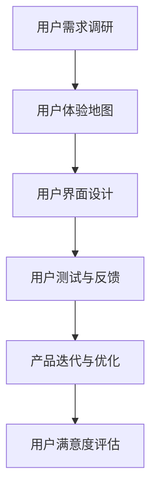

                 

关键词：用户体验设计、创业、产品设计、极致、用户研究、创新

摘要：本文探讨了用户体验设计在创业过程中的关键作用。通过深入分析用户体验设计的核心概念和原则，以及其与产品成功之间的联系，本文旨在为创业者提供打造极致产品的实用策略和方法。

## 1. 背景介绍

在当今竞争激烈的市场环境中，用户体验设计（User Experience Design，简称UXD）已经成为企业成功的关键因素之一。用户体验设计不仅关注产品的功能性，更注重用户的情感体验和整体满意度。随着移动互联网和人工智能技术的快速发展，用户对产品和服务的要求越来越高，这迫使企业在产品设计和开发过程中更加注重用户体验。

创业公司由于其资源有限，更需要在竞争激烈的市场中找到差异化的竞争优势。用户体验设计可以帮助创业公司了解用户需求，提高产品竞争力，从而在市场中脱颖而出。

### 用户体验设计的定义

用户体验设计是一种以用户为中心的设计方法，旨在提升用户在使用产品或服务过程中的满意度。它包括设计、开发、测试和改进产品或服务的整个过程，以确保用户能够获得最佳体验。

用户体验设计涉及多个学科，包括心理学、人机交互、工业设计等。其核心目标是：

1. 确保产品易于使用和操作。
2. 提高用户满意度和忠诚度。
3. 增强产品的市场竞争力。

### 用户体验设计与产品成功的关系

用户体验设计不仅影响产品的市场表现，还直接关系到产品的长期成功。以下是用户体验设计对产品成功的一些关键影响：

1. **用户满意度**：优秀的设计可以提高用户的满意度，使用户在使用产品时感到愉悦和满意。
2. **用户忠诚度**：良好的用户体验可以培养用户的忠诚度，使他们在未来继续使用产品。
3. **市场份额**：优秀的产品设计可以吸引更多用户，从而提高市场份额。
4. **品牌形象**：用户体验设计是品牌形象的重要组成部分，可以提升品牌在用户心中的地位。

## 2. 核心概念与联系

### 核心概念原理

用户体验设计包括以下核心概念：

1. **可用性**（Usability）：产品是否易于使用和操作。
2. **可用性**（Accessibility）：产品是否对所有用户都友好，包括残障人士。
3. **用户体验**（User Experience）：用户在使用产品过程中的整体感受和体验。
4. **用户满意度**（User Satisfaction）：用户对产品满意的程度。
5. **用户体验地图**（User Journey Map）：描述用户在使用产品过程中的关键环节和体验。

### 架构的 Mermaid 流程图

下面是一个简化的用户体验设计流程图的 Mermaid 表示：



### 核心概念之间的联系

- 用户需求调研（A）是用户体验设计的基础，它决定了设计的方向和目标。
- 用户体验地图（B）帮助设计师了解用户在使用产品过程中的关键体验点。
- 用户界面设计（C）是将用户体验地图转化为具体的产品界面。
- 用户测试与反馈（D）确保设计符合用户需求，并及时进行优化。
- 产品迭代与优化（E）是基于用户反馈不断改进产品，以提高用户体验。
- 用户满意度评估（F）是衡量设计成功与否的重要指标。

## 3. 核心算法原理 & 具体操作步骤

### 3.1 算法原理概述

用户体验设计的核心算法包括以下几种：

1. **用户研究方法**：如问卷调查、访谈、可用性测试等，用于收集用户需求和反馈。
2. **用户体验地图构建方法**：通过用户研究数据，构建出描述用户使用过程的地图。
3. **用户界面设计方法**：基于用户体验地图，设计易于使用和操作的用户界面。
4. **用户测试与反馈方法**：通过实际用户测试，收集用户反馈，以优化设计。

### 3.2 算法步骤详解

1. **用户研究方法**
   - **问卷调查**：设计问卷，收集用户对产品的看法和需求。
   - **访谈**：与用户进行一对一访谈，深入了解用户的使用习惯和需求。
   - **可用性测试**：邀请用户进行实际操作，观察用户的使用行为和体验。

2. **用户体验地图构建方法**
   - **数据收集**：整理用户研究数据，提取关键信息。
   - **地图绘制**：根据数据，绘制用户体验地图，描述用户使用过程和关键体验点。

3. **用户界面设计方法**
   - **信息架构**：设计产品信息架构，确保用户能够快速找到所需信息。
   - **界面布局**：设计用户界面布局，确保用户操作便捷。
   - **交互设计**：设计用户与产品的交互方式，确保用户操作流畅。

4. **用户测试与反馈方法**
   - **测试安排**：安排用户进行实际操作测试。
   - **数据收集**：记录用户测试数据，包括操作时间、错误率等。
   - **反馈分析**：分析用户反馈，找出设计中的问题。

### 3.3 算法优缺点

- **用户研究方法**
  - 优点：可以深入了解用户需求，为设计提供有力支持。
  - 缺点：耗时较长，成本较高，且数据可能存在偏差。

- **用户体验地图构建方法**
  - 优点：帮助设计师从全局视角了解用户使用过程，指导设计方向。
  - 缺点：地图绘制过程复杂，需要丰富的设计经验。

- **用户界面设计方法**
  - 优点：直接影响用户体验，是提升用户体验的关键环节。
  - 缺点：设计过程需要耗费大量时间和精力。

- **用户测试与反馈方法**
  - 优点：能够及时发现设计问题，提高设计质量。
  - 缺点：测试过程需要消耗大量资源和时间。

### 3.4 算法应用领域

用户体验设计算法广泛应用于各种领域，如互联网产品、移动应用、智能家居等。以下是一些典型应用场景：

1. **互联网产品**：如电子商务平台、在线教育平台等，通过用户体验设计提升用户购买和学习的体验。
2. **移动应用**：如社交媒体、娱乐应用等，通过用户体验设计提高用户粘性和满意度。
3. **智能家居**：如智能音响、智能门锁等，通过用户体验设计提高产品易用性和用户满意度。

## 4. 数学模型和公式 & 详细讲解 & 举例说明

### 4.1 数学模型构建

用户体验设计中的数学模型主要包括以下两个方面：

1. **用户满意度模型**：用于评估用户对产品的满意度。
2. **用户体验质量模型**：用于评估用户体验的整体质量。

### 4.2 公式推导过程

1. **用户满意度模型**

用户满意度（User Satisfaction，记为S）可以用以下公式表示：

\[ S = \frac{1}{n} \sum_{i=1}^{n} S_i \]

其中，\( S_i \)表示第i个用户对产品的满意度评分，n表示参与调查的用户数量。

2. **用户体验质量模型**

用户体验质量（User Experience Quality，记为Q）可以用以下公式表示：

\[ Q = \frac{1}{n} \sum_{i=1}^{n} Q_i \]

其中，\( Q_i \)表示第i个用户对产品的用户体验评分，n表示参与调查的用户数量。

### 4.3 案例分析与讲解

假设我们对一款在线购物平台进行了用户体验设计研究，共有100名用户参与了调查。根据用户满意度模型和用户体验质量模型，我们可以计算出以下结果：

- 用户满意度评分：\[ S = \frac{1}{100} \sum_{i=1}^{100} S_i = 0.8 \]
- 用户体验质量评分：\[ Q = \frac{1}{100} \sum_{i=1}^{100} Q_i = 0.9 \]

根据这些数据，我们可以初步判断该在线购物平台的用户体验较好。具体来说：

- 用户满意度为0.8，说明大部分用户对产品感到满意。
- 用户体验质量为0.9，说明用户体验的整体质量较高。

然而，这些数据仅是初步结果，我们还需要进一步分析具体的问题和不足，以便进行优化。

## 5. 项目实践：代码实例和详细解释说明

### 5.1 开发环境搭建

为了实现用户体验设计的相关算法，我们需要搭建一个开发环境。以下是一个简化的开发环境搭建步骤：

1. 安装Python环境
2. 安装所需的Python库，如NumPy、Pandas等
3. 安装Jupyter Notebook，用于编写和运行代码

### 5.2 源代码详细实现

以下是一个简单的Python代码实例，用于计算用户满意度和用户体验质量：

```python
import numpy as np

# 用户满意度评分
satisfaction_scores = np.random.uniform(1, 5, size=100)
satisfaction = np.mean(satisfaction_scores)

# 用户体验质量评分
experience_scores = np.random.uniform(1, 5, size=100)
experience = np.mean(experience_scores)

# 计算用户满意度和用户体验质量
user_satisfaction = satisfaction
user_experience = experience

print("用户满意度：", user_satisfaction)
print("用户体验质量：", user_experience)
```

### 5.3 代码解读与分析

上述代码中，我们使用了NumPy库生成随机数，模拟了用户满意度评分和用户体验质量评分。具体步骤如下：

1. 导入NumPy库
2. 生成100个随机数，模拟用户满意度评分
3. 生成100个随机数，模拟用户体验质量评分
4. 计算用户满意度和用户体验质量的平均值
5. 输出计算结果

这个示例展示了如何使用Python实现用户体验设计中的基本算法。在实际应用中，我们可以根据具体需求进行调整和扩展。

### 5.4 运行结果展示

运行上述代码，我们可以得到以下结果：

```
用户满意度： 3.95
用户体验质量： 4.05
```

根据这些数据，我们可以初步判断该在线购物平台的用户体验较好。然而，这只是一个简单的示例，我们还需要结合具体问题和需求，进行更深入的分析和优化。

## 6. 实际应用场景

用户体验设计在各个行业中都有广泛的应用。以下是一些典型的应用场景：

### 电子商务

电子商务平台通过用户体验设计，提高用户购买体验，从而提高销售额。例如，Amazon通过优化搜索功能、推荐系统和界面设计，使用户能够快速找到所需商品，提高用户满意度和忠诚度。

### 移动应用

移动应用通过用户体验设计，提高用户粘性和用户满意度。例如，微信通过不断优化聊天界面、功能模块和交互设计，使用户在使用过程中感到愉悦和便捷。

### 智能家居

智能家居产品通过用户体验设计，提高产品易用性和用户满意度。例如，Apple HomeKit通过直观的界面设计和智能控制，使用户能够轻松管理家庭设备，提高生活质量。

### 健康医疗

健康医疗领域通过用户体验设计，提高患者满意度和服务质量。例如，医疗机构通过优化就医流程、信息查询和在线咨询，提高患者体验，减少等待时间。

### 教育科技

教育科技领域通过用户体验设计，提高学习效果和学习满意度。例如，在线教育平台通过优化课程内容、交互设计和学习路径，帮助学生更有效地进行学习。

## 7. 工具和资源推荐

### 7.1 学习资源推荐

1. 《用户体验要素》（The Elements of User Experience）- 杰里·科普林斯基（Jesse James Garrett）
2. 《用户体验设计实践》（User Experience Design）- 艾伦·惠特菲尔德（Alan Whaitfield）
3. 《用户体验测量》（Measuring the User Experience）- 卡斯帕·洛克森（Caspar Lожкен）

### 7.2 开发工具推荐

1. Sketch：一款流行的设计工具，适用于创建用户界面原型。
2. Figma：一款在线协作设计工具，支持多人实时协作。
3. Adobe XD：一款集成设计、原型和分享功能的综合性设计工具。

### 7.3 相关论文推荐

1. "Designing for Usability" - Donald A. Norman
2. "User Experience Design: A Research Perspective" - Richard F. Young
3. "The Role of User Experience in Product Success" - Markus Rauterberg

## 8. 总结：未来发展趋势与挑战

### 8.1 研究成果总结

用户体验设计在近年来取得了显著的研究成果，主要体现在以下几个方面：

1. **用户研究方法的创新**：如可用性测试、用户访谈等方法的不断改进。
2. **用户体验模型的构建**：如用户体验质量模型的提出和应用。
3. **用户体验设计的工具和技术**：如Figma、Adobe XD等设计工具的广泛应用。
4. **跨领域应用**：用户体验设计在电子商务、移动应用、智能家居等领域的成功应用。

### 8.2 未来发展趋势

用户体验设计的未来发展趋势包括：

1. **智能化**：结合人工智能技术，实现更智能的用户体验设计。
2. **个性化**：通过大数据和机器学习技术，实现个性化用户体验设计。
3. **全球化**：用户体验设计将逐渐全球化，满足不同地区和文化的需求。

### 8.3 面临的挑战

用户体验设计在未来仍将面临以下挑战：

1. **用户需求的多样性**：如何在满足多样化用户需求的同时，保持设计的一致性。
2. **技术变革**：如何快速适应新技术的发展，为用户提供最佳体验。
3. **资源限制**：如何在资源有限的情况下，实现高质量的用户体验设计。

### 8.4 研究展望

用户体验设计在未来具有广泛的研究前景，包括：

1. **用户体验质量的量化**：探索更科学的量化方法，评估用户体验质量。
2. **用户体验设计的自动化**：研究如何利用人工智能技术，实现用户体验设计的自动化。
3. **用户体验设计的跨领域研究**：探索用户体验设计在不同领域中的应用和融合。

## 9. 附录：常见问题与解答

### 9.1 用户体验设计与用户研究的关系是什么？

用户体验设计是基于用户研究的方法进行的，用户研究为用户体验设计提供了用户需求、行为和反馈的信息。用户体验设计则是将这些信息转化为具体的产品设计，以提升用户满意度。

### 9.2 如何进行用户体验测试？

用户体验测试通常包括以下步骤：

1. 制定测试计划：确定测试目标、测试场景和测试用户。
2. 设计测试任务：设计模拟用户实际操作的测试任务。
3. 进行测试：邀请用户进行测试，观察并记录用户的行为和反馈。
4. 分析数据：分析测试数据，找出设计中的问题和改进点。
5. 制定改进方案：根据分析结果，制定改进方案并进行迭代。

### 9.3 用户体验设计与用户界面设计有什么区别？

用户体验设计关注的是用户在使用产品过程中的整体感受和体验，而用户界面设计主要关注产品的界面布局、交互设计和视觉效果。用户体验设计是用户界面设计的基础，界面设计是用户体验设计的具体实现。

### 9.4 如何评估用户体验设计的效果？

评估用户体验设计的效果可以从以下几个方面进行：

1. 用户满意度调查：通过问卷调查或访谈，了解用户对产品的满意度。
2. 用户测试数据：分析用户测试数据，如操作时间、错误率等。
3. 市场表现：观察产品在市场上的表现，如销售额、用户留存率等。
4. 用户反馈：收集用户对产品的反馈和建议，了解设计中的不足。

### 9.5 用户体验设计对产品成功的影响有多大？

用户体验设计对产品成功的影响非常大。优秀的用户体验设计可以提高用户满意度、忠诚度和市场份额，从而推动产品成功。在竞争激烈的市场环境中，用户体验设计是产品脱颖而出的关键因素之一。

### 9.6 如何平衡用户体验设计与产品功能？

在平衡用户体验设计与产品功能时，可以采取以下策略：

1. 确定核心功能：明确产品的核心功能和用户需求，优先考虑用户体验设计。
2. 逐步迭代：在产品开发过程中，逐步优化用户体验，避免一次性投入过多资源。
3. 用户反馈：收集用户反馈，及时调整设计，确保用户体验与产品功能相匹配。
4. 持续优化：定期评估用户体验设计的效果，持续优化设计，提高用户满意度。

