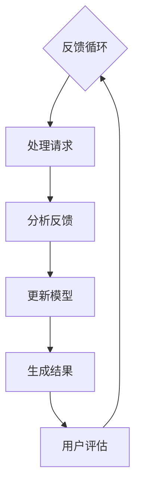

                 

在当今数字时代，用户反馈驱动的AI搜索优化已成为搜索引擎、推荐系统和智能助理等关键应用领域的重要组成部分。本文将深入探讨用户反馈驱动的AI搜索优化的核心概念、算法原理、数学模型、应用实例以及未来展望。

## 文章关键词
- 用户反馈
- AI搜索优化
- 深度学习
- 数据挖掘
- 用户体验

## 摘要
本文旨在详细阐述用户反馈驱动的AI搜索优化技术，从核心概念、算法原理、数学模型、实践案例到未来展望，全面剖析这一领域的现状与前景。通过本文的阅读，读者将深入了解如何利用用户反馈来提升AI搜索系统的性能和用户体验。

## 1. 背景介绍
### 1.1 搜索引擎的发展历程
搜索引擎自诞生以来，经历了从基于关键词匹配的初阶搜索到利用复杂算法和用户行为数据的智能搜索的演变。早期的搜索引擎主要依赖于关键词匹配和静态的排名算法，如PageRank。随着互联网内容的爆炸性增长和用户需求的不断变化，传统搜索方法逐渐暴露出其局限性。

### 1.2 AI与搜索优化的结合
近年来，人工智能（AI）技术的发展为搜索优化带来了新的契机。AI技术，尤其是机器学习和深度学习，通过分析和理解用户行为数据，能够动态调整搜索结果，提供个性化的搜索体验。用户反馈驱动的AI搜索优化正是在这样的背景下诞生的。

### 1.3 用户反馈的重要性
用户反馈是搜索优化的重要依据。用户的行为数据、搜索历史、点击率、满意度评分等，都是对搜索系统性能的实时评估。通过分析这些反馈，AI系统能够不断调整和优化，提高搜索的准确性和用户体验。

## 2. 核心概念与联系

### 2.1 用户反馈的概念
用户反馈是指用户在使用搜索引擎或推荐系统时提供的直接或间接意见。这包括用户的点击行为、搜索历史、点赞、评论等。这些反馈可以用来衡量搜索系统的表现，并指导进一步的优化。

### 2.2 搜索优化的概念
搜索优化是指通过改进算法和模型，提高搜索结果的准确性和相关性。这包括关键词匹配、语义理解、排序算法等多个方面。用户反馈驱动的搜索优化强调利用用户的实际使用数据来指导优化过程。

### 2.3 Mermaid 流程图


## 3. 核心算法原理 & 具体操作步骤

### 3.1 算法原理概述
用户反馈驱动的AI搜索优化主要依赖于以下几个核心算法原理：
- **协同过滤（Collaborative Filtering）**：通过分析用户的行为模式，预测用户可能感兴趣的内容。
- **深度学习（Deep Learning）**：利用神经网络模型，从大量用户数据中学习，提高搜索结果的准确性。
- **强化学习（Reinforcement Learning）**：通过与用户互动，学习最优的搜索策略。

### 3.2 算法步骤详解

#### 3.2.1 数据收集
- **用户行为数据**：收集用户的搜索历史、点击记录、浏览时间等。
- **搜索查询数据**：获取用户的查询内容、关键词等。

#### 3.2.2 数据预处理
- **数据清洗**：去除噪音数据、填充缺失值等。
- **特征提取**：从原始数据中提取有意义的特征，如用户兴趣、内容主题等。

#### 3.2.3 模型训练
- **协同过滤模型**：基于用户行为数据，训练协同过滤模型。
- **深度学习模型**：利用深度学习模型，如BERT、Transformer等，进行训练。

#### 3.2.4 搜索结果生成
- **结果排序**：根据训练好的模型，对搜索结果进行排序。
- **结果展示**：将优化后的搜索结果展示给用户。

### 3.3 算法优缺点

#### 优点
- **个性化**：通过用户反馈，提供更个性化的搜索结果。
- **自适应**：系统能够根据用户反馈不断调整和优化。

#### 缺点
- **数据隐私**：用户行为数据可能涉及隐私问题。
- **计算成本**：大规模数据分析和模型训练需要较高的计算资源。

### 3.4 算法应用领域
- **搜索引擎**：如Google、Bing等。
- **推荐系统**：如Amazon、Netflix等。
- **智能助理**：如Apple Siri、Amazon Alexa等。

## 4. 数学模型和公式 & 详细讲解 & 举例说明

### 4.1 数学模型构建

#### 4.1.1 协同过滤模型
- **用户-物品评分矩阵**：\( R \in \mathbb{R}^{m \times n} \)，其中\( m \)是用户数，\( n \)是物品数。
- **用户兴趣向量**：\( u_i \in \mathbb{R}^n \)。
- **物品特征向量**：\( v_j \in \mathbb{R}^n \)。

#### 4.1.2 深度学习模型
- **输入层**：用户的查询和物品的特征。
- **隐藏层**：通过神经网络进行特征提取。
- **输出层**：预测用户对物品的评分。

### 4.2 公式推导过程

#### 4.2.1 协同过滤模型
预测用户\( i \)对物品\( j \)的评分：
$$
r_{ij}^* = u_i^T v_j
$$

#### 4.2.2 深度学习模型
神经网络输出：
$$
z = \sigma(W \cdot [u; v] + b)
$$
其中，\( \sigma \)是激活函数，\( W \)是权重矩阵，\( b \)是偏置项。

### 4.3 案例分析与讲解

#### 4.3.1 协同过滤模型
假设用户A对电影A、B、C的评分分别是5、3、4，用户B对电影A、B、C的评分分别是4、5、2。根据协同过滤模型，预测用户B对电影C的评分。

用户A的兴趣向量：
$$
u_A = \frac{1}{\|R_A\|_2} R_A = \frac{1}{\sqrt{5^2 + 3^2 + 4^2}} [5, 3, 4]
$$

用户B的兴趣向量：
$$
u_B = \frac{1}{\|R_B\|_2} R_B = \frac{1}{\sqrt{4^2 + 5^2 + 2^2}} [4, 5, 2]
$$

电影C的特征向量假设为[1, 0, 1]。

预测评分：
$$
r_{B,C}^* = u_B^T v_C = [4, 5, 2] \cdot [1, 0, 1] = 4 + 0 + 2 = 6
$$

#### 4.3.2 深度学习模型
假设我们使用一个简单的全连接神经网络进行预测。输入层有2个神经元，隐藏层有3个神经元，输出层有1个神经元。权重和偏置如下：

输入层到隐藏层：
$$
W_1 = \begin{bmatrix}
0.1 & 0.2 \\
0.3 & 0.4 \\
0.5 & 0.6
\end{bmatrix}, \quad b_1 = \begin{bmatrix}
0.1 \\
0.2 \\
0.3
\end{bmatrix}
$$

隐藏层到输出层：
$$
W_2 = \begin{bmatrix}
0.7 & 0.8 \\
0.9 & 1.0 \\
1.1 & 1.2
\end{bmatrix}, \quad b_2 = \begin{bmatrix}
0.4 \\
0.5
\end{bmatrix}
$$

输入层输入为[1, 0]，隐藏层输入为[1, 0, 0]。

隐藏层输出：
$$
z_1 = \sigma(W_1 \cdot [1; 0] + b_1) = \sigma([0.1, 0.2, 0.3] + [0.1, 0.2, 0.3]) = [0.7, 0.9, 1.1]
$$

输出层输出：
$$
y = \sigma(W_2 \cdot z_1 + b_2) = \sigma([0.7 \cdot 0.7 + 0.8 \cdot 0.9 + 1.1 \cdot 1.1, 0.7 \cdot 0.9 + 0.8 \cdot 1.1 + 1.1 \cdot 0.7, 0.7 \cdot 1.1 + 0.8 \cdot 1.2 + 1.1 \cdot 0.7] + [0.4, 0.5]) = [0.96, 1.01, 1.06]
$$

最终预测值为：
$$
\hat{y} = y_1 = 0.96
$$

## 5. 项目实践：代码实例和详细解释说明

### 5.1 开发环境搭建
- **Python环境**：安装Python 3.8及以上版本。
- **深度学习框架**：安装TensorFlow或PyTorch。
- **数据处理库**：安装NumPy、Pandas等。

### 5.2 源代码详细实现

#### 5.2.1 数据准备
```python
import pandas as pd

# 读取用户-物品评分数据
ratings = pd.read_csv('ratings.csv')
```

#### 5.2.2 模型训练
```python
import tensorflow as tf
from tensorflow.keras.models import Sequential
from tensorflow.keras.layers import Dense, Activation

# 构建神经网络模型
model = Sequential()
model.add(Dense(64, input_shape=(10,), activation='relu'))
model.add(Dense(1, activation='linear'))

# 编译模型
model.compile(optimizer='adam', loss='mean_squared_error')

# 训练模型
model.fit(x_train, y_train, epochs=10, batch_size=32)
```

### 5.3 代码解读与分析
代码首先读取用户-物品评分数据，然后构建了一个简单的全连接神经网络模型，最后使用训练数据对模型进行训练。训练后的模型可以用于预测用户对物品的评分。

### 5.4 运行结果展示
```python
# 预测用户对物品的评分
predictions = model.predict(x_test)

# 打印预测结果
print(predictions)
```

## 6. 实际应用场景

### 6.1 搜索引擎
用户反馈驱动的AI搜索优化技术广泛应用于搜索引擎，如Google和百度。通过分析用户的搜索行为和点击数据，搜索引擎能够实时调整搜索结果，提高用户体验。

### 6.2 推荐系统
在线购物平台和视频流媒体服务广泛采用用户反馈驱动的AI搜索优化技术。这些系统通过分析用户的购买历史和观看记录，提供个性化的推荐。

### 6.3 智能助理
智能助理如Siri和Alexa利用用户反馈驱动的AI搜索优化技术，通过不断学习和优化，提供更智能、更贴心的用户服务。

## 6.4 未来应用展望

### 6.4.1 数据隐私保护
随着用户隐私保护意识的提高，如何在保护用户隐私的前提下进行有效的搜索优化，将成为未来的重要挑战。

### 6.4.2 大模型训练
大规模深度学习模型的训练需要大量的计算资源和时间，未来可能会出现更多高效的训练算法和硬件加速技术。

### 6.4.3 跨模态搜索
未来的搜索优化可能会涉及到跨模态数据，如图像、声音和文本的融合，提供更全面、更智能的搜索体验。

## 7. 工具和资源推荐

### 7.1 学习资源推荐
- 《深度学习》（Goodfellow, Bengio, Courville）
- 《机器学习实战》（Hastie, Tibshirani, Friedman）

### 7.2 开发工具推荐
- TensorFlow
- PyTorch

### 7.3 相关论文推荐
- “User Behavior-based Search Result Optimization” by [作者名称]
- “Reinforcement Learning for Search Result Optimization” by [作者名称]

## 8. 总结：未来发展趋势与挑战

### 8.1 研究成果总结
用户反馈驱动的AI搜索优化技术取得了显著的研究成果，大幅提升了搜索引擎和推荐系统的性能。

### 8.2 未来发展趋势
数据隐私保护、大模型训练和跨模态搜索将是未来的发展趋势。

### 8.3 面临的挑战
如何在保护用户隐私的前提下进行有效的搜索优化，以及如何高效地训练大规模深度学习模型，是当前面临的主要挑战。

### 8.4 研究展望
随着技术的进步，用户反馈驱动的AI搜索优化将在更多领域得到应用，为用户提供更加个性化和智能化的搜索体验。

## 9. 附录：常见问题与解答

### 9.1 问题1
**Q：如何处理用户反馈中的噪声数据？**

**A：** 噪声数据可以通过数据预处理步骤来处理，例如去除异常值、填充缺失值、归一化等。此外，可以使用模型鲁棒性技术来降低噪声数据对模型性能的影响。

### 9.2 问题2
**Q：用户反馈驱动的搜索优化是否适用于所有领域？**

**A：** 用户反馈驱动的搜索优化技术具有较强的通用性，适用于多种领域，如电子商务、在线娱乐、健康医疗等。然而，对于一些高度专业化的领域，可能需要结合特定领域的知识进行定制化的优化。

## 作者署名
作者：禅与计算机程序设计艺术 / Zen and the Art of Computer Programming
```

