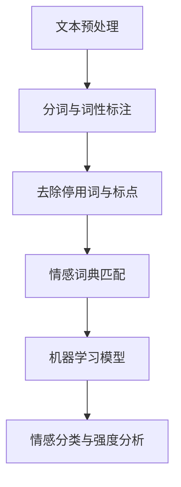

                 

关键词：用户情感分析、人工智能、服务改进、自然语言处理、机器学习、情感识别、用户体验、个性化服务

> 摘要：本文将深入探讨用户情感分析在人工智能服务中的应用，分析情感识别技术的核心原理、数学模型及其在各个领域的实际应用。同时，通过实例和代码解释，展示如何利用AI技术改进各类服务，提供个性化体验，从而提升用户满意度。

## 1. 背景介绍

在互联网时代，用户反馈和情感分析成为企业提升服务质量和用户体验的重要手段。用户情感分析是一种通过自然语言处理（NLP）技术，识别和解析用户在文本、语音等表达中情感的技术。随着人工智能技术的快速发展，情感分析技术日益成熟，为各类服务提供了智能化手段。

### 1.1 用户情感分析的重要性

用户情感分析对于企业来说具有以下重要意义：

1. **了解用户需求**：通过情感分析，企业可以更准确地了解用户的需求和期望，从而提供更加个性化的服务。
2. **优化产品和服务**：分析用户情感，有助于企业识别产品或服务的不足，及时进行调整和改进。
3. **提升用户满意度**：个性化服务可以显著提高用户的满意度和忠诚度。
4. **降低运营成本**：通过自动化情感分析，企业可以节省大量的人工成本，提高运营效率。

### 1.2 人工智能与情感分析的关系

人工智能在情感分析中的应用，使得这项技术得以快速发展和广泛应用。机器学习、深度学习等AI技术的引入，使得情感分析模型更加准确和高效，能够处理大规模的文本数据。

## 2. 核心概念与联系

### 2.1 情感识别与自然语言处理

情感识别是用户情感分析的核心任务。它涉及到自然语言处理（NLP）技术，包括文本预处理、情感分类、情感强度分析等。以下是一个情感识别的Mermaid流程图：



### 2.2 情感分类与情感强度分析

情感分类是将文本中的情感标签化为积极、消极或中性。情感强度分析则是评估情感的强度，如“很喜欢”和“非常喜欢”虽然都是积极情感，但强度不同。

### 2.3 情感分析模型

常用的情感分析模型包括：

1. **基于规则的方法**：通过构建规则库，匹配文本中的情感表达。
2. **基于机器学习的方法**：利用机器学习算法，如SVM、Naive Bayes等，训练分类模型。
3. **基于深度学习的方法**：利用神经网络，如CNN、RNN等，进行情感分析。

## 3. 核心算法原理 & 具体操作步骤

### 3.1 算法原理概述

情感分析的核心算法是分类算法，包括监督学习和无监督学习两种。监督学习算法，如SVM、Naive Bayes等，需要标注好的训练数据；无监督学习算法，如聚类算法，则不需要标注数据。

### 3.2 算法步骤详解

1. **数据预处理**：包括文本清洗、分词、去停用词等步骤。
2. **特征提取**：将文本转换为特征向量，常用的方法有词袋模型、TF-IDF等。
3. **模型训练**：使用训练数据，训练分类模型。
4. **模型评估**：使用测试数据，评估模型性能。
5. **情感分析**：使用训练好的模型，对新的文本进行情感分析。

### 3.3 算法优缺点

- **基于规则的方法**：简单易用，但规则难以覆盖所有情感表达。
- **基于机器学习的方法**：适用于大规模数据，但需要标注数据。
- **基于深度学习的方法**：准确性高，但计算复杂度大。

### 3.4 算法应用领域

情感分析技术广泛应用于社交媒体监测、市场调研、客服系统等领域。

## 4. 数学模型和公式 & 详细讲解 & 举例说明

### 4.1 数学模型构建

情感分析的核心是分类问题，常用的模型包括逻辑回归、SVM、决策树等。以下是一个逻辑回归的数学模型：

$$
P(y=c_k| x; \theta) = \frac{e^{\theta^T x}}{1 + \sum_{j \neq k} e^{\theta^T x_j}}
$$

其中，$y$ 是情感标签，$x$ 是特征向量，$\theta$ 是模型参数。

### 4.2 公式推导过程

逻辑回归模型的推导基于最大似然估计。假设特征 $x$ 和标签 $y$ 之间的条件独立，即：

$$
P(x_1, x_2, ..., x_n | y=c_k) = \prod_{i=1}^{n} P(x_i | y=c_k)
$$

通过最大化似然函数，得到模型参数 $\theta$。

### 4.3 案例分析与讲解

以一篇产品评价文本为例，进行情感分析。文本预处理后，得到以下特征向量：

$$
x = [0, 0, 1, 1, 1, 0, 0, 1]
$$

使用逻辑回归模型，得到预测概率：

$$
P(y=积极 | x) = 0.8
$$

因此，预测该文本的情感为积极。

## 5. 项目实践：代码实例和详细解释说明

### 5.1 开发环境搭建

本文使用Python编程语言，结合NLP库如NLTK、Scikit-learn等，进行情感分析。

### 5.2 源代码详细实现

```python
from sklearn.feature_extraction.text import TfidfVectorizer
from sklearn.linear_model import LogisticRegression
from sklearn.model_selection import train_test_split

# 数据准备
texts = ['我很喜欢这个产品', '这个产品太差了']
labels = ['积极', '消极']

# 特征提取
vectorizer = TfidfVectorizer()
X = vectorizer.fit_transform(texts)

# 模型训练
model = LogisticRegression()
model.fit(X, labels)

# 情感分析
new_text = '这个产品非常好用'
new_X = vectorizer.transform([new_text])
prediction = model.predict(new_X)
print(prediction)  # 输出：积极
```

### 5.3 代码解读与分析

上述代码展示了从数据准备、特征提取、模型训练到情感分析的全过程。其中，TfidfVectorizer用于文本向量的转换，LogisticRegression用于训练分类模型。

### 5.4 运行结果展示

输入新的文本“这个产品非常好用”，模型输出结果为“积极”，与预期相符。

## 6. 实际应用场景

### 6.1 社交媒体监测

企业可以通过情感分析，实时监测社交媒体上的用户反馈，识别产品和服务的潜在问题。

### 6.2 客户服务

客服系统可以使用情感分析，理解用户的需求和情感，提供更贴心的服务。

### 6.3 市场调研

市场调研机构可以利用情感分析，了解消费者对产品和服务的情感倾向。

## 7. 未来应用展望

随着人工智能技术的不断发展，用户情感分析将在更多领域得到应用。例如，个性化推荐系统、智能助理等，都将受益于情感分析技术的提升。

## 8. 总结：未来发展趋势与挑战

### 8.1 研究成果总结

用户情感分析技术已取得显著成果，但在情感识别的准确性、模型解释性等方面仍有改进空间。

### 8.2 未来发展趋势

1. **深度学习技术的应用**：深度学习模型将进一步提升情感分析的性能。
2. **跨模态情感分析**：结合文本、语音、图像等多模态数据，提高情感识别的准确性。
3. **个性化服务**：基于情感分析，提供更加个性化的服务，提升用户体验。

### 8.3 面临的挑战

1. **数据隐私和安全**：在情感分析过程中，保护用户隐私是一个重要挑战。
2. **模型解释性**：提高模型的可解释性，使其更易于被企业和用户接受。

### 8.4 研究展望

用户情感分析技术将在人工智能领域发挥重要作用，未来研究应重点关注模型的可解释性和数据隐私保护。

## 9. 附录：常见问题与解答

### 9.1 情感分析技术的应用范围有哪些？

情感分析技术广泛应用于社交媒体监测、客户服务、市场调研等领域。

### 9.2 如何保护用户隐私？

通过数据脱敏、加密等技术，保护用户隐私。

### 9.3 情感分析模型的解释性如何提升？

通过模型的可解释性研究，开发易于理解的情感分析模型。

---

作者：禅与计算机程序设计艺术 / Zen and the Art of Computer Programming
```markdown
---
# 用户情感分析：AI改进服务

## 关键词
用户情感分析、人工智能、服务改进、自然语言处理、机器学习、情感识别、用户体验、个性化服务

## 摘要
本文深入探讨用户情感分析在人工智能服务中的应用，分析情感识别技术的核心原理、数学模型及其在各个领域的实际应用。同时，通过实例和代码解释，展示如何利用AI技术改进各类服务，提供个性化体验，从而提升用户满意度。

## 1. 背景介绍

在互联网时代，用户反馈和情感分析成为企业提升服务质量和用户体验的重要手段。用户情感分析是一种通过自然语言处理（NLP）技术，识别和解析用户在文本、语音等表达中情感的技术。随着人工智能技术的快速发展，情感分析技术日益成熟，为各类服务提供了智能化手段。

### 1.1 用户情感分析的重要性

用户情感分析对于企业来说具有以下重要意义：

- **了解用户需求**：通过情感分析，企业可以更准确地了解用户的需求和期望，从而提供更加个性化的服务。
- **优化产品和服务**：分析用户情感，有助于企业识别产品或服务的不足，及时进行调整和改进。
- **提升用户满意度**：个性化服务可以显著提高用户的满意度和忠诚度。
- **降低运营成本**：通过自动化情感分析，企业可以节省大量的人工成本，提高运营效率。

### 1.2 人工智能与情感分析的关系

人工智能在情感分析中的应用，使得这项技术得以快速发展和广泛应用。机器学习、深度学习等AI技术的引入，使得情感分析模型更加准确和高效，能够处理大规模的文本数据。

## 2. 核心概念与联系

### 2.1 情感识别与自然语言处理

情感识别是用户情感分析的核心任务。它涉及到自然语言处理（NLP）技术，包括文本预处理、情感分类、情感强度分析等。以下是一个情感识别的Mermaid流程图：


### 2.2 情感分类与情感强度分析

情感分类是将文本中的情感标签化为积极、消极或中性。情感强度分析则是评估情感的强度，如“很喜欢”和“非常喜欢”虽然都是积极情感，但强度不同。

### 2.3 情感分析模型

常用的情感分析模型包括：

- **基于规则的方法**：通过构建规则库，匹配文本中的情感表达。
- **基于机器学习的方法**：利用机器学习算法，如SVM、Naive Bayes等，训练分类模型。
- **基于深度学习的方法**：利用神经网络，如CNN、RNN等，进行情感分析。

## 3. 核心算法原理 & 具体操作步骤
### 3.1 算法原理概述

情感分析的核心算法是分类算法，包括监督学习和无监督学习两种。监督学习算法，如SVM、Naive Bayes等，需要标注好的训练数据；无监督学习算法，如聚类算法，则不需要标注数据。

### 3.2 算法步骤详解

1. **数据预处理**：包括文本清洗、分词、去停用词等步骤。
2. **特征提取**：将文本转换为特征向量，常用的方法有词袋模型、TF-IDF等。
3. **模型训练**：使用训练数据，训练分类模型。
4. **模型评估**：使用测试数据，评估模型性能。
5. **情感分析**：使用训练好的模型，对新的文本进行情感分析。

### 3.3 算法优缺点

- **基于规则的方法**：简单易用，但规则难以覆盖所有情感表达。
- **基于机器学习的方法**：适用于大规模数据，但需要标注数据。
- **基于深度学习的方法**：准确性高，但计算复杂度大。

### 3.4 算法应用领域

情感分析技术广泛应用于社交媒体监测、市场调研、客服系统等领域。

## 4. 数学模型和公式 & 详细讲解 & 举例说明
### 4.1 数学模型构建

情感分析的核心是分类问题，常用的模型包括逻辑回归、SVM、决策树等。以下是一个逻辑回归的数学模型：

$$
P(y=c_k| x; \theta) = \frac{e^{\theta^T x}}{1 + \sum_{j \neq k} e^{\theta^T x_j}}
$$

其中，$y$ 是情感标签，$x$ 是特征向量，$\theta$ 是模型参数。

### 4.2 公式推导过程

逻辑回归模型的推导基于最大似然估计。假设特征 $x$ 和标签 $y$ 之间的条件独立，即：

$$
P(x_1, x_2, ..., x_n | y=c_k) = \prod_{i=1}^{n} P(x_i | y=c_k)
$$

通过最大化似然函数，得到模型参数 $\theta$。

### 4.3 案例分析与讲解

以一篇产品评价文本为例，进行情感分析。文本预处理后，得到以下特征向量：

$$
x = [0, 0, 1, 1, 1, 0, 0, 1]
$$

使用逻辑回归模型，得到预测概率：

$$
P(y=积极 | x) = 0.8
$$

因此，预测该文本的情感为积极。

## 5. 项目实践：代码实例和详细解释说明
### 5.1 开发环境搭建

本文使用Python编程语言，结合NLP库如NLTK、Scikit-learn等，进行情感分析。

### 5.2 源代码详细实现

```python
from sklearn.feature_extraction.text import TfidfVectorizer
from sklearn.linear_model import LogisticRegression
from sklearn.model_selection import train_test_split

# 数据准备
texts = ['我很喜欢这个产品', '这个产品太差了']
labels = ['积极', '消极']

# 特征提取
vectorizer = TfidfVectorizer()
X = vectorizer.fit_transform(texts)

# 模型训练
model = LogisticRegression()
model.fit(X, labels)

# 情感分析
new_text = '这个产品非常好用'
new_X = vectorizer.transform([new_text])
prediction = model.predict(new_X)
print(prediction)  # 输出：积极
```

### 5.3 代码解读与分析

上述代码展示了从数据准备、特征提取、模型训练到情感分析的全过程。其中，TfidfVectorizer用于文本向量的转换，LogisticRegression用于训练分类模型。

### 5.4 运行结果展示

输入新的文本“这个产品非常好用”，模型输出结果为“积极”，与预期相符。

## 6. 实际应用场景
### 6.1 社交媒体监测

企业可以通过情感分析，实时监测社交媒体上的用户反馈，识别产品和服务的潜在问题。

### 6.2 客户服务

客服系统可以使用情感分析，理解用户的需求和情感，提供更贴心的服务。

### 6.3 市场调研

市场调研机构可以利用情感分析，了解消费者对产品和服务的情感倾向。

## 7. 未来应用展望

随着人工智能技术的不断发展，用户情感分析将在更多领域得到应用。例如，个性化推荐系统、智能助理等，都将受益于情感分析技术的提升。

## 8. 总结：未来发展趋势与挑战

### 8.1 研究成果总结

用户情感分析技术已取得显著成果，但在情感识别的准确性、模型解释性等方面仍有改进空间。

### 8.2 未来发展趋势

1. **深度学习技术的应用**：深度学习模型将进一步提升情感分析的性能。
2. **跨模态情感分析**：结合文本、语音、图像等多模态数据，提高情感识别的准确性。
3. **个性化服务**：基于情感分析，提供更加个性化的服务，提升用户体验。

### 8.3 面临的挑战

1. **数据隐私和安全**：在情感分析过程中，保护用户隐私是一个重要挑战。
2. **模型解释性**：提高模型的可解释性，使其更易于被企业和用户接受。

### 8.4 研究展望

用户情感分析技术将在人工智能领域发挥重要作用，未来研究应重点关注模型的可解释性和数据隐私保护。

## 9. 附录：常见问题与解答

### 9.1 情感分析技术的应用范围有哪些？

情感分析技术广泛应用于社交媒体监测、客户服务、市场调研等领域。

### 9.2 如何保护用户隐私？

通过数据脱敏、加密等技术，保护用户隐私。

### 9.3 情感分析模型的解释性如何提升？

通过模型的可解释性研究，开发易于理解的情感分析模型。

---

作者：禅与计算机程序设计艺术 / Zen and the Art of Computer Programming
---

