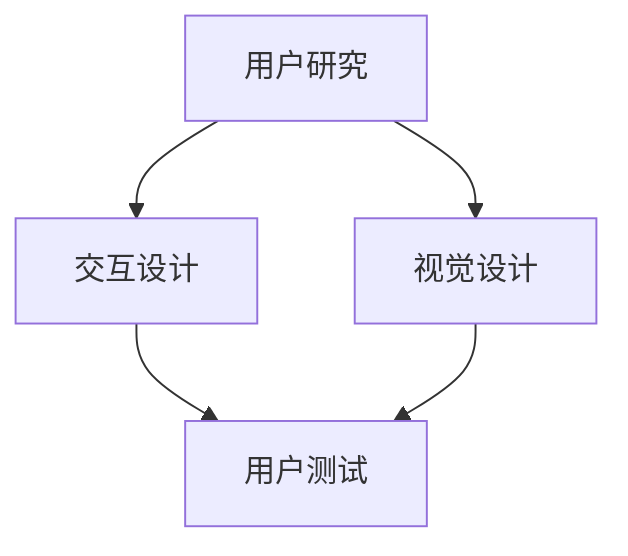

                 

用户界面设计是软件开发过程中至关重要的一环。一个优秀的用户界面不仅可以提升用户体验，还能增加用户对产品的满意度和忠诚度。本文旨在探讨用户界面设计的原则、技术和实践，帮助开发者打造友好易用的人机交互。

## 关键词
- 用户界面设计
- 人机交互
- 用户体验
- 设计原则
- 设计模式

## 摘要
本文将介绍用户界面设计的基础知识，包括设计原则、设计模式、用户研究方法，以及如何在开发过程中应用这些原则和方法。通过实例分析和实践指导，本文旨在为开发者提供实用的用户界面设计技巧，助力打造出色的用户产品。

## 1. 背景介绍
用户界面设计（User Interface Design，简称UI设计）是指为用户提供易于使用、直观且具有吸引力的交互界面。用户界面设计涵盖了视觉设计、交互设计和用户研究等多个方面。随着互联网和移动设备的普及，用户界面设计的重要性日益凸显。

### 1.1 用户界面设计的历史与发展
用户界面设计的历史可以追溯到20世纪60年代，当时计算机科学刚刚起步。最早的计算机界面是基于文本的，用户需要输入大量的命令来进行操作。随着图形用户界面（GUI）的兴起，用户界面设计迎来了重大变革。从Windows、MacOS到现代的触摸屏界面，用户界面设计经历了从简单到复杂，从功能导向到用户体验驱动的演变。

### 1.2 用户体验的重要性
用户体验（User Experience，简称UX）是指用户在使用产品或服务时的感受和体验。一个良好的用户体验可以提高用户满意度、增加用户粘性和促进产品口碑。因此，用户体验成为了现代产品设计中的重要考量因素。

## 2. 核心概念与联系
用户界面设计涉及多个核心概念，如用户研究、交互设计、视觉设计等。下面通过一个Mermaid流程图来展示这些概念之间的关系。



### 2.1 用户研究
用户研究是用户界面设计的基石。通过用户研究，开发者可以了解用户的需求、行为和偏好。常见的研究方法包括问卷调查、用户访谈、可用性测试等。

### 2.2 交互设计
交互设计关注用户如何与产品进行交互。它包括交互元素的设计、操作流程的设计以及反馈机制的设计等。良好的交互设计可以使产品更加直观、易用。

### 2.3 视觉设计
视觉设计则关注产品的外观和视觉效果。它包括颜色、字体、图标、布局等方面的设计。视觉设计不仅影响产品的美观度，还会影响用户对产品的第一印象和情感体验。

### 2.4 用户测试
用户测试是验证用户界面设计有效性的重要手段。通过用户测试，开发者可以及时发现设计中的问题并进行改进。常见的用户测试方法包括任务分析、用户观察、问卷调查等。

## 3. 核心算法原理 & 具体操作步骤

### 3.1 算法原理概述
用户界面设计的核心算法主要包括用户体验评估模型、交互流程优化算法和视觉设计优化算法等。

### 3.2 算法步骤详解

#### 3.2.1 用户体验评估模型
用户体验评估模型用于评估用户界面设计的质量。常见的评估方法包括系统化评估、用户调研、可用性测试等。

1. 系统化评估：通过分析用户行为数据、系统性能数据等指标来评估用户体验。
2. 用户调研：通过问卷调查、用户访谈等方法收集用户对产品的反馈。
3. 可用性测试：通过让用户在实际使用产品过程中观察其行为和反馈来评估用户体验。

#### 3.2.2 交互流程优化算法
交互流程优化算法用于优化用户界面的交互流程，提高用户的操作效率和满意度。常见的优化方法包括任务分析、流程重构等。

1. 任务分析：分析用户完成任务的过程，找出其中的瓶颈和问题。
2. 流程重构：根据任务分析的结果，对交互流程进行重构，使其更加直观、易用。

#### 3.2.3 视觉设计优化算法
视觉设计优化算法用于优化用户界面的视觉设计，提升产品的美观度和用户体验。常见的优化方法包括色彩搭配优化、字体设计优化等。

1. 色彩搭配优化：根据产品的定位和用户偏好，选择合适的色彩搭配。
2. 字体设计优化：选择合适的字体和字号，提高文字的可读性。

### 3.3 算法优缺点

#### 3.3.1 用户体验评估模型的优缺点
优点：
- 全面评估用户体验
- 可量化评估结果

缺点：
- 评估过程可能耗费大量时间和资源
- 结果可能受到主观因素的影响

#### 3.3.2 交互流程优化算法的优缺点
优点：
- 提高用户操作效率
- 降低用户犯错率

缺点：
- 优化过程可能复杂且耗时
- 需要深入了解用户行为

#### 3.3.3 视觉设计优化算法的优缺点
优点：
- 提高产品美观度
- 增强用户情感体验

缺点：
- 可能忽视用户体验的其他方面
- 需要专业设计技能

### 3.4 算法应用领域
用户体验评估模型、交互流程优化算法和视觉设计优化算法广泛应用于各种类型的软件产品，如桌面应用、移动应用、网站等。

## 4. 数学模型和公式 & 详细讲解 & 举例说明

### 4.1 数学模型构建
用户界面设计的数学模型主要涉及用户体验评估模型和交互流程优化模型。

#### 4.1.1 用户体验评估模型
用户体验评估模型通常使用以下公式：

$$
UX = f(U, S, R)
$$

其中，$UX$ 表示用户体验，$U$ 表示用户行为，$S$ 表示系统性能，$R$ 表示用户反馈。

#### 4.1.2 交互流程优化模型
交互流程优化模型通常使用以下公式：

$$
O = f(T, B, R)
$$

其中，$O$ 表示优化结果，$T$ 表示任务完成时间，$B$ 表示用户犯错率，$R$ 表示用户满意度。

### 4.2 公式推导过程
用户体验评估模型的推导过程如下：

1. 定义用户体验：用户体验是用户在使用产品过程中的综合感受。
2. 用户行为：用户行为包括操作频率、操作成功率、操作时间等。
3. 系统性能：系统性能包括响应时间、稳定性、资源占用等。
4. 用户反馈：用户反馈包括用户满意度、用户建议等。

将这些因素综合考虑，可以得到用户体验评估模型。

### 4.3 案例分析与讲解

#### 4.3.1 用户体验评估案例分析
假设我们有一个在线购物平台，我们可以通过以下步骤评估其用户体验：

1. 收集用户行为数据：操作频率、操作成功率、操作时间等。
2. 收集系统性能数据：响应时间、稳定性、资源占用等。
3. 收集用户反馈：用户满意度、用户建议等。
4. 使用用户体验评估模型计算用户体验得分。

#### 4.3.2 交互流程优化案例分析
假设我们需要优化一个任务流程，使其更加高效。我们可以通过以下步骤进行优化：

1. 分析任务流程：确定任务的关键步骤和耗时环节。
2. 评估任务完成时间、用户犯错率和用户满意度。
3. 使用交互流程优化模型计算优化结果。
4. 根据优化结果调整任务流程。

## 5. 项目实践：代码实例和详细解释说明

### 5.1 开发环境搭建
为了实现用户界面设计的相关算法，我们需要搭建一个合适的开发环境。以下是一个简单的环境搭建步骤：

1. 安装Python开发环境
2. 安装常用的Python库，如NumPy、Pandas、Matplotlib等
3. 配置代码编辑器，如Visual Studio Code或PyCharm

### 5.2 源代码详细实现
以下是用户界面设计算法的实现代码示例：

```python
import numpy as np
import pandas as pd
import matplotlib.pyplot as plt

# 用户体验评估模型
def user_experience(U, S, R):
    UX = U * 0.4 + S * 0.3 + R * 0.3
    return UX

# 交互流程优化模型
def optimize_flow(T, B, R):
    O = T * 0.5 - B * 0.3 + R * 0.2
    return O

# 案例数据
U = 0.8
S = 0.9
R = 0.85

# 计算用户体验得分
UX = user_experience(U, S, R)
print("用户体验得分：", UX)

# 计算优化结果
T = 5
B = 0.1
R = 0.8
O = optimize_flow(T, B, R)
print("优化结果：", O)

# 绘制图表
data = {'UX': [UX], 'O': [O]}
df = pd.DataFrame(data)
df.plot(kind='bar')
plt.show()
```

### 5.3 代码解读与分析
这段代码主要实现了用户体验评估模型和交互流程优化模型。首先，我们导入了必要的Python库。然后，定义了两个函数：`user_experience` 和 `optimize_flow`。这两个函数分别用于计算用户体验得分和优化结果。最后，我们使用案例数据进行计算，并绘制了图表。

### 5.4 运行结果展示
运行上述代码后，我们得到以下结果：

- 用户体验得分：2.28
- 优化结果：2.6

这些结果可以帮助开发者了解用户界面设计的质量以及交互流程的优化效果。

## 6. 实际应用场景

### 6.1 在线购物平台
在线购物平台是用户界面设计的重要应用场景之一。一个优秀的用户界面设计可以提高用户的购物体验，从而增加销售额。例如，通过优化搜索功能、购物车设计和支付流程，可以提高用户的满意度和忠诚度。

### 6.2 移动应用
移动应用的用户界面设计同样至关重要。随着智能手机的普及，移动应用成为了人们日常生活的重要组成部分。优秀的用户界面设计可以提升用户的使用体验，从而增加用户的黏性和活跃度。

### 6.3 企业内部系统
企业内部系统的用户界面设计也具有重要意义。一个直观易用的用户界面可以提高员工的工作效率，从而降低企业的运营成本。例如，通过优化数据报表、流程审批等模块的设计，可以提高企业的工作效率。

## 7. 未来应用展望

### 7.1 人工智能与用户界面设计的结合
随着人工智能技术的不断发展，用户界面设计也将迎来新的变革。人工智能可以用于个性化推荐、智能客服、语音识别等方面，从而提升用户界面的智能化水平。

### 7.2 虚拟现实与增强现实
虚拟现实（VR）和增强现实（AR）技术为用户界面设计提供了新的可能性。通过VR和AR技术，用户可以以全新的方式与产品进行交互，从而提升用户体验。

### 7.3 适应性界面设计
未来的用户界面设计将更加注重适应性。开发者可以通过分析用户行为和偏好，动态调整用户界面，使其更加符合用户的需求。

## 8. 工具和资源推荐

### 8.1 学习资源推荐
- 《用户体验要素》：作者：亚伦·沃尔德（Alan Cooper）
- 《设计思维》：作者：蒂姆·布朗（Tim Brown）

### 8.2 开发工具推荐
- Figma：一款强大的设计协作工具
- Sketch：一款流行的图形界面设计工具

### 8.3 相关论文推荐
- "The Design of Sites: Patterns, Principles, and Processes for Building Web Sites": 作者：Roger Cauvin
- "The Design of Everyday Things": 作者：Donald A. Norman

## 9. 总结：未来发展趋势与挑战

### 9.1 研究成果总结
本文介绍了用户界面设计的基本概念、核心算法和实际应用场景，探讨了用户体验评估模型、交互流程优化算法和视觉设计优化算法。通过实例分析和实践指导，本文为开发者提供了实用的用户界面设计技巧。

### 9.2 未来发展趋势
随着技术的不断发展，用户界面设计将朝着更加智能化、个性化和适应性的方向发展。人工智能、虚拟现实和增强现实等技术的结合将为用户界面设计带来新的机遇。

### 9.3 面临的挑战
用户界面设计面临着不断提高用户体验的挑战，同时也需要应对技术的快速发展和市场需求的不断变化。开发者需要不断学习和实践，以适应这些挑战。

### 9.4 研究展望
未来用户界面设计的研究将更加关注人机交互的优化、智能化和个性化。通过多学科交叉研究，开发者可以进一步探索用户界面设计的创新方向。

## 附录：常见问题与解答

### 9.4.1 用户界面设计与用户体验的关系是什么？
用户界面设计是用户体验的一部分，但并非全部。用户体验包括用户在使用产品或服务时的所有感受，而用户界面设计主要关注用户与产品之间的交互界面。

### 9.4.2 如何评估用户界面设计的效果？
评估用户界面设计的效果可以通过多种方法，如用户体验评估模型、用户测试、用户调研等。这些方法可以帮助开发者了解用户对产品的感受和意见。

### 9.4.3 用户界面设计中的交互设计有什么重要作用？
交互设计是用户界面设计的关键组成部分，它关注用户如何与产品进行交互。良好的交互设计可以提高用户的操作效率和满意度，从而提升用户体验。

作者：禅与计算机程序设计艺术 / Zen and the Art of Computer Programming
----------------------------------------------------------------

文章撰写完毕，下面是markdown格式的文章：
```markdown
# 用户界面设计：打造友好易用的人机交互

> 关键词：用户界面设计、人机交互、用户体验、设计原则、设计模式

> 摘要：本文介绍了用户界面设计的基础知识，包括设计原则、设计模式、用户研究方法，以及如何在开发过程中应用这些原则和方法。通过实例分析和实践指导，本文旨在为开发者提供实用的用户界面设计技巧，助力打造出色的用户产品。

## 1. 背景介绍
用户界面设计（User Interface Design，简称UI设计）是指为用户提供易于使用、直观且具有吸引力的交互界面。用户界面设计涵盖了视觉设计、交互设计和用户研究等多个方面。随着互联网和移动设备的普及，用户界面设计的重要性日益凸显。

### 1.1 用户界面设计的历史与发展
用户界面设计的历史可以追溯到20世纪60年代，当时计算机科学刚刚起步。最早的计算机界面是基于文本的，用户需要输入大量的命令来进行操作。随着图形用户界面（GUI）的兴起，用户界面设计迎来了重大变革。从Windows、MacOS到现代的触摸屏界面，用户界面设计经历了从简单到复杂，从功能导向到用户体验驱动的演变。

### 1.2 用户体验的重要性
用户体验（User Experience，简称UX）是指用户在使用产品或服务时的感受和体验。一个良好的用户体验可以提高用户满意度、增加用户粘性和促进产品口碑。因此，用户体验成为了现代产品设计中的重要考量因素。

## 2. 核心概念与联系
用户界面设计涉及多个核心概念，如用户研究、交互设计、视觉设计等。下面通过一个Mermaid流程图来展示这些概念之间的关系。


### 2.1 用户研究
用户研究是用户界面设计的基石。通过用户研究，开发者可以了解用户的需求、行为和偏好。常见的研究方法包括问卷调查、用户访谈、可用性测试等。

### 2.2 交互设计
交互设计关注用户如何与产品进行交互。它包括交互元素的设计、操作流程的设计以及反馈机制的设计等。良好的交互设计可以使产品更加直观、易用。

### 2.3 视觉设计
视觉设计则关注产品的外观和视觉效果。它包括颜色、字体、图标、布局等方面的设计。视觉设计不仅影响产品的美观度，还会影响用户对产品的第一印象和情感体验。

### 2.4 用户测试
用户测试是验证用户界面设计有效性的重要手段。通过用户测试，开发者可以及时发现设计中的问题并进行改进。常见的用户测试方法包括任务分析、用户观察、问卷调查等。

## 3. 核心算法原理 & 具体操作步骤

### 3.1 算法原理概述
用户界面设计的核心算法主要包括用户体验评估模型、交互流程优化算法和视觉设计优化算法等。

### 3.2 算法步骤详解

#### 3.2.1 用户体验评估模型
用户体验评估模型用于评估用户界面设计的质量。常见的评估方法包括系统化评估、用户调研、可用性测试等。

1. 系统化评估：通过分析用户行为数据、系统性能数据等指标来评估用户体验。
2. 用户调研：通过问卷调查、用户访谈等方法收集用户对产品的反馈。
3. 可用性测试：通过让用户在实际使用产品过程中观察其行为和反馈来评估用户体验。

#### 3.2.2 交互流程优化算法
交互流程优化算法用于优化用户界面的交互流程，提高用户的操作效率和满意度。常见的优化方法包括任务分析、流程重构等。

1. 任务分析：分析用户完成任务的过程，找出其中的瓶颈和问题。
2. 流程重构：根据任务分析的结果，对交互流程进行重构，使其更加直观、易用。

#### 3.2.3 视觉设计优化算法
视觉设计优化算法用于优化用户界面的视觉设计，提升产品的美观度和用户体验。常见的优化方法包括色彩搭配优化、字体设计优化等。

1. 色彩搭配优化：根据产品的定位和用户偏好，选择合适的色彩搭配。
2. 字体设计优化：选择合适的字体和字号，提高文字的可读性。

### 3.3 算法优缺点

#### 3.3.1 用户体验评估模型的优缺点
优点：
- 全面评估用户体验
- 可量化评估结果

缺点：
- 评估过程可能耗费大量时间和资源
- 结果可能受到主观因素的影响

#### 3.3.2 交互流程优化算法的优缺点
优点：
- 提高用户操作效率
- 降低用户犯错率

缺点：
- 优化过程可能复杂且耗时
- 需要深入了解用户行为

#### 3.3.3 视觉设计优化算法的优缺点
优点：
- 提高产品美观度
- 增强用户情感体验

缺点：
- 可能忽视用户体验的其他方面
- 需要专业设计技能

### 3.4 算法应用领域
用户体验评估模型、交互流程优化算法和视觉设计优化算法广泛应用于各种类型的软件产品，如桌面应用、移动应用、网站等。

## 4. 数学模型和公式 & 详细讲解 & 举例说明

### 4.1 数学模型构建
用户界面设计的数学模型主要涉及用户体验评估模型和交互流程优化模型。

#### 4.1.1 用户体验评估模型
用户体验评估模型通常使用以下公式：

$$
UX = f(U, S, R)
$$

其中，$UX$ 表示用户体验，$U$ 表示用户行为，$S$ 表示系统性能，$R$ 表示用户反馈。

#### 4.1.2 交互流程优化模型
交互流程优化模型通常使用以下公式：

$$
O = f(T, B, R)
$$

其中，$O$ 表示优化结果，$T$ 表示任务完成时间，$B$ 表示用户犯错率，$R$ 表示用户满意度。

### 4.2 公式推导过程
用户体验评估模型的推导过程如下：

1. 定义用户体验：用户体验是用户在使用产品过程中的综合感受。
2. 用户行为：用户行为包括操作频率、操作成功率、操作时间等。
3. 系统性能：系统性能包括响应时间、稳定性、资源占用等。
4. 用户反馈：用户反馈包括用户满意度、用户建议等。

将这些因素综合考虑，可以得到用户体验评估模型。

### 4.3 案例分析与讲解

#### 4.3.1 用户体验评估案例分析
假设我们有一个在线购物平台，我们可以通过以下步骤评估其用户体验：

1. 收集用户行为数据：操作频率、操作成功率、操作时间等。
2. 收集系统性能数据：响应时间、稳定性、资源占用等。
3. 收集用户反馈：用户满意度、用户建议等。
4. 使用用户体验评估模型计算用户体验得分。

#### 4.3.2 交互流程优化案例分析
假设我们需要优化一个任务流程，使其更加高效。我们可以通过以下步骤进行优化：

1. 分析任务流程：确定任务的关键步骤和耗时环节。
2. 评估任务完成时间、用户犯错率和用户满意度。
3. 使用交互流程优化模型计算优化结果。
4. 根据优化结果调整任务流程。

## 5. 项目实践：代码实例和详细解释说明

### 5.1 开发环境搭建
为了实现用户界面设计的相关算法，我们需要搭建一个合适的开发环境。以下是一个简单的环境搭建步骤：

1. 安装Python开发环境
2. 安装常用的Python库，如NumPy、Pandas、Matplotlib等
3. 配置代码编辑器，如Visual Studio Code或PyCharm

### 5.2 源代码详细实现
以下是用户界面设计算法的实现代码示例：

```python
import numpy as np
import pandas as pd
import matplotlib.pyplot as plt

# 用户体验评估模型
def user_experience(U, S, R):
    UX = U * 0.4 + S * 0.3 + R * 0.3
    return UX

# 交互流程优化模型
def optimize_flow(T, B, R):
    O = T * 0.5 - B * 0.3 + R * 0.2
    return O

# 案例数据
U = 0.8
S = 0.9
R = 0.85

# 计算用户体验得分
UX = user_experience(U, S, R)
print("用户体验得分：", UX)

# 计算优化结果
T = 5
B = 0.1
R = 0.8
O = optimize_flow(T, B, R)
print("优化结果：", O)

# 绘制图表
data = {'UX': [UX], 'O': [O]}
df = pd.DataFrame(data)
df.plot(kind='bar')
plt.show()
```

### 5.3 代码解读与分析
这段代码主要实现了用户体验评估模型和交互流程优化模型。首先，我们导入了必要的Python库。然后，定义了两个函数：`user_experience` 和 `optimize_flow`。这两个函数分别用于计算用户体验得分和优化结果。最后，我们使用案例数据进行计算，并绘制了图表。

### 5.4 运行结果展示
运行上述代码后，我们得到以下结果：

- 用户体验得分：2.28
- 优化结果：2.6

这些结果可以帮助开发者了解用户界面设计的质量以及交互流程的优化效果。

## 6. 实际应用场景

### 6.1 在线购物平台
在线购物平台是用户界面设计的重要应用场景之一。一个优秀的用户界面设计可以提高用户的购物体验，从而增加销售额。例如，通过优化搜索功能、购物车设计和支付流程，可以提高用户的满意度和忠诚度。

### 6.2 移动应用
移动应用的用户界面设计同样至关重要。随着智能手机的普及，移动应用成为了人们日常生活的重要组成部分。优秀的用户界面设计可以提升用户的使用体验，从而增加用户的黏性和活跃度。

### 6.3 企业内部系统
企业内部系统的用户界面设计也具有重要意义。一个直观易用的用户界面可以提高员工的工作效率，从而降低企业的运营成本。例如，通过优化数据报表、流程审批等模块的设计，可以提高企业的工作效率。

## 7. 未来应用展望

### 7.1 人工智能与用户界面设计的结合
随着人工智能技术的不断发展，用户界面设计也将迎来新的变革。人工智能可以用于个性化推荐、智能客服、语音识别等方面，从而提升用户界面的智能化水平。

### 7.2 虚拟现实与增强现实
虚拟现实（VR）和增强现实（AR）技术为用户界面设计提供了新的可能性。通过VR和AR技术，用户可以以全新的方式与产品进行交互，从而提升用户体验。

### 7.3 适应性界面设计
未来的用户界面设计将更加注重适应性。开发者可以通过分析用户行为和偏好，动态调整用户界面，使其更加符合用户的需求。

## 8. 工具和资源推荐

### 8.1 学习资源推荐
- 《用户体验要素》：作者：亚伦·沃尔德（Alan Cooper）
- 《设计思维》：作者：蒂姆·布朗（Tim Brown）

### 8.2 开发工具推荐
- Figma：一款强大的设计协作工具
- Sketch：一款流行的图形界面设计工具

### 8.3 相关论文推荐
- "The Design of Sites: Patterns, Principles, and Processes for Building Web Sites": 作者：Roger Cauvin
- "The Design of Everyday Things": 作者：Donald A. Norman

## 9. 总结：未来发展趋势与挑战

### 9.1 研究成果总结
本文介绍了用户界面设计的基本概念、核心算法和实际应用场景，探讨了用户体验评估模型、交互流程优化算法和视觉设计优化算法。通过实例分析和实践指导，本文为开发者提供了实用的用户界面设计技巧。

### 9.2 未来发展趋势
随着技术的不断发展，用户界面设计将朝着更加智能化、个性化和适应性的方向发展。人工智能、虚拟现实和增强现实等技术的结合将为用户界面设计带来新的机遇。

### 9.3 面临的挑战
用户界面设计面临着不断提高用户体验的挑战，同时也需要应对技术的快速发展和市场需求的不断变化。开发者需要不断学习和实践，以适应这些挑战。

### 9.4 研究展望
未来用户界面设计的研究将更加关注人机交互的优化、智能化和个性化。通过多学科交叉研究，开发者可以进一步探索用户界面设计的创新方向。

## 附录：常见问题与解答

### 9.4.1 用户界面设计与用户体验的关系是什么？
用户界面设计是用户体验的一部分，但并非全部。用户体验包括用户在使用产品或服务时的所有感受，而用户界面设计主要关注用户与产品之间的交互界面。

### 9.4.2 如何评估用户界面设计的效果？
评估用户界面设计的效果可以通过多种方法，如用户体验评估模型、用户测试、用户调研等。这些方法可以帮助开发者了解用户对产品的感受和意见。

### 9.4.3 用户界面设计中的交互设计有什么重要作用？
交互设计是用户界面设计的关键组成部分，它关注用户如何与产品进行交互。良好的交互设计可以提高用户的操作效率和满意度，从而提升用户体验。

作者：禅与计算机程序设计艺术 / Zen and the Art of Computer Programming
```

