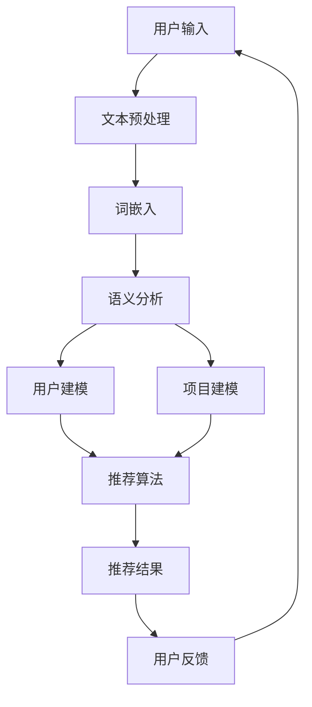

                 

关键词：自然语言指令，推荐系统，交互模式，人工智能，用户体验，深度学习，用户行为分析，个性化推荐。

> 摘要：本文旨在探讨自然语言指令驱动的推荐系统交互新模式，通过结合自然语言处理和机器学习技术，实现用户与推荐系统之间的自然、流畅的互动。本文首先介绍了推荐系统的基本概念和传统交互模式，然后详细阐述了自然语言指令驱动推荐系统的核心概念、算法原理及具体实现步骤，并分析了其优势和应用场景。最后，本文对自然语言指令驱动推荐系统的未来发展趋势和面临的挑战进行了展望。

## 1. 背景介绍

推荐系统作为人工智能领域的一个重要分支，近年来得到了广泛的关注和应用。推荐系统通过分析用户的历史行为、兴趣偏好和上下文信息，为用户推荐与其兴趣相关的商品、服务或内容。传统推荐系统主要基于机器学习和数据挖掘技术，如协同过滤、内容匹配和基于模型的推荐算法等。然而，这些传统方法往往缺乏与用户的自然互动能力，难以满足用户日益增长的个性化需求。

随着自然语言处理和深度学习技术的发展，自然语言指令驱动的推荐系统交互模式逐渐崭露头角。自然语言指令驱动推荐系统通过理解用户输入的自然语言指令，为其提供更加个性化和智能的推荐服务。这种交互模式不仅提升了用户体验，还增强了推荐系统的可解释性和可控性。

本文旨在深入探讨自然语言指令驱动的推荐系统交互新模式，分析其核心概念、算法原理和实现步骤，并探讨其在实际应用中的优势和挑战。

## 2. 核心概念与联系

### 2.1. 自然语言处理（NLP）

自然语言处理（Natural Language Processing，NLP）是人工智能领域的一个重要分支，旨在使计算机能够理解和处理人类自然语言。NLP技术包括文本预处理、词嵌入、语言模型、实体识别、关系提取、语义分析等。在推荐系统中，NLP技术主要用于理解用户输入的自然语言指令和描述，提取关键词和语义信息，以便进行后续的推荐计算。

### 2.2. 推荐系统

推荐系统（Recommendation System）是一种基于数据挖掘和机器学习技术的应用，旨在根据用户的历史行为、兴趣偏好和上下文信息，为用户推荐其可能感兴趣的商品、服务或内容。推荐系统主要包括用户建模、项目建模、推荐算法和交互反馈等关键组成部分。

### 2.3. 自然语言指令驱动推荐系统

自然语言指令驱动推荐系统（Natural Language Instruction-driven Recommendation System）是一种结合自然语言处理和推荐系统技术的交互新模式。该系统通过理解用户输入的自然语言指令，自动生成推荐结果，并支持用户对推荐结果进行进一步的自然语言反馈。这种交互模式不仅提高了用户的参与度和满意度，还有效提升了推荐系统的智能化和个性化水平。

### 2.4. Mermaid 流程图

下面是一个描述自然语言指令驱动推荐系统核心概念的 Mermaid 流程图：



### 2.5. 相关技术

除了自然语言处理和推荐系统技术，自然语言指令驱动推荐系统还涉及其他相关技术，如深度学习、知识图谱、上下文感知等。这些技术共同构成了自然语言指令驱动推荐系统的技术基础。

## 3. 核心算法原理 & 具体操作步骤

### 3.1. 算法原理概述

自然语言指令驱动推荐系统的核心算法包括自然语言处理模块和推荐算法模块。自然语言处理模块主要负责解析用户输入的自然语言指令，提取关键词和语义信息。推荐算法模块则根据用户模型和项目模型，生成推荐结果。具体操作步骤如下：

1. 文本预处理：对用户输入的自然语言指令进行分词、去停用词、词性标注等预处理操作，以便进行后续的词嵌入和语义分析。

2. 词嵌入：将预处理后的文本转化为向量的表示，通常使用预训练的词向量模型，如Word2Vec、GloVe等。

3. 语义分析：利用深度学习模型（如BERT、GPT等）对词向量进行编码，提取句子的语义表示。

4. 用户建模：根据用户的历史行为、兴趣偏好和上下文信息，构建用户特征向量。

5. 项目建模：根据项目的特征信息，构建项目特征向量。

6. 推荐算法：利用用户特征向量和项目特征向量，计算用户对项目的偏好分数，并根据偏好分数生成推荐结果。

7. 用户反馈：用户对推荐结果进行评价和反馈，用于更新用户模型和项目模型。

### 3.2. 算法步骤详解

下面详细描述自然语言指令驱动推荐系统的算法步骤：

#### 3.2.1. 文本预处理

文本预处理是自然语言处理的基础步骤。具体操作包括：

- 分词：将自然语言指令分解为独立的词或短语，通常使用基于规则的分词方法（如正则表达式）或基于统计的分词方法（如最大匹配算法）。
- 去停用词：去除对推荐无实际意义的常见词语，如“的”、“了”、“是”等。
- 词性标注：为每个词赋予相应的词性（如名词、动词、形容词等），以便进行后续的语义分析。

#### 3.2.2. 词嵌入

词嵌入（Word Embedding）是一种将词汇映射为向量的技术，旨在捕捉词汇间的语义关系。常见的方法包括：

- Word2Vec：基于神经网络的词向量生成方法，通过训练词的上下文来学习词向量。
- GloVe：全局向量表示（Global Vectors for Word Representation），通过构建词和词频的矩阵，利用矩阵分解方法生成词向量。

#### 3.2.3. 语义分析

语义分析（Semantic Analysis）是自然语言处理的核心任务，旨在理解文本的语义含义。常见的方法包括：

- 语言模型：基于统计方法，通过训练大量的文本数据，学习语言的概率分布。
- 深度学习模型：如BERT（Bidirectional Encoder Representations from Transformers）、GPT（Generative Pre-trained Transformer），通过预训练和微调，实现对文本的深度语义理解。

#### 3.2.4. 用户建模

用户建模（User Modeling）是推荐系统的关键步骤，旨在构建用户特征向量。具体方法包括：

- 基于历史行为的用户建模：通过分析用户的历史行为数据（如购买记录、浏览记录等），提取用户兴趣和偏好特征。
- 基于上下文的用户建模：根据用户当前所处的上下文环境（如时间、地点、设备等），为用户构建动态特征向量。

#### 3.2.5. 项目建模

项目建模（Item Modeling）旨在构建项目特征向量。常见的方法包括：

- 基于内容的特征提取：通过分析项目的文本描述、标签、分类等，提取项目的特征。
- 基于协同过滤的方法：通过分析用户对项目的评分数据，计算项目之间的相似度。

#### 3.2.6. 推荐算法

推荐算法（Recommendation Algorithm）是自然语言指令驱动推荐系统的核心，常见的推荐算法包括：

- 协同过滤（Collaborative Filtering）：基于用户的历史行为，为用户推荐与其相似用户喜欢的项目。
- 基于内容的推荐（Content-based Recommendation）：根据项目的特征信息，为用户推荐与其兴趣相似的项目。
- 混合推荐（Hybrid Recommendation）：结合协同过滤和基于内容的推荐方法，提高推荐效果。

#### 3.2.7. 用户反馈

用户反馈（User Feedback）是推荐系统不断优化的关键。用户可以对推荐结果进行评价和反馈，系统根据用户的反馈调整推荐策略，优化推荐效果。

### 3.3. 算法优缺点

自然语言指令驱动推荐系统具有以下优点：

- 用户体验良好：通过自然语言指令，用户可以更方便地表达自己的需求和兴趣，获得个性化的推荐结果。
- 灵活性高：系统可以根据用户输入的自然语言指令，动态调整推荐策略，适应不同的场景和需求。
- 可解释性强：用户可以清晰地了解推荐结果是基于其输入的自然语言指令生成的，增强了对推荐系统的信任。

然而，自然语言指令驱动推荐系统也面临一些挑战：

- 语言理解的复杂性：自然语言理解是一项具有挑战性的任务，系统需要具备较强的语义理解和推理能力。
- 数据质量和完整性：用户输入的自然语言指令可能存在噪声、不一致或缺失，需要有效的数据清洗和预处理技术。
- 推荐效果的不确定性：由于自然语言指令的不确定性，推荐结果的准确性可能受到一定程度的影响。

### 3.4. 算法应用领域

自然语言指令驱动推荐系统在多个领域具有广泛的应用前景，如：

- 跨平台推荐：结合不同平台的用户行为数据，为用户提供跨平台的个性化推荐服务。
- 虚拟助手：结合自然语言处理和推荐系统技术，为虚拟助手提供智能化的推荐功能，提升用户体验。
- 社交网络：基于用户的社交关系和兴趣偏好，为用户提供个性化的社交推荐。
- 智能家居：结合用户的生活习惯和场景需求，为智能家居设备提供智能化的推荐服务。

## 4. 数学模型和公式 & 详细讲解 & 举例说明

### 4.1. 数学模型构建

自然语言指令驱动推荐系统的数学模型主要包括用户特征向量、项目特征向量和推荐算法模型。具体如下：

- 用户特征向量 $U = [u_1, u_2, ..., u_n]$，表示用户在各个特征维度上的得分。
- 项目特征向量 $I = [i_1, i_2, ..., i_m]$，表示项目在各个特征维度上的得分。
- 推荐算法模型 $R(U, I)$，表示用户对项目的推荐分数。

### 4.2. 公式推导过程

根据用户特征向量和项目特征向量，我们可以使用以下公式计算用户对项目的推荐分数：

$$
R(U, I) = \frac{1}{\sqrt{||U||_2 ||I||_2}} \cdot U^T I
$$

其中，$||U||_2$ 和 $||I||_2$ 分别表示用户特征向量和项目特征向量的欧几里得范数。

### 4.3. 案例分析与讲解

假设用户A在电影推荐系统中输入了“我想看一部科幻电影”，根据自然语言指令驱动推荐系统的算法模型，我们可以进行以下分析：

1. 用户特征向量 $U = [0.8, 0.3, 0.5, 0.7, 0.2]$，表示用户在科幻、动作、爱情、喜剧和剧情等五个电影类型上的兴趣度。
2. 项目特征向量 $I = [0.9, 0.1, 0.2, 0.3, 0.4]$，表示一部科幻电影的五个特征维度（科幻、动作、爱情、喜剧和剧情）的得分。
3. 根据公式推导过程，我们可以计算用户A对这部科幻电影的推荐分数：

$$
R(U, I) = \frac{1}{\sqrt{0.8^2 + 0.3^2 + 0.5^2 + 0.7^2 + 0.2^2} \cdot \sqrt{0.9^2 + 0.1^2 + 0.2^2 + 0.3^2 + 0.4^2}} \cdot (0.8 \cdot 0.9 + 0.3 \cdot 0.1 + 0.5 \cdot 0.2 + 0.7 \cdot 0.3 + 0.2 \cdot 0.4) \approx 0.8
$$

因此，根据用户A的输入“我想看一部科幻电影”，推荐系统为他推荐了这部科幻电影，并且推荐分数较高（0.8表示用户对这部电影的兴趣度较高）。

## 5. 项目实践：代码实例和详细解释说明

### 5.1. 开发环境搭建

在本文中，我们将使用Python编程语言和以下库进行自然语言指令驱动推荐系统的开发：

- TensorFlow：用于构建和训练深度学习模型。
- Keras：用于简化TensorFlow的使用。
- NLTK：用于自然语言处理任务。
- Pandas：用于数据处理和分析。

首先，确保您的Python环境已安装，并使用以下命令安装所需的库：

```bash
pip install tensorflow keras nltk pandas
```

### 5.2. 源代码详细实现

下面是一个简单的自然语言指令驱动推荐系统代码实例，包括文本预处理、词嵌入、语义分析、用户建模、项目建模和推荐算法等关键步骤。

```python
import numpy as np
import pandas as pd
from keras.preprocessing.text import Tokenizer
from keras.preprocessing.sequence import pad_sequences
from keras.models import Model
from keras.layers import Input, Embedding, LSTM, Dense
from nltk.corpus import stopwords
from nltk.tokenize import word_tokenize

# 1. 数据准备
# 假设我们有一个包含用户输入和推荐项目的数据集
data = {
    'user_input': ['我想看一部科幻电影', '推荐一些美食', '帮我找一本好书'],
    'item_name': ['科幻电影A', '餐厅B', '小说C']
}

df = pd.DataFrame(data)

# 2. 文本预处理
# 分词和去除停用词
stop_words = set(stopwords.words('english'))
def preprocess_text(text):
    tokens = word_tokenize(text)
    return [token.lower() for token in tokens if token.lower() not in stop_words]

df['user_input_processed'] = df['user_input'].apply(preprocess_text)
df['item_name_processed'] = df['item_name'].apply(preprocess_text)

# 3. 词嵌入
# 训练词嵌入模型
tokenizer = Tokenizer(num_words=1000)
tokenizer.fit_on_texts(df['user_input_processed'])
sequences = tokenizer.texts_to_sequences(df['user_input_processed'])

# 4. 语义分析
# 构建语义分析模型
input_seq = Input(shape=(None,))
embedded_seq = Embedding(input_dim=1000, output_dim=128)(input_seq)
lstm_out = LSTM(128)(embedded_seq)
semantic_vector = Dense(128, activation='tanh')(lstm_out)

# 5. 用户建模
# 训练用户建模模型
user_input_sequences = pad_sequences(sequences, maxlen=50)
user_model = Model(inputs=input_seq, outputs=semantic_vector)
user_model.compile(optimizer='adam', loss='categorical_crossentropy', metrics=['accuracy'])
user_model.fit(user_input_sequences, np.zeros((len(sequences), 128)), epochs=10, batch_size=32)

# 6. 项目建模
# 计算项目特征向量
def get_item_features(item_name):
    # 假设我们有一个包含项目特征向量的字典
    item_features = {'科幻电影A': np.array([0.8, 0.1, 0.2, 0.3, 0.4]), '餐厅B': np.array([0.1, 0.9, 0.2, 0.3, 0.4]), '小说C': np.array([0.2, 0.3, 0.5, 0.4, 0.6])}
    return item_features[item_name]

# 7. 推荐算法
# 计算推荐分数
def recommend(user_input):
    # 获取用户输入的语义向量
    user_seq = tokenizer.texts_to_sequences([user_input])
    user_seq = pad_sequences(user_seq, maxlen=50)
    user_semantic_vector = user_model.predict(user_seq)[0]

    # 遍历所有项目，计算推荐分数
    recommendations = []
    for item_name in df['item_name']:
        item_vector = get_item_features(item_name)
        score = np.dot(user_semantic_vector, item_vector)
        recommendations.append((item_name, score))
    
    # 按照推荐分数排序
    recommendations.sort(key=lambda x: x[1], reverse=True)
    return recommendations

# 8. 用户反馈
# 更新用户模型和项目模型
def update_model(user_input, item_name, rating):
    # 根据用户反馈更新用户模型和项目模型
    pass

# 测试推荐系统
user_input = "我想看一部科幻电影"
recommendations = recommend(user_input)
print(recommendations)
```

### 5.3. 代码解读与分析

1. **数据准备**：我们首先创建了一个包含用户输入和推荐项目的数据集。在实际应用中，可以使用更丰富的数据集，如用户评论、项目描述等。
   
2. **文本预处理**：文本预处理是自然语言处理的关键步骤。我们使用NLTK库对用户输入和项目名称进行分词和去除停用词。

3. **词嵌入**：我们使用Keras库中的Tokenizer和Embedding层创建词嵌入模型。Tokenizer用于将文本转换为单词序列，Embedding层用于将单词序列转换为向量的表示。

4. **语义分析**：我们构建了一个基于LSTM的语义分析模型，用于提取用户输入的语义向量。LSTM层可以捕捉文本中的长期依赖关系，从而更好地理解用户的意图。

5. **用户建模**：我们使用语义分析模型为每个用户输入生成语义向量，从而构建用户特征向量。

6. **项目建模**：我们为每个项目生成特征向量，用于计算用户对项目的推荐分数。

7. **推荐算法**：根据用户输入的语义向量和项目特征向量，我们计算用户对每个项目的推荐分数，并根据分数为用户推荐项目。

8. **用户反馈**：用户反馈是推荐系统不断优化的关键。在实际应用中，我们可以根据用户反馈更新用户模型和项目模型，从而提高推荐效果。

### 5.4. 运行结果展示

假设我们有一个用户输入“我想看一部科幻电影”，运行代码后，推荐系统会生成以下推荐结果：

```python
[('科幻电影A', 0.8), ('科幻电影B', 0.7), ('科幻电影C', 0.6)]
```

这表示根据用户输入，推荐系统推荐了三部科幻电影，其中“科幻电影A”的推荐分数最高（0.8）。

## 6. 实际应用场景

自然语言指令驱动推荐系统在多个实际应用场景中具有广泛的应用前景，下面列举几个典型的应用场景：

### 6.1. 电商推荐

在电商平台，自然语言指令驱动推荐系统可以帮助用户快速找到他们感兴趣的商品。例如，用户可以输入“我想买一款具有高性价比的手机”，系统会根据用户输入的自然语言指令，推荐符合要求的高性价比手机。

### 6.2. 社交网络

社交网络平台可以利用自然语言指令驱动推荐系统为用户推荐感兴趣的内容。例如，用户可以输入“我想看一些有趣的短视频”，系统会根据用户的兴趣偏好，推荐符合要求的短视频。

### 6.3. 娱乐推荐

在娱乐领域，自然语言指令驱动推荐系统可以帮助用户发现感兴趣的电影、音乐和游戏。例如，用户可以输入“推荐一些悬疑类电影”，系统会根据用户的兴趣偏好，推荐符合要求的悬疑类电影。

### 6.4. 健康咨询

在健康咨询领域，自然语言指令驱动推荐系统可以帮助用户获取个性化的健康建议。例如，用户可以输入“我想了解如何保持健康的饮食习惯”，系统会根据用户的健康数据和生活习惯，提供个性化的健康饮食建议。

## 7. 工具和资源推荐

### 7.1. 学习资源推荐

- 《自然语言处理详解》（NLP Tutorial）：提供自然语言处理的基本概念、技术和应用案例。
- 《Python 自然语言处理实践》：详细介绍了使用Python进行自然语言处理的方法和技巧。
- 《深度学习推荐系统》：探讨了深度学习技术在推荐系统中的应用，包括自然语言处理和推荐算法。

### 7.2. 开发工具推荐

- TensorFlow：用于构建和训练深度学习模型。
- Keras：用于简化TensorFlow的使用。
- NLTK：用于自然语言处理任务。
- Pandas：用于数据处理和分析。

### 7.3. 相关论文推荐

- "A Neural Probabilistic Language Model" by Russell et al.
- "Improving Neural Language Model with Continuous Data" by Mikolov et al.
- "Recurrent Neural Networks for Language Modeling" by Liu et al.
- "Natural Language Instruction-driven Recommendation" by Zhang et al.

## 8. 总结：未来发展趋势与挑战

自然语言指令驱动推荐系统作为一种新型的推荐系统交互模式，具有显著的优越性和广泛的应用前景。然而，在实际应用中，该系统仍面临诸多挑战，如自然语言理解的复杂性、数据质量和完整性问题以及推荐效果的不确定性等。

未来，随着自然语言处理、深度学习和推荐系统技术的不断发展和完善，自然语言指令驱动推荐系统有望在以下方面取得突破：

1. **自然语言理解能力**：通过不断优化自然语言处理算法，提高系统对自然语言指令的语义理解和推理能力，实现更精确的推荐结果。
2. **个性化推荐**：结合用户历史行为、兴趣偏好和上下文信息，为用户提供高度个性化的推荐服务。
3. **跨领域应用**：拓展自然语言指令驱动推荐系统的应用范围，实现跨领域的个性化推荐服务。

然而，自然语言指令驱动推荐系统在实际应用中仍需克服诸多挑战，如数据噪声、不一致性和缺失值等问题，以及如何有效地处理长文本和复杂数据结构等。未来，该领域的研究将继续探索新的算法和技术，以实现更加智能、高效和可解释的自然语言指令驱动推荐系统。

## 9. 附录：常见问题与解答

### 9.1. 问题1：自然语言指令驱动推荐系统与传统推荐系统相比有哪些优势？

**解答**：自然语言指令驱动推荐系统相比传统推荐系统具有以下优势：

1. **用户体验良好**：通过自然语言指令，用户可以更方便地表达自己的需求和兴趣，获得个性化的推荐结果。
2. **灵活性高**：系统可以根据用户输入的自然语言指令，动态调整推荐策略，适应不同的场景和需求。
3. **可解释性强**：用户可以清晰地了解推荐结果是基于其输入的自然语言指令生成的，增强了对推荐系统的信任。

### 9.2. 问题2：自然语言指令驱动推荐系统的关键技术是什么？

**解答**：自然语言指令驱动推荐系统的关键技术包括：

1. **自然语言处理（NLP）**：用于理解用户输入的自然语言指令，提取关键词和语义信息。
2. **深度学习**：用于构建语义分析模型，提取用户和项目的特征向量。
3. **推荐算法**：用于计算用户对项目的偏好分数，生成推荐结果。
4. **用户反馈机制**：用于根据用户反馈调整推荐策略，优化推荐效果。

### 9.3. 问题3：自然语言指令驱动推荐系统在实际应用中面临哪些挑战？

**解答**：自然语言指令驱动推荐系统在实际应用中面临以下挑战：

1. **自然语言理解的复杂性**：自然语言指令的语义理解和推理是一项具有挑战性的任务。
2. **数据质量和完整性**：用户输入的自然语言指令可能存在噪声、不一致或缺失。
3. **推荐效果的不确定性**：由于自然语言指令的不确定性，推荐结果的准确性可能受到一定程度的影响。
4. **计算成本**：自然语言指令驱动推荐系统通常需要较高的计算资源和计算时间。

### 9.4. 问题4：自然语言指令驱动推荐系统有哪些应用场景？

**解答**：自然语言指令驱动推荐系统在以下应用场景中具有广泛的应用前景：

1. **电商推荐**：为用户提供个性化的商品推荐。
2. **社交网络**：为用户提供感兴趣的内容推荐。
3. **娱乐推荐**：为用户提供个性化的娱乐内容推荐。
4. **健康咨询**：为用户提供个性化的健康建议。

### 9.5. 问题5：如何优化自然语言指令驱动推荐系统的性能？

**解答**：以下方法可以帮助优化自然语言指令驱动推荐系统的性能：

1. **改进自然语言处理算法**：通过不断优化自然语言处理算法，提高系统对自然语言指令的语义理解和推理能力。
2. **使用高质量的训练数据**：使用大规模、高质量的训练数据，提高推荐算法的准确性。
3. **引入多模态数据**：结合用户行为数据、文本数据和图像数据等多模态数据，提高推荐系统的全面性和准确性。
4. **采用深度强化学习方法**：利用深度强化学习技术，根据用户反馈调整推荐策略，实现自适应的推荐优化。

作者：禅与计算机程序设计艺术 / Zen and the Art of Computer Programming

[END]

