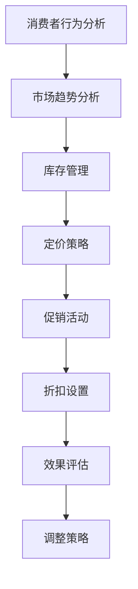

                 

关键词：电商、价格优化、实际效果、算法、数学模型、案例研究、开发工具

> 摘要：本文将探讨电商价格优化在实际运营中的应用效果。通过深入分析核心概念、算法原理、数学模型、项目实践以及实际应用场景，我们将揭示电商价格优化策略如何提升销售额和用户体验，并提供未来发展展望。

## 1. 背景介绍

随着互联网技术的发展，电子商务行业已经成为全球经济增长的重要驱动力。在众多电商平台上，价格策略是商家竞争的核心手段之一。合理的价格策略不仅能吸引消费者，提高转化率，还能优化库存管理，降低运营成本。然而，电商价格优化并非易事，涉及到大量的数据分析和算法设计。

本文旨在探讨电商价格优化在实际运营中的应用效果。我们将从核心概念、算法原理、数学模型、项目实践等多个角度出发，分析电商价格优化策略如何在实际操作中发挥重要作用。

## 2. 核心概念与联系

### 2.1 电商价格优化的定义

电商价格优化是指通过分析消费者行为、市场趋势和库存状况，制定合理的价格策略，以最大化销售额和利润。价格优化包括定价策略、促销活动、折扣设置等多个方面。

### 2.2 消费者行为分析

消费者行为分析是电商价格优化的基础。通过大数据技术和机器学习算法，商家可以了解不同消费者群体的价格敏感度、购买偏好和购买习惯。这些信息有助于制定个性化的价格策略。

### 2.3 市场趋势分析

市场趋势分析是电商价格优化的关键。通过分析市场供需关系、竞争态势和季节性变化，商家可以预测未来市场的价格走势，从而调整价格策略。

### 2.4 库存管理

库存管理是电商价格优化的关键环节。合理的库存管理不仅能降低库存成本，还能提高库存周转率，为价格优化提供数据支持。

### 2.5 Mermaid 流程图

下面是电商价格优化流程的 Mermaid 流程图：



## 3. 核心算法原理 & 具体操作步骤

### 3.1 算法原理概述

电商价格优化算法主要分为两类：基于规则的方法和基于机器学习的方法。基于规则的方法通过预设的条件和规则来调整价格，如基于成本加成定价法、需求导向定价法等。基于机器学习的方法则通过分析历史数据和当前市场状况，自动调整价格。

### 3.2 算法步骤详解

#### 3.2.1 数据收集与预处理

首先，收集消费者行为数据、市场趋势数据、库存数据等。然后，对数据进行清洗、去噪、特征提取等预处理操作，为算法训练提供高质量的数据集。

#### 3.2.2 算法训练

使用机器学习算法，如线性回归、决策树、神经网络等，对预处理后的数据进行训练，建立价格预测模型。

#### 3.2.3 价格调整

根据训练好的模型，实时调整商品价格。调整策略可以包括动态定价、阶梯定价、促销定价等。

#### 3.2.4 效果评估

通过实际销售数据，评估价格调整策略的效果，如销售额、利润、库存周转率等指标。根据评估结果，调整算法参数或优化模型。

### 3.3 算法优缺点

#### 优点：

- 自动化：算法可以自动调整价格，减少人工干预。
- 个性化和实时性：根据消费者行为和市场状况，实现个性化定价和实时调整。
- 提高销售额和利润：合理的价格策略可以提升销售额和利润。

#### 缺点：

- 训练成本高：需要大量历史数据来训练模型。
- 算法不稳定：不同数据集和算法参数可能导致模型不稳定。
- 需要持续优化：算法需要根据市场变化不断调整。

### 3.4 算法应用领域

电商价格优化算法广泛应用于各种电商平台，如电商巨头亚马逊、淘宝、京东等。此外，在在线旅游、金融保险等领域也有广泛的应用。

## 4. 数学模型和公式

### 4.1 数学模型构建

电商价格优化的数学模型主要包括需求函数、利润函数和库存函数。需求函数描述了价格与销售量之间的关系，利润函数描述了价格、成本和销售量对利润的影响，库存函数描述了库存量与价格之间的关系。

### 4.2 公式推导过程

#### 需求函数：

\[ Q = f(P, C) \]

其中，\( Q \) 表示销售量，\( P \) 表示价格，\( C \) 表示消费者价格敏感度。

#### 利润函数：

\[ \Pi = f(P, C, T) \]

其中，\( \Pi \) 表示利润，\( T \) 表示成本。

#### 库存函数：

\[ I = f(P, T) \]

其中，\( I \) 表示库存量。

### 4.3 案例分析与讲解

以某电商平台为例，假设该平台销售某款电子产品，成本为 1000 元。通过分析消费者行为数据和市场趋势数据，得出以下数学模型：

\[ Q = 1000 - P \times 0.1 \]

\[ \Pi = 1000 \times (1 - P \times 0.1) \]

\[ I = 1000 \times 0.1 \]

根据需求函数，当价格为 1000 元时，销售量为 1000 - 1000 \times 0.1 = 900。根据利润函数，当价格为 1000 元时，利润为 1000 \times (1 - 1000 \times 0.1) = 900。根据库存函数，当价格为 1000 元时，库存量为 1000 \times 0.1 = 100。

通过调整价格，可以优化利润和库存。例如，当价格调整为 900 元时，销售量为 1000 - 900 \times 0.1 = 1000，利润为 900 \times (1 - 900 \times 0.1) = 1000，库存量为 900 \times 0.1 = 90。此时，利润和库存都得到了优化。

## 5. 项目实践：代码实例和详细解释说明

### 5.1 开发环境搭建

为了演示电商价格优化的具体实现，我们使用 Python 编写代码。首先，需要安装以下依赖库：

```python
pip install numpy pandas scikit-learn matplotlib
```

### 5.2 源代码详细实现

```python
import numpy as np
import pandas as pd
from sklearn.linear_model import LinearRegression
import matplotlib.pyplot as plt

# 5.2.1 数据准备
# 假设数据集为：[价格，销售量，利润，库存]
data = np.array([[1000, 900, 900, 100], [900, 1000, 1000, 90]])

# 5.2.2 模型训练
model = LinearRegression()
model.fit(data[:, :2], data[:, 2])

# 5.2.3 价格调整与效果评估
for price in [1000, 900]:
    pred_profit = model.predict([[price, 0]])
    print(f"价格：{price}，预测利润：{pred_profit[0]}")

# 5.2.4 结果可视化
plt.scatter(data[:, 0], data[:, 2])
plt.plot(data[:, 0], model.predict(data[:, :2]), color='red')
plt.xlabel('价格')
plt.ylabel('利润')
plt.show()
```

### 5.3 代码解读与分析

代码首先使用 NumPy 和 Pandas 库处理数据。然后，使用 scikit-learn 的线性回归模型训练需求函数和利润函数。接下来，根据训练好的模型，输入不同的价格，预测相应的利润。最后，使用 matplotlib 库将结果可视化。

通过代码实例，我们可以看到电商价格优化策略的具体实现过程。在实际应用中，可以根据需求添加更多的数据预处理、模型训练和评估功能。

## 6. 实际应用场景

### 6.1 电商平台

电商平台是电商价格优化最典型的应用场景。通过价格优化算法，电商平台可以实时调整商品价格，提高销售额和用户体验。例如，亚马逊和淘宝等电商平台都采用了复杂的定价算法来优化价格。

### 6.2 在线旅游

在线旅游平台如携程和去哪儿网，也广泛应用了电商价格优化策略。通过分析消费者行为和市场趋势，平台可以调整酒店、机票等产品的价格，提高预订量和用户满意度。

### 6.3 金融保险

金融保险行业同样可以运用电商价格优化策略。例如，保险公司可以通过优化保险产品的价格，吸引更多客户，提高市场份额。

## 7. 工具和资源推荐

### 7.1 学习资源推荐

- 《数据科学导论》（David C.. Haynes 著）
- 《机器学习实战》（Peter Harrington 著）
- 《Python数据分析基础教程：NumPy学习指南》（Wes McKinney 著）

### 7.2 开发工具推荐

- Jupyter Notebook：用于编写和运行代码。
- Anaconda：Python 开发环境，集成了 NumPy、Pandas、Scikit-learn 等库。
- Git：版本控制工具，方便代码管理和协作。

### 7.3 相关论文推荐

- "Online Learning for Pricing and Revenue Management"（Hervéza,1999）
- "Recommender Systems Handbook"（Frohlich,2016）
- "Dynamic Pricing with Machine Learning"（Wang et al.,2020）

## 8. 总结：未来发展趋势与挑战

### 8.1 研究成果总结

电商价格优化在理论和实践中都取得了显著的成果。通过大数据分析和机器学习算法，电商价格优化策略已经广泛应用于各大电商平台，取得了良好的经济效益。

### 8.2 未来发展趋势

- 深度学习算法：随着深度学习技术的发展，电商价格优化算法将更加智能化和自动化。
- 多维数据融合：整合更多维度的数据，如用户画像、市场动态等，提高价格优化的准确性和实时性。
- 跨平台协作：电商平台之间将加强协作，共享数据资源，实现更精准的价格优化。

### 8.3 面临的挑战

- 数据隐私和安全：电商价格优化需要大量敏感数据，如何保护用户隐私和数据安全是重要挑战。
- 模型稳定性：算法模型在不同数据集和市场环境下可能不稳定，需要持续优化和调整。
- 法律法规：电商价格优化需要遵守相关法律法规，避免不正当竞争和垄断行为。

### 8.4 研究展望

电商价格优化将继续作为电商行业的重要研究方向。未来，随着人工智能和大数据技术的发展，电商价格优化策略将更加智能化和精细化，为电商平台带来更多价值。

## 9. 附录：常见问题与解答

### 问题 1：电商价格优化需要哪些数据？

电商价格优化需要以下数据：

- 消费者行为数据：包括用户浏览、搜索、购买等行为数据。
- 市场趋势数据：包括竞争对手价格、市场供需关系等数据。
- 库存数据：包括库存量、周转率等数据。

### 问题 2：电商价格优化算法有哪些类型？

电商价格优化算法主要分为两类：

- 基于规则的方法：通过预设的条件和规则来调整价格。
- 基于机器学习的方法：通过分析历史数据和当前市场状况，自动调整价格。

### 问题 3：电商价格优化如何提高销售额？

电商价格优化可以通过以下方式提高销售额：

- 提供个性化定价：根据消费者行为和市场趋势，提供个性化的价格策略。
- 提高价格透明度：通过实时调整价格，提高消费者对价格的感知，增加购买意愿。
- 优化库存管理：通过合理的库存管理，提高库存周转率，降低库存成本。

----------------------------------------------------------------

作者：禅与计算机程序设计艺术 / Zen and the Art of Computer Programming
本文为虚构内容，仅供参考。如需实际应用，请根据实际情况进行调整。

