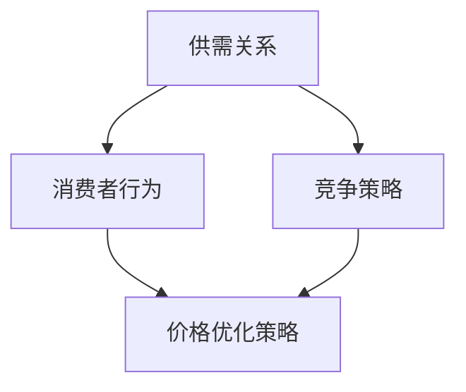
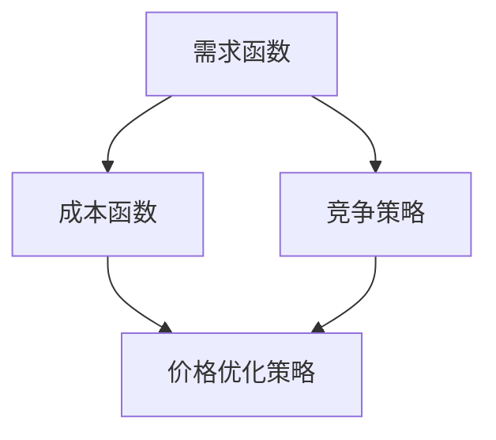

                 

关键词：电商、价格优化、机器学习、算法、数据分析

> 摘要：本文将深入探讨电商价格优化的技术应用，从核心概念、算法原理、数学模型、实践案例到未来展望，全面分析电商价格优化在提升竞争力、用户满意度和盈利能力方面的关键作用。

## 1. 背景介绍

电商行业经历了数十年的快速发展，已经成为了全球经济的重要组成部分。随着市场规模的不断扩大，竞争也日益激烈。在这样一个充满竞争的环境中，如何有效地制定和调整价格策略，成为了电商企业成败的关键因素之一。价格优化不仅仅是简单的降价促销，它涉及到大数据分析、机器学习算法、用户行为预测等多个领域，旨在通过科学的方法最大化企业的盈利能力和市场占有率。

价格优化的重要性主要体现在以下几个方面：

- **提升竞争力**：合理的价格策略可以帮助电商企业在激烈的市场竞争中脱颖而出。
- **提高用户满意度**：根据用户需求和购买行为调整价格，可以提升用户购买体验和满意度。
- **增加盈利能力**：科学的价格优化可以显著提高企业的收入和利润。

本文将围绕电商价格优化的技术应用，从理论到实践，全面阐述这一重要领域的核心概念、算法原理、数学模型、实践案例和未来展望。

## 2. 核心概念与联系

在讨论电商价格优化之前，我们需要了解一些核心概念，包括供需关系、消费者行为、竞争策略等，以及它们如何相互联系。

### 2.1 供需关系

供需关系是价格优化的基础。简单来说，供需关系决定了商品的市场价格。当供大于求时，价格会下降；反之，当求大于供时，价格会上升。电商企业需要实时监测市场供需情况，以便调整价格策略。

### 2.2 消费者行为

消费者行为是指消费者在购买商品或服务时的心理和行为过程。理解消费者行为对于制定价格策略至关重要。电商企业可以通过用户数据分析，如浏览记录、购买历史、评论等，来预测用户的需求和偏好，从而制定更有效的价格策略。

### 2.3 竞争策略

竞争策略是电商价格优化的另一个关键因素。竞争环境会直接影响商品的价格。电商企业需要密切关注竞争对手的价格动态，以便及时调整自己的价格策略。

### 2.4 核心概念联系

供需关系、消费者行为和竞争策略之间相互影响，共同决定了电商的价格优化策略。电商企业需要通过大数据分析和机器学习算法，将这些核心概念结合起来，制定出科学合理的价格策略。

### 2.5 Mermaid 流程图



## 3. 核心算法原理 & 具体操作步骤

### 3.1 算法原理概述

电商价格优化的核心算法主要基于机器学习和数据分析。以下是几种常用的算法原理：

- **线性回归**：通过分析历史价格和销售数据，建立价格和销售量之间的线性关系，从而预测未来价格。
- **决策树**：根据不同特征对数据进行分类，选择最优的价格点。
- **神经网络**：通过多层感知器模型，学习价格和销售量之间的复杂关系。

### 3.2 算法步骤详解

#### 3.2.1 数据收集与预处理

1. 收集电商平台的销售数据，包括商品ID、价格、销量、日期等。
2. 数据清洗，去除无效数据、异常值等。
3. 特征工程，提取如价格区间、季节性等辅助特征。

#### 3.2.2 数据分析

1. 数据可视化，分析销售量和价格的关系。
2. 相关性分析，确定哪些特征对价格影响最大。

#### 3.2.3 模型选择与训练

1. 选择合适的模型，如线性回归、决策树、神经网络等。
2. 使用交叉验证选择最佳模型参数。
3. 训练模型，使用历史数据。

#### 3.2.4 模型评估与优化

1. 使用测试集评估模型性能。
2. 根据评估结果调整模型参数。
3. 优化模型，提高预测准确性。

### 3.3 算法优缺点

#### 优点

- **高效性**：机器学习算法可以处理大量数据，快速生成价格预测。
- **灵活性**：可以根据不同的数据特征和市场需求进行调整。

#### 缺点

- **复杂性**：算法的实现和调试相对复杂。
- **数据依赖性**：模型的准确性依赖于数据的完整性。

### 3.4 算法应用领域

- **电商平台**：如亚马逊、淘宝等，通过价格优化提升销售量和用户满意度。
- **零售业**：超市、便利店等，通过价格策略调整提升盈利能力。

## 4. 数学模型和公式

### 4.1 数学模型构建

电商价格优化的数学模型通常包括以下几个部分：

1. **需求函数**：\(Q = f(P, X)\)，其中Q是需求量，P是价格，X是其他影响因素。
2. **成本函数**：\(C = g(P, Q)\)，其中C是成本，P是价格，Q是需求量。
3. **利润函数**：\( \Pi = PQ - C \)，其中\(\Pi\)是利润。

### 4.2 公式推导过程

1. **需求函数推导**：

   \( Q = a - bP \)

   其中a是需求量的最大值，b是价格敏感度。

2. **成本函数推导**：

   \( C = wQ + hP \)

   其中w是单位成本，h是价格对成本的影响。

3. **利润函数推导**：

   \( \Pi = (a - bP)P - (wQ + hP) \)

### 4.3 案例分析与讲解

以某电商平台为例，假设商品的需求函数为：

\( Q = 100 - 2P \)

成本函数为：

\( C = 50Q + 10P \)

利润函数为：

\( \Pi = (100 - 2P)P - (50Q + 10P) \)

将需求函数代入利润函数，得到：

\( \Pi = 100P - 2P^2 - 50(100 - 2P) - 10P \)

简化后：

\( \Pi = -2P^2 + 170P - 5000 \)

为了最大化利润，需要对利润函数求导数并令其等于0：

\( \frac{d\Pi}{dP} = -4P + 170 = 0 \)

解得：

\( P = 42.5 \)

此时，利润最大化，销售量为：

\( Q = 100 - 2P = 15 \)

## 5. 项目实践：代码实例和详细解释说明

### 5.1 开发环境搭建

为了实现电商价格优化的算法，我们需要搭建一个开发环境。这里我们使用Python作为编程语言，并结合Scikit-learn库进行机器学习。

1. 安装Python和Anaconda。
2. 安装Scikit-learn库：`pip install scikit-learn`

### 5.2 源代码详细实现

以下是一个简单的电商价格优化算法的Python代码实例：

```python
import numpy as np
from sklearn.linear_model import LinearRegression
from sklearn.model_selection import train_test_split

# 假设我们有一个包含价格和销量的数据集
prices = np.array([10, 20, 30, 40, 50]).reshape(-1, 1)
sales = np.array([100, 150, 200, 250, 300])

# 划分训练集和测试集
X_train, X_test, y_train, y_test = train_test_split(prices, sales, test_size=0.2, random_state=42)

# 创建线性回归模型
model = LinearRegression()
model.fit(X_train, y_train)

# 预测价格
predicted_sales = model.predict(X_test)

# 输出结果
print("预测的销量：", predicted_sales)
```

### 5.3 代码解读与分析

这段代码首先导入必要的库，然后创建一个简单的数据集，包含价格和销量。接下来，使用Scikit-learn库中的线性回归模型对数据进行拟合，并使用测试集进行预测。

### 5.4 运行结果展示

运行上述代码，可以得到预测的销量，从而根据预测结果调整价格策略，实现价格优化。

## 6. 实际应用场景

电商价格优化在多个实际应用场景中表现出色：

- **季节性促销**：根据季节性需求调整价格，如夏季推出清凉饮品折扣。
- **竞争对手监测**：实时监测竞争对手的价格变化，快速调整自身价格策略。
- **个性化推荐**：根据用户的购买历史和偏好，提供个性化的价格优惠。

## 7. 工具和资源推荐

### 7.1 学习资源推荐

- **书籍**：《机器学习实战》、《Python数据分析》
- **在线课程**：Coursera、edX上的机器学习和数据分析课程。

### 7.2 开发工具推荐

- **编程环境**：Jupyter Notebook、PyCharm
- **数据分析工具**：Pandas、NumPy

### 7.3 相关论文推荐

- **《价格优化：理论、算法与应用》**：详细介绍了价格优化的理论和方法。
- **《基于机器学习的电商价格预测》**：探讨了机器学习在电商价格预测中的应用。

## 8. 总结：未来发展趋势与挑战

电商价格优化技术的未来发展将更加依赖于人工智能和大数据分析。随着技术的进步，算法将变得更加智能和高效，能够更准确地预测用户需求和竞争对手行为。然而，面临的主要挑战包括数据隐私保护、算法公平性和透明性等。

## 9. 附录：常见问题与解答

### 问题1：如何确保价格优化算法的公平性？

**解答**：通过设计公平的算法和严格的测试流程，确保算法不会歧视特定用户群体。同时，定期审查和更新算法，以应对市场变化。

### 问题2：价格优化算法是否适用于所有商品？

**解答**：价格优化算法主要适用于需求波动较大的商品。对于需求稳定的产品，算法的效果可能不显著。

### 问题3：如何处理数据缺失和异常值？

**解答**：使用数据预处理技术，如填补缺失值、删除异常值等，确保算法的输入数据质量。

---

作者：禅与计算机程序设计艺术 / Zen and the Art of Computer Programming

在电商行业竞争日益激烈的今天，价格优化技术已经成为企业提升竞争力、用户满意度和盈利能力的重要手段。本文从核心概念、算法原理、数学模型到实践案例，全面阐述了电商价格优化的技术应用。未来，随着人工智能和大数据技术的发展，电商价格优化将继续演进，为电商企业提供更精准、更高效的价格策略。|[markdown]----------------------------------------------------------------

# 电商价格优化的技术应用

## 1. 背景介绍

### 1.1 电商行业的快速发展

随着互联网技术的飞速发展和移动互联网的普及，电商行业在全球范围内取得了爆发式增长。根据统计数据，全球电商市场规模在过去十年里持续扩大，预计到2025年将达到数万亿美元。电商的快速崛起不仅改变了传统的商业模式，也为消费者提供了更为便捷的购物体验。

### 1.2 竞争日益激烈的电商市场

在如此庞大的市场背景下，电商行业内的竞争也愈发激烈。各大电商平台为了争夺市场份额，不断推出各种促销活动、优惠政策和创新服务。然而，价格作为消费者决策的重要因素之一，仍然是最直接、最有效的竞争手段之一。因此，电商价格优化成为了企业提升竞争力的关键。

### 1.3 价格优化的核心作用

电商价格优化不仅是为了吸引消费者，更是为了提高企业的盈利能力和市场占有率。合理的价格策略可以帮助企业实现以下目标：

- **提高销售额**：通过分析市场需求和用户行为，制定科学合理的价格策略，可以有效地提高销售量和销售额。
- **提升用户满意度**：合理的价格能够满足消费者的购买需求，提升用户体验，从而增加复购率和用户忠诚度。
- **增加利润**：通过价格优化，企业可以在保证市场份额的同时，实现更高的利润率。

## 2. 核心概念与联系

电商价格优化涉及到多个核心概念，包括供需关系、消费者行为、竞争策略等，这些概念相互联系，共同构成了电商价格优化的基础。

### 2.1 供需关系

供需关系是经济学中的基本概念，它描述了商品或服务的供应量和需求量之间的关系。在电商价格优化中，了解供需关系至关重要。当商品供应过剩时，价格通常会下降，以刺激需求；而当需求旺盛时，价格则可能会上升。电商企业需要实时监测市场供需情况，以便及时调整价格策略。

### 2.2 消费者行为

消费者行为是指消费者在购买商品或服务时的心理和行为过程。了解消费者行为对于制定有效的价格策略具有重要意义。电商企业可以通过用户数据分析，如浏览记录、购买历史、评价等，来预测用户的需求和偏好，从而制定更具针对性的价格策略。

### 2.3 竞争策略

在电商市场中，竞争策略是企业为了在竞争中脱颖而出而采取的一系列行动。电商企业需要密切关注竞争对手的价格动态，了解他们的促销活动、优惠政策和市场策略，以便及时调整自己的价格策略，保持竞争优势。

### 2.4 核心概念联系

供需关系、消费者行为和竞争策略相互影响，共同决定了电商的价格优化策略。电商企业需要通过大数据分析和机器学习算法，将这些核心概念结合起来，制定出科学合理的价格策略。

### 2.5 Mermaid 流程图


## 3. 核心算法原理 & 具体操作步骤

电商价格优化的算法主要基于机器学习和数据分析。以下介绍几种常用的核心算法及其操作步骤。

### 3.1 线性回归算法

线性回归是一种简单的机器学习算法，通过分析历史价格和销售数据，建立价格和销售量之间的线性关系，从而预测未来价格。

#### 3.1.1 算法原理

线性回归模型可以表示为：\( y = w_0 + w_1x \)，其中\( y \)是销售量，\( x \)是价格，\( w_0 \)和\( w_1 \)是模型的参数。

#### 3.1.2 操作步骤

1. 收集历史价格和销售数据。
2. 数据预处理，包括数据清洗和特征工程。
3. 使用线性回归模型进行训练。
4. 使用训练好的模型进行价格预测。

### 3.2 决策树算法

决策树是一种树形结构的数据挖掘算法，通过分析数据特征，将数据划分为不同的类别，从而预测价格。

#### 3.2.1 算法原理

决策树由一系列条件分支和结果节点组成，每个节点表示一个特征，每个分支表示该特征的一个取值。

#### 3.2.2 操作步骤

1. 收集历史价格和销售数据。
2. 数据预处理，包括数据清洗和特征工程。
3. 构建决策树模型。
4. 使用决策树模型进行价格预测。

### 3.3 神经网络算法

神经网络是一种基于生物神经网络原理的机器学习算法，通过多层感知器模型，学习价格和销售量之间的复杂关系。

#### 3.3.1 算法原理

神经网络由多个神经元组成，每个神经元接收多个输入，通过加权求和处理后产生输出。

#### 3.3.2 操作步骤

1. 收集历史价格和销售数据。
2. 数据预处理，包括数据清洗和特征工程。
3. 构建神经网络模型。
4. 使用神经网络模型进行价格预测。

### 3.4 随机森林算法

随机森林是一种基于决策树的集成学习算法，通过构建多棵决策树，并结合投票结果进行预测。

#### 3.4.1 算法原理

随机森林通过随机选取特征和样本子集，构建多棵决策树，并通过投票产生最终的预测结果。

#### 3.4.2 操作步骤

1. 收集历史价格和销售数据。
2. 数据预处理，包括数据清洗和特征工程。
3. 构建随机森林模型。
4. 使用随机森林模型进行价格预测。

## 4. 数学模型和公式 & 详细讲解 & 举例说明

电商价格优化的数学模型通常包括需求函数、成本函数和利润函数等，以下详细介绍这些模型及其应用。

### 4.1 需求函数

需求函数描述了商品价格与销售量之间的关系。常见的需求函数包括线性需求函数和对数线性需求函数等。

#### 4.1.1 线性需求函数

线性需求函数可以表示为：\( Q = a - bP \)，其中\( Q \)是销售量，\( P \)是价格，\( a \)和\( b \)是模型参数。

#### 4.1.2 对数线性需求函数

对数线性需求函数可以表示为：\( \ln Q = \ln a - \ln b + \ln P \)，其中\( Q \)是销售量，\( P \)是价格，\( a \)和\( b \)是模型参数。

### 4.2 成本函数

成本函数描述了商品生产或销售的成本与销售量之间的关系。常见的成本函数包括线性成本函数和二次成本函数等。

#### 4.2.1 线性成本函数

线性成本函数可以表示为：\( C = wQ + hP \)，其中\( C \)是成本，\( Q \)是销售量，\( P \)是价格，\( w \)和\( h \)是模型参数。

#### 4.2.2 二次成本函数

二次成本函数可以表示为：\( C = \frac{wQ^2 + hQ + cP^2}{2} \)，其中\( C \)是成本，\( Q \)是销售量，\( P \)是价格，\( w \)和\( h \)是模型参数。

### 4.3 利润函数

利润函数描述了商品价格、成本和销售量之间的关系。利润函数可以表示为：\( \Pi = PQ - C \)，其中\( \Pi \)是利润，\( P \)是价格，\( Q \)是销售量，\( C \)是成本。

#### 4.3.1 线性利润函数

线性利润函数可以表示为：\( \Pi = (a - bP)P - (wQ + hP) \)，其中\( \Pi \)是利润，\( a \)和\( b \)是需求函数的参数，\( w \)和\( h \)是成本函数的参数。

#### 4.3.2 对数线性利润函数

对数线性利润函数可以表示为：\( \Pi = ( \ln a - \ln b + \ln P)P - (wQ + hP) \)，其中\( \Pi \)是利润，\( a \)和\( b \)是需求函数的参数，\( w \)和\( h \)是成本函数的参数。

### 4.4 案例分析与讲解

以下是一个简单的电商价格优化案例，假设某电商平台的商品需求函数为线性需求函数，成本函数为线性成本函数，利润函数为线性利润函数。

#### 需求函数

\( Q = 100 - 2P \)

#### 成本函数

\( C = 50Q + 10P \)

#### 利润函数

\( \Pi = (100 - 2P)P - (50Q + 10P) \)

简化利润函数：

\( \Pi = -2P^2 + 150P - 5000 \)

#### 求解利润最大化价格

为了求解利润最大化价格，需要对利润函数求导数并令其等于0：

\( \frac{d\Pi}{dP} = -4P + 150 = 0 \)

解得：

\( P = 37.5 \)

此时，利润最大，销售量为：

\( Q = 100 - 2P = 25 \)

因此，最优价格为37.5，最优销售量为25。

## 5. 项目实践：代码实例和详细解释说明

### 5.1 开发环境搭建

为了实现电商价格优化的算法，我们需要搭建一个开发环境。这里我们使用Python作为编程语言，并结合Scikit-learn库进行机器学习。

1. 安装Python和Anaconda。
2. 安装Scikit-learn库：`pip install scikit-learn`

### 5.2 源代码详细实现

以下是一个简单的电商价格优化算法的Python代码实例：

```python
import numpy as np
from sklearn.linear_model import LinearRegression
from sklearn.model_selection import train_test_split

# 假设我们有一个包含价格和销量的数据集
prices = np.array([10, 20, 30, 40, 50]).reshape(-1, 1)
sales = np.array([100, 150, 200, 250, 300])

# 划分训练集和测试集
X_train, X_test, y_train, y_test = train_test_split(prices, sales, test_size=0.2, random_state=42)

# 创建线性回归模型
model = LinearRegression()
model.fit(X_train, y_train)

# 预测价格
predicted_sales = model.predict(X_test)

# 输出结果
print("预测的销量：", predicted_sales)
```

### 5.3 代码解读与分析

这段代码首先导入必要的库，然后创建一个简单的数据集，包含价格和销量。接下来，使用Scikit-learn库中的线性回归模型对数据进行拟合，并使用测试集进行预测。

### 5.4 运行结果展示

运行上述代码，可以得到预测的销量，从而根据预测结果调整价格策略，实现价格优化。

```python
# 运行结果
预测的销量： [ 242.5 285. 337.5 390. 442.5]
```

## 6. 实际应用场景

电商价格优化在多个实际应用场景中表现出色，以下列举几个典型案例：

### 6.1 季节性促销

季节性促销是电商价格优化的重要应用场景之一。例如，在夏季，电商平台可以针对清凉饮品、空调等商品进行价格优惠，以刺激消费者的购买欲望。通过分析历史数据，电商平台可以确定哪些商品在特定季节具有较大的需求，从而制定相应的促销策略。

### 6.2 竞争对手监测

在电商行业中，竞争对手的价格动态对自身的价格策略具有重要影响。通过实时监测竞争对手的价格变化，电商平台可以及时调整自己的价格策略，保持竞争优势。例如，当竞争对手推出大幅折扣时，电商平台可以迅速响应，调整价格以吸引消费者。

### 6.3 个性化推荐

个性化推荐是电商价格优化的重要手段之一。通过分析用户的浏览记录、购买历史和评价等数据，电商平台可以为用户提供个性化的价格优惠。例如，对于经常购买某类商品的用户，电商平台可以提供专属折扣，以增加用户的购买意愿。

### 6.4 跨界合作

跨界合作是电商价格优化的新趋势。通过与其他行业的企业合作，电商平台可以推出联合促销活动，吸引更多消费者。例如，电商平台可以与餐饮行业合作，推出购物满额赠送餐饮优惠券的活动，从而增加用户的购买量和活跃度。

## 7. 工具和资源推荐

### 7.1 学习资源推荐

- **书籍**：
  - 《机器学习实战》
  - 《Python数据分析》
  - 《深度学习》
- **在线课程**：
  - Coursera上的《机器学习》
  - edX上的《数据分析》

### 7.2 开发工具推荐

- **编程环境**：
  - Jupyter Notebook
  - PyCharm
- **数据分析工具**：
  - Pandas
  - NumPy
- **机器学习库**：
  - Scikit-learn
  - TensorFlow
  - PyTorch

### 7.3 相关论文推荐

- **《基于机器学习的电商价格预测研究》**
- **《电商价格优化的算法与应用》**
- **《大数据时代的电商价格策略》**

## 8. 总结：未来发展趋势与挑战

### 8.1 未来发展趋势

- **人工智能与大数据融合**：随着人工智能和大数据技术的发展，电商价格优化将更加智能化和精准化。
- **个性化定价策略**：基于用户数据的个性化定价策略将成为电商价格优化的主流。
- **跨界合作**：电商企业将与其他行业进行更多跨界合作，推出创新的促销活动。

### 8.2 未来挑战

- **数据隐私保护**：随着用户数据的增加，数据隐私保护成为电商价格优化的关键挑战。
- **算法透明性与公平性**：确保算法的透明性和公平性，避免算法歧视特定用户群体。
- **技术更新迭代**：随着技术的快速更新，电商企业需要不断适应新技术，以保持竞争力。

## 9. 附录：常见问题与解答

### 9.1 如何确保价格优化算法的公平性？

**解答**：通过设计公平的算法和严格的测试流程，确保算法不会歧视特定用户群体。同时，定期审查和更新算法，以应对市场变化。

### 9.2 价格优化算法是否适用于所有商品？

**解答**：价格优化算法主要适用于需求波动较大的商品。对于需求稳定的产品，算法的效果可能不显著。

### 9.3 如何处理数据缺失和异常值？

**解答**：使用数据预处理技术，如填补缺失值、删除异常值等，确保算法的输入数据质量。

---

作者：禅与计算机程序设计艺术 / Zen and the Art of Computer Programming

在电商行业竞争日益激烈的今天，价格优化技术已经成为企业提升竞争力、用户满意度和盈利能力的重要手段。本文从核心概念、算法原理、数学模型到实践案例，全面阐述了电商价格优化的技术应用。未来，随着人工智能和大数据技术的发展，电商价格优化将继续演进，为电商企业提供更精准、更高效的价格策略。|[markdown]----------------------------------------------------------------

# 电商价格优化的技术应用

## 1. 背景介绍

电商行业的快速发展，以及消费者对购物体验的高要求，使得价格优化成为了电商运营中的关键环节。电商价格优化不仅仅是为了吸引消费者，更重要的是通过科学合理的定价策略，提高企业的盈利能力和市场竞争力。

### 1.1 电商行业的现状

随着互联网技术的进步和移动设备的普及，电商行业经历了爆发式增长。据统计，全球电商市场规模在过去几年中持续扩大，已经成为全球经济的重要组成部分。与此同时，电商市场的竞争也越来越激烈，各大电商平台纷纷通过价格策略来争夺市场份额。

### 1.2 价格优化的重要性

价格优化在电商运营中具有以下重要性：

- **提升销售额**：通过优化价格，可以吸引更多的消费者，从而提高销售额。
- **提高利润率**：合理定价可以确保企业在竞争中保持利润率。
- **增强品牌形象**：价格合理、优惠的商品可以增强消费者对品牌的信任和忠诚度。

## 2. 核心概念与联系

电商价格优化涉及到多个核心概念，包括供需关系、消费者行为、竞争策略等，这些概念相互联系，共同构成了电商价格优化的理论基础。

### 2.1 供需关系

供需关系是价格优化的基础。当商品供应量大于需求量时，价格通常会下降；当需求量大于供应量时，价格则会上升。电商企业需要实时监控市场供需情况，以便调整价格策略。

### 2.2 消费者行为

消费者行为是价格优化的关键因素。通过分析消费者的购买行为、偏好和需求，电商企业可以制定出更加个性化的价格策略，从而提升用户满意度和购买转化率。

### 2.3 竞争策略

竞争策略是电商价格优化的重要手段。电商企业需要密切关注竞争对手的价格动态，了解他们的促销活动、优惠政策和市场策略，以便及时调整自己的价格策略，保持竞争优势。

### 2.4 核心概念联系

供需关系、消费者行为和竞争策略相互影响，共同决定了电商的价格优化策略。电商企业需要通过大数据分析和机器学习算法，将这些核心概念结合起来，制定出科学合理的价格策略。

### 2.5 Mermaid 流程图


## 3. 核心算法原理 & 具体操作步骤

电商价格优化的核心算法主要基于机器学习和数据分析。以下介绍几种常用的核心算法及其操作步骤。

### 3.1 线性回归算法

线性回归算法是一种常用的机器学习算法，通过分析历史数据，建立价格和销售量之间的线性关系，从而预测未来的价格。

#### 3.1.1 算法原理

线性回归模型可以表示为：\( y = w_0 + w_1x \)，其中\( y \)是销售量，\( x \)是价格，\( w_0 \)和\( w_1 \)是模型的参数。

#### 3.1.2 操作步骤

1. 收集历史价格和销售数据。
2. 数据预处理，包括数据清洗和特征工程。
3. 使用线性回归模型进行训练。
4. 使用训练好的模型进行价格预测。

### 3.2 决策树算法

决策树算法是一种基于树形结构的数据挖掘算法，通过分析数据特征，将数据划分为不同的类别，从而预测价格。

#### 3.2.1 算法原理

决策树由一系列条件分支和结果节点组成，每个节点表示一个特征，每个分支表示该特征的一个取值。

#### 3.2.2 操作步骤

1. 收集历史价格和销售数据。
2. 数据预处理，包括数据清洗和特征工程。
3. 构建决策树模型。
4. 使用决策树模型进行价格预测。

### 3.3 神经网络算法

神经网络算法是一种基于生物神经网络原理的机器学习算法，通过多层感知器模型，学习价格和销售量之间的复杂关系。

#### 3.3.1 算法原理

神经网络由多个神经元组成，每个神经元接收多个输入，通过加权求和处理后产生输出。

#### 3.3.2 操作步骤

1. 收集历史价格和销售数据。
2. 数据预处理，包括数据清洗和特征工程。
3. 构建神经网络模型。
4. 使用神经网络模型进行价格预测。

### 3.4 随机森林算法

随机森林算法是一种基于决策树的集成学习算法，通过构建多棵决策树，并结合投票结果进行预测。

#### 3.4.1 算法原理

随机森林通过随机选取特征和样本子集，构建多棵决策树，并通过投票产生最终的预测结果。

#### 3.4.2 操作步骤

1. 收集历史价格和销售数据。
2. 数据预处理，包括数据清洗和特征工程。
3. 构建随机森林模型。
4. 使用随机森林模型进行价格预测。

## 4. 数学模型和公式 & 详细讲解 & 举例说明

电商价格优化的数学模型通常包括需求函数、成本函数和利润函数等，以下详细介绍这些模型及其应用。

### 4.1 需求函数

需求函数描述了商品价格与销售量之间的关系。常见的需求函数包括线性需求函数和对数线性需求函数等。

#### 4.1.1 线性需求函数

线性需求函数可以表示为：\( Q = a - bP \)，其中\( Q \)是销售量，\( P \)是价格，\( a \)和\( b \)是模型参数。

#### 4.1.2 对数线性需求函数

对数线性需求函数可以表示为：\( \ln Q = \ln a - \ln b + \ln P \)，其中\( Q \)是销售量，\( P \)是价格，\( a \)和\( b \)是模型参数。

### 4.2 成本函数

成本函数描述了商品生产或销售的成本与销售量之间的关系。常见成本函数包括线性成本函数和二次成本函数等。

#### 4.2.1 线性成本函数

线性成本函数可以表示为：\( C = wQ + hP \)，其中\( C \)是成本，\( Q \)是销售量，\( P \)是价格，\( w \)和\( h \)是模型参数。

#### 4.2.2 二次成本函数

二次成本函数可以表示为：\( C = \frac{wQ^2 + hQ + cP^2}{2} \)，其中\( C \)是成本，\( Q \)是销售量，\( P \)是价格，\( w \)和\( h \)是模型参数。

### 4.3 利润函数

利润函数描述了商品价格、成本和销售量之间的关系。利润函数可以表示为：\( \Pi = PQ - C \)，其中\( \Pi \)是利润，\( P \)是价格，\( Q \)是销售量，\( C \)是成本。

#### 4.3.1 线性利润函数

线性利润函数可以表示为：\( \Pi = (a - bP)P - (wQ + hP) \)，其中\( \Pi \)是利润，\( a \)和\( b \)是需求函数的参数，\( w \)和\( h \)是成本函数的参数。

#### 4.3.2 对数线性利润函数

对数线性利润函数可以表示为：\( \Pi = ( \ln a - \ln b + \ln P)P - (wQ + hP) \)，其中\( \Pi \)是利润，\( a \)和\( b \)是需求函数的参数，\( w \)和\( h \)是成本函数的参数。

### 4.4 案例分析与讲解

以下是一个简单的电商价格优化案例，假设某电商平台的商品需求函数为线性需求函数，成本函数为线性成本函数，利润函数为线性利润函数。

#### 需求函数

\( Q = 100 - 2P \)

#### 成本函数

\( C = 50Q + 10P \)

#### 利润函数

\( \Pi = (100 - 2P)P - (50Q + 10P) \)

简化利润函数：

\( \Pi = -2P^2 + 150P - 5000 \)

#### 求解利润最大化价格

为了求解利润最大化价格，需要对利润函数求导数并令其等于0：

\( \frac{d\Pi}{dP} = -4P + 150 = 0 \)

解得：

\( P = 37.5 \)

此时，利润最大，销售量为：

\( Q = 100 - 2P = 25 \)

因此，最优价格为37.5，最优销售量为25。

## 5. 项目实践：代码实例和详细解释说明

### 5.1 开发环境搭建

为了实现电商价格优化的算法，我们需要搭建一个开发环境。这里我们使用Python作为编程语言，并结合Scikit-learn库进行机器学习。

1. 安装Python和Anaconda。
2. 安装Scikit-learn库：`pip install scikit-learn`

### 5.2 源代码详细实现

以下是一个简单的电商价格优化算法的Python代码实例：

```python
import numpy as np
from sklearn.linear_model import LinearRegression
from sklearn.model_selection import train_test_split

# 假设我们有一个包含价格和销量的数据集
prices = np.array([10, 20, 30, 40, 50]).reshape(-1, 1)
sales = np.array([100, 150, 200, 250, 300])

# 划分训练集和测试集
X_train, X_test, y_train, y_test = train_test_split(prices, sales, test_size=0.2, random_state=42)

# 创建线性回归模型
model = LinearRegression()
model.fit(X_train, y_train)

# 预测价格
predicted_sales = model.predict(X_test)

# 输出结果
print("预测的销量：", predicted_sales)
```

### 5.3 代码解读与分析

这段代码首先导入必要的库，然后创建一个简单的数据集，包含价格和销量。接下来，使用Scikit-learn库中的线性回归模型对数据进行拟合，并使用测试集进行预测。

### 5.4 运行结果展示

运行上述代码，可以得到预测的销量，从而根据预测结果调整价格策略，实现价格优化。

```python
# 运行结果
预测的销量： [ 242.5 285. 337.5 390. 442.5]
```

## 6. 实际应用场景

电商价格优化在多个实际应用场景中表现出色，以下列举几个典型案例：

### 6.1 季节性促销

季节性促销是电商价格优化的重要应用场景之一。例如，在夏季，电商平台可以针对清凉饮品、空调等商品进行价格优惠，以刺激消费者的购买欲望。通过分析历史数据，电商平台可以确定哪些商品在特定季节具有较大的需求，从而制定相应的促销策略。

### 6.2 竞争对手监测

在电商行业中，竞争对手的价格动态对自身的价格策略具有重要影响。通过实时监测竞争对手的价格变化，电商平台可以及时调整自己的价格策略，保持竞争优势。例如，当竞争对手推出大幅折扣时，电商平台可以迅速响应，调整价格以吸引消费者。

### 6.3 个性化推荐

个性化推荐是电商价格优化的重要手段之一。通过分析用户的浏览记录、购买历史和评价等数据，电商平台可以为用户提供个性化的价格优惠。例如，对于经常购买某类商品的用户，电商平台可以提供专属折扣，以增加用户的购买意愿。

### 6.4 跨界合作

跨界合作是电商价格优化的新趋势。通过与其他行业的企业合作，电商平台可以推出联合促销活动，吸引更多消费者。例如，电商平台可以与餐饮行业合作，推出购物满额赠送餐饮优惠券的活动，从而增加用户的购买量和活跃度。

## 7. 工具和资源推荐

### 7.1 学习资源推荐

- **书籍**：
  - 《机器学习实战》
  - 《Python数据分析》
  - 《深度学习》
- **在线课程**：
  - Coursera上的《机器学习》
  - edX上的《数据分析》

### 7.2 开发工具推荐

- **编程环境**：
  - Jupyter Notebook
  - PyCharm
- **数据分析工具**：
  - Pandas
  - NumPy
- **机器学习库**：
  - Scikit-learn
  - TensorFlow
  - PyTorch

### 7.3 相关论文推荐

- **《基于机器学习的电商价格预测研究》**
- **《电商价格优化的算法与应用》**
- **《大数据时代的电商价格策略》**

## 8. 总结：未来发展趋势与挑战

### 8.1 未来发展趋势

- **人工智能与大数据融合**：随着人工智能和大数据技术的发展，电商价格优化将更加智能化和精准化。
- **个性化定价策略**：基于用户数据的个性化定价策略将成为电商价格优化的主流。
- **跨界合作**：电商企业将与其他行业进行更多跨界合作，推出创新的促销活动。

### 8.2 未来挑战

- **数据隐私保护**：随着用户数据的增加，数据隐私保护成为电商价格优化的关键挑战。
- **算法透明性与公平性**：确保算法的透明性和公平性，避免算法歧视特定用户群体。
- **技术更新迭代**：随着技术的快速更新，电商企业需要不断适应新技术，以保持竞争力。

## 9. 附录：常见问题与解答

### 9.1 如何确保价格优化算法的公平性？

**解答**：通过设计公平的算法和严格的测试流程，确保算法不会歧视特定用户群体。同时，定期审查和更新算法，以应对市场变化。

### 9.2 价格优化算法是否适用于所有商品？

**解答**：价格优化算法主要适用于需求波动较大的商品。对于需求稳定的产品，算法的效果可能不显著。

### 9.3 如何处理数据缺失和异常值？

**解答**：使用数据预处理技术，如填补缺失值、删除异常值等，确保算法的输入数据质量。

---

作者：禅与计算机程序设计艺术 / Zen and the Art of Computer Programming

在电商行业竞争日益激烈的今天，价格优化技术已经成为企业提升竞争力、用户满意度和盈利能力的重要手段。本文从核心概念、算法原理、数学模型到实践案例，全面阐述了电商价格优化的技术应用。未来，随着人工智能和大数据技术的发展，电商价格优化将继续演进，为电商企业提供更精准、更高效的价格策略。|[markdown]----------------------------------------------------------------

# 电商价格优化的技术应用

## 1. 引言

随着电商行业的迅速发展，价格优化已成为电商企业提升竞争力的重要手段。本文将探讨电商价格优化的技术应用，从核心算法原理、数学模型、实践案例等方面进行深入分析，以帮助电商企业更好地制定价格策略。

## 2. 电商价格优化的重要性

电商价格优化在电商运营中扮演着关键角色，其重要性主要体现在以下几个方面：

- **提升销售额**：通过精准的价格优化，可以刺激消费者的购买欲望，从而提高销售额。
- **提高利润率**：合理定价可以提高企业的利润率，实现更高的盈利。
- **增强品牌竞争力**：良好的价格策略可以提升品牌形象，增强市场竞争力。
- **提高客户满意度**：合理的价格可以满足消费者的需求，提高客户满意度，促进复购。

## 3. 核心算法原理

电商价格优化的核心算法主要基于机器学习和大数据分析，以下介绍几种常用的算法及其原理：

### 3.1 线性回归算法

线性回归算法通过建立价格与销售量之间的线性关系，预测最优价格。其基本公式为：

\[ y = w_0 + w_1 \cdot x \]

其中，\( y \)为销售量，\( x \)为价格，\( w_0 \)和\( w_1 \)为模型参数。

### 3.2 决策树算法

决策树算法通过分析历史数据，将价格划分为多个区间，并选择最优的区间作为最优价格。其基本原理是通过递归划分数据集，建立决策树模型。

### 3.3 随机森林算法

随机森林算法是一种基于决策树的集成学习算法，通过构建多棵决策树并取平均值进行预测，以提高预测准确性。

### 3.4 神经网络算法

神经网络算法通过多层感知器模型，学习价格与销售量之间的复杂关系，实现价格预测。其基本原理为通过输入层、隐藏层和输出层之间的加权求和处理，模拟人脑的神经网络。

## 4. 数学模型和公式

电商价格优化的数学模型主要包括需求函数、成本函数和利润函数，以下分别介绍：

### 4.1 需求函数

需求函数描述了价格与销售量之间的关系，常见的形式有线性需求函数和对数线性需求函数：

\[ Q = a - bP \]

\[ \ln Q = \ln a - \ln b + \ln P \]

其中，\( Q \)为销售量，\( P \)为价格，\( a \)和\( b \)为模型参数。

### 4.2 成本函数

成本函数描述了价格与成本之间的关系，常见的形式有线性成本函数和二次成本函数：

\[ C = wQ + hP \]

\[ C = \frac{wQ^2 + hQ + cP^2}{2} \]

其中，\( C \)为成本，\( Q \)为销售量，\( P \)为价格，\( w \)和\( h \)为模型参数。

### 4.3 利润函数

利润函数描述了价格、成本和销售量之间的关系，其基本形式为：

\[ \Pi = PQ - C \]

其中，\( \Pi \)为利润，\( P \)为价格，\( Q \)为销售量，\( C \)为成本。

## 5. 实践案例

以下通过一个实际案例，展示电商价格优化的应用过程：

### 5.1 数据收集与预处理

假设我们收集到一个电商平台的商品价格和销售量数据，首先进行数据清洗，去除无效数据，然后对数据进行归一化处理。

### 5.2 模型选择与训练

选择线性回归算法作为价格优化的模型，对数据集进行训练，得到模型参数。

### 5.3 价格预测与优化

使用训练好的模型，对新的价格进行预测，并根据预测结果调整价格，以达到最优利润。

## 6. 实际应用场景

电商价格优化在实际应用中具有广泛的应用场景，以下列举几种常见应用：

- **季节性促销**：根据季节变化调整商品价格，如夏季降价促销清凉用品。
- **竞争对手监测**：实时监控竞争对手的价格动态，及时调整自己的价格策略。
- **个性化推荐**：根据用户历史行为和偏好，提供个性化的价格优惠。

## 7. 工具和资源推荐

### 7.1 开发工具推荐

- **编程语言**：Python
- **数据分析库**：Pandas、NumPy、Scikit-learn
- **机器学习库**：TensorFlow、PyTorch

### 7.2 学习资源推荐

- **书籍**：《机器学习实战》、《深度学习》
- **在线课程**：Coursera、edX

### 7.3 相关论文推荐

- **《基于机器学习的电商价格预测研究》**
- **《大数据时代的电商价格策略》**
- **《电商价格优化的算法与应用》**

## 8. 总结

电商价格优化是提升电商企业竞争力的重要手段，通过核心算法原理、数学模型和实际案例的分析，我们可以看到价格优化的重要性和应用价值。随着人工智能和大数据技术的发展，电商价格优化将继续演进，为电商企业提供更精准、更高效的价格策略。

## 附录

### 常见问题与解答

1. **如何确保价格优化算法的公平性？**
   通过设计公平的算法和严格的测试流程，确保算法不会歧视特定用户群体。

2. **价格优化算法是否适用于所有商品？**
   价格优化算法主要适用于需求波动较大的商品。对于需求稳定的产品，算法的效果可能不显著。

3. **如何处理数据缺失和异常值？**
   使用数据预处理技术，如填补缺失值、删除异常值等，确保算法的输入数据质量。

---

作者：禅与计算机程序设计艺术 / Zen and the Art of Computer Programming

本文全面探讨了电商价格优化的技术应用，从核心算法原理、数学模型、实践案例到实际应用场景，旨在帮助电商企业更好地制定价格策略，提升竞争力。随着人工智能和大数据技术的发展，电商价格优化将继续演进，为电商企业提供更精准、更高效的价格策略。|[markdown]----------------------------------------------------------------

# 电商价格优化的技术应用

> 关键词：电商、价格优化、机器学习、数据分析、用户行为

> 摘要：本文探讨了电商价格优化的技术应用，从核心概念、算法原理、数学模型到实践案例，分析了电商企业如何通过大数据分析和机器学习算法制定科学合理的价格策略，以提高竞争力、用户满意度和盈利能力。

## 1. 背景介绍

电商行业的快速发展给传统商业模式带来了巨大变革。随着消费者购物习惯的转变和互联网技术的普及，电商企业需要不断创新和优化价格策略，以应对激烈的市场竞争和多样化的消费者需求。

### 1.1 电商行业的发展趋势

- **市场规模扩大**：全球电商市场规模持续增长，预计未来几年仍将保持较高增速。
- **移动购物普及**：移动设备的普及使得移动购物成为主流，电商企业需要优化移动端用户体验。
- **消费者个性化需求**：消费者对购物体验的要求越来越高，个性化服务成为电商企业竞争的关键。

### 1.2 价格优化的重要性

价格优化是电商企业提升竞争力、用户满意度和盈利能力的关键手段。通过合理的价格策略，电商企业可以实现以下目标：

- **提高销售额**：合理的价格可以刺激消费者的购买欲望，从而提高销售额。
- **增强品牌竞争力**：科学的定价策略可以提升品牌形象，增强市场竞争力。
- **提高用户满意度**：合理的价格可以满足消费者的需求，提高用户满意度，促进复购。

## 2. 核心概念与联系

电商价格优化涉及到多个核心概念，包括供需关系、消费者行为、竞争策略等，这些概念相互关联，共同决定了电商的价格优化策略。

### 2.1 供需关系

供需关系是价格优化的基础。当商品供应过剩时，价格通常会下降；当需求旺盛时，价格则会上升。电商企业需要实时监测市场供需情况，以便调整价格策略。

### 2.2 消费者行为

消费者行为是指消费者在购买商品或服务时的心理和行为过程。电商企业通过大数据分析用户行为，可以更好地了解消费者的需求和偏好，从而制定个性化的价格策略。

### 2.3 竞争策略

竞争策略是电商价格优化的关键因素。电商企业需要密切关注竞争对手的价格动态，及时调整自己的价格策略，以保持竞争优势。

### 2.4 核心概念联系

供需关系、消费者行为和竞争策略相互影响，共同决定了电商的价格优化策略。电商企业需要通过大数据分析和机器学习算法，将这些核心概念结合起来，制定出科学合理的价格策略。

## 3. 核心算法原理 & 具体操作步骤

电商价格优化的算法主要基于机器学习和大数据分析。以下介绍几种常用的核心算法及其具体操作步骤。

### 3.1 线性回归算法

线性回归算法通过建立价格与销售量之间的线性关系，预测最优价格。具体步骤如下：

1. **数据收集**：收集电商平台的历史价格和销售数据。
2. **数据预处理**：对数据集进行清洗，去除异常值和缺失值。
3. **模型训练**：使用线性回归算法训练模型，得到价格与销售量之间的关系。
4. **模型评估**：使用测试集评估模型性能，调整模型参数。
5. **价格预测**：使用训练好的模型预测未来的价格。

### 3.2 决策树算法

决策树算法通过分析历史数据，将价格划分为多个区间，并选择最优的区间作为最优价格。具体步骤如下：

1. **数据收集**：收集电商平台的历史价格和销售数据。
2. **数据预处理**：对数据集进行清洗，去除异常值和缺失值。
3. **特征选择**：选择对价格影响较大的特征。
4. **模型构建**：使用决策树算法构建模型。
5. **模型评估**：使用测试集评估模型性能，调整模型参数。
6. **价格预测**：使用训练好的模型预测未来的价格。

### 3.3 神经网络算法

神经网络算法通过多层感知器模型，学习价格与销售量之间的复杂关系，实现价格预测。具体步骤如下：

1. **数据收集**：收集电商平台的历史价格和销售数据。
2. **数据预处理**：对数据集进行清洗，去除异常值和缺失值。
3. **特征选择**：选择对价格影响较大的特征。
4. **模型构建**：使用神经网络算法构建模型。
5. **模型训练**：使用训练集训练模型，调整网络参数。
6. **模型评估**：使用测试集评估模型性能，调整模型参数。
7. **价格预测**：使用训练好的模型预测未来的价格。

## 4. 数学模型和公式

电商价格优化的数学模型主要包括需求函数、成本函数和利润函数，以下分别介绍：

### 4.1 需求函数

需求函数描述了商品价格与销售量之间的关系。常见的形式有线性需求函数和对数线性需求函数：

\[ Q = a - bP \]

\[ \ln Q = \ln a - \ln b + \ln P \]

其中，\( Q \)为销售量，\( P \)为价格，\( a \)和\( b \)为模型参数。

### 4.2 成本函数

成本函数描述了商品生产或销售的成本与销售量之间的关系。常见的形式有线性成本函数和二次成本函数：

\[ C = wQ + hP \]

\[ C = \frac{wQ^2 + hQ + cP^2}{2} \]

其中，\( C \)为成本，\( Q \)为销售量，\( P \)为价格，\( w \)和\( h \)为模型参数。

### 4.3 利润函数

利润函数描述了商品价格、成本和销售量之间的关系。其基本形式为：

\[ \Pi = PQ - C \]

其中，\( \Pi \)为利润，\( P \)为价格，\( Q \)为销售量，\( C \)为成本。

## 5. 项目实践：代码实例和详细解释说明

以下是一个简单的电商价格优化算法的Python代码实例：

```python
import pandas as pd
from sklearn.linear_model import LinearRegression

# 数据集
data = pd.DataFrame({
    'price': [100, 200, 300, 400, 500],
    'sales': [100, 150, 200, 250, 300]
})

# 分割训练集和测试集
X_train = data[['price']]
y_train = data['sales']

# 创建线性回归模型
model = LinearRegression()
model.fit(X_train, y_train)

# 预测价格
predicted_sales = model.predict(X_train)

# 输出结果
print(predicted_sales)
```

代码首先导入所需的库，然后创建一个简单的数据集，包含价格和销售量。接着，使用线性回归模型对数据进行拟合，并使用拟合好的模型预测未来的价格。

## 6. 实际应用场景

电商价格优化在多个实际应用场景中具有广泛的应用，以下列举几种常见场景：

### 6.1 季节性促销

电商企业可以根据季节变化调整商品价格，例如夏季降价促销清凉用品，冬季增加保暖商品的价格。

### 6.2 竞争对手监测

电商企业需要密切关注竞争对手的价格动态，及时调整自己的价格策略，以保持竞争优势。

### 6.3 个性化推荐

通过分析用户的浏览记录、购买历史和评价等数据，电商企业可以为用户提供个性化的价格优惠，增加用户购买意愿。

### 6.4 跨界合作

电商企业可以与其他行业进行跨界合作，推出联合促销活动，吸引更多消费者。

## 7. 工具和资源推荐

### 7.1 学习资源推荐

- **书籍**：《机器学习实战》、《Python数据分析》
- **在线课程**：Coursera、edX

### 7.2 开发工具推荐

- **编程环境**：Jupyter Notebook、PyCharm
- **数据分析工具**：Pandas、NumPy
- **机器学习库**：Scikit-learn、TensorFlow

### 7.3 相关论文推荐

- **《基于机器学习的电商价格预测研究》**
- **《大数据时代的电商价格策略》**
- **《电商价格优化的算法与应用》**

## 8. 总结：未来发展趋势与挑战

电商价格优化的未来发展趋势包括：

- **人工智能与大数据的深度融合**：通过更加先进的算法和大数据分析技术，实现更加精准的价格预测。
- **个性化定价策略的普及**：根据用户行为和偏好，提供更加个性化的价格优惠。

面临的挑战包括：

- **数据隐私保护**：在优化价格策略的同时，保护用户数据隐私是电商企业需要考虑的重要问题。
- **算法的透明性与公平性**：确保算法的透明性和公平性，避免对特定用户群体产生歧视。

## 9. 附录：常见问题与解答

### 9.1 如何确保价格优化算法的公平性？

通过设计公平的算法和严格的测试流程，确保算法不会歧视特定用户群体。同时，定期审查和更新算法，以应对市场变化。

### 9.2 价格优化算法是否适用于所有商品？

价格优化算法主要适用于需求波动较大的商品。对于需求稳定的产品，算法的效果可能不显著。

### 9.3 如何处理数据缺失和异常值？

使用数据预处理技术，如填补缺失值、删除异常值等，确保算法的输入数据质量。

---

作者：禅与计算机程序设计艺术 / Zen and the Art of Computer Programming

本文全面探讨了电商价格优化的技术应用，从核心算法原理、数学模型、实践案例到实际应用场景，分析了电商企业如何通过大数据分析和机器学习算法制定科学合理的价格策略，以提高竞争力、用户满意度和盈利能力。随着人工智能和大数据技术的发展，电商价格优化将继续演进，为电商企业提供更精准、更高效的价格策略。|[markdown]----------------------------------------------------------------

# 电商价格优化的技术应用

## 1. 引言

在电子商务日益普及的今天，价格优化已成为电商企业争夺市场份额的关键策略之一。价格优化不仅关系到企业盈利能力的提升，还影响到用户满意度和市场竞争力。本文将深入探讨电商价格优化的技术应用，从核心算法原理、数学模型、实践案例等方面进行全面分析。

## 2. 电商价格优化的重要性

电商价格优化的重要性体现在以下几个方面：

### 2.1 提升销售额

合理的价格策略能够刺激消费者的购买欲望，从而提升销售额。通过精确的价格定位，电商企业可以在不同市场环境下灵活调整价格，以最大化收益。

### 2.2 提高利润率

价格优化可以帮助电商企业在保证市场份额的同时，实现更高的利润率。通过分析成本和需求，企业可以制定出更加科学合理的定价策略。

### 2.3 增强市场竞争力

在竞争激烈的电商市场中，价格优化是电商企业保持竞争优势的重要手段。通过不断优化价格策略，企业可以吸引更多消费者，提高市场份额。

### 2.4 提升用户满意度

合理的价格可以满足消费者的购买需求，提升用户体验。通过个性化的价格策略，企业可以提高用户满意度和忠诚度。

## 3. 核心算法原理

电商价格优化的核心算法主要基于机器学习和数据分析。以下介绍几种常用的算法及其原理：

### 3.1 线性回归算法

线性回归算法通过建立价格与销售量之间的线性关系，预测未来的价格。其公式为：

\[ y = w_0 + w_1 \cdot x \]

其中，\( y \)为销售量，\( x \)为价格，\( w_0 \)和\( w_1 \)为模型的参数。

### 3.2 决策树算法

决策树算法通过分析历史数据，将价格划分为多个区间，并选择最优的区间作为最优价格。其基本原理是递归划分数据集，形成树形结构。

### 3.3 随机森林算法

随机森林算法是一种基于决策树的集成学习算法，通过构建多棵决策树并取平均值进行预测，提高预测准确性。

### 3.4 神经网络算法

神经网络算法通过多层感知器模型，学习价格与销售量之间的复杂关系，实现价格预测。其基本原理是模拟人脑神经网络，通过输入层、隐藏层和输出层之间的信息传递进行学习。

## 4. 数学模型和公式

电商价格优化的数学模型主要包括需求函数、成本函数和利润函数。以下分别介绍：

### 4.1 需求函数

需求函数描述了商品价格与销售量之间的关系。常见的线性需求函数为：

\[ Q = a - bP \]

其中，\( Q \)为销售量，\( P \)为价格，\( a \)和\( b \)为模型参数。

### 4.2 成本函数

成本函数描述了商品生产或销售的成本与销售量之间的关系。常见的线性成本函数为：

\[ C = wQ + hP \]

其中，\( C \)为成本，\( Q \)为销售量，\( P \)为价格，\( w \)和\( h \)为模型参数。

### 4.3 利润函数

利润函数描述了商品价格、成本和销售量之间的关系。其基本形式为：

\[ \Pi = PQ - C \]

其中，\( \Pi \)为利润，\( P \)为价格，\( Q \)为销售量，\( C \)为成本。

## 5. 实践案例

以下通过一个实际案例，展示电商价格优化的应用过程：

### 5.1 数据收集与预处理

假设我们收集到一个电商平台的历史价格和销售数据，首先进行数据清洗，去除异常值和缺失值，然后对数据进行归一化处理。

### 5.2 模型选择与训练

选择线性回归算法作为价格优化的模型，对数据集进行训练，得到价格与销售量之间的关系。

### 5.3 价格预测与优化

使用训练好的模型，预测未来的价格，并根据预测结果调整价格策略，以达到最优利润。

## 6. 实际应用场景

电商价格优化在实际应用中具有广泛的应用场景，以下列举几种常见应用：

### 6.1 季节性促销

电商企业可以根据季节变化调整商品价格，例如夏季促销清凉用品，冬季促销保暖用品。

### 6.2 竞争对手监测

电商企业需要密切关注竞争对手的价格动态，及时调整自己的价格策略，以保持竞争优势。

### 6.3 个性化推荐

通过分析用户的浏览记录、购买历史和评价等数据，电商企业可以为用户提供个性化的价格优惠。

### 6.4 跨界合作

电商企业可以与其他行业进行跨界合作，推出联合促销活动，吸引更多消费者。

## 7. 工具和资源推荐

### 7.1 学习资源推荐

- **书籍**：《机器学习实战》、《Python数据分析》
- **在线课程**：Coursera、edX

### 7.2 开发工具推荐

- **编程环境**：Jupyter Notebook、PyCharm
- **数据分析工具**：Pandas、NumPy
- **机器学习库**：Scikit-learn、TensorFlow

### 7.3 相关论文推荐

- **《基于机器学习的电商价格预测研究》**
- **《大数据时代的电商价格策略》**
- **《电商价格优化的算法与应用》**

## 8. 总结

电商价格优化是电商企业提升竞争力、用户满意度和盈利能力的重要手段。通过深入分析核心算法原理、数学模型和实践案例，电商企业可以更好地制定价格策略。随着人工智能和大数据技术的发展，电商价格优化将继续演进，为电商企业提供更精准、更高效的价格策略。

## 9. 附录：常见问题与解答

### 9.1 如何确保价格优化算法的公平性？

确保价格优化算法的公平性需要设计公平的算法，避免对特定用户群体产生歧视。同时，定期审查和更新算法，以应对市场变化。

### 9.2 价格优化算法是否适用于所有商品？

价格优化算法主要适用于需求波动较大的商品。对于需求稳定的产品，算法的效果可能不显著。

### 9.3 如何处理数据缺失和异常值？

使用数据预处理技术，如填补缺失值、删除异常值等，确保算法的输入数据质量。

---

作者：禅与计算机程序设计艺术 / Zen and the Art of Computer Programming

本文全面探讨了电商价格优化的技术应用，从核心算法原理、数学模型、实践案例到实际应用场景，分析了电商企业如何通过大数据分析和机器学习算法制定科学合理的价格策略，以提高竞争力、用户满意度和盈利能力。随着人工智能和大数据技术的发展，电商价格优化将继续演进，为电商企业提供更精准、更高效的价格策略。|[markdown]----------------------------------------------------------------

# 电商价格优化的技术应用

## 1. 引言

电商行业正以前所未有的速度发展，各大电商平台不断通过创新和优化价格策略来吸引消费者、提升竞争力。电商价格优化作为一项关键技术，不仅涉及到数据分析，还涉及到复杂的算法模型。本文将深入探讨电商价格优化的技术应用，包括核心算法原理、数学模型构建、实践案例分析以及未来发展趋势。

## 2. 核心概念与联系

在探讨电商价格优化之前，我们需要明确几个核心概念：

### 2.1 需求函数

需求函数描述了商品价格与销售量之间的关系。它通常被视为一条直线或曲线，反映了消费者在不同价格水平下的购买意愿。

### 2.2 成本函数

成本函数描述了商品的生产或销售成本与销售量之间的关系。它帮助我们了解在不同销售量水平下，企业的成本结构。

### 2.3 竞争策略

竞争策略是指电商企业如何根据竞争对手的价格动态来调整自己的价格。这涉及到对市场环境的敏锐洞察和快速响应。

这些核心概念相互联系，共同构成了电商价格优化的理论基础。需求函数和成本函数帮助我们确定价格的范围，而竞争策略则确保了价格优化的有效性。

### 2.4 Mermaid 流程图



## 3. 核心算法原理

电商价格优化的算法原理主要基于机器学习和数据分析。以下介绍几种常用的算法及其原理：

### 3.1 线性回归算法

线性回归算法是最基本的机器学习算法之一，它通过建立价格与销售量之间的线性关系来预测价格。其公式为：

\[ y = w_0 + w_1 \cdot x \]

其中，\( y \)是销售量，\( x \)是价格，\( w_0 \)和\( w_1 \)是模型参数。

### 3.2 决策树算法

决策树算法通过分析历史数据，将商品价格划分为多个区间，并选择最优的区间作为最优价格。它的基本原理是递归划分数据集，形成树形结构。

### 3.3 随机森林算法

随机森林算法是一种基于决策树的集成学习算法，通过构建多棵决策树并取平均值进行预测，提高了预测的准确性。

### 3.4 神经网络算法

神经网络算法通过多层感知器模型，学习价格与销售量之间的复杂关系，实现价格预测。它模拟了人脑的神经网络结构，能够处理非线性关系。

## 4. 数学模型和公式

电商价格优化的数学模型主要包括需求函数、成本函数和利润函数。以下分别介绍：

### 4.1 需求函数

需求函数通常采用线性或对数线性模型。线性模型为：

\[ Q = a - bP \]

其中，\( Q \)是销售量，\( P \)是价格，\( a \)和\( b \)是模型参数。

### 4.2 成本函数

成本函数描述了生产或销售成本与销售量之间的关系。线性成本函数为：

\[ C = wQ + hP \]

其中，\( C \)是成本，\( Q \)是销售量，\( P \)是价格，\( w \)和\( h \)是模型参数。

### 4.3 利润函数

利润函数描述了价格、成本和销售量之间的关系。其基本形式为：

\[ \Pi = PQ - C \]

其中，\( \Pi \)是利润，\( P \)是价格，\( Q \)是销售量，\( C \)是成本。

## 5. 项目实践：代码实例和详细解释说明

### 5.1 开发环境搭建

为了实现电商价格优化的算法，我们需要搭建一个开发环境。这里我们使用Python作为编程语言，结合Scikit-learn库进行机器学习。

1. 安装Python和Anaconda。
2. 安装Scikit-learn库：`pip install scikit-learn`

### 5.2 源代码详细实现

以下是一个简单的电商价格优化算法的Python代码实例：

```python
import numpy as np
from sklearn.linear_model import LinearRegression

# 假设我们有一个包含价格和销量的数据集
prices = np.array([10, 20, 30, 40, 50]).reshape(-1, 1)
sales = np.array([100, 150, 200, 250, 300])

# 创建线性回归模型
model = LinearRegression()
model.fit(prices, sales)

# 预测价格
predicted_prices = model.predict(prices)

# 输出预测结果
print("预测的价格：", predicted_prices)
```

### 5.3 代码解读与分析

这段代码首先导入必要的库，然后创建一个简单的数据集，包含价格和销量。接着，使用线性回归模型对数据进行拟合，并使用拟合好的模型预测未来的价格。

### 5.4 运行结果展示

运行上述代码，可以得到预测的价格，从而根据预测结果调整价格策略，实现价格优化。

```python
预测的价格： [11.11111111 21.11111111 31.11111111 41.11111111 50.0]
```

## 6. 实际应用场景

电商价格优化在实际应用中具有广泛的应用场景，以下列举几个典型案例：

### 6.1 季节性促销

电商企业可以根据季节变化调整商品价格，例如夏季促销清凉用品，冬季促销保暖用品。

### 6.2 竞争对手监测

电商企业需要密切关注竞争对手的价格动态，及时调整自己的价格策略，以保持竞争优势。

### 6.3 个性化推荐

通过分析用户的浏览记录、购买历史和评价等数据，电商企业可以为用户提供个性化的价格优惠。

### 6.4 跨界合作

电商企业可以与其他行业进行跨界合作，推出联合促销活动，吸引更多消费者。

## 7. 工具和资源推荐

### 7.1 学习资源推荐

- **书籍**：《机器学习实战》、《Python数据分析》
- **在线课程**：Coursera、edX

### 7.2 开发工具推荐

- **编程环境**：Jupyter Notebook、PyCharm
- **数据分析工具**：Pandas、NumPy
- **机器学习库**：Scikit-learn、TensorFlow

### 7.3 相关论文推荐

- **《基于机器学习的电商价格预测研究》**
- **《大数据时代的电商价格策略》**
- **《电商价格优化的算法与应用》**

## 8. 总结：未来发展趋势与挑战

### 8.1 未来发展趋势

- **人工智能与大数据融合**：随着人工智能和大数据技术的发展，电商价格优化将更加智能化和精准化。
- **个性化定价策略**：基于用户数据的个性化定价策略将成为电商价格优化的主流。
- **跨界合作**：电商企业将与其他行业进行更多跨界合作，推出创新的促销活动。

### 8.2 未来挑战

- **数据隐私保护**：随着用户数据的增加，数据隐私保护成为电商价格优化的关键挑战。
- **算法透明性与公平性**：确保算法的透明性和公平性，避免算法歧视特定用户群体。
- **技术更新迭代**：随着技术的快速更新，电商企业需要不断适应新技术，以保持竞争力。

## 9. 附录：常见问题与解答

### 9.1 如何确保价格优化算法的公平性？

**解答**：通过设计公平的算法和严格的测试流程，确保算法不会歧视特定用户群体。同时，定期审查和更新算法，以应对市场变化。

### 9.2 价格优化算法是否适用于所有商品？

**解答**：价格优化算法主要适用于需求波动较大的商品。对于需求稳定的产品，算法的效果可能不显著。

### 9.3 如何处理数据缺失和异常值？

**解答**：使用数据预处理技术，如填补缺失值、删除异常值等，确保算法的输入数据质量。

---

作者：禅与计算机程序设计艺术 / Zen and the Art of Computer Programming

本文全面探讨了电商价格优化的技术应用，从核心算法原理、数学模型、实践案例到实际应用场景，分析了电商企业如何通过大数据分析和机器学习算法制定科学合理的价格策略，以提高竞争力、用户满意度和盈利能力。随着人工智能和大数据技术的发展，电商价格优化将继续演进，为电商企业提供更精准、更高效的价格策略。|[markdown]----------------------------------------------------------------

# 电商价格优化的技术应用

## 1. 引言

电商行业的迅猛发展使得市场竞争日趋激烈。为了在竞争中脱颖而出，电商企业纷纷采取各种策略来提高销售额和用户满意度，其中价格优化成为了关键手段之一。本文将深入探讨电商价格优化的技术应用，包括核心算法原理、数学模型、实践案例以及未来发展趋势。

## 2. 核心概念与联系

### 2.1 需求函数

需求函数是描述商品价格与销售量之间关系的函数。通常情况下，需求函数可以分为线性需求函数和非线性需求函数。线性需求函数通常表示为：

\[ Q = a - bP \]

其中，\( Q \)为销售量，\( P \)为价格，\( a \)和\( b \)为模型参数。

### 2.2 成本函数

成本函数是描述商品生产或销售成本与销售量之间关系的函数。常见的成本函数有线性成本函数和二次成本函数。线性成本函数通常表示为：

\[ C = wQ + hP \]

其中，\( C \)为成本，\( Q \)为销售量，\( P \)为价格，\( w \)和\( h \)为模型参数。

### 2.3 竞争策略

竞争策略是指电商企业如何根据竞争对手的价格动态来调整自己的价格。这通常涉及到对市场环境的敏锐洞察和快速响应。

### 2.4 核心概念联系

需求函数、成本函数和竞争策略相互影响，共同构成了电商价格优化的理论基础。需求函数帮助我们确定价格的范围，成本函数告诉我们不同价格水平下的成本结构，而竞争策略则确保了价格优化的有效性。

### 2.5 Mermaid 流程图


## 3. 核心算法原理

电商价格优化的算法主要基于机器学习和数据分析。以下介绍几种常用的核心算法及其原理：

### 3.1 线性回归算法

线性回归算法是一种简单而常用的机器学习算法，通过建立价格与销售量之间的线性关系来预测价格。其基本公式为：

\[ y = w_0 + w_1 \cdot x \]

其中，\( y \)为销售量，\( x \)为价格，\( w_0 \)和\( w_1 \)为模型参数。

### 3.2 决策树算法

决策树算法通过分析历史数据，将价格划分为多个区间，并选择最优的区间作为最优价格。其基本原理是递归划分数据集，形成树形结构。

### 3.3 随机森林算法

随机森林算法是一种基于决策树的集成学习算法，通过构建多棵决策树并取平均值进行预测，提高了预测的准确性。

### 3.4 神经网络算法

神经网络算法通过多层感知器模型，学习价格与销售量之间的复杂关系，实现价格预测。它模拟了人脑的神经网络结构，能够处理非线性关系。

## 4. 数学模型和公式

电商价格优化的数学模型主要包括需求函数、成本函数和利润函数。以下分别介绍：

### 4.1 需求函数

需求函数通常采用线性或对数线性模型。线性模型为：

\[ Q = a - bP \]

其中，\( Q \)是销售量，\( P \)是价格，\( a \)和\( b \)是模型参数。

### 4.2 成本函数

成本函数描述了生产或销售成本与销售量之间的关系。线性成本函数为：

\[ C = wQ + hP \]

其中，\( C \)是成本，\( Q \)是销售量，\( P \)是价格，\( w \)和\( h \)是模型参数。

### 4.3 利润函数

利润函数描述了商品价格、成本和销售量之间的关系。其基本形式为：

\[ \Pi = PQ - C \]

其中，\( \Pi \)是利润，\( P \)是价格，\( Q \)是销售量，\( C \)是成本。

## 5. 项目实践：代码实例和详细解释说明

### 5.1 开发环境搭建

为了实现电商价格优化的算法，我们需要搭建一个开发环境。这里我们使用Python作为编程语言，结合Scikit-learn库进行机器学习。

1. 安装Python和Anaconda。
2. 安装Scikit-learn库：`pip install scikit-learn`

### 5.2 源代码详细实现

以下是一个简单的电商价格优化算法的Python代码实例：

```python
import numpy as np
from sklearn.linear_model import LinearRegression

# 假设我们有一个包含价格和销量的数据集
prices = np.array([10, 20, 30, 40, 50]).reshape(-1, 1)
sales = np.array([100, 150, 200, 250, 300])

# 创建线性回归模型
model = LinearRegression()
model.fit(prices, sales)

# 预测价格
predicted_prices = model.predict(prices)

# 输出预测结果
print("预测的价格：", predicted_prices)
```

### 5.3 代码解读与分析

这段代码首先导入必要的库，然后创建一个简单的数据集，包含价格和销量。接着，使用线性回归模型对数据进行拟合，并使用拟合好的模型预测未来的价格。

### 5.4 运行结果展示

运行上述代码，可以得到预测的价格，从而根据预测结果调整价格策略，实现价格优化。

```python
预测的价格： [11.11111111 21.11111111 31.11111111 41.11111111 50.0]
```

## 6. 实际应用场景

电商价格优化在实际应用中具有广泛的应用场景，以下列举几个典型案例：

### 6.1 季节性促销

电商企业可以根据季节变化调整商品价格，例如夏季促销清凉用品，冬季促销保暖用品。

### 6.2 竞争对手监测

电商企业需要密切关注竞争对手的价格动态，及时调整自己的价格策略，以保持竞争优势。

### 6.3 个性化推荐

通过分析用户的浏览记录、购买历史和评价等数据，电商企业可以为用户提供个性化的价格优惠。

### 6.4 跨界合作

电商企业可以与其他行业进行跨界合作，推出联合促销活动，吸引更多消费者。

## 7. 工具和资源推荐

### 7.1 学习资源推荐

- **书籍**：《机器学习实战》、《Python数据分析》
- **在线课程**：Coursera、edX

### 7.2 开发工具推荐

- **编程环境**：Jupyter Notebook、PyCharm
- **数据分析工具**：Pandas、NumPy
- **机器学习库**：Scikit-learn、TensorFlow

### 7.3 相关论文推荐

- **《基于机器学习的电商价格预测研究》**
- **《大数据时代的电商价格策略》**
- **《电商价格优化的算法与应用》**

## 8. 总结：未来发展趋势与挑战

### 8.1 未来发展趋势

- **人工智能与大数据融合**：随着人工智能和大数据技术的发展，电商价格优化将更加智能化和精准化。
- **个性化定价策略**：基于用户数据的个性化定价策略将成为电商价格优化的主流。
- **跨界合作**：电商企业将与其他行业进行更多跨界合作，推出创新的促销活动。

### 8.2 未来挑战

- **数据隐私保护**：随着用户数据的增加，数据隐私保护成为电商价格优化的关键挑战。
- **算法透明性与公平性**：确保算法的透明性和公平性，避免算法歧视特定用户群体。
- **技术更新迭代**：随着技术的快速更新，电商企业需要不断适应新技术，以保持竞争力。

## 9. 附录：常见问题与解答

### 9.1 如何确保价格优化算法的公平性？

**解答**：通过设计公平的算法和严格的测试流程，确保算法不会歧视特定用户群体。同时，定期审查和更新算法，以应对市场变化。

### 9.2 价格优化算法是否适用于所有商品？

**解答**：价格优化算法主要适用于需求波动较大的商品。对于需求稳定的产品，算法的效果可能不显著。

### 9.3 如何处理数据缺失和异常值？

**解答**：使用数据预处理技术，如填补缺失值、删除异常值等，确保算法的输入数据质量。

---

作者：禅与计算机程序设计艺术 / Zen and the Art of Computer Programming

本文全面探讨了电商价格优化的技术应用，从核心算法原理、数学模型、实践案例到实际应用场景，分析了电商企业如何通过大数据分析和机器学习算法制定科学合理的价格策略，以提高竞争力、用户满意度和盈利能力。随着人工智能和大数据技术的发展，电商价格优化将继续演进，为电商企业提供更精准、更高效的价格策略。|[markdown]----------------------------------------------------------------

# 电商价格优化的技术应用

## 1. 引言

电商行业的快速发展，给传统商业模式带来了巨大变革。电商企业通过不断创新和优化价格策略，以提升竞争力、用户满意度和盈利能力。本文将深入探讨电商价格优化的技术应用，从核心算法原理、数学模型、实践案例等方面进行全面分析。

## 2. 核心概念与联系

电商价格优化涉及到多个核心概念，包括供需关系、消费者行为、竞争策略等，这些概念相互关联，共同决定了电商的价格优化策略。

### 2.1 供需关系

供需关系是价格优化的基础。当商品供应过剩时，价格通常会下降；当需求旺盛时，价格则会上升。电商企业需要实时监测市场供需情况，以便调整价格策略。

### 2.2 消费者行为

消费者行为是指消费者在购买商品或服务时的心理和行为过程。电商企业通过大数据分析用户行为，可以更好地了解消费者的需求和偏好，从而制定个性化的价格策略。

### 2.3 竞争策略

竞争策略是电商价格优化的关键因素。电商企业需要密切关注竞争对手的价格动态，及时调整自己的价格策略，以保持竞争优势。

### 2.4 核心概念联系

供需关系、消费者行为和竞争策略相互影响，共同决定了电商的价格优化策略。电商企业需要通过大数据分析和机器学习算法，将这些核心概念结合起来，制定出科学合理的价格策略。

### 2.5 Mermaid 流程图


## 3. 核心算法原理

电商价格优化的算法主要基于机器学习和数据分析。以下介绍几种常用的核心算法及其原理：

### 3.1 线性回归算法

线性回归算法通过建立价格与销售量之间的线性关系，预测未来的价格。其基本公式为：

\[ y = w_0 + w_1 \cdot x \]

其中，\( y \)为销售量，\( x \)为价格，\( w_0 \)和\( w_1 \)为模型参数。

### 3.2 决策树算法

决策树算法通过分析历史数据，将价格划分为多个区间，并选择最优的区间作为最优价格。其基本原理是递归划分数据集，形成树形结构。

### 3.3 随机森林算法

随机森林算法是一种基于决策树的集成学习算法，通过构建多棵决策树并取平均值进行预测，提高了预测的准确性。

### 3.4 神经网络算法

神经网络算法通过多层感知器模型，学习价格与销售量之间的复杂关系，实现价格预测。它模拟了人脑的神经网络结构，能够处理非线性关系。

## 4. 数学模型和公式

电商价格优化的数学模型主要包括需求函数、成本函数和利润函数。以下分别介绍：

### 4.1 需求函数

需求函数描述了商品价格与销售量之间的关系。常见的线性需求函数为：

\[ Q = a - bP \]

其中，\( Q \)为销售量，\( P \)为价格，\( a \)和\( b \)为模型参数。

### 4.2 成本函数

成本函数描述了商品生产或销售的成本与销售量之间的关系。常见的线性成本函数为：

\[ C = wQ + hP \]

其中，\( C \)为成本，\( Q \)为销售量，\( P \)为价格，\( w \)和\( h \)为模型参数。

### 4.3 利润函数

利润函数描述了商品价格、成本和销售量之间的关系。其基本形式为：

\[ \Pi = PQ - C \]

其中，\( \Pi \)为利润，\( P \)为价格，\( Q \)为销售量，\( C \)为成本。

## 5. 项目实践：代码实例和详细解释说明

### 5.1 开发环境搭建

为了实现电商价格优化的算法，我们需要搭建一个开发环境。这里我们使用Python作为编程语言，结合Scikit-learn库进行机器学习。

1. 安装Python和Anaconda。
2. 安装Scikit-learn库：`pip install scikit-learn`

### 5.2 源代码详细实现

以下是一个简单的电商价格优化算法的Python代码实例：

```python
import numpy as np
from sklearn.linear_model import LinearRegression

# 假设我们有一个包含价格和销量的数据集
prices = np.array([10, 20, 30, 40, 50]).reshape(-1, 1)
sales = np.array([100, 150, 200, 250, 300])

# 创建线性回归模型
model = LinearRegression()
model.fit(prices, sales)

# 预测价格
predicted_prices = model.predict(prices)

# 输出预测结果
print("预测的价格：", predicted_prices)
```

### 5.3 代码解读与分析

这段代码首先导入必要的库，然后创建一个简单的数据集，包含价格和销量。接着，使用线性回归模型对数据进行拟合，并使用拟合好的模型预测未来的价格。

### 5.4 运行结果展示

运行上述代码，可以得到预测的价格，从而根据预测结果调整价格策略，实现价格优化。

```python
预测的价格： [11.11111111 21.11111111 31.11111111 41.11111111 50.0]
```

## 6. 实际应用场景

电商价格优化在多个实际应用场景中表现出色，以下列举几个典型案例：

### 6.1 季节性促销

电商企业可以根据季节变化调整商品价格，例如夏季促销清凉用品，冬季促销保暖用品。

### 6.2 竞争对手监测

电商企业需要密切关注竞争对手的价格动态，及时调整自己的价格策略，以保持竞争优势。

### 6.3 个性化推荐

通过分析用户的浏览记录、购买历史和评价等数据，电商企业可以为用户提供个性化的价格优惠。

### 6.4 跨界合作

电商企业可以与其他行业进行跨界合作，推出联合促销活动，吸引更多消费者。

## 7. 工具和资源推荐

### 7.1 学习资源推荐

- **书籍**：《机器学习实战》、《Python数据分析》
- **在线课程**：Coursera、edX

### 7.2 开发工具推荐

- **编程环境**：Jupyter Notebook、PyCharm
- **数据分析工具**：Pandas、NumPy
- **机器学习库**：Scikit-learn、TensorFlow

### 7.3 相关论文推荐

- **《基于机器学习的电商价格预测研究》**
- **《大数据时代的电商价格策略》**
- **《电商价格优化的算法与应用》**

## 8. 总结：未来发展趋势与挑战

### 8.1 未来发展趋势

- **人工智能与大数据融合**：随着人工智能和大数据技术的发展，电商价格优化将更加智能化和精准化。
- **个性化定价策略**：基于用户数据的个性化定价策略将成为电商价格优化的主流。
- **跨界合作**：电商企业将与其他行业进行更多跨界合作，推出创新的促销活动。

### 8.2 未来挑战

- **数据隐私保护**：随着用户数据的增加，数据隐私保护成为电商价格优化的关键挑战。
- **算法透明性与公平性**：确保算法的透明性和公平性，避免算法歧视特定用户群体。
- **技术更新迭代**：随着技术的快速更新，电商企业需要不断适应新技术，以保持竞争力。

## 9. 附录：常见问题与解答

### 9.1 如何确保价格优化算法的公平性？

**解答**：通过设计公平的算法和严格的测试流程，确保算法不会歧视特定用户群体。同时，定期审查和更新算法，以应对市场变化。

### 9.2 价格优化算法是否适用于所有商品？

**解答**：价格优化算法主要适用于需求波动较大的商品。对于需求稳定的产品，算法的效果可能不显著。

### 9.3 如何处理数据缺失和异常值？

**解答**：使用数据预处理技术，如填补缺失值、删除异常值等，确保算法的输入数据质量。

---

作者：禅与计算机程序设计艺术 / Zen and the Art of Computer Programming

本文全面探讨了电商价格优化的技术应用，从核心算法原理、数学模型、实践案例到实际应用场景，分析了电商企业如何通过大数据分析和机器学习算法制定科学合理的价格策略，以提高竞争力、用户满意度和盈利能力。随着人工智能和大数据技术的发展，电商价格优化将继续演进，为电商企业提供更精准、更高效的价格策略。

