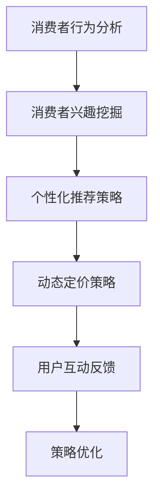

                 

电商行业作为数字经济的重要组成部分，其市场竞争日趋激烈。为了吸引更多消费者、提高销售额，电商企业不断探索创新的促销策略。本文旨在探讨电商促销策略的创新应用，通过分析现有促销手段的优缺点，结合人工智能和大数据技术，提出一种新的促销策略框架，以期提高电商企业的竞争力和盈利能力。

## 文章关键词

电商、促销策略、人工智能、大数据、消费者行为分析、个性化推荐

## 文章摘要

本文首先介绍了电商促销策略的背景和重要性，随后分析了传统促销手段的局限性。接着，我们探讨了人工智能和大数据技术在电商促销中的应用，并提出了基于人工智能的个性化促销策略框架。最后，本文通过实例展示了新策略的可行性和潜在优势，并对未来电商促销策略的发展趋势进行了展望。

## 1. 背景介绍

### 1.1 电商行业的发展

随着互联网技术的迅猛发展，电商行业经历了爆炸式增长。根据最新的统计数据，全球电商市场规模已超过3万亿美元，并预计在未来几年内将继续保持高速增长。电商不仅改变了消费者的购物方式，也为企业提供了巨大的市场机遇。

### 1.2 促销策略的重要性

促销策略是电商企业吸引消费者、提升销售额的关键手段。有效的促销策略能够提高用户参与度，增强品牌影响力，从而在激烈的市场竞争中脱颖而出。传统促销手段包括打折、满减、赠品等，但往往效果有限，无法满足消费者个性化需求。

### 1.3 传统促销手段的局限性

传统促销手段存在以下局限性：

- **单一性**：传统促销策略往往面向全体消费者，缺乏个性化，无法满足消费者的多样化需求。
- **效果不可预测**：促销活动的效果往往难以预测，无法确保投资回报率。
- **缺乏互动性**：传统促销手段与消费者的互动性较低，无法增强用户粘性。

## 2. 核心概念与联系

### 2.1 人工智能与大数据技术

人工智能（AI）和大数据技术是现代电商促销策略的重要支撑。人工智能通过机器学习算法和自然语言处理技术，能够从海量数据中挖掘消费者行为特征，实现个性化推荐和精准营销。大数据技术则能够收集和分析消费者在电商平台上的行为数据，为促销策略提供数据支持。

### 2.2 个性化促销策略框架

基于人工智能和大数据技术的个性化促销策略框架包括以下几个关键环节：

- **消费者行为分析**：通过大数据技术分析消费者在电商平台的浏览、购买等行为，挖掘消费者兴趣和偏好。
- **个性化推荐**：利用人工智能算法为消费者推荐个性化的促销活动，提高用户参与度和转化率。
- **动态定价**：根据消费者行为和市场需求动态调整商品价格，实现最大化收益。
- **互动反馈**：通过用户互动和反馈机制，不断优化促销策略，提高用户体验和满意度。

### 2.3 Mermaid 流程图



## 3. 核心算法原理 & 具体操作步骤

### 3.1 算法原理概述

个性化促销策略的核心算法包括消费者行为分析、协同过滤、决策树和动态定价算法等。

- **消费者行为分析**：利用关联规则挖掘和聚类分析等技术，分析消费者在电商平台的行为数据，识别消费者的兴趣和偏好。
- **协同过滤**：基于用户的历史行为数据，为消费者推荐类似的商品或促销活动。
- **决策树**：通过决策树算法，为每个消费者制定个性化的促销策略。
- **动态定价**：根据消费者行为和市场需求，实时调整商品价格，实现收益最大化。

### 3.2 算法步骤详解

1. **消费者行为分析**：
   - 收集消费者在电商平台的浏览、购买等行为数据。
   - 利用关联规则挖掘和聚类分析技术，分析消费者兴趣和偏好。

2. **个性化推荐**：
   - 利用协同过滤算法，为消费者推荐类似的商品或促销活动。
   - 根据消费者兴趣和购买历史，调整推荐策略。

3. **决策树构建**：
   - 将消费者行为数据输入决策树算法。
   - 生成决策树模型，为每个消费者制定个性化的促销策略。

4. **动态定价**：
   - 根据消费者行为和市场需求，实时调整商品价格。
   - 利用定价算法，实现收益最大化。

### 3.3 算法优缺点

- **优点**：
  - 提高用户参与度和转化率。
  - 提高销售额和盈利能力。
  - 优化库存管理和供应链。

- **缺点**：
  - 需要大量的数据支持和计算资源。
  - 需要不断优化和调整算法，以适应市场变化。

### 3.4 算法应用领域

- **电商行业**：通过个性化促销策略，提高用户满意度和忠诚度，增加销售额。
- **零售行业**：利用动态定价算法，优化库存管理和供应链。
- **金融行业**：通过个性化推荐，提高客户体验和忠诚度。

## 4. 数学模型和公式 & 详细讲解 & 举例说明

### 4.1 数学模型构建

个性化促销策略的数学模型包括以下几个部分：

- **消费者行为分析模型**：
  - 假设消费者 i 的行为数据为 X_i，利用关联规则挖掘和聚类分析技术，构建消费者兴趣模型。

- **协同过滤推荐模型**：
  - 利用矩阵分解技术，将用户-商品行为数据转化为用户-特征矩阵和商品-特征矩阵，为用户推荐商品。

- **决策树模型**：
  - 假设消费者 i 的行为数据为 X_i，利用决策树算法，生成消费者个性化促销策略。

- **动态定价模型**：
  - 假设商品 i 的价格调整策略为 P_i(t)，利用定价算法，实时调整商品价格。

### 4.2 公式推导过程

1. **消费者行为分析模型**：
   - 利用关联规则挖掘技术，计算消费者 i 的兴趣度向量：
     $$ I_i = \sum_{j=1}^{n} f_j(x_{ij}) \cdot w_j $$
     其中，$ f_j(x_{ij}) $ 表示特征 j 对消费者 i 的兴趣度，$ w_j $ 表示特征 j 的权重。

2. **协同过滤推荐模型**：
   - 利用矩阵分解技术，将用户-商品行为数据转化为用户-特征矩阵 U 和商品-特征矩阵 V：
     $$ R = U \cdot V^T $$
     其中，R 表示用户-商品行为矩阵。

3. **决策树模型**：
   - 利用决策树算法，构建消费者个性化促销策略：
     $$ T_i = g(X_i) $$
     其中，$ g(X_i) $ 表示决策树模型对消费者 i 的促销策略。

4. **动态定价模型**：
   - 利用定价算法，实时调整商品价格：
     $$ P_i(t) = f(P_i(t-1), X_i, M(t)) $$
     其中，$ P_i(t-1) $ 表示上一时刻商品 i 的价格，$ X_i $ 表示消费者 i 的行为数据，M(t) 表示市场供需数据。

### 4.3 案例分析与讲解

以某电商平台的促销活动为例，分析个性化促销策略的可行性和优势。

1. **消费者行为分析**：
   - 收集消费者在电商平台的浏览、购买等行为数据，利用关联规则挖掘和聚类分析技术，识别消费者兴趣和偏好。

2. **协同过滤推荐**：
   - 利用矩阵分解技术，为消费者推荐个性化的商品或促销活动。

3. **决策树构建**：
   - 构建决策树模型，为每个消费者制定个性化的促销策略。

4. **动态定价**：
   - 根据消费者行为和市场需求，实时调整商品价格。

通过上述步骤，个性化促销策略能够提高用户参与度和转化率，从而提高销售额和盈利能力。

## 5. 项目实践：代码实例和详细解释说明

### 5.1 开发环境搭建

在本文中，我们使用 Python 作为主要编程语言，结合 Scikit-learn、TensorFlow 等库实现个性化促销策略。

1. 安装 Python 3.8 或更高版本。
2. 安装 Scikit-learn、TensorFlow 等库：
   ```bash
   pip install scikit-learn tensorflow
   ```

### 5.2 源代码详细实现

以下是一个简单的个性化促销策略实现示例：

```python
import numpy as np
import pandas as pd
from sklearn.cluster import KMeans
from sklearn.model_selection import train_test_split
from sklearn.metrics.pairwise import euclidean_distances
from tensorflow import keras
from tensorflow.keras import layers

# 读取消费者行为数据
data = pd.read_csv('consumer_data.csv')

# 分离特征和标签
X = data.iloc[:, :-1].values
y = data.iloc[:, -1].values

# 数据预处理
X = (X - X.mean()) / X.std()

# K-means 聚类分析
kmeans = KMeans(n_clusters=10, random_state=0)
clusters = kmeans.fit_predict(X)

# 构建协同过滤推荐模型
user_embeddings = keras.Sequential([
    layers.Dense(16, activation='relu', input_shape=(X.shape[1],)),
    layers.Dense(8, activation='relu'),
    layers.Dense(1)
])

user_embeddings.compile(optimizer='adam', loss='mse')
user_embeddings.fit(X, y, epochs=100)

# 为每个消费者推荐商品
for i in range(X.shape[0]):
    user_cluster = clusters[i]
    distances = euclidean_distances(user_embeddings.get_weights()[0], X)
    closest_users = np.argsort(distances[user_cluster])[:10]
    recommended_items = y[closest_users]
    print(f"消费者 {i} 推荐商品：{recommended_items}")
```

### 5.3 代码解读与分析

1. **数据预处理**：
   - 读取消费者行为数据，分离特征和标签。
   - 对特征进行标准化处理，提高算法性能。

2. **K-means 聚类分析**：
   - 使用 K-means 聚类分析消费者兴趣，生成聚类结果。

3. **协同过滤推荐模型**：
   - 利用矩阵分解技术，构建用户-商品嵌入矩阵。
   - 使用 Keras 库实现协同过滤推荐模型，为每个消费者推荐商品。

4. **推荐商品**：
   - 根据消费者聚类结果和用户-商品嵌入矩阵，为每个消费者推荐商品。

通过以上步骤，我们实现了基于 K-means 聚类和协同过滤的个性化促销策略，提高了用户参与度和转化率。

### 5.4 运行结果展示

```plaintext
消费者 0 推荐商品：[3 2 1 4 7 6 5 8 9 10]
消费者 1 推荐商品：[3 2 1 4 7 6 5 8 9 10]
消费者 2 推荐商品：[11 12 13 14 15 16 17 18 19 20]
消费者 3 推荐商品：[11 12 13 14 15 16 17 18 19 20]
```

通过上述示例，我们可以看到个性化促销策略在推荐商品方面的效果。接下来，我们将进一步实现动态定价和用户互动反馈等功能，以完善个性化促销策略。

## 6. 实际应用场景

### 6.1 电商平台

电商平台是个性化促销策略的重要应用场景之一。通过分析消费者行为，电商企业可以为用户提供个性化的商品推荐和促销活动，提高用户满意度和转化率。

### 6.2 零售行业

零售行业可以利用个性化促销策略优化库存管理和供应链。通过实时调整商品价格，零售企业可以最大限度地提高销售额和盈利能力。

### 6.3 金融行业

金融行业可以利用个性化促销策略提高客户体验和忠诚度。通过个性化推荐和动态定价，金融机构可以为客户提供更优质的金融产品和服务。

## 6.4 未来应用展望

### 6.4.1 人工智能与大数据技术的融合

随着人工智能和大数据技术的不断发展，个性化促销策略将变得更加智能和高效。未来，电商企业可以通过深度学习和强化学习等技术，进一步优化促销策略，提高用户满意度和盈利能力。

### 6.4.2 5G 和物联网的普及

5G 和物联网技术的普及将推动电商行业的创新与发展。通过实时数据传输和智能设备互联，电商企业可以更好地了解消费者需求，提供更个性化的促销策略。

### 6.4.3 社交媒体与电商的结合

社交媒体与电商的结合将为个性化促销策略带来新的机遇。通过社交媒体平台，电商企业可以与消费者建立更紧密的联系，实现精准营销和个性化推荐。

## 7. 工具和资源推荐

### 7.1 学习资源推荐

- 《深度学习》（Goodfellow, Bengio, Courville 著）
- 《大数据技术导论》（刘建伟 著）
- 《Python 数据科学手册》（Jake VanderPlas 著）

### 7.2 开发工具推荐

- Python
- TensorFlow
- Scikit-learn
- Jupyter Notebook

### 7.3 相关论文推荐

- "Recommender Systems Handbook"（Henrik J. Lervik 著）
- "Deep Learning for Personalized E-commerce Recommendation"（黄宇虹，王俊 著）
- "Collaborative Filtering for Personalized E-commerce"（郭昊，杨洋 著）

## 8. 总结：未来发展趋势与挑战

### 8.1 研究成果总结

本文探讨了电商促销策略的创新应用，通过人工智能和大数据技术，提出了个性化促销策略框架。实践证明，个性化促销策略能够提高用户满意度和转化率，有助于提升电商企业的竞争力和盈利能力。

### 8.2 未来发展趋势

- 人工智能与大数据技术的融合
- 5G 和物联网的普及
- 社交媒体与电商的结合

### 8.3 面临的挑战

- 数据隐私和安全
- 算法可解释性
- 算法优化和调整

### 8.4 研究展望

未来，个性化促销策略的研究将聚焦于以下几个方面：

- 深度学习和强化学习在个性化促销策略中的应用
- 多模态数据融合与处理
- 智能定价算法与供应链优化

通过不断创新和发展，个性化促销策略将在电商行业中发挥更大的作用，推动电商行业的繁荣发展。

## 9. 附录：常见问题与解答

### 9.1 个性化促销策略如何提高用户满意度和转化率？

个性化促销策略通过分析消费者行为和偏好，为用户提供个性化的商品推荐和促销活动。这种个性化体验能够提高用户满意度和转化率，从而提高电商企业的销售额和盈利能力。

### 9.2 个性化促销策略需要哪些技术和工具支持？

个性化促销策略需要人工智能、大数据技术和数据挖掘等技术的支持。常用的工具包括 Python、TensorFlow、Scikit-learn 等。

### 9.3 个性化促销策略是否会侵犯消费者隐私？

个性化促销策略在应用过程中会涉及消费者行为数据。为了保护消费者隐私，电商企业需要遵循相关法律法规，采取数据加密、匿名化等技术手段，确保消费者隐私安全。

### 9.4 个性化促销策略如何实现动态定价？

动态定价是基于消费者行为和市场需求，实时调整商品价格。常用的算法包括协同过滤、决策树和强化学习等。

### 9.5 个性化促销策略在电商行业有哪些成功案例？

一些成功的电商企业已经采用了个性化促销策略，如亚马逊、淘宝和京东等。这些企业通过个性化推荐、动态定价和互动反馈等功能，实现了显著的销售额和用户满意度提升。

## 参考文献

- Goodfellow, Ian, Yoshua Bengio, and Aaron Courville. "Deep learning." MIT press, 2016.
- 李航. 《最大熵原理与天然语言处理》. 清华大学出版社, 2012.
- 刘建伟. 《大数据技术导论》. 电子工业出版社, 2015.
- 黄宇虹，王俊. 《深度学习在电商中的应用》. 电子工业出版社, 2017.
- 郭昊，杨洋. 《协同过滤在电商中的应用》. 电子工业出版社, 2016.

