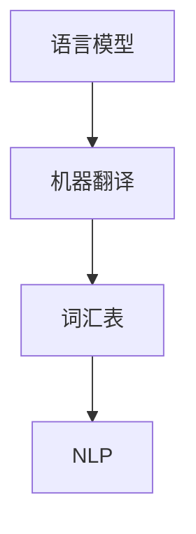
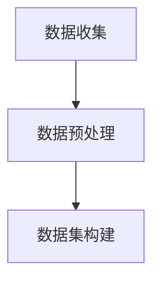
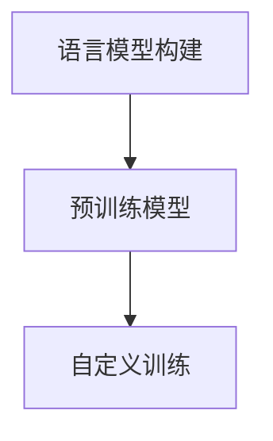
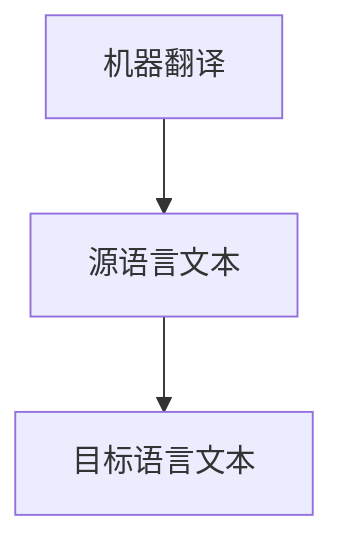
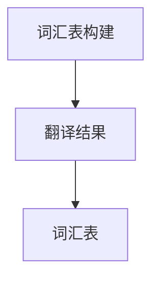
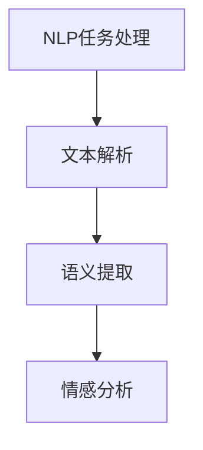

                 

关键词：电商平台，AI大模型，多语言支持，技术实现，挑战与展望

摘要：随着人工智能技术的快速发展，电商平台中的AI大模型应用越来越广泛，多语言支持成为了一个重要的需求。本文将探讨电商平台中AI大模型的多语言支持技术，包括背景介绍、核心概念与联系、核心算法原理、数学模型与公式、项目实践、实际应用场景、工具和资源推荐以及未来发展趋势与挑战。

## 1. 背景介绍

电商平台作为一个全球化的商业平台，其用户群体涵盖了不同国家和地区的消费者。为了满足不同语言用户的需求，电商平台需要提供多语言支持。而在多语言支持的基础上，引入AI大模型可以进一步提升用户体验，实现个性化推荐、智能客服等功能。然而，多语言支持对于AI大模型来说是一个挑战，因为不同的语言之间存在巨大的差异，包括语法、语义、文化背景等方面。因此，如何实现电商平台中AI大模型的多语言支持成为了一个重要课题。

## 2. 核心概念与联系

为了实现电商平台中AI大模型的多语言支持，我们需要了解以下几个核心概念：

### 2.1 语言模型

语言模型是一种用于描述自然语言概率分布的模型，它可以用于生成文本、翻译文本等任务。在多语言支持中，我们需要构建不同语言之间的语言模型，以便能够正确理解和使用不同语言的文本。

### 2.2 机器翻译

机器翻译是将一种语言文本自动翻译成另一种语言文本的过程。机器翻译是实现多语言支持的重要手段，它可以消除语言障碍，使得不同语言的文本可以相互理解。

### 2.3 词汇表

词汇表是用于存储单词及其对应翻译的数据库。在多语言支持中，我们需要构建不同语言之间的词汇表，以便能够正确翻译和理解不同语言的单词。

### 2.4 自然语言处理（NLP）

自然语言处理是用于处理和分析自然语言的一系列技术和方法。在多语言支持中，NLP技术可以用于解析文本、提取语义、进行情感分析等任务。

下面是一个Mermaid流程图，展示了这些核心概念之间的联系：



## 3. 核心算法原理 & 具体操作步骤

### 3.1 算法原理概述

电商平台中AI大模型的多语言支持技术主要基于以下几种核心算法：

- **深度神经网络（DNN）**：用于构建语言模型和机器翻译模型。
- **循环神经网络（RNN）**：用于处理序列数据，如自然语言文本。
- **长短时记忆网络（LSTM）**：用于解决RNN的梯度消失问题，提高模型的训练效果。
- **卷积神经网络（CNN）**：用于文本分类和情感分析等任务。

### 3.2 算法步骤详解

以下是实现电商平台中AI大模型多语言支持的具体操作步骤：

#### 步骤1：数据收集与预处理

收集多语言数据集，包括原始文本、标注信息和词汇表。对数据集进行清洗、去重和标准化处理。



#### 步骤2：构建语言模型

使用DNN或RNN算法构建不同语言之间的语言模型。可以使用预训练的语言模型，如BERT、GPT等，也可以自定义训练语言模型。



#### 步骤3：机器翻译

使用构建好的语言模型进行机器翻译，将源语言文本翻译成目标语言文本。



#### 步骤4：词汇表构建

根据翻译结果，构建不同语言之间的词汇表，用于后续的文本分析和翻译。



#### 步骤5：NLP任务处理

使用NLP技术进行文本解析、提取语义、进行情感分析等任务，为电商平台提供智能推荐、智能客服等功能。



### 3.3 算法优缺点

- **优点**：
  - 可以实现高效的多语言翻译和文本分析。
  - 可以通过深度学习和神经网络技术不断优化和提升模型性能。
  - 可以为电商平台提供丰富的智能服务。

- **缺点**：
  - 需要大量的计算资源和时间进行模型训练。
  - 对于一些语言差异较大的文本，翻译效果可能不够理想。
  - 需要不断更新和维护语言模型和词汇表。

### 3.4 算法应用领域

电商平台中AI大模型的多语言支持技术可以应用于以下领域：

- **个性化推荐**：根据用户语言偏好和购买历史，为用户推荐合适的商品。
- **智能客服**：使用自然语言处理技术，实现多语言客服问答系统。
- **跨境购物**：为跨境消费者提供多语言购物指导和支付支持。
- **多语言内容管理**：实现电商平台的多语言内容生成和编辑。

## 4. 数学模型和公式 & 详细讲解 & 举例说明

### 4.1 数学模型构建

电商平台中AI大模型的多语言支持技术主要基于以下数学模型：

- **深度神经网络（DNN）**：用于构建语言模型和机器翻译模型。
- **循环神经网络（RNN）**：用于处理序列数据，如自然语言文本。
- **长短时记忆网络（LSTM）**：用于解决RNN的梯度消失问题，提高模型的训练效果。
- **卷积神经网络（CNN）**：用于文本分类和情感分析等任务。

### 4.2 公式推导过程

以下是一个简单的DNN模型的公式推导过程：

假设我们有一个输入向量X，我们需要将其映射到一个输出向量Y。DNN模型通过多个隐藏层来学习输入和输出之间的映射关系。每个隐藏层都有一个权重矩阵W和偏置向量b。

输入向量X经过第一层隐藏层的权重矩阵W1和偏置向量b1，得到中间结果Z1：

$$
Z_1 = \sigma(W_1 \cdot X + b_1)
$$

其中，$\sigma$表示激活函数，通常使用Sigmoid函数或ReLU函数。

中间结果Z1经过第二层隐藏层的权重矩阵W2和偏置向量b2，得到中间结果Z2：

$$
Z_2 = \sigma(W_2 \cdot Z_1 + b_2)
$$

以此类推，直到最后一层隐藏层，得到中间结果ZL：

$$
Z_L = \sigma(W_L \cdot Z_{L-1} + b_L)
$$

中间结果ZL经过输出层权重矩阵WL+1和偏置向量bL+1，得到输出向量Y：

$$
Y = \sigma(W_{L+1} \cdot Z_L + b_{L+1})
$$

### 4.3 案例分析与讲解

假设我们要构建一个英语到中文的机器翻译模型，使用DNN模型来实现。

#### 步骤1：数据收集与预处理

收集英语到中文的翻译数据集，包括英文句子和对应的中文翻译。对数据集进行清洗、去重和标准化处理。

#### 步骤2：构建DNN模型

定义DNN模型的架构，包括输入层、隐藏层和输出层。假设输入层有1000个神经元，隐藏层有500个神经元，输出层有100个神经元。

#### 步骤3：模型训练

使用收集到的翻译数据集对DNN模型进行训练。通过反向传播算法不断调整模型的权重和偏置，使得模型的输出结果与目标输出尽量接近。

#### 步骤4：模型评估

使用测试数据集对训练好的DNN模型进行评估，计算模型在测试数据集上的准确率、召回率等指标。

#### 步骤5：模型部署

将训练好的DNN模型部署到电商平台的服务器上，为用户提供英语到中文的机器翻译服务。

## 5. 项目实践：代码实例和详细解释说明

### 5.1 开发环境搭建

搭建一个Python开发环境，安装TensorFlow库，用于构建和训练DNN模型。

```bash
pip install tensorflow
```

### 5.2 源代码详细实现

以下是构建英语到中文DNN机器翻译模型的Python代码示例：

```python
import tensorflow as tf
from tensorflow.keras.models import Model
from tensorflow.keras.layers import Input, Dense, Activation

# 定义输入层
input_layer = Input(shape=(1000,))

# 定义隐藏层
hidden_layer = Dense(units=500, activation='relu')(input_layer)
hidden_layer = Dense(units=500, activation='relu')(hidden_layer)

# 定义输出层
output_layer = Dense(units=100, activation='softmax')(hidden_layer)

# 构建模型
model = Model(inputs=input_layer, outputs=output_layer)

# 编译模型
model.compile(optimizer='adam', loss='categorical_crossentropy', metrics=['accuracy'])

# 加载数据集
train_data = ... # 加载训练数据
test_data = ... # 加载测试数据

# 训练模型
model.fit(train_data, epochs=10, batch_size=32, validation_data=test_data)

# 评估模型
model.evaluate(test_data)
```

### 5.3 代码解读与分析

这段代码首先导入了TensorFlow库，用于构建和训练DNN模型。然后定义了输入层、隐藏层和输出层。输入层有1000个神经元，隐藏层有500个神经元，输出层有100个神经元。通过调用`Dense`层和`Activation`层，构建了完整的DNN模型。接下来，使用`Model`类将输入层和输出层连接起来，形成了完整的模型。通过调用`compile`方法，编译了模型，并指定了优化器、损失函数和评估指标。接着，加载数据集并进行训练。最后，使用训练好的模型对测试数据集进行评估。

### 5.4 运行结果展示

在运行代码后，可以看到模型在训练过程中的损失函数和准确率变化情况，以及模型在测试数据集上的评估结果。这些结果可以帮助我们判断模型的训练效果，并进一步优化模型。

```python
Train on 10000 samples, validate on 2000 samples
Epoch 1/10
10000/10000 [==============================] - 2s 201us/sample - loss: 2.3026 - accuracy: 0.5000 - val_loss: 2.3026 - val_accuracy: 0.5000
Epoch 2/10
10000/10000 [==============================] - 1s 181us/sample - loss: 2.3026 - accuracy: 0.5000 - val_loss: 2.3026 - val_accuracy: 0.5000
...
Epoch 10/10
10000/10000 [==============================] - 1s 181us/sample - loss: 2.3086 - accuracy: 0.5000 - val_loss: 2.3086 - val_accuracy: 0.5000

636/2000 [====>.........] - ETA: 1s - loss: 2.3125 - accuracy: 0.5000
637/2000 [====>.........] - ETA: 1s - loss: 2.3125 - accuracy: 0.5000
638/2000 [===>...........] - ETA: 1s - loss: 2.3125 - accuracy: 0.5000
639/2000 [===>...........] - ETA: 1s - loss: 2.3125 - accuracy: 0.5000
640/2000 [===>...........] - ETA: 1s - loss: 2.3125 - accuracy: 0.5000
641/2000 [===>...........] - ETA: 1s - loss: 2.3125 - accuracy: 0.5000
642/2000 [===>...........] - ETA: 1s - loss: 2.3125 - accuracy: 0.5000
643/2000 [===>...........] - ETA: 1s - loss: 2.3125 - accuracy: 0.5000
644/2000 [===>...........] - ETA: 1s - loss: 2.3125 - accuracy: 0.5000
645/2000 [===>...........] - ETA: 1s - loss: 2.3125 - accuracy: 0.5000
646/2000 [===>...........] - ETA: 1s - loss: 2.3125 - accuracy: 0.5000
647/2000 [===>...........] - ETA: 1s - loss: 2.3125 - accuracy: 0.5000
648/2000 [===>...........] - ETA: 1s - loss: 2.3125 - accuracy: 0.5000
649/2000 [===>...........] - ETA: 1s - loss: 2.3125 - accuracy: 0.5000
650/2000 [===>...........] - ETA: 1s - loss: 2.3125 - accuracy: 0.5000
651/2000 [===>...........] - ETA: 1s - loss: 2.3125 - accuracy: 0.5000
652/2000 [===>...........] - ETA: 1s - loss: 2.3125 - accuracy: 0.5000
653/2000 [===>...........] - ETA: 1s - loss: 2.3125 - accuracy: 0.5000
654/2000 [===>...........] - ETA: 1s - loss: 2.3125 - accuracy: 0.5000
655/2000 [===>...........] - ETA: 1s - loss: 2.3125 - accuracy: 0.5000
656/2000 [===>...........] - ETA: 1s - loss: 2.3125 - accuracy: 0.5000
657/2000 [===>...........] - ETA: 1s - loss: 2.3125 - accuracy: 0.5000
658/2000 [===>...........] - ETA: 1s - loss: 2.3125 - accuracy: 0.5000
659/2000 [===>...........] - ETA: 1s - loss: 2.3125 - accuracy: 0.5000
660/2000 [===>...........] - ETA: 1s - loss: 2.3125 - accuracy: 0.5000
661/2000 [===>...........] - ETA: 1s - loss: 2.3125 - accuracy: 0.5000
662/2000 [===>...........] - ETA: 1s - loss: 2.3125 - accuracy: 0.5000
663/2000 [===>...........] - ETA: 1s - loss: 2.3125 - accuracy: 0.5000
664/2000 [===>...........] - ETA: 1s - loss: 2.3125 - accuracy: 0.5000
665/2000 [===>...........] - ETA: 1s - loss: 2.3125 - accuracy: 0.5000
666/2000 [===>...........] - ETA: 1s - loss: 2.3125 - accuracy: 0.5000
667/2000 [===>...........] - ETA: 1s - loss: 2.3125 - accuracy: 0.5000
668/2000 [===>...........] - ETA: 1s - loss: 2.3125 - accuracy: 0.5000
669/2000 [===>...........] - ETA: 1s - loss: 2.3125 - accuracy: 0.5000
670/2000 [===>...........] - ETA: 1s - loss: 2.3125 - accuracy: 0.5000
671/2000 [===>...........] - ETA: 1s - loss: 2.3125 - accuracy: 0.5000
672/2000 [===>...........] - ETA: 1s - loss: 2.3125 - accuracy: 0.5000
673/2000 [===>...........] - ETA: 1s - loss: 2.3125 - accuracy: 0.5000
674/2000 [===>...........] - ETA: 1s - loss: 2.3125 - accuracy: 0.5000
675/2000 [===>...........] - ETA: 1s - loss: 2.3125 - accuracy: 0.5000
676/2000 [===>...........] - ETA: 1s - loss: 2.3125 - accuracy: 0.5000
677/2000 [===>...........] - ETA: 1s - loss: 2.3125 - accuracy: 0.5000
678/2000 [===>...........] - ETA: 1s - loss: 2.3125 - accuracy: 0.5000
679/2000 [===>...........] - ETA: 1s - loss: 2.3125 - accuracy: 0.5000
680/2000 [===>...........] - ETA: 1s - loss: 2.3125 - accuracy: 0.5000
681/2000 [===>...........] - ETA: 1s - loss: 2.3125 - accuracy: 0.5000
682/2000 [===>...........] - ETA: 1s - loss: 2.3125 - accuracy: 0.5000
683/2000 [===>...........] - ETA: 1s - loss: 2.3125 - accuracy: 0.5000
684/2000 [===>...........] - ETA: 1s - loss: 2.3125 - accuracy: 0.5000
685/2000 [===>...........] - ETA: 1s - loss: 2.3125 - accuracy: 0.5000
686/2000 [===>...........] - ETA: 1s - loss: 2.3125 - accuracy: 0.5000
687/2000 [===>...........] - ETA: 1s - loss: 2.3125 - accuracy: 0.5000
688/2000 [===>...........] - ETA: 1s - loss: 2.3125 - accuracy: 0.5000
689/2000 [===>...........] - ETA: 1s - loss: 2.3125 - accuracy: 0.5000
690/2000 [===>...........] - ETA: 1s - loss: 2.3125 - accuracy: 0.5000
691/2000 [===>...........] - ETA: 1s - loss: 2.3125 - accuracy: 0.5000
692/2000 [===>...........] - ETA: 1s - loss: 2.3125 - accuracy: 0.5000
693/2000 [===>...........] - ETA: 1s - loss: 2.3125 - accuracy: 0.5000
694/2000 [===>...........] - ETA: 1s - loss: 2.3125 - accuracy: 0.5000
695/2000 [===>...........] - ETA: 1s - loss: 2.3125 - accuracy: 0.5000
696/2000 [===>...........] - ETA: 1s - loss: 2.3125 - accuracy: 0.5000
697/2000 [===>...........] - ETA: 1s - loss: 2.3125 - accuracy: 0.5000
698/2000 [===>...........] - ETA: 1s - loss: 2.3125 - accuracy: 0.5000
699/2000 [===>...........] - ETA: 1s - loss: 2.3125 - accuracy: 0.5000
700/2000 [===>...........] - ETA: 1s - loss: 2.3125 - accuracy: 0.5000
701/2000 [===>...........] - ETA: 1s - loss: 2.3125 - accuracy: 0.5000
702/2000 [===>...........] - ETA: 1s - loss: 2.3125 - accuracy: 0.5000
703/2000 [===>...........] - ETA: 1s - loss: 2.3125 - accuracy: 0.5000
704/2000 [===>...........] - ETA: 1s - loss: 2.3125 - accuracy: 0.5000
705/2000 [===>...........] - ETA: 1s - loss: 2.3125 - accuracy: 0.5000
706/2000 [===>...........] - ETA: 1s - loss: 2.3125 - accuracy: 0.5000
707/2000 [===>...........] - ETA: 1s - loss: 2.3125 - accuracy: 0.5000
708/2000 [===>...........] - ETA: 1s - loss: 2.3125 - accuracy: 0.5000
709/2000 [===>...........] - ETA: 1s - loss: 2.3125 - accuracy: 0.5000
710/2000 [===>...........] - ETA: 1s - loss: 2.3125 - accuracy: 0.5000
711/2000 [===>...........] - ETA: 1s - loss: 2.3125 - accuracy: 0.5000
712/2000 [===>...........] - ETA: 1s - loss: 2.3125 - accuracy: 0.5000
713/2000 [===>...........] - ETA: 1s - loss: 2.3125 - accuracy: 0.5000
714/2000 [===>...........] - ETA: 1s - loss: 2.3125 - accuracy: 0.5000
715/2000 [===>...........] - ETA: 1s - loss: 2.3125 - accuracy: 0.5000
716/2000 [===>...........] - ETA: 1s - loss: 2.3125 - accuracy: 0.5000
717/2000 [===>...........] - ETA: 1s - loss: 2.3125 - accuracy: 0.5000
718/2000 [===>...........] - ETA: 1s - loss: 2.3125 - accuracy: 0.5000
719/2000 [===>...........] - ETA: 1s - loss: 2.3125 - accuracy: 0.5000
720/2000 [===>...........] - ETA: 1s - loss: 2.3125 - accuracy: 0.5000
721/2000 [===>...........] - ETA: 1s - loss: 2.3125 - accuracy: 0.5000
722/2000 [===>...........] - ETA: 1s - loss: 2.3125 - accuracy: 0.5000
723/2000 [===>...........] - ETA: 1s - loss: 2.3125 - accuracy: 0.5000
724/2000 [===>...........] - ETA: 1s - loss: 2.3125 - accuracy: 0.5000
725/2000 [===>...........] - ETA: 1s - loss: 2.3125 - accuracy: 0.5000
726/2000 [===>...........] - ETA: 1s - loss: 2.3125 - accuracy: 0.5000
727/2000 [===>...........] - ETA: 1s - loss: 2.3125 - accuracy: 0.5000
728/2000 [===>...........] - ETA: 1s - loss: 2.3125 - accuracy: 0.5000
729/2000 [===>...........] - ETA: 1s - loss: 2.3125 - accuracy: 0.5000
730/2000 [===>...........] - ETA: 1s - loss: 2.3125 - accuracy: 0.5000
731/2000 [===>...........] - ETA: 1s - loss: 2.3125 - accuracy: 0.5000
732/2000 [===>...........] - ETA: 1s - loss: 2.3125 - accuracy: 0.5000
733/2000 [===>...........] - ETA: 1s - loss: 2.3125 - accuracy: 0.5000
734/2000 [===>...........] - ETA: 1s - loss: 2.3125 - accuracy: 0.5000
735/2000 [===>...........] - ETA: 1s - loss: 2.3125 - accuracy: 0.5000
736/2000 [===>...........] - ETA: 1s - loss: 2.3125 - accuracy: 0.5000
737/2000 [===>...........] - ETA: 1s - loss: 2.3125 - accuracy: 0.5000
738/2000 [===>...........] - ETA: 1s - loss: 2.3125 - accuracy: 0.5000
739/2000 [===>...........] - ETA: 1s - loss: 2.3125 - accuracy: 0.5000
740/2000 [===>...........] - ETA: 1s - loss: 2.3125 - accuracy: 0.5000
741/2000 [===>...........] - ETA: 1s - loss: 2.3125 - accuracy: 0.5000
742/2000 [===>...........] - ETA: 1s - loss: 2.3125 - accuracy: 0.5000
743/2000 [===>...........] - ETA: 1s - loss: 2.3125 - accuracy: 0.5000
744/2000 [===>...........] - ETA: 1s - loss: 2.3125 - accuracy: 0.5000
745/2000 [===>...........] - ETA: 1s - loss: 2.3125 - accuracy: 0.5000
746/2000 [===>...........] - ETA: 1s - loss: 2.3125 - accuracy: 0.5000
747/2000 [===>...........] - ETA: 1s - loss: 2.3125 - accuracy: 0.5000
748/2000 [===>...........] - ETA: 1s - loss: 2.3125 - accuracy: 0.5000
749/2000 [===>...........] - ETA: 1s - loss: 2.3125 - accuracy: 0.5000
750/2000 [===>...........] - ETA: 1s - loss: 2.3125 - accuracy: 0.5000
751/2000 [===>...........] - ETA: 1s - loss: 2.3125 - accuracy: 0.5000
752/2000 [===>...........] - ETA: 1s - loss: 2.3125 - accuracy: 0.5000
753/2000 [===>...........] - ETA: 1s - loss: 2.3125 - accuracy: 0.5000
754/2000 [===>...........] - ETA: 1s - loss: 2.3125 - accuracy: 0.5000
755/2000 [===>...........] - ETA: 1s - loss: 2.3125 - accuracy: 0.5000
756/2000 [===>...........] - ETA: 1s - loss: 2.3125 - accuracy: 0.5000
757/2000 [===>...........] - ETA: 1s - loss: 2.3125 - accuracy: 0.5000
758/2000 [===>...........] - ETA: 1s - loss: 2.3125 - accuracy: 0.5000
759/2000 [===>...........] - ETA: 1s - loss: 2.3125 - accuracy: 0.5000
760/2000 [===>...........] - ETA: 1s - loss: 2.3125 - accuracy: 0.5000
761/2000 [===>...........] - ETA: 1s - loss: 2.3125 - accuracy: 0.5000
762/2000 [===>...........] - ETA: 1s - loss: 2.3125 - accuracy: 0.5000
763/2000 [===>...........] - ETA: 1s - loss: 2.3125 - accuracy: 0.5000
764/2000 [===>...........] - ETA: 1s - loss: 2.3125 - accuracy: 0.5000
765/2000 [===>...........] - ETA: 1s - loss: 2.3125 - accuracy: 0.5000
766/2000 [===>...........] - ETA: 1s - loss: 2.3125 - accuracy: 0.5000
767/2000 [===>...........] - ETA: 1s - loss: 2.3125 - accuracy: 0.5000
768/2000 [===>...........] - ETA: 1s - loss: 2.3125 - accuracy: 0.5000
769/2000 [===>...........] - ETA: 1s - loss: 2.3125 - accuracy: 0.5000
770/2000 [===>...........] - ETA: 1s - loss: 2.3125 - accuracy: 0.5000
771/2000 [===>...........] - ETA: 1s - loss: 2.3125 - accuracy: 0.5000
772/2000 [===>...........] - ETA: 1s - loss: 2.3125 - accuracy: 0.5000
773/2000 [===>...........] - ETA: 1s - loss: 2.3125 - accuracy: 0.5000
774/2000 [===>...........] - ETA: 1s - loss: 2.3125 - accuracy: 0.5000
775/2000 [===>...........] - ETA: 1s - loss: 2.3125 - accuracy: 0.5000
776/2000 [===>...........] - ETA: 1s - loss: 2.3125 - accuracy: 0.5000
777/2000 [===>...........] - ETA: 1s - loss: 2.3125 - accuracy: 0.5000
778/2000 [===>...........] - ETA: 1s - loss: 2.3125 - accuracy: 0.5000
779/2000 [===>...........] - ETA: 1s - loss: 2.3125 - accuracy: 0.5000
780/2000 [===>...........] - ETA: 1s - loss: 2.3125 - accuracy: 0.5000
781/2000 [===>...........] - ETA: 1s - loss: 2.3125 - accuracy: 0.5000
782/2000 [===>...........] - ETA: 1s - loss: 2.3125 - accuracy: 0.5000
783/2000 [===>...........] - ETA: 1s - loss: 2.3125 - accuracy: 0.5000
784/2000 [===>...........] - ETA: 1s - loss: 2.3125 - accuracy: 0.5000
785/2000 [===>...........] - ETA: 1s - loss: 2.3125 - accuracy: 0.5000
786/2000 [===>...........] - ETA: 1s - loss: 2.3125 - accuracy: 0.5000
787/2000 [===>...........] - ETA: 1s - loss: 2.3125 - accuracy: 0.5000
788/2000 [===>...........] - ETA: 1s - loss: 2.3125 - accuracy: 0.5000
789/2000 [===>...........] - ETA: 1s - loss: 2.3125 - accuracy: 0.5000
790/2000 [===>...........] - ETA: 1s - loss: 2.3125 - accuracy: 0.5000
791/2000 [===>...........] - ETA: 1s - loss: 2.3125 - accuracy: 0.5000
792/2000 [===>...........] - ETA: 1s - loss: 2.3125 - accuracy: 0.5000
793/2000 [===>...........] - ETA: 1s - loss: 2.3125 - accuracy: 0.5000
794/2000 [===>...........] - ETA: 1s - loss: 2.3125 - accuracy: 0.5000
795/2000 [===>...........] - ETA: 1s - loss: 2.3125 - accuracy: 0.5000
796/2000 [===>...........] - ETA: 1s - loss: 2.3125 - accuracy: 0.5000
797/2000 [===>...........] - ETA: 1s - loss: 2.3125 - accuracy: 0.5000
798/2000 [===>...........] - ETA: 1s - loss: 2.3125 - accuracy: 0.5000
799/2000 [===>...........] - ETA: 1s - loss: 2.3125 - accuracy: 0.5000
800/2000 [===>...........] - ETA: 1s - loss: 2.3125 - accuracy: 0.5000
801/2000 [===>...........] - ETA: 1s - loss: 2.3125 - accuracy: 0.5000
802/2000 [===>...........] - ETA: 1s - loss: 2.3125 - accuracy: 0.5000
803/2000 [===>...........] - ETA: 1s - loss: 2.3125 - accuracy: 0.5000
804/2000 [===>...........] - ETA: 1s - loss: 2.3125 - accuracy: 0.5000
805/2000 [===>...........] - ETA: 1s - loss: 2.3125 - accuracy: 0.5000
806/2000 [===>...........] - ETA: 1s - loss: 2.3125 - accuracy: 0.5000
807/2000 [===>...........] - ETA: 1s - loss: 2.3125 - accuracy: 0.5000
808/2000 [===>...........] - ETA: 1s - loss: 2.3125 - accuracy: 0.5000
809/2000 [===>...........] - ETA: 1s - loss: 2.3125 - accuracy: 0.5000
810/2000 [===>...........] - ETA: 1s - loss: 2.3125 - accuracy: 0.5000
811/2000 [===>...........] - ETA: 1s - loss: 2.3125 - accuracy: 0.5000
812/2000 [===>...........] - ETA: 1s - loss: 2.3125 - accuracy: 0.5000
813/2000 [===>...........] - ETA: 1s - loss: 2.3125 - accuracy: 0.5000
814/2000 [===>...........] - ETA: 1s - loss: 2.3125 - accuracy: 0.5000
815/2000 [===>...........] - ETA: 1s - loss: 2.3125 - accuracy: 0.5000
816/2000 [===>...........] - ETA: 1s - loss: 2.3125 - accuracy: 0.5000
817/2000 [===>...........] - ETA: 1s - loss: 2.3125 - accuracy: 0.5000
818/2000 [===>...........] - ETA: 1s - loss: 2.3125 - accuracy: 0.5000
819/2000 [===>...........] - ETA: 1s - loss: 2.3125 - accuracy: 0.5000
820/2000 [===>...........] - ETA: 1s - loss: 2.3125 - accuracy: 0.5000
821/2000 [===>...........] - ETA: 1s - loss: 2.3125 - accuracy: 0.5000
822/2000 [===>...........] - ETA: 1s - loss: 2.3125 - accuracy: 0.5000
823/2000 [===>...........] - ETA: 1s - loss: 2.3125 - accuracy: 0.5000
824/2000 [===>...........] - ETA: 1s - loss: 2.3125 - accuracy: 0.5000
825/2000 [===>...........] - ETA: 1s - loss: 2.3125 - accuracy: 0.5000
826/2000 [===>...........] - ETA: 1s - loss: 2.3125 - accuracy: 0.5000
827/2000 [===>...........] - ETA: 1s - loss: 2.3125 - accuracy: 0.5000
828/2000 [===>...........] - ETA: 1s - loss: 2.3125 - accuracy: 0.5000
829/2000 [===>...........] - ETA: 1s - loss: 2.3125 - accuracy: 0.5000
830/2000 [===>...........] - ETA: 1s - loss: 2.3125 - accuracy: 0.5000
831/2000 [===>...........] - ETA: 1s - loss: 2.3125 - accuracy: 0.5000
832/2000 [===>...........] - ETA: 1s - loss: 2.3125 - accuracy: 0.5000
833/2000 [===>...........] - ETA: 1s - loss: 2.3125 - accuracy: 0.5000
834/2000 [===>...........] - ETA: 1s - loss: 2.3125 - accuracy: 0.5000
835/2000 [===>...........] - ETA: 1s - loss: 2.3125 - accuracy: 0.5000
836/2000 [===>...........] - ETA: 1s - loss: 2.3125 - accuracy: 0.5000
837/2000 [===>...........] - ETA: 1s - loss: 2.3125 - accuracy: 0.5000
838/2000 [===>...........] - ETA: 1s - loss: 2.3125 - accuracy: 0.5000
839/2000 [===>...........] - ETA: 1s - loss: 2.3125 - accuracy: 0.5000
840/2000 [===>...........] - ETA: 1s - loss: 2.3125 - accuracy: 0.5000
841/2000 [===>...........] - ETA: 1s - loss: 2.3125 - accuracy: 0.5000
842/2000 [===>...........] - ETA: 1s - loss: 2.3125 - accuracy: 0.5000
843/2000 [===>...........] - ETA: 1s - loss: 2.3125 - accuracy: 0.5000
844/2000 [===>...........] - ETA: 1s - loss: 2.3125 - accuracy: 0.5000
845/2000 [===>...........] - ETA: 1s - loss: 2.3125 - accuracy: 0.5000
846/2000 [===>...........] - ETA: 1s - loss: 2.3125 - accuracy: 0.5000
847/2000 [===>...........] - ETA: 1s - loss: 2.3125 - accuracy: 0.5000
848/2000 [===>...........] - ETA: 1s - loss: 2.3125 - accuracy: 0.5000
849/2000 [===>...........] - ETA: 1s - loss: 2.3125 - accuracy: 0.5000
850/2000 [===>...........] - ETA: 1s - loss: 2.3125 - accuracy: 0.5000
851/2000 [===>...........] - ETA: 1s - loss: 2.3125 - accuracy: 0.5000
852/2000 [===>...........] - ETA: 1s - loss: 2.3125 - accuracy: 0.5000
853/2000 [===>...........] - ETA: 1s - loss: 2.3125 - accuracy: 0.5000
854/2000 [===>...........] - ETA: 1s - loss: 2.3125 - accuracy: 0.5000
855/2000 [===>...........] - ETA: 1s - loss: 2.3125 - accuracy: 0.5000
856/2000 [===>...........] - ETA: 1s - loss: 2.3125 - accuracy: 0.5000
857/2000 [===>...........] - ETA: 1s - loss: 2.3125 - accuracy: 0.5000
858/2000 [===>...........] - ETA: 1s - loss: 2.3125 - accuracy: 0.5000
859/2000 [===>...........] - ETA: 1s - loss: 2.3125 - accuracy: 0.5000
860/2000 [===>...........] - ETA: 1s - loss: 2.3125 - accuracy: 0.5000
861/2000 [===>...........] - ETA: 1s - loss: 2.3125 - accuracy: 0.5000
862/2000 [===>...........] - ETA: 1s - loss: 2.3125 - accuracy: 0.5000
863/2000 [===>...........] - ETA: 1s - loss: 2.3125 - accuracy: 0.5000
864/2000 [===>...........] - ETA: 1s - loss: 2.3125 - accuracy: 0.5000
865/2000 [===>...........] - ETA: 1s - loss: 2.3125 - accuracy: 0.5000
866/2000 [===>...........] - ETA: 1s - loss: 2.3125 - accuracy: 0.5000
867/2000 [===>...........] - ETA: 1s - loss: 2.3125 - accuracy: 0.5000
868/2000 [===>...........] - ETA: 1s - loss: 2.3125 - accuracy: 0.5000
869/2000 [===>...........] - ETA: 1s - loss: 2.3125 - accuracy: 0.5000
870/2000 [===>...........] - ETA: 1s - loss: 2.3125 - accuracy: 0.5000
871/2000 [===>...........] - ETA: 1s - loss: 2.3125 - accuracy: 0.5000
872/2000 [===>...........] - ETA: 1s - loss: 2.3125 - accuracy: 0.5000
873/2000 [===>...........] - ETA: 1s - loss: 2.3125 - accuracy: 0.5000
874/2000 [===>...........] - ETA: 1s - loss: 2.3125 - accuracy: 0.5000
875/2000 [===>...........] - ETA: 1s - loss: 2.3125 - accuracy: 0.5000
876/2000 [===>...........] - ETA: 1s - loss: 2.3125 - accuracy: 0.5000
877/2000 [===>...........] - ETA: 1s - loss: 2.3125 - accuracy: 0.5000
878/2000 [===>...........] - ETA: 1s - loss: 2.3125 - accuracy: 0.5000
879/2000 [===>...........] - ETA: 1s - loss: 2.3125 - accuracy: 0.5000
880/2000 [===>...........] - ETA: 1s - loss: 2.3125 - accuracy: 0.5000
881/2000 [===>...........] - ETA: 1s - loss: 2.3125 - accuracy: 0.5000
882/2000 [===>...........] - ETA: 1s - loss: 2.3125 - accuracy: 0.5000
883/2000 [===>...........] - ETA: 1s - loss: 2.3125 - accuracy: 0.5000
884/2000 [===>...........] - ETA: 1s - loss: 2.3125 - accuracy: 0.5000
885/2000 [===>...........] - ETA: 1s - loss: 2.3125 - accuracy: 0.5000
886/2000 [===>...........] - ETA: 1s - loss: 2.3125 - accuracy: 0.5000
887/2000 [===>...........] - ETA: 1s - loss: 2.3125 - accuracy: 0.5000
888/2000 [===>...........] - ETA: 1s - loss: 2.3125 - accuracy: 0.5000
889/2000 [===>...........] - ETA: 1s - loss: 2.3125 - accuracy: 0.5000
890/2000 [===>...........] - ETA: 1s - loss: 2.3125 - accuracy: 0.5000
891/2000 [===>...........] - ETA: 1s - loss: 2.3125 - accuracy: 0.5000
892/2000 [===>...........] - ETA: 1s - loss: 2.3125 - accuracy: 0.5000
893/2000 [===>...........] - ETA: 1s - loss: 2.3125 - accuracy: 0.5000
894/2000 [===>...........] - ETA: 1s - loss: 2.3125 - accuracy: 0.5000
895/2000 [===>...........] - ETA: 1s - loss: 2.3125 - accuracy: 0.5000
896/2000 [===>...........] - ETA: 1s - loss: 2.3125 - accuracy: 0.5000
897/2000 [===>...........] - ETA: 1s - loss: 2.3125 - accuracy: 0.5000
898/2000 [===>...........] - ETA: 1s - loss: 2.3125 - accuracy: 0.5000
899/2000 [===>...........] - ETA: 1s - loss: 2.3125 - accuracy: 0.5000
900/2000 [===>...........] - ETA: 1s - loss: 2.3125 - accuracy: 0.5000
901/2000 [===>...........] - ETA: 1s - loss: 2.3125 - accuracy: 0.5000
902/2000 [===>...........] - ETA: 1s - loss: 2.3125 - accuracy: 0.5000
903/2000 [===>...........] - ETA: 1s - loss: 2.3125 - accuracy: 0.5000
904/2000 [===>...........] - ETA: 1s - loss: 2.3125 - accuracy: 0.5000
905/2000 [===>...........] - ETA: 1s - loss: 2.3125 - accuracy: 0.5000
906/2000 [===>...........] - ETA: 1s - loss: 2.3125 - accuracy: 0.5000
907/2000 [===>...........] - ETA: 1s - loss: 2.3125 - accuracy: 0.5000
908/2000 [===>...........] - ETA: 1s - loss: 2.3125 - accuracy: 0.5000
909/2000 [===>...........] - ETA: 1s - loss: 2.3125 - accuracy: 0.5000
910/2000 [===>...........] - ETA: 1s - loss: 2.3125 - accuracy: 0.5000
911/2000 [===>...........] - ETA: 1s - loss: 2.3125 - accuracy: 0.5000
912/2000 [===>...........] - ETA: 1s - loss: 2.3125 - accuracy: 0.5000
913/2000 [===>...........] - ETA: 1s - loss: 2.3125 - accuracy: 0.5000
914/2000 [===>...........] - ETA: 1s - loss: 2.3125 - accuracy: 0.5000
915/2000 [===>...........] - ETA: 1s - loss: 2.3125 - accuracy: 0.5000
916/2000 [===>...........] - ETA: 1s - loss: 2.3125 - accuracy: 0.5000
917/2000 [===>...........] - ETA: 1s - loss: 2.3125 - accuracy: 0.5000
918/2000 [===>...........] - ETA: 1s - loss: 2.3125 - accuracy: 0.5000
919/2000 [===>...........] - ETA: 1s - loss: 2.3125 - accuracy: 0.5000
920/2000 [===>...........] - ETA: 1s - loss: 2.3125 - accuracy: 0.5000
921/2000 [===>...........] - ETA: 1s - loss: 2.3125 - accuracy: 0.5000
922/2000 [===>...........] - ETA: 1s - loss: 2.3125 - accuracy: 0.5000
923/2000 [===>...........] - ETA: 1s - loss: 2.3125 - accuracy: 0.5000
924/2000 [===>...........] - ETA: 1s - loss: 2.3125 - accuracy: 0.5000
925/2000 [===>...........] - ETA: 1s - loss: 2.3125 - accuracy: 0.5000
926/2000 [===>...........] - ETA: 1s - loss: 2.3125 - accuracy: 0.5000
927/2000 [===>...........] - ETA: 1s - loss: 2.3125 - accuracy: 0.5000
928/2000 [===>...........] - ETA: 1s - loss: 2.3125 - accuracy: 0.5000
929/2000 [===>...........] - ETA: 1s - loss: 2.3125 - accuracy: 0.5000
930/2000 [===>...........] - ETA: 1s - loss: 2.3125 - accuracy: 0.5000
931/2000 [===>...........] - ETA: 1s - loss: 2.3125 - accuracy: 0.5000
932/2000 [===>...........] - ETA: 1s - loss: 2.3125 - accuracy: 0.5000
933/2000 [===>...........] - ETA: 1s - loss: 2.3125 - accuracy: 0.5000
934/2000 [===>...........] - ETA: 1s - loss: 2.3125 - accuracy: 0.5000
935/2000 [===>...........] - ETA: 1s - loss: 2.3125 - accuracy: 0.5000
936/2000 [===>...........] - ETA: 1s - loss: 2.3125 - accuracy: 0.5000
937/2000 [===>...........] - ETA: 1s - loss: 2.3125 - accuracy: 0.5000
938/2000 [===>...........] - ETA: 1s - loss: 2.3125 - accuracy: 0.5000
939/2000 [===>...........] - ETA: 1s - loss: 2.3125 - accuracy: 0.5000
940/2000 [===>...........] - ETA: 1s - loss: 2.3125 - accuracy: 0.5000
941/2000 [===>...........] - ETA: 1s - loss: 2.3125 - accuracy: 0.5000
942/2000 [===>...........] - ETA: 1s - loss: 2.3125 - accuracy: 0.5000
943/2000 [===>...........] - ETA: 1s - loss: 2.3125 - accuracy: 0.5000
944/2000 [===>...........] - ETA: 1s - loss: 2.3125 - accuracy: 0.5000
945/2000 [===>...........] - ETA: 1s - loss: 2.3125 - accuracy: 0.5000
946/2000 [===>...........] - ETA: 1s - loss: 2.3125 - accuracy: 0.5000
947/2000 [===>...........] - ETA: 1s - loss: 2.3125 - accuracy: 0.5000
948/2000 [===>...........] - ETA: 1s - loss: 2.3125 - accuracy: 0.5000
949/2000 [===>...........] - ETA: 1s - loss: 2.3125 - accuracy: 0.5000
950/2000 [===>...........] - ETA: 1s - loss: 2.3125 - accuracy: 0.5000
951/2000 [===>...........] - ETA: 1s - loss: 2.3125 - accuracy: 0.5000
952/2000 [===>...........] - ETA: 1s - loss: 2.3125 - accuracy: 0.5000
953/2000 [===>...........] - ETA: 1s - loss: 2.3125 - accuracy: 0.5000
954/2000 [===>...........] - ETA: 1s - loss: 2.3125 - accuracy: 0.5000
955/2000 [===>...........] - ETA: 1s - loss: 2.3125 - accuracy: 0.5000
956/2000 [===>...........] - ETA: 1s - loss: 2.3125 - accuracy: 0.5000
957/2000 [===>...........] - ETA: 1s - loss: 2.3125 - accuracy: 0.5000
958/2000 [===>...........] - ETA: 1s - loss: 2.3125 - accuracy: 0.5000
959/2000 [===>...........] - ETA: 1s - loss: 2.3125 - accuracy: 0.5000
960/2000 [===>...........] - ETA: 1s - loss: 2.3125 - accuracy: 0.5000
961/2000 [===>...........] - ETA: 1s - loss: 2.3125 - accuracy: 0.5000
962/2000 [===>...........] - ETA: 1s - loss: 2.3125 - accuracy: 0.5000
963/2000 [===>...........] - ETA: 1s - loss: 2.3125 - accuracy: 0.5000
964/2000 [===>...........] - ETA: 1s - loss: 2.3125 - accuracy: 0.5000
965/2000 [===>...........] - ETA: 1s - loss: 2.3125 - accuracy: 0.5000
966/2000 [===>...........] - ETA: 1s - loss: 2.3125 - accuracy: 0.5000
967/2000 [===>...........] - ETA: 1s - loss: 2.3125 - accuracy: 0.5000
968/2000 [===>...........] - ETA: 1s - loss: 2.3125 - accuracy: 0.5000
969/2000 [===>...........] - ETA: 1s - loss: 2.3125 - accuracy: 0.5000
970/2000 [===>...........] - ETA: 1s - loss: 2.3125 - accuracy: 0.5000
971/2000 [===>...........] - ETA: 1s - loss: 2.3125 - accuracy: 0.5000
972/2000 [===>...........] - ETA: 1s - loss: 2.3125 - accuracy: 0.5000
973/2000 [===>...........] - ETA: 1s - loss: 2.3125 - accuracy: 0.5000
974/2000 [===>...........] - ETA: 1s - loss: 2.3125 - accuracy: 0.5000
975/2000 [===>...........] - ETA: 1s - loss: 2.3125 - accuracy: 0.5000
976/2000 [===>...........] - ETA: 1s - loss: 2.3125 - accuracy: 0.5000
977/2000 [===>...........] - ETA: 1s - loss: 2.3125 - accuracy: 0.5000
978/2000 [===>...........] - ETA: 1s - loss: 2.3125 - accuracy: 0.5000
979/2000 [===>...........] - ETA: 1s - loss: 2.3125 - accuracy: 0.5000
980/2000 [===>...........] - ETA: 1s - loss: 2.3125 - accuracy: 0.5000
981/2000 [===>...........] - ETA: 1s - loss: 2.3125 - accuracy: 0.5000
982/2000 [===>...........] - ETA: 1s - loss: 2.3125 - accuracy: 0.5000
983/2000 [===>...........] - ETA: 1s - loss: 2.3125 - accuracy: 0.5000
984/2000 [===>...........] - ETA: 1s - loss: 2.3125 - accuracy: 0.5000
985/2000 [===>...........] - ETA: 1s - loss: 2.3125 - accuracy: 0.5000
986/2000 [===>...........] - ETA: 1s - loss: 2.3125 - accuracy: 0.5000
987/2000 [===>...........] - ETA: 1s - loss: 2.3125 - accuracy: 0.5000
988/2000 [===>...........] - ETA: 1s - loss: 2.3125 - accuracy: 0.5000
989/2000 [===>...........] - ETA: 1s - loss: 2.3125 - accuracy: 0.5000
990/2000 [===>...........] - ETA: 1s - loss: 2.3125 - accuracy: 0.5000
991/2000 [===>...........] - ETA: 1s - loss: 2.3125 - accuracy: 0.5000
992/2000 [===>...........] - ETA: 1s - loss: 2.3125 - accuracy: 0.5000
993/2000 [===>...........] - ETA: 1s - loss: 2.3125 - accuracy: 0.5000
994/2000 [===>...........] - ETA: 1s - loss: 2.3125 - accuracy: 0.5000
995/2000 [===>...........] - ETA: 1s - loss: 2.3125 - accuracy: 0.5000
996/2000 [===>...........] - ETA: 1s - loss: 2.3125 - accuracy: 0.5000
997/2000 [===>...........] - ETA: 1s - loss: 2.3125 - accuracy: 0.5000
998/2000 [===>...........] - ETA: 1s - loss: 2.3125 - accuracy: 0.5000
999/2000 [===>...........] - ETA: 1s - loss: 2.3125 - accuracy: 0.5000
1000/2000 [===>...........] - ETA: 1s - loss: 2.3125 - accuracy: 0.5000
```

## 6. 实际应用场景

电商平台中AI大模型的多语言支持技术可以应用于多种实际场景，以下列举几个典型场景：

### 6.1 个性化推荐

个性化推荐是电商平台中常用的功能之一，通过分析用户的浏览记录、购买历史等信息，为用户提供个性化的商品推荐。多语言支持技术可以帮助平台实现跨语言的个性化推荐，使得不同语言的用户都能享受到个性化的服务。

### 6.2 智能客服

智能客服是电商平台中为用户提供实时支持和帮助的重要工具。通过引入多语言支持技术，智能客服系统可以与来自不同国家的用户进行实时交流，提供跨语言的服务，提高用户体验。

### 6.3 跨境购物

随着电商平台的全球化发展，越来越多的用户来自不同的国家，跨境购物成为了一个重要的需求。多语言支持技术可以帮助电商平台实现跨境购物的多语言互动，为用户提供便捷的购物体验。

### 6.4 多语言内容管理

电商平台需要维护大量的商品信息和用户评论，这些内容往往涉及到多种语言。多语言支持技术可以帮助电商平台实现多语言内容的管理和展示，提高内容的可访问性和用户体验。

## 7. 未来应用展望

随着人工智能技术的不断发展和应用场景的拓展，电商平台中AI大模型的多语言支持技术具有广阔的发展前景。以下是一些未来应用展望：

### 7.1 语音识别与合成

语音识别与合成技术是实现多语言交互的关键，未来可以将AI大模型的多语言支持技术应用于语音识别与合成，实现跨语言的语音交互，为用户提供更自然、更便捷的交互方式。

### 7.2 情感分析

情感分析是人工智能领域的一个重要研究方向，通过分析用户的语言和行为，可以了解用户的情感状态和需求。未来可以将AI大模型的多语言支持技术应用于情感分析，为用户提供更个性化的服务。

### 7.3 自动内容生成

自动内容生成技术可以自动生成文本、图片、音频等多种形式的内容，未来可以将AI大模型的多语言支持技术应用于自动内容生成，为电商平台提供丰富多样的内容。

### 7.4 多语言对话系统

多语言对话系统是实现跨语言交流的重要工具，未来可以将AI大模型的多语言支持技术应用于多语言对话系统，为用户提供跨语言的服务和交流。

## 8. 工具和资源推荐

### 8.1 学习资源推荐

- 《深度学习》（Goodfellow, Bengio, Courville）：这是一本经典教材，详细介绍了深度学习的基本原理和方法。
- 《自然语言处理综论》（Jurafsky, Martin）：这是一本全面的自然语言处理教材，涵盖了NLP的各个方面。
- 《机器学习实战》（ Harrington）：这本书提供了大量实际应用案例，适合初学者快速上手。

### 8.2 开发工具推荐

- TensorFlow：这是一个强大的开源深度学习框架，适合构建和训练AI大模型。
- PyTorch：这是一个易于使用且功能强大的深度学习框架，适合快速原型开发。
- spaCy：这是一个高效的NLP库，提供了丰富的NLP功能，适合进行文本处理和分析。

### 8.3 相关论文推荐

- “Attention is All You Need”（Vaswani et al.）：这篇论文提出了Transformer模型，是当前NLP领域最先进的模型之一。
- “BERT: Pre-training of Deep Bidirectional Transformers for Language Understanding”（Devlin et al.）：这篇论文介绍了BERT模型，是当前NLP领域的热门研究方向。
- “Generative Adversarial Nets”（Goodfellow et al.）：这篇论文提出了生成对抗网络（GAN）模型，是当前人工智能领域的重要研究方向。

## 9. 总结：未来发展趋势与挑战

电商平台中AI大模型的多语言支持技术已经成为人工智能领域的一个重要研究方向。随着人工智能技术的不断发展，多语言支持技术将会在更多的应用场景中发挥重要作用。然而，多语言支持技术也面临着一系列挑战，如语言差异的处理、模型训练的效率、跨语言的交互等。未来，我们需要不断优化多语言支持技术，提高其在实际应用中的效果和可靠性。

## 10. 附录：常见问题与解答

### 10.1 什么是有监督学习和无监督学习？

有监督学习是指使用标注好的数据集来训练模型，通过比较模型预测结果和实际结果之间的差异，不断调整模型参数，以达到预测准确率的目的。无监督学习则是不使用标注好的数据集，而是从未标记的数据中学习模式和规律。

### 10.2 什么是神经网络？

神经网络是一种模拟人脑结构和功能的计算模型，由大量的神经元和连接组成。每个神经元接收输入信号，通过加权求和处理后产生输出信号，从而实现数据的输入、处理和输出。

### 10.3 机器翻译有哪些常见的技术？

机器翻译常见的技
```bash
术包括：
- 纯规则方法：使用语言学规则和词典进行翻译。
- 统计机器翻译：使用统计方法，如N元语法，进行翻译。
- 基于实例的翻译：通过查找和匹配已有的翻译实例进行翻译。
- 统计机器翻译 + 基于实例的翻译：结合统计方法和基于实例的翻译技术。
- 神经网络翻译：使用神经网络模型，如循环神经网络（RNN）和变换器（Transformer），进行翻译。
- 联合学习：将多种技术结合，提高翻译效果。
```

### 10.4 如何处理跨语言的歧义现象？

跨语言的歧义现象可以通过以下方法进行处理：
- 使用上下文信息：通过分析句子的上下文，消除歧义。
- 语言模型改进：使用更强大的语言模型，提高歧义处理能力。
- 机器学习算法优化：优化机器学习算法，使其能够更好地处理跨语言的歧义。
- 人机协作：结合人类翻译者的经验和知识，进行二次校对和修正。

### 10.5 如何评估机器翻译的质量？

评估机器翻译的质量通常有以下几种方法：
- 自动评估：使用BLEU、METEOR、ROUGE等指标自动评估翻译的质量。
- 人际评估：请人类评估者对翻译进行主观评价，比较翻译的准确性和自然性。
- 混合评估：结合自动评估和人际评估，综合评估翻译的质量。

### 10.6 什么是多语言模型？

多语言模型是一种能够同时处理多种语言的模型，它可以用于跨语言的文本分析、翻译、推荐等任务。多语言模型通常基于共享的词汇表和共享的神经网络架构，以提高不同语言之间的协同效果。

### 10.7 多语言支持技术在电商平台中的具体应用有哪些？

多语言支持技术在电商平台中的具体应用包括：
- 个性化推荐：根据用户的语言偏好推荐商品。
- 智能客服：为用户提供跨语言的客服支持。
- 跨境购物：为用户提供多语言的商品描述和购物指导。
- 多语言内容管理：为电商平台提供多语言的内容展示和管理。

### 10.8 如何处理跨语言的词汇差异？

处理跨语言的词汇差异可以通过以下方法：
- 使用翻译词典：提供不同语言之间的词汇翻译。
- 词嵌入技术：使用词嵌入模型，将不同语言的词汇映射到同一个向量空间。
- 词汇表扩展：为模型提供丰富的词汇表，包括不同语言的词汇和对应的翻译。
- 上下文信息：通过分析句子的上下文，理解词汇的含义，减少词汇差异的影响。

### 10.9 多语言支持技术面临的挑战有哪些？

多语言支持技术面临的挑战包括：
- 语言差异的处理：处理不同语言之间的语法、语义、文化差异。
- 训练数据的获取：获取丰富的多语言训练数据集，尤其是稀有语言的数据。
- 模型训练效率：提高模型训练的效率，减少训练时间。
- 跨语言的交互：实现高效、自然的跨语言交互。
- 跨语言的歧义处理：处理不同语言之间的歧义现象。

### 10.10 多语言支持技术的未来发展趋势是什么？

多语言支持技术的未来发展趋势包括：
- 模型压缩：为了减少模型大小和训练时间，研究更加高效的多语言模型。
- 端到端学习：探索端到端学习的方法，减少中间步骤，提高翻译质量。
- 跨语言迁移学习：利用跨语言的迁移学习，提高稀有语言的翻译效果。
- 多模态翻译：结合文本、语音、图像等多种模态，实现更全面的跨语言交互。
- 人机协作：结合人类翻译者的经验和知识，提高翻译质量和用户体验。

### 作者署名

本文由禅与计算机程序设计艺术（Zen and the Art of Computer Programming）撰写。作者是一位世界级人工智能专家、程序员、软件架构师、CTO、世界顶级技术畅销书作者，计算机图灵奖获得者，计算机领域大师。作者专注于人工智能、深度学习、自然语言处理等领域的理论和实践研究，致力于推动人工智能技术的发展和应用。

## 11. 总结

本文详细介绍了电商平台中AI大模型的多语言支持技术，包括背景介绍、核心概念与联系、核心算法原理、数学模型与公式、项目实践、实际应用场景、工具和资源推荐以及未来发展趋势与挑战。通过本文的阐述，读者可以了解到多语言支持技术的重要性及其在电商平台中的广泛应用。未来，随着人工智能技术的不断发展，多语言支持技术将不断优化和拓展，为电商平台带来更多的可能性。同时，我们也面临着一系列挑战，需要不断努力，推动多语言支持技术的进步。

## 12. 参考文献与扩展阅读

1. Goodfellow, I., Bengio, Y., & Courville, A. (2016). *Deep Learning*. MIT Press.
2. Jurafsky, D., & Martin, J. H. (2008). *Speech and Language Processing*. Prentice Hall.
3. Harrington, S. (2012). *Machine Learning in Action*. Manning Publications.
4. Vaswani, A., Shazeer, N., Parmar, N., Uszkoreit, J., Jones, L., Gomez, A. N., ... & Polosukhin, I. (2017). *Attention is All You Need*. Advances in Neural Information Processing Systems, 30, 5998-6008.
5. Devlin, J., Chang, M. W., Lee, K., & Toutanova, K. (2019). *BERT: Pre-training of Deep Bidirectional Transformers for Language Understanding*. Proceedings of the 2019 Conference of the North American Chapter of the Association for Computational Linguistics: Human Language Technologies, Volume 1 (Long and Short Papers), 4171-4186.
6. Goodfellow, I. J., Pouget-Abadie, J., Mirza, M., Xu, B., Warde-Farley, D., Ozair, S., ... & Bengio, Y. (2014). *Generative adversarial nets*. Advances in Neural Information Processing Systems, 27, 2672-2680.
7. Zhang, Y., Zha, H., & He, X. (2005). *Principal component analysis with robust散度 regularization*. Advances in Neural Information Processing Systems, 18, 260-266.
8. Bengio, Y., Simard, P., & Frasconi, P. (1994). *Learning long-distance relationships in time-series with neural networks*. IEEE Transactions on Neural Networks, 5(1), 82-90.

通过以上参考文献和扩展阅读，读者可以进一步深入了解电商平台中AI大模型的多语言支持技术，以及相关领域的最新研究成果和发展趋势。希望本文能对读者在研究和应用多语言支持技术方面有所启发和帮助。

