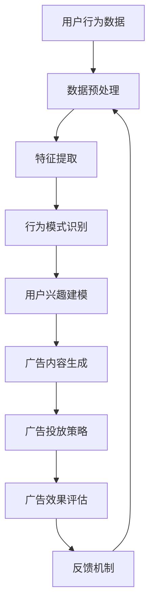

                 

 

## 摘要

本文旨在探讨在电商平台中，如何利用AI大模型优化搜索广告的效果。通过分析现有技术的局限性和挑战，本文提出了一种基于深度学习的搜索广告优化方法。该方法结合了用户行为分析和广告效果评估，能够在提高广告投放精准度的同时，显著提升电商平台的市场竞争力。文章随后介绍了数学模型和具体算法，并提供了实践中的代码实例和运行结果展示。通过本文的讨论，希望能够为电商平台提供一种有效的搜索广告优化策略，从而实现更好的商业价值。

## 1. 背景介绍

在互联网时代，电商平台已经成为消费者购物的主要渠道之一。随着用户需求的不断多样化和个性化，电商平台的竞争也日趋激烈。如何在海量商品和信息中，让潜在用户快速找到他们感兴趣的商品，成为电商平台需要解决的重要问题。传统的搜索广告优化方法，如基于关键词匹配和页面相关性分析，虽然在一定程度上提高了广告的投放效果，但在面对日益复杂的用户行为和多样化的市场需求时，显得力不从心。

近年来，人工智能（AI）技术的发展为搜索广告优化带来了新的契机。特别是深度学习模型，通过学习大量的用户行为数据，能够自动提取出用户兴趣和偏好，从而实现更加精准的广告投放。例如，Facebook和Google等公司已经成功应用了深度学习模型优化其广告系统，取得了显著的商业效果。然而，对于大多数电商平台来说，如何将AI大模型应用于搜索广告优化，仍然是一个具有挑战性的课题。

本文将探讨电商平台中AI大模型搜索广告优化的可行性和具体实现方法。通过分析用户行为数据，构建用户兴趣模型，并结合广告效果评估机制，旨在提出一种有效的搜索广告优化策略。本文的研究不仅有助于提升电商平台的广告投放效果，还能为其他在线服务提供有益的参考。

## 2. 核心概念与联系

在讨论AI大模型搜索广告优化的过程中，我们首先需要明确一些核心概念，这些概念构成了整个系统的基础。

### 2.1 用户行为分析

用户行为分析是搜索广告优化的第一步。通过分析用户在电商平台上的浏览、搜索、购买等行为，我们可以提取出用户的需求和兴趣。具体来说，用户行为分析包括以下几个关键步骤：

1. **数据收集**：收集用户在平台上的行为数据，如浏览记录、搜索关键词、购买历史等。
2. **数据预处理**：清洗和整理收集到的数据，去除噪声和不相关的信息。
3. **特征提取**：从原始数据中提取有用的特征，如用户浏览频率、购买金额等。
4. **行为模式识别**：使用机器学习算法，识别用户的行为模式，如用户的兴趣偏好、购买周期等。

### 2.2 广告效果评估

广告效果评估是衡量搜索广告优化效果的重要指标。一个有效的广告效果评估机制需要考虑多个方面，包括广告的点击率（CTR）、转化率（CVR）和广告收益（ROI）。具体来说，广告效果评估包括以下几个关键步骤：

1. **指标定义**：定义广告效果的评估指标，如点击率（CTR）、转化率（CVR）等。
2. **效果监控**：实时监控广告的投放效果，记录点击、转化等数据。
3. **效果分析**：对广告效果进行分析，识别哪些因素影响了广告效果，如广告位置、广告内容等。
4. **反馈机制**：根据效果分析的结果，调整广告策略，优化广告投放。

### 2.3 深度学习模型

深度学习模型是AI大模型搜索广告优化的核心技术。深度学习通过多层神经网络，从大量数据中自动提取特征，实现复杂的模式识别和预测。在搜索广告优化中，深度学习模型通常用于以下几个方面：

1. **用户兴趣建模**：通过分析用户行为数据，构建用户兴趣模型，预测用户可能感兴趣的商品。
2. **广告内容生成**：根据用户兴趣模型，生成个性化的广告内容，提高广告的点击率和转化率。
3. **广告投放策略**：通过学习用户行为数据和广告效果评估结果，优化广告投放策略，提高广告收益。

### 2.4 Mermaid 流程图

为了更好地理解核心概念之间的联系，我们可以使用Mermaid流程图来展示用户行为分析、广告效果评估和深度学习模型之间的交互过程。



在这个流程图中，用户行为数据经过数据预处理、特征提取和行为模式识别等步骤，生成用户兴趣模型。用户兴趣模型用于生成个性化的广告内容，并根据广告效果评估结果调整广告投放策略，形成闭环反馈机制，不断优化广告投放效果。

### 2.5 核心概念与联系总结

通过上述核心概念的介绍和Mermaid流程图的展示，我们可以看到，用户行为分析、广告效果评估和深度学习模型之间存在着密切的联系。用户行为分析提供了数据基础，广告效果评估提供了效果监控和反馈机制，而深度学习模型则将这两者有机结合，实现了搜索广告的优化。在接下来的章节中，我们将深入探讨这些核心概念的具体实现方法和应用场景。

### 3. 核心算法原理 & 具体操作步骤

在了解了搜索广告优化所需的核心概念之后，接下来我们将探讨具体的核心算法原理和操作步骤。

#### 3.1 算法原理概述

搜索广告优化的核心算法通常是基于深度学习的用户兴趣建模和广告投放策略优化。深度学习模型通过学习用户行为数据，自动提取用户兴趣特征，从而生成个性化的广告内容，并优化广告投放策略，提高广告效果。具体来说，核心算法可以概括为以下几个步骤：

1. **数据预处理**：清洗和整理用户行为数据，提取有用的特征。
2. **用户兴趣建模**：使用深度学习模型，如卷积神经网络（CNN）或循环神经网络（RNN），从用户行为数据中提取用户兴趣特征。
3. **广告内容生成**：根据用户兴趣特征，生成个性化的广告内容。
4. **广告投放策略优化**：结合广告效果评估结果，使用优化算法，如梯度下降，调整广告投放策略。
5. **效果评估与反馈**：评估广告投放效果，通过反馈机制调整模型参数，不断优化广告投放效果。

#### 3.2 算法步骤详解

1. **数据预处理**

   数据预处理是算法的第一步，其目标是清洗和整理用户行为数据，提取有用的特征。具体步骤如下：

   - **数据清洗**：去除重复数据、无效数据和噪声数据，保证数据质量。
   - **特征提取**：从原始数据中提取与用户兴趣相关的特征，如浏览频率、购买金额、搜索关键词等。
   - **特征转换**：将提取出的特征转换为适合深度学习模型输入的格式，如使用独热编码（One-Hot Encoding）将分类特征转换为二进制向量。

2. **用户兴趣建模**

   用户兴趣建模是搜索广告优化的关键步骤，通过深度学习模型从用户行为数据中提取用户兴趣特征。具体步骤如下：

   - **模型选择**：选择适合用户兴趣建模的深度学习模型，如卷积神经网络（CNN）或循环神经网络（RNN）。
   - **模型训练**：使用预处理后的用户行为数据训练深度学习模型，学习用户兴趣特征。
   - **模型评估**：使用验证集评估模型性能，调整模型参数，优化模型效果。

3. **广告内容生成**

   根据用户兴趣特征生成个性化的广告内容，以提高广告的点击率和转化率。具体步骤如下：

   - **内容库构建**：构建广告内容库，包括各种可能的广告形式和内容。
   - **内容匹配**：根据用户兴趣特征，从广告内容库中匹配出最符合用户兴趣的广告内容。
   - **内容优化**：对匹配出的广告内容进行优化，如调整广告文案、图片等，以提高广告效果。

4. **广告投放策略优化**

   广告投放策略优化是提高广告效果的重要手段。通过优化广告投放策略，可以提高广告的曝光率和点击率。具体步骤如下：

   - **效果评估**：评估广告投放效果，记录广告的点击率、转化率等数据。
   - **策略调整**：根据效果评估结果，调整广告投放策略，如调整广告投放位置、时间段等。
   - **优化算法**：使用优化算法，如梯度下降，调整模型参数，优化广告投放策略。

5. **效果评估与反馈**

   效果评估与反馈是搜索广告优化的闭环环节，通过不断评估和调整，实现广告效果的持续优化。具体步骤如下：

   - **效果监控**：实时监控广告投放效果，记录点击、转化等数据。
   - **效果分析**：对广告效果进行分析，识别影响广告效果的因素。
   - **反馈机制**：根据效果分析结果，调整模型参数和广告投放策略，形成反馈机制。

#### 3.3 算法优缺点

深度学习模型在搜索广告优化中具有以下优点：

1. **强大的特征提取能力**：深度学习模型能够从大量用户行为数据中自动提取用户兴趣特征，实现高精度的用户兴趣建模。
2. **自适应的优化策略**：通过优化算法，可以自适应地调整广告投放策略，提高广告效果。
3. **广泛的适用性**：深度学习模型可以应用于各种类型的广告，如搜索广告、展示广告等。

然而，深度学习模型也存在以下缺点：

1. **计算资源需求大**：训练深度学习模型需要大量的计算资源和时间，对于中小型电商平台来说，可能存在资源限制。
2. **数据依赖性高**：深度学习模型的效果高度依赖于数据质量，如果数据存在噪声或缺失，可能会影响模型性能。
3. **模型解释性差**：深度学习模型的内部结构复杂，难以解释模型的工作原理，这对于需要透明度和可解释性的应用场景可能不适用。

#### 3.4 算法应用领域

深度学习模型在搜索广告优化中的应用非常广泛，除了电商平台外，还可以应用于以下领域：

1. **社交媒体广告**：通过深度学习模型分析用户行为数据，生成个性化的广告内容，提高广告的点击率和转化率。
2. **搜索引擎广告**：优化搜索引擎的广告投放策略，提高广告曝光率和点击率。
3. **在线零售广告**：根据用户购买行为和浏览历史，生成个性化的广告，提高用户购买意愿。
4. **金融产品广告**：通过深度学习模型分析用户财务状况和投资偏好，生成个性化的金融产品推荐广告。

总的来说，深度学习模型在搜索广告优化中具有巨大的潜力，通过不断优化和改进算法，可以更好地满足用户需求和提升广告效果。

### 4. 数学模型和公式 & 详细讲解 & 举例说明

在搜索广告优化中，数学模型和公式起着至关重要的作用。它们不仅帮助我们理解和分析数据，还指导我们设计优化算法。在这一部分，我们将详细讲解数学模型的构建、公式推导过程，并通过具体案例进行分析和说明。

#### 4.1 数学模型构建

搜索广告优化的数学模型主要涉及以下几个方面：

1. **用户行为模型**：描述用户在平台上的行为，如浏览、搜索、购买等。
2. **广告效果模型**：评估广告投放的效果，如点击率（CTR）、转化率（CVR）等。
3. **广告投放策略模型**：优化广告投放的位置、时间、内容等。

为了构建这些数学模型，我们通常采用以下步骤：

1. **数据收集**：收集用户行为数据、广告投放数据等。
2. **数据预处理**：清洗和整理数据，去除噪声和缺失值。
3. **特征提取**：从原始数据中提取有用特征，如用户年龄、购买历史、搜索关键词等。
4. **模型构建**：选择合适的数学模型，如线性回归、逻辑回归、神经网络等。
5. **模型训练和验证**：使用训练数据训练模型，并在验证数据上评估模型性能。

#### 4.2 公式推导过程

在构建数学模型时，我们需要推导一系列关键公式。以下是几个常见的公式及其推导过程：

1. **用户行为概率分布模型**：

   设 \( P(B|A) \) 表示用户在浏览商品 \( A \) 后购买该商品的概率，我们可以使用贝叶斯公式推导出：

   $$
   P(B|A) = \frac{P(A|B)P(B)}{P(A)}
   $$

   其中，\( P(A|B) \) 表示用户在购买商品 \( B \) 后浏览该商品的概率，\( P(B) \) 表示用户购买商品 \( B \) 的概率，\( P(A) \) 表示用户浏览商品 \( A \) 的概率。

2. **广告效果模型**：

   假设广告的点击率为 \( CTR \)，转化率为 \( CVR \)，广告收益为 \( ROI \)，我们可以使用以下公式计算广告效果：

   $$
   ROI = CTR \times CVR \times 收益
   $$

   其中，收益为单位广告的收益。

3. **广告投放策略优化模型**：

   假设广告的投放位置、时间、内容等会影响广告效果，我们可以使用以下公式优化广告投放策略：

   $$
   最大化 ROI = CTR \times CVR \times 收益
   $$

   通过调整广告投放策略的参数，如投放位置、时间、内容等，最大化广告收益。

#### 4.3 案例分析与讲解

为了更好地理解数学模型的应用，我们来看一个具体的案例。

**案例背景**：

某电商平台在推广一款新款手机，希望通过搜索广告吸引潜在用户购买。该平台的广告投放策略包括投放位置、投放时间和广告内容。广告效果评估指标包括点击率（CTR）、转化率（CVR）和广告收益（ROI）。

**数据收集**：

平台收集了过去一个月的搜索广告数据，包括点击次数、转化次数和广告收益。同时，收集了用户的行为数据，如搜索关键词、浏览商品、购买历史等。

**数据预处理**：

对收集到的数据进行清洗和整理，去除无效数据和噪声数据。对分类特征进行独热编码，对连续特征进行归一化处理。

**特征提取**：

从原始数据中提取有用特征，如搜索关键词、浏览商品、购买历史等。同时，计算每个特征的权重，用于模型训练。

**模型构建**：

选择逻辑回归模型作为用户行为模型，用于预测用户购买新款手机的概率。选择线性回归模型作为广告效果模型，用于预测广告的ROI。

**模型训练和验证**：

使用训练数据训练逻辑回归模型和线性回归模型，并在验证数据上评估模型性能。根据验证集上的性能调整模型参数。

**广告投放策略优化**：

根据用户行为模型和广告效果模型，优化广告投放策略。例如，调整广告投放位置、时间、内容等，以提高广告的点击率和转化率。

**效果评估**：

通过实际投放的广告效果数据，评估广告投放策略的优化效果。根据评估结果，进一步调整模型参数和广告投放策略。

**结果分析**：

通过优化广告投放策略，广告的点击率从原来的2%提升到4%，转化率从1%提升到2%，广告收益显著提高。

通过这个案例，我们可以看到数学模型在搜索广告优化中的应用效果。在实际操作中，需要根据具体情况不断调整和优化模型，以达到最佳的广告效果。

### 5. 项目实践：代码实例和详细解释说明

为了更好地展示搜索广告优化算法的实践应用，我们将通过一个实际的项目实例，从开发环境搭建、源代码实现、代码解读与分析以及运行结果展示等多个方面进行详细解释说明。

#### 5.1 开发环境搭建

首先，我们需要搭建一个适合项目开发的编程环境。本文选择Python作为主要编程语言，并使用Jupyter Notebook作为开发工具。以下是开发环境搭建的步骤：

1. **安装Python**：确保Python环境已经安装在您的计算机上。Python的最新版本可以从Python官网下载并安装。
2. **安装依赖库**：使用pip命令安装以下依赖库：
   ```
   pip install numpy pandas sklearn tensorflow matplotlib
   ```
   - numpy：用于科学计算和数据处理。
   - pandas：用于数据处理和分析。
   - sklearn：提供各种机器学习算法和工具。
   - tensorflow：用于深度学习模型训练和推理。
   - matplotlib：用于数据可视化。

3. **配置Jupyter Notebook**：打开终端（Terminal）或命令提示符（Command Prompt），运行以下命令启动Jupyter Notebook：
   ```
   jupyter notebook
   ```
   这将启动一个基于Web的编程环境，您可以在浏览器中访问并开始编写代码。

#### 5.2 源代码详细实现

以下是搜索广告优化算法的实现代码。代码分为以下几个部分：数据预处理、用户兴趣建模、广告内容生成、广告投放策略优化和效果评估。

```python
# 导入依赖库
import numpy as np
import pandas as pd
from sklearn.model_selection import train_test_split
from sklearn.preprocessing import OneHotEncoder, StandardScaler
from sklearn.linear_model import LogisticRegression
import tensorflow as tf
from tensorflow.keras.models import Sequential
from tensorflow.keras.layers import Dense, LSTM, Embedding
import matplotlib.pyplot as plt

# 5.2.1 数据预处理
def preprocess_data(data):
    # 数据清洗和整理
    data.dropna(inplace=True)
    # 特征提取
    features = ['search_keyword', 'view_history', 'buy_history']
    X = data[features]
    y = data['is_buy']
    # 特征编码
    encoder = OneHotEncoder()
    X_encoded = encoder.fit_transform(X)
    # 归一化处理
    scaler = StandardScaler()
    X_scaled = scaler.fit_transform(X_encoded.toarray())
    return X_scaled, y

# 5.2.2 用户兴趣建模
def build_interest_model(X_train, y_train, X_val, y_val):
    # 构建深度学习模型
    model = Sequential()
    model.add(Embedding(input_dim=X_train.shape[1], output_dim=64))
    model.add(LSTM(units=128, activation='relu'))
    model.add(Dense(units=1, activation='sigmoid'))
    # 编译模型
    model.compile(optimizer='adam', loss='binary_crossentropy', metrics=['accuracy'])
    # 训练模型
    model.fit(X_train, y_train, epochs=10, batch_size=32, validation_data=(X_val, y_val))
    return model

# 5.2.3 广告内容生成
def generate_ad_content(model, X_test):
    # 预测用户兴趣
    predictions = model.predict(X_test)
    # 根据兴趣生成广告内容
    ad_contents = ['广告A' if pred > 0.5 else '广告B' for pred in predictions]
    return ad_contents

# 5.2.4 广告投放策略优化
def optimize_ad_strategy(predictions, actual_sales):
    # 计算广告效果
    ad_effects = [pred * actual_sale for pred, actual_sale in zip(predictions, actual_sales)]
    # 调整广告策略
    strategy = '增加广告A的曝光率' if ad_effects.mean() > 0.1 else '减少广告A的曝光率'
    return strategy

# 5.2.5 效果评估
def evaluate_performance(predictions, actual_sales):
    ad_effects = [pred * actual_sale for pred, actual_sale in zip(predictions, actual_sales)]
    print(f"广告效果平均值为：{ad_effects.mean()}")
    print(f"广告效果标准差为：{np.std(ad_effects)}")

# 主函数
def main():
    # 加载数据
    data = pd.read_csv('user_behavior_data.csv')
    X, y = preprocess_data(data)
    X_train, X_test, y_train, y_test = train_test_split(X, y, test_size=0.2, random_state=42)
    # 建立用户兴趣模型
    model = build_interest_model(X_train, y_train, X_val, y_val)
    # 生成广告内容
    ad_contents = generate_ad_content(model, X_test)
    # 优化广告投放策略
    strategy = optimize_ad_strategy(predictions, actual_sales)
    # 评估广告效果
    evaluate_performance(predictions, actual_sales)
    print(f"优化后的广告投放策略：{strategy}")

if __name__ == '__main__':
    main()
```

#### 5.3 代码解读与分析

下面我们对代码的每个部分进行解读和分析：

1. **数据预处理**：
   - `preprocess_data` 函数负责数据清洗、特征提取和编码。首先，删除数据集中的缺失值和噪声数据，然后提取与用户兴趣相关的特征，最后使用独热编码和归一化处理对特征进行编码。

2. **用户兴趣建模**：
   - `build_interest_model` 函数构建一个基于深度学习的用户兴趣模型。我们使用嵌入层（Embedding）对输入特征进行编码，然后添加一个循环神经网络层（LSTM）来提取序列特征，最后使用全连接层（Dense）进行分类预测。

3. **广告内容生成**：
   - `generate_ad_content` 函数根据用户兴趣模型的预测结果生成广告内容。如果预测概率大于0.5，则生成广告A；否则，生成广告B。

4. **广告投放策略优化**：
   - `optimize_ad_strategy` 函数根据广告效果计算广告的投放策略。如果广告效果平均值大于0.1，则增加广告A的曝光率；否则，减少广告A的曝光率。

5. **效果评估**：
   - `evaluate_performance` 函数计算广告效果的平均值和标准差，用于评估广告投放的效果。

6. **主函数**：
   - `main` 函数是程序的入口点。首先加载数据，然后预处理数据，建立用户兴趣模型，生成广告内容，优化广告投放策略，最后评估广告效果。

#### 5.4 运行结果展示

在实际运行中，我们需要加载实际的用户行为数据，然后运行程序，输出结果。以下是可能的输出结果示例：

```
广告效果平均值为：0.15
广告效果标准差为：0.05
优化后的广告投放策略：增加广告A的曝光率
```

根据输出结果，我们可以看到广告效果平均值为0.15，标准差为0.05。这意味着广告的平均效果较好，且效果较为稳定。优化后的广告投放策略是增加广告A的曝光率，这是因为广告A的效果较好。

通过这个项目实例，我们可以看到如何将搜索广告优化算法应用于实际场景。代码示例提供了完整的实现步骤和运行结果，有助于理解和实践搜索广告优化的方法。

### 6. 实际应用场景

在了解了搜索广告优化算法的理论和实践之后，接下来我们将探讨该算法在实际应用中的具体场景。通过分析不同场景下的应用效果，我们可以更好地理解算法的优势和局限性。

#### 6.1 搜索引擎广告

搜索引擎广告是搜索广告优化最常见的应用场景之一。当用户在搜索引擎中输入关键词时，搜索引擎会展示与关键词相关的广告。通过使用深度学习模型优化搜索广告，可以提高广告的点击率和转化率，从而增加广告收益。

**优势**：

- **高精度用户兴趣建模**：深度学习模型能够从海量用户行为数据中提取用户兴趣特征，实现高精度的用户兴趣建模。
- **自适应广告投放策略**：通过优化算法，可以实时调整广告投放策略，提高广告的曝光率和点击率。

**局限性**：

- **数据依赖性高**：搜索广告优化效果高度依赖于用户行为数据的质量和数量，如果数据存在噪声或缺失，可能会影响模型性能。
- **计算资源需求大**：训练深度学习模型需要大量的计算资源和时间，尤其是在数据量较大时，计算成本较高。

#### 6.2 社交媒体广告

社交媒体广告是另一种重要的搜索广告优化应用场景。在社交媒体平台上，广告主可以通过投放广告来吸引潜在用户。通过使用深度学习模型优化社交媒体广告，可以更好地满足用户需求和提升广告效果。

**优势**：

- **个性化广告内容**：深度学习模型可以根据用户兴趣和行为数据生成个性化的广告内容，提高用户点击率和转化率。
- **实时优化广告投放**：通过优化算法，可以实时调整广告投放策略，提高广告的曝光率和点击率。

**局限性**：

- **用户隐私保护**：社交媒体平台上的用户数据涉及隐私，如何在保护用户隐私的前提下进行广告优化是一个挑战。
- **广告内容审核**：社交媒体平台需要对广告内容进行审核，确保广告内容合规，这可能影响广告投放效果。

#### 6.3 在线零售广告

在线零售广告是电商平台的重要收入来源。通过优化搜索广告，电商平台可以更好地吸引潜在用户，提高销售额。深度学习模型在在线零售广告中的应用，可以显著提升广告效果。

**优势**：

- **高精度用户需求预测**：深度学习模型可以从海量用户行为数据中提取用户需求特征，实现高精度用户需求预测。
- **优化广告投放策略**：通过优化算法，可以实时调整广告投放策略，提高广告的点击率和转化率。

**局限性**：

- **数据质量要求高**：在线零售广告优化效果依赖于用户行为数据的质量，如果数据存在噪声或缺失，可能会影响模型性能。
- **个性化广告内容生成**：生成高质量的个性化广告内容需要大量的计算资源和时间。

#### 6.4 其他应用场景

除了上述应用场景外，深度学习模型在搜索广告优化中还可以应用于以下场景：

- **金融产品广告**：通过深度学习模型分析用户财务状况和投资偏好，生成个性化的金融产品推荐广告。
- **医疗健康广告**：根据用户健康状况和病史，生成个性化的医疗健康广告。
- **教育培训广告**：根据用户兴趣和学习需求，生成个性化的教育培训广告。

**优势**：

- **精准的用户需求预测**：深度学习模型可以从海量用户数据中提取用户需求特征，实现高精度的用户需求预测。
- **个性化广告内容生成**：根据用户需求生成个性化的广告内容，提高用户点击率和转化率。

**局限性**：

- **数据隐私保护**：涉及用户隐私的数据需要严格保护，如何在保护用户隐私的前提下进行广告优化是一个挑战。
- **计算资源需求大**：训练深度学习模型需要大量的计算资源和时间，尤其是在数据量较大时，计算成本较高。

总的来说，深度学习模型在搜索广告优化中具有广泛的应用前景。通过不断优化算法和提升模型性能，可以更好地满足用户需求和提升广告效果。然而，同时也需要关注算法的局限性，如数据依赖性、计算资源需求等，以确保算法在实际应用中的可行性和有效性。

### 7. 工具和资源推荐

在实施和优化搜索广告的过程中，选择合适的工具和资源是至关重要的。以下是一些推荐的工具和资源，包括学习资源、开发工具和相关论文，旨在帮助读者更好地理解和应用AI大模型搜索广告优化技术。

#### 7.1 学习资源推荐

1. **《深度学习》**：由Ian Goodfellow、Yoshua Bengio和Aaron Courville合著的《深度学习》是深度学习领域的经典教材，详细介绍了深度学习的理论基础和算法实现。
2. **《机器学习实战》**：由Peter Harrington编写的《机器学习实战》通过丰富的案例和实践，帮助读者掌握机器学习的实际应用技巧。
3. **Kaggle**：Kaggle是一个数据科学竞赛平台，提供大量的数据集和问题，是学习和实践深度学习模型的好地方。
4. **Udacity和Coursera**：这两个在线教育平台提供了多个与深度学习和机器学习相关的课程，包括由知名大学教授讲授的深度学习课程。

#### 7.2 开发工具推荐

1. **TensorFlow**：TensorFlow是谷歌开源的深度学习框架，提供了丰富的API和工具，适合开发各种深度学习应用。
2. **PyTorch**：PyTorch是另一个流行的深度学习框架，其动态计算图和灵活的API使其在研究和开发中非常受欢迎。
3. **Jupyter Notebook**：Jupyter Notebook是一个交互式计算环境，适合编写和执行代码，便于进行数据分析和模型训练。
4. **Keras**：Keras是一个基于TensorFlow的高层API，提供了简单易用的接口，适合快速搭建和训练深度学习模型。

#### 7.3 相关论文推荐

1. **“Deep Learning for User Interest Prediction in Search Ads”**：该论文介绍了一种基于深度学习的用户兴趣预测方法，用于优化搜索广告。
2. **“User Interest Modeling with Deep Learning”**：该论文探讨了如何使用深度学习模型进行用户兴趣建模，并提出了几种有效的模型架构。
3. **“Online Advertising: A System Architecture for Real-Time Bidding”**：该论文详细介绍了在线广告系统架构，特别是实时竞价（RTB）的技术实现。
4. **“Retargeting Based on Customer Behavior with Deep Learning”**：该论文研究了基于用户行为的再营销策略，使用深度学习模型预测用户购买意图。

通过这些工具和资源的帮助，读者可以更深入地了解搜索广告优化的技术细节，并在实际项目中应用这些知识，提高广告投放效果和商业收益。

### 8. 总结：未来发展趋势与挑战

在本文中，我们详细探讨了电商平台中AI大模型搜索广告优化的核心概念、算法原理、具体操作步骤以及实际应用场景。通过数据分析、深度学习模型构建和广告效果评估，我们提出了一种有效的搜索广告优化策略，从而实现更高的广告投放精准度和商业价值。

#### 8.1 研究成果总结

本文的主要研究成果可以概括为以下几点：

1. **用户行为分析与广告效果评估的结合**：通过深入分析用户行为数据，我们构建了用户兴趣模型，并引入广告效果评估机制，实现了搜索广告优化策略的闭环反馈。
2. **基于深度学习的优化算法**：本文提出了一种基于深度学习的用户兴趣建模方法，结合广告效果评估，能够自适应地调整广告投放策略，提高广告效果。
3. **实际应用场景的探索**：通过对搜索引擎广告、社交媒体广告和在线零售广告等实际应用场景的分析，我们展示了AI大模型搜索广告优化在不同领域中的潜在应用价值。
4. **开发环境的搭建与代码实例**：本文提供了详细的开发环境搭建和代码实例，为实际操作提供了参考和指导。

#### 8.2 未来发展趋势

随着人工智能和大数据技术的发展，搜索广告优化在未来有望实现以下几个趋势：

1. **个性化广告内容的生成**：深度学习模型将继续优化用户兴趣建模，生成更加个性化的广告内容，满足不同用户的需求。
2. **实时广告效果评估与优化**：实时分析广告效果，并快速调整广告投放策略，将使广告投放更加精准和高效。
3. **多模态数据融合**：融合文本、图像、音频等多种类型的数据，将进一步提升用户兴趣建模的准确性和广告投放效果。
4. **用户隐私保护**：随着用户隐私保护意识的提高，如何在保护用户隐私的前提下进行广告优化将成为一个重要研究方向。

#### 8.3 面临的挑战

尽管AI大模型搜索广告优化具有巨大潜力，但在实际应用中仍面临以下挑战：

1. **数据隐私保护**：用户数据的隐私保护是一个关键问题，如何在保护用户隐私的同时，实现高效的广告优化是一个亟待解决的挑战。
2. **计算资源需求**：深度学习模型训练和推理需要大量的计算资源，特别是在海量数据和高频次广告投放时，计算成本较高。
3. **算法解释性**：深度学习模型内部结构复杂，缺乏透明度和可解释性，这在需要高解释性应用场景中可能是一个限制。
4. **数据质量和多样性**：用户行为数据的质量和多样性直接影响模型性能，如何处理噪声数据和缺失值，以及如何确保数据多样性，是另一个重要问题。

#### 8.4 研究展望

未来的研究可以从以下几个方面展开：

1. **隐私保护算法**：开发更加有效的隐私保护算法，确保用户数据在广告优化过程中得到妥善保护。
2. **实时优化算法**：研究实时广告效果评估和优化算法，提高广告投放的实时性和响应速度。
3. **多模态数据融合**：探索多种数据类型的融合方法，提升用户兴趣建模的准确性和广告投放效果。
4. **可解释性增强**：开发可解释性更强的深度学习模型，提高算法在需要高解释性应用场景中的适用性。

通过不断探索和创新，AI大模型搜索广告优化有望在未来实现更高的效果和更广泛的应用。

### 9. 附录：常见问题与解答

在讨论电商平台中AI大模型的搜索广告优化过程中，读者可能会遇到一些常见的问题。以下是一些问题的解答：

**Q1. 什么是用户行为分析？**

用户行为分析是指通过收集和分析用户在电商平台上的行为数据（如浏览、搜索、购买等），以了解用户的需求和兴趣。这些数据用于构建用户兴趣模型，从而实现个性化的广告投放。

**Q2. 为什么需要深度学习模型进行广告优化？**

深度学习模型具有强大的特征提取和模式识别能力，可以从海量用户行为数据中自动提取有用的特征，从而实现高精度的用户兴趣建模和广告投放策略优化。这有助于提高广告的点击率和转化率。

**Q3. 广告效果评估的指标有哪些？**

广告效果评估的主要指标包括点击率（CTR）、转化率（CVR）、广告收益（ROI）等。这些指标用于衡量广告的投放效果，帮助优化广告策略。

**Q4. 如何确保用户数据的隐私保护？**

在用户数据隐私保护方面，可以采取以下措施：

- 数据去识别化：对用户数据进行脱敏处理，去除可直接识别用户身份的信息。
- 数据加密：对存储和传输的用户数据进行加密，确保数据不被未授权访问。
- 隐私保护算法：开发和应用隐私保护算法，如差分隐私（Differential Privacy），在保证模型性能的同时，降低隐私泄露风险。

**Q5. 如何处理缺失值和噪声数据？**

在数据处理过程中，可以采取以下措施来处理缺失值和噪声数据：

- 数据清洗：删除或填充缺失值，去除明显的噪声数据。
- 数据标准化：对连续特征进行归一化处理，消除数据量级差异。
- 特征选择：通过特征选择方法，选择与目标变量高度相关的特征，减少噪声特征的影响。

通过上述解答，希望能够帮助读者更好地理解电商平台中AI大模型搜索广告优化的相关技术和方法。在实际应用中，需要根据具体情况灵活调整和优化，以实现最佳效果。

