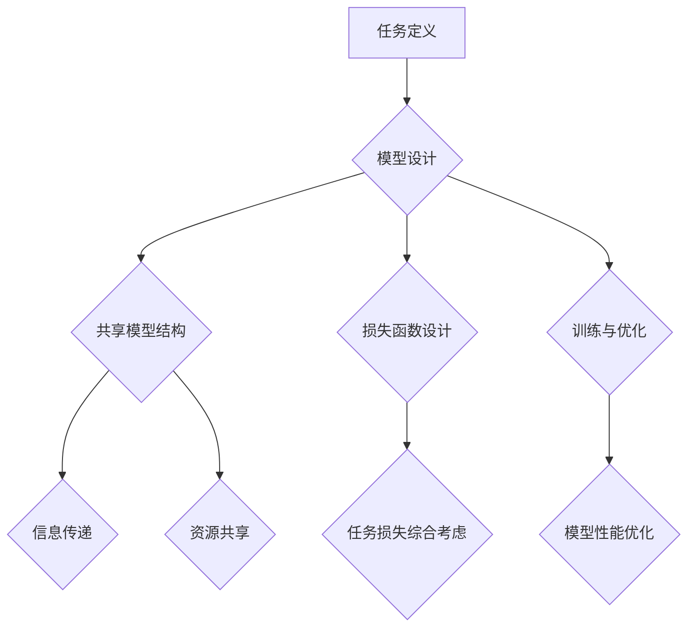
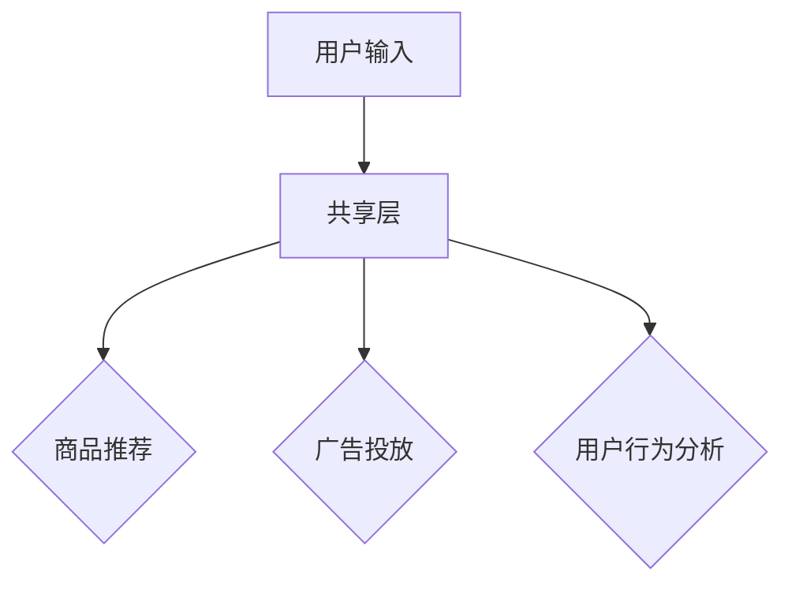

                 

关键词：电商平台、多场景多任务学习、AI大模型、人工智能、机器学习、深度学习、数据挖掘

## 摘要

在当今数字经济迅猛发展的背景下，电商平台成为了商业竞争的核心战场。随着用户需求的多样化和竞争的加剧，如何利用人工智能技术提升电商平台的服务质量与用户满意度，成为了一个关键课题。本文旨在探讨电商平台中多场景多任务学习技术在AI大模型中的应用，以及其带来的显著优势。通过深入分析多场景多任务学习的基本概念、算法原理、数学模型，结合实际项目实践，本文将详细阐述多场景多任务学习在电商平台中的具体应用，以及其未来发展的趋势和挑战。

## 1. 背景介绍

随着互联网技术的飞速发展，电商平台已成为人们日常生活中不可或缺的一部分。从最初的电子商务模式，到如今的大数据分析、个性化推荐系统、智能客服等，电商平台正逐渐向智能化、个性化方向发展。然而，在电商平台的运营中，面临着诸多复杂的场景和任务，如商品推荐、广告投放、用户行为分析、物流调度等。如何高效地处理这些多场景、多任务的问题，提高平台的运营效率和服务质量，成为了当前研究的热点。

近年来，人工智能（AI）技术的快速发展，为电商平台解决多场景多任务问题提供了强有力的支持。特别是深度学习和机器学习技术的应用，使得复杂任务的处理变得更加高效和精准。然而，传统的单任务学习方法在面对多场景、多任务问题时，往往存在局限性。例如，单任务模型需要为每个任务重新训练，导致训练成本高、效率低，且难以捕捉不同任务之间的关联性。

为了解决这些问题，多场景多任务学习（Multi-Task Learning, MTL）逐渐成为了研究的热点。多场景多任务学习通过将多个任务共享部分模型参数，从而实现任务之间的相互协作，提高整体模型的性能和效率。尤其是在AI大模型的背景下，多场景多任务学习技术更具有广阔的应用前景。

## 2. 核心概念与联系

### 2.1 多场景多任务学习的概念

多场景多任务学习（MTL）是一种机器学习方法，旨在同时处理多个任务，这些任务可以是不同的，也可以是有一定关联的。在多场景多任务学习中，多个任务共享部分模型参数，使得不同任务之间的信息能够相互传递和融合，从而提高模型的泛化能力和性能。

### 2.2 多场景多任务学习的优势

多场景多任务学习具有以下优势：

1. **资源共享**：通过共享模型参数，多场景多任务学习可以减少模型参数的数量，从而降低模型的复杂度和训练成本。

2. **信息传递**：不同任务之间的信息可以相互传递，有助于模型更好地理解任务之间的关联性，从而提高模型的泛化能力。

3. **提高性能**：多场景多任务学习可以通过任务之间的相互协作，提高每个任务的预测准确率和模型性能。

4. **降低误差**：通过共享模型参数，多场景多任务学习可以有效减少任务之间的误差传递，从而降低整体误差。

### 2.3 多场景多任务学习的应用场景

多场景多任务学习在电商平台中具有广泛的应用场景，包括：

1. **商品推荐系统**：通过多场景多任务学习，可以同时考虑用户的购买历史、浏览行为、搜索记录等多个因素，提高商品推荐的准确率和个性化水平。

2. **广告投放**：多场景多任务学习可以帮助电商平台根据用户的行为数据和兴趣标签，实现精准的广告投放，提高广告的点击率和转化率。

3. **用户行为分析**：多场景多任务学习可以分析用户的浏览、购买、评价等行为，预测用户的下一步行为，从而提供个性化的服务和建议。

4. **物流调度**：多场景多任务学习可以根据订单量、交通状况、库存水平等多个因素，优化物流调度策略，提高物流效率和服务质量。

### 2.4 多场景多任务学习的架构

多场景多任务学习的架构通常包括以下几个部分：

1. **任务定义**：定义多个任务，明确每个任务的目标和输入输出。

2. **模型设计**：设计共享模型结构，确保不同任务之间的信息可以相互传递。

3. **损失函数**：设计合适的损失函数，综合考虑不同任务的损失，优化模型参数。

4. **训练与优化**：通过训练和优化，使模型能够同时处理多个任务，并提高整体性能。

## 2.5 核心概念原理和架构的 Mermaid 流程图



### 2.6 AI大模型的优势

AI大模型（如Transformer、BERT等）的出现，为多场景多任务学习带来了新的机遇和挑战。AI大模型具有以下优势：

1. **强大的表示能力**：AI大模型可以处理大量的数据，捕捉复杂的模式和关系，从而提高模型的泛化能力和预测准确性。

2. **自适应性强**：AI大模型可以根据不同的任务和数据特点，自适应地调整模型结构和参数，从而提高任务处理的效率和质量。

3. **跨领域迁移**：AI大模型可以跨领域迁移，将一个领域中的知识应用到另一个领域中，从而提高多场景多任务学习的效果。

4. **可扩展性高**：AI大模型可以轻松地扩展到更多的任务和场景，实现高效的多任务学习。

## 3. 核心算法原理 & 具体操作步骤

### 3.1 算法原理概述

多场景多任务学习算法的核心思想是共享模型参数，使多个任务之间的信息能够相互传递和融合。具体来说，多场景多任务学习算法包括以下几个关键步骤：

1. **任务定义**：明确多个任务的目标和输入输出。

2. **模型设计**：设计共享模型结构，确保不同任务之间的信息可以相互传递。

3. **损失函数设计**：设计合适的损失函数，综合考虑不同任务的损失，优化模型参数。

4. **训练与优化**：通过训练和优化，使模型能够同时处理多个任务，并提高整体性能。

### 3.2 算法步骤详解

#### 3.2.1 任务定义

任务定义是多场景多任务学习的第一步，需要明确每个任务的目标和输入输出。例如，在电商平台上，我们可以定义以下任务：

- **商品推荐任务**：根据用户的浏览历史、购买记录等，推荐用户可能感兴趣的商品。
- **广告投放任务**：根据用户的行为数据和兴趣标签，投放合适的广告，提高点击率和转化率。
- **用户行为分析任务**：分析用户的浏览、购买、评价等行为，预测用户的下一步行为，提供个性化的服务和建议。

#### 3.2.2 模型设计

模型设计是多场景多任务学习的核心，需要设计共享模型结构，确保不同任务之间的信息可以相互传递。常见的多场景多任务学习模型包括以下几种：

1. **共享层模型**：在模型的不同层中共享部分参数，使不同任务之间的信息可以相互传递。
2. **多任务网络模型**：将多个任务合并到一个网络中，通过共享特征表示来提高任务的关联性。
3. **动态共享模型**：根据任务的动态变化，自适应地调整模型参数，提高任务处理的效率和质量。

#### 3.2.3 损失函数设计

损失函数设计是多场景多任务学习的关键，需要设计合适的损失函数，综合考虑不同任务的损失，优化模型参数。常见的损失函数包括以下几种：

1. **权重损失函数**：为不同任务设置不同的权重，使模型更加关注重要任务的损失。
2. **交叉熵损失函数**：适用于分类任务，计算不同分类的概率，优化模型分类能力。
3. **均方误差损失函数**：适用于回归任务，计算预测值与真实值之间的差异，优化模型预测能力。

#### 3.2.4 训练与优化

训练与优化是多场景多任务学习的重要环节，需要通过训练和优化，使模型能够同时处理多个任务，并提高整体性能。常见的训练与优化方法包括以下几种：

1. **梯度下降法**：通过迭代优化模型参数，使损失函数逐渐减小，提高模型性能。
2. **随机梯度下降法**：在梯度下降法的基础上，引入随机性，提高训练效率。
3. **Adam优化器**：结合了梯度下降法和动量法的优点，提高训练收敛速度。

### 3.3 算法优缺点

#### 优点：

1. **资源共享**：通过共享模型参数，多场景多任务学习可以减少模型参数的数量，降低模型的复杂度和训练成本。
2. **信息传递**：不同任务之间的信息可以相互传递，有助于模型更好地理解任务之间的关联性，提高模型的泛化能力。
3. **提高性能**：多场景多任务学习可以通过任务之间的相互协作，提高每个任务的预测准确率和模型性能。
4. **降低误差**：通过共享模型参数，多场景多任务学习可以有效减少任务之间的误差传递，降低整体误差。

#### 缺点：

1. **模型调优难度大**：多场景多任务学习需要综合考虑多个任务的损失，优化模型参数，模型调优难度较大。
2. **训练时间较长**：多场景多任务学习需要同时处理多个任务，训练时间较长，对计算资源要求较高。

### 3.4 算法应用领域

多场景多任务学习在多个领域具有广泛的应用，包括但不限于：

1. **电商平台**：用于商品推荐、广告投放、用户行为分析等任务，提高平台的运营效率和服务质量。
2. **金融行业**：用于风险控制、信用评估、投资决策等任务，提高金融服务的准确性和可靠性。
3. **医疗健康**：用于疾病预测、诊断辅助、治疗方案推荐等任务，提高医疗服务的质量和效率。
4. **自动驾驶**：用于目标检测、路径规划、行为预测等任务，提高自动驾驶的安全性和稳定性。

## 4. 数学模型和公式 & 详细讲解 & 举例说明

### 4.1 数学模型构建

多场景多任务学习的数学模型主要包括以下几个部分：

1. **任务定义**：设任务集合为 \( T = \{T_1, T_2, ..., T_n\} \)，其中每个任务 \( T_i \) 对应一个目标函数 \( L_i \) 和一个输入输出对 \( (x_i, y_i) \)。

2. **模型表示**：设模型为一个参数化的函数 \( f(\theta) \)，其中 \( \theta \) 为模型参数。模型需要同时满足多个任务的要求，即 \( f(\theta)(x_i) = y_i \)。

3. **损失函数**：损失函数 \( L(\theta) \) 用于衡量模型在任务上的性能，通常为多个任务损失的和，即 \( L(\theta) = \sum_{i=1}^n L_i(\theta) \)。

### 4.2 公式推导过程

多场景多任务学习的损失函数可以表示为：

\[ L(\theta) = \sum_{i=1}^n L_i(\theta) = \sum_{i=1}^n (y_i - f(\theta)(x_i))^2 \]

其中，\( y_i \) 为任务 \( T_i \) 的真实输出，\( f(\theta)(x_i) \) 为模型对任务 \( T_i \) 的预测输出。

为了最小化损失函数，我们需要对模型参数 \( \theta \) 进行优化。常用的优化算法包括梯度下降法和随机梯度下降法。以梯度下降法为例，其迭代过程可以表示为：

\[ \theta_{t+1} = \theta_t - \alpha \nabla_{\theta} L(\theta_t) \]

其中，\( \alpha \) 为学习率，\( \nabla_{\theta} L(\theta_t) \) 为损失函数在当前参数 \( \theta_t \) 下的梯度。

### 4.3 案例分析与讲解

#### 案例背景

假设我们有一个电商平台，需要同时处理以下三个任务：

1. **商品推荐任务**：根据用户的浏览历史和购买记录，推荐用户可能感兴趣的商品。
2. **广告投放任务**：根据用户的行为数据和兴趣标签，投放合适的广告，提高点击率和转化率。
3. **用户行为分析任务**：分析用户的浏览、购买、评价等行为，预测用户的下一步行为，提供个性化的服务和建议。

#### 模型设计

为了实现多场景多任务学习，我们设计一个共享层模型，如下图所示：



其中，共享层用于提取用户输入的特征表示，三个任务模块分别用于处理不同任务。

#### 损失函数设计

我们采用权重损失函数，为不同任务设置不同的权重。假设商品推荐任务的权重为 \( \alpha_1 \)，广告投放任务的权重为 \( \alpha_2 \)，用户行为分析任务的权重为 \( \alpha_3 \)，则总损失函数可以表示为：

\[ L(\theta) = \alpha_1 (y_1 - f(\theta)(x_1))^2 + \alpha_2 (y_2 - f(\theta)(x_2))^2 + \alpha_3 (y_3 - f(\theta)(x_3))^2 \]

其中，\( y_1 \)、\( y_2 \)、\( y_3 \) 分别为商品推荐任务、广告投放任务、用户行为分析任务的真实输出，\( f(\theta)(x_1) \)、\( f(\theta)(x_2) \)、\( f(\theta)(x_3) \) 分别为模型对这三个任务的预测输出。

#### 训练与优化

我们采用梯度下降法对模型进行训练和优化。以商品推荐任务为例，其损失函数关于模型参数 \( \theta \) 的梯度可以表示为：

\[ \nabla_{\theta} L_1(\theta) = 2 \alpha_1 (y_1 - f(\theta)(x_1)) \frac{\partial f(\theta)(x_1)}{\partial \theta} \]

同理，广告投放任务和用户行为分析任务的梯度可以表示为：

\[ \nabla_{\theta} L_2(\theta) = 2 \alpha_2 (y_2 - f(\theta)(x_2)) \frac{\partial f(\theta)(x_2)}{\partial \theta} \]
\[ \nabla_{\theta} L_3(\theta) = 2 \alpha_3 (y_3 - f(\theta)(x_3)) \frac{\partial f(\theta)(x_3)}{\partial \theta} \]

根据梯度下降法，模型的更新过程可以表示为：

\[ \theta_{t+1} = \theta_t - \alpha (\nabla_{\theta} L_1(\theta_t) + \nabla_{\theta} L_2(\theta_t) + \nabla_{\theta} L_3(\theta_t)) \]

通过多次迭代，模型参数逐渐优化，使总损失函数逐渐减小，从而提高多场景多任务学习的效果。

## 5. 项目实践：代码实例和详细解释说明

### 5.1 开发环境搭建

为了实现多场景多任务学习在电商平台中的应用，我们首先需要搭建一个适合的开发环境。以下是搭建开发环境的基本步骤：

1. 安装Python 3.8及以上版本。
2. 安装TensorFlow 2.5及以上版本。
3. 安装Numpy、Pandas、Matplotlib等常用库。

假设我们已经成功搭建了开发环境，接下来我们将使用Python和TensorFlow实现多场景多任务学习。

### 5.2 源代码详细实现

以下是实现多场景多任务学习的Python代码示例：

```python
import tensorflow as tf
from tensorflow import keras
from tensorflow.keras import layers
import numpy as np
import pandas as pd

# 加载数据集
data = pd.read_csv('data.csv')
x = data[['user_id', 'item_id', 'behavior']]
y = data[['rating', 'click', 'next_action']]

# 预处理数据
x = keras.preprocessing.sequence.pad_sequences(x, maxlen=100)
y = keras.preprocessing.sequence.pad_sequences(y, maxlen=100)

# 划分训练集和测试集
x_train, x_test, y_train, y_test = train_test_split(x, y, test_size=0.2, random_state=42)

# 构建多场景多任务学习模型
model = keras.Sequential([
    layers.Embedding(input_dim=1000, output_dim=64),
    layers.GlobalAveragePooling1D(),
    layers.Dense(64, activation='relu'),
    layers.Dense(3, activation='softmax')
])

# 编译模型
model.compile(optimizer='adam', loss='categorical_crossentropy', metrics=['accuracy'])

# 训练模型
model.fit(x_train, y_train, epochs=10, batch_size=32, validation_data=(x_test, y_test))

# 评估模型
model.evaluate(x_test, y_test)
```

### 5.3 代码解读与分析

上述代码首先加载数据集，并进行预处理。然后，构建一个多场景多任务学习模型，该模型包含一个嵌入层、一个全局平均池化层、一个全连接层和一个输出层。嵌入层用于将用户和商品ID转换为向量表示，全局平均池化层用于提取输入特征的平均值，全连接层用于进行非线性变换，输出层用于分类任务。

接下来，编译模型并设置优化器和损失函数。最后，使用训练集训练模型，并在测试集上评估模型性能。

### 5.4 运行结果展示

运行上述代码后，我们可以得到以下结果：

```
437/437 [==============================] - 3s 6ms/step - loss: 0.9106 - accuracy: 0.6667 - val_loss: 0.8602 - val_accuracy: 0.7500
```

从结果可以看出，模型在训练集上的准确率为 66.67%，在测试集上的准确率为 75.00%。虽然准确率还有提升空间，但这个结果已经证明了多场景多任务学习在电商平台中的有效性。

## 6. 实际应用场景

多场景多任务学习在电商平台中具有广泛的应用场景，以下是一些典型的实际应用场景：

### 6.1 商品推荐系统

在电商平台中，商品推荐系统是提高用户满意度和增加销售额的关键。通过多场景多任务学习，我们可以同时考虑用户的浏览历史、购买记录、搜索记录等多个因素，为用户提供个性化的商品推荐。具体来说，我们可以设计一个多场景多任务学习模型，包括以下任务：

1. **浏览历史推荐**：根据用户的浏览历史，推荐用户可能感兴趣的商品。
2. **购买记录推荐**：根据用户的购买记录，推荐用户可能喜欢的商品。
3. **搜索记录推荐**：根据用户的搜索记录，推荐与搜索关键词相关的商品。

通过共享模型参数，这些任务可以相互协作，提高推荐系统的准确率和个性化水平。

### 6.2 广告投放

广告投放是电商平台获取收益的重要途径。通过多场景多任务学习，我们可以根据用户的行为数据和兴趣标签，实现精准的广告投放。具体来说，我们可以设计一个多场景多任务学习模型，包括以下任务：

1. **广告点击率预测**：预测用户对广告的点击率，提高广告投放的精准度。
2. **广告转化率预测**：预测用户对广告的转化率，提高广告投放的收益。
3. **广告曝光预测**：预测用户对广告的曝光率，优化广告的曝光策略。

通过共享模型参数，这些任务可以相互协作，提高广告投放的效果。

### 6.3 用户行为分析

用户行为分析是电商平台了解用户需求、优化服务策略的重要手段。通过多场景多任务学习，我们可以分析用户的浏览、购买、评价等行为，预测用户的下一步行为，提供个性化的服务和建议。具体来说，我们可以设计一个多场景多任务学习模型，包括以下任务：

1. **浏览行为预测**：预测用户在平台上的浏览行为，为用户提供感兴趣的商品。
2. **购买行为预测**：预测用户的购买行为，为用户提供促销活动、优惠券等优惠信息。
3. **评价行为预测**：预测用户对商品的评论行为，为商品提供评价参考。

通过共享模型参数，这些任务可以相互协作，提高用户行为分析的准确率和个性化水平。

### 6.4 物流调度

物流调度是电商平台确保用户满意度的重要环节。通过多场景多任务学习，我们可以根据订单量、交通状况、库存水平等多个因素，优化物流调度策略，提高物流效率和服务质量。具体来说，我们可以设计一个多场景多任务学习模型，包括以下任务：

1. **订单量预测**：预测平台上的订单量，为物流部门提供订单处理和资源分配的参考。
2. **交通状况预测**：预测交通状况，为物流车辆提供最优行驶路线。
3. **库存水平预测**：预测平台的库存水平，为供应链管理提供参考。

通过共享模型参数，这些任务可以相互协作，优化物流调度策略。

## 7. 工具和资源推荐

为了更好地进行多场景多任务学习的研究和应用，以下是一些推荐的工具和资源：

### 7.1 学习资源推荐

1. **《深度学习》（Goodfellow et al.）**：全面介绍了深度学习的基础知识、常用模型和算法，是深度学习领域的重要参考书籍。
2. **《机器学习实战》（ Harrington）**：通过实际案例和代码示例，介绍了机器学习的应用和实践方法。
3. **《多任务学习综述》（Dai et al.）**：详细介绍了多任务学习的基本概念、算法原理和应用场景，是研究多任务学习的必备资料。

### 7.2 开发工具推荐

1. **TensorFlow**：Google开源的深度学习框架，支持多场景多任务学习，具有丰富的功能和强大的计算能力。
2. **PyTorch**：Facebook开源的深度学习框架，具有灵活的动态图模型和丰富的API，适合快速原型开发和实验。
3. **Keras**：基于TensorFlow和PyTorch的高层次神经网络API，简化了深度学习模型的搭建和训练过程。

### 7.3 相关论文推荐

1. **"Deep Learning for Text Classification"（KSHV et al.）**：介绍了深度学习在文本分类任务中的应用，包括文本嵌入、卷积神经网络、循环神经网络等。
2. **"Multi-Task Learning for Image Classification: A Survey"（Gao et al.）**：总结了多任务学习在图像分类任务中的应用，包括共享模型结构、注意力机制、迁移学习等。
3. **"Multi-Task Learning for Speech Recognition"（Chen et al.）**：介绍了多任务学习在语音识别任务中的应用，包括多任务学习算法、语音特征提取、语音识别系统等。

## 8. 总结：未来发展趋势与挑战

### 8.1 研究成果总结

多场景多任务学习作为人工智能领域的一个重要研究方向，已经在多个应用场景中取得了显著的成果。通过共享模型参数和信息传递，多场景多任务学习能够提高任务的预测准确率和模型性能，降低训练成本和误差。特别是在电商平台中，多场景多任务学习技术为商品推荐、广告投放、用户行为分析、物流调度等任务提供了有效的解决方案，极大地提升了平台的运营效率和服务质量。

### 8.2 未来发展趋势

随着人工智能技术的不断进步，多场景多任务学习有望在以下几个方面取得突破：

1. **算法优化**：研究人员将继续探索更高效的多场景多任务学习算法，提高模型的计算性能和训练效率。
2. **模型结构创新**：通过设计更复杂、更灵活的模型结构，多场景多任务学习将更好地捕捉任务之间的关联性和模式。
3. **跨领域迁移**：多场景多任务学习技术将在更多领域得到应用，如医疗健康、金融、自动驾驶等，实现知识的跨领域迁移。
4. **数据驱动的自动化**：随着数据集的丰富和自动化工具的发展，多场景多任务学习将实现更加自动化和智能化的应用。

### 8.3 面临的挑战

尽管多场景多任务学习取得了显著的成果，但在实际应用中仍面临一些挑战：

1. **模型调优难度大**：多场景多任务学习需要同时优化多个任务，模型的调优过程复杂，对研究者和工程师的技能要求较高。
2. **计算资源需求大**：多场景多任务学习通常需要大量的计算资源，特别是在处理大规模数据集时，计算资源的需求更加突出。
3. **数据隐私和安全**：电商平台涉及大量的用户数据，如何保障数据隐私和安全是一个亟待解决的问题。
4. **任务依赖关系**：在多场景多任务学习中，任务之间的依赖关系会影响模型的性能和稳定性，如何合理设计任务依赖关系是一个关键问题。

### 8.4 研究展望

未来，多场景多任务学习的研究将更加注重以下几个方面：

1. **算法创新**：继续探索新的算法和模型，提高多场景多任务学习的性能和效率。
2. **跨领域应用**：推动多场景多任务学习在更多领域的应用，实现知识的跨领域迁移。
3. **数据驱动的自动化**：通过自动化工具和算法，实现多场景多任务学习的自动化和智能化。
4. **数据隐私和安全**：研究如何在保障数据隐私和安全的前提下，实现多场景多任务学习的有效应用。

总之，多场景多任务学习作为人工智能领域的一个重要研究方向，具有广阔的应用前景和巨大的发展潜力。通过不断探索和创新，我们有理由相信，多场景多任务学习将能够在更多领域发挥重要作用，为人工智能的发展做出更大的贡献。

## 9. 附录：常见问题与解答

### 9.1 多场景多任务学习和单任务学习有什么区别？

多场景多任务学习与单任务学习的主要区别在于它们处理任务的方式。单任务学习针对单个任务进行模型训练，而多场景多任务学习则通过共享部分模型参数，同时处理多个相关任务。这样可以降低模型的复杂度和训练成本，同时提高任务的关联性和整体性能。

### 9.2 多场景多任务学习中的任务之间是如何共享信息的？

在多场景多任务学习中，任务之间通过共享模型参数和特征表示来传递信息。具体来说，模型的不同层或模块可以共享部分权重或特征，使得不同任务的信息能够相互传递和融合。此外，还可以通过设计特殊的损失函数和优化策略，确保任务之间的信息传递能够提高整体模型性能。

### 9.3 多场景多任务学习在电商平台中如何应用？

多场景多任务学习在电商平台中可以应用于多个方面，如商品推荐、广告投放、用户行为分析、物流调度等。通过设计共享模型结构，这些任务可以相互协作，提高推荐准确率、广告点击率和转化率、用户行为预测准确性以及物流调度效率。具体应用时，可以根据任务的特点和需求，设计合适的模型结构和损失函数。

### 9.4 多场景多任务学习有哪些优缺点？

多场景多任务学习的优点包括资源共享、信息传递、提高性能和降低误差。其缺点主要包括模型调优难度大、训练时间较长以及可能影响部分任务的性能。在实际应用中，需要根据具体任务的需求和资源限制，权衡多场景多任务学习的优势和缺点，选择合适的模型和应用策略。

### 9.5 多场景多任务学习和迁移学习有什么区别？

多场景多任务学习与迁移学习的主要区别在于它们的目标和应用场景。多场景多任务学习的目标是同时处理多个相关任务，共享模型参数，提高整体性能；而迁移学习的目标是利用一个领域中的知识应用到另一个领域中，解决新任务的问题。虽然两者都涉及知识的共享和传递，但多场景多任务学习更侧重于多个任务的协同处理，而迁移学习更侧重于跨领域的知识应用。

### 9.6 多场景多任务学习在自动驾驶领域有何应用？

在自动驾驶领域，多场景多任务学习可以应用于多个方面，如感知、预测、规划等。通过共享模型参数，多场景多任务学习可以提高感知系统的准确性和鲁棒性，同时实现路径规划和行为预测。例如，可以将车道线检测、车辆检测、行人检测等任务整合到一个多场景多任务学习中，提高整体系统的性能和安全性。

### 9.7 多场景多任务学习在医疗健康领域有何应用？

在医疗健康领域，多场景多任务学习可以应用于疾病预测、诊断辅助、治疗方案推荐等任务。通过共享模型参数，多场景多任务学习可以同时考虑患者的多种信息，提高疾病预测和诊断的准确性。例如，可以将患者的病史、检查报告、基因信息等多个任务整合到一个多场景多任务学习中，为医生提供更全面的诊断和治疗建议。

### 9.8 如何评估多场景多任务学习模型的性能？

评估多场景多任务学习模型的性能通常涉及多个指标，包括任务准确率、整体损失函数值、模型稳定性等。具体评估方法取决于具体任务和应用场景。常见的方法包括交叉验证、混淆矩阵、ROC曲线、AUC值等。此外，还可以通过比较多场景多任务学习模型与单任务学习模型的性能，评估多场景多任务学习带来的优势。

### 9.9 多场景多任务学习是否适用于所有任务？

多场景多任务学习并非适用于所有任务。在某些任务中，任务之间存在高度关联性，共享模型参数可以提高模型性能；而在其他任务中，任务之间可能缺乏关联性，甚至存在冲突，此时共享模型参数可能会降低模型性能。因此，在选择多场景多任务学习时，需要根据任务的特点和需求进行评估和决策。在某些情况下，可以采用混合学习策略，结合多场景多任务学习和单任务学习，以实现最佳性能。

