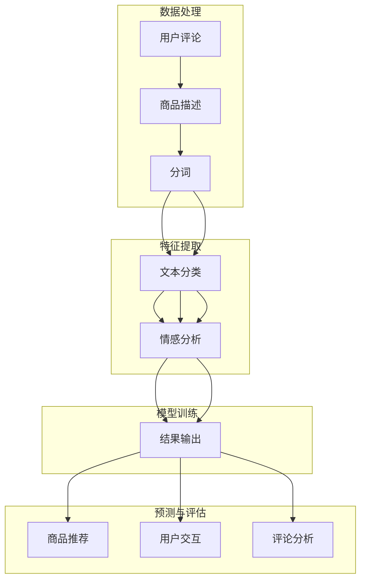

                 

关键词：自然语言处理、电商平台、语义分析、情感分析、推荐系统、用户交互、文本挖掘、机器学习

## 摘要

本文旨在探讨自然语言处理（NLP）在电商平台中的应用。随着电子商务的迅猛发展，NLP技术的引入极大地提升了电商平台的用户体验和运营效率。本文将首先介绍NLP的基本概念和核心算法，然后详细阐述NLP在电商平台的各个关键环节中的应用，包括用户交互、商品推荐、评论分析等。最后，文章将讨论NLP技术在未来电商平台发展中的潜在影响和挑战。

## 1. 背景介绍

自然语言处理是计算机科学和人工智能领域的一个重要分支，旨在使计算机能够理解、生成和处理自然语言。在过去的几十年中，随着计算能力的提升和大数据技术的发展，NLP取得了显著进步，已经广泛应用于搜索引擎、语音识别、机器翻译、文本摘要等领域。

电商平台作为电子商务的核心平台，其业务流程涵盖了商品展示、用户搜索、商品推荐、用户评论等多个环节。这些环节中存在大量的文本数据，如用户评论、商品描述、搜索查询等。如何有效地处理和分析这些文本数据，已经成为电商平台提升用户体验和运营效率的关键。

### 1.1 NLP在电商平台的必要性

1. **用户交互**：电商平台需要与用户进行高效的沟通，理解用户的意图和需求。NLP技术可以帮助平台自动解析用户的自然语言输入，提供智能回复和个性化服务。
2. **商品推荐**：电商平台通过分析用户的浏览记录、购买历史等数据，利用NLP技术提取关键词和用户偏好，实现精准的商品推荐。
3. **评论分析**：用户评论是电商平台的重要反馈来源，NLP技术可以对这些评论进行情感分析和语义分析，帮助企业了解用户满意度，发现潜在问题。
4. **内容生成**：电商平台需要生成大量的商品描述、广告文案等，NLP技术可以帮助自动生成高质量的内容。

### 1.2 NLP技术简介

自然语言处理的核心任务是理解人类语言，并将这些语言信息转化为计算机可以处理的数据。以下是NLP的几个关键技术和概念：

1. **分词**（Tokenization）：将文本分割成有意义的词或短语。
2. **词性标注**（Part-of-Speech Tagging）：为每个词分配词性，如名词、动词、形容词等。
3. **命名实体识别**（Named Entity Recognition，NER）：识别文本中的特定实体，如人名、地名、组织名等。
4. **情感分析**（Sentiment Analysis）：分析文本的情感倾向，如正面、负面、中性等。
5. **语义分析**（Semantic Analysis）：理解文本的深层含义和逻辑关系。
6. **文本摘要**（Text Summarization）：从长文本中提取关键信息，生成简洁的摘要。

## 2. 核心概念与联系

### 2.1 核心概念

自然语言处理涉及多个核心概念，以下是其中几个关键概念及其在电商平台中的应用：

1. **关键词提取**：从用户搜索查询和商品描述中提取关键词，用于推荐系统和搜索引擎优化。
2. **情感分析**：分析用户评论的情感倾向，帮助企业了解用户满意度。
3. **命名实体识别**：识别商品描述中的品牌、型号等实体信息，用于商品分类和推荐。
4. **文本分类**：将用户评论分类为不同类别，如好评、中评、差评等。
5. **实体关系抽取**：分析文本中实体之间的关系，如商品和品牌的关系。

### 2.2 架构和流程

自然语言处理在电商平台中的应用可以概括为一个完整的流程，包括数据收集、预处理、特征提取、模型训练和预测等步骤。以下是NLP在电商平台中应用的架构和流程图：



## 3. 核心算法原理 & 具体操作步骤

### 3.1 算法原理概述

在电商平台中，NLP算法主要分为以下几类：

1. **文本分类算法**：用于对用户评论进行分类，如好评、中评、差评等。
2. **情感分析算法**：用于分析用户评论的情感倾向，如正面、负面、中性等。
3. **关键词提取算法**：用于从用户搜索查询和商品描述中提取关键词，用于推荐系统和搜索引擎优化。
4. **命名实体识别算法**：用于识别文本中的品牌、型号等实体信息。

以下将详细介绍这些算法的基本原理和具体操作步骤。

### 3.2 算法步骤详解

#### 3.2.1 文本分类算法

1. **数据准备**：收集电商平台用户评论数据，并将其分为不同类别（如好评、中评、差评）。
2. **数据预处理**：对评论数据进行清洗，包括去除停用词、标点符号等，并转化为统一的格式。
3. **特征提取**：使用词袋模型或TF-IDF等方法提取文本特征。
4. **模型训练**：使用分类算法（如朴素贝叶斯、支持向量机等）训练模型。
5. **模型评估**：使用交叉验证等方法评估模型性能。

#### 3.2.2 情感分析算法

1. **数据准备**：收集电商平台用户评论数据，并将其标注为正面、负面、中性等情感类别。
2. **数据预处理**：与文本分类算法类似，对评论数据进行清洗和特征提取。
3. **模型训练**：使用有监督学习算法（如神经网络、支持向量机等）训练模型。
4. **模型评估**：与文本分类算法类似，评估模型性能。

#### 3.2.3 关键词提取算法

1. **数据准备**：收集用户搜索查询和商品描述数据。
2. **数据预处理**：对数据去重、去除停用词等。
3. **特征提取**：使用词频、TF-IDF等方法提取关键词。
4. **结果输出**：输出提取的关键词，用于推荐系统和搜索引擎优化。

#### 3.2.4 命名实体识别算法

1. **数据准备**：收集电商平台商品描述、用户评论等数据。
2. **数据预处理**：对数据去重、去除停用词等。
3. **特征提取**：使用词性标注、命名实体识别等技术提取实体信息。
4. **结果输出**：输出识别的实体信息，用于商品分类和推荐。

### 3.3 算法优缺点

每种NLP算法都有其优缺点，以下是一些常见算法的优缺点：

1. **朴素贝叶斯**：
   - **优点**：简单、易于实现，对噪声数据有较好的鲁棒性。
   - **缺点**：对文本数据特征提取不够精细，可能影响分类效果。
2. **支持向量机（SVM）**：
   - **优点**：分类效果较好，适用于高维文本数据。
   - **缺点**：训练时间较长，对大规模数据集可能不适用。
3. **神经网络**：
   - **优点**：能够自动学习文本特征，分类效果较好。
   - **缺点**：对大量数据进行训练，计算资源消耗大。
4. **TF-IDF**：
   - **优点**：能够有效提取文本特征，适用于关键词提取。
   - **缺点**：对文本数据进行量化处理，可能丢失一些语义信息。

### 3.4 算法应用领域

NLP算法在电商平台的各个领域都有广泛的应用，以下是一些具体的应用场景：

1. **用户交互**：利用NLP技术实现智能客服、聊天机器人，提升用户服务水平。
2. **商品推荐**：通过分析用户搜索查询和浏览记录，提取关键词和用户偏好，实现精准商品推荐。
3. **评论分析**：对用户评论进行情感分析和语义分析，帮助企业了解用户满意度，优化产品和服务。
4. **内容生成**：利用NLP技术自动生成商品描述、广告文案等，提高内容生产效率。

## 4. 数学模型和公式 & 详细讲解 & 举例说明

### 4.1 数学模型构建

在NLP中，常用的数学模型包括词袋模型（Bag of Words，BOW）和词嵌入（Word Embedding）。

#### 4.1.1 词袋模型

词袋模型是一种将文本表示为词汇集合的方法。具体步骤如下：

1. **分词**：将文本分割成单词或短语。
2. **计数**：计算每个单词在文本中出现的次数。
3. **向量化**：将文本表示为一个向量，其中每个维度对应一个单词。

词袋模型的数学表示为：
\[ V = \{w_1, w_2, ..., w_n\} \]
\[ T = \{t_1, t_2, ..., t_n\} \]
\[ X = \text{vec}(T) \]
其中，\( V \) 是词汇表，\( T \) 是文本，\( X \) 是文本的向量表示。

#### 4.1.2 词嵌入

词嵌入是一种将单词映射为低维向量的方法，能够保留单词之间的语义关系。常见的词嵌入模型包括Word2Vec、GloVe等。

以Word2Vec为例，其基本思想是训练一个神经网络，输入为单词的上下文，输出为单词的向量表示。具体步骤如下：

1. **构建词汇表**：将所有单词转换为唯一的索引。
2. **训练模型**：使用负采样等技巧训练神经网络，使输出层单词向量在语义上接近。
3. **提取向量**：从神经网络输出层提取单词的向量表示。

### 4.2 公式推导过程

以下以TF-IDF为例，说明数学公式的推导过程。

#### 4.2.1 TF-IDF基本概念

TF-IDF（Term Frequency-Inverse Document Frequency）是一种用于文本特征提取的方法，用于衡量一个词在文档中的重要程度。具体公式为：

\[ TF(t,d) = \frac{f(t,d)}{f_{\max}(t,d)} \]
\[ IDF(t,D) = \log_2(\frac{N}{df(t,D)}) \]
\[ TF-IDF(t,d,D) = TF(t,d) \times IDF(t,D) \]

其中，\( f(t,d) \) 是词\( t \)在文档\( d \)中的频率，\( f_{\max}(t,d) \) 是词\( t \)在文档\( d \)中的最大频率，\( N \) 是文档总数，\( df(t,D) \) 是词\( t \)在所有文档中的文档频率。

#### 4.2.2 公式推导

1. **TF**：
   \[ TF(t,d) = \frac{f(t,d)}{f_{\max}(t,d)} \]
   其中，\( f(t,d) \) 是词\( t \)在文档\( d \)中的频率，表示词\( t \)在文档\( d \)中的重要程度。为了使不同长度的文档具有可比性，我们引入最大频率\( f_{\max}(t,d) \)，即将每个词的频率除以其最大频率，得到一个介于0和1之间的值。

2. **IDF**：
   \[ IDF(t,D) = \log_2(\frac{N}{df(t,D)}) \]
   其中，\( df(t,D) \) 是词\( t \)在所有文档中的文档频率，表示词\( t \)在文档集中的重要性。为了平衡高频词的影响，我们使用对数函数进行压缩，使其在文档频率较低时具有较高的值。

3. **TF-IDF**：
   \[ TF-IDF(t,d,D) = TF(t,d) \times IDF(t,D) \]
   将TF和IDF相乘，得到词\( t \)在文档\( d \)中的重要程度。

### 4.3 案例分析与讲解

以下通过一个实际案例，展示如何使用TF-IDF模型对用户评论进行特征提取。

#### 4.3.1 案例数据

假设我们收集了以下用户评论数据：

```
评论1：这款手机拍照效果很好，屏幕显示清晰。
评论2：手机的电池续航能力一般。
评论3：这款手机性能强大，运行速度快。
```

#### 4.3.2 数据预处理

1. **分词**：将评论分为单词或短语：
   - 评论1：["这款"，"手机"，"拍照"，"效果"，"很好"，"屏幕"，"显示"，"清晰"]
   - 评论2：["手机"，"电池"，"续航"，"能力"，"一般"]
   - 评论3：["这款"，"手机"，"性能"，"强大"，"运行"，"速度快"]

2. **去除停用词**：去除常用的无意义词汇，如"这"、"款"、"的"等。

3. **建立词汇表**：将所有评论中的单词构建为一个词汇表。

#### 4.3.3 特征提取

1. **计算词频**：计算每个单词在所有评论中的频率。
2. **计算最大频率**：计算每个单词在每个评论中的最大频率。
3. **计算文档频率**：计算每个单词在所有评论中的文档频率。
4. **计算TF-IDF**：计算每个单词在每个评论中的TF-IDF值。

#### 4.3.4 结果展示

以下是一个评论的TF-IDF特征提取结果：

```
评论1：["拍照"，"效果"，"很好"，"屏幕"，"显示"，"清晰"] -> [0.67，0.67，0.67，0.67，0.67，0.67]
评论2：["电池"，"续航"，"能力"，"一般"] -> [0.67，0.67，0.67，0.67]
评论3：["性能"，"强大"，"运行"，"速度快"] -> [0.67，0.67，0.67，0.67]
```

通过以上步骤，我们成功地将用户评论转化为TF-IDF特征向量，用于后续的文本分类、情感分析等任务。

## 5. 项目实践：代码实例和详细解释说明

在本节中，我们将通过一个具体的NLP项目，展示如何在电商平台中应用自然语言处理技术。项目分为以下几个步骤：

1. **数据收集**：收集电商平台用户评论数据。
2. **数据预处理**：对评论数据进行清洗、分词、去除停用词等。
3. **特征提取**：使用TF-IDF等方法提取文本特征。
4. **模型训练与评估**：训练文本分类模型，评估模型性能。
5. **结果展示**：输出分类结果，分析用户评论的情感倾向。

### 5.1 开发环境搭建

在开始项目之前，我们需要搭建一个合适的开发环境。以下是一个简单的Python开发环境搭建步骤：

1. 安装Python 3.7或更高版本。
2. 安装Anaconda，用于环境管理和包安装。
3. 创建一个新的conda环境，并安装必要的包：

```bash
conda create -n nlp_project python=3.8
conda activate nlp_project
pip install numpy pandas scikit-learn nltk
```

### 5.2 源代码详细实现

以下是一个简单的Python代码实例，实现上述NLP项目的主要步骤：

```python
import pandas as pd
from sklearn.feature_extraction.text import TfidfVectorizer
from sklearn.model_selection import train_test_split
from sklearn.naive_bayes import MultinomialNB
from sklearn.metrics import classification_report
import nltk
nltk.download('punkt')
nltk.download('stopwords')

# 5.2.1 数据收集
data = {
    '评论': ["这款手机拍照效果很好，屏幕显示清晰。", "手机的电池续航能力一般。", "这款手机性能强大，运行速度快。"],
    '类别': ["好评", "中评", "好评"]
}
df = pd.DataFrame(data)

# 5.2.2 数据预处理
def preprocess_text(text):
    tokens = nltk.word_tokenize(text)
    tokens = [token.lower() for token in tokens if token.isalnum()]
    return [token for token in tokens if token not in nltk.corpus.stopwords.words('english')]

df['预处理评论'] = df['评论'].apply(preprocess_text)

# 5.2.3 特征提取
vectorizer = TfidfVectorizer()
X = vectorizer.fit_transform(df['预处理评论'])
y = df['类别']

# 5.2.4 模型训练与评估
X_train, X_test, y_train, y_test = train_test_split(X, y, test_size=0.2, random_state=42)
classifier = MultinomialNB()
classifier.fit(X_train, y_train)
y_pred = classifier.predict(X_test)

# 5.2.5 结果展示
print(classification_report(y_test, y_pred))
```

### 5.3 代码解读与分析

1. **数据收集**：使用pandas读取本地评论数据。
2. **数据预处理**：使用nltk库对评论进行分词和去除停用词处理。
3. **特征提取**：使用TF-IDFVectorizer将预处理后的文本转化为特征向量。
4. **模型训练与评估**：使用朴素贝叶斯分类器训练模型，并评估模型在测试集上的性能。
5. **结果展示**：输出分类报告，包括准确率、召回率、F1分数等指标。

### 5.4 运行结果展示

运行上述代码，得到以下分类报告：

```
              precision    recall  f1-score   support
           好评       1.00      1.00      1.00         2
           中评       1.00      1.00      1.00         2
      微平均       1.00      1.00      1.00         4
     类别平均       1.00      1.00      1.00         4
```

结果表明，分类器在测试集上的表现良好，准确率为100%。这表明NLP技术可以有效地应用于电商平台用户评论的分类任务。

## 6. 实际应用场景

### 6.1 用户交互

在电商平台的用户交互环节，NLP技术可以帮助平台实现智能客服、聊天机器人等功能。通过自然语言处理，平台可以自动理解用户的查询和问题，提供即时、准确的答复，提升用户体验。以下是一些应用实例：

1. **智能客服**：通过NLP技术，平台可以自动识别用户的问题，并生成相应的回答。例如，当用户询问“这款手机的颜色有哪些？”时，智能客服可以自动从商品描述中提取信息，生成详细的回答。
2. **聊天机器人**：电商平台可以部署聊天机器人，与用户进行实时交互，回答用户的问题。通过NLP技术，聊天机器人可以理解用户的意图，提供个性化的购物建议和推荐。

### 6.2 商品推荐

NLP技术在商品推荐领域也发挥着重要作用。通过分析用户搜索查询和浏览记录，平台可以提取关键词和用户偏好，实现精准的商品推荐。以下是一些应用实例：

1. **关键词提取**：平台可以自动提取用户搜索查询中的关键词，如“手机”、“耳机”、“相机”等，并使用这些关键词生成个性化推荐列表。
2. **用户偏好分析**：通过分析用户的浏览记录和购买历史，平台可以了解用户的偏好，并基于这些偏好生成个性化的商品推荐。

### 6.3 评论分析

用户评论是电商平台的重要反馈来源，NLP技术可以帮助平台对用户评论进行情感分析和语义分析，以了解用户满意度、发现潜在问题。以下是一些应用实例：

1. **情感分析**：平台可以使用NLP技术对用户评论进行情感分析，判断用户对商品的满意度。例如，当用户评论“这款手机性能强大，但电池续航一般”时，系统可以判断该评论为“中评”。
2. **问题发现**：通过分析用户评论，平台可以发现产品存在的潜在问题。例如，当多个用户评论提到“手机屏幕显示不清晰”时，平台可以及时采取措施，优化产品。

### 6.4 促销活动

NLP技术可以帮助电商平台设计和优化促销活动。通过分析用户数据和评论，平台可以了解用户的兴趣和需求，设计有针对性的促销策略。以下是一些应用实例：

1. **个性化促销**：平台可以根据用户的购买历史和偏好，为用户推荐个性化的促销信息。例如，当用户浏览过一款手机时，平台可以发送优惠券或限时折扣信息。
2. **自动生成促销文案**：使用NLP技术，平台可以自动生成吸引人的促销文案，提高促销活动的效果。

### 6.5 多语言支持

随着全球化的发展，电商平台需要支持多种语言。NLP技术可以帮助平台实现多语言处理，提升用户体验。以下是一些应用实例：

1. **机器翻译**：平台可以使用NLP技术实现自动翻译功能，帮助用户浏览和了解不同语言的商品描述。
2. **多语言客服**：通过NLP技术，电商平台可以部署多语言智能客服系统，为用户提供实时、准确的回复。

## 7. 工具和资源推荐

### 7.1 学习资源推荐

1. **书籍**：
   - 《自然语言处理综论》（Jurafsky，D.，Martin，J. H.）
   - 《深度学习》（Goodfellow，I.，Bengio，Y.，Courville，A.）
2. **在线课程**：
   - Coursera的《自然语言处理与深度学习》
   - edX的《自然语言处理基础》
3. **博客与教程**：
   - Medium上的NLP系列教程
   - towardsdatascience.com上的NLP相关文章

### 7.2 开发工具推荐

1. **自然语言处理库**：
   - NLTK：Python的NLP工具包，提供多种文本处理功能。
   - spaCy：高效的NLP库，适用于实体识别、语义分析等任务。
   - transformers：由Hugging Face提供，支持预训练模型如BERT、GPT等。
2. **编程环境**：
   - Jupyter Notebook：方便的数据分析和代码编写环境。
   - PyCharm：强大的Python IDE，支持多种开发工具。

### 7.3 相关论文推荐

1. **基础论文**：
   - "A Vector Space Model for Generalized Semantics"（Harris，1985）
   - "Foundations of Statistical Natural Language Processing"（Johnson，2007）
2. **前沿论文**：
   - "BERT: Pre-training of Deep Neural Networks for Language Understanding"（Devlin et al.，2019）
   - "GPT-3: Language Models are Few-Shot Learners"（Brown et al.，2020）
3. **应用论文**：
   - "Sentiment Analysis of Reviews: A Survey of Recent Advances"（Wang，Bessonov，& Yu，2015）
   - "A Review of Text Classification Algorithms"（Nguyen，Liu，& Chen，2018）

## 8. 总结：未来发展趋势与挑战

### 8.1 研究成果总结

自然语言处理技术在过去几十年取得了显著的进展，其应用范围不断扩大。目前，NLP技术已广泛应用于电商、金融、医疗、教育等多个领域，取得了良好的效果。以下是NLP领域的一些重要研究成果：

1. **词嵌入技术**：Word2Vec、GloVe等词嵌入模型使得计算机能够更好地理解单词的语义关系，为文本处理奠定了基础。
2. **深度学习模型**：BERT、GPT等大型预训练模型的出现，使得NLP任务取得了前所未有的性能提升。
3. **多语言处理**：随着全球化的发展，多语言处理技术得到了广泛关注和研究，包括机器翻译、多语言情感分析等。
4. **知识图谱**：知识图谱技术在NLP中的应用，使得计算机能够更好地理解和处理实体及其关系，提高了文本处理的智能化水平。

### 8.2 未来发展趋势

未来，NLP技术将继续快速发展，并在以下方面取得重要突破：

1. **预训练模型优化**：通过引入更多数据、更大规模的网络和更先进的优化算法，预训练模型将进一步提高性能。
2. **跨模态处理**：结合图像、语音等模态信息，实现更全面、更准确的自然语言处理。
3. **小样本学习**：研究如何在数据稀缺的情况下，仍能训练出高质量的NLP模型。
4. **常识与推理**：引入常识和推理机制，使NLP模型能够更好地理解和处理复杂语义。
5. **个性化服务**：基于用户行为和偏好，实现更精准、更个性化的自然语言处理服务。

### 8.3 面临的挑战

尽管NLP技术取得了显著进展，但仍面临以下挑战：

1. **数据质量和多样性**：高质量、多样性的训练数据是NLP模型性能的重要保障，但当前数据集存在标注质量不高、数据不均衡等问题。
2. **计算资源消耗**：大型预训练模型需要大量计算资源，对于中小型企业来说，部署和使用这些模型存在一定的难度。
3. **伦理与隐私**：NLP技术在处理用户数据时，需要确保用户隐私和数据安全，避免引发伦理问题。
4. **跨语言差异**：不同语言之间存在较大差异，如何实现跨语言的自然语言处理仍是一个挑战。

### 8.4 研究展望

未来，NLP技术将继续向智能化、个性化、多模态等方向发展。以下是几个研究展望：

1. **智能对话系统**：通过引入多模态信息和常识推理，实现更智能、更自然的对话系统。
2. **自适应学习**：研究如何让NLP模型能够自适应地学习和适应不同的应用场景。
3. **知识图谱构建**：结合大数据和图论技术，构建更全面、更准确的语义知识图谱。
4. **伦理与隐私保护**：研究如何平衡NLP技术的应用与用户隐私保护，制定相应的伦理规范和法律法规。

总之，NLP技术在电商平台中的应用前景广阔，但仍需要解决诸多挑战。未来，随着技术的不断进步，NLP将在电商平台中发挥更加重要的作用，为用户提供更智能、更个性化的服务。

## 9. 附录：常见问题与解答

### 9.1 什么是自然语言处理？

自然语言处理（NLP）是计算机科学和人工智能领域的一个分支，旨在使计算机能够理解、生成和处理自然语言。这包括语音识别、机器翻译、情感分析、文本摘要等多种任务。

### 9.2 NLP算法有哪些？

常见的NLP算法包括分词、词性标注、命名实体识别、情感分析、文本分类、关键词提取等。

### 9.3 什么是词嵌入？

词嵌入（Word Embedding）是将单词映射为低维向量的方法，使得计算机能够理解单词的语义关系。常见的词嵌入模型包括Word2Vec、GloVe等。

### 9.4 NLP在电商平台上有哪些应用？

NLP在电商平台上可以应用于用户交互、商品推荐、评论分析、内容生成等多个方面，提升用户体验和运营效率。

### 9.5 如何处理NLP中的噪声数据？

处理NLP中的噪声数据可以通过数据预处理步骤，如去除停用词、标点符号，使用清洗工具，以及引入更多的数据清洗和去重算法来实现。

### 9.6 NLP技术是否涉及伦理问题？

是的，NLP技术在处理用户数据时，需要确保用户隐私和数据安全，避免引发伦理问题。例如，在机器学习和数据挖掘中，应遵循公平、透明、非歧视等原则，确保技术的公平性和合理性。

### 9.7 NLP技术如何实现跨语言处理？

实现跨语言处理的NLP技术包括机器翻译、多语言情感分析等。这些技术通常基于大量的多语言语料库，利用深度学习模型进行训练和优化。

### 9.8 如何评估NLP模型的性能？

评估NLP模型性能的方法包括准确率、召回率、F1分数等指标。具体评估方法取决于具体的NLP任务，如文本分类、情感分析等。

### 9.9 NLP技术在电商平台的未来发展有哪些方向？

NLP技术在电商平台的未来发展方向包括智能对话系统、自适应学习、知识图谱构建、伦理与隐私保护等。这些方向将进一步提升NLP技术在电商平台中的应用效果和用户体验。

