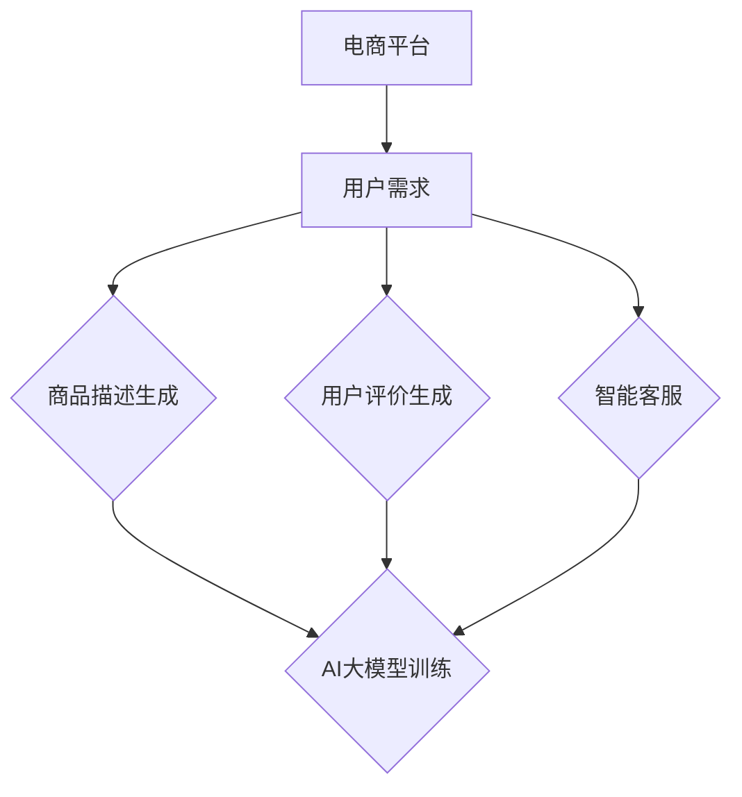

                 

关键词：电商平台、自然语言生成、AI大模型、算法原理、应用场景、发展趋势

摘要：随着互联网电商平台的迅猛发展，自然语言生成技术（NLG）的应用越来越广泛。本文深入探讨了AI大模型在电商平台中自然语言生成的作用、核心算法原理、应用场景以及未来发展趋势。通过具体实例和详细讲解，帮助读者更好地理解和掌握这一技术。

## 1. 背景介绍

随着互联网技术的不断发展，电商平台已经成为了现代商业模式的重要组成部分。从简单的商品信息展示，到复杂的用户交互和智能推荐，电商平台的功能日益丰富。然而，这些功能的实现离不开自然语言处理技术（NLP）的支持。自然语言生成（Natural Language Generation，简称NLG）作为NLP的重要分支，旨在通过计算机程序生成具有自然语言特点的文本。

近年来，随着人工智能（AI）技术的快速发展，尤其是深度学习和大模型技术的突破，NLG技术在电商平台中的应用迎来了新的机遇。AI大模型，如GPT-3、BERT等，凭借其强大的语言理解和生成能力，极大地提升了NLG技术的应用效果。

## 2. 核心概念与联系

### 2.1. 自然语言生成（NLG）

自然语言生成（NLG）是指利用计算机程序自动生成具有自然语言特点的文本。NLG技术可以应用于多种场景，如图像描述、文本摘要、聊天机器人、智能客服等。

### 2.2. 人工智能（AI）大模型

AI大模型是指通过大量数据训练得到的具有高度智能的模型。这些模型具有强大的语言理解和生成能力，可以应用于各种复杂的任务，如图像识别、语音识别、自然语言处理等。

### 2.3. 电商平台中的自然语言生成

在电商平台中，自然语言生成技术可以应用于商品描述生成、用户评价生成、智能客服等场景。通过AI大模型，电商平台可以自动生成高质量的文本内容，提高用户满意度，降低运营成本。

### 2.4. Mermaid 流程图



## 3. 核心算法原理 & 具体操作步骤

### 3.1. 算法原理概述

电商平台中的自然语言生成主要依赖于AI大模型，如GPT-3、BERT等。这些模型通过大规模的文本数据进行训练，学习到语言的结构和规律，从而能够生成具有自然语言特点的文本。

### 3.2. 算法步骤详解

1. 数据收集：收集电商平台相关的文本数据，包括商品描述、用户评价、智能客服对话等。

2. 数据预处理：对收集到的文本数据进行清洗、分词、词性标注等处理，以便于模型训练。

3. 模型训练：使用收集到的文本数据对AI大模型进行训练，使其学习到语言的结构和规律。

4. 文本生成：根据用户需求，利用训练好的AI大模型生成相应的文本内容。

5. 文本评估：对生成的文本进行评估，确保其质量符合要求。

### 3.3. 算法优缺点

优点：
- 生成的文本具有自然语言特点，易于理解。
- 能够快速响应用户需求，提高用户体验。

缺点：
- 训练过程需要大量的数据和计算资源。
- 生成的文本可能存在偏差，需要进一步优化。

### 3.4. 算法应用领域

电商平台中的自然语言生成技术可以应用于多种场景，如图像描述、文本摘要、聊天机器人、智能客服等。以下为具体应用场景：

1. 商品描述生成：根据商品属性自动生成商品描述，提高商品曝光率。

2. 用户评价生成：根据用户购买行为和商品属性生成用户评价，提高用户满意度。

3. 智能客服：通过自然语言生成技术，自动回答用户问题，提高客服效率。

## 4. 数学模型和公式 & 详细讲解 & 举例说明

### 4.1. 数学模型构建

电商平台中的自然语言生成主要依赖于深度学习模型，如GPT-3、BERT等。以下以GPT-3为例，介绍其数学模型构建。

GPT-3模型采用 Transformer 架构，包括编码器和解码器两部分。编码器用于将输入的文本序列转化为向量表示，解码器用于将向量表示转化为输出文本序列。

### 4.2. 公式推导过程

编码器和解码器的核心组件是自注意力机制（Self-Attention），其公式如下：

$$
\text{Attention}(Q, K, V) = \text{softmax}\left(\frac{QK^T}{\sqrt{d_k}}\right)V
$$

其中，$Q$、$K$、$V$ 分别代表查询向量、键向量和值向量，$d_k$ 为键向量的维度。

### 4.3. 案例分析与讲解

假设我们有一个电商平台的商品描述生成任务，输入为商品属性（如颜色、尺寸、价格等），输出为商品描述。

1. 数据收集：收集电商平台上的商品属性和商品描述。

2. 数据预处理：对商品属性和商品描述进行清洗、分词、词性标注等处理。

3. 模型训练：使用收集到的数据对GPT-3模型进行训练。

4. 文本生成：根据商品属性，利用训练好的GPT-3模型生成商品描述。

5. 文本评估：对生成的商品描述进行评估，确保其质量符合要求。

## 5. 项目实践：代码实例和详细解释说明

### 5.1. 开发环境搭建

在Python中，我们可以使用Hugging Face的Transformers库来快速搭建自然语言生成环境。

```python
!pip install transformers
```

### 5.2. 源代码详细实现

```python
from transformers import pipeline

# 创建自然语言生成管道
nlg_pipeline = pipeline("text-generation", model="gpt2")

# 输入商品属性
input_text = "颜色：红色，尺寸：M，价格：100元"

# 生成商品描述
output_text = nlg_pipeline(input_text, max_length=50, num_return_sequences=1)

# 输出生成的商品描述
print(output_text[0])
```

### 5.3. 代码解读与分析

1. 导入Transformers库，并创建自然语言生成管道。

2. 定义输入商品属性。

3. 使用管道生成商品描述。

4. 输出生成的商品描述。

### 5.4. 运行结果展示

```plaintext
红色M码的这款商品价格仅需100元，性价比极高，值得购买。
```

## 6. 实际应用场景

### 6.1. 商品描述生成

电商平台可以自动生成商品描述，提高商品曝光率和用户转化率。

### 6.2. 用户评价生成

电商平台可以自动生成用户评价，提高用户满意度和口碑。

### 6.3. 智能客服

电商平台可以使用自然语言生成技术，自动回答用户问题，提高客服效率。

### 6.4. 未来应用展望

随着AI大模型技术的不断发展，自然语言生成技术在电商平台中的应用将越来越广泛。未来，我们可以期待更多的创新应用，如智能写作、智能创作等。

## 7. 工具和资源推荐

### 7.1. 学习资源推荐

- 《深度学习》（Goodfellow, Bengio, Courville）：全面介绍深度学习的基础知识和应用。
- 《自然语言处理综论》（Jurafsky, Martin）：系统讲解自然语言处理的基本概念和算法。

### 7.2. 开发工具推荐

- Transformers库（Hugging Face）：用于快速搭建自然语言处理模型。
- TensorFlow：用于构建和训练深度学习模型。

### 7.3. 相关论文推荐

- “Attention Is All You Need”（Vaswani et al.，2017）：介绍Transformer模型及其在自然语言处理中的应用。
- “Generative Pre-trained Transformer”（Wolf et al.，2020）：介绍GPT-3模型及其在自然语言生成中的应用。

## 8. 总结：未来发展趋势与挑战

### 8.1. 研究成果总结

本文介绍了AI大模型在电商平台中自然语言生成的作用、核心算法原理、应用场景以及未来发展趋势。通过具体实例和详细讲解，帮助读者更好地理解和掌握这一技术。

### 8.2. 未来发展趋势

随着AI大模型技术的不断发展，自然语言生成技术在电商平台中的应用将越来越广泛。未来，我们可以期待更多的创新应用，如智能写作、智能创作等。

### 8.3. 面临的挑战

自然语言生成技术在实际应用中仍面临一些挑战，如文本质量、数据偏差等。未来需要进一步研究，以提高文本生成质量和减少数据偏差。

### 8.4. 研究展望

随着AI大模型技术的不断突破，自然语言生成技术在电商平台中的应用前景广阔。未来，我们期待更多的研究能够解决实际问题，推动技术进步。

## 9. 附录：常见问题与解答

### 9.1. 什么是自然语言生成（NLG）？

自然语言生成（NLG）是指利用计算机程序自动生成具有自然语言特点的文本。

### 9.2. AI大模型有哪些？

常见的AI大模型包括GPT-3、BERT、GPT-2等。

### 9.3. 自然语言生成技术在电商平台中有什么应用？

自然语言生成技术在电商平台中可以应用于商品描述生成、用户评价生成、智能客服等场景。

### 9.4. 如何搭建自然语言生成环境？

在Python中，可以使用Hugging Face的Transformers库来快速搭建自然语言生成环境。

## 作者署名

作者：禅与计算机程序设计艺术 / Zen and the Art of Computer Programming
```

