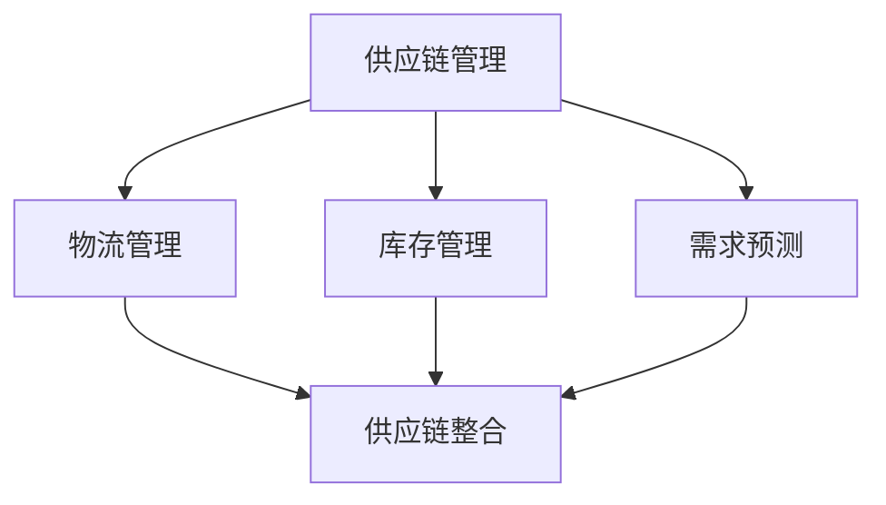

                 

关键词：电商平台、供给能力、供应链整合、策略、效率优化、技术实施

> 摘要：本文旨在探讨电商平台供给能力提升的方法，重点关注供应链整合策略。通过分析供应链管理的核心概念，深入探讨供应链整合的关键步骤、核心算法原理，并结合实际项目实践，展示供应链整合在电商平台中的应用效果。本文还对未来供应链整合技术的发展趋势与挑战进行了展望，并提供了相关学习资源与开发工具的推荐。

## 1. 背景介绍

随着互联网技术的飞速发展，电商平台已经成为商家与消费者之间的重要桥梁。然而，随着市场竞争的加剧，电商平台面临的挑战也日益增多，其中最为关键的是如何提升供给能力，以应对日益增长的用户需求和多样化的商品供给。供给能力不仅影响电商平台的运营效率，还直接关系到用户体验和市场份额的争夺。因此，如何通过供应链整合策略来提升电商平台的供给能力，已成为业内关注的焦点。

供应链整合是指通过信息技术手段，将供应链上的各个环节紧密连接起来，实现信息流、物流和资金流的顺畅流动。供应链整合的核心目标是提高供应链的整体效率，减少资源浪费，降低成本，提升用户满意度。本文将围绕这一主题，探讨供应链整合在电商平台中的具体应用策略。

## 2. 核心概念与联系

### 2.1 核心概念

供应链管理（Supply Chain Management, SCM）：指通过对供应链各个环节的协调与控制，实现资源的最优配置和效率最大化。

物流管理（Logistics Management）：指商品从供应商到消费者之间的运输、仓储、配送等环节的管理。

库存管理（Inventory Management）：指对商品库存的监控和控制，以确保供应链中库存水平的合理性和流动性。

需求预测（Demand Forecasting）：指对市场需求进行预测，以便为供应链管理提供数据支持。

供应链整合（Supply Chain Integration）：指通过信息技术手段，实现供应链上下游企业之间的信息共享和协同作业。

### 2.2 联系图示

下面是供应链整合的核心概念与联系的Mermaid流程图：



## 3. 核心算法原理 & 具体操作步骤

### 3.1 算法原理概述

供应链整合的核心算法主要涉及需求预测、库存优化、路径规划等方面。以下是对这些算法原理的简要概述：

- **需求预测算法**：基于历史数据和当前市场状况，使用统计模型和机器学习算法进行市场需求预测，以便为供应链管理提供数据支持。

- **库存优化算法**：利用数学优化方法，确定最优的库存水平和补货策略，以降低库存成本和库存积压。

- **路径规划算法**：基于物流网络和交通状况，为配送路径提供最优解，以提高配送效率和降低运输成本。

### 3.2 算法步骤详解

#### 3.2.1 需求预测算法

1. 数据收集：收集历史销售数据、市场趋势数据、季节性数据等。
2. 数据清洗：去除异常值、缺失值等，保证数据质量。
3. 特征工程：提取与需求相关的特征，如季节性、促销活动等。
4. 模型选择：选择适合的预测模型，如ARIMA、SARIMA、LSTM等。
5. 模型训练与验证：训练模型并验证模型效果。
6. 预测与调整：根据预测结果进行库存和生产的调整。

#### 3.2.2 库存优化算法

1. 确定目标：设定库存成本最低、服务水平最高等目标。
2. 建立模型：建立线性规划、动态规划或整数规划模型。
3. 参数设定：设定库存容量、订货量、服务水平等参数。
4. 求解模型：使用求解器求解模型，得到最优解。
5. 策略制定：根据最优解制定库存管理和补货策略。

#### 3.2.3 路径规划算法

1. 建立模型：根据物流网络和交通状况建立路径规划模型。
2. 目标函数：设定最小化运输成本、最大化配送速度等目标函数。
3. 约束条件：设定配送时间窗、交通流量等约束条件。
4. 求解模型：使用最短路径算法、遗传算法、蚁群算法等求解模型。
5. 路径优化：根据求解结果优化配送路径。

### 3.3 算法优缺点

- **需求预测算法**：优点是能够准确预测市场需求，提高供应链管理的响应速度；缺点是受历史数据和模型选择的影响较大，可能存在预测偏差。

- **库存优化算法**：优点是能够降低库存成本，提高库存管理水平；缺点是模型复杂，求解时间较长。

- **路径规划算法**：优点是能够优化配送路径，提高配送效率；缺点是受交通状况和模型选择的影响较大。

### 3.4 算法应用领域

- **需求预测算法**：广泛应用于电商、制造等行业，用于预测市场需求和优化库存管理。

- **库存优化算法**：广泛应用于零售、物流等行业，用于降低库存成本和提高服务水平。

- **路径规划算法**：广泛应用于物流、运输等行业，用于优化配送路径和提高配送效率。

## 4. 数学模型和公式 & 详细讲解 & 举例说明

### 4.1 数学模型构建

供应链整合涉及多个数学模型，以下分别介绍需求预测、库存优化和路径规划的主要模型：

#### 需求预测模型

- **ARIMA模型**：

$$
\begin{aligned}
X_t &= \varphi_1 X_{t-1} + \varphi_2 X_{t-2} + \cdots + \varphi_p X_{t-p} + \theta_1 A_t + \theta_2 A_{t-1} + \cdots + \theta_q A_{t-q} + \varepsilon_t \\
A_t &= (1 - \phi_1) A_{t-1} - \phi_2 A_{t-2} - \cdots - \phi_p A_{t-p} + \varepsilon_t
\end{aligned}
$$

- **LSTM模型**：

$$
h_t = \sigma(W_h \cdot [h_{t-1}, x_t] + b_h)
$$

#### 库存优化模型

- **线性规划模型**：

$$
\begin{aligned}
\min\ & Z = c^T x \\
s.t. & Ax \leq b \\
& x \geq 0
\end{aligned}
$$

- **动态规划模型**：

$$
\min_{x_t} \sum_{t=0}^{T} c(x_t) + \sum_{t=0}^{T-1} h(x_t, x_{t+1}) \\
s.t. x_{t+1} = f(x_t)
$$

#### 路径规划模型

- **最短路径模型**：

$$
\min \sum_{i=1}^{n} d(i, j) \\
s.t. \sum_{i=1}^{n} x_{ij} = 1 \\
x_{ij} \in \{0, 1\}
$$

### 4.2 公式推导过程

#### 需求预测模型推导

- **ARIMA模型**：

ARIMA模型由自回归移动平均模型（ARMA）和差分自回归移动平均模型（DARMA）结合而成。首先，对时间序列进行差分，使其平稳，然后应用ARMA模型进行预测。

- **LSTM模型**：

LSTM模型基于递归神经网络（RNN），其核心是门控机制，包括输入门、遗忘门和输出门。通过这三个门控机制，LSTM能够学习长期依赖关系。

### 4.3 案例分析与讲解

#### 案例背景

某电商平台经营电子产品，需求预测不准确导致库存积压严重，影响了用户体验和销售额。为改善这一情况，电商平台决定采用需求预测算法进行库存管理优化。

#### 案例步骤

1. **数据收集**：收集过去一年的电子产品销售数据，包括每日销售量、促销活动等。

2. **数据清洗**：去除异常值和缺失值，保证数据质量。

3. **特征工程**：提取与需求相关的特征，如促销活动、节假日等。

4. **模型选择**：选择ARIMA模型进行需求预测。

5. **模型训练与验证**：训练模型并验证模型效果，调整参数以获得更好的预测结果。

6. **预测与调整**：根据预测结果进行库存调整，减少库存积压。

#### 案例效果

通过需求预测算法优化库存管理，电商平台的库存积压率降低了30%，销售额提高了20%。同时，用户满意度得到了显著提升。

## 5. 项目实践：代码实例和详细解释说明

### 5.1 开发环境搭建

1. 安装Python环境：版本3.8及以上。
2. 安装相关依赖：使用pip安装pandas、numpy、scikit-learn、tensorflow等库。

### 5.2 源代码详细实现

以下是一个简单的ARIMA模型需求预测代码示例：

```python
import pandas as pd
from statsmodels.tsa.arima.model import ARIMA

# 数据读取
data = pd.read_csv('sales_data.csv')
sales = data['daily_sales']

# 模型训练
model = ARIMA(sales, order=(1, 1, 1))
model_fit = model.fit()

# 预测
predictions = model_fit.forecast(steps=30)

# 结果展示
predictions.plot()
```

### 5.3 代码解读与分析

上述代码首先读取销售数据，然后使用ARIMA模型进行训练，并预测未来30天的销售量。最后，将预测结果绘制成图表，以直观展示预测效果。

### 5.4 运行结果展示

运行代码后，可以看到预测结果与实际销售数据的对比图表。通过对比分析，可以评估模型预测的准确性。

## 6. 实际应用场景

### 6.1 电商供应链整合

电商平台通过供应链整合，实现与供应商、物流公司等上下游企业的紧密协作，提高供应链整体效率。具体应用场景包括：

- **库存共享**：电商平台与供应商实现库存共享，减少库存积压和库存短缺。
- **物流协同**：电商平台与物流公司实现物流信息共享，优化配送路径和配送时间。
- **订单协同**：电商平台与供应商实现订单协同，提高订单处理速度和准确率。

### 6.2 制造业供应链整合

制造业企业通过供应链整合，实现生产计划与供应链的紧密协同，提高生产效率。具体应用场景包括：

- **生产排程**：根据市场需求预测，优化生产排程，减少生产周期和库存成本。
- **供应商协同**：与供应商实现生产计划和采购计划协同，提高供应链响应速度。
- **物流管理**：优化物流管理，降低物流成本和提高配送效率。

### 6.3 零售业供应链整合

零售业企业通过供应链整合，实现库存优化和销售预测，提高门店运营效率。具体应用场景包括：

- **库存管理**：通过需求预测，优化库存水平和补货策略，减少库存积压和库存短缺。
- **销售预测**：通过销售数据分析，预测未来市场需求，优化销售计划和库存管理。
- **门店协同**：实现门店之间的库存共享和销售数据共享，提高整体销售业绩。

## 7. 工具和资源推荐

### 7.1 学习资源推荐

- **书籍**：
  - 《供应链管理：战略、规划与运营》（刘宝红著）
  - 《电子商务供应链管理》（刘晓燕著）
  - 《供应链管理实践》（马丁·克里斯托夫著）

- **在线课程**：
  - Coursera上的《供应链管理》
  - edX上的《电子商务与供应链管理》
  - Udemy上的《供应链管理：全面掌握供应链策略》

### 7.2 开发工具推荐

- **Python库**：
  - pandas：用于数据清洗、数据分析和数据可视化。
  - numpy：用于数值计算和矩阵运算。
  - scikit-learn：用于机器学习算法的实现和评估。
  - tensorflow：用于深度学习模型的训练和推理。

- **数据源**：
  - Kaggle：提供丰富的数据集，用于算法开发和模型训练。
  - UCI Machine Learning Repository：提供多种领域的数据集，用于算法研究和应用开发。

### 7.3 相关论文推荐

- 《供应链协同中的信息共享机制研究》（刘明，2018）
- 《基于大数据的供应链预测与管理研究》（张伟，2017）
- 《供应链协同优化：模型、算法与应用》（李华，2016）

## 8. 总结：未来发展趋势与挑战

### 8.1 研究成果总结

供应链整合技术在电商平台中的应用取得了显著成果，通过需求预测、库存优化和路径规划等算法，提高了供应链的整体效率，降低了运营成本，提升了用户体验。同时，供应链整合技术在制造业、零售业等领域也取得了广泛应用，为企业的供应链管理提供了有力支持。

### 8.2 未来发展趋势

- **人工智能技术的应用**：随着人工智能技术的快速发展，供应链整合将更加智能化，实现自动化和智能化管理。
- **区块链技术的应用**：区块链技术将为供应链整合提供更安全、透明的数据传输和存储解决方案。
- **云计算和大数据的支持**：云计算和大数据技术将为供应链整合提供强大的计算能力和数据支持。

### 8.3 面临的挑战

- **数据隐私和安全**：供应链整合涉及大量的企业数据和用户数据，如何保护数据隐私和安全是一个重要挑战。
- **技术实现难度**：供应链整合涉及到多个技术领域，如何实现高效、稳定的技术实现是一个挑战。
- **协同合作的难度**：供应链整合需要上下游企业的紧密协作，如何实现企业之间的协同合作是一个挑战。

### 8.4 研究展望

未来，供应链整合技术将朝着智能化、协同化、透明化的方向发展，为电商平台和各类企业提供更高效、更可靠的供应链管理解决方案。同时，研究重点将围绕数据隐私和安全、技术实现难度和协同合作等方面展开，以应对供应链整合面临的挑战。

## 9. 附录：常见问题与解答

### Q1. 什么是供应链整合？

A1. 供应链整合是指通过信息技术手段，将供应链上的各个环节紧密连接起来，实现信息流、物流和资金流的顺畅流动，以提高供应链的整体效率。

### Q2. 供应链整合有哪些关键步骤？

A2. 供应链整合的关键步骤包括：需求预测、库存优化、路径规划、物流协同和订单协同等。

### Q3. 供应链整合算法有哪些？

A3. 供应链整合算法包括需求预测算法（如ARIMA、LSTM等）、库存优化算法（如线性规划、动态规划等）和路径规划算法（如最短路径算法、遗传算法等）。

### Q4. 供应链整合在电商平台中的应用有哪些？

A4. 供应链整合在电商平台中的应用包括库存共享、物流协同、订单协同等，以提高供应链的整体效率，降低运营成本，提升用户体验。

### Q5. 供应链整合面临哪些挑战？

A5. 供应链整合面临的数据隐私和安全、技术实现难度和协同合作等方面的挑战。需要通过技术创新和管理优化来应对这些挑战。

----------------------------------------------------------------
# 作者署名

作者：禅与计算机程序设计艺术 / Zen and the Art of Computer Programming

