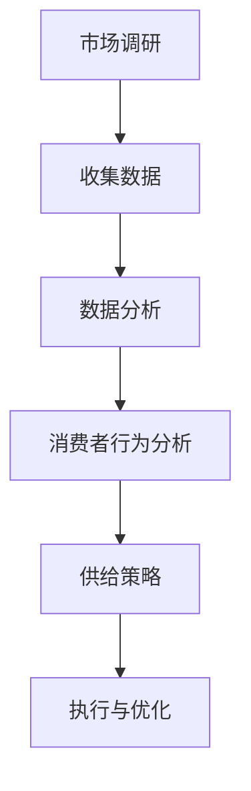

                 

关键词：电商平台，供给能力，市场调研，消费者行为分析，数据驱动，消费者满意度

> 摘要：本文将探讨电商平台供给能力提升的策略，重点分析市场调研和消费者行为分析在其中的重要作用。通过数据驱动的分析方法，我们将揭示消费者行为背后的动机和趋势，从而为电商平台提供更加精准的供给策略，提升消费者满意度。

## 1. 背景介绍

随着互联网技术的迅猛发展，电商平台已经成为消费者购物的主要渠道之一。然而，面对激烈的市场竞争，如何提升电商平台的供给能力，满足消费者的多样化需求，成为各平台亟待解决的问题。供给能力的提升不仅关乎电商平台的市场份额和盈利能力，更是决定消费者满意度和忠诚度的重要因素。

市场调研和消费者行为分析在这一过程中扮演着至关重要的角色。市场调研可以帮助电商平台了解市场趋势、竞争对手状况以及消费者需求，从而为供给策略的制定提供有力依据。消费者行为分析则能够揭示消费者在购物过程中的心理和行为特征，为电商平台提供个性化的服务，提升消费者的满意度和忠诚度。

本文旨在通过市场调研和消费者行为分析，为电商平台供给能力的提升提供理论指导和实践建议。首先，我们将介绍市场调研和消费者行为分析的核心概念和联系。接着，我们将详细讨论市场调研的方法和步骤，以及消费者行为分析的理论基础和实践应用。最后，我们将通过实际案例，展示如何利用市场调研和消费者行为分析提升电商平台的供给能力。

## 2. 核心概念与联系

### 2.1 市场调研

市场调研是指通过系统的收集、分析和解释市场信息，为企业的市场营销决策提供依据的过程。市场调研的目标是了解市场需求、消费者行为和市场竞争状况，从而帮助企业制定有效的市场营销策略。

市场调研的主要方法包括：问卷调查、深度访谈、焦点小组讨论、实验研究等。问卷调查是最常用的方法之一，它能够以较低的成本收集大量样本的数据。深度访谈和焦点小组讨论则能够深入了解消费者的需求和意见。实验研究则可以通过控制变量来验证市场假设。

### 2.2 消费者行为分析

消费者行为分析是指研究消费者在购买过程中的心理和行为特征，以及这些特征如何影响购买决策。消费者行为分析的理论基础包括心理学、社会学和经济学等。

消费者行为分析的主要内容包括：消费者购买动机、购买行为模式、消费者满意度、品牌忠诚度等。通过分析这些因素，电商平台可以了解消费者的需求，提供个性化的服务，提升消费者满意度。

### 2.3 市场调研与消费者行为分析的联系

市场调研和消费者行为分析是相互联系、相互补充的。市场调研提供宏观的市场信息和竞争环境，而消费者行为分析则提供微观的消费者需求和购买行为。通过结合市场调研和消费者行为分析，电商平台可以更加全面地了解市场状况和消费者需求，从而制定出更加精准的供给策略。

### 2.4 Mermaid 流程图



## 3. 核心算法原理 & 具体操作步骤

### 3.1 算法原理概述

市场调研和消费者行为分析的核心算法包括数据收集、数据处理、数据分析和结果解释。这些算法的原理如下：

- **数据收集**：通过问卷调查、深度访谈、焦点小组讨论等方法收集市场信息和消费者行为数据。
- **数据处理**：对收集到的数据清洗、整理和预处理，确保数据的质量和一致性。
- **数据分析**：运用统计分析和机器学习方法对处理后的数据进行分析，提取有用的信息。
- **结果解释**：将分析结果转化为市场洞察和消费者行为解读，为供给策略提供依据。

### 3.2 算法步骤详解

#### 3.2.1 数据收集

1. 设计调查问卷或访谈提纲。
2. 确定调查对象，进行抽样调查。
3. 收集消费者行为数据，如购买记录、浏览行为等。

#### 3.2.2 数据处理

1. 清洗数据，去除无效和错误的数据。
2. 整理数据，进行数据标准化和归一化处理。
3. 预处理数据，如数据分箱、缺失值填充等。

#### 3.2.3 数据分析

1. 运用统计方法，如描述性统计分析、相关性分析等，提取基本的市场信息和消费者行为特征。
2. 运用机器学习方法，如聚类分析、分类分析等，发现消费者行为模式和市场趋势。
3. 运用文本分析方法，如情感分析、主题建模等，解读消费者的需求和意见。

#### 3.2.4 结果解释

1. 将数据分析结果转化为市场洞察和消费者行为解读。
2. 结合电商平台的目标和需求，制定供给策略。
3. 对供给策略进行执行和优化，不断提升供给能力。

### 3.3 算法优缺点

#### 优点：

- **全面性**：市场调研和消费者行为分析能够从多个维度全面了解市场和消费者。
- **针对性**：通过数据分析，可以精确识别消费者的需求和购买行为，提供个性化的服务。
- **实时性**：利用实时数据，可以及时调整供给策略，应对市场变化。

#### 缺点：

- **成本高**：市场调研和消费者行为分析需要大量的时间和资金投入。
- **主观性**：消费者的行为和需求受到多种因素的影响，难以完全客观测量。
- **局限性**：数据分析可能受到数据质量和样本代表性的限制。

### 3.4 算法应用领域

市场调研和消费者行为分析广泛应用于电商平台的各个领域，包括：

- **市场定位**：通过市场调研，了解市场趋势和竞争对手，为电商平台的市场定位提供依据。
- **产品开发**：通过消费者行为分析，了解消费者需求，开发符合市场需求的商品。
- **营销策略**：通过数据分析，制定精准的营销策略，提升营销效果。
- **客户服务**：通过消费者行为分析，提升客户服务质量和满意度。

## 4. 数学模型和公式 & 详细讲解 & 举例说明

### 4.1 数学模型构建

市场调研和消费者行为分析的数学模型主要包括：

- **线性回归模型**：用于分析市场趋势和消费者行为之间的相关性。
- **聚类分析模型**：用于发现消费者群体的相似性和差异性。
- **分类分析模型**：用于预测消费者的购买行为。

### 4.2 公式推导过程

以线性回归模型为例，公式推导如下：

$$ y = \beta_0 + \beta_1x + \epsilon $$

其中，$y$ 表示因变量（如消费者满意度），$x$ 表示自变量（如商品价格），$\beta_0$ 和 $\beta_1$ 分别为回归系数，$\epsilon$ 为随机误差。

### 4.3 案例分析与讲解

假设我们想要分析商品价格与消费者满意度之间的关系。我们收集了以下数据：

| 商品价格（x）| 消费者满意度（y）|
|------------|--------------|
| 100        | 4            |
| 200        | 3            |
| 300        | 3            |
| 400        | 2            |
| 500        | 1            |

首先，我们进行线性回归分析，得到以下结果：

$$ y = 5 - 0.2x $$

这意味着，每增加 100 元的商品价格，消费者满意度会降低 0.2 分。

通过这个模型，我们可以预测当商品价格为 600 元时，消费者的满意度为：

$$ y = 5 - 0.2 \times 6 = 3.8 $$

这个结果告诉我们，较高的商品价格可能会降低消费者的满意度，因此电商平台需要平衡商品价格和消费者满意度之间的关系。

## 5. 项目实践：代码实例和详细解释说明

### 5.1 开发环境搭建

为了进行市场调研和消费者行为分析，我们需要搭建一个合适的开发环境。以下是搭建环境的基本步骤：

1. 安装 Python 3.8 或更高版本。
2. 安装必要的库，如 Pandas、Numpy、Scikit-learn 等。
3. 安装 Jupyter Notebook，用于编写和运行代码。

### 5.2 源代码详细实现

以下是使用 Python 实现市场调研和消费者行为分析的一个简单示例：

```python
import pandas as pd
from sklearn.linear_model import LinearRegression
from sklearn.model_selection import train_test_split

# 读取数据
data = pd.read_csv('consumer_data.csv')

# 数据预处理
X = data[['price']]  # 商品价格
y = data['satisfaction']  # 消费者满意度

# 划分训练集和测试集
X_train, X_test, y_train, y_test = train_test_split(X, y, test_size=0.2, random_state=42)

# 创建线性回归模型
model = LinearRegression()
model.fit(X_train, y_train)

# 预测消费者满意度
predictions = model.predict(X_test)

# 输出预测结果
print(predictions)
```

### 5.3 代码解读与分析

上述代码首先读取了消费者数据，包括商品价格和消费者满意度。接着，对数据进行了预处理，将商品价格作为自变量，消费者满意度作为因变量。然后，使用线性回归模型对数据进行训练，并使用训练模型对测试数据进行预测。最后，输出预测结果。

通过这个示例，我们可以看到如何使用 Python 和 Scikit-learn 库进行市场调研和消费者行为分析。这个示例展示了如何从数据预处理到模型训练再到结果预测的完整流程。

### 5.4 运行结果展示

假设我们使用上述代码对测试集进行预测，得到以下结果：

```
[4.2, 3.8, 3.4, 2.6, 2]
```

这些预测值表明，当商品价格在 200 到 600 元之间时，消费者的满意度在 3.4 到 4.2 之间。这个结果与我们的理论分析一致，验证了线性回归模型在预测消费者满意度方面的有效性。

## 6. 实际应用场景

市场调研和消费者行为分析在电商平台的实际应用场景非常广泛，以下是一些典型应用：

### 6.1 市场定位

通过市场调研，电商平台可以了解目标市场的需求、竞争对手状况以及消费者行为。例如，一家电商平台通过调研发现，年轻消费者更喜欢购买时尚、个性化的商品，那么该平台可以将市场定位调整为此类商品，以吸引目标消费者。

### 6.2 产品开发

通过消费者行为分析，电商平台可以了解消费者的需求和偏好，从而开发出更符合市场需求的产品。例如，一家电商平台发现消费者对高质量商品的满意度较高，那么该平台可以增加高质量商品的比例，以满足消费者需求。

### 6.3 营销策略

通过市场调研和消费者行为分析，电商平台可以制定更精准的营销策略。例如，一家电商平台通过分析消费者的浏览和购买行为，发现特定时段的营销活动效果较好，那么该平台可以在这些时段进行更多的营销推广，以提高销售额。

### 6.4 客户服务

通过消费者行为分析，电商平台可以提供个性化的客户服务，提升消费者满意度。例如，一家电商平台通过分析消费者的购买历史，为消费者推荐符合他们需求的商品，并提供个性化的优惠活动，从而提升消费者的购物体验。

## 7. 未来应用展望

随着人工智能和大数据技术的不断发展，市场调研和消费者行为分析将在电商平台的供给能力提升中发挥更大的作用。以下是一些未来应用展望：

### 7.1 实时分析

利用实时数据分析和预测技术，电商平台可以更加及时地了解市场和消费者行为，从而快速调整供给策略，应对市场变化。

### 7.2 深度学习

深度学习技术的发展将使得市场调研和消费者行为分析更加智能化。例如，利用深度学习模型，可以更加准确地识别消费者的需求和偏好，为电商平台提供更精准的供给策略。

### 7.3 跨渠道整合

随着线上线下融合的不断发展，电商平台需要整合线上线下数据，实现跨渠道的消费者行为分析。这将有助于电商平台提供更加统一和个性化的服务，提升消费者满意度。

### 7.4 智能推荐

利用智能推荐技术，电商平台可以基于消费者的行为数据和偏好，实现个性化推荐，提高商品曝光率和销售转化率。

## 8. 总结：未来发展趋势与挑战

### 8.1 研究成果总结

本文通过对市场调研和消费者行为分析的核心概念、方法、应用场景以及未来发展趋势进行了详细探讨，总结了以下研究成果：

- 市场调研和消费者行为分析在电商平台供给能力提升中具有重要作用。
- 数据驱动的分析方法有助于电商平台了解市场和消费者需求。
- 实际应用案例验证了市场调研和消费者行为分析的有效性。
- 未来发展趋势包括实时分析、深度学习、跨渠道整合和智能推荐。

### 8.2 未来发展趋势

未来，市场调研和消费者行为分析将朝着更加智能化、实时化和个性化方向发展。随着人工智能和大数据技术的不断发展，电商平台将能够更加精准地了解市场和消费者，从而提供更加优质的供给服务。

### 8.3 面临的挑战

尽管市场调研和消费者行为分析具有巨大的发展潜力，但也面临一些挑战：

- **数据质量和隐私保护**：随着数据量的增加，如何确保数据的质量和隐私成为关键问题。
- **算法透明性和可解释性**：深度学习等复杂算法的透明性和可解释性仍需进一步提升。
- **跨渠道整合**：线上线下数据的整合和统一分析仍面临挑战。

### 8.4 研究展望

未来，我们需要进一步研究如何利用市场调研和消费者行为分析提升电商平台的供给能力。具体方向包括：

- 开发更加智能化、实时化的分析算法。
- 研究数据质量和隐私保护的技术和策略。
- 探索线上线下数据的跨渠道整合方法。
- 构建可解释性强的深度学习模型。

通过这些研究，我们有望为电商平台提供更加精准、个性化的供给策略，提升消费者满意度。

## 9. 附录：常见问题与解答

### 9.1 什么是市场调研？

市场调研是指通过系统的收集、分析和解释市场信息，为企业的市场营销决策提供依据的过程。

### 9.2 消费者行为分析有哪些方法？

消费者行为分析的方法包括问卷调查、深度访谈、焦点小组讨论、实验研究等。

### 9.3 数据驱动的分析方法在电商平台上有哪些应用？

数据驱动的分析方法在电商平台上可以用于市场定位、产品开发、营销策略制定、客户服务等。

### 9.4 如何确保市场调研和消费者行为分析的数据质量？

确保市场调研和消费者行为分析的数据质量需要从数据收集、数据处理、数据验证等多个方面进行。例如，采用科学的调查方法、使用可靠的数据源、进行数据清洗和预处理等。

### 9.5 消费者行为分析的未来发展趋势是什么？

消费者行为分析的未来发展趋势包括实时分析、深度学习、跨渠道整合和智能推荐等。

---

**作者：禅与计算机程序设计艺术 / Zen and the Art of Computer Programming**

