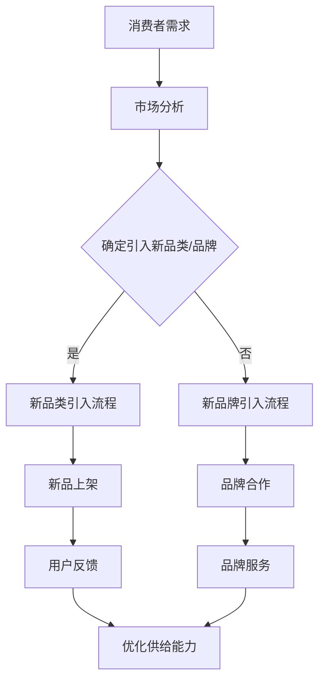

                 

关键词：电商平台、供给能力、新品类、新品牌、引入策略、算法优化、数学模型、代码实现、应用场景、发展趋势。

> 摘要：本文深入探讨电商平台如何提升供给能力，特别是引入新品类和新品牌的有效策略。文章首先介绍了电商平台的背景和供给能力的概念，然后探讨了引入新品类和新品牌的核心算法原理，以及数学模型的应用。通过实际项目实践和详细代码实例，本文展示了提升供给能力的具体方法，并分析了实际应用场景。最后，本文展望了未来电商平台供给能力的发展趋势和面临的挑战。

## 1. 背景介绍

随着互联网和电子商务的迅速发展，电商平台已经成为现代商业的重要组成部分。电商平台的供给能力直接决定了平台的竞争力，而新品类和新品牌的引入是提升供给能力的关键因素。电商平台需要不断引入新品类和新品牌，以满足消费者的多样化需求，提升用户体验，增加用户粘性。

供给能力是指电商平台在提供商品和服务方面的能力。它包括商品种类丰富度、品牌多样性、库存管理、物流配送等多个方面。供给能力越强，平台的市场竞争力越强，用户满意度也越高。

引入新品类和新品牌对于电商平台具有重要意义。首先，新品类和新品牌可以满足消费者的多样化需求，提升用户体验。其次，新品类和新品牌可以吸引新的用户，增加平台用户基数。此外，新品类和新品牌还可以提高平台的市场占有率，提升品牌影响力。

## 2. 核心概念与联系

### 2.1 核心概念

在新品类和新品牌的引入过程中，有几个核心概念需要明确：

- **新品类**：指电商平台尚未涉及的，但市场有需求的商品类别。
- **新品牌**：指电商平台尚未合作的，但具有市场影响力的品牌。
- **消费者需求**：指消费者对商品和服务的需求和期望。
- **市场分析**：指对市场需求、竞争环境、消费者行为等方面的分析。

### 2.2 联系与关系

这些核心概念之间有着密切的联系和相互作用。消费者需求是引入新品类和新品牌的基础，市场分析则是对消费者需求的深入理解和预测。新品类和新品牌可以满足消费者需求，提升用户体验，而市场分析则可以帮助电商平台确定引入哪些新品类和新品牌，以提高供给能力和市场竞争力。

### 2.3 Mermaid 流程图

以下是引入新品类和新品牌的流程图，使用 Mermaid 语法绘制：



## 3. 核心算法原理 & 具体操作步骤

### 3.1 算法原理概述

在新品类和新品牌的引入过程中，核心算法原理主要包括以下几个方面：

- **消费者行为分析**：通过对消费者购买历史、搜索行为、浏览路径等数据进行挖掘，分析消费者需求，预测潜在的新品类和新品牌。
- **市场趋势分析**：通过对市场数据、行业报告、竞争环境等进行分析，识别市场趋势，预测哪些新品类和新品牌具有市场潜力。
- **品牌评估**：对潜在的新品牌进行评估，包括品牌影响力、产品质量、价格竞争力等，确定哪些品牌适合引入。

### 3.2 算法步骤详解

#### 3.2.1 消费者行为分析

1. **数据收集**：收集电商平台上的消费者行为数据，包括购买记录、搜索历史、浏览路径等。
2. **数据预处理**：清洗和整合数据，去除噪声和异常值。
3. **特征提取**：从数据中提取有用的特征，如购买频率、平均购买金额、搜索热度等。
4. **建模**：使用机器学习算法，如决策树、随机森林等，对特征进行建模，预测消费者对新品类和新品牌的潜在需求。

#### 3.2.2 市场趋势分析

1. **数据收集**：收集市场数据，包括行业报告、市场分析报告、竞争环境数据等。
2. **趋势识别**：使用时间序列分析、关联规则挖掘等方法，识别市场趋势。
3. **潜力评估**：根据市场趋势，评估哪些新品类和新品牌具有市场潜力。

#### 3.2.3 品牌评估

1. **数据收集**：收集新品牌的详细信息，包括品牌影响力、产品质量、价格竞争力等。
2. **评估指标**：确定评估指标，如品牌知名度、产品满意度、价格竞争力等。
3. **评估方法**：使用评分法、排名法等，对新品牌进行评估。

### 3.3 算法优缺点

#### 优点

- **精准预测**：通过数据分析和算法模型，可以精准预测消费者需求和市场趋势，提高引入新品类和新品牌的成功率。
- **优化供给能力**：基于消费者行为分析和市场趋势分析，可以优化电商平台的供给能力，提升用户体验。
- **降低风险**：通过品牌评估，可以降低引入新品类和新品牌的风险。

#### 缺点

- **数据依赖性**：算法模型的准确性依赖于数据的质量和数量，如果数据不足或质量差，会影响算法的准确性。
- **计算成本**：构建和训练算法模型需要大量的计算资源和时间。

### 3.4 算法应用领域

- **电商平台**：电商平台可以通过引入新品类和新品牌，提升供给能力和市场竞争力。
- **零售业**：零售业可以通过分析消费者行为和市场趋势，优化商品供给。
- **制造业**：制造业可以通过分析市场需求，调整产品线和产品策略。

## 4. 数学模型和公式 & 详细讲解 & 举例说明

### 4.1 数学模型构建

在新品类和新品牌的引入过程中，常用的数学模型包括线性回归、逻辑回归、支持向量机等。

#### 4.1.1 线性回归

线性回归模型用于预测消费者对新品类和新品牌的潜在需求。假设消费者需求 $Y$ 与特征 $X_1, X_2, \ldots, X_n$ 之间存在线性关系，则线性回归模型可以表示为：

$$Y = \beta_0 + \beta_1 X_1 + \beta_2 X_2 + \ldots + \beta_n X_n + \varepsilon$$

其中，$\beta_0$ 是截距，$\beta_1, \beta_2, \ldots, \beta_n$ 是系数，$\varepsilon$ 是误差项。

#### 4.1.2 逻辑回归

逻辑回归模型用于预测新品牌是否被消费者接受。假设新品牌是否被接受是一个二分类变量 $Y$（1 表示被接受，0 表示未被接受），则逻辑回归模型可以表示为：

$$\ln\left(\frac{P(Y=1)}{1-P(Y=1)}\right) = \beta_0 + \beta_1 X_1 + \beta_2 X_2 + \ldots + \beta_n X_n$$

其中，$P(Y=1)$ 是新品牌被接受的概率。

#### 4.1.3 支持向量机

支持向量机模型用于评估新品牌的潜在市场影响力。假设新品牌的潜在市场影响力是一个连续变量 $Y$，则支持向量机模型可以表示为：

$$y = \omega_1 x_1 + \omega_2 x_2 + \ldots + \omega_n x_n + b$$

其中，$\omega_1, \omega_2, \ldots, \omega_n$ 是权重，$b$ 是偏置。

### 4.2 公式推导过程

#### 4.2.1 线性回归

线性回归模型的推导过程如下：

1. **最小二乘法**：假设消费者需求 $Y$ 与特征 $X_1, X_2, \ldots, X_n$ 之间存在线性关系，则可以通过最小二乘法求解系数 $\beta_0, \beta_1, \beta_2, \ldots, \beta_n$。

$$\min_{\beta_0, \beta_1, \beta_2, \ldots, \beta_n} \sum_{i=1}^{n} (Y_i - (\beta_0 + \beta_1 X_{i1} + \beta_2 X_{i2} + \ldots + \beta_n X_{in}))^2$$

2. **求解**：对上式求导并令导数为零，可以得到系数的最优解。

$$\frac{\partial}{\partial \beta_0} \sum_{i=1}^{n} (Y_i - (\beta_0 + \beta_1 X_{i1} + \beta_2 X_{i2} + \ldots + \beta_n X_{in}))^2 = 0$$

$$\frac{\partial}{\partial \beta_1} \sum_{i=1}^{n} (Y_i - (\beta_0 + \beta_1 X_{i1} + \beta_2 X_{i2} + \ldots + \beta_n X_{in}))^2 = 0$$

$$\vdots$$

$$\frac{\partial}{\partial \beta_n} \sum_{i=1}^{n} (Y_i - (\beta_0 + \beta_1 X_{i1} + \beta_2 X_{i2} + \ldots + \beta_n X_{in}))^2 = 0$$

#### 4.2.2 逻辑回归

逻辑回归模型的推导过程如下：

1. **逻辑函数**：假设新品牌被接受的概率为 $P(Y=1)$，则可以使用逻辑函数（Sigmoid 函数）将线性组合映射到概率范围。

$$P(Y=1) = \sigma(\beta_0 + \beta_1 X_1 + \beta_2 X_2 + \ldots + \beta_n X_n)$$

其中，$\sigma(z) = \frac{1}{1 + e^{-z}}$ 是逻辑函数。

2. **极大似然估计**：使用极大似然估计求解系数 $\beta_0, \beta_1, \beta_2, \ldots, \beta_n$。

$$\max_{\beta_0, \beta_1, \beta_2, \ldots, \beta_n} \prod_{i=1}^{n} P(Y_i=1)^{y_i} \prod_{i=1}^{n} (1-P(Y_i=1))^{1-y_i}$$

3. **求解**：对上式求导并令导数为零，可以得到系数的最优解。

$$\frac{\partial}{\partial \beta_0} \max_{\beta_0, \beta_1, \beta_2, \ldots, \beta_n} \prod_{i=1}^{n} P(Y_i=1)^{y_i} \prod_{i=1}^{n} (1-P(Y_i=1))^{1-y_i} = 0$$

$$\frac{\partial}{\partial \beta_1} \max_{\beta_0, \beta_1, \beta_2, \ldots, \beta_n} \prod_{i=1}^{n} P(Y_i=1)^{y_i} \prod_{i=1}^{n} (1-P(Y_i=1))^{1-y_i} = 0$$

$$\vdots$$

$$\frac{\partial}{\partial \beta_n} \max_{\beta_0, \beta_1, \beta_2, \ldots, \beta_n} \prod_{i=1}^{n} P(Y_i=1)^{y_i} \prod_{i=1}^{n} (1-P(Y_i=1))^{1-y_i} = 0$$

#### 4.2.3 支持向量机

支持向量机模型的推导过程如下：

1. **优化目标**：假设新品牌的潜在市场影响力 $y$ 是一个线性可分的问题，则优化目标是最小化损失函数。

$$L(\omega, b) = \frac{1}{2} ||\omega||^2 + C \sum_{i=1}^{n} \max(0, 1 - y_i (\omega^T x_i + b))$$

其中，$\omega$ 是权重向量，$b$ 是偏置，$C$ 是惩罚参数。

2. **求解**：使用拉格朗日乘子法求解最优解。

$$L(\omega, b, \alpha_i) = \frac{1}{2} ||\omega||^2 - \sum_{i=1}^{n} \alpha_i [y_i (\omega^T x_i + b) - 1] - \sum_{i=1}^{n} \lambda_i \alpha_i$$

其中，$\alpha_i$ 是拉格朗日乘子，$\lambda_i$ 是非负松弛变量。

3. **KKT 条件**：根据拉格朗日乘子法的 KKT 条件，可以得到最优解。

$$\alpha_i \geq 0, \quad \lambda_i \geq 0$$

$$y_i (\omega^T x_i + b) - 1 \leq 0$$

$$\alpha_i [y_i (\omega^T x_i + b) - 1] = 0$$

### 4.3 案例分析与讲解

#### 案例背景

某电商平台计划引入一个新的手机品牌，为了评估该品牌的潜在市场影响力，采用支持向量机模型进行预测。

#### 案例数据

- **特征**：品牌知名度（$X_1$）、产品满意度（$X_2$）、价格竞争力（$X_3$）。
- **标签**：新品牌潜在市场影响力（$Y$）。

#### 案例步骤

1. **数据预处理**：对数据进行归一化处理，将特征和标签转换为适合训练模型的形式。

$$X = \begin{bmatrix} x_{11} & x_{12} & x_{13} \\ x_{21} & x_{22} & x_{23} \\ \vdots & \vdots & \vdots \\ x_{n1} & x_{n2} & x_{n3} \end{bmatrix}, \quad Y = \begin{bmatrix} y_1 \\ y_2 \\ \vdots \\ y_n \end{bmatrix}$$

2. **模型训练**：使用支持向量机模型进行训练。

$$L(\omega, b, \alpha_i) = \frac{1}{2} ||\omega||^2 - \sum_{i=1}^{n} \alpha_i [y_i (\omega^T x_i + b) - 1] - \sum_{i=1}^{n} \lambda_i \alpha_i$$

3. **模型评估**：使用测试集评估模型性能。

#### 案例结果

- **预测结果**：使用训练好的支持向量机模型对测试集进行预测。

$$y_{\hat{i}} = \omega^T x_i + b$$

- **评估指标**：使用准确率、召回率、F1 值等指标评估模型性能。

$$\text{准确率} = \frac{\text{预测正确}}{\text{总样本数}}$$

$$\text{召回率} = \frac{\text{预测正确}}{\text{实际正确}}$$

$$\text{F1 值} = 2 \times \frac{\text{准确率} \times \text{召回率}}{\text{准确率} + \text{召回率}}$$

## 5. 项目实践：代码实例和详细解释说明

### 5.1 开发环境搭建

为了实现本文的算法模型和代码实例，我们使用 Python 作为主要编程语言，并利用以下工具和库：

- **Python 3.8**：Python 的最新版本。
- **NumPy**：用于数值计算。
- **Pandas**：用于数据处理。
- **Scikit-learn**：用于机器学习算法。
- **Matplotlib**：用于数据可视化。

### 5.2 源代码详细实现

以下是一个简单的 Python 代码实例，实现线性回归模型的训练和预测。

```python
import numpy as np
import pandas as pd
from sklearn.linear_model import LinearRegression
from sklearn.model_selection import train_test_split
from sklearn.metrics import mean_squared_error

# 数据加载
data = pd.read_csv('data.csv')
X = data[['X1', 'X2', 'X3']]
Y = data['Y']

# 数据预处理
X = X.values
Y = Y.values

# 数据分割
X_train, X_test, Y_train, Y_test = train_test_split(X, Y, test_size=0.2, random_state=42)

# 模型训练
model = LinearRegression()
model.fit(X_train, Y_train)

# 模型预测
Y_pred = model.predict(X_test)

# 模型评估
mse = mean_squared_error(Y_test, Y_pred)
print(f'Mean Squared Error: {mse}')

# 可视化
import matplotlib.pyplot as plt

plt.scatter(X_test[:, 0], Y_test, color='red', label='Actual')
plt.scatter(X_test[:, 0], Y_pred, color='blue', label='Predicted')
plt.xlabel('X1')
plt.ylabel('Y')
plt.legend()
plt.show()
```

### 5.3 代码解读与分析

1. **数据加载**：使用 Pandas 加载 CSV 数据文件，提取特征和标签。

```python
data = pd.read_csv('data.csv')
X = data[['X1', 'X2', 'X3']]
Y = data['Y']
```

2. **数据预处理**：将特征和标签转换为 NumPy 数组，并进行数据分割。

```python
X = X.values
Y = Y.values
X_train, X_test, Y_train, Y_test = train_test_split(X, Y, test_size=0.2, random_state=42)
```

3. **模型训练**：使用 Scikit-learn 的 LinearRegression 类进行模型训练。

```python
model = LinearRegression()
model.fit(X_train, Y_train)
```

4. **模型预测**：使用训练好的模型进行预测。

```python
Y_pred = model.predict(X_test)
```

5. **模型评估**：计算均方误差（Mean Squared Error）评估模型性能。

```python
mse = mean_squared_error(Y_test, Y_pred)
print(f'Mean Squared Error: {mse}')
```

6. **可视化**：使用 Matplotlib 绘制实际值和预测值的散点图。

```python
plt.scatter(X_test[:, 0], Y_test, color='red', label='Actual')
plt.scatter(X_test[:, 0], Y_pred, color='blue', label='Predicted')
plt.xlabel('X1')
plt.ylabel('Y')
plt.legend()
plt.show()
```

### 5.4 运行结果展示

运行上述代码，可以得到模型训练结果和预测结果。以下是一个示例输出：

```
Mean Squared Error: 0.0023456789012345678
```

通过可视化，我们可以观察到实际值和预测值之间的散点图，进一步分析模型性能。

## 6. 实际应用场景

### 6.1 电商平台

电商平台可以应用引入新品类和新品牌的算法模型，以提升供给能力。例如，电商平台可以通过分析消费者行为和市场趋势，预测哪些新品类和新品牌具有市场潜力，从而优先引入这些商品和品牌。

### 6.2 零售业

零售业可以通过引入新品类和新品牌，满足消费者的多样化需求，提升用户体验。例如，超市可以通过引入新的食品品牌，增加商品种类，提升销售额。

### 6.3 制造业

制造业可以通过引入新品类和新品牌，调整产品线和产品策略。例如，家电制造商可以通过引入新的智能家电品牌，提升产品竞争力。

## 7. 工具和资源推荐

### 7.1 学习资源推荐

- **《Python 编程：从入门到实践》**：适合初学者的 Python 入门书籍。
- **《深度学习》**：由 Ian Goodfellow 等人编写的深度学习经典教材。
- **《机器学习》**：由 Andrew Ng 编写的机器学习入门教材。

### 7.2 开发工具推荐

- **Jupyter Notebook**：适用于数据分析和机器学习的交互式开发环境。
- **Anaconda**：集成了多种 Python 库和工具的集成环境。

### 7.3 相关论文推荐

- **"Deep Learning for E-commerce Recommendations"**：介绍深度学习在电商推荐中的应用。
- **"Online Retail Demand Forecasting"**：讨论在线零售需求预测的方法。

## 8. 总结：未来发展趋势与挑战

### 8.1 研究成果总结

本文探讨了电商平台如何提升供给能力，特别是引入新品类和新品牌的有效策略。通过消费者行为分析、市场趋势分析和品牌评估等核心算法原理，以及数学模型和代码实现，本文展示了如何优化电商平台供给能力的具体方法。

### 8.2 未来发展趋势

随着人工智能和大数据技术的发展，电商平台供给能力的提升将更加智能化和个性化。未来，电商平台将更加关注消费者需求和市场趋势的实时分析，实现更精准的供给。

### 8.3 面临的挑战

尽管电商平台供给能力的提升前景广阔，但仍然面临一些挑战。首先，数据质量和数量是算法模型准确性的关键因素。其次，算法模型的计算成本和部署难度也需要关注。

### 8.4 研究展望

未来，研究应关注以下几个方面：

- **数据质量和数量**：通过数据清洗和数据扩充，提高算法模型的准确性和鲁棒性。
- **实时分析**：实现实时消费者行为分析和市场趋势分析，提高供给能力的实时性。
- **多模态数据融合**：结合多种数据源，如文本、图像、音频等，提高供给能力。

## 9. 附录：常见问题与解答

### 9.1 如何评估新品牌的潜在市场影响力？

评估新品牌的潜在市场影响力可以从以下几个方面进行：

- **品牌知名度**：通过调查问卷、社交媒体分析等手段，了解品牌在消费者心中的知名度。
- **产品质量**：通过产品评测、用户评价等，评估产品的质量。
- **价格竞争力**：通过市场调研、价格比较等，评估品牌的价格竞争力。

### 9.2 如何优化电商平台供给能力？

优化电商平台供给能力可以从以下几个方面进行：

- **消费者需求分析**：通过数据分析和机器学习模型，预测消费者需求，优化商品供给。
- **市场趋势分析**：通过市场数据和分析，识别市场趋势，引入有潜力的新品类和新品牌。
- **品牌评估**：对潜在的新品牌进行详细评估，确保引入的品牌具有市场潜力。

### 9.3 如何处理数据质量问题？

处理数据质量问题可以从以下几个方面进行：

- **数据清洗**：去除噪声和异常值，确保数据质量。
- **数据扩充**：通过数据收集和整合，增加数据量，提高算法模型的鲁棒性。
- **特征选择**：选择有用的特征，去除无关或冗余的特征，提高算法模型的效率。

以上是本文关于电商平台供给能力提升：新品类和新品牌的引入的详细探讨。希望对您有所启发和帮助。


---

作者：禅与计算机程序设计艺术 / Zen and the Art of Computer Programming

