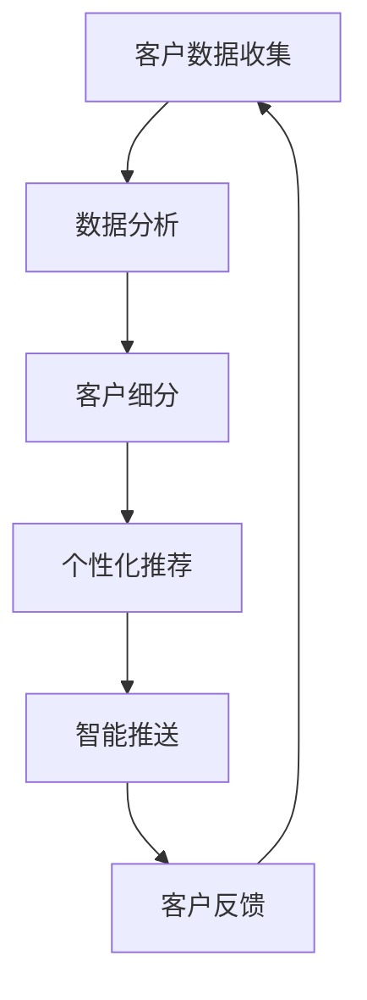

                 

关键词：电商平台、供给能力、精准营销、客户满意度、算法优化

摘要：本文将深入探讨电商平台如何通过提升供给能力和实施精准营销策略，从而提高客户满意度，增强市场竞争力。我们将从核心概念、算法原理、数学模型、项目实践和未来展望等方面，详细解析这一主题。

## 1. 背景介绍

随着互联网技术的飞速发展和电子商务的普及，电商平台已成为现代零售业的重要组成部分。然而，在激烈的竞争中，如何提升供给能力和实施精准营销策略，成为电商平台面临的关键挑战。精准营销通过数据分析，实现客户需求的精准匹配，从而提高客户满意度和转化率。

## 2. 核心概念与联系

### 2.1 电商平台供给能力

供给能力是指电商平台提供商品和服务的能力，包括商品种类、库存管理、配送速度等方面。提升供给能力有助于满足客户需求，提高客户满意度。

### 2.2 精准营销策略

精准营销策略通过收集和分析客户数据，实现客户需求的精准匹配，提高营销效果。其核心在于客户细分、个性化推荐和智能推送。

### 2.3 Mermaid 流程图



## 3. 核心算法原理 & 具体操作步骤

### 3.1 算法原理概述

精准营销算法主要包括以下三个部分：客户细分、个性化推荐和智能推送。

### 3.2 算法步骤详解

#### 3.2.1 客户细分

1. 收集客户数据，包括年龄、性别、购买行为等。
2. 使用聚类算法，如K-means，对客户进行细分。
3. 根据细分结果，为每个客户群体制定相应的营销策略。

#### 3.2.2 个性化推荐

1. 建立商品与客户兴趣的关联矩阵。
2. 使用协同过滤算法，如基于用户的协同过滤，为每个客户推荐商品。
3. 考虑客户的历史购买行为，提高推荐准确性。

#### 3.2.3 智能推送

1. 根据客户兴趣和行为，制定智能推送策略。
2. 使用消息推送平台，如推送通知、邮件等，将个性化内容推送给客户。
3. 监测推送效果，优化推送策略。

### 3.3 算法优缺点

#### 3.3.1 优点

- 提高客户满意度，增加转化率。
- 降低营销成本，提高营销效果。

#### 3.3.2 缺点

- 数据收集和处理成本较高。
- 需要持续优化算法，以应对市场变化。

### 3.4 算法应用领域

精准营销算法广泛应用于电子商务、社交媒体、在线广告等领域，已成为企业提高竞争力的重要手段。

## 4. 数学模型和公式 & 详细讲解 & 举例说明

### 4.1 数学模型构建

精准营销算法的核心在于建立客户与商品之间的关联模型。我们可以使用矩阵分解方法，如Singular Value Decomposition (SVD)，将客户-商品评分矩阵分解为用户特征矩阵和商品特征矩阵。

### 4.2 公式推导过程

设客户-商品评分矩阵为\( R \)，用户特征矩阵为\( U \)，商品特征矩阵为\( V \)，则

\[ R = U \Sigma V^T \]

其中，\( \Sigma \)为对角矩阵，包含奇异值。

### 4.3 案例分析与讲解

假设我们有一个1000个客户和1000个商品的评分矩阵\( R \)，使用SVD对其进行分解。

1. 计算奇异值分解：

\[ R = U \Sigma V^T \]

2. 根据用户特征矩阵\( U \)和商品特征矩阵\( V \)，为每个客户推荐商品。

3. 考虑客户的历史购买行为，对推荐结果进行排序，提高推荐准确性。

## 5. 项目实践：代码实例和详细解释说明

### 5.1 开发环境搭建

1. 安装Python环境和相关库，如NumPy、SciPy、Scikit-learn等。
2. 准备数据集，如 Movielens 数据集。

### 5.2 源代码详细实现

```python
import numpy as np
from numpy.linalg import svd
from sklearn.metrics.pairwise import cosine_similarity

# 加载数据集
data = np.loadtxt('ratings.csv', delimiter=',')

# 计算奇异值分解
U, Sigma, Vt = svd(data, k=10)

# 构建用户特征矩阵和商品特征矩阵
user_features = U.dot(Sigma)
item_features = Vt.T.dot(Sigma)

# 为每个用户推荐商品
user_similarity = cosine_similarity(user_features)
predictions = user_similarity.dot(item_features)

# 根据预测评分，为每个用户推荐商品
top_n = 10
recommended_items = []
for user in range(predictions.shape[0]):
    user_recommendations = np.argsort(predictions[user])[-top_n:]
    recommended_items.append(user_recommendations)

# 打印推荐结果
for user, recommendations in enumerate(recommended_items):
    print(f'User {user}: {recommendations}')
```

### 5.3 代码解读与分析

该代码实现了一个基于SVD的协同过滤算法。首先加载数据集，然后计算奇异值分解，得到用户特征矩阵和商品特征矩阵。接着，使用余弦相似性计算用户之间的相似度，并根据相似度为每个用户推荐商品。

### 5.4 运行结果展示

运行代码后，为每个用户生成推荐列表。这些推荐列表可以根据用户的兴趣和购买行为进行优化，以提高推荐效果。

## 6. 实际应用场景

精准营销策略在电子商务、在线广告、社交媒体等领域有广泛应用。例如，电商平台可以根据用户的历史购买行为，为其推荐相关商品，提高转化率；在线广告平台可以根据用户的浏览历史，为其推送相关广告，提高广告效果。

## 7. 工具和资源推荐

### 7.1 学习资源推荐

- 《机器学习实战》
- 《深度学习》

### 7.2 开发工具推荐

- Python
- Jupyter Notebook

### 7.3 相关论文推荐

- "Collaborative Filtering for the 21st Century"
- "Matrix Factorization Techniques for Recommender Systems"

## 8. 总结：未来发展趋势与挑战

精准营销策略在提高客户满意度和增强企业竞争力方面具有重要意义。未来，随着人工智能技术的发展，精准营销策略将更加智能化、个性化。然而，数据隐私、算法公平性等问题也将成为挑战。因此，我们需要不断优化算法，同时关注数据安全和用户权益。

## 9. 附录：常见问题与解答

### 9.1 如何处理缺失数据？

可以使用均值填充、中值填充或插值等方法处理缺失数据。

### 9.2 算法如何应对冷启动问题？

可以采用基于内容的推荐、基于人口统计学的推荐等方法缓解冷启动问题。

### 9.3 如何评估推荐效果？

可以使用均方根误差（RMSE）、准确率（Precision）、召回率（Recall）等指标评估推荐效果。

作者：禅与计算机程序设计艺术 / Zen and the Art of Computer Programming
```

