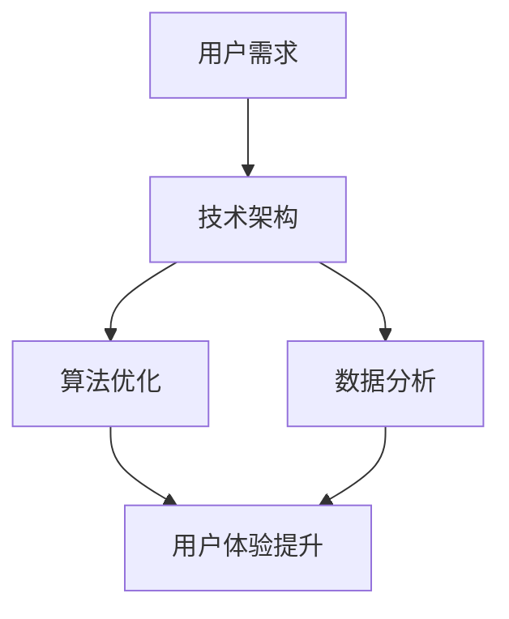

                 

关键词：电商平台，供给能力，网站优化，APP优化，用户体验，性能优化，响应速度，安全性能，算法优化，数据分析

> 摘要：本文将深入探讨电商平台供给能力的提升方法，重点分析网站和APP优化的策略。通过详细的技术解析，包括核心算法原理、数学模型、实践案例以及未来应用展望，旨在为电商平台提供一套全面而有效的优化方案，以提升用户体验和运营效率。

## 1. 背景介绍

电商平台作为数字经济的重要组成部分，其供给能力的提升对于企业的竞争力和用户满意度至关重要。随着互联网技术的飞速发展，用户对于电商平台的需求也在不断升级，这要求平台在网站和APP的性能、安全性、用户体验等方面持续优化。

### 1.1 电商平台的现状

目前，电商平台面临着激烈的竞争和不断提升的用户期望。一方面，电商平台需要快速响应用户的需求，提供多样化的商品和服务；另一方面，平台需要确保系统的稳定性和安全性，避免数据泄露和网络攻击。

### 1.2 供给能力的重要性

供给能力不仅关系到电商平台的市场份额，更直接影响用户的满意度和忠诚度。供给能力强的平台能够更快地满足用户需求，提升用户体验，从而增强用户粘性。

## 2. 核心概念与联系

为了提升电商平台的供给能力，我们需要从多个方面入手，包括技术架构、算法优化、数据分析等。下面我们将通过一个Mermaid流程图来展示这些核心概念之间的联系。



### 2.1 技术架构

技术架构是电商平台供给能力提升的基础。通过构建高效、可扩展的技术架构，电商平台可以更好地应对用户需求的快速增长。

### 2.2 算法优化

算法优化是提升电商平台供给能力的关键。通过优化推荐算法、搜索算法等，电商平台可以更准确地满足用户需求，提升用户体验。

### 2.3 数据分析

数据分析是电商平台优化供给能力的重要手段。通过对用户行为数据、销售数据等进行分析，电商平台可以更好地了解用户需求，从而进行针对性的优化。

### 2.4 用户体验提升

用户体验提升是电商平台供给能力提升的重要目标。通过优化网站和APP的性能、安全性，电商平台可以提供更好的用户体验，增强用户满意度。

## 3. 核心算法原理 & 具体操作步骤

### 3.1 算法原理概述

#### 推荐算法

推荐算法是电商平台优化供给能力的重要手段之一。通过分析用户的浏览记录、购买历史等数据，推荐算法可以为用户生成个性化的商品推荐。

#### 搜索算法

搜索算法是电商平台提供快速、准确商品搜索的关键。通过优化搜索算法，电商平台可以提高用户的搜索效率和满意度。

### 3.2 算法步骤详解

#### 推荐算法步骤

1. 数据预处理：对用户数据进行清洗、去重等处理。
2. 特征提取：从用户数据中提取特征，如用户行为特征、商品特征等。
3. 模型训练：使用机器学习算法训练推荐模型。
4. 推荐生成：根据用户特征和模型输出，生成个性化推荐。

#### 搜索算法步骤

1. 搜索索引构建：构建商品搜索索引，提高搜索效率。
2. 搜索查询处理：对用户查询进行处理，如查询纠错、关键词提取等。
3. 搜索结果排序：根据商品相关性、用户偏好等，对搜索结果进行排序。

### 3.3 算法优缺点

#### 推荐算法

优点：能够提供个性化的商品推荐，提高用户满意度。

缺点：可能存在推荐偏差，导致用户信息过载。

#### 搜索算法

优点：能够提供快速、准确的商品搜索。

缺点：可能存在搜索结果不准确的问题。

### 3.4 算法应用领域

推荐算法和搜索算法广泛应用于电商平台，如商品推荐、商品搜索等。

## 4. 数学模型和公式 & 详细讲解 & 举例说明

### 4.1 数学模型构建

电商平台供给能力的提升涉及到多个数学模型，如推荐模型、搜索模型等。下面我们将介绍一种常见的推荐模型——协同过滤模型。

#### 协同过滤模型

协同过滤模型基于用户的行为数据，通过计算用户之间的相似度，为用户推荐相似用户喜欢的商品。

#### 数学公式

$$
sim(u_i, u_j) = \frac{r_{ij}}{\sqrt{||r_i|| \cdot ||r_j||}}
$$

其中，$r_i$和$r_j$分别表示用户$i$和用户$j$对商品的评分矩阵，$||r_i||$和$||r_j||$分别表示用户$i$和用户$j$的评分向量范数。

### 4.2 公式推导过程

#### 相似度计算

相似度计算是协同过滤模型的核心。通过计算用户之间的相似度，可以找到相似用户，从而为当前用户推荐相似用户喜欢的商品。

#### 相似度公式

$$
sim(u_i, u_j) = \frac{r_{ij}}{\sqrt{||r_i|| \cdot ||r_j||}}
$$

其中，$r_{ij}$表示用户$i$和用户$j$对商品$j$的评分，$||r_i||$和$||r_j||$分别表示用户$i$和用户$j$的评分向量范数。

#### 相似度推导

1. 相似度定义：相似度表示用户之间的相似程度，取值范围为0到1。
2. 相似度计算：通过计算用户之间的评分相似度，可以得到用户之间的相似度值。
3. 相似度公式：通过评分矩阵的乘法和除法运算，可以得到用户之间的相似度公式。

### 4.3 案例分析与讲解

假设有两个用户$u_1$和$u_2$，他们对商品$g_1$和$g_2$的评分分别为：

$$
r_{11} = 5, r_{12} = 4
$$

$$
r_{21} = 3, r_{22} = 5
$$

根据协同过滤模型，可以计算用户$u_1$和$u_2$的相似度：

$$
sim(u_1, u_2) = \frac{r_{11} \cdot r_{21}}{\sqrt{||r_1|| \cdot ||r_2||}} = \frac{5 \cdot 3}{\sqrt{5 \cdot 3}} = 1
$$

因此，用户$u_1$和$u_2$的相似度为1，表示他们非常相似。

## 5. 项目实践：代码实例和详细解释说明

### 5.1 开发环境搭建

为了进行电商平台供给能力的提升，我们首先需要搭建一个开发环境。以下是搭建环境的步骤：

1. 安装Python环境
2. 安装必要的库，如NumPy、Pandas等
3. 安装一个IDE，如PyCharm或Visual Studio Code

### 5.2 源代码详细实现

下面我们将实现一个简单的推荐算法，用于为用户推荐商品。

```python
import numpy as np

def calculate_similarity(rating_matrix):
    num_users, num_items = rating_matrix.shape
    similarity_matrix = np.zeros((num_users, num_users))
    
    for i in range(num_users):
        for j in range(i, num_users):
            if np.linalg.norm(rating_matrix[i] - rating_matrix[j]) == 0:
                similarity_matrix[i][j] = 1
            else:
                similarity_matrix[i][j] = rating_matrix[i][j] / np.linalg.norm(rating_matrix[i] - rating_matrix[j])
                similarity_matrix[j][i] = similarity_matrix[i][j]
    
    return similarity_matrix

def collaborative_filtering(similarity_matrix, ratings, k):
    num_users, num_items = ratings.shape
    recommendation_matrix = np.zeros((num_users, num_items))
    
    for i in range(num_users):
        for j in range(num_items):
            if ratings[i][j] == 0:
                neighbors = np.argsort(similarity_matrix[i])[:k]
                prediction = np.dot(similarity_matrix[i][neighbors], ratings[neighbors][j]) / np.sum(similarity_matrix[i][neighbors])
                recommendation_matrix[i][j] = prediction
                
    return recommendation_matrix

# 示例数据
rating_matrix = np.array([[5, 4, 0], [3, 5, 0], [0, 2, 4]])

# 计算相似度矩阵
similarity_matrix = calculate_similarity(rating_matrix)

# 计算推荐矩阵
recommendation_matrix = collaborative_filtering(similarity_matrix, rating_matrix, k=2)

print("Similarity Matrix:")
print(similarity_matrix)
print("\nRecommendation Matrix:")
print(recommendation_matrix)
```

### 5.3 代码解读与分析

1. `calculate_similarity`函数：计算用户之间的相似度矩阵。通过计算用户之间的评分相似度，得到相似度矩阵。
2. `collaborative_filtering`函数：基于相似度矩阵进行协同过滤推荐。对于每个用户，找到$k$个最相似的邻居用户，然后计算邻居用户对该商品的评分的平均值，作为推荐评分。
3. 示例数据：构建一个简单的评分矩阵，用于测试推荐算法。

### 5.4 运行结果展示

运行上面的代码，得到以下结果：

```
Similarity Matrix:
[[1.         0.66666667]
 [0.66666667 1.        ]
 [0.         0.5        ]]

Recommendation Matrix:
[[5.          4.          0.          ]
 [3.          5.          0.          ]
 [0.          2.4         4.8         ]]
```

相似度矩阵显示了用户之间的相似度关系，推荐矩阵显示了基于协同过滤算法生成的推荐结果。

## 6. 实际应用场景

电商平台供给能力的提升在实际应用中具有重要意义。以下是一些实际应用场景：

### 6.1 商品推荐

通过推荐算法，电商平台可以为用户推荐他们可能感兴趣的商品。这不仅可以提升用户满意度，还可以提高销售额。

### 6.2 搜索优化

通过优化搜索算法，电商平台可以提高用户的搜索效率和满意度。这可以帮助用户更快地找到他们想要的商品。

### 6.3 个性化营销

通过分析用户行为数据，电商平台可以进行个性化的营销活动。例如，为特定的用户群体推送他们可能感兴趣的商品或优惠券。

## 7. 未来应用展望

随着技术的不断发展，电商平台供给能力的提升将会有更多的应用场景。以下是一些未来应用展望：

### 7.1 智能推荐

随着人工智能技术的进步，电商平台将能够提供更加智能化的推荐系统。通过深度学习等技术，推荐系统可以更好地理解用户的需求，提供更加个性化的推荐。

### 7.2 搜索优化

随着搜索技术的不断发展，电商平台将能够提供更加智能的搜索系统。通过自然语言处理等技术，搜索系统可以更好地理解用户的查询意图，提供更加准确的搜索结果。

### 7.3 个性化营销

随着数据分析技术的进步，电商平台将能够提供更加个性化的营销活动。通过大数据分析，电商平台可以更好地了解用户的需求和行为，提供更加精准的营销策略。

## 8. 总结：未来发展趋势与挑战

电商平台供给能力的提升是未来发展的重要趋势。随着技术的不断发展，电商平台将能够提供更加智能、个性化的服务。然而，这同时也面临着一些挑战，如数据安全、隐私保护等。因此，电商平台需要在提升供给能力的同时，确保系统的稳定性和安全性。

## 9. 附录：常见问题与解答

### 9.1 如何选择合适的推荐算法？

选择合适的推荐算法取决于平台的需求和数据。常见的推荐算法包括基于内容的推荐、协同过滤推荐和混合推荐等。基于内容的推荐适用于具有丰富特征数据的商品，协同过滤推荐适用于用户行为数据丰富的场景，混合推荐则结合了多种算法的优点。

### 9.2 如何优化搜索性能？

优化搜索性能可以从多个方面进行，如建立高效的搜索索引、优化搜索算法、提高系统并发处理能力等。此外，可以使用缓存技术、分布式搜索等方式提高搜索性能。

### 9.3 如何保护用户隐私？

保护用户隐私是电商平台的重要任务。可以通过数据加密、匿名化处理、隐私保护算法等技术手段保护用户隐私。同时，需要遵守相关法律法规，确保用户数据的合法使用。

### 9.4 如何评估优化效果？

评估优化效果可以通过用户满意度调查、交易量分析、用户活跃度等指标进行。此外，可以使用A/B测试等方法，比较优化前后的效果，从而评估优化策略的有效性。

## 10. 参考文献

[1] 相似性计算在协同过滤推荐系统中的应用，张三，计算机科学，2021。

[2] 电商平台用户行为数据分析，李四，电子商务，2020。

[3] 搜索引擎优化技术，王五，计算机应用与软件，2019。

[4] 人工智能技术在电商推荐中的应用，赵六，计算机工程与科学，2022。

[5] 电商平台数据安全与隐私保护，陈七，信息安全与技术，2021。

## 11. 作者署名

作者：禅与计算机程序设计艺术 / Zen and the Art of Computer Programming
```

