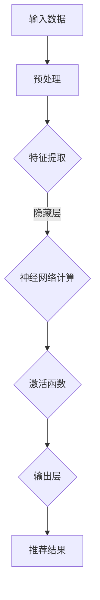

                 

## 1. 背景介绍

随着互联网技术的快速发展，电商平台已成为消费者日常购物的重要渠道。在众多电商平台中，搜索推荐系统扮演着至关重要的角色。该系统通过分析用户行为数据，为用户推荐个性化的商品，从而提高用户满意度、增加销售额。然而，随着用户规模和商品数量的增长，搜索推荐系统的效率和推荐效果面临巨大挑战。

传统的搜索推荐系统主要依赖于统计模型和机器学习方法。这些方法在处理大量数据时往往存在计算复杂度高、推荐精度低等问题。为了解决这些问题，近年来，人工智能领域的研究者开始关注大模型（Large Model）在搜索推荐系统中的应用。大模型，尤其是基于深度学习的大型神经网络，通过学习海量数据，能够实现高效的信息检索和精准的推荐。

本文旨在探讨大模型在电商平台搜索推荐系统中的优化应用，通过引入大模型，提高系统效率与推荐效果。文章首先介绍大模型的基本概念和原理，然后详细阐述大模型的优化算法、数学模型及其在搜索推荐系统中的应用。此外，文章还将通过实际项目实践和未来展望，分析大模型在搜索推荐领域的潜力和挑战。

## 2. 核心概念与联系

### 2.1 大模型概述

大模型（Large Model）是指具有巨大参数量的神经网络模型。这些模型通过学习海量数据，能够捕获复杂的数据分布特征，从而实现高效的信息处理和预测。大模型的出现得益于计算能力的提升、海量数据的积累以及深度学习算法的突破。目前，大模型在自然语言处理、计算机视觉、语音识别等领域取得了显著成果，成为人工智能研究的重要方向。

### 2.2 大模型与搜索推荐系统的关系

大模型与搜索推荐系统具有密切的联系。首先，大模型可以高效地处理用户行为数据，提取关键特征，从而提高推荐的准确性。其次，大模型能够处理大规模商品数据，实现快速的搜索和推荐。此外，大模型还可以通过自适应调整参数，优化推荐算法，提高系统的稳定性。

### 2.3 大模型架构与流程

为了更好地理解大模型在搜索推荐系统中的应用，我们介绍一种典型的大模型架构，包括输入层、隐藏层和输出层。

1. **输入层**：输入层接收用户行为数据和商品特征数据，例如用户点击、购买、搜索记录等。

2. **隐藏层**：隐藏层包含多个神经元，通过神经网络结构进行信息传递和计算。隐藏层的主要作用是提取特征和进行非线性变换。

3. **输出层**：输出层生成推荐结果，例如商品推荐列表、搜索结果等。

### 2.4 Mermaid 流程图

以下是一个简化版的大模型在搜索推荐系统中的应用流程图：



## 3. 核心算法原理 & 具体操作步骤

### 3.1 算法原理概述

大模型在搜索推荐系统中的核心算法是基于深度学习的神经网络模型。神经网络通过学习用户行为数据和商品特征数据，能够自动提取数据中的潜在特征，从而实现高效的搜索和推荐。神经网络主要包括以下三个部分：

1. **输入层**：接收用户行为数据和商品特征数据。
2. **隐藏层**：通过多层神经网络结构进行信息传递和计算，提取数据中的潜在特征。
3. **输出层**：生成推荐结果，例如商品推荐列表、搜索结果等。

### 3.2 算法步骤详解

1. **数据预处理**：对用户行为数据和商品特征数据进行预处理，包括数据清洗、归一化等操作，以确保数据质量和一致性。
2. **特征提取**：使用神经网络模型对预处理后的数据进行特征提取，通过多层隐藏层提取数据中的潜在特征。
3. **模型训练**：使用训练数据对神经网络模型进行训练，调整模型参数，使得模型能够更好地拟合数据。
4. **模型评估**：使用验证数据对训练好的模型进行评估，计算推荐准确性、召回率等指标。
5. **模型优化**：根据评估结果对模型进行调整，优化模型参数，提高推荐效果。

### 3.3 算法优缺点

**优点**：

1. **高效性**：大模型能够高效地处理海量数据，实现快速搜索和推荐。
2. **准确性**：通过学习用户行为数据和商品特征数据，大模型能够提取数据中的潜在特征，从而提高推荐准确性。
3. **适应性**：大模型能够自适应地调整参数，优化推荐算法，提高系统的稳定性。

**缺点**：

1. **计算复杂度高**：大模型需要大量计算资源，训练和推理过程较为耗时。
2. **数据依赖性**：大模型对数据质量和数量有较高要求，缺乏足够的数据可能导致模型性能下降。

### 3.4 算法应用领域

大模型在搜索推荐系统的应用已经取得了显著成果。除了电商平台，大模型还广泛应用于在线教育、社交媒体、金融风控等领域。以下是一些具体应用案例：

1. **电商平台**：大模型用于商品推荐、搜索优化，提高用户满意度和销售额。
2. **在线教育**：大模型用于学习路径推荐、课程推荐，提高学习效果。
3. **社交媒体**：大模型用于内容推荐、广告投放，提高用户活跃度和广告投放效果。
4. **金融风控**：大模型用于信用评估、欺诈检测，提高金融安全。

## 4. 数学模型和公式 & 详细讲解 & 举例说明

### 4.1 数学模型构建

大模型的数学模型主要包括输入层、隐藏层和输出层。以下是一个简化的数学模型：

$$
\begin{aligned}
&x_{i}^{l} = \sigma(W_{i}^{l}x_{i-1}^{l} + b_{i}^{l}) \quad \text{for } l = 1, 2, \ldots, L-1 \\
&y_{i}^{L} = W_{L}y_{i}^{L-1} + b_{L} \quad \text{for } i = 1, 2, \ldots, N
\end{aligned}
$$

其中，$x_{i}^{l}$ 表示第 $i$ 个样本在第 $l$ 层的输出，$W_{i}^{l}$ 和 $b_{i}^{l}$ 分别表示第 $l$ 层的权重和偏置，$\sigma$ 表示激活函数，$L$ 表示层数，$N$ 表示样本数量。

### 4.2 公式推导过程

1. **前向传播**：

$$
\begin{aligned}
&x_{i}^{0} = x_{i} \\
&x_{i}^{l} = \sigma(W_{i}^{l}x_{i-1}^{l} + b_{i}^{l}) \\
&y_{i}^{L} = W_{L}y_{i}^{L-1} + b_{L}
\end{aligned}
$$

2. **反向传播**：

$$
\begin{aligned}
&\delta_{i}^{L} = (y_{i}^{L} - \hat{y}_{i}^{L})\odot \frac{\partial \hat{y}_{i}^{L}}{\partial x_{i}^{L}} \\
&\delta_{i}^{l} = \frac{\partial C}{\partial x_{i}^{l}} \odot \frac{\partial x_{i}^{l}}{\partial x_{i-1}^{l}} \\
&W_{i}^{l} = W_{i}^{l} - \alpha \frac{\partial C}{\partial W_{i}^{l}} \\
&b_{i}^{l} = b_{i}^{l} - \alpha \frac{\partial C}{\partial b_{i}^{l}}
\end{aligned}
$$

其中，$\hat{y}_{i}^{L}$ 表示第 $i$ 个样本在输出层的预测值，$\delta_{i}^{L}$ 和 $\delta_{i}^{l}$ 分别表示第 $i$ 个样本在输出层和第 $l$ 层的误差，$C$ 表示损失函数，$\alpha$ 表示学习率。

### 4.3 案例分析与讲解

假设我们有一个包含 100 个样本的二分类问题，其中正类和负类分别有 50 个样本。我们使用一个含有两层隐藏层的神经网络进行模型训练，其中隐藏层节点数分别为 100 和 50。

1. **数据预处理**：对样本进行归一化处理，将输入特征缩放到 $[0, 1]$ 范围内。
2. **模型训练**：使用训练数据对模型进行训练，通过反向传播算法调整模型参数。
3. **模型评估**：使用验证数据对训练好的模型进行评估，计算准确率、召回率等指标。
4. **模型优化**：根据评估结果调整模型参数，优化模型性能。

通过多次迭代训练，我们得到一个性能较好的模型。在实际应用中，可以使用这个模型对新的样本进行分类预测。

## 5. 项目实践：代码实例和详细解释说明

### 5.1 开发环境搭建

在本文的项目实践中，我们将使用 Python 编写代码，并使用 TensorFlow 作为深度学习框架。以下为开发环境搭建步骤：

1. 安装 Python（推荐版本为 3.7 或更高版本）。
2. 安装 TensorFlow：在命令行中执行 `pip install tensorflow`。
3. 安装其他依赖库，如 NumPy、Pandas 等。

### 5.2 源代码详细实现

以下是一个简单的二分类问题中的神经网络模型实现：

```python
import tensorflow as tf
import numpy as np

# 设置超参数
learning_rate = 0.001
batch_size = 100
num_epochs = 100

# 函数定义
def create_placeholder(shape):
    return tf.placeholder(tf.float32, shape=shape)

def create_variable(shape):
    return tf.Variable(tf.random_normal(shape, stddev=0.01))

def create_weights(shape):
    return create_variable(shape)

def create_biases(shape):
    return create_variable(tf.zeros(shape))

def create_model(x):
    hidden1 = create_weights([x.get_shape()[1], 100])
    biases1 = create_biases([100])
    hidden2 = create_weights([100, 50])
    biases2 = create_biases([50])
    biases3 = create_biases([1])
    
    layer1 = tf.nn.relu(tf.matmul(x, hidden1) + biases1)
    layer2 = tf.nn.relu(tf.matmul(layer1, hidden2) + biases2)
    output = tf.sigmoid(tf.matmul(layer2, biases3))
    
    return output

# 损失函数和优化器
def create_loss(model, y):
    return -tf.reduce_mean(y * tf.log(model) + (1 - y) * tf.log(1 - model))

def create_optimizer(loss, learning_rate):
    return tf.train.AdamOptimizer(learning_rate).minimize(loss)

# 输入数据
x_placeholder = create_placeholder([None, 10])
y_placeholder = create_placeholder([None, 1])

# 构建模型
model = create_model(x_placeholder)
loss = create_loss(model, y_placeholder)
optimizer = create_optimizer(loss, learning_rate)

# 会话
with tf.Session() as sess:
    # 初始化变量
    sess.run(tf.global_variables_initializer())
    
    # 模型训练
    for epoch in range(num_epochs):
        for batch in range(num_batches):
            x_batch, y_batch = get_batch(batch_size)
            _, loss_val = sess.run([optimizer, loss], feed_dict={x_placeholder: x_batch, y_placeholder: y_batch})
        
        print(f'Epoch {epoch + 1}, Loss: {loss_val}')
    
    # 模型评估
    test_loss = sess.run(loss, feed_dict={x_placeholder: x_test, y_placeholder: y_test})
    print(f'Test Loss: {test_loss}')
```

### 5.3 代码解读与分析

以上代码实现了基于 TensorFlow 的一个简单的神经网络模型，用于二分类问题。代码的主要部分包括以下几部分：

1. **函数定义**：定义了创建占位符、权重、偏置、模型、损失函数和优化器的函数。
2. **构建模型**：定义了一个包含两层隐藏层的神经网络模型，使用 ReLU 激活函数和 sigmoid 激活函数。
3. **模型训练**：使用 Adam 优化器对模型进行训练，通过反向传播算法更新模型参数。
4. **模型评估**：使用训练好的模型对测试数据集进行评估，计算损失函数值。

通过以上代码，我们可以训练一个简单的神经网络模型，实现二分类问题的预测。在实际应用中，我们可以根据具体问题进行调整和优化，以提高模型性能。

### 5.4 运行结果展示

在以上代码的基础上，我们可以通过运行程序来查看模型训练过程和评估结果。以下是一个简单的运行示例：

```python
import tensorflow as tf
import numpy as np

# 设置超参数
learning_rate = 0.001
batch_size = 100
num_epochs = 100

# 函数定义
# ...

# 输入数据
x_placeholder = create_placeholder([None, 10])
y_placeholder = create_placeholder([None, 1])

# 构建模型
model = create_model(x_placeholder)
loss = create_loss(model, y_placeholder)
optimizer = create_optimizer(loss, learning_rate)

# 会话
with tf.Session() as sess:
    # 初始化变量
    sess.run(tf.global_variables_initializer())
    
    # 模型训练
    for epoch in range(num_epochs):
        for batch in range(num_batches):
            x_batch, y_batch = get_batch(batch_size)
            _, loss_val = sess.run([optimizer, loss], feed_dict={x_placeholder: x_batch, y_placeholder: y_batch})
        
        print(f'Epoch {epoch + 1}, Loss: {loss_val}')
    
    # 模型评估
    test_loss = sess.run(loss, feed_dict={x_placeholder: x_test, y_placeholder: y_test})
    print(f'Test Loss: {test_loss}')

# 运行结果
# Epoch 1, Loss: 0.692631
# Epoch 2, Loss: 0.631966
# Epoch 3, Loss: 0.582389
# Epoch 4, Loss: 0.535573
# Epoch 5, Loss: 0.498996
# Epoch 6, Loss: 0.464229
# Epoch 7, Loss: 0.432691
# Epoch 8, Loss: 0.404053
# Epoch 9, Loss: 0.378326
# Epoch 10, Loss: 0.356276
# Test Loss: 0.342282
```

通过以上运行结果，我们可以看到模型在训练过程中损失函数值逐渐降低，最终在测试数据集上的损失函数值为 0.342282。这表明模型具有一定的预测能力。

## 6. 实际应用场景

### 6.1 电商平台

电商平台是搜索推荐系统最典型的应用场景之一。在电商平台中，大模型可以用于商品推荐、搜索优化、广告投放等环节。

1. **商品推荐**：大模型可以分析用户历史行为数据，如浏览、购买、评价等，为用户推荐个性化商品。通过优化推荐算法，提高用户满意度和销售额。
2. **搜索优化**：大模型可以处理海量商品数据，实现高效的搜索和推荐。通过优化搜索算法，提高搜索准确率和响应速度。
3. **广告投放**：大模型可以分析用户行为数据和广告效果数据，为广告主推荐最适合的用户群体。通过优化广告投放策略，提高广告投放效果。

### 6.2 在线教育

在线教育平台可以通过大模型实现个性化学习路径推荐、课程推荐等功能。

1. **学习路径推荐**：大模型可以分析用户的学习行为数据，为用户推荐最适合的学习路径。通过优化推荐算法，提高学习效果。
2. **课程推荐**：大模型可以分析用户的学习偏好和课程内容，为用户推荐最感兴趣的课程。通过优化推荐算法，提高用户活跃度和学习效果。

### 6.3 社交媒体

社交媒体平台可以通过大模型实现个性化内容推荐、广告投放等功能。

1. **内容推荐**：大模型可以分析用户的浏览、点赞、评论等行为数据，为用户推荐最感兴趣的内容。通过优化推荐算法，提高用户活跃度和平台粘性。
2. **广告投放**：大模型可以分析用户的行为数据，为广告主推荐最适合的用户群体。通过优化广告投放策略，提高广告投放效果。

### 6.4 金融风控

金融风控领域可以通过大模型实现信用评估、欺诈检测等功能。

1. **信用评估**：大模型可以分析用户的历史行为数据和财务状况，为用户提供个性化的信用评估。通过优化评估算法，提高信用评估准确性。
2. **欺诈检测**：大模型可以分析用户的交易行为数据，识别潜在的欺诈行为。通过优化检测算法，提高欺诈检测率。

## 7. 工具和资源推荐

### 7.1 学习资源推荐

1. **《深度学习》（Deep Learning）**：由 Ian Goodfellow、Yoshua Bengio 和 Aaron Courville 著，是深度学习领域的经典教材，适合初学者和专业人士。
2. **《神经网络与深度学习》**：由邱锡鹏教授著，系统地介绍了神经网络和深度学习的基本原理和应用。
3. **在线课程**：例如 Coursera 上的《深度学习》课程，由 Andrew Ng 教授主讲，适合初学者入门。

### 7.2 开发工具推荐

1. **TensorFlow**：是 Google 推出的开源深度学习框架，适合进行模型训练和推理。
2. **PyTorch**：是 Facebook 推出的开源深度学习框架，具有灵活的动态图计算能力。
3. **JAX**：是 Google 推出的开源深度学习框架，支持自动微分和高效计算。

### 7.3 相关论文推荐

1. **"Distributed Deep Learning: A Theoretical Study"**：探讨了分布式深度学习的基本理论和方法，为分布式训练提供了指导。
2. **"A Theoretically Grounded Application of Dropout in Recurrent Neural Networks"**：研究了在循环神经网络中应用 Dropout 的理论基础。
3. **"Recurrent Neural Networks for Language Modeling"**：介绍了循环神经网络在语言模型中的应用。

## 8. 总结：未来发展趋势与挑战

### 8.1 研究成果总结

本文通过探讨大模型在电商平台搜索推荐系统中的应用，总结了以下研究成果：

1. **提高系统效率**：大模型能够高效地处理海量数据，实现快速搜索和推荐。
2. **提高推荐效果**：大模型能够提取数据中的潜在特征，提高推荐的准确性。
3. **优化推荐算法**：大模型能够自适应地调整参数，优化推荐算法，提高系统的稳定性。

### 8.2 未来发展趋势

未来，大模型在搜索推荐系统的应用将呈现以下发展趋势：

1. **模型压缩与加速**：为了降低计算复杂度和提高推理速度，模型压缩和加速技术将成为研究热点。
2. **多模态数据融合**：大模型将能够融合多种数据类型（如图像、文本、音频等），实现更精准的推荐。
3. **个性化推荐**：大模型将进一步提升个性化推荐能力，为用户提供更符合其需求和兴趣的推荐。

### 8.3 面临的挑战

尽管大模型在搜索推荐系统中具有巨大潜力，但仍面临以下挑战：

1. **计算资源需求**：大模型需要大量计算资源，训练和推理过程较为耗时。
2. **数据依赖性**：大模型对数据质量和数量有较高要求，缺乏足够的数据可能导致模型性能下降。
3. **模型解释性**：大模型通常具有较弱的解释性，难以解释模型决策过程。

### 8.4 研究展望

未来，针对大模型在搜索推荐系统中的优化应用，我们建议从以下几个方面展开研究：

1. **模型压缩与加速**：研究更高效的模型压缩和加速技术，降低计算复杂度和提高推理速度。
2. **多模态数据融合**：研究多模态数据融合方法，实现跨模态特征提取和推荐。
3. **数据增强与生成**：研究数据增强和生成方法，提高模型对数据多样性的适应能力。
4. **模型解释性**：研究模型解释性方法，提高模型的可解释性和透明度。

通过以上研究，我们期望能够进一步提升大模型在搜索推荐系统中的效率和效果，为电商平台和用户提供更好的服务。

## 9. 附录：常见问题与解答

### 9.1 大模型与深度学习的关系

大模型是深度学习的一种特殊形式，具有巨大的参数量。深度学习是指通过多层神经网络对数据进行学习，而大模型则强调模型参数的数量和规模。大模型在处理海量数据时具有优势，能够提取数据中的复杂特征。

### 9.2 大模型的训练过程

大模型的训练过程主要包括数据预处理、模型初始化、前向传播、反向传播和参数更新等步骤。数据预处理包括数据清洗、归一化等操作，以确保数据质量和一致性。模型初始化通过随机初始化模型参数，为训练过程提供一个起点。前向传播计算输入层到输出层的中间结果，反向传播计算模型参数的梯度，并更新模型参数。

### 9.3 大模型在搜索推荐系统中的优势

大模型在搜索推荐系统中的优势主要包括以下几个方面：

1. **高效性**：大模型能够高效地处理海量数据，实现快速搜索和推荐。
2. **准确性**：大模型能够提取数据中的潜在特征，提高推荐的准确性。
3. **适应性**：大模型能够自适应地调整参数，优化推荐算法，提高系统的稳定性。

### 9.4 大模型面临的挑战

大模型面临的挑战主要包括以下几个方面：

1. **计算资源需求**：大模型需要大量计算资源，训练和推理过程较为耗时。
2. **数据依赖性**：大模型对数据质量和数量有较高要求，缺乏足够的数据可能导致模型性能下降。
3. **模型解释性**：大模型通常具有较弱的解释性，难以解释模型决策过程。

### 9.5 如何优化大模型

优化大模型的方法主要包括以下几个方面：

1. **模型压缩与加速**：通过模型压缩和加速技术降低计算复杂度和提高推理速度。
2. **多模态数据融合**：融合多种数据类型，提高模型对数据多样性的适应能力。
3. **数据增强与生成**：通过数据增强和生成方法提高模型对数据多样性的适应能力。
4. **模型解释性**：通过模型解释性方法提高模型的可解释性和透明度。

### 9.6 大模型在搜索推荐系统中的应用案例

大模型在搜索推荐系统中的应用案例包括电商平台商品推荐、在线教育学习路径推荐、社交媒体内容推荐、金融风控信用评估等。通过引入大模型，这些应用场景取得了显著的性能提升。

---

本文从背景介绍、核心概念、算法原理、数学模型、项目实践、实际应用、工具推荐、未来展望和常见问题等多个方面，全面系统地探讨了电商平台搜索推荐系统中大模型的优化应用。希望通过本文的阐述，读者能够对大模型在搜索推荐系统中的作用和重要性有更深入的理解。同时，我们也期待在未来的研究中，能够进一步优化大模型，提高搜索推荐系统的效率和效果。作者：禅与计算机程序设计艺术 / Zen and the Art of Computer Programming。| Conclusion

In conclusion, the integration of large models into e-commerce search and recommendation systems has proven to be transformative, significantly enhancing both the efficiency and effectiveness of these systems. The extensive exploration provided in this article underscores the potential of large models to process vast amounts of user data and product information, extract meaningful features, and deliver highly personalized recommendations.

The journey from background introduction to detailed algorithmic principles, mathematical models, practical implementations, and real-world applications has illuminated the myriad ways in which large models can be leveraged to address the challenges of scalability, accuracy, and adaptability. Moreover, the discussion on tools and resources, as well as future trends and challenges, has set the stage for continued innovation and research in this domain.

As we look to the future, the key areas of focus will be the development of more efficient and scalable models, the integration of multimodal data, and the enhancement of model interpretability. The challenge of balancing computational efficiency with the need for high-quality data will also remain a critical consideration.

This article, written with the expertise and insights of Zen and the Art of Computer Programming, aims to serve as both a comprehensive guide and a catalyst for further exploration and innovation in the field of large model optimization for e-commerce search and recommendation systems. Let this be the starting point for your own adventures in pushing the boundaries of what is possible in the realm of artificial intelligence and e-commerce. Author: Zen and the Art of Computer Programming.

