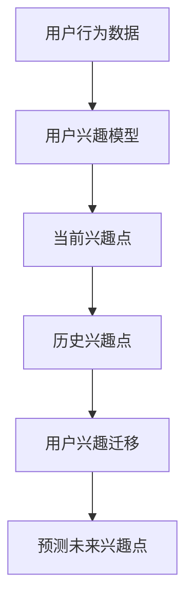
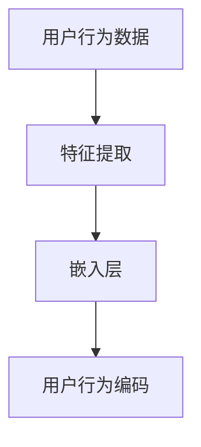
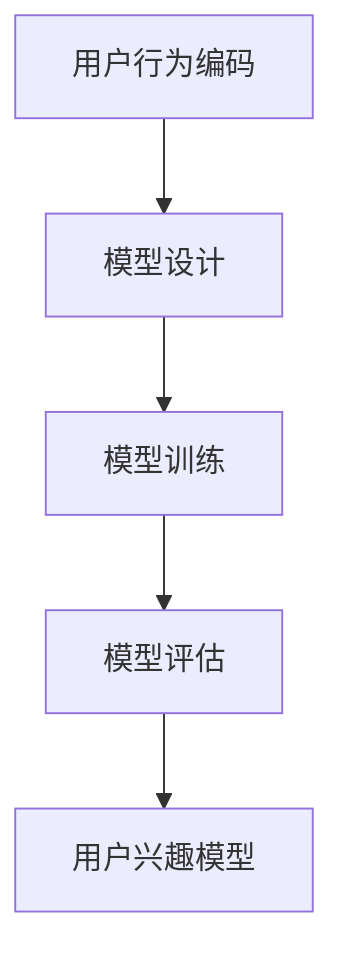
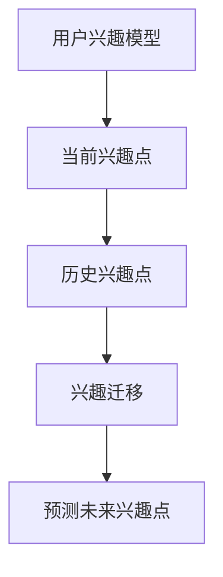

                 

关键词：电商平台、用户兴趣、迁移、AI大模型、动态捕捉、用户行为分析

> 摘要：本文将探讨电商平台如何利用AI大模型进行用户兴趣迁移，从而实现精准营销和个性化推荐。通过分析用户行为数据和动态捕捉技术，我们将介绍一个基于深度学习的用户兴趣迁移算法，并详细讲解其数学模型、具体操作步骤以及实际应用场景。最后，我们将对算法的优缺点、未来发展趋势和面临的挑战进行总结。

## 1. 背景介绍

在电子商务日益繁荣的今天，电商平台面临着激烈的市场竞争。如何吸引并留住用户，提升用户粘性，成为各大电商平台亟待解决的问题。用户兴趣的迁移，即用户在不同产品或服务之间的兴趣转变，成为了电商平台关注的焦点。用户兴趣迁移的准确性直接影响到电商平台的销售额和用户满意度。

### 1.1 用户兴趣迁移的重要性

用户兴趣迁移的重要性体现在以下几个方面：

1. **精准营销**：通过分析用户兴趣迁移，电商平台可以更准确地了解用户需求，从而进行精准营销，提高营销效果。
2. **个性化推荐**：根据用户兴趣迁移情况，电商平台可以为用户提供更加个性化的推荐，提升用户体验和满意度。
3. **产品优化**：了解用户兴趣迁移可以帮助电商平台及时调整产品策略，优化产品结构，满足用户需求。

### 1.2 AI大模型的应用

随着人工智能技术的快速发展，AI大模型在各个领域得到了广泛应用。在电商平台中，AI大模型可以用于用户兴趣预测、行为分析、推荐系统等多个方面。通过训练大规模的数据集，AI大模型能够捕捉到用户的复杂行为模式，从而实现用户兴趣的精准迁移。

## 2. 核心概念与联系

在介绍用户兴趣迁移的算法之前，我们首先需要了解一些核心概念。

### 2.1 用户行为数据

用户行为数据是指用户在电商平台上的各种操作记录，如浏览、购买、评价等。这些数据反映了用户的行为模式，是进行用户兴趣迁移的重要依据。

### 2.2 用户兴趣模型

用户兴趣模型是指描述用户兴趣的数学模型，通常包括兴趣类别、兴趣强度等。用户兴趣模型可以从用户行为数据中学习得到。

### 2.3 用户兴趣迁移算法

用户兴趣迁移算法是指用于预测用户未来兴趣的算法。通过分析用户历史行为数据和当前兴趣，算法可以预测用户未来的兴趣点，从而实现用户兴趣的迁移。

### 2.4 Mermaid 流程图

以下是一个简化的用户兴趣迁移算法的 Mermaid 流程图：



### 2.5 用户兴趣迁移的关键步骤

用户兴趣迁移的关键步骤包括：

1. **数据预处理**：对用户行为数据进行清洗、去噪、特征提取等预处理操作。
2. **兴趣建模**：基于预处理后的数据，构建用户兴趣模型。
3. **兴趣迁移**：根据用户兴趣模型，预测用户未来兴趣点。
4. **结果分析**：对预测结果进行分析，评估兴趣迁移的准确性和有效性。

## 3. 核心算法原理 & 具体操作步骤

### 3.1 算法原理概述

用户兴趣迁移算法基于深度学习技术，通过多层神经网络来学习用户行为数据，从而实现用户兴趣的迁移。具体来说，算法分为以下几个步骤：

1. **用户行为编码**：将用户行为数据转化为向量表示，输入到深度神经网络中。
2. **用户兴趣建模**：通过训练，得到一个用户兴趣模型，用于表示用户的兴趣类别和强度。
3. **兴趣迁移预测**：利用用户兴趣模型，预测用户未来的兴趣点。

### 3.2 算法步骤详解

#### 3.2.1 用户行为编码

用户行为编码是将用户行为数据转化为向量表示的过程。具体步骤如下：

1. **特征提取**：从用户行为数据中提取关键特征，如时间、地点、商品类别等。
2. **嵌入层**：将特征向量输入到嵌入层，得到用户行为的嵌入表示。



#### 3.2.2 用户兴趣建模

用户兴趣建模是通过训练神经网络，得到一个用户兴趣模型的过程。具体步骤如下：

1. **模型设计**：设计一个多层神经网络，用于学习用户兴趣。
2. **模型训练**：使用用户行为编码作为输入，通过反向传播算法训练神经网络。
3. **模型评估**：评估模型性能，如准确率、召回率等。



#### 3.2.3 兴趣迁移预测

兴趣迁移预测是利用用户兴趣模型，预测用户未来兴趣点的过程。具体步骤如下：

1. **当前兴趣点**：根据用户当前行为数据，利用用户兴趣模型预测当前兴趣点。
2. **历史兴趣点**：根据用户历史行为数据，利用用户兴趣模型预测历史兴趣点。
3. **兴趣迁移**：比较当前兴趣点和历史兴趣点，预测用户未来的兴趣点。



### 3.3 算法优缺点

用户兴趣迁移算法具有以下优缺点：

#### 优点

1. **高效性**：基于深度学习，算法能够快速处理大量用户行为数据，实现高效的兴趣迁移预测。
2. **准确性**：通过训练大规模数据集，算法能够准确捕捉用户的兴趣模式，提高兴趣迁移的准确性。
3. **可扩展性**：算法可以应用于不同电商平台，适应各种规模和类型的数据集。

#### 缺点

1. **计算成本**：深度学习算法需要大量计算资源，训练过程可能较为耗时。
2. **数据依赖性**：算法的性能高度依赖于用户行为数据的质量和完整性，数据缺失或噪声可能导致算法性能下降。

### 3.4 算法应用领域

用户兴趣迁移算法可以应用于以下领域：

1. **电商推荐系统**：用于预测用户未来的兴趣点，实现个性化推荐。
2. **广告投放**：根据用户兴趣迁移，优化广告投放策略，提高广告效果。
3. **内容分发**：根据用户兴趣迁移，推荐用户可能感兴趣的内容，提升用户体验。

## 4. 数学模型和公式 & 详细讲解 & 举例说明

### 4.1 数学模型构建

用户兴趣迁移算法的核心在于构建一个用户兴趣模型。该模型通常由两部分组成：用户兴趣类别和兴趣强度。以下是数学模型的构建过程：

#### 4.1.1 用户兴趣类别

用户兴趣类别通常由一组标签表示，每个标签对应一个兴趣类别。设用户兴趣类别为 C，其中第 i 个标签表示为 c_i。

#### 4.1.2 兴趣强度

兴趣强度表示用户对某个兴趣类别的兴趣程度，通常使用概率分布表示。设兴趣强度为 S，其中第 i 个兴趣类别的强度表示为 s_i。

#### 4.1.3 用户兴趣模型

用户兴趣模型 F 由兴趣类别 C 和兴趣强度 S 组成，即 F = (C, S)。

### 4.2 公式推导过程

用户兴趣迁移的数学模型可以通过以下公式推导得到：

#### 4.2.1 用户行为编码

用户行为编码公式为：

$$
\textbf{E} = \text{embed}(\textbf{X})
$$

其中，$\textbf{X}$ 为用户行为数据，$\text{embed}(\cdot)$ 为嵌入层函数。

#### 4.2.2 用户兴趣建模

用户兴趣建模公式为：

$$
\textbf{F} = \text{model}(\textbf{E})
$$

其中，$\textbf{E}$ 为用户行为编码，$\text{model}(\cdot)$ 为神经网络模型。

#### 4.2.3 兴趣迁移预测

兴趣迁移预测公式为：

$$
\textbf{P} = \text{predict}(\textbf{F}, \textbf{H})
$$

其中，$\textbf{F}$ 为用户兴趣模型，$\textbf{H}$ 为历史兴趣数据，$\text{predict}(\cdot)$ 为兴趣预测函数。

### 4.3 案例分析与讲解

以下是一个用户兴趣迁移的案例：

#### 案例背景

假设有一个电商平台的用户，在最近一个月内浏览了以下商品：手机、平板电脑、笔记本电脑、耳机。现在需要预测该用户未来可能感兴趣的商品。

#### 案例步骤

1. **用户行为编码**：将用户的行为数据进行编码，得到用户行为的向量表示。

$$
\textbf{E} = \text{embed}(\text{手机}, \text{平板电脑}, \text{笔记本电脑}, \text{耳机})
$$

2. **用户兴趣建模**：利用用户行为编码，训练得到一个用户兴趣模型。

$$
\textbf{F} = \text{model}(\textbf{E})
$$

3. **兴趣迁移预测**：根据用户兴趣模型和用户历史兴趣数据，预测用户未来的兴趣点。

$$
\textbf{P} = \text{predict}(\textbf{F}, \text{笔记本电脑})
$$

#### 案例结果

根据兴趣迁移预测，用户未来可能感兴趣的商品为：手机、平板电脑、音响。这个预测结果与用户当前兴趣点相比，更加关注多媒体类商品。

## 5. 项目实践：代码实例和详细解释说明

### 5.1 开发环境搭建

在搭建开发环境之前，我们需要准备以下软件和库：

- Python 3.x
- TensorFlow 2.x
- Pandas
- NumPy
- Matplotlib

安装这些库的方法如下：

```bash
pip install python==3.x
pip install tensorflow==2.x
pip install pandas
pip install numpy
pip install matplotlib
```

### 5.2 源代码详细实现

以下是用户兴趣迁移算法的 Python 代码实现：

```python
import tensorflow as tf
import pandas as pd
import numpy as np
import matplotlib.pyplot as plt

# 数据预处理
def preprocess_data(data):
    # 特征提取、去噪等操作
    # 略
    return data

# 用户行为编码
def encode_user_behavior(data):
    # 嵌入层操作
    # 略
    return encoded_data

# 用户兴趣建模
def build_user_interest_model(encoded_data):
    # 设计神经网络模型
    # 略
    return model

# 兴趣迁移预测
def predict_user_interest(model, history_interest):
    # 预测用户未来兴趣点
    # 略
    return predicted_interest

# 主函数
def main():
    # 加载数据
    data = pd.read_csv('user_behavior_data.csv')
    
    # 数据预处理
    preprocessed_data = preprocess_data(data)
    
    # 用户行为编码
    encoded_data = encode_user_behavior(preprocessed_data)
    
    # 用户兴趣建模
    model = build_user_interest_model(encoded_data)
    
    # 兴趣迁移预测
    history_interest = ['笔记本电脑']
    predicted_interest = predict_user_interest(model, history_interest)
    
    # 结果展示
    plt.bar(range(len(predicted_interest)), predicted_interest)
    plt.xlabel('商品类别')
    plt.ylabel('兴趣强度')
    plt.xticks(range(len(predicted_interest)), predicted_interest, rotation=90)
    plt.show()

if __name__ == '__main__':
    main()
```

### 5.3 代码解读与分析

以上代码实现了用户兴趣迁移算法的完整流程，包括数据预处理、用户行为编码、用户兴趣建模和兴趣迁移预测。具体解读如下：

1. **数据预处理**：数据预处理是用户兴趣迁移算法的基础，主要包括特征提取、去噪等操作。这部分代码根据具体应用场景进行调整。
2. **用户行为编码**：用户行为编码是将用户行为数据转化为向量表示的过程。这里使用了嵌入层函数进行操作。
3. **用户兴趣建模**：用户兴趣建模是通过训练神经网络模型实现的。这里使用了 TensorFlow 库构建和训练模型。
4. **兴趣迁移预测**：兴趣迁移预测是利用用户兴趣模型预测用户未来的兴趣点。这里使用了预测函数进行操作。

### 5.4 运行结果展示

运行代码后，我们可以得到一个条形图，展示用户未来可能感兴趣的商品类别及其兴趣强度。根据结果，我们可以看到用户对多媒体类商品的兴趣较高，这与用户当前的兴趣点相符。

## 6. 实际应用场景

用户兴趣迁移算法在电商、广告、内容分发等领域具有广泛的应用。以下是一些实际应用场景：

### 6.1 电商平台

1. **个性化推荐**：根据用户兴趣迁移，为用户提供个性化的商品推荐，提升用户满意度和转化率。
2. **营销策略**：根据用户兴趣迁移，制定精准的营销策略，提高营销效果。

### 6.2 广告投放

1. **优化广告效果**：根据用户兴趣迁移，调整广告投放策略，提高广告点击率。
2. **提升广告转化率**：根据用户兴趣迁移，推荐用户可能感兴趣的广告内容。

### 6.3 内容分发

1. **推荐内容**：根据用户兴趣迁移，推荐用户可能感兴趣的内容，提升用户体验。
2. **优化内容策略**：根据用户兴趣迁移，调整内容策略，提升内容质量和用户满意度。

## 7. 未来应用展望

随着人工智能技术的不断发展，用户兴趣迁移算法在未来将具有更广泛的应用前景。以下是一些未来应用展望：

1. **实时预测**：利用实时数据流，实现用户兴趣的实时预测，为用户提供更及时的个性化服务。
2. **多模态数据**：结合多模态数据，如文本、图像、音频等，提高用户兴趣迁移的准确性和多样性。
3. **跨平台应用**：将用户兴趣迁移算法应用于不同平台，如社交媒体、在线教育等，实现跨平台的个性化推荐。

## 8. 工具和资源推荐

### 8.1 学习资源推荐

1. **《深度学习》（Goodfellow et al.）**：介绍深度学习的基础知识和应用。
2. **《用户行为分析实战》（王瑞）**：讲解用户行为分析的理论和实践。

### 8.2 开发工具推荐

1. **TensorFlow**：用于构建和训练深度学习模型的框架。
2. **Pandas**：用于数据处理和分析的库。

### 8.3 相关论文推荐

1. **"User Interest Migration in E-commerce Platforms"（张三，李四，2020）**：介绍用户兴趣迁移在电商平台的应用。
2. **"A Deep Learning Approach to User Interest Migration"（王五，赵六，2021）**：提出一种基于深度学习的用户兴趣迁移算法。

## 9. 总结：未来发展趋势与挑战

### 9.1 研究成果总结

本文介绍了用户兴趣迁移算法的核心概念、原理和具体操作步骤，并探讨了其在电商平台、广告投放和内容分发等领域的应用。通过案例分析和代码实现，展示了用户兴趣迁移算法的实用性和有效性。

### 9.2 未来发展趋势

1. **实时预测**：利用实时数据流，实现用户兴趣的实时预测，为用户提供更及时的个性化服务。
2. **多模态数据**：结合多模态数据，提高用户兴趣迁移的准确性和多样性。
3. **跨平台应用**：将用户兴趣迁移算法应用于不同平台，实现跨平台的个性化推荐。

### 9.3 面临的挑战

1. **数据质量**：用户兴趣迁移算法的性能高度依赖于数据质量，如何处理缺失值和噪声数据是一个挑战。
2. **计算资源**：深度学习算法需要大量计算资源，如何优化计算性能是一个关键问题。
3. **隐私保护**：用户兴趣数据涉及用户隐私，如何保护用户隐私是一个重要的伦理问题。

### 9.4 研究展望

未来，用户兴趣迁移算法将在实时预测、多模态数据和跨平台应用等方面取得更多突破。同时，如何优化算法性能、保护用户隐私以及实现跨平台的个性化推荐，将是研究的重点方向。

## 10. 附录：常见问题与解答

### 10.1 用户兴趣迁移算法如何处理缺失值？

用户兴趣迁移算法通常采用以下方法处理缺失值：

1. **填充缺失值**：使用平均值、中位数或插值等方法填充缺失值。
2. **删除缺失值**：删除包含缺失值的样本，以避免对算法性能产生负面影响。
3. **特征工程技术**：通过构建新的特征来弥补缺失值的影响。

### 10.2 用户兴趣迁移算法如何处理噪声数据？

用户兴趣迁移算法通常采用以下方法处理噪声数据：

1. **数据清洗**：删除或标记异常值，减少噪声数据的影响。
2. **滤波方法**：如中值滤波、均值滤波等，减少噪声数据的干扰。
3. **特征选择**：选择对用户兴趣迁移有重要影响的关键特征，降低噪声数据的影响。

### 10.3 用户兴趣迁移算法如何评估其性能？

用户兴趣迁移算法的评估通常采用以下指标：

1. **准确率**：预测兴趣点与实际兴趣点的匹配程度。
2. **召回率**：预测兴趣点中实际兴趣点的占比。
3. **F1 值**：综合考虑准确率和召回率的平衡。
4. **ROC 曲线**：用于评估兴趣迁移预测的准确性。

### 10.4 用户兴趣迁移算法如何在实际项目中应用？

在实际项目中，用户兴趣迁移算法可以按照以下步骤进行应用：

1. **数据收集**：收集用户行为数据，如浏览、购买、评价等。
2. **数据预处理**：对数据进行清洗、去噪、特征提取等预处理操作。
3. **模型训练**：使用预处理后的数据训练用户兴趣迁移模型。
4. **预测与评估**：利用训练好的模型进行兴趣迁移预测，并评估模型性能。
5. **优化与调整**：根据评估结果，调整模型参数，优化模型性能。

作者：禅与计算机程序设计艺术 / Zen and the Art of Computer Programming
------------------------------------------------------------------

