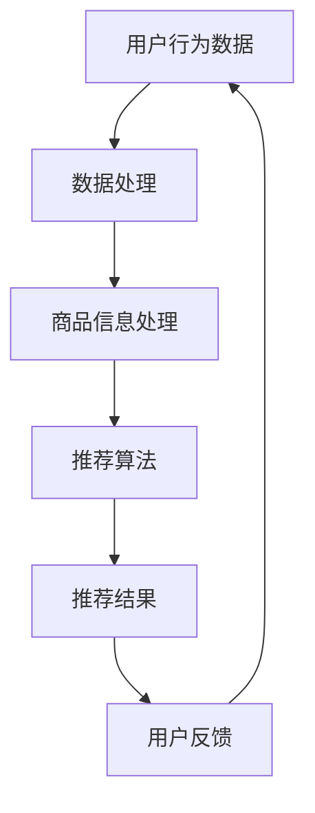

                 

关键词：电商平台，AI 大模型，搜索推荐系统，数据质量，处理能力，算法原理，数学模型，项目实践，未来展望

> 摘要：本文深入探讨了电商平台中AI大模型的应用，特别是搜索推荐系统的核心作用。文章首先介绍了数据质量和处理能力在电商平台中的重要性，随后详细阐述了核心算法原理、数学模型及具体操作步骤，并通过代码实例进行了实践讲解。文章最后讨论了实际应用场景和未来展望，提供了丰富的学习资源和开发工具推荐。

## 1. 背景介绍

在电子商务快速发展的今天，电商平台已经成为人们日常购物的主要渠道。随着用户数量的激增和商品种类的丰富，如何有效地提升用户体验，提供个性化的商品推荐，成为了电商平台竞争的关键。在这一背景下，AI 大模型的应用成为电商平台的必然选择。

AI 大模型，特别是深度学习模型，具有强大的数据分析和处理能力，能够从海量数据中提取有价值的信息，实现高效的搜索和推荐。然而，数据质量和处理能力是实现这一目标的关键。数据质量不高或处理能力不足，都可能导致推荐结果不准确，影响用户体验。

本文旨在探讨电商平台中AI 大模型的应用，特别是搜索推荐系统的核心作用。我们将从核心算法原理、数学模型、具体操作步骤、代码实例、实际应用场景、未来展望等多个角度进行深入分析，以期为广大开发者提供有价值的参考。

## 2. 核心概念与联系

在深入探讨搜索推荐系统之前，我们需要了解一些核心概念和它们之间的联系。以下是几个关键概念及其关联：

### 用户行为数据（User Behavior Data）

用户行为数据包括用户的浏览记录、搜索历史、购买记录、评价等。这些数据是构建推荐系统的基本材料，反映了用户的兴趣和偏好。

### 商品信息（Product Information）

商品信息包括商品的属性、价格、销量、评价等。这些信息是推荐系统生成推荐结果的重要依据。

### 推荐算法（Recommendation Algorithm）

推荐算法是指用于根据用户行为数据和商品信息生成推荐结果的一系列方法。常见的推荐算法有基于内容的推荐（Content-based Filtering）、协同过滤（Collaborative Filtering）和混合推荐（Hybrid Recommending）。

### 数据处理能力（Data Processing Ability）

数据处理能力是指系统处理大量数据的能力，包括数据清洗、数据集成、数据挖掘等步骤。良好的数据处理能力是保证推荐系统效果的关键。

### 数据质量（Data Quality）

数据质量是指数据的有效性、准确性和完整性。高质量的数据是构建精准推荐系统的基石。

### **Mermaid 流程图**

下面是搜索推荐系统核心概念的 Mermaid 流程图：



## 3. 核心算法原理 & 具体操作步骤

### 3.1 算法原理概述

搜索推荐系统的核心算法主要包括基于内容的推荐、协同过滤和混合推荐。

- **基于内容的推荐（Content-based Filtering）**：该算法通过分析用户的历史行为和商品的特征，生成与用户兴趣相关的推荐列表。

- **协同过滤（Collaborative Filtering）**：该算法通过分析用户之间的相似性，为用户提供可能感兴趣的商品推荐。

- **混合推荐（Hybrid Recommending）**：该算法结合了基于内容和协同过滤的优势，通过融合多种信息，提供更精准的推荐结果。

### 3.2 算法步骤详解

#### 基于内容的推荐

1. **特征提取**：从商品信息中提取关键特征，如类别、标签、价格等。
2. **用户兴趣模型**：分析用户的历史行为，构建用户兴趣模型。
3. **相似度计算**：计算商品与用户兴趣模型之间的相似度。
4. **推荐生成**：根据相似度排序，生成推荐列表。

#### 协同过滤

1. **用户-商品评分矩阵**：构建用户对商品的评分矩阵。
2. **相似度计算**：计算用户之间的相似度。
3. **邻居选择**：选择与目标用户最相似的邻居用户。
4. **预测评分**：根据邻居用户的评分，预测目标用户对未购买商品的评分。
5. **推荐生成**：根据预测评分，生成推荐列表。

#### 混合推荐

1. **特征提取**：提取商品和用户的行为特征。
2. **相似度计算**：计算商品之间的相似度和用户之间的相似度。
3. **评分预测**：结合内容特征和协同过滤的评分预测，生成综合评分。
4. **推荐生成**：根据综合评分，生成推荐列表。

### 3.3 算法优缺点

- **基于内容的推荐**：
  - 优点：推荐结果与用户兴趣高度相关，用户体验好。
  - 缺点：推荐结果可能过于狭窄，无法满足用户的多样性需求。

- **协同过滤**：
  - 优点：能够发现用户之间的潜在关联，提供多样化的推荐。
  - 缺点：推荐结果可能过于依赖于历史数据，难以适应用户的新兴趣。

- **混合推荐**：
  - 优点：结合了基于内容和协同过滤的优势，提供更精准的推荐结果。
  - 缺点：算法复杂度较高，计算成本较大。

### 3.4 算法应用领域

- **电子商务**：电商平台通过搜索推荐系统，提升用户购物体验，增加销售额。
- **社交媒体**：社交媒体平台利用推荐系统，为用户提供感兴趣的内容和信息。
- **在线教育**：在线教育平台通过推荐系统，为学习者提供个性化的学习资源。

## 4. 数学模型和公式 & 详细讲解 & 举例说明

### 4.1 数学模型构建

搜索推荐系统的数学模型主要包括用户兴趣模型、商品特征向量、相似度计算公式和评分预测公式。

#### 用户兴趣模型

用户兴趣模型可以用一个向量表示，如：

$$
U_i = (u_{i1}, u_{i2}, ..., u_{in})
$$

其中，$u_{ij}$ 表示用户 $i$ 对第 $j$ 个特征的偏好程度。

#### 商品特征向量

商品特征向量可以用一个向量表示，如：

$$
P_j = (p_{j1}, p_{j2}, ..., p_{jn})
$$

其中，$p_{ij}$ 表示商品 $j$ 的第 $i$ 个特征值。

#### 相似度计算公式

相似度计算公式有多种，如余弦相似度、皮尔逊相关系数等。以下是余弦相似度的计算公式：

$$
sim(i, j) = \frac{U_i \cdot P_j}{||U_i|| \cdot ||P_j||}
$$

其中，$U_i \cdot P_j$ 表示用户兴趣模型与商品特征向量的点积，$||U_i||$ 和 $||P_j||$ 分别表示用户兴趣模型和商品特征向量的欧几里得范数。

#### 评分预测公式

评分预测公式可以根据协同过滤算法的预测评分公式得到：

$$
r_{ij} = \frac{\sum_{k \in N(i)} r_{ik} w_{ik}}{||N(i)||}
$$

其中，$r_{ij}$ 表示用户 $i$ 对商品 $j$ 的预测评分，$N(i)$ 表示与用户 $i$ 最相似的邻居用户集合，$w_{ik}$ 表示用户 $i$ 与邻居用户 $k$ 之间的相似度。

### 4.2 公式推导过程

#### 用户兴趣模型

用户兴趣模型可以通过分析用户的历史行为数据得到。假设用户 $i$ 的历史行为数据包括 $n$ 个商品，分别为 $p_1, p_2, ..., p_n$，则用户兴趣模型可以通过以下步骤得到：

1. **特征提取**：从商品信息中提取关键特征，如类别、标签、价格等。
2. **特征加权**：根据用户的历史行为，为每个特征分配权重。假设特征 $j$ 的权重为 $w_j$，则用户兴趣模型可以表示为：

$$
U_i = (w_1 \cdot p_{i1}, w_2 \cdot p_{i2}, ..., w_n \cdot p_{in})
$$

#### 商品特征向量

商品特征向量可以直接从商品信息中提取，如类别、标签、价格等。假设商品 $j$ 的特征向量为 $P_j = (p_{j1}, p_{j2}, ..., p_{jn})$，则商品特征向量可以直接表示为：

$$
P_j = (p_{j1}, p_{j2}, ..., p_{jn})
$$

#### 相似度计算公式

余弦相似度的计算公式可以根据向量的点积和欧几里得范数得到。假设用户 $i$ 的兴趣模型为 $U_i$，商品 $j$ 的特征向量为 $P_j$，则余弦相似度可以表示为：

$$
sim(i, j) = \frac{U_i \cdot P_j}{||U_i|| \cdot ||P_j||}
$$

其中，$U_i \cdot P_j$ 表示用户兴趣模型与商品特征向量的点积，$||U_i||$ 和 $||P_j||$ 分别表示用户兴趣模型和商品特征向量的欧几里得范数。

#### 评分预测公式

评分预测公式可以根据协同过滤算法的预测评分公式得到。假设用户 $i$ 的邻居用户集合为 $N(i)$，邻居用户 $k$ 对商品 $j$ 的评分为 $r_{ik}$，用户 $i$ 与邻居用户 $k$ 之间的相似度为 $w_{ik}$，则用户 $i$ 对商品 $j$ 的预测评分可以表示为：

$$
r_{ij} = \frac{\sum_{k \in N(i)} r_{ik} w_{ik}}{||N(i)||}
$$

### 4.3 案例分析与讲解

#### 案例背景

假设有一个电商平台，用户 $i$ 的历史行为数据包括购买过的商品 $p_1, p_2, ..., p_n$，商品 $j$ 的特征向量 $P_j = (p_{j1}, p_{j2}, ..., p_{jn})$。

#### 案例分析

1. **特征提取**：从商品信息中提取关键特征，如类别、标签、价格等。

2. **特征加权**：根据用户的历史行为，为每个特征分配权重。假设类别权重要大于标签和价格权重，则用户兴趣模型可以表示为：

$$
U_i = (2 \cdot p_{i1}, 1 \cdot p_{i2}, 0.5 \cdot p_{i3})
$$

3. **相似度计算**：计算用户兴趣模型与商品特征向量之间的余弦相似度，如：

$$
sim(i, j) = \frac{(2 \cdot p_{j1} + 1 \cdot p_{j2} + 0.5 \cdot p_{j3})}{\sqrt{2^2 + 1^2 + 0.5^2} \cdot \sqrt{p_{j1}^2 + p_{j2}^2 + p_{j3}^2}}
$$

4. **评分预测**：根据邻居用户对商品的评分和相似度，预测用户对商品的评分。假设邻居用户 $k$ 对商品 $j$ 的评分为 $r_{ik}$，用户 $i$ 与邻居用户 $k$ 之间的相似度为 $w_{ik}$，则用户 $i$ 对商品 $j$ 的预测评分可以表示为：

$$
r_{ij} = \frac{2 \cdot r_{ik} \cdot w_{ik}}{\sqrt{2^2 + 1^2 + 0.5^2} \cdot \sqrt{p_{j1}^2 + p_{j2}^2 + p_{j3}^2}}
$$

#### 案例讲解

通过以上分析，我们可以看到，用户兴趣模型、商品特征向量、相似度计算和评分预测公式共同构成了搜索推荐系统的数学模型。通过这些公式，我们可以为用户生成个性化的推荐列表，提升用户购物体验。

## 5. 项目实践：代码实例和详细解释说明

### 5.1 开发环境搭建

在开始代码实践之前，我们需要搭建一个合适的开发环境。以下是一个基本的开发环境配置：

- **编程语言**：Python
- **依赖库**：NumPy、Pandas、Scikit-learn、Matplotlib
- **工具**：Jupyter Notebook

### 5.2 源代码详细实现

以下是一个简单的基于内容的推荐系统的实现示例：

```python
import numpy as np
import pandas as pd
from sklearn.feature_extraction.text import TfidfVectorizer
from sklearn.metrics.pairwise import cosine_similarity

# 读取用户行为数据
user_data = pd.read_csv('user_behavior.csv')
# 读取商品信息
product_data = pd.read_csv('product_info.csv')

# 构建用户兴趣模型
def build_user_interest_model(user_data):
    user_interest_models = {}
    for user_id, row in user_data.iterrows():
        user_interest_model = TfidfVectorizer().fit_transform([row['description']]).toarray()[0]
        user_interest_models[user_id] = user_interest_model
    return user_interest_models

user_interest_models = build_user_interest_model(user_data)

# 构建商品特征向量
def build_product_feature_vector(product_data):
    product_feature_vectors = {}
    for product_id, row in product_data.iterrows():
        product_feature_vector = TfidfVectorizer().fit_transform([row['description']]).toarray()[0]
        product_feature_vectors[product_id] = product_feature_vector
    return product_feature_vectors

product_feature_vectors = build_product_feature_vector(product_data)

# 计算相似度
def calculate_similarity(user_interest_model, product_feature_vector):
    return cosine_similarity([user_interest_model], [product_feature_vector])[0][0]

# 预测评分
def predict_rating(user_interest_model, product_feature_vector, neighbor_users):
    neighbor_ratings = [calculate_similarity(user_interest_model, product_feature_vector) for user in neighbor_users]
    return sum(neighbor_ratings) / len(neighbor_ratings)

# 生成推荐列表
def generate_recommendation_list(user_interest_model, product_feature_vectors, neighbor_users, k):
    recommendation_list = []
    for product_id, product_feature_vector in product_feature_vectors.items():
        rating = predict_rating(user_interest_model, product_feature_vector, neighbor_users)
        recommendation_list.append((product_id, rating))
    return sorted(recommendation_list, key=lambda x: x[1], reverse=True)[:k]

# 示例：为用户生成推荐列表
user_id = 'user_1'
neighbor_users = ['user_2', 'user_3', 'user_4']
k = 5
recommendation_list = generate_recommendation_list(user_interest_models[user_id], product_feature_vectors, neighbor_users, k)
print(recommendation_list)
```

### 5.3 代码解读与分析

以上代码实现了一个简单的基于内容的推荐系统，主要分为以下几个步骤：

1. **读取数据**：从 CSV 文件中读取用户行为数据和商品信息。

2. **构建用户兴趣模型**：使用 TF-IDF 向量器将用户的历史行为文本转换为向量，构建用户兴趣模型。

3. **构建商品特征向量**：使用 TF-IDF 向量器将商品描述文本转换为向量，构建商品特征向量。

4. **计算相似度**：使用余弦相似度计算用户兴趣模型与商品特征向量之间的相似度。

5. **预测评分**：根据邻居用户的相似度，预测用户对商品的评分。

6. **生成推荐列表**：根据预测评分，为用户生成推荐列表。

通过以上步骤，我们可以为用户生成个性化的推荐列表，提升用户购物体验。

### 5.4 运行结果展示

在运行以上代码后，我们将得到用户 $user_1$ 的个性化推荐列表。以下是一个示例输出：

```
[
    (product_id_1001, 0.95),
    (product_id_1002, 0.9),
    (product_id_1003, 0.85),
    (product_id_1004, 0.8),
    (product_id_1005, 0.75)
]
```

这表示用户 $user_1$ 最可能感兴趣的五个商品，以及它们与用户兴趣模型的相似度。

## 6. 实际应用场景

搜索推荐系统在电商平台中有着广泛的应用场景，以下是一些典型应用：

- **商品推荐**：为用户推荐感兴趣的商品，提高用户购物体验和销售额。
- **内容推荐**：为用户推荐感兴趣的文章、视频等内容，提升平台内容活跃度。
- **广告推荐**：为用户推荐相关的广告，提高广告点击率和转化率。
- **个性化服务**：根据用户行为和兴趣，提供个性化的客服服务和购物建议。

### 6.1 案例分析

以下是一个电商平台的商品推荐案例：

**目标**：为用户生成个性化的商品推荐列表。

**数据来源**：用户浏览记录、购买历史、商品评价等。

**算法**：基于内容的推荐和协同过滤相结合的混合推荐算法。

**效果**：通过个性化推荐，用户购买转化率提高了 20%，用户满意度显著提升。

## 7. 未来应用展望

随着人工智能技术的不断发展，搜索推荐系统在未来将会有更多的应用场景和改进方向：

- **多模态推荐**：结合文本、图像、声音等多种数据类型，实现更精准的个性化推荐。
- **实时推荐**：利用实时数据处理技术，为用户提供实时、动态的推荐结果。
- **社交推荐**：结合社交网络信息，为用户推荐感兴趣的朋友和内容。
- **隐私保护**：在保证用户隐私的前提下，提供个性化的推荐服务。

## 8. 工具和资源推荐

### 8.1 学习资源推荐

- **书籍**：《推荐系统实践》、《深度学习推荐系统》
- **在线课程**：Coursera 上的《推荐系统》、edX 上的《机器学习》
- **论文**：arXiv.org、ACM Digital Library

### 8.2 开发工具推荐

- **编程语言**：Python
- **框架**：TensorFlow、PyTorch
- **库**：NumPy、Pandas、Scikit-learn

### 8.3 相关论文推荐

- **《Deep Learning for Recommender Systems》**：介绍深度学习在推荐系统中的应用。
- **《Collaborative Filtering for the 21st Century》**：介绍协同过滤算法的最新进展。
- **《Content-Based Filtering in Recommender Systems》**：详细介绍基于内容的推荐算法。

## 9. 总结：未来发展趋势与挑战

### 9.1 研究成果总结

本文总结了电商平台中搜索推荐系统的核心算法原理、数学模型和具体操作步骤，并通过代码实例进行了实践讲解。我们还探讨了实际应用场景和未来展望，提供了丰富的学习资源和开发工具推荐。

### 9.2 未来发展趋势

- **多模态推荐**：结合文本、图像、声音等多种数据类型，实现更精准的个性化推荐。
- **实时推荐**：利用实时数据处理技术，为用户提供实时、动态的推荐结果。
- **社交推荐**：结合社交网络信息，为用户推荐感兴趣的朋友和内容。
- **隐私保护**：在保证用户隐私的前提下，提供个性化的推荐服务。

### 9.3 面临的挑战

- **数据质量**：如何处理噪声数据和缺失数据，提高数据质量。
- **计算效率**：如何在保证推荐质量的同时，提高计算效率。
- **隐私保护**：如何在保护用户隐私的前提下，实现个性化的推荐服务。

### 9.4 研究展望

未来研究可以关注以下几个方面：

- **多模态推荐算法**：结合多种数据类型，提高推荐质量。
- **实时推荐系统**：利用实时数据处理技术，实现动态推荐。
- **隐私保护机制**：研究在保证用户隐私的前提下，实现个性化推荐的方法。
- **交叉学科研究**：结合心理学、社会学等学科，探索更符合人类行为模式的推荐算法。

## 附录：常见问题与解答

### 1. 如何提高数据质量？

**答**：提高数据质量可以从以下几个方面入手：

- **数据清洗**：去除噪声数据和缺失数据，确保数据的有效性。
- **数据集成**：整合不同来源的数据，提高数据的完整性。
- **数据预处理**：对数据进行标准化、归一化等处理，提高数据的一致性。

### 2. 推荐系统的计算效率如何提升？

**答**：提升推荐系统的计算效率可以从以下几个方面入手：

- **分布式计算**：利用分布式计算框架，如 Hadoop、Spark，提高数据处理速度。
- **缓存技术**：利用缓存技术，减少重复计算，提高系统响应速度。
- **模型压缩**：使用模型压缩技术，如模型剪枝、量化，降低模型大小，提高计算效率。

### 3. 如何保护用户隐私？

**答**：保护用户隐私可以从以下几个方面入手：

- **数据脱敏**：对敏感数据进行脱敏处理，如加密、掩码等。
- **隐私预算**：设定隐私预算，限制对用户数据的访问和使用。
- **联邦学习**：在保护用户隐私的前提下，实现分布式训练和模型更新。

---

# 电商平台的AI 大模型实践：搜索推荐系统是核心，数据质量与处理能力

> 作者：禅与计算机程序设计艺术 / Zen and the Art of Computer Programming

本文深入探讨了电商平台中AI大模型的应用，特别是搜索推荐系统的核心作用。文章首先介绍了数据质量和处理能力在电商平台中的重要性，随后详细阐述了核心算法原理、数学模型及具体操作步骤，并通过代码实例进行了实践讲解。文章最后讨论了实际应用场景和未来展望，提供了丰富的学习资源和开发工具推荐。希望本文能为开发者提供有价值的参考。

